# Step 2: Adding Caching Layer - WhatsApp Messaging System

## What We're Adding in This Step

In Step 1, every request hit the database directly. This is **slow and expensive**:
- Database query: 50-100ms latency
- Database has limited capacity (10,000 writes/sec)
- Same data queried repeatedly (user profile, recent messages)

**Solution**: Add a **caching layer** using **Redis** to store frequently accessed data in memory.

**Result**: 80% of requests served from cache with 1-5ms latency (20x faster!)

---

## Architecture Diagram - Step 2

```mermaid
graph TB
    subgraph "Client Layer"
        Client1[📱 Mobile App]
        Client2[💻 Web Browser]
    end

    subgraph "Entry Point"
        LB[⚖️ Load Balancer<br/>Nginx]
    end

    subgraph "Application Layer"
        App1[🖥️ App Server 1<br/>Node.js]
        App2[🖥️ App Server 2<br/>Node.js]
        App3[🖥️ App Server 3<br/>Node.js]
    end

    subgraph "Caching Layer - NEW ✨"
        Redis1[⚡ Redis Cache 1<br/>In-Memory Store<br/>512 GB RAM]
        Redis2[⚡ Redis Cache 2<br/>Replica<br/>512 GB RAM]
        Redis3[⚡ Redis Cache 3<br/>Replica<br/>512 GB RAM]
    end

    subgraph "Data Layer"
        DB[(🗄️ Database<br/>PostgreSQL)]
    end

    Client1 -->|HTTPS| LB
    Client2 -->|HTTPS| LB

    LB --> App1
    LB --> App2
    LB --> App3

    App1 <-->|Cache Check<br/>1-5ms| Redis1
    App2 <-->|Cache Check<br/>1-5ms| Redis2
    App3 <-->|Cache Check<br/>1-5ms| Redis3

    App1 <-.->|If Cache Miss<br/>50-100ms| DB
    App2 <-.->|If Cache Miss<br/>50-100ms| DB
    App3 <-.->|If Cache Miss<br/>50-100ms| DB

    Redis1 -.->|Replication| Redis2
    Redis1 -.->|Replication| Redis3

    style Client1 fill:#E1F5FF
    style Client2 fill:#E1F5FF
    style LB fill:#FFF3E0
    style App1 fill:#F3E5F5
    style App2 fill:#F3E5F5
    style App3 fill:#F3E5F5
    style Redis1 fill:#FFCCBC
    style Redis2 fill:#FFCCBC
    style Redis3 fill:#FFCCBC
    style DB fill:#C8E6C9
```



---

## What Changed from Step 1

### Before (Step 1): Direct Database Access
```
User Request → App Server → Database (100ms) → Response
```

### After (Step 2): Cache-First Approach
```
User Request → App Server → Check Redis Cache
                               ↓
                    Cache Hit? YES (80% of time)
                    Return from cache (5ms) → Response
                               ↓
                    Cache Hit? NO (20% of time)
                    Query Database (100ms) → Update Cache → Response
```

**Performance Improvement**:
- 80% requests: 5ms (from cache)
- 20% requests: 100ms (from database)
- **Average latency**: (0.8 × 5ms) + (0.2 × 100ms) = 4ms + 20ms = **24ms**
- **Before**: 100ms
- **Improvement**: 76% reduction in latency! 🚀

---

## Why Redis?

### Redis vs Other Caching Solutions

| Feature | Redis | Memcached | Application Memory |
|---------|-------|-----------|-------------------|
| **Data Structures** | Strings, Lists, Sets, Hashes, Sorted Sets | Only key-value | Language-specific |
| **Persistence** | Optional (RDB, AOF) | No | Lost on restart |
| **Replication** | Master-slave built-in | No native support | No |
| **Pub/Sub** | Yes (for real-time updates) | No | No |
| **Atomic Operations** | Yes (INCR, DECR) | Yes | Depends |
| **Memory Efficiency** | Good | Excellent | Poor |
| **Use Case** | Complex caching, sessions, real-time | Simple key-value cache | Small datasets |

**Our Choice**: **Redis** because:
- Rich data structures (store user sessions, message lists, online users)
- Pub/Sub for real-time features (online status updates)
- Persistence (can survive restarts)
- Replication (high availability)

---

## What to Cache: Caching Strategy

### 1. User Sessions (Authentication Tokens)

**What**: JWT tokens, user authentication state

**Why**: Every request needs authentication check
- Without cache: Database query on every request
- With cache: Instant token validation

**Data Structure**: Hash
```redis
Key: session:{user_id}
Value: {
  "token": "eyJhbGciOiJIUzI1NiIsInR5cCI6IkpXVCJ9...",
  "user_id": "123456",
  "phone": "+1234567890",
  "last_active": "2025-11-17T10:30:00Z"
}
TTL: 7 days
```

**Example Code** (Node.js):
```javascript
// Check if user is authenticated
async function isAuthenticated(token) {
  // Try cache first
  const cachedSession = await redis.get(`session:${token}`);
  if (cachedSession) {
    return JSON.parse(cachedSession); // Cache hit! 5ms
  }

  // Cache miss - verify with database
  const session = await db.query(
    'SELECT * FROM sessions WHERE token = ?',
    [token]
  ); // 100ms

  if (session) {
    // Store in cache for next time
    await redis.setex(
      `session:${token}`,
      604800, // 7 days TTL
      JSON.stringify(session)
    );
  }

  return session;
}
```

**Cache Hit Ratio**: 95% (users make multiple requests per session)

---

### 2. Online/Offline Status

**What**: Which users are currently online

**Why**: WhatsApp shows green dot for online users
- Millions of users checking "is my friend online?"
- Changes frequently (users come online/offline)

**Data Structure**: Sorted Set (with last seen timestamp)
```redis
Key: online_users
Value: Sorted Set {
  user_123456: 1700000000,  # timestamp of last activity
  user_789012: 1700000001,
  ...
}
TTL: No expiry (but cleanup users offline > 5 minutes)
```

**Example Code**:
```javascript
// User comes online
async function userOnline(userId) {
  const now = Date.now();
  await redis.zadd('online_users', now, `user_${userId}`);
}

// Check if user is online (last active within 5 minutes)
async function isUserOnline(userId) {
  const lastSeen = await redis.zscore('online_users', `user_${userId}`);
  if (!lastSeen) return false;

  const fiveMinutesAgo = Date.now() - (5 * 60 * 1000);
  return lastSeen > fiveMinutesAgo;
}

// Get all online users (for UI)
async function getOnlineUsers() {
  const fiveMinutesAgo = Date.now() - (5 * 60 * 1000);
  return await redis.zrangebyscore('online_users', fiveMinutesAgo, '+inf');
}

// Cleanup: Remove users offline > 5 minutes (run every minute)
setInterval(async () => {
  const fiveMinutesAgo = Date.now() - (5 * 60 * 1000);
  await redis.zremrangebyscore('online_users', '-inf', fiveMinutesAgo);
}, 60000);
```

**Cache Hit Ratio**: 100% (all status checks served from cache)

---

### 3. Recent Messages (Last 100 Messages per Chat)

**What**: Recent conversation history

**Why**: Users frequently scroll through recent messages
- Loading chat view: need last 100 messages
- Faster than querying database each time

**Data Structure**: List (ordered by timestamp)
```redis
Key: chat:{user1_id}:{user2_id}
Value: List [
  {
    "message_id": "msg_001",
    "from": "user_123",
    "to": "user_456",
    "text": "Hello!",
    "timestamp": 1700000000
  },
  {...},
  {...} // up to 100 messages
]
TTL: 1 hour (frequently accessed chats stay cached)
```

**Example Code**:
```javascript
// Get recent messages
async function getRecentMessages(user1, user2) {
  const chatKey = `chat:${user1}:${user2}`;

  // Try cache first
  const cached = await redis.lrange(chatKey, 0, 99); // Get last 100
  if (cached.length > 0) {
    return cached.map(msg => JSON.parse(msg)); // Cache hit!
  }

  // Cache miss - query database
  const messages = await db.query(`
    SELECT * FROM messages
    WHERE (sender_id = ? AND receiver_id = ?)
       OR (sender_id = ? AND receiver_id = ?)
    ORDER BY created_at DESC
    LIMIT 100
  `, [user1, user2, user2, user1]);

  // Store in cache
  if (messages.length > 0) {
    const pipeline = redis.pipeline();
    messages.forEach(msg => {
      pipeline.lpush(chatKey, JSON.stringify(msg));
    });
    pipeline.expire(chatKey, 3600); // 1 hour TTL
    await pipeline.exec();
  }

  return messages;
}

// When new message sent, update cache
async function sendMessage(from, to, text) {
  // 1. Store in database (source of truth)
  const message = await db.query(`
    INSERT INTO messages (sender_id, receiver_id, message_text, created_at)
    VALUES (?, ?, ?, NOW())
    RETURNING *
  `, [from, to, text]);

  // 2. Update cache
  const chatKey = `chat:${from}:${to}`;
  await redis.lpush(chatKey, JSON.stringify(message));
  await redis.ltrim(chatKey, 0, 99); // Keep only last 100
  await redis.expire(chatKey, 3600);

  return message;
}
```

**Cache Hit Ratio**: 70% (active chats cached, old chats not)

---

### 4. User Profiles

**What**: Username, profile picture, phone number

**Why**: Displayed on every message in chat view
- Without cache: Query database for every message sender
- With cache: Instant profile lookup

**Data Structure**: Hash
```redis
Key: user:{user_id}
Value: {
  "user_id": "123456",
  "username": "Alice",
  "phone": "+1234567890",
  "profile_pic": "https://cdn.example.com/pic123.jpg",
  "status_message": "Hey there! I'm using WhatsApp"
}
TTL: 24 hours
```

**Example Code**:
```javascript
async function getUserProfile(userId) {
  const cacheKey = `user:${userId}`;

  // Try cache
  const cached = await redis.hgetall(cacheKey);
  if (Object.keys(cached).length > 0) {
    return cached; // Cache hit!
  }

  // Cache miss - query database
  const user = await db.query(
    'SELECT * FROM users WHERE user_id = ?',
    [userId]
  );

  if (user) {
    await redis.hset(cacheKey, user);
    await redis.expire(cacheKey, 86400); // 24 hours
  }

  return user;
}
```

**Cache Hit Ratio**: 90% (profiles change rarely)

---

### 5. Group Member Lists

**What**: List of members in a group

**Why**: Needed to deliver message to all group members
- Group message → need to know all 100 members
- Members change rarely (don't need to query DB each time)

**Data Structure**: Set
```redis
Key: group:{group_id}:members
Value: Set {
  "user_123456",
  "user_789012",
  "user_345678",
  ... // up to 100 members
}
TTL: 6 hours
```

**Example Code**:
```javascript
async function getGroupMembers(groupId) {
  const cacheKey = `group:${groupId}:members`;

  // Try cache
  const members = await redis.smembers(cacheKey);
  if (members.length > 0) {
    return members; // Cache hit!
  }

  // Cache miss - query database
  const dbMembers = await db.query(`
    SELECT user_id FROM group_members WHERE group_id = ?
  `, [groupId]);

  if (dbMembers.length > 0) {
    await redis.sadd(cacheKey, ...dbMembers.map(m => m.user_id));
    await redis.expire(cacheKey, 21600); // 6 hours
  }

  return dbMembers.map(m => m.user_id);
}

// When member added to group, update cache
async function addMemberToGroup(groupId, userId) {
  await db.query(`
    INSERT INTO group_members (group_id, user_id) VALUES (?, ?)
  `, [groupId, userId]);

  // Update cache
  const cacheKey = `group:${groupId}:members`;
  await redis.sadd(cacheKey, userId);
}
```

**Cache Hit Ratio**: 85% (groups accessed frequently)

---

## Cache Patterns: How We Use Cache

### Pattern 1: Cache-Aside (Lazy Loading)

**What**: Application manages cache
- Check cache first
- If miss, load from DB and populate cache

**When to Use**: Read-heavy data that changes infrequently

**Flow**:
```
1. App checks Redis
   ↓ Hit? → Return data (5ms)
   ↓ Miss?
2. App queries Database (100ms)
3. App writes to Redis (for next time)
4. Return data
```

**Code Example**:
```javascript
async function getData(key) {
  // 1. Check cache
  let data = await redis.get(key);

  if (data) {
    return JSON.parse(data); // Cache hit
  }

  // 2. Cache miss - get from DB
  data = await db.query('SELECT ...');

  // 3. Populate cache
  await redis.setex(key, 3600, JSON.stringify(data));

  return data;
}
```

**Pros**:
- Only cache what's actually requested (efficient memory usage)
- Cache failures don't break system (falls back to DB)

**Cons**:
- First request is slow (cache miss)
- Cache stampede risk (many requests hit DB simultaneously)

**Our Use**: User profiles, recent messages, group members

---

### Pattern 2: Write-Through Cache

**What**: When writing data, update both cache and database simultaneously

**When to Use**: Data that's immediately read after write (e.g., new messages)

**Flow**:
```
1. App receives write request
2. App writes to Database
3. App writes to Redis (immediately)
4. Return success
```

**Code Example**:
```javascript
async function sendMessage(from, to, text) {
  // 1. Write to database (source of truth)
  const message = await db.query(`
    INSERT INTO messages (...) VALUES (...) RETURNING *
  `, [from, to, text]);

  // 2. Immediately write to cache
  const chatKey = `chat:${from}:${to}`;
  await redis.lpush(chatKey, JSON.stringify(message));
  await redis.ltrim(chatKey, 0, 99); // Keep last 100

  return message;
}
```

**Pros**:
- Data always available in cache (no cache miss for new data)
- Consistent (cache and DB updated together)

**Cons**:
- Slower writes (both DB + cache)
- Wasted effort if data never read

**Our Use**: New messages, online status updates

---

### Pattern 3: Write-Behind Cache (Write-Back)

**What**: Write to cache immediately, sync to database later (async)

**When to Use**: Write-heavy workloads where immediate persistence not critical

**Flow**:
```
1. App writes to Redis (5ms)
2. Return success immediately
3. Background worker syncs to DB (async)
```

**Code Example**:
```javascript
async function updateUserStatus(userId, status) {
  // 1. Write to cache immediately
  await redis.hset(`user:${userId}`, 'status', status);

  // 2. Queue database update (async)
  await messageQueue.publish('user_updates', {
    userId,
    status,
    timestamp: Date.now()
  });

  return { success: true }; // Return immediately
}

// Background worker (separate process)
messageQueue.subscribe('user_updates', async (update) => {
  await db.query(`
    UPDATE users SET status = ? WHERE user_id = ?
  `, [update.status, update.userId]);
});
```

**Pros**:
- Super fast writes (only cache latency)
- Reduces database load

**Cons**:
- Risk of data loss if cache crashes before sync
- More complex (need queue and workers)

**Our Use**: Online status, last seen, typing indicators (where eventual consistency OK)

---

## Cache Invalidation Strategies

**Quote**: "There are only two hard things in Computer Science: cache invalidation and naming things." - Phil Karlton

### Strategy 1: TTL (Time-To-Live)

**What**: Automatically expire cache entries after set time

**When to Use**: Data that changes predictably over time

**Example**:
```javascript
// Cache user profile for 24 hours
await redis.setex('user:123', 86400, JSON.stringify(userProfile));

// Cache session for 7 days
await redis.setex('session:abc123', 604800, sessionData);
```

**Our TTLs**:
| Data Type | TTL | Reason |
|-----------|-----|--------|
| User sessions | 7 days | Users stay logged in for weeks |
| User profiles | 24 hours | Profiles change rarely |
| Recent messages | 1 hour | Active chats stay cached |
| Online status | 5 minutes | Stale status acceptable |
| Group members | 6 hours | Membership changes infrequent |

**Pros**:
- Simple, automatic cleanup
- Prevents stale data

**Cons**:
- Data might be stale before TTL expires
- Cache miss after expiry (need DB query)

---

### Strategy 2: Explicit Invalidation

**What**: Manually delete cache when underlying data changes

**When to Use**: Critical data that must be consistent

**Example**:
```javascript
async function updateUserProfile(userId, newProfile) {
  // 1. Update database
  await db.query('UPDATE users SET ... WHERE user_id = ?', [userId]);

  // 2. Delete cache (force refresh next time)
  await redis.del(`user:${userId}`);

  // OR update cache directly
  await redis.hset(`user:${userId}`, newProfile);
  await redis.expire(`user:${userId}`, 86400);
}
```

**Pros**:
- Cache always consistent with DB
- No stale data

**Cons**:
- More complex code
- Must remember to invalidate everywhere data changes

**Our Use**: User profile updates, group membership changes

---

### Strategy 3: Pub/Sub for Real-Time Invalidation

**What**: When data changes, broadcast to all servers to invalidate cache

**When to Use**: Multi-server setup where cache might be in any server's local memory

**Example**:
```javascript
// Server 1: User updates profile
async function updateProfile(userId, newData) {
  await db.query('UPDATE users ...');

  // Broadcast invalidation to all servers
  await redis.publish('cache_invalidate', JSON.stringify({
    type: 'user',
    userId: userId
  }));
}

// All servers subscribe
redis.subscribe('cache_invalidate');
redis.on('message', (channel, message) => {
  const event = JSON.parse(message);

  if (event.type === 'user') {
    // Invalidate local cache
    localCache.delete(`user:${event.userId}`);
  }
});
```

**Our Use**: Distributed cache invalidation across app servers

---

## Cache Eviction Policies

When cache is full, what to remove?

### LRU (Least Recently Used) - OUR CHOICE

**What**: Remove least recently accessed items

**Why**: Hot data stays cached, cold data evicted

**Example**:
```redis
# Redis configuration
maxmemory 512gb
maxmemory-policy allkeys-lru
```

**Scenario**:
```
Cache capacity: 100 items

Items: [A(accessed 1 min ago), B(accessed 5 min ago), C(accessed 10 min ago)]

New item D needs space:
- Remove C (least recently used)
- Keep A and B (recently accessed)
```

**Best For**: General-purpose caching (our use case)

---

### LFU (Least Frequently Used)

**What**: Remove least frequently accessed items

**Best For**: Data with stable access patterns

**Not Our Choice**: Message access patterns vary (some chats very active, others not)

---

### FIFO (First In First Out)

**What**: Remove oldest items first

**Best For**: Time-series data

**Not Our Choice**: Old messages might still be accessed

---

## Performance Impact: Before vs After

### Database Load Reduction

**Before (Step 1)**:
- All requests hit database: 1.5 million requests/sec
- Database struggling at 10,000 writes/sec capacity

**After (Step 2)**:
- 80% requests served from cache: 1.2 million/sec from cache
- Only 20% hit database: 300,000 requests/sec
- Database comfortably handles remaining load

**Database Load Reduced by 80%** 📉

---

### Latency Improvement

**Before**:
- Average request latency: 100ms (database query)

**After**:
- Cache hit (80%): 5ms
- Cache miss (20%): 100ms
- Average: (0.8 × 5) + (0.2 × 100) = **24ms**

**Latency Reduced by 76%** ⚡

---

### Cost Savings

**Database Costs**:
- Before: Need 70 database servers (694k writes/sec ÷ 10k per server)
- After: Need 14 database servers (139k writes/sec ÷ 10k per server)
- **Savings**: 56 fewer database servers

**Note**: Cache servers cost less than database servers:
- Database server (SSD, high I/O): $500/month
- Cache server (RAM only): $200/month

**Monthly Savings**: 56 × $500 = $28,000/month 💰

---

## Capacity Planning: How Many Redis Servers?

From our estimations (Step 1), we need **19 TB of cache RAM**.

**Calculation**:
```
Cache needed:
- User sessions: 500 GB
- Recent messages: 15 TB
- Online status: 250 GB
- User profiles: 500 GB
- Group data: 750 GB
- Buffer (20%): 3.5 TB
Total: ~20 TB

Redis server specs:
- RAM per server: 512 GB
- Servers needed: 20,000 GB ÷ 512 GB = 40 servers

With replication (3x for high availability):
- Total servers: 40 × 3 = 120 Redis servers
```

**Cluster Setup**:
```
- 40 master Redis nodes (data split across them)
- 80 replica nodes (2 replicas per master)
- Total: 120 Redis servers
```

---

## Redis Replication Setup


**How It Works**:
1. **Writes**: Go to master nodes
2. **Reads**: Can read from replicas (reduces master load)
3. **Replication**: Masters sync to replicas (async, <1ms delay)
4. **Failover**: If master dies, replica promoted to master

---

## Interview Questions

**Q1: Why not cache everything?**

**A**: Caching has costs:
1. **Memory is expensive**: 20 TB RAM costs $80,000/month
2. **Stale data risk**: Cache might be outdated
3. **Complexity**: Cache invalidation is hard
4. **Diminishing returns**: Caching rarely-accessed data wastes memory

Only cache data with **high read frequency** and **low change rate**.

---

**Q2: What happens if Redis crashes?**

**A**: Graceful degradation:
1. Cache misses increase from 20% to 100%
2. All requests hit database (slower but functional)
3. Replicas automatically promoted to masters (failover)
4. System still works, just slower

**Prevention**:
- Redis replication (replicas take over)
- Redis Sentinel (automatic failover)
- Database can handle full load temporarily (scaled for this)

---

**Q3: Cache vs Database - which is source of truth?**

**A**: **Database is ALWAYS source of truth**:
- Cache is a **copy** for speed
- If cache and DB disagree, DB is correct
- Cache can be deleted anytime (rebuilt from DB)
- Never store data ONLY in cache

---

**Q4: How do you handle cache stampede?**

**A**: **Cache stampede**: Many requests hit DB simultaneously when popular cache entry expires.

**Solutions**:
1. **Stagger TTLs**: Add random offset to expiry
   ```javascript
   const ttl = 3600 + Math.random() * 300; // 60-65 minutes
   ```

2. **Lock-based**: First request locks, others wait
   ```javascript
   const lock = await redis.set('lock:user:123', 'locked', 'NX', 'EX', 10);
   if (lock) {
     // This request refreshes cache
     const data = await db.query(...);
     await redis.set('user:123', data);
   } else {
     // Wait and retry from cache
     await sleep(100);
     return await redis.get('user:123');
   }
   ```

3. **Probabilistic early expiration**: Refresh before TTL expires
   ```javascript
   const refreshProbability = Math.random();
   const timeLeft = await redis.ttl('user:123');
   if (timeLeft < 300 && refreshProbability < 0.1) {
     // 10% chance to refresh if <5 min left
     refreshCache('user:123');
   }
   ```

---

## Summary: What We Achieved

✅ **Added Redis caching layer** (120 servers, 20 TB RAM)
✅ **80% cache hit ratio** (80% requests served in 5ms)
✅ **76% latency reduction** (100ms → 24ms average)
✅ **80% database load reduction** (from 1.5M to 300K requests/sec)
✅ **Cost savings** ($28,000/month in database costs)
✅ **Caching strategy** for sessions, profiles, messages, status, groups
✅ **Cache patterns** (cache-aside, write-through, write-behind)
✅ **Cache invalidation** (TTL, explicit invalidation, pub/sub)

---

## What's Still Missing

❌ **Database still single point of failure** (one server)
❌ **Database can't handle 694k writes/sec** (need sharding)
❌ **No read replicas** (all reads hit master DB)
❌ **Messages still polled, not pushed** (inefficient)
❌ **Media not yet handled** (images/videos need separate storage)

Next: [Step 3: Database Scaling →](./04_step3_database_scaling.md)

We'll add **database sharding** and **replication** to distribute load across 70+ databases.
