# Step 3: Database Scaling - WhatsApp Messaging System

## The Problem We're Solving

In Steps 1-2, we have **one single database**. This creates massive bottlenecks:

**Problems**:
- ❌ Single database can handle only ~10,000 writes/sec
- ❌ We need **694,000 writes/sec** (69x more capacity!)
- ❌ We need **2.7 million reads/sec** (270x more capacity!)
- ❌ Single database can store ~10 TB max
- ❌ We need **11 PB/year** storage (1,100x more!)
- ❌ **Single point of failure**: If database crashes, entire WhatsApp down
- ❌ All users worldwide hitting one database = high latency

**Solution**: Database **Sharding** (for writes) + **Replication** (for reads)

---

## Architecture Diagram - Step 3

```mermaid
graph TB
    subgraph "Client Layer"
        Client[📱 User Devices]
    end

    subgraph "Entry Point"
        LB[⚖️ Load Balancer]
    end

    subgraph "Application Layer"
        App1[🖥️ App Server 1]
        App2[🖥️ App Server 2]
        App3[🖥️ App Server 3]
    end

    subgraph "Caching Layer"
        Redis[⚡ Redis Cluster<br/>120 servers]
    end

    subgraph "Database Sharding - NEW ✨"
        subgraph "Shard 1 (user_id 0-999M)"
            DB1Master[(🗄️ Master 1<br/>WRITES<br/>user_id % 70 = 0)]
            DB1Read1[(📖 Read Replica 1A<br/>READS)]
            DB1Read2[(📖 Read Replica 1B<br/>READS)]
        end

        subgraph "Shard 2 (user_id 1000M-1999M)"
            DB2Master[(🗄️ Master 2<br/>WRITES<br/>user_id % 70 = 1)]
            DB2Read1[(📖 Read Replica 2A<br/>READS)]
            DB2Read2[(📖 Read Replica 2B<br/>READS)]
        end

        subgraph "Shard 3 (user_id 2000M-2999M)"
            DB3Master[(🗄️ Master 3<br/>WRITES<br/>user_id % 70 = 2)]
            DB3Read1[(📖 Read Replica 3A<br/>READS)]
            DB3Read2[(📖 Read Replica 3B<br/>READS)]
        end

        subgraph "... (67 more shards)"
            DBMore[... 67 more shards<br/>Total: 70 master DBs]
        end
    end

    Client --> LB
    LB --> App1
    LB --> App2
    LB --> App3

    App1 <--> Redis
    App2 <--> Redis
    App3 <--> Redis

    App1 -->|Write| DB1Master
    App1 -->|Write| DB2Master
    App1 -->|Write| DB3Master

    App2 -.->|Read| DB1Read1
    App2 -.->|Read| DB2Read1
    App2 -.->|Read| DB3Read1

    App3 -.->|Read| DB1Read2
    App3 -.->|Read| DB2Read2
    App3 -.->|Read| DB3Read2

    DB1Master -.->|Replication<br/>Async| DB1Read1
    DB1Master -.->|Replication<br/>Async| DB1Read2

    DB2Master -.->|Replication<br/>Async| DB2Read1
    DB2Master -.->|Replication<br/>Async| DB2Read2

    DB3Master -.->|Replication<br/>Async| DB3Read1
    DB3Master -.->|Replication<br/>Async| DB3Read2

    style DB1Master fill:#C8E6C9
    style DB2Master fill:#C8E6C9
    style DB3Master fill:#C8E6C9
    style DB1Read1 fill:#E8F5E9
    style DB1Read2 fill:#E8F5E9
    style DB2Read1 fill:#E8F5E9
    style DB2Read2 fill:#E8F5E9
    style DB3Read1 fill:#E8F5E9
    style DB3Read2 fill:#E8F5E9
```



---

## Two Scaling Techniques

### 1. Vertical Scaling (Scale UP) ⬆️

**What**: Make one server bigger (more CPU, RAM, disk)

**Example**:
- Before: 16 CPU, 64 GB RAM, 1 TB SSD
- After: 64 CPU, 512 GB RAM, 10 TB SSD

**Limits**:
- Maximum server size: ~96 CPU cores, ~2 TB RAM
- **Very expensive**: $10,000+/month for large servers
- **Single point of failure**: Still just one server
- **Can't scale forever**: Physical limits

**When to Use**: Small to medium scale (<100k users)

**Not Our Choice**: We have 2.5 billion users!

---

### 2. Horizontal Scaling (Scale OUT) ➡️

**What**: Add more servers (distribute data across many databases)

**Example**:
- Before: 1 database with 11 PB data
- After: 70 databases with 157 GB each

**Benefits**:
- ✅ **Unlimited scaling**: Add more servers as needed
- ✅ **No single point of failure**: Other servers continue if one fails
- ✅ **Cost-effective**: 70 small servers cheaper than 1 huge server
- ✅ **Geographical distribution**: Servers near users (low latency)

**Challenges**:
- More complex (need routing logic)
- Cross-shard queries are hard
- Data distribution must be balanced

**Our Choice**: Horizontal Scaling via **Sharding**

---

## Database Sharding Explained (Beginner-Friendly)

### What is Sharding?

**Analogy**: Imagine a library with 1 million books.

**Without Sharding** (1 librarian):
- One person manages all 1 million books
- Very slow to find books
- If librarian is sick, library closes

**With Sharding** (10 librarians):
- Books divided alphabetically: A-C, D-F, G-I, etc.
- Each librarian manages 100,000 books
- 10x faster lookups
- If one librarian sick, others still work

**In Databases**:
- **Shard** = One database handling a subset of data
- **Sharding Key** = How we decide which shard (e.g., user_id)
- **70 shards** = Data split across 70 databases

---

### How We Shard: By user_id

**Sharding Key**: `user_id`

**Why user_id?**
- Most queries involve user_id (get user's messages, friends, groups)
- Users access their own data (data locality)
- Evenly distributed (user IDs sequential, spread across shards)

**Sharding Function** (Consistent Hashing):
```javascript
function getShardId(userId) {
  return userId % 70; // Modulo operation
}

// Example:
// user_id = 1234567 → shard_id = 1234567 % 70 = 27
// user_id = 8888888 → shard_id = 8888888 % 70 = 58
// user_id = 5555555 → shard_id = 5555555 % 70 = 5
```

**Visual Example**:

| User ID | Calculation | Shard ID | Database |
|---------|-------------|----------|----------|
| 100 | 100 % 70 | 30 | db_shard_30 |
| 200 | 200 % 70 | 60 | db_shard_60 |
| 12345 | 12345 % 70 | 5 | db_shard_5 |
| 999999 | 999999 % 70 | 29 | db_shard_29 |

**Benefits**:
- All data for user_id=12345 lives on shard 5
- Query "get messages for user 12345" hits only one shard
- No cross-shard queries needed for most operations

---

### Shard Distribution


**Calculation**:
```
Total users: 2.5 billion
Shards: 70
Users per shard: 2.5 billion ÷ 70 = ~35.7 million users/shard

Messages/day per shard:
- Total messages: 100 billion/day
- Per shard: 100 billion ÷ 70 = 1.43 billion messages/day/shard

Storage per shard (1 year):
- Total: 11 PB/year
- Per shard: 11 PB ÷ 70 = 157 TB/shard/year
```

---

## Database Replication: Master-Slave Setup

### Why Replication?

**Read vs Write Operations**:
- 80% of operations are READS (checking messages, loading chats)
- 20% of operations are WRITES (sending new messages)

**Problem**: Master database handles both reads and writes
- Gets overwhelmed by 2.7 million reads/sec
- Write performance degrades

**Solution**: **Read Replicas**
- Master handles WRITES only
- Replicas handle READS only
- Replicas sync from master (async, <100ms delay)

---

### Master-Slave Architecture


**How It Works**:

1. **Write Operation** (send message):
   ```
   App → Master DB
   Master writes to disk
   Master sends to Binary Log
   Async replication to Replicas (~50ms later)
   ```

2. **Read Operation** (load chat history):
   ```
   App → Random Read Replica
   Replica returns data immediately
   Master not involved
   ```

**Replication Lag**: ~50-100ms
- Write happens on master at time T
- Visible on replicas at time T+50ms
- **Eventual consistency** (replicas eventually catch up)

---

### How Many Replicas Per Shard?

**Calculation**:
```
Per shard:
- Write operations/sec: 694,444 ÷ 70 = 9,920 writes/sec ✓
- Read operations/sec: 2,777,778 ÷ 70 = 39,682 reads/sec

Single replica capacity: 50,000 reads/sec

Replicas needed: 39,682 ÷ 50,000 = 0.8 → Round up to 1

For redundancy (failover): Use 4 replicas per shard

Total database servers:
- 70 masters
- 70 × 4 replicas = 280 replicas
- Total: 350 database servers
```

**Why 4 replicas?**
- 1-2 replicas: Handle normal load
- 3-4 replicas: Redundancy (if replica fails, others continue)
- Geographical distribution (replicas in different data centers)

---

## Read-Write Splitting Logic

### Application Code

```javascript
class DatabaseRouter {
  constructor() {
    this.shards = []; // 70 master databases
    this.replicas = {}; // 70 shards × 4 replicas each

    // Initialize shards
    for (let i = 0; i < 70; i++) {
      this.shards[i] = new PostgresConnection(`master_shard_${i}`);
      this.replicas[i] = [
        new PostgresConnection(`replica_${i}_a`),
        new PostgresConnection(`replica_${i}_b`),
        new PostgresConnection(`replica_${i}_c`),
        new PostgresConnection(`replica_${i}_d`)
      ];
    }
  }

  // Determine which shard based on user_id
  getShardId(userId) {
    return userId % 70;
  }

  // Write operations → Master
  async write(userId, query, params) {
    const shardId = this.getShardId(userId);
    const masterDb = this.shards[shardId];

    return await masterDb.query(query, params);
  }

  // Read operations → Random replica (load balancing)
  async read(userId, query, params) {
    const shardId = this.getShardId(userId);
    const replicas = this.replicas[shardId];

    // Pick random replica (load balancing)
    const randomReplica = replicas[Math.floor(Math.random() * replicas.length)];

    return await randomReplica.query(query, params);
  }
}

// Usage
const dbRouter = new DatabaseRouter();

// Send message (WRITE)
await dbRouter.write(sender_id, `
  INSERT INTO messages (sender_id, receiver_id, text, created_at)
  VALUES (?, ?, ?, NOW())
`, [sender_id, receiver_id, 'Hello!']);

// Load messages (READ)
const messages = await dbRouter.read(user_id, `
  SELECT * FROM messages
  WHERE receiver_id = ?
  ORDER BY created_at DESC
  LIMIT 100
`, [user_id]);
```

---

## Handling Cross-Shard Queries

### Problem: What if query spans multiple shards?

**Example**: "Get all messages in group chat"
- Group has 50 members
- Members spread across different shards
- Need to query 10+ shards

### Solution 1: Denormalization (Our Choice)

**Store group messages in one shard** (shard of group creator)

```sql
-- Group created by user_id = 12345
-- Shard ID = 12345 % 70 = 5
-- All group messages stored in shard 5

CREATE TABLE group_messages (
  message_id BIGINT PRIMARY KEY,
  group_id BIGINT,
  sender_id BIGINT,
  message_text TEXT,
  created_at TIMESTAMP,

  -- Shard determined by group_id, not sender_id
) PARTITION BY HASH(group_id);
```

**Trade-off**:
- Pro: Single shard query (fast)
- Con: Duplicate storage (message stored in sender's shard too)

---

### Solution 2: Scatter-Gather (for analytics)

**Used for**: Admin queries, analytics (not real-time user queries)

```javascript
async function getTotalMessages() {
  const promises = [];

  // Query all 70 shards in parallel
  for (let shardId = 0; shardId < 70; shardId++) {
    promises.push(
      shards[shardId].query('SELECT COUNT(*) FROM messages')
    );
  }

  // Wait for all shards to respond
  const results = await Promise.all(promises);

  // Aggregate results
  const total = results.reduce((sum, result) => sum + result.count, 0);
  return total;
}
```

**Trade-off**:
- Pro: Can query across all shards
- Con: Slow (wait for slowest shard), high load

**Only use for**: Background analytics, not user-facing queries

---

## Consistent Hashing (Advanced)

### Problem with Simple Modulo

**Current approach**: `shard_id = user_id % 70`

**Problem**: Adding/removing shards requires re-sharding ALL data
```
Before: user_id % 70
After: user_id % 71 (added 1 shard)

User 140: Was on shard 140 % 70 = 0
          Now on shard 140 % 71 = 69

User 141: Was on shard 141 % 70 = 1
          Now on shard 141 % 71 = 70

Almost ALL users move to different shards! 😱
Need to migrate PBs of data!
```

---

### Solution: Consistent Hashing

**What**: Hash ring where adding/removing nodes affects only nearby keys

```mermaid
graph TB
    subgraph "Hash Ring (0 to 2^32)"
        Ring[Circular Hash Space]
    end

    subgraph "Shard Positions"
        S0[Shard 0<br/>Hash: 100M]
        S1[Shard 1<br/>Hash: 700M]
        S2[Shard 2<br/>Hash: 1.5B]
        S3[Shard 3<br/>Hash: 2.8B]
    end

    subgraph "User Positions"
        U1[User 12345<br/>Hash: 450M<br/>→ Shard 1]
        U2[User 67890<br/>Hash: 1.2B<br/>→ Shard 2]
        U3[User 11111<br/>Hash: 3B<br/>→ Shard 0]
    end

    Ring --> S0
    Ring --> S1
    Ring --> S2
    Ring --> S3

    U1 --> S1
    U2 --> S2
    U3 --> S0
```



**How It Works**:
```javascript
function consistentHash(userId, numShards) {
  // 1. Hash user_id to 32-bit integer
  const userHash = murmurhash3(userId.toString());

  // 2. Find next shard clockwise on hash ring
  for (let shard of shardPositions.sort()) {
    if (userHash <= shard.position) {
      return shard.id;
    }
  }

  // Wrap around to first shard
  return shardPositions[0].id;
}
```

**Adding a shard**:
```
Before: Shards 0, 1, 2, 3 (4 shards)
After: Shards 0, 1, 2, 3, 4 (5 shards)

Only users between shard 3 and shard 4's position move!
~20% of data moves (not 100%)
```

**Our Implementation**:
- Use consistent hashing with **virtual nodes**
- Each physical shard has 150 virtual positions on ring
- Better load distribution
- Adding shard affects only ~1.4% of data (1/70)

---

## Handling Hot Shards (Uneven Load)

### Problem: Celebrity Users

**Scenario**: Celebrity with 100 million followers sends a message
- All followers' devices fetch the message
- All from the same shard (celebrity's shard)
- **Hot shard**: One shard gets 1000x more traffic than others

---

### Solution 1: Cache Hot Data

```javascript
// Celebrity user's messages cached more aggressively
async function getCelebrityMessage(celebrityId, messageId) {
  const cacheKey = `celebrity:${celebrityId}:message:${messageId}`;

  // Check cache (most followers hit cache)
  const cached = await redis.get(cacheKey);
  if (cached) return cached;

  // Only first request hits database
  const message = await db.query('SELECT ...');

  // Cache for 1 hour (longer than normal)
  await redis.setex(cacheKey, 3600, JSON.stringify(message));

  return message;
}
```

**Result**: 99.9% of requests served from cache, not database

---

### Solution 2: Read Replicas for Hot Shards

```
Normal shard: 1 master + 4 read replicas
Hot shard: 1 master + 20 read replicas (5x more!)
```

**Dynamic scaling**: Monitor shard load, add replicas automatically

---

### Solution 3: Shard Splitting (Long-term)

**If shard consistently overloaded**:
```
Before: Shard 5 (users 5, 75, 145, 215, ...)

After split:
- Shard 5A (users 5, 145, 285, ...)
- Shard 5B (users 75, 215, 355, ...)
```

**Complex operation**: Requires data migration, done during low-traffic hours

---

## Failover: What if Master Crashes?

### Problem
```
Master database crashes
All writes to that shard FAIL
Users can't send messages
```

### Solution: Automatic Failover


**Failover Time**: 10-30 seconds
- Health monitor detects failure: 10 seconds
- Promote replica to master: 5 seconds
- Update app servers: 5 seconds
- DNS propagation: 10 seconds

**Data Loss**: Minimal
- Only writes in last 50-100ms (replication lag) might be lost
- Acceptable for messaging (user can resend)

---

## Database Partitioning Strategies Compared

| Strategy | Shard By | Pros | Cons | Our Use |
|----------|----------|------|------|---------|
| **Vertical** | Tables | Simple | Limited scalability | No |
| **Horizontal (Range)** | user_id ranges (0-1M, 1M-2M) | Simple queries | Uneven distribution, hard to rebalance | No |
| **Horizontal (Hash)** | Hash(user_id) | Even distribution | Can't range query, rebalancing hard | **Yes** ✓ |
| **Consistent Hash** | Hash ring | Easy to add shards | Complex implementation | **Yes** ✓ |
| **Geographic** | User location | Low latency | Uneven distribution | Future |

**Our Choice**: **Consistent Hashing on user_id** because:
- Even data distribution
- Easy to add shards (only ~1.4% data migrates)
- Most queries have user_id (single shard queries)

---

## Interview Questions

**Q1: Why not just use one huge database?**

**A**: Physical and performance limits:
- **Write throughput**: Single Postgres maxes at ~10k writes/sec. We need 694k.
- **Storage**: Single server maxes at ~10 TB. We need 11 PB/year.
- **Single point of failure**: If it crashes, entire WhatsApp down.
- **Cost**: Huge servers exponentially more expensive than many small ones.

---

**Q2: Why shard by user_id, not message_id or timestamp?**

**A**:
- **Most queries involve user_id**: "Get messages for user X"
- **Data locality**: User's messages, profile, groups all on same shard
- **Avoids cross-shard queries**: Single shard hit for user operations
- **Even distribution**: User IDs sequential, spread evenly across shards

**Not message_id**: Messages distributed randomly, can't get "all messages for user X" from one shard
**Not timestamp**: Recent messages on one shard (hot shard), old messages on others (uneven load)

---

**Q3: What happens during replication lag?**

**A**: **Read-after-write inconsistency**

**Scenario**:
```
Time 0: User sends message "Hello" → Written to Master
Time 50ms: Replication to Replicas completes
Time 25ms: User refreshes chat → Reads from Replica → Message not there yet!
```

**Solutions**:
1. **Read-your-writes consistency**: After write, read from Master for 100ms
   ```javascript
   async function sendMessage(userId, text) {
     await master.write(userId, text);

     // Next 100ms, read from master
     sessionCache.set(`force_master_${userId}`, true, 100ms);
   }
   ```

2. **Version tracking**: Replica returns version, client knows to retry
   ```javascript
   if (replica.version < expectedVersion) {
     // Replica not caught up, try master
     return master.read(userId);
   }
   ```

3. **Accept eventual consistency**: Show "Sending..." until confirmed (like WhatsApp clock icon)

---

**Q4: How do you handle database migrations (schema changes)?**

**A**: **Zero-downtime migrations**

**Process**:
1. **Add new column** (nullable):
   ```sql
   ALTER TABLE messages ADD COLUMN is_encrypted BOOLEAN NULL;
   ```
   (Done on all 70 shards sequentially)

2. **Deploy app code** that writes to both old and new columns

3. **Backfill data**:
   ```sql
   UPDATE messages SET is_encrypted = true WHERE created_at > '2025-01-01';
   ```
   (Batch updates, 1000 rows at a time, to avoid locking)

4. **Make column NOT NULL**:
   ```sql
   ALTER TABLE messages ALTER COLUMN is_encrypted SET NOT NULL;
   ```

5. **Remove old code** that wrote to old column

**Key**: Never break backward compatibility during migration

---

## Capacity Check: Does This Handle Our Load?

### Write Capacity
```
Requirement: 694,444 writes/sec (peak)
Capacity: 70 shards × 10,000 writes/sec = 700,000 writes/sec
Result: ✓ YES (with 0.8% headroom)
```

### Read Capacity
```
Requirement: 2,777,778 reads/sec (peak)
Capacity: 70 shards × 4 replicas × 10,000 reads/sec = 2,800,000 reads/sec
Result: ✓ YES (with 0.8% headroom)
```

### Storage Capacity
```
Requirement: 11 PB/year
Capacity: 70 shards × 200 TB = 14 PB
Result: ✓ YES (with 27% headroom for growth)
```

---

## What We've Achieved

✅ **Database sharding** (70 master shards) for write scalability
✅ **Read replicas** (4 per shard = 280 replicas) for read scalability
✅ **Consistent hashing** for easy shard addition
✅ **Read-write splitting** in application code
✅ **No single point of failure** (master failover automatic)
✅ **Handles 694k writes/sec** and **2.7M reads/sec**
✅ **Stores 11 PB+ data** distributed across shards

---

## What's Still Missing

❌ **Real-time message delivery** (still using polling)
❌ **Message queue** for offline messages and async tasks
❌ **Media storage** (images/videos should not be in SQL database)
❌ **CDN** for global content delivery
❌ **Monitoring** to detect hot shards and failures

Next: [Step 4: Real-time Messaging →](./05_step4_realtime_messaging.md)

We'll replace polling with **WebSockets** for instant message delivery and add **Kafka** for reliable message queuing.
