# Step 4: Real-time Messaging - WhatsApp Messaging System

## The Problem: Polling is Inefficient

### Current Approach (Steps 1-3): HTTP Polling

**How it works**:
```javascript
// Client code (runs every 2 seconds)
setInterval(async () => {
  const newMessages = await fetch('/api/messages?since=' + lastTimestamp);
  if (newMessages.length > 0) {
    displayMessages(newMessages);
  }
}, 2000); // Poll every 2 seconds
```

**Problems**:
- ❌ **High latency**: Messages delivered every 2 seconds (not instant)
- ❌ **Wasteful**: 500M users × 30 polls/minute = 250M requests/minute (mostly empty responses!)
- ❌ **Battery drain**: Mobile app constantly making requests
- ❌ **Not scalable**: Can't poll faster without overwhelming servers

**Calculation of waste**:
```
500 million concurrent users
Each polls every 2 seconds = 30 times/minute
Total requests/minute: 500M × 30 = 15 billion requests/minute
Requests/second: 15B ÷ 60 = 250 million requests/sec

Of these, maybe 5% have new messages:
- Useful requests: 12.5 million/sec
- Wasted requests: 237.5 million/sec (95% waste!)
```

---

## Solution: WebSockets + Message Queue

### WebSocket: Persistent Bidirectional Connection

**What**: A long-lived connection between client and server
- Connection stays open (unlike HTTP request-response)
- Server can PUSH messages to client instantly
- Client can SEND messages without new connection

**Analogy**:
- **HTTP**: Like sending letters (wait for reply)
- **WebSocket**: Like a phone call (instant two-way communication)

**How it works**:
```javascript
// Client establishes WebSocket connection
const ws = new WebSocket('wss://ws.whatsapp.com');

// Connection opened
ws.onopen = () => {
  console.log('Connected to WhatsApp!');
};

// Receive messages (server pushes instantly)
ws.onmessage = (event) => {
  const message = JSON.parse(event.data);
  displayMessage(message); // Instant display!
};

// Send message
function sendMessage(to, text) {
  ws.send(JSON.stringify({
    type: 'message',
    to: to,
    text: text
  }));
}
```

**Benefits**:
- ✅ **Instant delivery**: <100ms latency (vs 2 seconds with polling)
- ✅ **Efficient**: One connection, not 30 requests/minute
- ✅ **Battery friendly**: Connection idle when no messages
- ✅ **Real-time**: Online status, typing indicators, read receipts

---

## Architecture Diagram - Step 4

```mermaid
graph TB
    subgraph "Client Layer"
        Client1[📱 User A<br/>WebSocket Connection]
        Client2[📱 User B<br/>WebSocket Connection]
        Client3[💻 User C<br/>WebSocket Connection]
    end

    subgraph "WebSocket Layer - NEW ✨"
        WS1[🔌 WebSocket Server 1<br/>10k connections<br/>Node.js]
        WS2[🔌 WebSocket Server 2<br/>10k connections<br/>Node.js]
        WS3[🔌 WebSocket Server 3<br/>10k connections<br/>Node.js]
        WSMore[... 50,000 more WS servers]
    end

    subgraph "Connection Registry - NEW ✨"
        ConnRegistry[(📋 Redis<br/>user_id → ws_server mapping<br/>user:123 → ws_server_42)]
    end

    subgraph "Message Queue - NEW ✨"
        Kafka[📬 Kafka Message Queue<br/>Reliable message delivery<br/>Offline message storage]
    end

    subgraph "Application Layer"
        App1[🖥️ API Server 1<br/>REST endpoints]
        App2[🖥️ API Server 2]
    end

    subgraph "Caching Layer"
        Redis[⚡ Redis Cache]
    end

    subgraph "Database Layer"
        DB1[(🗄️ DB Shard 1)]
        DB2[(🗄️ DB Shard 2)]
        DB3[(🗄️ DB Shard 3)]
    end

    Client1 <-->|WebSocket| WS1
    Client2 <-->|WebSocket| WS2
    Client3 <-->|WebSocket| WS3

    WS1 --> ConnRegistry
    WS2 --> ConnRegistry
    WS3 --> ConnRegistry

    Client1 -.->|REST API<br/>file upload, etc| App1

    App1 --> Kafka
    App2 --> Kafka

    Kafka --> WS1
    Kafka --> WS2
    Kafka --> WS3

    WS1 --> Redis
    WS2 --> Redis
    WS3 --> Redis

    App1 --> DB1
    App1 --> DB2
    App2 --> DB3

    style WS1 fill:#E1BEE7
    style WS2 fill:#E1BEE7
    style WS3 fill:#E1BEE7
    style Kafka fill:#FFECB3
    style ConnRegistry fill:#FFCCBC
```



---

## WebSocket Server Design

### Connection Management

**Challenge**: 500 million concurrent connections

**Calculation**:
```
Concurrent connections: 500 million
Connections per server: 10,000 (using Node.js C10k solution)

Servers needed: 500,000,000 ÷ 10,000 = 50,000 WebSocket servers

Distribution:
- US East: 15,000 servers (30%)
- US West: 10,000 servers (20%)
- Europe: 12,500 servers (25%)
- Asia: 12,500 servers (25%)
```

**Server Specifications**:
```
Each WebSocket server:
- CPU: 8 cores
- RAM: 32 GB (500 KB per connection × 10k = 5 GB + OS overhead)
- Network: 10 Gbps
- OS: Linux (optimized for high connection count)
```

---

### WebSocket Server Code (Simplified)

```javascript
const WebSocket = require('ws');
const Redis = require('ioredis');

class WebSocketServer {
  constructor() {
    this.connections = new Map(); // user_id → WebSocket connection
    this.redis = new Redis({
      host: 'redis-cluster',
      port: 6379
    });
    this.serverId = process.env.SERVER_ID; // Unique server ID
  }

  start() {
    const wss = new WebSocket.Server({ port: 8080 });

    wss.on('connection', (ws, req) => {
      this.handleConnection(ws, req);
    });

    console.log(`WebSocket server ${this.serverId} started on port 8080`);
  }

  async handleConnection(ws, req) {
    // Extract user_id from auth token
    const token = req.headers['authorization'];
    const userId = await this.validateToken(token);

    if (!userId) {
      ws.close(1008, 'Invalid token');
      return;
    }

    console.log(`User ${userId} connected to server ${this.serverId}`);

    // Store connection
    this.connections.set(userId, ws);

    // Register in Redis (so other servers know where user is connected)
    await this.redis.hset('user_connections', userId, this.serverId);

    // Set user online
    await this.redis.zadd('online_users', Date.now(), userId);

    // Send pending messages
    await this.sendPendingMessages(userId, ws);

    // Handle incoming messages
    ws.on('message', (data) => {
      this.handleMessage(userId, data);
    });

    // Handle disconnection
    ws.on('close', () => {
      this.handleDisconnection(userId);
    });

    // Heartbeat (detect dead connections)
    ws.isAlive = true;
    ws.on('pong', () => {
      ws.isAlive = true;
    });
  }

  async handleMessage(senderId, data) {
    const message = JSON.parse(data);

    switch (message.type) {
      case 'chat_message':
        await this.deliverMessage(senderId, message);
        break;
      case 'typing_indicator':
        await this.sendTypingIndicator(senderId, message.to);
        break;
      case 'read_receipt':
        await this.sendReadReceipt(senderId, message.messageId);
        break;
    }
  }

  async deliverMessage(senderId, message) {
    // 1. Save to database (via Kafka for reliability)
    await this.kafka.publish('messages', {
      from: senderId,
      to: message.to,
      text: message.text,
      timestamp: Date.now()
    });

    // 2. Deliver to recipient if online
    const recipientServerId = await this.redis.hget('user_connections', message.to);

    if (recipientServerId === this.serverId) {
      // Recipient connected to THIS server
      const recipientWs = this.connections.get(message.to);
      if (recipientWs && recipientWs.readyState === WebSocket.OPEN) {
        recipientWs.send(JSON.stringify({
          type: 'new_message',
          from: senderId,
          text: message.text,
          timestamp: Date.now()
        }));
      }
    } else if (recipientServerId) {
      // Recipient connected to DIFFERENT server
      // Publish via Redis Pub/Sub
      await this.redis.publish(`ws:${recipientServerId}`, JSON.stringify({
        type: 'deliver_message',
        userId: message.to,
        message: message
      }));
    } else {
      // Recipient offline - message queued in Kafka
      console.log(`User ${message.to} offline, message queued`);
    }
  }

  async handleDisconnection(userId) {
    console.log(`User ${userId} disconnected`);

    // Remove connection
    this.connections.delete(userId);

    // Remove from Redis registry
    await this.redis.hdel('user_connections', userId);

    // Set last seen timestamp
    await this.redis.zadd('online_users', Date.now(), userId);
  }

  // Heartbeat to detect dead connections (every 30 seconds)
  startHeartbeat() {
    setInterval(() => {
      for (const [userId, ws] of this.connections) {
        if (ws.isAlive === false) {
          console.log(`Connection ${userId} dead, terminating`);
          ws.terminate();
          this.handleDisconnection(userId);
        } else {
          ws.isAlive = false;
          ws.ping();
        }
      }
    }, 30000);
  }
}

// Start server
const server = new WebSocketServer();
server.start();
server.startHeartbeat();
```

---

## Connection Registry (Redis)

**Purpose**: Track which WebSocket server each user is connected to

**Data Structure**:
```redis
# Hash: user_id → server_id
HSET user_connections "user_12345" "ws_server_42"
HSET user_connections "user_67890" "ws_server_18"
HSET user_connections "user_11111" "ws_server_3"

# Get server for user
HGET user_connections "user_12345"
# Returns: "ws_server_42"
```

**Why needed**:
```
Alice (connected to Server 1) sends message to Bob (connected to Server 2)

Step 1: Server 1 receives message from Alice
Step 2: Server 1 checks Redis: "Which server is Bob on?"
        Redis returns: "Server 2"
Step 3: Server 1 publishes to Redis Pub/Sub channel "ws:server_2"
Step 4: Server 2 receives pub/sub event
Step 5: Server 2 delivers to Bob's WebSocket connection
```

---

## Message Queue (Apache Kafka)

### Why Kafka?

**Purpose**: Reliable message delivery and offline message storage

**Kafka vs RabbitMQ vs AWS SQS**:

| Feature | Kafka | RabbitMQ | AWS SQS |
|---------|-------|----------|---------|
| **Throughput** | Millions/sec | 100k/sec | 300k/sec |
| **Persistence** | Disk (days/weeks) | RAM (ephemeral) | 14 days max |
| **Order guarantee** | Per partition ✓ | Per queue ✓ | Best effort |
| **Replay messages** | Yes ✓ | No | No |
| **Scaling** | Horizontal (add partitions) | Vertical | Managed |
| **Use case** | Event streaming, logs | Task queues | Simple queues |

**Our choice**: **Kafka** because:
- High throughput (3.5M messages/sec)
- Persistent storage (messages stored on disk)
- Replay capability (re-deliver if recipient was offline)
- Partitioning for horizontal scaling

---

### Kafka Architecture for WhatsApp


**How it works**:

1. **Partition by recipient user_id**:
   ```javascript
   const partition = recipientUserId % 100;
   kafka.publish('messages', message, { partition });
   ```

2. **Ordered delivery per user**:
   - All messages to user_id=12345 go to same partition
   - Kafka guarantees order within partition
   - User receives messages in order sent

3. **Consumer groups**:
   - Multiple workers consume partitions in parallel
   - Each partition consumed by exactly one worker
   - Workers scale independently

---

### Message Delivery Flow (Complete)


**Step-by-step explanation**:

1. **Alice sends message**: Via WebSocket to Server 1
2. **Server 1 publishes to Kafka**: Message persisted reliably
3. **Database write** (async): Message stored permanently
4. **Delivery worker consumes**: Picks up message from Kafka
5. **Check recipient status**: Query Redis for Bob's connection
6. **If Bob online**: Deliver instantly via WebSocket
7. **If Bob offline**: Message remains in Kafka queue
8. **When Bob reconnects**: Worker delivers all pending messages

---

## Handling Offline Messages

### Challenge: User Offline for Days

**Scenario**:
```
Bob goes offline: Monday 9am
Alice sends 50 messages: Monday 9am - Friday 5pm
Bob comes back online: Friday 5pm
```

**Solution**: Kafka retention + Database

```javascript
// When Bob reconnects
async function handleReconnection(userId) {
  // 1. Get last received message timestamp
  const lastSeen = await db.query(
    'SELECT MAX(delivered_at) FROM messages WHERE receiver_id = ?',
    [userId]
  );

  // 2. Fetch messages from database (Kafka might have expired old messages)
  const missedMessages = await db.query(`
    SELECT * FROM messages
    WHERE receiver_id = ?
      AND created_at > ?
    ORDER BY created_at ASC
    LIMIT 1000
  `, [userId, lastSeen]);

  // 3. Deliver all missed messages via WebSocket
  for (const msg of missedMessages) {
    ws.send(JSON.stringify({
      type: 'missed_message',
      from: msg.sender_id,
      text: msg.message_text,
      timestamp: msg.created_at
    }));

    // Mark as delivered
    await db.query(
      'UPDATE messages SET delivered_at = NOW() WHERE message_id = ?',
      [msg.message_id]
    );
  }

  console.log(`Delivered ${missedMessages.length} missed messages to user ${userId}`);
}
```

**Kafka Retention**:
```
Kafka retains messages for 7 days
- Messages < 7 days old: Deliver from Kafka
- Messages > 7 days old: Fetch from database
```

---

## Delivery Guarantees

### At-Least-Once Delivery

**Guarantee**: Every message delivered at least once (might be duplicated, never lost)

**How we achieve it**:

1. **Kafka persistence**: Messages written to disk before acknowledgment
2. **Consumer offset**: Only commit offset after successful delivery
3. **Retries**: If delivery fails, message re-delivered

**Idempotency** (handle duplicates):
```javascript
// Each message has unique ID
const messageId = generateUniqueId(); // e.g., "msg_123456789"

// Client deduplicates
const receivedMessages = new Set();

ws.onmessage = (event) => {
  const msg = JSON.parse(event.data);

  if (receivedMessages.has(msg.id)) {
    console.log('Duplicate message, ignoring');
    return; // Already processed
  }

  receivedMessages.add(msg.id);
  displayMessage(msg);
};
```

---

### Ordering Guarantee

**Guarantee**: Messages from Alice to Bob arrive in order sent

**How**:
- All messages to same recipient go to **same Kafka partition**
- Kafka guarantees order within partition
- Consumer processes messages sequentially

**Example**:
```
Alice sends:
  Time 1: "Hello"
  Time 2: "How are you?"
  Time 3: "Are you there?"

All go to Partition 42 (Bob's user_id % 100 = 42)
Bob receives in order: "Hello" → "How are you?" → "Are you there?" ✓
```

---

## Presence Service (Online/Offline Status)

### Tracking Online Status

**Data in Redis**:
```redis
# Sorted set: timestamp of last activity
ZADD online_users 1700000000 "user_12345"
ZADD online_users 1700000100 "user_67890"

# Get users online in last 5 minutes
ZRANGEBYSCORE online_users (now-300) +inf
```

**Server code**:
```javascript
// User sends message → update last seen
async function updatePresence(userId) {
  await redis.zadd('online_users', Date.now(), userId);

  // Publish presence update to friends
  const friends = await getFriends(userId);
  for (const friend of friends) {
    await publishPresenceUpdate(friend, userId, 'online');
  }
}

// Check if user online (last active < 5 min ago)
async function isOnline(userId) {
  const lastSeen = await redis.zscore('online_users', userId);
  const fiveMinutesAgo = Date.now() - (5 * 60 * 1000);
  return lastSeen && lastSeen > fiveMinutesAgo;
}

// Get last seen timestamp
async function getLastSeen(userId) {
  const timestamp = await redis.zscore('online_users', userId);
  return new Date(timestamp);
}
```

**Presence updates to friends**:
```javascript
// When Alice comes online
async function handleOnline(userId) {
  // Get all friends
  const friends = await db.query(
    'SELECT friend_id FROM friendships WHERE user_id = ?',
    [userId]
  );

  // Notify each friend that Alice is online
  for (const friend of friends) {
    const friendServerId = await redis.hget('user_connections', friend.friend_id);
    if (friendServerId) {
      // Friend is online, send presence update
      await redis.publish(`ws:${friendServerId}`, JSON.stringify({
        type: 'presence_update',
        userId: friend.friend_id,
        data: {
          friendId: userId,
          status: 'online'
        }
      }));
    }
  }
}
```

---

## Typing Indicators

**Challenge**: Show "Alice is typing..." without saving to database

**Solution**: Ephemeral messages via Redis Pub/Sub

```javascript
// Alice starts typing
function sendTypingIndicator(fromUserId, toUserId) {
  ws.send(JSON.stringify({
    type: 'typing_start',
    to: toUserId
  }));
}

// Server receives typing indicator
async function handleTypingIndicator(fromUserId, toUserId) {
  // Don't save to DB, just relay
  const recipientServerId = await redis.hget('user_connections', toUserId);

  if (recipientServerId) {
    await redis.publish(`ws:${recipientServerId}`, JSON.stringify({
      type: 'typing_indicator',
      userId: toUserId,
      data: {
        from: fromUserId,
        typing: true
      }
    }));

    // Auto-expire after 5 seconds
    await redis.setex(`typing:${fromUserId}:${toUserId}`, 5, '1');
  }
}

// Alice stops typing (automatic after 5 seconds or explicit)
function stopTyping(fromUserId, toUserId) {
  ws.send(JSON.stringify({
    type: 'typing_stop',
    to: toUserId
  }));
}
```

**Client UI**:
```javascript
ws.onmessage = (event) => {
  const msg = JSON.parse(event.data);

  if (msg.type === 'typing_indicator') {
    if (msg.data.typing) {
      showTypingIndicator(msg.data.from); // "Alice is typing..."
      setTimeout(() => hideTypingIndicator(msg.data.from), 5000);
    } else {
      hideTypingIndicator(msg.data.from);
    }
  }
};
```

---

## Read Receipts (Blue Ticks)

### Flow

```mermaid
sequenceDiagram
    actor Alice
    participant WSAlice as WS Server 1
    participant Kafka
    participant WSBob as WS Server 2
    actor Bob
    participant DB

    Alice->>WSAlice: Send "Hello Bob!"
    WSAlice->>Kafka: Publish message
    Kafka->>WSBob: Deliver to Bob
    WSBob->>Bob: Push message

    Note over Bob: Message displayed<br/>on screen

    Bob->>WSBob: Read receipt<br/>"message_id read"
    WSBob->>DB: UPDATE messages<br/>SET read_at = NOW()

    WSBob->>Kafka: Publish read receipt
    Kafka->>WSAlice: Receipt event
    WSAlice->>Alice: Update UI<br/>🔵 Blue ticks
```



**Code**:
```javascript
// Bob's client: Message appears on screen
function onMessageDisplayed(messageId) {
  ws.send(JSON.stringify({
    type: 'read_receipt',
    messageId: messageId
  }));
}

// Server receives read receipt
async function handleReadReceipt(userId, messageId) {
  // 1. Update database
  await db.query(`
    UPDATE messages
    SET read_at = NOW()
    WHERE message_id = ?
  `, [messageId]);

  // 2. Send receipt to sender
  const message = await db.query(
    'SELECT sender_id FROM messages WHERE message_id = ?',
    [messageId]
  );

  const senderServerId = await redis.hget('user_connections', message.sender_id);
  if (senderServerId) {
    await redis.publish(`ws:${senderServerId}`, JSON.stringify({
      type: 'read_receipt',
      userId: message.sender_id,
      data: {
        messageId: messageId,
        readAt: Date.now()
      }
    }));
  }
}
```

---

## Group Message Fanout

**Challenge**: Deliver message to 100 group members

**Naive approach** (slow):
```javascript
// DON'T DO THIS
for (const member of groupMembers) {
  await deliverMessage(member, message); // Sequential, 100 × 50ms = 5 seconds!
}
```

**Better approach** (parallel):
```javascript
async function deliverGroupMessage(groupId, message) {
  // 1. Get all group members
  const members = await cache.get(`group:${groupId}:members`);

  // 2. Publish to Kafka once with all recipients
  await kafka.publish('group_messages', {
    groupId,
    message,
    recipients: members, // [user_1, user_2, ..., user_100]
  });

  // 3. Consumer fans out to all members (parallel)
  // Each delivery worker handles subset of members
}

// Kafka consumer (delivery worker)
kafkaConsumer.on('message', async (event) => {
  const { groupId, message, recipients } = event.data;

  // Process in batches of 10 (parallel)
  const batches = chunk(recipients, 10);

  for (const batch of batches) {
    await Promise.all(
      batch.map(userId => deliverMessage(userId, message))
    );
  }
});
```

**Performance**:
```
100 members ÷ 10 parallel deliveries = 10 batches
10 batches × 50ms = 500ms total ✓

vs sequential: 100 × 50ms = 5000ms
Improvement: 10x faster!
```

---

## Capacity Planning: WebSocket Servers

### Connection Capacity

```
Requirement: 500 million concurrent connections
Connections per server: 10,000

Servers needed: 500,000,000 ÷ 10,000 = 50,000 servers

Cost:
- Each server: 8 CPU, 32 GB RAM = $150/month
- Total: 50,000 × $150 = $7.5 million/month
```

### Message Throughput

```
Peak messages/sec: 3.5 million
Kafka partitions: 100
Messages per partition: 3.5M ÷ 100 = 35,000/sec

Each partition handled by dedicated consumer
Consumers needed: 100 (one per partition)

Kafka cluster:
- 50 brokers (for redundancy and throughput)
- 3x replication factor
- Storage: 7 days × 100 billion messages/day × 1 KB = 700 TB
```

---

## Interview Questions

**Q1: Why WebSocket instead of long polling?**

**A**:
- **Long polling**: Client opens connection, server holds until event, then closes. Client reopens immediately.
  - Overhead of HTTP headers (500 bytes per request)
  - 500M users polling every 30 sec = 16M requests/sec overhead
- **WebSocket**: Single persistent connection
  - No HTTP overhead
  - Server pushes instantly
  - 10x more efficient

---

**Q2: What happens if WebSocket server crashes?**

**A**: **Graceful failover**
1. Client detects connection dropped (heartbeat timeout)
2. Client reconnects to different WebSocket server (via load balancer)
3. Server checks Redis: fetch missed messages since last ACK
4. Deliver missed messages
5. Resume normal operation

**Message never lost** because:
- Message in Kafka (persistent)
- Kafka consumer only commits offset after delivery ACK
- If server crashes before ACK, message redelivered

---

**Q3: How do you prevent WebSocket connection exhaustion attack?**

**A**: **Rate limiting and authentication**
```javascript
// Max connections per user
const MAX_CONNECTIONS_PER_USER = 5; // phone + tablet + 3 browsers

async function handleConnection(ws, req) {
  const userId = await authenticate(req);

  // Check current connections
  const currentConnections = await redis.get(`connections:${userId}`);

  if (currentConnections >= MAX_CONNECTIONS_PER_USER) {
    ws.close(1008, 'Too many connections');
    return;
  }

  // Increment connection count
  await redis.incr(`connections:${userId}`);

  ws.on('close', () => {
    redis.decr(`connections:${userId}`);
  });
}
```

Also:
- IP-based rate limiting (max 10 connections per IP)
- DDoS protection (CloudFlare, AWS Shield)
- Authentication required before WebSocket upgrade

---

**Q4: How do you handle message ordering in groups?**

**A**: **Tricky with multiple senders**

Problem:
```
Alice sends: "Hello" (time 1)
Bob sends: "Hi" (time 2)
Charlie sees: "Hi" then "Hello" (wrong order!)
```

Solution: **Lamport timestamps** or **Vector clocks**
```javascript
const message = {
  sender: 'Alice',
  text: 'Hello',
  timestamp: Date.now(),
  lamportClock: incrementClock() // Logical clock
};

// Recipients order by lamport clock, not timestamp
messages.sort((a, b) => a.lamportClock - b.lamportClock);
```

Or **accept eventual consistency**: WhatsApp shows messages in order they arrive locally (may differ per user)

---

## What We've Achieved

✅ **WebSocket connections** (50,000 servers, 500M concurrent connections)
✅ **Instant message delivery** (<100ms latency)
✅ **Message queue** (Kafka with 100 partitions)
✅ **Offline message delivery** (messages persisted in Kafka + DB)
✅ **At-least-once delivery guarantee**
✅ **Ordered message delivery** (per conversation)
✅ **Online/offline status** (presence service via Redis)
✅ **Typing indicators** (ephemeral via Pub/Sub)
✅ **Read receipts** (blue ticks)
✅ **Group message fanout** (parallel delivery)

---

## What's Still Missing

❌ **Media files** (images, videos) not handled yet
❌ **CDN** for fast global media delivery
❌ **End-to-end encryption** (security)
❌ **Monitoring** (detect failures, measure latency)
❌ **Load balancing** for WebSocket servers

Next: [Step 5: Media Storage & CDN →](./06_step5_add_cdn_storage.md)

We'll add **S3 object storage** for media files and **CloudFront CDN** for fast global delivery.
