# Step 5: Media Storage & CDN - WhatsApp Messaging System

## The Problem: Media Files Don't Belong in Database

### Why NOT Store Media in SQL Database?

**Current bottleneck**:
- 10% of messages have media (10 billion media files/day)
- Average media size: 1 MB (images: 500 KB, videos: 2 MB, audio: 100 KB)
- Storage needed: 10 PB/day just for media!

**Problems with database storage**:
- ❌ **Inefficient**: Databases optimized for structured data (rows/columns), not blobs
- ❌ **Expensive**: Database storage costs $0.10/GB vs object storage $0.023/GB
- ❌ **Slow reads**: Fetching 5 MB video from PostgreSQL = 500ms vs S3 = 50ms
- ❌ **Bandwidth waste**: All media goes through database server (limited bandwidth)
- ❌ **Backup complexity**: Backing up PBs of blobs = hours/days

**Calculation**:
```
Media storage costs (1 year):
Database approach:
- 3.65 EB × $0.10/GB = $365 million/year ❌

Object Storage (S3):
- 3.65 EB × $0.023/GB = $84 million/year ✓
- Savings: $281 million/year!
```

---

## Solution: Object Storage (S3) + CDN (CloudFront)

### Architecture Components

1. **Object Storage (S3)**: Store original media files
2. **CDN (CloudFront)**: Cache media at edge locations worldwide
3. **Image Processing Service**: Resize/compress images on-the-fly
4. **Direct Upload**: Clients upload directly to S3 (not through app servers)

---

## Architecture Diagram - Step 5

```mermaid
graph TB
    subgraph "Client Layer"
        Mobile[📱 Mobile App]
        Web[💻 Web Browser]
    end

    subgraph "CDN Layer - NEW ✨"
        CDN1[🌍 CloudFront CDN<br/>Edge: US East<br/>Cached media]
        CDN2[🌍 CloudFront CDN<br/>Edge: Europe<br/>Cached media]
        CDN3[🌍 CloudFront CDN<br/>Edge: Asia<br/>Cached media]
    end

    subgraph "API Layer"
        APIServer[🖥️ API Server<br/>Generate signed URLs]
    end

    subgraph "Media Processing - NEW ✨"
        ImageService[🖼️ Image Service<br/>Resize/Compress<br/>Lambda Functions]
    end

    subgraph "Object Storage - NEW ✨"
        S3Main[☁️ S3 Main Bucket<br/>us-east-1<br/>Original files]
        S3Backup[☁️ S3 Backup<br/>us-west-2<br/>Cross-region replication]
    end

    subgraph "WebSocket Layer"
        WSServer[🔌 WebSocket Server]
    end

    subgraph "Message Queue"
        Kafka[📬 Kafka]
    end

    subgraph "Database"
        DB[(🗄️ Database<br/>Media metadata only)]
    end

    Mobile -.->|1. Request upload URL| APIServer
    APIServer -.->|2. Generate signed URL<br/>PUT /media/abc123| Mobile
    Mobile -->|3. Upload directly<br/>bypass servers| S3Main

    S3Main -->|Cross-region<br/>replication| S3Backup

    S3Main -.->|4. Trigger| ImageService
    ImageService -.->|5. Create thumbnails<br/>Store in S3| S3Main

    Mobile -->|6. Send message with<br/>media URL| WSServer
    WSServer --> Kafka
    Kafka --> DB

    Web -->|7. Download media<br/>GET /media/abc123| CDN1
    CDN1 -->|Cache miss<br/>Fetch from origin| S3Main
    S3Main -->|8. Return media| CDN1
    CDN1 -->|9. Cached<br/>Fast delivery| Web

    style CDN1 fill:#B2EBF2
    style CDN2 fill:#B2EBF2
    style CDN3 fill:#B2EBF2
    style S3Main fill:#C5E1A5
    style S3Backup fill:#DCEDC8
    style ImageService fill:#FFCCBC
```



---

## Media Upload Flow (Detailed)

### Step-by-Step Process


### Code Implementation

#### 1. Generate Signed Upload URL

```javascript
const AWS = require('aws-sdk');
const s3 = new AWS.S3();

async function generateUploadUrl(userId, fileType, fileSize) {
  // Validate
  if (fileSize > 16 * 1024 * 1024) {
    throw new Error('File too large (max 16 MB)');
  }

  const allowedTypes = ['image/jpeg', 'image/png', 'video/mp4', 'audio/aac'];
  if (!allowedTypes.includes(fileType)) {
    throw new Error('Invalid file type');
  }

  // Generate unique filename
  const timestamp = Date.now();
  const random = Math.random().toString(36).substring(7);
  const extension = fileType.split('/')[1];
  const key = `media/${userId}/${timestamp}_${random}.${extension}`;

  // Generate signed URL (valid for 5 minutes)
  const signedUrl = await s3.getSignedUrlPromise('putObject', {
    Bucket: 'whatsapp-media',
    Key: key,
    ContentType: fileType,
    Expires: 300, // 5 minutes
    ACL: 'public-read' // Media accessible via CDN
  });

  // Store metadata in database
  const mediaId = generateUniqueId();
  await db.query(`
    INSERT INTO media (media_id, user_id, file_path, file_type, file_size, status)
    VALUES (?, ?, ?, ?, ?, 'pending')
  `, [mediaId, userId, key, fileType, fileSize]);

  return {
    mediaId,
    uploadUrl: signedUrl,
    expiresIn: 300
  };
}

// API endpoint
app.post('/api/media/upload', async (req, res) => {
  const { userId } = req.auth; // From JWT token
  const { fileType, fileSize } = req.body;

  const result = await generateUploadUrl(userId, fileType, fileSize);

  res.json(result);
});
```

#### 2. Client-Side Upload

```javascript
// React Native / Mobile App
async function uploadMedia(file) {
  // 1. Request upload URL
  const response = await fetch('/api/media/upload', {
    method: 'POST',
    headers: {
      'Authorization': `Bearer ${token}`,
      'Content-Type': 'application/json'
    },
    body: JSON.stringify({
      fileType: file.type,
      fileSize: file.size
    })
  });

  const { mediaId, uploadUrl } = await response.json();

  // 2. Upload directly to S3
  await fetch(uploadUrl, {
    method: 'PUT',
    headers: {
      'Content-Type': file.type
    },
    body: file
  });

  // 3. Return media ID (to include in message)
  return mediaId;
}

// Usage: Sending image message
async function sendImageMessage(recipientId, imageFile) {
  // Upload image
  const mediaId = await uploadMedia(imageFile);

  // Send message via WebSocket
  ws.send(JSON.stringify({
    type: 'message',
    to: recipientId,
    messageType: 'image',
    mediaId: mediaId
  }));
}
```

#### 3. Image Processing (AWS Lambda)

```javascript
// Lambda function triggered by S3 upload
const sharp = require('sharp'); // Image processing library
const AWS = require('aws-sdk');
const s3 = new AWS.S3();

exports.handler = async (event) => {
  // Extract S3 bucket and key from event
  const bucket = event.Records[0].s3.bucket.name;
  const key = event.Records[0].s3.object.key;

  console.log(`Processing image: ${key}`);

  // Download original image from S3
  const imageData = await s3.getObject({
    Bucket: bucket,
    Key: key
  }).promise();

  const imageBuffer = imageData.Body;

  // Create thumbnails
  const sizes = [
    { name: 'thumb_small', width: 100, height: 100 },
    { name: 'thumb_medium', width: 400, height: 400 },
    { name: 'thumb_large', width: 800, height: 800 }
  ];

  const uploadPromises = sizes.map(async (size) => {
    // Resize image
    const resized = await sharp(imageBuffer)
      .resize(size.width, size.height, {
        fit: 'cover', // Crop to fit
        position: 'center'
      })
      .jpeg({ quality: 80 }) // Compress to 80% quality
      .toBuffer();

    // Upload to S3
    const thumbnailKey = key.replace(/(\.\w+)$/, `_${size.name}$1`);

    await s3.putObject({
      Bucket: bucket,
      Key: thumbnailKey,
      Body: resized,
      ContentType: 'image/jpeg',
      ACL: 'public-read'
    }).promise();

    console.log(`Uploaded thumbnail: ${thumbnailKey}`);
  });

  await Promise.all(uploadPromises);

  // Update database: mark as processed
  const mediaId = extractMediaId(key);
  await updateMediaStatus(mediaId, 'ready');

  return { statusCode: 200, body: 'Thumbnails created' };
};
```

---

## CDN (Content Delivery Network)

### What is a CDN?

**Without CDN**:
```
User in Tokyo requests image
→ Request goes to S3 in US East (Virginia)
→ Round-trip: 200ms (trans-Pacific latency)
→ Download 2 MB image: 1 second
→ Total: 1.2 seconds ❌
```

**With CDN**:
```
User in Tokyo requests image
→ Request goes to CloudFront edge in Tokyo
→ If cached: Served from Tokyo (5ms latency + 100ms download) ✓
→ If not cached: Fetch from S3 once, cache for future requests
→ Total: 105ms (11x faster!)
```

---

### CDN Architecture


### CDN Configuration

```javascript
// CloudFront distribution config
{
  "Origins": [
    {
      "Id": "S3-whatsapp-media",
      "DomainName": "whatsapp-media.s3.amazonaws.com",
      "S3OriginConfig": {
        "OriginAccessIdentity": "cloudfront-access-identity"
      }
    }
  ],
  "DefaultCacheBehavior": {
    "TargetOriginId": "S3-whatsapp-media",
    "ViewerProtocolPolicy": "redirect-to-https",
    "CachePolicyId": "custom-media-cache",
    "Compress": true // Gzip compression
  },
  "CachePolicyId": {
    "Name": "media-cache-policy",
    "MinTTL": 86400, // 1 day
    "MaxTTL": 31536000, // 1 year
    "DefaultTTL": 604800 // 7 days
  },
  "Enabled": true,
  "PriceClass": "PriceClass_All", // All edge locations
  "HttpVersion": "http2"
}
```

### CDN Cache Headers

```javascript
// When uploading to S3, set cache headers
await s3.putObject({
  Bucket: 'whatsapp-media',
  Key: key,
  Body: fileBuffer,
  ContentType: 'image/jpeg',
  CacheControl: 'public, max-age=31536000, immutable',
  // ↑ Cache for 1 year (media never changes, immutable filename)
  ACL: 'public-read'
});
```

**Why long cache?**
- Media files are **immutable** (never edited)
- Each file has unique URL (timestamp + random in filename)
- If content changes, new file uploaded with different URL
- Old files can be cached forever

---

## Media Download Flow

### Optimized Progressive Loading


**Progressive Loading Benefits**:
- Thumbnail (5 KB) loads in 50ms
- User sees preview immediately (perceived performance)
- Full image (500 KB) loads in background
- Better UX than waiting for full 500 KB download

---

## Storage Optimization Techniques

### 1. Client-Side Compression

```javascript
// Mobile app: Compress before upload
async function compressImage(imageUri) {
  const manipResult = await ImageManipulator.manipulateAsync(
    imageUri,
    [{ resize: { width: 1200 } }], // Max width 1200px
    {
      compress: 0.7, // 70% quality
      format: ImageManipulator.SaveFormat.JPEG
    }
  );

  // Original: 5 MB → Compressed: 500 KB (10x smaller!)
  return manipResult.uri;
}
```

**Result**:
- User selects 5 MB photo from gallery
- App compresses to 500 KB before upload
- Saves bandwidth and storage costs
- Upload 10x faster

---

### 2. Adaptive Bitrate for Videos

```javascript
// Convert video to multiple qualities (AWS MediaConvert)
{
  "OutputGroups": [
    {
      "Name": "Apple HLS",
      "Outputs": [
        {
          "NameModifier": "_360p",
          "VideoDescription": {
            "Width": 640,
            "Height": 360,
            "CodecSettings": {
              "Codec": "H_264",
              "Bitrate": 500000 // 500 Kbps
            }
          }
        },
        {
          "NameModifier": "_720p",
          "VideoDescription": {
            "Width": 1280,
            "Height": 720,
            "Bitrate": 2000000 // 2 Mbps
          }
        },
        {
          "NameModifier": "_1080p",
          "VideoDescription": {
            "Width": 1920,
            "Height": 1080,
            "Bitrate": 5000000 // 5 Mbps
          }
        }
      ]
    }
  ]
}
```

**Adaptive streaming**:
- Good connection: Stream 1080p (5 Mbps)
- Medium connection: Stream 720p (2 Mbps)
- Poor connection: Stream 360p (500 Kbps)
- Automatically adjusts based on bandwidth

---

### 3. Lazy Loading

```javascript
// Only load media when scrolled into view
const observer = new IntersectionObserver((entries) => {
  entries.forEach(entry => {
    if (entry.isIntersecting) {
      const img = entry.target;
      img.src = img.dataset.src; // Load actual image
      observer.unobserve(img); // Stop observing
    }
  });
});

// Usage
messages.forEach(msg => {
  if (msg.type === 'image') {
    const imgElement = document.createElement('img');
    imgElement.dataset.src = msg.mediaUrl; // Don't load yet
    imgElement.src = 'placeholder.jpg'; // Show placeholder
    observer.observe(imgElement); // Load when visible
  }
});
```

**Benefit**: Don't load 100 images in chat history, only load visible ones

---

## Database Schema for Media

```sql
CREATE TABLE media (
  media_id VARCHAR(50) PRIMARY KEY,
  user_id BIGINT NOT NULL,
  file_path VARCHAR(500) NOT NULL, -- S3 key
  file_type VARCHAR(50) NOT NULL, -- image/jpeg, video/mp4, audio/aac
  file_size BIGINT NOT NULL, -- Bytes
  width INTEGER, -- For images/videos
  height INTEGER,
  duration INTEGER, -- For videos/audio (seconds)
  status VARCHAR(20) NOT NULL, -- pending, processing, ready, failed
  created_at TIMESTAMP DEFAULT CURRENT_TIMESTAMP,
  processed_at TIMESTAMP,

  INDEX idx_user (user_id, created_at),
  INDEX idx_status (status)
);

-- Messages table (reference media)
CREATE TABLE messages (
  message_id BIGINT PRIMARY KEY,
  sender_id BIGINT NOT NULL,
  receiver_id BIGINT NOT NULL,
  message_text TEXT,
  message_type VARCHAR(20) DEFAULT 'text', -- text, image, video, audio, document
  media_id VARCHAR(50), -- Foreign key to media table
  created_at TIMESTAMP DEFAULT CURRENT_TIMESTAMP,

  FOREIGN KEY (media_id) REFERENCES media(media_id),
  INDEX idx_receiver (receiver_id, created_at)
);
```

**Why separate media table?**
- Messages table stays small (only text data)
- Media metadata separate from message content
- Can query "all media uploaded by user X"
- Can implement media retention policies separately

---

## Capacity Planning: S3 and CDN

### S3 Storage Costs

```
Media uploaded/day: 10 billion files
Average size: 1 MB
Total/day: 10 PB
Total/year: 3.65 EB (exabytes)

S3 Standard pricing: $0.023/GB/month
First year storage: 3.65 EB × $0.023/GB
= 3,650,000,000 GB × $0.023
= $83,950,000/year

With compression (50% savings):
= $42 million/year
```

### S3 Request Costs

```
Uploads (PUT requests): 10 billion/day
S3 PUT pricing: $0.005 per 1000 requests

Daily PUT cost: (10 billion ÷ 1000) × $0.005
= 10 million × $0.005
= $50,000/day
= $18.25 million/year
```

### CDN Data Transfer Costs

```
Media downloads/day: 20 billion (2x uploads, as users re-view media)
Average size: 100 KB (mostly thumbnails, cached)
Total transfer/day: 2 PB

CloudFront pricing (average): $0.085/GB

Daily CDN cost: 2 PB × $0.085/GB
= 2,000,000 GB × $0.085
= $170,000/day
= $62 million/year
```

### CDN Cache Hit Ratio

```
Without CDN: 100% requests hit S3
S3 data transfer: $0.09/GB
Cost: 2 PB/day × $0.09 = $180,000/day

With CDN (90% cache hit rate):
- 90% served from CDN edge: $0.085/GB
- 10% fetch from S3: $0.09/GB

Cost = (1.8 PB × $0.085) + (0.2 PB × $0.09)
     = $153,000 + $18,000
     = $171,000/day

Savings: $9,000/day = $3.3 million/year
Plus: 10x better latency for users!
```

---

## Security: Signed URLs and Access Control

### Problem: Public S3 URLs are accessible by anyone

```
Without protection:
https://whatsapp-media.s3.com/media/user_123/photo.jpg

Anyone with URL can access photo! ❌
```

### Solution: Pre-signed URLs with Expiry

```javascript
// Generate time-limited signed URL
async function getMediaUrl(mediaId, userId) {
  // 1. Verify user has permission
  const media = await db.query(
    'SELECT * FROM media WHERE media_id = ?',
    [mediaId]
  );

  const message = await db.query(`
    SELECT * FROM messages
    WHERE media_id = ?
      AND (sender_id = ? OR receiver_id = ?)
  `, [mediaId, userId, userId]);

  if (!message) {
    throw new Error('Unauthorized: You cannot access this media');
  }

  // 2. Generate signed URL (valid for 1 hour)
  const signedUrl = await s3.getSignedUrlPromise('getObject', {
    Bucket: 'whatsapp-media',
    Key: media.file_path,
    Expires: 3600 // 1 hour
  });

  return signedUrl;
}

// API endpoint
app.get('/api/media/:mediaId', async (req, res) => {
  const { userId } = req.auth;
  const { mediaId } = req.params;

  const url = await getMediaUrl(mediaId, userId);

  res.json({ url });
});
```

**Result**:
```
Signed URL (valid for 1 hour):
https://whatsapp-media.s3.com/media/user_123/photo.jpg
  ?AWSAccessKeyId=...
  &Expires=1700003600
  &Signature=abc123def456...

After 1 hour: URL expires, returns 403 Forbidden
```

---

## Handling Media Deletion

### User Deletes Message with Media

```javascript
async function deleteMessage(messageId, userId) {
  const message = await db.query(
    'SELECT * FROM messages WHERE message_id = ? AND sender_id = ?',
    [messageId, userId]
  );

  if (!message) {
    throw new Error('Message not found or unauthorized');
  }

  // 1. Soft delete message from database
  await db.query(
    'UPDATE messages SET deleted_at = NOW() WHERE message_id = ?',
    [messageId]
  );

  // 2. Check if media is referenced by other messages
  if (message.media_id) {
    const otherReferences = await db.query(
      'SELECT COUNT(*) FROM messages WHERE media_id = ? AND deleted_at IS NULL',
      [message.media_id]
    );

    if (otherReferences.count === 0) {
      // No other messages reference this media, delete from S3
      const media = await db.query(
        'SELECT file_path FROM media WHERE media_id = ?',
        [message.media_id]
      );

      await s3.deleteObject({
        Bucket: 'whatsapp-media',
        Key: media.file_path
      }).promise();

      // Delete thumbnails too
      const thumbnails = ['_thumb_small', '_thumb_medium', '_thumb_large'];
      await Promise.all(thumbnails.map(suffix =>
        s3.deleteObject({
          Bucket: 'whatsapp-media',
          Key: media.file_path.replace(/(\.\w+)$/, `${suffix}$1`)
        }).promise()
      ));

      // Mark media as deleted
      await db.query(
        'UPDATE media SET status = "deleted", deleted_at = NOW() WHERE media_id = ?',
        [message.media_id]
      );
    }
  }
}
```

**Note**: CDN cache will still have file for up to 7 days (cache TTL). To invalidate immediately:

```javascript
// CloudFront cache invalidation
const cloudfront = new AWS.CloudFront();

await cloudfront.createInvalidation({
  DistributionId: 'E1234567890ABC',
  InvalidationBatch: {
    CallerReference: `delete-${mediaId}-${Date.now()}`,
    Paths: {
      Quantity: 1,
      Items: [`/media/${mediaId}/*`]
    }
  }
}).promise();
```

---

## Interview Questions

**Q1: Why not store media in database?**

**A**: Multiple reasons:
1. **Cost**: DB storage ($0.10/GB) vs S3 ($0.023/GB) = 4x more expensive
2. **Performance**: DB optimized for structured queries, not blob storage
3. **Scalability**: Database bloat affects query performance
4. **Backup**: Backing up PBs from DB takes hours vs S3 instant snapshots
5. **CDN integration**: S3 directly integrates with CloudFront, DB doesn't

---

**Q2: What if S3 goes down?**

**A**: **Multi-region replication**
```
Primary: S3 us-east-1 (Virginia)
Backup: S3 us-west-2 (Oregon)
Backup: S3 eu-west-1 (Ireland)
Backup: S3 ap-southeast-1 (Singapore)

Cross-region replication: Async (~1 second lag)
If us-east-1 fails: CloudFront automatically fails over to us-west-2
```

Also: S3 has 99.999999999% (11 nines) durability = virtually impossible to lose data

---

**Q3: How do you handle viral media (millions of downloads)?**

**A**: **CDN shine here**
```
Viral image downloaded 100 million times:

Without CDN:
- 100M requests hit S3
- S3 bandwidth limit: ~5 Gbps per bucket
- Overload! Requests fail ❌

With CDN:
- First request: Fetch from S3
- Cache at all 200+ edge locations
- Next 99,999,999 requests: Served from edge cache ✓
- S3 barely touched
```

CloudFront can handle **10 Tbps+** (millions of requests/sec) automatically.

---

**Q4: How do you prevent unauthorized media access?**

**A**: **Layered security**
1. **Private S3 bucket**: Not publicly accessible
2. **Pre-signed URLs**: Time-limited (1 hour expiry), includes HMAC signature
3. **Authorization check**: API verifies user is sender/receiver before generating URL
4. **CloudFront signed URLs**: Additional layer (can't bypass CDN to access S3)
5. **Content-Type validation**: Ensure uploaded files match declared type (prevent malware)

---

## What We've Achieved

✅ **Object storage (S3)** for efficient media storage (3.65 EB/year)
✅ **Direct client upload** (bypass app servers for uploads)
✅ **Image processing** (Lambda functions create thumbnails)
✅ **CDN (CloudFront)** for global low-latency delivery (<100ms)
✅ **Cache hit ratio 90%** (10x latency improvement)
✅ **Progressive loading** (thumbnails first, full image later)
✅ **Security** (signed URLs with expiry)
✅ **Cost optimization** ($42M/year vs $365M/year in DB)

---

## What's Next

Next: [Step 6: Final Architecture →](./07_step6_final_architecture.md)

We'll combine all components into the **complete final architecture** with:
- Monitoring (Prometheus, Grafana)
- Logging (ELK stack)
- Security (encryption, authentication)
- Multi-region deployment
- Disaster recovery
