# Step 6: Final Complete Architecture - WhatsApp Messaging System

## The Complete System

We've built our architecture incrementally over 5 steps. Now let's see the **complete final architecture** with all components integrated, including monitoring, security, and operational excellence.

---

## Complete Architecture Diagram

```mermaid
graph TB
    subgraph "Client Layer"
        Mobile[📱 Mobile Apps<br/>iOS/Android<br/>2.5B users]
        Web[💻 Web Browsers<br/>Desktop]
    end

    subgraph "Edge & Security Layer"
        WAF[🛡️ WAF<br/>CloudFlare<br/>DDoS Protection<br/>Rate Limiting]
        CDN[🌍 CDN<br/>CloudFront<br/>200+ edge locations<br/>Static assets + media]
    end

    subgraph "Load Balancing Layer"
        LB1[⚖️ Load Balancer<br/>Region: US<br/>Nginx]
        LB2[⚖️ Load Balancer<br/>Region: EU<br/>Nginx]
        LB3[⚖️ Load Balancer<br/>Region: Asia<br/>Nginx]
    end

    subgraph "WebSocket Server Layer (50,000 servers)"
        WS1[🔌 WebSocket Servers<br/>US: 15,000 servers<br/>10k connections each]
        WS2[🔌 WebSocket Servers<br/>EU: 12,500 servers]
        WS3[🔌 WebSocket Servers<br/>Asia: 12,500 servers]
    end

    subgraph "API Gateway Layer"
        API1[🖥️ API Servers<br/>REST endpoints<br/>Authentication<br/>Rate limiting]
    end

    subgraph "Connection Registry"
        ConnReg[(📋 Redis<br/>user → ws_server<br/>mapping)]
    end

    subgraph "Message Queue Layer"
        Kafka1[📬 Kafka Cluster<br/>100 partitions<br/>Message delivery<br/>Offline storage]
    end

    subgraph "Caching Layer (120 servers)"
        Redis1[⚡ Redis Cluster<br/>20 TB RAM<br/>Sessions, profiles,<br/>online status]
    end

    subgraph "Database Layer (350 servers)"
        subgraph "Shard 1"
            DB1M[(🗄️ Master 1)]
            DB1R1[(📖 Replica)]
            DB1R2[(📖 Replica)]
        end
        subgraph "Shard 2-70..."
            DBMore[... 69 more shards<br/>Each: 1 master + 4 replicas]
        end
    end

    subgraph "Media Storage Layer"
        S3US[☁️ S3 US-East<br/>Primary storage<br/>3.65 EB/year]
        S3EU[☁️ S3 EU-West<br/>Cross-region replica]
        S3Asia[☁️ S3 AP-Southeast<br/>Cross-region replica]
        Lambda[⚙️ Lambda<br/>Image processing<br/>Thumbnail generation]
    end

    subgraph "Monitoring & Observability"
        Prom[📊 Prometheus<br/>Metrics collection<br/>Time-series DB]
        Grafana[📈 Grafana<br/>Dashboards<br/>Visualization]
        ELK[📝 ELK Stack<br/>Elasticsearch<br/>Centralized logging]
        Jaeger[🔍 Jaeger<br/>Distributed tracing<br/>Request tracking]
    end

    subgraph "Alerting & Incident Response"
        Alert[🚨 AlertManager<br/>PagerDuty integration<br/>Slack notifications]
    end

    Mobile -->|HTTPS| WAF
    Web -->|HTTPS| WAF

    WAF --> LB1
    WAF --> LB2
    WAF --> LB3

    Mobile -.->|Media requests| CDN
    CDN -.->|Cache miss| S3US

    LB1 --> WS1
    LB2 --> WS2
    LB3 --> WS3

    LB1 --> API1
    LB2 --> API1
    LB3 --> API1

    WS1 --> ConnReg
    WS2 --> ConnReg
    WS3 --> ConnReg

    WS1 --> Kafka1
    API1 --> Kafka1

    Kafka1 --> WS1
    Kafka1 --> WS2
    Kafka1 --> WS3

    API1 --> Redis1
    WS1 --> Redis1

    API1 --> DB1M
    API1 --> DB1R1

    DB1M -.->|Replication| DB1R1
    DB1M -.->|Replication| DB1R2

    API1 --> S3US
    S3US -.->|Cross-region<br/>replication| S3EU
    S3US -.->|Cross-region<br/>replication| S3Asia

    S3US --> Lambda
    Lambda --> S3US

    WS1 -.->|Metrics| Prom
    API1 -.->|Metrics| Prom
    DB1M -.->|Metrics| Prom
    Kafka1 -.->|Metrics| Prom

    Prom --> Grafana

    WS1 -.->|Logs| ELK
    API1 -.->|Logs| ELK

    WS1 -.->|Traces| Jaeger
    API1 -.->|Traces| Jaeger

    Prom --> Alert
    Alert -.->|Critical alerts| Mobile

    style WAF fill:#FFCDD2
    style CDN fill:#B2EBF2
    style WS1 fill:#E1BEE7
    style Kafka1 fill:#FFECB3
    style Redis1 fill:#FFCCBC
    style DB1M fill:#C8E6C9
    style S3US fill:#C5E1A5
    style Prom fill:#FFF9C4
    style Grafana fill:#F0F4C3
```



---

## Architecture Layers Explained

### Layer 1: Client Layer
- **Mobile Apps**: iOS (Swift), Android (Kotlin), React Native
- **Web Browser**: React.js SPA (Single Page Application)
- **Desktop App**: Electron.js (wraps web app)

**User distribution**:
- Mobile: 90% (2.25 billion users)
- Web: 8% (200 million users)
- Desktop: 2% (50 million users)

---

### Layer 2: Edge & Security Layer

#### WAF (Web Application Firewall)

**Provider**: CloudFlare / AWS WAF

**Protection against**:
- DDoS attacks (Distributed Denial of Service)
- SQL injection attempts
- XSS (Cross-Site Scripting)
- Bot traffic
- Malicious IPs (geo-blocking)

**Rate Limiting**:
```javascript
// Per IP rate limit
{
  "rules": [
    {
      "name": "api-rate-limit",
      "condition": "path matches /api/*",
      "action": {
        "type": "rate_limit",
        "requests": 100,
        "per": "minute"
      }
    },
    {
      "name": "websocket-rate-limit",
      "condition": "path matches /ws",
      "action": {
        "type": "rate_limit",
        "requests": 1,
        "per": "minute"
      }
    }
  ]
}
```

#### CDN (Content Delivery Network)

**Provider**: CloudFront / Akamai

**Caches**:
- Static assets (JavaScript, CSS, images)
- Media files (photos, videos, audio)
- Profile pictures

**Performance**: 90% cache hit rate = 10x latency reduction

---

### Layer 3: Load Balancing Layer

**Multi-region deployment**:
- US East (Virginia): 30% traffic
- US West (California): 20% traffic
- Europe (Frankfurt): 25% traffic
- Asia (Singapore): 25% traffic

**Geo-routing**: Users routed to nearest region for low latency

**Health checks**:
```nginx
upstream websocket_servers {
  server ws1.example.com:8080 max_fails=3 fail_timeout=30s;
  server ws2.example.com:8080 max_fails=3 fail_timeout=30s;
  server ws3.example.com:8080 max_fails=3 fail_timeout=30s;

  # Health check endpoint
  check interval=3000 rise=2 fall=5 timeout=1000 type=http;
  check_http_send "HEAD /health HTTP/1.0\r\n\r\n";
  check_http_expect_alive http_2xx http_3xx;
}
```

---

### Layer 4: WebSocket Server Layer

**Capacity**: 50,000 servers globally
- Each handles 10,000 concurrent connections
- Total: 500 million concurrent connections

**Auto-scaling**:
```yaml
# Kubernetes Horizontal Pod Autoscaler
apiVersion: autoscaling/v2
kind: HorizontalPodAutoscaler
metadata:
  name: websocket-servers
spec:
  scaleTargetRef:
    apiVersion: apps/v1
    kind: Deployment
    name: websocket-server
  minReplicas: 5000
  maxReplicas: 60000
  metrics:
  - type: Resource
    resource:
      name: cpu
      target:
        type: Utilization
        averageUtilization: 70
  - type: Custom
    custom:
      metric:
        name: active_connections
      target:
        type: AverageValue
        averageValue: 8000 # Scale up at 8k connections
```

**Connection handling**:
- WebSocket protocol (RFC 6455)
- TLS 1.3 encryption
- Heartbeat every 30 seconds
- Automatic reconnection on failure

---

### Layer 5: API Gateway Layer

**Responsibilities**:
1. **Authentication**: Validate JWT tokens
2. **Authorization**: Check user permissions
3. **Rate limiting**: Per-user, per-IP
4. **Request routing**: Forward to appropriate service
5. **Response transformation**: Format responses

**Technology**: Kong / AWS API Gateway / NGINX Plus

**Example config**:
```yaml
services:
  - name: user-service
    url: http://user-service:3000
    routes:
      - paths: [/api/users]
    plugins:
      - name: jwt
        config:
          secret_is_base64: false
      - name: rate-limiting
        config:
          minute: 100
          policy: local
      - name: cors
        config:
          origins: ['*']
          methods: [GET, POST, PUT, DELETE]
```

---

### Layer 6: Connection Registry (Redis)

**Purpose**: Track which WebSocket server each user is connected to

**Data**:
```redis
# User connections
HSET user_connections "user_12345" "ws_server_42"
HSET user_connections "user_67890" "ws_server_18"

# Online users (sorted set by timestamp)
ZADD online_users 1700000000 "user_12345"
ZADD online_users 1700000100 "user_67890"
```

**High availability**: Redis Sentinel (automatic failover)

---

### Layer 7: Message Queue (Kafka)

**Cluster specs**:
- 50 brokers
- 100 partitions for messages topic
- 3x replication factor
- 7-day retention

**Topics**:
```
messages (100 partitions)        - User messages
group_messages (50 partitions)   - Group messages
notifications (20 partitions)    - Push notifications
analytics (30 partitions)        - Usage analytics
```

**Performance**:
- Throughput: 5 million messages/sec
- Latency: <10ms (p99)
- Durability: 99.999%

---

### Layer 8: Caching Layer (Redis Cluster)

**Specifications**:
- 120 Redis servers
- 512 GB RAM per server
- Total: 60 TB RAM
- Cluster mode with 40 master shards, 80 replicas

**Cached data**:
- User sessions (7-day TTL)
- User profiles (24-hour TTL)
- Recent messages (1-hour TTL)
- Online status (5-minute TTL)
- Group member lists (6-hour TTL)

---

### Layer 9: Database Layer (PostgreSQL)

**Sharding**:
- 70 master databases (by user_id % 70)
- 4 read replicas per master
- Total: 350 database servers

**Specifications per server**:
- CPU: 32 cores
- RAM: 256 GB
- Storage: 10 TB NVMe SSD
- IOPS: 100,000

**Replication**:
- Master-slave replication
- Async replication (<100ms lag)
- Automatic failover (Patroni)

**Backup**:
- Daily full backups
- Continuous WAL archiving
- Point-in-time recovery (PITR)
- 30-day retention

---

### Layer 10: Media Storage Layer (S3)

**Multi-region storage**:
- Primary: US East (99% traffic)
- Replica: EU West (cross-region replication)
- Replica: Asia Pacific (cross-region replication)

**Storage classes**:
- S3 Standard: Recent media (last 30 days)
- S3 Infrequent Access: 30-90 days old
- S3 Glacier: 90+ days old (archival)

**Lifecycle policy**:
```json
{
  "Rules": [
    {
      "Id": "TransitionToIA",
      "Status": "Enabled",
      "Transitions": [
        {
          "Days": 30,
          "StorageClass": "STANDARD_IA"
        },
        {
          "Days": 90,
          "StorageClass": "GLACIER"
        }
      ]
    }
  ]
}
```

**Lambda processing**:
- Image resize: 10 million invocations/day
- Video transcoding: 3 million invocations/day
- Thumbnail generation: 10 million invocations/day

---

## Monitoring & Observability

### Metrics (Prometheus + Grafana)

**Collected metrics**:
```yaml
# Application metrics
- websocket_connections_active
- websocket_messages_sent_total
- websocket_messages_received_total
- api_request_duration_seconds
- api_requests_total
- cache_hit_ratio
- cache_miss_total

# Infrastructure metrics
- cpu_usage_percent
- memory_usage_percent
- disk_usage_percent
- network_throughput_bytes

# Business metrics
- daily_active_users
- messages_per_second
- media_uploads_per_second
- new_users_registered
```

**Dashboards**:
1. **Overview Dashboard**: DAU, messages/sec, system health
2. **WebSocket Dashboard**: Active connections, message latency
3. **Database Dashboard**: Query time, replication lag, disk usage
4. **Cache Dashboard**: Hit ratio, memory usage, evictions
5. **Infrastructure Dashboard**: CPU, RAM, disk, network per service

**Example Grafana query**:
```promql
# Average message latency (p99)
histogram_quantile(0.99,
  rate(message_delivery_duration_seconds_bucket[5m])
)

# Messages per second
rate(messages_sent_total[1m])

# Cache hit ratio
(
  sum(cache_hits_total)
  /
  (sum(cache_hits_total) + sum(cache_misses_total))
) * 100
```

---

### Logging (ELK Stack)

**Components**:
- **Elasticsearch**: Store and index logs
- **Logstash**: Parse and transform logs
- **Kibana**: Visualize and search logs

**Log sources**:
- Application logs (WebSocket, API servers)
- Database query logs
- Kafka broker logs
- System logs (syslog)

**Log format** (JSON):
```json
{
  "timestamp": "2025-11-17T10:30:00.123Z",
  "level": "INFO",
  "service": "websocket-server",
  "server_id": "ws_42",
  "user_id": "12345",
  "action": "message_sent",
  "message_id": "msg_987654",
  "latency_ms": 45,
  "region": "us-east-1",
  "trace_id": "abc123def456" // For distributed tracing
}
```

**Log retention**:
- Hot storage (last 7 days): Elasticsearch
- Warm storage (8-30 days): S3 + Elasticsearch
- Cold storage (30+ days): S3 only

---

### Distributed Tracing (Jaeger)

**Purpose**: Track requests across multiple services

**Example trace**:
```
Request: Send message from Alice to Bob
├─ API Gateway (5ms)
│  └─ Authentication check (2ms)
├─ WebSocket Server (10ms)
│  └─ Publish to Kafka (8ms)
├─ Kafka (15ms)
│  └─ Persist to disk (12ms)
├─ Delivery Worker (20ms)
│  ├─ Check recipient status (5ms)
│  └─ Deliver via WebSocket (15ms)
├─ Database Write (30ms)
│  └─ INSERT INTO messages (28ms)
└─ Total: 80ms
```

**Trace visualization**: Jaeger UI shows waterfall diagram of all spans

---

### Alerting (Prometheus AlertManager)

**Critical alerts**:
```yaml
groups:
  - name: critical
    rules:
      # High error rate
      - alert: HighErrorRate
        expr: |
          (
            sum(rate(http_requests_total{status=~"5.."}[5m]))
            /
            sum(rate(http_requests_total[5m]))
          ) > 0.05
        for: 5m
        annotations:
          summary: "Error rate >5% for 5 minutes"
          severity: critical

      # Database replication lag
      - alert: DatabaseReplicationLag
        expr: postgres_replication_lag_seconds > 300
        for: 2m
        annotations:
          summary: "Replica lag >5 minutes"
          severity: critical

      # WebSocket server down
      - alert: WebSocketServerDown
        expr: up{job="websocket-server"} == 0
        for: 1m
        annotations:
          summary: "WebSocket server unreachable"
          severity: critical

      # Kafka consumer lag
      - alert: KafkaConsumerLag
        expr: kafka_consumer_lag > 100000
        for: 10m
        annotations:
          summary: "Kafka lag >100k messages"
          severity: warning
```

**Notification channels**:
- **Critical**: PagerDuty (wakes up on-call engineer)
- **Warning**: Slack channel (#alerts)
- **Info**: Email digest (daily summary)

---

## Security Architecture

### End-to-End Encryption (E2EE)

**Signal Protocol** (same as WhatsApp uses in real life):


**Key storage**:
- Private keys: Stored on device only (never sent to server)
- Public keys: Stored on server (for key exchange)
- If device lost: Keys lost, messages cannot be recovered

---

### Authentication & Authorization

**JWT (JSON Web Token)**:
```javascript
// Token generation (after OTP verification)
const token = jwt.sign(
  {
    user_id: 12345,
    phone: '+1234567890',
    iat: Math.floor(Date.now() / 1000),
    exp: Math.floor(Date.now() / 1000) + (7 * 24 * 60 * 60) // 7 days
  },
  process.env.JWT_SECRET,
  { algorithm: 'HS256' }
);

// Token validation
const decoded = jwt.verify(token, process.env.JWT_SECRET);
// { user_id: 12345, phone: '+1234567890', ... }
```

**OAuth 2.0**: For third-party integrations (if any)

---

### Network Security

**VPC (Virtual Private Cloud)**:
```
Public Subnets:
- Load Balancers
- NAT Gateways

Private Subnets:
- WebSocket Servers
- API Servers
- Database Servers
- Redis Clusters

Isolated Subnets:
- Database Masters (no internet access)
```

**Security Groups** (firewall rules):
```yaml
# Load Balancer security group
- Allow: Inbound 443 (HTTPS) from 0.0.0.0/0
- Allow: Outbound to WebSocket servers on port 8080

# WebSocket server security group
- Allow: Inbound 8080 from Load Balancer SG only
- Allow: Outbound to Redis on port 6379
- Allow: Outbound to Kafka on port 9092

# Database security group
- Allow: Inbound 5432 from API Server SG only
- Deny: All other inbound traffic
```

---

## Disaster Recovery & High Availability

### Multi-Region Failover


**Failover procedure** (if US-East fails):
1. Route53 health check detects failure (30 seconds)
2. DNS updated to point to US-West (30 seconds)
3. US-West promoted to primary (10 seconds)
4. Total failover time: ~70 seconds

**RTO (Recovery Time Objective)**: 2 minutes
**RPO (Recovery Point Objective)**: <1 second (data loss minimal)

---

### Database Backups

**Strategy**:
```
Continuous Backups:
- WAL (Write-Ahead Log) archiving every 5 minutes
- Stored in S3 (cross-region)

Daily Backups:
- Full database dump at 2am UTC (low-traffic hour)
- Stored in S3 Glacier (cost-effective)

Testing:
- Monthly disaster recovery drill
- Restore database from backup
- Verify data integrity
```

---

## Cost Breakdown (Monthly)

| Component | Quantity | Unit Cost | Total Cost |
|-----------|----------|-----------|------------|
| **WebSocket Servers** | 50,000 | $150 | $7.5M |
| **API Servers** | 5,000 | $200 | $1M |
| **Database Servers** | 350 | $500 | $175k |
| **Redis Servers** | 120 | $300 | $36k |
| **Kafka Brokers** | 50 | $400 | $20k |
| **S3 Storage (3.65 EB/year)** | 304 PB/month | $0.023/GB | $7M |
| **CDN Data Transfer** | 2 PB/day | $0.085/GB | $5.2M |
| **Load Balancers** | 100 | $100 | $10k |
| **Monitoring (Prometheus)** | 50 | $200 | $10k |
| **Logging (ELK)** | 30 | $300 | $9k |
| **Network** | - | - | $2M |
| **Total** | - | - | **$23.0M/month** |

**Annual cost**: $276 million

**Revenue per user** (if monetized):
- $276M ÷ 2.5B users = **$0.11/user/month**

For comparison:
- WhatsApp charges $0.99/year = $0.08/month ✓ Profitable!

---

## Performance SLAs (Service Level Agreements)

| Metric | Target | Actual |
|--------|--------|--------|
| **Uptime** | 99.99% | 99.995% ✓ |
| **Message Latency (p99)** | <100ms | 85ms ✓ |
| **API Response (p99)** | <200ms | 150ms ✓ |
| **Media Download (p99)** | <500ms | 320ms ✓ |
| **Connection Establishment** | <1s | 750ms ✓ |
| **Message Delivery Success** | >99.9% | 99.95% ✓ |

---

## Summary: What We've Built

✅ **Scalable**: Handles 2.5 billion users, 100 billion messages/day
✅ **Fast**: <100ms message latency, <1s connection time
✅ **Reliable**: 99.99% uptime, at-least-once message delivery
✅ **Global**: Multi-region deployment, CDN with 200+ edge locations
✅ **Secure**: End-to-end encryption, JWT authentication, VPC isolation
✅ **Observable**: Comprehensive monitoring, logging, tracing, alerting
✅ **Cost-effective**: $0.11/user/month operational cost
✅ **Resilient**: Multi-region failover, automatic database failover

---

## Next Steps

Continue to:
- [Database & API Design →](./08_database_design.md)
- [API Design →](./09_api_design.md)
- [Data Flow Diagrams →](./10_data_flow_diagrams.md)
- [Scalability & Reliability →](./11_scalability_reliability.md)
- [Interview Q&A →](./12_interview_qa.md)
- [Common Mistakes →](./13_beginner_mistakes.md)
- [Summary & Checklist →](./14_summary_and_checklist.md)
