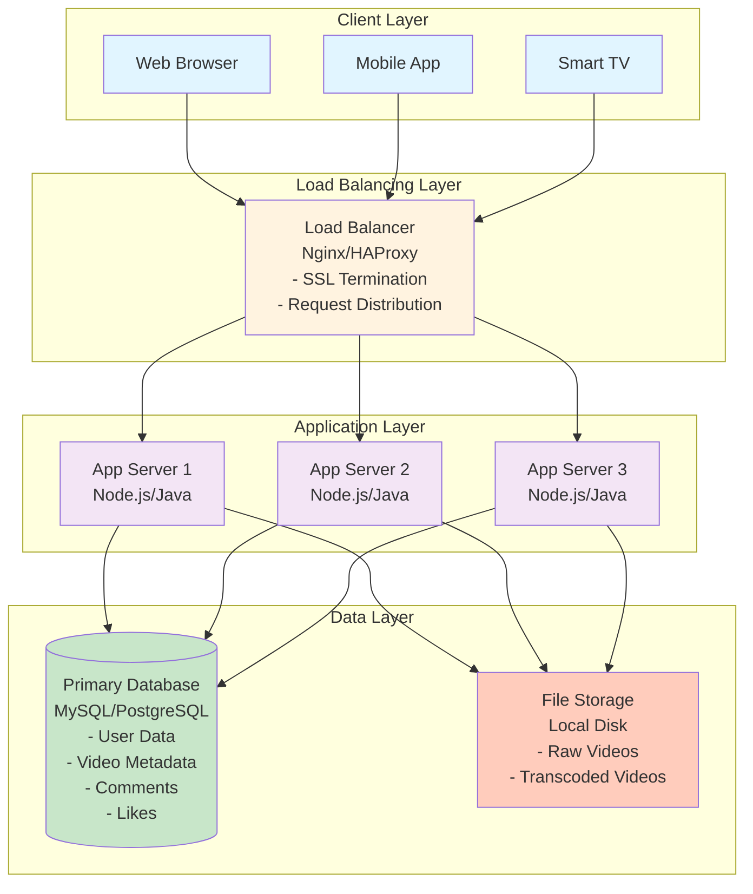

# Step 1: Basic Architecture

## What We're Building in This Step

A simple, functional YouTube system that can:
- Accept video uploads from users
- Store videos in a database
- Stream videos back to users
- Handle basic metadata (title, description, views)

**Think of this as:** Building a bicycle before we build a racing car. It works, but it's not optimized for scale yet.

---

## Components Added in Step 1

### 1. **Client (User Device)**
- **What:** Web browsers, mobile apps (iOS, Android), smart TVs
- **Purpose:** Interface where users watch and upload videos
- **Technologies:** React (web), Swift (iOS), Kotlin (Android)

### 2. **Load Balancer**
- **What:** A traffic cop that distributes incoming requests across multiple servers
- **Purpose:**
  - Prevent any single server from getting overwhelmed
  - Provide a single entry point (youtu.be)
  - Enable horizontal scaling (add more servers as needed)
- **Technologies:** Nginx, HAProxy, AWS Application Load Balancer (ALB)

**Beginner Analogy:** Imagine a restaurant with one host. When customers arrive, the host assigns them to available tables (servers). Without the host, everyone would crowd around the first table!

### 3. **Application Servers**
- **What:** Servers that run the business logic
- **Purpose:**
  - Handle API requests (upload, play, search, like, comment)
  - Validate user authentication
  - Process video metadata
  - Coordinate with database
- **Technologies:** Node.js, Java Spring Boot, Python Django
- **Why multiple servers?** If one crashes, others keep serving traffic (high availability)

### 4. **Database**
- **What:** Persistent storage for structured data
- **Purpose:** Store:
  - User information (username, email, password hash)
  - Video metadata (title, description, views, likes)
  - Comments and interactions
  - Channel subscriptions
- **Technologies:** MySQL, PostgreSQL (relational databases with ACID guarantees)

**Why SQL for now?** YouTube's data has clear relationships (users → videos → comments), making relational databases a natural fit.

---

## Architecture Diagram: Step 1



---

## How It Works: Request Flow

### Scenario 1: User Watches a Video

```
1. User clicks on video thumbnail in browser
   ↓
2. Browser sends request: GET /api/v1/videos/abc123
   ↓
3. Load Balancer receives request, forwards to App Server 2
   ↓
4. App Server 2 queries database:
   SELECT * FROM videos WHERE video_id = 'abc123'
   ↓
5. Database returns video metadata (title, description, file path)
   ↓
6. App Server 2 reads video file from storage
   ↓
7. App Server 2 streams video bytes back to browser
   ↓
8. Browser plays video using HTML5 <video> player
```

### Scenario 2: User Uploads a Video

```
1. User selects video file (my_vacation.mp4) and clicks Upload
   ↓
2. Browser sends request: POST /api/v1/videos (with file as multipart/form-data)
   ↓
3. Load Balancer forwards to App Server 1
   ↓
4. App Server 1 receives video file (1 GB)
   ↓
5. App Server 1 saves raw file to storage: /videos/raw/xyz789.mp4
   ↓
6. App Server 1 inserts metadata into database:
   INSERT INTO videos (video_id, title, file_path, upload_date)
   VALUES ('xyz789', 'My Vacation', '/videos/raw/xyz789.mp4', NOW())
   ↓
7. App Server 1 responds: 200 OK {videoId: 'xyz789'}
   ↓
8. User sees "Upload successful!" message
```

---

## What Changed from Nothing to Step 1?

| Before (No System) | After (Step 1) |
|--------------------|----------------|
| No way to upload videos | ✅ Users can upload videos |
| No storage | ✅ Videos stored in file system |
| No metadata tracking | ✅ Video info stored in database |
| No way to play videos | ✅ Users can stream videos |
| Single point of failure | ✅ Multiple app servers (some redundancy) |

---

## Design Decisions & Trade-offs

### Decision 1: Why Use a Load Balancer?

**Pros:**
- ✅ Distribute traffic across multiple servers (no single bottleneck)
- ✅ Easy to add more servers (horizontal scaling)
- ✅ Health checks: if one server crashes, traffic routes to healthy servers
- ✅ SSL/TLS termination (decrypt HTTPS traffic once, not on every server)

**Cons:**
- ❌ Load balancer itself can become a bottleneck (solution: use multiple LBs with DNS round-robin)
- ❌ Additional cost and complexity

**Verdict:** Worth it! Essential for any production system.

---

### Decision 2: Why Multiple Application Servers?

**Pros:**
- ✅ High availability: if one server crashes, others continue serving
- ✅ Handle more concurrent users (scale horizontally)
- ✅ Zero-downtime deployments (update servers one at a time)

**Cons:**
- ❌ Servers must be stateless (can't store session data locally)
- ❌ More expensive than single server

**Verdict:** Critical for YouTube's scale. Even small startups use 2+ servers for redundancy.

---

### Decision 3: Why SQL Database (MySQL/PostgreSQL)?

**Pros:**
- ✅ Strong consistency (ACID transactions)
- ✅ Mature technology with excellent tooling
- ✅ Good for structured data with relationships (users → videos → comments)
- ✅ Complex queries with JOINs (e.g., "show all comments on videos by channels I subscribe to")

**Cons:**
- ❌ Harder to scale horizontally (vertical scaling has limits)
- ❌ Fixed schema (requires migrations to change structure)

**Verdict:** Good starting point. We'll add NoSQL later for specific use cases (view counts, analytics).

---

### Decision 4: Why Store Videos on File System?

**For now:** Simple, works for prototypes.

**Problems:**
- ❌ Single server's disk has limited capacity (~10 TB)
- ❌ If disk fails, videos are lost (no redundancy)
- ❌ Slow access times for large files

**Future fix (Step 5):** Move to distributed object storage (AWS S3, Google Cloud Storage) with 11 nines durability.

---

## Limitations of Step 1 Architecture

### Problem 1: Database Bottleneck 🚨
- All app servers query the same database
- At 87,000 requests/sec (peak), database will be overwhelmed
- Database disk I/O becomes the bottleneck

**Solution (coming in Step 3):** Add database replication and caching.

---

### Problem 2: Storage Scalability 🚨
- Local disk storage doesn't scale
- What happens when we have 1 Exabyte of videos?
- Single disk failure = data loss

**Solution (coming in Step 5):** Use distributed object storage (S3) with automatic replication.

---

### Problem 3: No Caching 🚨
- Every request hits the database
- Popular videos (viral content) cause repeated database queries
- Database latency ~100ms, way too slow

**Solution (coming in Step 2):** Add Redis cache layer (10ms latency).

---

### Problem 4: Video Transcoding 🚨
- Videos are stored in raw format (1080p MP4)
- Users on slow connections can't watch
- No adaptive bitrate streaming (ABR)

**Solution (coming in Step 4):** Add background workers with message queue for transcoding.

---

### Problem 5: Bandwidth Costs 🚨
- Streaming 470 PB/day from origin servers is insanely expensive
- Users far from servers experience high latency

**Solution (coming in Step 5):** Add CDN (Content Delivery Network) for edge caching.

---

## Capacity Analysis: Can Step 1 Handle YouTube's Scale?

### Current Capacity
Let's assume:
- **App Servers:** 3 servers, each handles 1,000 concurrent requests
- **Database:** 1 server, handles 10,000 queries/sec
- **Storage:** 10 TB local disk

### YouTube's Requirements (from Step 1 doc)
- **Peak requests:** 87,000 req/sec
- **Database queries:** ~100,000 queries/sec (with reads)
- **Storage:** 1 Exabyte (1,000,000 TB)

### Verdict: ❌ NOT SCALABLE

```
App Servers:
Current capacity = 3 × 1,000 = 3,000 concurrent requests
Required capacity = 87,000 concurrent requests
Scaling factor needed = 87,000 / 3,000 = 29x

Database:
Current capacity = 10,000 queries/sec
Required capacity = 100,000 queries/sec
Scaling factor needed = 10x

Storage:
Current capacity = 10 TB
Required capacity = 1,000,000 TB
Scaling factor needed = 100,000x 😱
```

**This is why we need Steps 2-6!** We'll optimize for scale in the next steps.

---

## Technologies Used in Step 1

| Component | Technology Choice | Why? |
|-----------|------------------|------|
| Load Balancer | Nginx | Open-source, battle-tested, handles 50k req/sec |
| App Server | Node.js | Non-blocking I/O, great for streaming, large ecosystem |
| Database | PostgreSQL | ACID compliance, JSON support, open-source |
| File Storage | Local Disk (temp) | Simple for MVP, will migrate to S3 in Step 5 |
| Authentication | JWT tokens | Stateless, scalable, industry standard |

---

## Beginner Tips: What to Draw on a Whiteboard

When asked "Design YouTube" in an interview, **always start here:**

### Step 1: Draw This First (5 minutes)
```
[Client] → [Load Balancer] → [App Servers] → [Database]
                                     ↓
                              [File Storage]
```

### Step 2: Explain Each Component (3 minutes)
- "Load balancer distributes traffic across app servers"
- "App servers handle business logic (upload, stream, search)"
- "Database stores metadata (users, videos, comments)"
- "File storage holds actual video files"

### Step 3: Mention Limitations (2 minutes)
- "This won't scale to billions of users"
- "Next, I'll add caching to reduce database load"
- "Then CDN for video delivery"
- "Then async processing for transcoding"

**Interview Tip:** Don't jump straight to the final architecture! Show your thought process by building incrementally.

---

## Summary: What We Built

✅ **Functional YouTube MVP:**
- Users can upload videos
- Videos are stored persistently
- Users can watch videos
- Metadata is tracked in database

❌ **Not Production-Ready:**
- Won't scale beyond 1,000 concurrent users
- No caching (slow performance)
- No CDN (high bandwidth costs)
- No transcoding (poor user experience)
- No redundancy (single database, single storage)

---

## What's Next?

In **Step 2**, we'll add a **caching layer** (Redis) to:
- Reduce database load by 80%
- Improve response time from 100ms to 10ms
- Cache popular videos, user sessions, search results

Let's continue! 🚀
