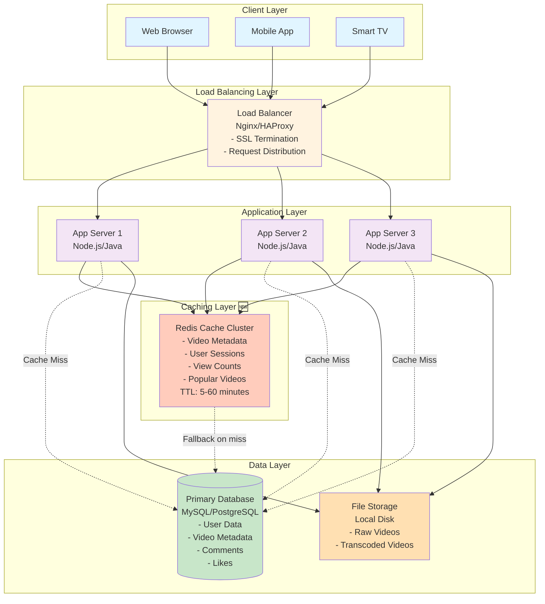

# Step 2: Adding Caching Layer

## The Problem We're Solving

From Step 1, we identified a critical bottleneck:

```
Database is hit for EVERY request:
- 87,000 requests/sec at peak
- Each database query takes ~100ms
- Database disk I/O maxes out at 10,000 queries/sec
- Result: System crashes! 🚨
```

**Real-world observation:**
- **80% of views** go to **20% of videos** (Pareto principle)
- Popular videos like "Gangnam Style" get queried millions of times
- Why fetch the same video metadata from database every time?

**Solution:** Add a caching layer!

---

## What is Caching?

**Simple Analogy:**

Imagine you're doing homework and need to look up the same word in a dictionary 100 times.

- **Without cache:** Walk to the bookshelf, open dictionary, find page (30 seconds each) = 50 minutes total
- **With cache:** Write the word on a sticky note on your desk (1 second each) = 100 seconds total

**Cache = Sticky note (fast, temporary storage)**

---

## Components Added in Step 2

### 1. **Redis Cache**
- **What:** In-memory data store (data stored in RAM, not disk)
- **Purpose:**
  - Store frequently accessed data (video metadata, user sessions, view counts)
  - Serve requests in ~10ms (vs 100ms for database)
  - Reduce database load by 80%+
- **Technology:** Redis (remote dictionary server)

**Why Redis?**
- ✅ Lightning fast (10ms latency)
- ✅ Rich data structures (strings, lists, sets, sorted sets, hashes)
- ✅ Built-in expiration (TTL - Time To Live)
- ✅ Persistence options (can survive restarts)
- ✅ Clustering for high availability

**Alternative:** Memcached (simpler, but less features)

---

## Architecture Diagram: Step 2



---

## What Changed from Step 1?

| Step 1 (No Cache) | Step 2 (With Cache) |
|-------------------|---------------------|
| Every request hits database | ✅ Cache hit: Redis (90% of requests) |
| Database latency: 100ms | ✅ Cache latency: 10ms (10x faster!) |
| Database handles 10k req/sec | ✅ Database handles 1k req/sec (10x reduction) |
| Database is the bottleneck | ✅ Database load reduced by 90% |
| No session storage | ✅ User sessions stored in Redis |

---

## How Caching Works: Cache-Aside Pattern

### Scenario: User Watches a Video

```
1. User requests video metadata: GET /api/v1/videos/abc123
   ↓
2. App Server checks Redis first:
   key = "video:abc123"

   ┌─────────────────────────────────────┐
   │ Is data in cache?                   │
   └─────────────────────────────────────┘
            │                 │
         YES │                │ NO
    (Cache Hit)          (Cache Miss)
            │                 │
            ↓                 ↓
   ┌─────────────────┐  ┌──────────────────────┐
   │ Return from     │  │ Query database       │
   │ Redis (10ms)    │  │ SELECT * FROM videos │
   │                 │  │ WHERE id = 'abc123'  │
   └─────────────────┘  └──────────────────────┘
                                  │
                                  ↓
                         ┌──────────────────────┐
                         │ Store result in cache│
                         │ SET video:abc123     │
                         │ EXPIRE 300 (5 min)   │
                         └──────────────────────┘
                                  │
                                  ↓
                         ┌──────────────────────┐
                         │ Return to user       │
                         └──────────────────────┘
```

---

## What to Cache: Data Categories

### 1. **Video Metadata** (Most Important!)
**Key Pattern:** `video:{video_id}`

**Data:**
```json
{
  "video_id": "abc123",
  "title": "How to Code in Python",
  "description": "Learn Python basics...",
  "channel_id": "chan456",
  "channel_name": "CodeMaster",
  "upload_date": "2025-01-15",
  "duration": 600,
  "thumbnail_url": "https://cdn.youtube.com/thumb/abc123.jpg"
}
```

**TTL:** 60 minutes (videos rarely change after upload)

**Why cache this?**
- Every video playback requires metadata
- 2.5 billion views/day = 2.5B metadata requests
- Database can't handle this load!

---

### 2. **User Sessions**
**Key Pattern:** `session:{token}`

**Data:**
```json
{
  "user_id": "user789",
  "username": "john_doe",
  "email": "john@example.com",
  "subscription_tier": "premium",
  "login_time": "2025-01-17T10:30:00Z"
}
```

**TTL:** 24 hours (session expiration)

**Why cache this?**
- Every authenticated request needs user info
- Reduces database load for auth checks
- Fast session validation (10ms vs 100ms)

---

### 3. **View Counts** (Hot Data!)
**Key Pattern:** `views:{video_id}`

**Data:** Simple counter (integer)

**Example:**
```
Key: views:abc123
Value: 1234567
```

**TTL:** None (use Redis persistence)

**Update Strategy:**
- **Fast writes:** Increment Redis counter: `INCR views:abc123`
- **Batch writes to DB:** Every 5 minutes, sync Redis → Database

**Why cache this?**
- View counts update on EVERY video play (billions of writes/day)
- Database can't handle this write load
- Redis can handle millions of writes/sec

---

### 4. **Popular/Trending Videos**
**Key Pattern:** `trending:global` or `trending:{country}`

**Data:**
```json
[
  {"video_id": "xyz789", "views_last_24h": 10000000, "title": "..."},
  {"video_id": "def456", "views_last_24h": 8500000, "title": "..."}
]
```

**TTL:** 10 minutes (trending changes frequently)

**Why cache this?**
- Homepage trending section is viewed billions of times/day
- Running aggregation query (TOP 50 videos by views) is expensive
- Pre-compute and cache result

---

### 5. **Search Results** (Tricky!)
**Key Pattern:** `search:{query}:{filters}:{page}`

**Example:**
```
Key: search:python tutorial:upload_date=this_week:page=1
Value: [list of video IDs]
```

**TTL:** 5 minutes (balance freshness vs performance)

**Why cache this?**
- Popular searches (e.g., "funny cats") are repeated millions of times
- Search engine queries are expensive (full-text search)

**Challenge:** Search has infinite combinations (hard to cache effectively)
- Solution: Cache top 10,000 most common queries

---

## Caching Strategies

### Strategy 1: Cache-Aside (Lazy Loading) ⭐ Most Common

**How it works:**
1. Application checks cache first
2. If **cache hit:** return data
3. If **cache miss:** fetch from database, store in cache, return data

**Pros:**
- ✅ Only cache data that's actually accessed (no waste)
- ✅ Simple to implement
- ✅ Cache failure doesn't break system (falls back to database)

**Cons:**
- ❌ First request is always slow (cache miss)
- ❌ Cache stampede problem (explained below)

**When to use:** Most read-heavy scenarios (YouTube video metadata)

---

### Strategy 2: Write-Through

**How it works:**
1. Application writes to cache first
2. Cache synchronously writes to database
3. Both cache and database are always in sync

**Pros:**
- ✅ No stale data (cache and DB always match)
- ✅ Reads are always fast (cache is always populated)

**Cons:**
- ❌ Slower writes (must wait for both cache and DB)
- ❌ Wasted cache space (caches data that may never be read)

**When to use:** Critical data that must be consistent (user profiles)

---

### Strategy 3: Write-Behind (Write-Back)

**How it works:**
1. Application writes to cache
2. Cache **asynchronously** writes to database (batched)
3. Faster writes, but risk of data loss if cache crashes

**Pros:**
- ✅ Very fast writes (don't wait for database)
- ✅ Reduced database load (writes are batched)

**Cons:**
- ❌ Data loss risk if cache crashes before DB sync
- ❌ Complex to implement correctly

**When to use:** View counts, likes (eventual consistency is OK)

---

## Cache Invalidation: The Hardest Problem

> "There are only two hard things in Computer Science: cache invalidation and naming things." — Phil Karlton

### Problem: Stale Data

**Scenario:**
1. Video metadata cached at 10:00 AM (title: "Old Title")
2. Creator updates video title at 10:05 AM (title: "New Title")
3. Cache still shows "Old Title" until TTL expires!

### Solution 1: Time-To-Live (TTL) ⭐ Simplest

**How it works:** Set expiration time on cached data

```redis
SET video:abc123 '{"title":"My Video"}' EX 300  # Expires in 300 seconds (5 min)
```

**Example TTLs for YouTube:**
- Video metadata: 60 minutes (rarely changes)
- View counts: No TTL (use write-behind)
- Trending videos: 10 minutes (changes frequently)
- Search results: 5 minutes
- User sessions: 24 hours

**Pros:**
- ✅ Simple to implement
- ✅ Automatic cleanup (no manual invalidation)

**Cons:**
- ❌ Data can be stale for up to TTL duration
- ❌ Doesn't work for data that must be immediately consistent

---

### Solution 2: Active Invalidation

**How it works:** Manually delete cache when data changes

```python
# User updates video title
def update_video_title(video_id, new_title):
    # Update database
    db.execute("UPDATE videos SET title = ? WHERE id = ?", new_title, video_id)

    # Invalidate cache
    redis.delete(f"video:{video_id}")
```

**Pros:**
- ✅ No stale data (cache is immediately updated)
- ✅ Fine-grained control

**Cons:**
- ❌ Complex (must track all places where data changes)
- ❌ Easy to miss invalidation (leads to bugs)

**When to use:** Critical data (user account balance, permissions)

---

### Solution 3: Cache Stampede Prevention

**Problem:**
```
1. Popular video's cache expires
2. 10,000 concurrent requests all get cache miss
3. All 10,000 requests hit database simultaneously
4. Database overwhelmed and crashes! 🚨
```

**Solution: Lock-Based Approach**

```python
def get_video_metadata(video_id):
    # Try cache first
    data = redis.get(f"video:{video_id}")
    if data:
        return data

    # Cache miss - acquire lock
    lock_key = f"lock:video:{video_id}"
    if redis.set(lock_key, "1", nx=True, ex=10):  # Only one request gets the lock
        # This request fetches from DB
        data = db.query("SELECT * FROM videos WHERE id = ?", video_id)
        redis.set(f"video:{video_id}", data, ex=3600)
        redis.delete(lock_key)
        return data
    else:
        # Other requests wait and retry
        time.sleep(0.1)
        return get_video_metadata(video_id)  # Retry
```

**Analogy:** Only one person goes to the library to get the book, others wait for them to photocopy it.

---

## Performance Impact: Before vs After

### Before (Step 1): No Cache

```
Request latency breakdown:
- Network: 20ms
- App server processing: 10ms
- Database query: 100ms
- Video file read: 50ms
Total: 180ms

Database load:
- Peak requests: 87,000 req/sec
- Database capacity: 10,000 queries/sec
Status: ❌ OVERLOADED (database crashes)
```

---

### After (Step 2): With Redis Cache

```
Request latency breakdown (90% cache hit rate):
- Network: 20ms
- App server processing: 10ms
- Redis cache query: 10ms  ← 90x faster than DB!
- Video file read: 50ms
Total: 90ms (2x faster!)

Database load:
- Peak requests: 87,000 req/sec
- Cache hit rate: 90%
- Requests to database: 87,000 × 10% = 8,700 req/sec
- Database capacity: 10,000 queries/sec
Status: ✅ HEALTHY (well within capacity)
```

**Impact:** Database load reduced by 90%, latency reduced by 50%!

---

## Capacity Calculation: How Much Cache Memory Needed?

### Assumptions
- Daily Active Users: 500 million
- Videos watched per user: 5 videos/day
- Unique videos watched: 100 million/day (due to viral/popular content)

### Cache Size for Video Metadata

```
Video metadata per entry:
- Data: ~6 KB (from Step 1 estimates)

Cache only popular videos (top 20%):
- Cached videos: 100M × 20% = 20 million videos

Total cache size needed:
20M × 6 KB = 120 GB
```

**Redis Cluster:** Use 3 servers with 64 GB RAM each = 192 GB total (with headroom)

---

### Cache Size for User Sessions

```
Active concurrent users: 100 million (peak)
Session data per user: 500 bytes

Total cache size:
100M × 500 bytes = 50 GB
```

---

### Total Redis Memory Needed

```
Video metadata: 120 GB
User sessions: 50 GB
View counts: 10 GB
Trending videos: 1 GB
Search results: 20 GB

Total: ~200 GB

With 50% overhead for Redis internal structures:
200 GB × 1.5 = 300 GB

Redis Cluster: 5 servers × 64 GB RAM = 320 GB ✅
```

**Cost:** Redis servers ~$500/month (much cheaper than scaling database!)

---

## Trade-offs: Caching

### Pros ✅
- **Massive performance improvement:** 10ms vs 100ms (10x faster)
- **Reduced database load:** 90% fewer queries
- **Better user experience:** Faster page loads
- **Cost savings:** Redis is cheaper than scaling database
- **Handles traffic spikes:** Cache absorbs sudden load

### Cons ❌
- **Stale data risk:** Cache can be out of sync with database
- **Increased complexity:** Must manage cache invalidation
- **Cold start problem:** Empty cache after restart (all misses)
- **Memory cost:** Redis servers require RAM (expensive)
- **Cache coherence:** Multiple cache servers must stay in sync

---

## Technologies: Redis Cluster Setup

### Single Redis Server (Not Recommended)
```
Single point of failure ❌
Max capacity: 64 GB RAM
```

### Redis Cluster (Recommended) ⭐
```
5 Redis nodes:
- 3 master nodes (data sharding)
- 2 replica nodes (high availability)

Automatic failover:
- If master1 crashes, replica1 becomes master
- No downtime!

Data sharding:
- video:abc123 → master1
- video:xyz789 → master2
- video:def456 → master3
```

**Setup:**
```bash
# Redis Cluster (simplified)
redis-server --cluster-enabled yes --cluster-config-file nodes.conf --port 7001
redis-server --cluster-enabled yes --cluster-config-file nodes.conf --port 7002
redis-server --cluster-enabled yes --cluster-config-file nodes.conf --port 7003

redis-cli --cluster create 127.0.0.1:7001 127.0.0.1:7002 127.0.0.1:7003 --cluster-replicas 1
```

---

## Monitoring: Key Metrics to Track

### 1. Cache Hit Ratio
```
Cache Hit Ratio = (Cache Hits / Total Requests) × 100%

Target: > 85%

If < 85%:
- Increase cache size
- Adjust TTL values
- Check cache eviction policy (LRU vs LFU)
```

### 2. Cache Latency
```
Target: p95 latency < 10ms

If > 10ms:
- Redis might be overloaded (scale horizontally)
- Network latency issue
- Large value size (compress data)
```

### 3. Memory Usage
```
Target: < 80% of available RAM

If > 80%:
- Add more Redis nodes
- Reduce TTL (evict faster)
- Implement LRU eviction policy
```

---

## Summary: Step 2 Achievements

### What We Added
✅ Redis cache cluster (5 nodes, 320 GB total RAM)
✅ Cache-aside pattern for video metadata
✅ Write-behind pattern for view counts
✅ TTL-based cache invalidation

### Performance Improvements
✅ Latency: 180ms → 90ms (2x faster)
✅ Database load: 87k req/sec → 8.7k req/sec (10x reduction)
✅ Cache hit ratio: 90%
✅ System can now handle peak load! 🎉

### Remaining Problems
❌ Database is still a single point of failure
❌ Storage doesn't scale (10 TB limit)
❌ No video transcoding (all videos in raw format)
❌ No CDN (high bandwidth costs)

---

## What's Next?

In **Step 3**, we'll tackle the **database bottleneck** by adding:
- **Master-Slave Replication:** Read scaling
- **Database Sharding:** Write scaling
- **Read Replicas:** Geographically distributed reads

Let's continue! 🚀
