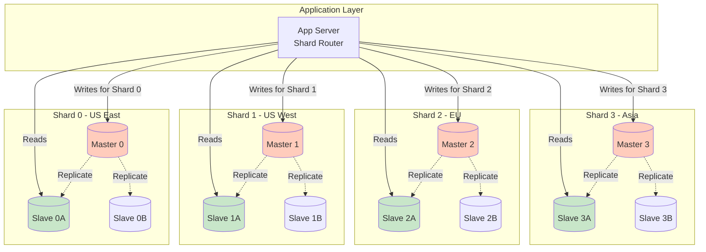

# Step 3: Database Scaling (Replication & Sharding)

## The Problem We're Solving

Even with caching (Step 2), the database still has limitations:

```
Problems:
1. Single Point of Failure 🚨
   - If database crashes, entire system goes down
   - No redundancy

2. Limited Read Capacity 📊
   - Cache misses still hit database (10% of 87k req/sec = 8.7k req/sec)
   - Database can handle 10k queries/sec max
   - Close to capacity!

3. Limited Write Capacity ✍️
   - 50 video uploads/sec (from Step 1)
   - Thousands of comments/sec
   - View count updates (even with batching)
   - Single database disk I/O becomes bottleneck

4. Backup & Disaster Recovery 💾
   - No automated backups
   - Hardware failure = data loss
```

**Solution:** Database Replication + Sharding!

---

## Database Scaling Strategies

### Strategy 1: Vertical Scaling (Scale Up) - Temporary Fix

**What:** Upgrade to a bigger server

```
Before: 8 cores, 32 GB RAM, 1 TB SSD
After:  64 cores, 512 GB RAM, 10 TB SSD

Cost: $500/month → $5,000/month
Capacity: 10k queries/sec → 50k queries/sec
```

**Pros:**
- ✅ Simple (no code changes)
- ✅ Works for short-term scaling

**Cons:**
- ❌ Hard limits (largest server ~128 cores, 4 TB RAM)
- ❌ Expensive (exponential cost increase)
- ❌ Still a single point of failure
- ❌ Downtime during upgrades

**Verdict:** Good for startups, but YouTube needs horizontal scaling.

---

### Strategy 2: Horizontal Scaling - Replication (Scale Out) ⭐

**What:** Add multiple database servers

---

## Master-Slave Replication

### How It Works

```
┌──────────────────────────────────────────────────────┐
│                   WRITE PATH                          │
└──────────────────────────────────────────────────────┘

App Server → Master DB (writes only)
             │
             ├─ INSERT new video
             ├─ UPDATE video title
             └─ DELETE comment


┌──────────────────────────────────────────────────────┐
│                    READ PATH                          │
└──────────────────────────────────────────────────────┘

App Server → Slave DB 1 (reads only)
           → Slave DB 2 (reads only)
           → Slave DB 3 (reads only)
             │
             ├─ SELECT video metadata
             ├─ SELECT user profile
             └─ SELECT comments


┌──────────────────────────────────────────────────────┐
│                   REPLICATION                         │
└──────────────────────────────────────────────────────┘

Master DB ──(async copy)──→ Slave DB 1
          ──(async copy)──→ Slave DB 2
          ──(async copy)──→ Slave DB 3
```

**Key Concept:**
- **Master:** Handles all writes (INSERT, UPDATE, DELETE)
- **Slaves (Replicas):** Handle all reads (SELECT)
- **Replication:** Master automatically copies data to slaves

---

## Architecture Diagram: Step 3

```mermaid
graph TB
    subgraph "Client Layer"
        Client[Users<br/>500M DAU]
    end

    subgraph "Load Balancing Layer"
        LB[Load Balancer<br/>Nginx]
    end

    subgraph "Application Layer"
        App1[App Server 1]
        App2[App Server 2]
        App3[App Server 3]
    end

    subgraph "Caching Layer"
        Redis[Redis Cluster<br/>5 nodes, 320 GB]
    end

    subgraph "Database Layer 🆕"
        DBMaster[(Master DB<br/>MySQL/PostgreSQL<br/>WRITES ONLY<br/>- INSERT videos<br/>- UPDATE users<br/>- DELETE comments)]

        subgraph "Read Replicas"
            DBSlave1[(Slave DB 1<br/>READS ONLY<br/>US-East)]
            DBSlave2[(Slave DB 2<br/>READS ONLY<br/>US-West)]
            DBSlave3[(Slave DB 3<br/>READS ONLY<br/>EU)]
        end
    end

    subgraph "Storage"
        Storage[File Storage<br/>Local Disk]
    end

    Client --> LB
    LB --> App1
    LB --> App2
    LB --> App3

    App1 --> Redis
    App2 --> Redis
    App3 --> Redis

    App1 -->|Writes| DBMaster
    App2 -->|Writes| DBMaster
    App3 -->|Writes| DBMaster

    App1 -->|Reads| DBSlave1
    App1 -->|Reads| DBSlave2
    App1 -->|Reads| DBSlave3

    App2 -->|Reads| DBSlave1
    App2 -->|Reads| DBSlave2
    App2 -->|Reads| DBSlave3

    App3 -->|Reads| DBSlave1
    App3 -->|Reads| DBSlave2
    App3 -->|Reads| DBSlave3

    DBMaster -.Async Replication.-> DBSlave1
    DBMaster -.Async Replication.-> DBSlave2
    DBMaster -.Async Replication.-> DBSlave3

    App1 --> Storage
    App2 --> Storage
    App3 --> Storage

    style DBMaster fill:#ffccbc
    style DBSlave1 fill:#c8e6c9
    style DBSlave2 fill:#c8e6c9
    style DBSlave3 fill:#c8e6c9
    style Redis fill:#e1bee7
```

---

## What Changed from Step 2?

| Step 2 (Single DB) | Step 3 (Master-Slave) |
|--------------------|------------------------|
| 1 database server | ✅ 1 master + 3 slave servers (4 total) |
| All reads & writes to same DB | ✅ Writes to master, reads from slaves |
| Max 10k queries/sec | ✅ 40k queries/sec (4x capacity!) |
| Single point of failure | ✅ If slave fails, use other slaves |
| No geographic distribution | ✅ Slaves in US-East, US-West, EU |
| Backup = manual snapshots | ✅ Slaves are live backups |

---

## Replication: How Data Flows

### Example: User Uploads a Video

```
Step 1: Write to Master
┌────────────────────────────────────────┐
│ App Server:                             │
│ INSERT INTO videos (id, title, ...)    │
│ VALUES ('abc123', 'My Vacation', ...)  │
└────────────────────────────────────────┘
          │
          ↓
┌────────────────────────────────────────┐
│ Master DB:                              │
│ - Writes data to disk                   │
│ - Logs change to binlog (binary log)   │
│ - Returns success to app server         │
└────────────────────────────────────────┘


Step 2: Replicate to Slaves (Asynchronous)
┌────────────────────────────────────────┐
│ Master DB:                              │
│ - Streams binlog to all slaves          │
└────────────────────────────────────────┘
          │
          ├─────────────┬─────────────┐
          ↓             ↓             ↓
    ┌─────────┐   ┌─────────┐   ┌─────────┐
    │Slave 1  │   │Slave 2  │   │Slave 3  │
    │US-East  │   │US-West  │   │EU       │
    │         │   │         │   │         │
    │Applies  │   │Applies  │   │Applies  │
    │changes  │   │changes  │   │changes  │
    └─────────┘   └─────────┘   └─────────┘

Step 3: Read from Slaves
┌────────────────────────────────────────┐
│ User in New York watches video:        │
│ App routes to Slave 1 (US-East)        │
│ Low latency! (same region)              │
└────────────────────────────────────────┘
```

**Timing:**
- Write to master: ~50ms
- Replication lag to slaves: **100-500ms** (eventual consistency)
- Read from slave: ~50ms

---

## Replication Lag: The Consistency Problem

### Problem: Read-Your-Own-Writes

**Scenario:**
```
Time 0:00:00 - User uploads video "My Vacation"
              - App writes to Master DB ✅

Time 0:00:00.1 - User refreshes page to see their video
                - App reads from Slave DB
                - Slave hasn't replicated yet (lag = 200ms)
                - User sees: "Video not found" ❌

Time 0:00:00.3 - Replication completes
                - User refreshes again
                - Now sees "My Vacation" ✅
```

**User experience:** "I just uploaded the video, why can't I see it?!" 😠

---

### Solution 1: Read-Your-Own-Writes (Simple)

```python
def upload_video(user_id, video_data):
    # Write to master
    master_db.execute("INSERT INTO videos (...) VALUES (...)")

    # Read from MASTER (not slave) for this user's next requests
    # Set a flag in user session
    session.set(f"force_master_read:{user_id}", True, ttl=10)  # 10 seconds

def get_user_videos(user_id):
    # Check if user recently wrote data
    if session.get(f"force_master_read:{user_id}"):
        return master_db.query("SELECT * FROM videos WHERE user_id = ?", user_id)
    else:
        # Normal users read from slave
        return slave_db.query("SELECT * FROM videos WHERE user_id = ?", user_id)
```

**Result:** User always sees their own writes immediately!

---

### Solution 2: Synchronous Replication (Slow but Consistent)

```python
# Wait for data to replicate to at least 1 slave before confirming write
master_db.execute("INSERT INTO videos (...) VALUES (...)", wait_for_replica=1)
```

**Trade-off:**
- ✅ Strong consistency (all reads see latest write)
- ❌ Slower writes (must wait for replication, +200ms latency)

**When to use:** Critical data (payment confirmations, account changes)

---

## Read/Write Splitting: Code Example

### Application Layer Logic

```python
import random

# Database connection pool
MASTER_DB = connect("mysql://master.youtube.com:3306")
SLAVE_DBS = [
    connect("mysql://slave1.youtube.com:3306"),  # US-East
    connect("mysql://slave2.youtube.com:3306"),  # US-West
    connect("mysql://slave3.youtube.com:3306"),  # EU
]

def execute_write(query, params):
    """All writes go to master"""
    return MASTER_DB.execute(query, params)

def execute_read(query, params):
    """Reads are load-balanced across slaves"""
    slave = random.choice(SLAVE_DBS)  # Simple round-robin
    return slave.execute(query, params)

# Usage
def upload_video(title, user_id):
    execute_write(
        "INSERT INTO videos (title, user_id) VALUES (?, ?)",
        (title, user_id)
    )

def get_video(video_id):
    return execute_read(
        "SELECT * FROM videos WHERE id = ?",
        (video_id,)
    )
```

---

## Failover: What Happens If Master Crashes?

### Problem: Master Failure

```
Time 0:00:00 - Master DB crashes (hardware failure) 🚨
Time 0:00:00 - All writes fail (app returns errors)
Time 0:00:05 - Database admin notified
Time 0:00:30 - Admin promotes Slave 1 to new master
Time 0:01:00 - App config updated to point to new master
Time 0:01:05 - Writes resume ✅

Downtime: ~1 minute
```

**Impact:** Users can't upload videos, like, or comment for 1 minute.

---

### Solution: Automatic Failover (High Availability)

Use tools like:
- **MySQL:** MySQL Router + Group Replication
- **PostgreSQL:** Patroni + etcd
- **Cloud:** AWS RDS Multi-AZ (automatic failover in ~30 seconds)

**How it works:**
```
1. Health check monitors master (every 1 second)
2. Master doesn't respond for 3 consecutive checks
3. Tool automatically promotes slave to master
4. DNS/load balancer updated
5. Apps reconnect to new master
6. Total downtime: < 30 seconds ✅
```

---

## Database Sharding: Scaling Writes

### Problem: Master Still Bottlenecked for Writes

```
Even with replication:
- All WRITES still go to single master
- YouTube uploads: 50 videos/sec
- Comments: 1000/sec
- Likes: 5000/sec
- Total writes: ~6,000/sec

Single master limit: ~10,000 writes/sec
We're at 60% capacity (getting close!)
```

**Solution:** Shard the database (horizontal partitioning)

---

## What is Sharding?

**Simple Analogy:**

Imagine a library with 1 million books.

**No Sharding:**
- 1 librarian manages all 1M books
- Slow to find books (overwhelming!)

**With Sharding:**
- 4 librarians, each manages 250k books
- Librarian 1: A-F
- Librarian 2: G-M
- Librarian 3: N-S
- Librarian 4: T-Z
- 4x faster! (parallel processing)

---

## Sharding Strategy 1: Shard by User ID

### How It Works

```
hash(user_id) % num_shards = shard_id

Example:
user_id = 12345
hash(12345) % 4 = 1
→ Store in Shard 1

user_id = 67890
hash(67890) % 4 = 3
→ Store in Shard 3
```

### Shard Architecture

```
┌─────────────────────────────────────────────┐
│              App Server                      │
│                                              │
│  user_id = 12345                             │
│  shard_id = hash(12345) % 4 = 1             │
│  route to Shard 1                            │
└─────────────────────────────────────────────┘
                  │
     ┌────────────┼────────────┬───────────┐
     ↓            ↓            ↓           ↓
┌─────────┐  ┌─────────┐  ┌─────────┐  ┌─────────┐
│ Shard 0 │  │ Shard 1 │  │ Shard 2 │  │ Shard 3 │
│         │  │         │  │         │  │         │
│ Users:  │  │ Users:  │  │ Users:  │  │ Users:  │
│ 1, 5, 9 │  │ 2, 6, 10│  │ 3, 7, 11│  │ 4, 8, 12│
│         │  │         │  │         │  │         │
│ Videos: │  │ Videos: │  │ Videos: │  │ Videos: │
│ by these│  │ by these│  │ by these│  │ by these│
│ users   │  │ users   │  │ users   │  │ users   │
└─────────┘  └─────────┘  └─────────┘  └─────────┘
```

---

### Pros & Cons: User ID Sharding

**Pros:**
- ✅ Even distribution (if user IDs are sequential)
- ✅ Simple to implement
- ✅ Easy to query user-specific data (all data in one shard)

**Cons:**
- ❌ Hard to query across users (e.g., "top 10 trending videos globally")
- ❌ Hot shard problem (if one user goes viral, their shard is overloaded)
- ❌ Can't easily re-shard (requires data migration)

---

## Sharding Strategy 2: Shard by Video ID

```
hash(video_id) % num_shards = shard_id

Example:
video_id = "abc123"
hash("abc123") % 4 = 2
→ Store in Shard 2
```

**Pros:**
- ✅ Distribute viral videos across shards (no hot shard)
- ✅ Easy to query video-specific data

**Cons:**
- ❌ Hard to query user-specific data (user's videos are scattered across shards)
- ❌ Complex joins (need to query multiple shards)

---

## Sharding Strategy 3: Shard by Geography

```
user_location = "US"
→ Store in US Shard

user_location = "EU"
→ Store in EU Shard
```

**Pros:**
- ✅ Low latency (data close to users)
- ✅ Regulatory compliance (GDPR: EU data must stay in EU)

**Cons:**
- ❌ Uneven distribution (US has more users than Iceland)
- ❌ Global queries are slow (must query all regions)

---

## Consistent Hashing: Solving the Re-Sharding Problem

### Problem: Adding Shards Requires Re-Hashing

```
Before (3 shards):
video_id = "abc123"
hash("abc123") % 3 = 2 → Shard 2

After adding 4th shard (4 shards):
hash("abc123") % 4 = 3 → Shard 3 (different shard!)

Result: Must migrate 75% of data! 😱
```

---

### Solution: Consistent Hashing

**How it works:**
- Hash shards and keys onto a ring (0 to 2^32)
- Each key goes to the next shard clockwise

```
        0
        │
   Shard A
        │
    hash("abc123") = 100
        │
    → goes to Shard A
        │
   Shard B (position 200)
        │
   Shard C (position 300)
        │
    2^32
```

**Adding a new shard:**
- Only keys between new shard and previous shard need migration
- ~25% of data moves (instead of 75%)

**Implementation:** Use libraries like `hash-ring` (Python) or `ketama` (C)

---

## Architecture Diagram: With Sharding



---

## Capacity Calculation: How Many Shards?

### Given (from Step 1):
- Total writes: 6,000/sec (uploads, comments, likes)
- Single master capacity: 10,000 writes/sec

### Calculation:
```
Shards needed for writes = 6,000 / 10,000 = 0.6

Round up to 1 shard (for now)

But plan for future:
- Expected growth: 2x in 2 years
- Future writes: 12,000/sec
- Shards needed: 12,000 / 10,000 = 2 shards

Recommendation: Start with 4 shards (future-proof)
```

### Read Replicas per Shard:
```
Total reads (after cache): 8,700/sec (10% of 87k)
Reads per shard: 8,700 / 4 = 2,175/sec
Single slave capacity: 10,000 reads/sec

Slaves needed per shard: 2,175 / 10,000 = 0.22

Recommendation: 2 slaves per shard (for redundancy)
```

**Total database servers:**
```
4 shards × (1 master + 2 slaves) = 12 servers
```

---

## Trade-offs: Replication vs Sharding

| Factor | Replication | Sharding |
|--------|-------------|----------|
| **Scales** | Reads (horizontal) | Writes (horizontal) |
| **Complexity** | Low | High |
| **Consistency** | Eventual (replication lag) | Complex (distributed transactions) |
| **Failover** | Automatic (promote slave) | Complex (shard unavailable) |
| **Queries** | Easy (single database) | Hard (cross-shard joins) |
| **When to use** | Read-heavy (YouTube!) | Write-heavy (Twitter, IoT) |

**YouTube's choice:** Replication first (read-heavy workload), sharding only if needed.

---

## Summary: Step 3 Achievements

### What We Added
✅ Master-slave replication (1 master + 3 slaves per shard)
✅ Read/write splitting (writes to master, reads from slaves)
✅ Geographic distribution (US-East, US-West, EU)
✅ Automatic failover (high availability)
✅ Sharding strategy (4 shards, 12 total DB servers)

### Performance Improvements
✅ Read capacity: 10k → 40k queries/sec (4x)
✅ Write capacity: 10k → 40k writes/sec (4x with sharding)
✅ Reduced latency: Geo-distributed slaves (closer to users)
✅ High availability: No single point of failure

### Remaining Problems
❌ Video transcoding is blocking (users wait for transcode to finish)
❌ Storage doesn't scale (still on local disk)
❌ No CDN (bandwidth costs are astronomical)
❌ Monolithic app server (hard to scale individual features)

---

## What's Next?

In **Step 4**, we'll add **message queues** and **background workers** to handle:
- Asynchronous video transcoding (don't block user uploads)
- Email notifications (new subscribers, comments)
- Recommendation engine updates
- Analytics processing

Let's continue! 🚀
