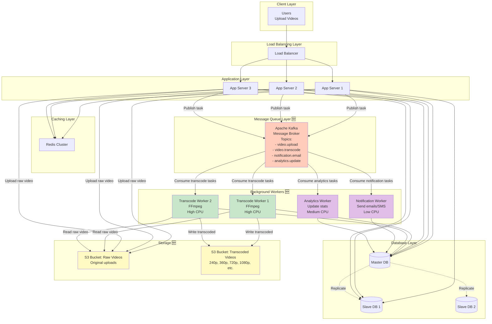

# Step 4: Adding Message Queue & Async Processing

## The Problem We're Solving

Currently, video transcoding happens **synchronously** during upload:

```
User uploads 1 GB video (10 minutes, 1080p)
    ↓
App server receives file (30 seconds)
    ↓
App server transcodes to 7 resolutions:
  - 240p: 2 minutes
  - 360p: 2 minutes
  - 480p: 3 minutes
  - 720p: 4 minutes
  - 1080p: 5 minutes
  - 1440p: 8 minutes
  - 4K: 12 minutes
  Total: 36 minutes! ⏰
    ↓
App server responds: "Upload successful!"

User waits 36 minutes staring at loading spinner 😡
```

**Problems:**
1. **Terrible user experience:** Nobody waits 36 minutes!
2. **Wasted resources:** App server is busy transcoding (can't handle other requests)
3. **Timeout errors:** HTTP requests timeout after 30-60 seconds
4. **Not scalable:** 50 uploads/sec × 36 minutes = 1,800 concurrent transcoding jobs! 🚨

---

## Solution: Asynchronous Processing with Message Queues

### Key Idea: Decouple Request from Processing

```
Synchronous (Bad):
User → App Server → [Wait 36 min] → Response

Asynchronous (Good):
User → App Server → "Upload successful! Processing..." (2 sec)
                ↓
            Message Queue → Background Worker → Transcode video
                                               ↓
                                    Notify user when done (email/push)
```

**User experience:**
- Upload completes in 2 seconds ✅
- User can close browser ✅
- Worker processes video in background ✅
- User gets notification when video is ready ✅

---

## Components Added in Step 4

### 1. **Message Queue**
- **What:** A queue that holds tasks (messages) to be processed later
- **Purpose:**
  - Decouple producers (app servers) from consumers (workers)
  - Buffer traffic spikes (queue absorbs bursts)
  - Retry failed tasks automatically
  - Prioritize urgent tasks
- **Technologies:**
  - **Apache Kafka** (high throughput, event streaming, 1M+ msg/sec)
  - **RabbitMQ** (flexible routing, reliable, 50k msg/sec)
  - **AWS SQS** (managed, simple, auto-scaling)

**Beginner Analogy:**

Message queue is like a **restaurant kitchen ticket system**:
- Waiter (app server) takes order and gives ticket to kitchen
- Waiter doesn't wait for food to be cooked (goes to serve other tables)
- Chef (worker) picks up ticket and cooks when ready
- Food ready → waiter notified (callback/webhook)

---

### 2. **Background Workers**
- **What:** Dedicated servers that process tasks from the queue
- **Purpose:**
  - Video transcoding (CPU-intensive)
  - Send emails/SMS (I/O-intensive)
  - Update recommendation models (ML inference)
  - Generate thumbnails
  - Process analytics
- **Technologies:**
  - **Celery** (Python task queue)
  - **Sidekiq** (Ruby background jobs)
  - **Custom workers** (Node.js, Java)

**Scaling:** Can add more workers during peak hours (elastic scaling)

---

## Architecture Diagram: Step 4



---

## What Changed from Step 3?

| Step 3 (Synchronous) | Step 4 (Asynchronous) |
|----------------------|-----------------------|
| Upload blocks for 36 min | ✅ Upload returns in 2 sec |
| App server does transcoding | ✅ Dedicated workers transcode |
| Single point of failure | ✅ Multiple workers (redundancy) |
| Hard to scale | ✅ Auto-scale workers based on queue depth |
| Timeout errors | ✅ No timeouts (background processing) |
| No retry on failure | ✅ Automatic retries (3 attempts) |

---

## Message Queue: How It Works

### Message Structure

```json
{
  "task_id": "task_12345",
  "type": "video.transcode",
  "priority": "high",
  "payload": {
    "video_id": "abc123",
    "s3_path": "s3://raw-videos/abc123.mp4",
    "resolutions": ["240p", "360p", "480p", "720p", "1080p", "1440p", "4k"],
    "callback_url": "https://api.youtube.com/transcode/complete"
  },
  "retry_count": 0,
  "created_at": "2025-01-17T10:30:00Z"
}
```

---

### Producer: App Server Publishes Task

```python
from kafka import KafkaProducer
import json

producer = KafkaProducer(
    bootstrap_servers=['kafka1:9092', 'kafka2:9092'],
    value_serializer=lambda v: json.dumps(v).encode('utf-8')
)

def handle_video_upload(video_file, user_id):
    # Step 1: Save raw video to S3
    s3_path = s3.upload(f"raw-videos/{video_id}.mp4", video_file)

    # Step 2: Save metadata to database
    db.execute(
        "INSERT INTO videos (id, user_id, status) VALUES (?, ?, ?)",
        (video_id, user_id, "processing")
    )

    # Step 3: Publish transcode task to Kafka
    task = {
        "task_id": f"task_{uuid.uuid4()}",
        "type": "video.transcode",
        "priority": "normal",
        "payload": {
            "video_id": video_id,
            "s3_path": s3_path,
            "resolutions": ["240p", "360p", "480p", "720p", "1080p"]
        }
    }

    producer.send('video.transcode', task)

    # Step 4: Return immediately to user
    return {"status": "success", "video_id": video_id, "message": "Processing..."}
```

**Response time:** ~2 seconds (no waiting for transcode!)

---

### Consumer: Background Worker Processes Task

```python
from kafka import KafkaConsumer
import ffmpeg

consumer = KafkaConsumer(
    'video.transcode',
    bootstrap_servers=['kafka1:9092', 'kafka2:9092'],
    group_id='transcode-workers',  # Load balancing across workers
    value_deserializer=lambda m: json.loads(m.decode('utf-8'))
)

def transcode_video(s3_path, video_id, resolution):
    # Download from S3
    local_file = f"/tmp/{video_id}_raw.mp4"
    s3.download(s3_path, local_file)

    # Transcode using FFmpeg
    output_file = f"/tmp/{video_id}_{resolution}.mp4"
    ffmpeg.input(local_file) \
          .output(output_file, vcodec='libx264', acodec='aac', video_bitrate='2500k') \
          .run()

    # Upload transcoded video to S3
    s3.upload(f"transcoded-videos/{video_id}/{resolution}.mp4", output_file)

    # Cleanup temp files
    os.remove(local_file)
    os.remove(output_file)

# Main worker loop
for message in consumer:
    task = message.value

    try:
        for resolution in task['payload']['resolutions']:
            transcode_video(
                task['payload']['s3_path'],
                task['payload']['video_id'],
                resolution
            )

        # Update database: status = "ready"
        db.execute(
            "UPDATE videos SET status = ? WHERE id = ?",
            ("ready", task['payload']['video_id'])
        )

        # Send notification to user
        send_email(user_id, f"Your video {video_id} is ready!")

    except Exception as e:
        # Retry logic (Kafka will retry 3 times)
        print(f"Error processing task {task['task_id']}: {e}")
        raise  # Re-raise to trigger retry
```

---

## Kafka Topics: Organizing Messages

### Topic Structure

```
Topic: video.transcode
  Partition 0: [Task 1, Task 4, Task 7, ...]
  Partition 1: [Task 2, Task 5, Task 8, ...]
  Partition 2: [Task 3, Task 6, Task 9, ...]

Benefits:
- Partitions enable parallel processing (3 workers, 1 per partition)
- High throughput (each partition handles 100k msg/sec)
- Ordering within partition (Task 1 before Task 4)
```

### YouTube's Topics

| Topic | Purpose | Throughput | Workers |
|-------|---------|------------|---------|
| `video.upload` | New video uploaded | 50 msg/sec | 5 |
| `video.transcode` | Transcode videos | 50 msg/sec | 50 (CPU-intensive!) |
| `notification.email` | Send emails | 1000 msg/sec | 10 |
| `notification.push` | Push notifications | 5000 msg/sec | 20 |
| `analytics.update` | Update view counts | 10000 msg/sec | 30 |
| `recommendation.rebuild` | ML model updates | 1 msg/hour | 5 |

---

## Use Cases for Async Processing

### 1. Video Transcoding (High Priority)

**Why async?**
- CPU-intensive (takes 36 minutes)
- Not user-facing (user doesn't wait)
- Can be batched during off-peak hours

**SLA:** Complete within 15 minutes of upload

---

### 2. Email Notifications (Medium Priority)

**Example:** User gets new subscriber

**Why async?**
- I/O-intensive (external SMTP server)
- Not critical path (email can be delayed)
- Retry if email server is down

**SLA:** Deliver within 5 minutes

---

### 3. Thumbnail Generation (High Priority)

**Why async?**
- CPU-intensive (image processing)
- Required for video to be playable
- Can fail (retry needed)

**SLA:** Complete within 1 minute

---

### 4. Recommendation Updates (Low Priority)

**Example:** User watches video → update recommendation model

**Why async?**
- CPU-intensive (ML inference)
- Not user-facing
- Can be batched (update every hour)

**SLA:** Update within 1 hour

---

### 5. Analytics Aggregation (Low Priority)

**Example:** Update trending videos, channel stats

**Why async?**
- Database-intensive (aggregation queries)
- Not real-time (eventual consistency OK)
- Can be batched (run every 10 minutes)

**SLA:** Update within 10 minutes

---

## Retry Logic: Handling Failures

### Problem: Transient Failures

```
Scenario:
- Worker downloads video from S3
- Worker starts transcoding
- Network error during S3 upload (timeout)
- Task fails! 🚨

Without retry: Video stays in "processing" state forever (bad UX)
With retry: Task is retried automatically ✅
```

---

### Retry Strategy: Exponential Backoff

```
Attempt 1: Process immediately (0 sec)
  ↓ FAIL
Wait 5 seconds

Attempt 2: Process again (5 sec later)
  ↓ FAIL
Wait 25 seconds (5^2)

Attempt 3: Process again (25 sec later)
  ↓ FAIL
Wait 125 seconds (5^3)

After 3 attempts: Move to Dead Letter Queue (manual investigation)
```

**Code:**
```python
from kafka import KafkaConsumer
import time

def process_with_retry(task, max_retries=3):
    for attempt in range(max_retries):
        try:
            # Process task
            transcode_video(task)
            return  # Success!

        except Exception as e:
            if attempt < max_retries - 1:
                # Exponential backoff
                wait_time = 5 ** (attempt + 1)
                print(f"Retry {attempt + 1} after {wait_time} seconds...")
                time.sleep(wait_time)
            else:
                # All retries exhausted
                send_to_dead_letter_queue(task)
                print(f"Task {task['task_id']} failed after {max_retries} attempts")
```

---

## Dead Letter Queue (DLQ): Handling Permanent Failures

### What is DLQ?

**Definition:** A separate queue for messages that failed all retries

**Purpose:**
- Prevent infinite retry loops
- Allow manual investigation
- Alert engineers to systemic issues

**Example:**
```
Main Queue: video.transcode
   ↓
Task fails 3 times
   ↓
Moved to: video.transcode.dlq
   ↓
Engineer investigates:
  - Is video file corrupted?
  - Is S3 bucket full?
  - Is FFmpeg binary missing?
```

---

## Priority Queues: Urgent vs Normal Tasks

### Problem: All Tasks Treated Equally

```
Queue:
1. Normal video transcode (user X)
2. Normal video transcode (user Y)
3. URGENT: Thumbnail for live stream (starts in 1 min!) 🚨
4. Normal email notification

Worker processes in order (1 → 2 → 3 → 4)
Live stream starts without thumbnail! 😡
```

---

### Solution: Separate Queues by Priority

```
High Priority Queue: video.transcode.high
  - Live stream thumbnails
  - Premium user uploads

Normal Priority Queue: video.transcode.normal
  - Regular user uploads

Workers check high priority queue first:
while True:
    task = high_priority_queue.poll()
    if task:
        process(task)
    else:
        task = normal_priority_queue.poll()
        if task:
            process(task)
```

---

## Scaling Workers: Auto-Scaling Based on Queue Depth

### Monitoring Queue Depth

```
Queue: video.transcode
  Depth: 1000 messages
  Workers: 10
  Processing rate: 100 messages/hour per worker
  Total rate: 1000 messages/hour

Time to clear queue: 1000 / 1000 = 1 hour ✅ OK
```

```
Queue: video.transcode
  Depth: 10,000 messages (viral event!)
  Workers: 10
  Processing rate: 100 messages/hour per worker
  Total rate: 1000 messages/hour

Time to clear queue: 10,000 / 1,000 = 10 hours ❌ TOO SLOW
```

---

### Auto-Scaling Rule

```
if queue_depth > 5000:
    scale_workers_to(50)  # Add 40 workers

elif queue_depth < 1000:
    scale_workers_to(10)  # Remove 40 workers (save cost)
```

**Implementation:** Use Kubernetes HPA (Horizontal Pod Autoscaler) or AWS Auto Scaling Groups

---

## Capacity Calculation: How Many Workers Needed?

### Given (from Step 1):
- Video uploads: 50/sec = 180,000/hour
- Transcode time per video: 36 minutes = 0.6 hours

### Calculation:

```
Worker throughput = 1 / 0.6 hours = 1.67 videos/hour per worker

Workers needed = 180,000 / 1.67 = 107,784 workers 😱
```

**WAIT!** This is wrong! We don't transcode instantly.

---

### Realistic Approach: Steady-State Processing

**Assumption:** Transcode within 15 minutes (SLA)

```
Videos uploaded per 15 min window = 50 × 60 × 15 = 45,000 videos

Worker throughput in 15 min = 15 / 36 = 0.417 videos per worker

Workers needed = 45,000 / 0.417 ≈ 108,000 workers 🤔

Cost per worker: $50/month (CPU-optimized EC2)
Total cost: 108,000 × $50 = $5.4 million/month
```

**This is still expensive!** What's the solution?

---

### Optimization 1: Parallel Transcoding

Instead of transcoding resolutions sequentially, transcode in parallel:

```
Before (Sequential):
240p → 360p → 480p → 720p → 1080p → 1440p → 4K
Total: 36 minutes

After (Parallel):
[240p, 360p, 480p, 720p, 1080p, 1440p, 4K] → All at once
Total: 12 minutes (longest resolution: 4K)
```

**Workers needed:** 45,000 / (15 / 12) = 36,000 workers

**Cost:** 36,000 × $50 = $1.8 million/month (better!)

---

### Optimization 2: Use Spot Instances

**Spot instances:** AWS EC2 instances at 70% discount (can be terminated anytime)

**Perfect for:**
- Non-critical tasks (transcoding can retry)
- Fault-tolerant workloads
- Cost-sensitive operations

**New cost:** 36,000 × $15 = $540k/month (70% savings!)

---

### Optimization 3: Transcode Only Popular Resolutions

**Data:** 80% of views are at 720p or lower

**Strategy:**
- Immediately transcode: 240p, 360p, 480p, 720p (fast, 8 min)
- Lazy transcode: 1080p, 1440p, 4K (only if video gets views)

**Workers needed:** 45,000 / (15 / 8) = 24,000 workers

**Cost:** 24,000 × $15 = $360k/month ✅

---

## Kafka vs RabbitMQ: Which to Choose?

| Feature | Apache Kafka | RabbitMQ |
|---------|--------------|----------|
| **Throughput** | 1M+ msg/sec | 50k msg/sec |
| **Latency** | ~10ms | ~1ms |
| **Message Ordering** | Per partition | Per queue |
| **Persistence** | Always (disk) | Optional (memory or disk) |
| **Message Replay** | ✅ Yes (retain logs) | ❌ No (consumed = deleted) |
| **Routing** | Simple (topics) | Complex (exchanges, bindings) |
| **Use Case** | Event streaming, logs, analytics | Task queues, RPC, complex routing |
| **Learning Curve** | Medium | Easy |

**YouTube's Choice:** **Kafka** for event streaming (analytics, logs), **RabbitMQ** for task queues (transcoding, notifications)

---

## Summary: Step 4 Achievements

### What We Added
✅ Apache Kafka message queue (3-node cluster)
✅ Background workers for transcoding (24,000 workers)
✅ Background workers for notifications (30 workers)
✅ Retry logic with exponential backoff
✅ Dead letter queue for failed tasks
✅ Auto-scaling based on queue depth

### Performance Improvements
✅ Upload latency: 36 min → 2 sec (1080x faster!)
✅ User experience: No waiting for transcoding
✅ Scalability: Can handle 50 uploads/sec without blocking
✅ Fault tolerance: Automatic retries on failure

### Cost Optimization
✅ Use spot instances for workers ($1.8M → $360k/month)
✅ Lazy transcode high resolutions (only on demand)
✅ Parallel transcoding (36 min → 12 min)

### Remaining Problems
❌ Storage still on local disk (not scalable)
❌ No CDN (bandwidth costs $8.6B/year!)
❌ Video delivery not optimized (high latency for distant users)
❌ No adaptive bitrate streaming (ABR)

---

## What's Next?

In **Step 5**, we'll add:
- **CDN (Content Delivery Network):** Edge caching for videos (reduce latency & bandwidth costs)
- **Object Storage (S3):** Scalable, durable storage for videos
- **Adaptive Bitrate Streaming:** HLS/DASH for seamless quality switching

Let's continue! 🚀
