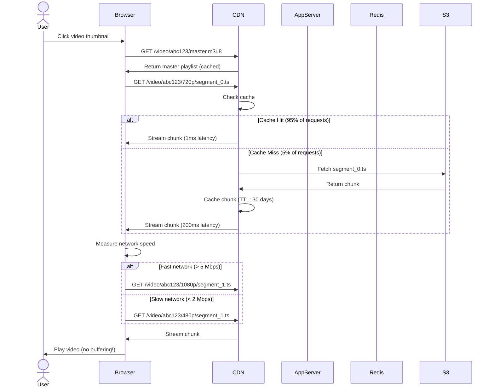

# Step 5: CDN & Object Storage for Video Delivery

## The Problem We're Solving

From Step 4, we still have critical issues with video storage and delivery:

### Problem 1: Bandwidth Costs 💰

```
From Step 1 calculations:
- Daily video streaming: 470 Petabytes/day
- CDN cost: ~$0.05/GB
- Daily cost: 470,000,000 GB × $0.05 = $23.5 million/day
- Yearly cost: $8.6 BILLION/year 😱

Without optimization, YouTube would spend more on bandwidth than revenue!
```

---

### Problem 2: High Latency for Global Users 🌍

```
User in Tokyo requests video:
  ↓
Request travels to US datacenter (200ms latency)
  ↓
Video streams from US (high latency, buffering)
  ↓
User experience: Constant buffering 😡

Problem: All videos stored in single location (US)
Solution: Cache videos close to users (CDN edge servers)
```

---

### Problem 3: Storage Scalability 💾

```
Local disk storage (from Step 1):
- Capacity: 10 TB per server
- Total videos: 1 Exabyte (1,000,000 TB)
- Servers needed: 100,000 servers! 🚨

Cost:
- $200/server/month
- 100,000 × $200 = $20 million/month

Problems:
- Managing 100,000 disks is a nightmare
- Disk failures are frequent (no redundancy)
- Can't scale easily (manual provisioning)
```

**Solution:** Move to cloud object storage (S3, Google Cloud Storage)

---

## Solution: CDN + Object Storage

### Components Added in Step 5

#### 1. **CDN (Content Delivery Network)**
- **What:** Network of edge servers distributed globally
- **Purpose:**
  - Cache videos close to users (reduce latency)
  - Reduce origin server load (95%+ traffic served from edge)
  - Reduce bandwidth costs (cheaper edge bandwidth)
- **Technologies:**
  - **Google Cloud CDN** (YouTube uses this!)
  - **CloudFlare**
  - **Akamai**
  - **AWS CloudFront**

**Beginner Analogy:**

Imagine a library (origin) with 1 copy of each book.

**Without CDN:**
- Everyone travels to the library to borrow books (slow, crowded)

**With CDN:**
- Library photocopies popular books and places them in local bookstores
- People borrow from nearby bookstore (fast, convenient)
- Library only handles requests for rare books

---

#### 2. **Object Storage (S3)**
- **What:** Cloud storage service for unstructured data (files, images, videos)
- **Purpose:**
  - Scalable (unlimited capacity)
  - Durable (11 nines: 99.999999999%)
  - Cost-effective ($0.023/GB/month vs $0.10/GB for disk)
  - Multi-region replication (disaster recovery)
- **Technologies:**
  - **AWS S3** (industry standard)
  - **Google Cloud Storage**
  - **Azure Blob Storage**

---

## Architecture Diagram: Step 5

```mermaid
graph TB
    subgraph "Users Worldwide"
        UserUS[User in USA]
        UserEU[User in Europe]
        UserAsia[User in Asia]
    end

    subgraph "CDN Layer (Edge Servers) 🆕"
        CDNUS[CDN PoP: US East<br/>Cache popular videos<br/>Serve 95% of traffic]
        CDNEU[CDN PoP: Europe<br/>Cache popular videos<br/>Serve 95% of traffic]
        CDNAsia[CDN PoP: Asia<br/>Cache popular videos<br/>Serve 95% of traffic]
    end

    subgraph "Load Balancing Layer"
        LB[Load Balancer]
    end

    subgraph "Application Layer"
        App1[Upload Service]
        App2[Metadata Service]
        App3[Search Service]
    end

    subgraph "Caching Layer"
        Redis[Redis Cluster<br/>Metadata Cache]
    end

    subgraph "Message Queue"
        Kafka[Apache Kafka<br/>Async Tasks]
    end

    subgraph "Background Workers"
        Worker[Transcode Workers<br/>24,000 workers<br/>FFmpeg]
    end

    subgraph "Database Layer"
        DBMaster[(Master DB)]
        DBSlave[(Slave DBs)]
    end

    subgraph "Object Storage (Origin) 🆕"
        S3Raw[S3: Raw Videos<br/>Original uploads<br/>Lifecycle: Delete after 90 days]
        S3Transcoded[S3: Transcoded Videos<br/>Multi-resolution<br/>240p, 360p, 720p, 1080p, 4K<br/>Lifecycle: Glacier after 1 year]
        S3Thumb[S3: Thumbnails<br/>JPG images<br/>Fast access]
    end

    UserUS -->|1. Request video| CDNUS
    UserEU -->|1. Request video| CDNEU
    UserAsia -->|1. Request video| CDNAsia

    CDNUS -.2. Cache Miss.-> LB
    CDNEU -.2. Cache Miss.-> LB
    CDNAsia -.2. Cache Miss.-> LB

    LB --> App1
    LB --> App2
    LB --> App3

    App1 --> Redis
    App2 --> Redis
    App3 --> Redis

    App1 -->|Upload| S3Raw
    App1 -->|Publish task| Kafka
    Kafka --> Worker
    Worker -->|Read raw| S3Raw
    Worker -->|Write transcoded| S3Transcoded
    Worker -->|Generate| S3Thumb

    App2 --> DBSlave
    App3 --> DBSlave
    App1 --> DBMaster
    DBMaster -.Replicate.-> DBSlave

    CDNUS -->|3. Fetch from origin| S3Transcoded
    CDNEU -->|3. Fetch from origin| S3Transcoded
    CDNAsia -->|3. Fetch from origin| S3Transcoded

    S3Transcoded -->|4. Return video| CDNUS
    S3Transcoded -->|4. Return video| CDNEU
    S3Transcoded -->|4. Return video| CDNAsia

    CDNUS -->|5. Cache & stream| UserUS
    CDNEU -->|5. Cache & stream| UserEU
    CDNAsia -->|5. Cache & stream| UserAsia

    style CDNUS fill:#e1f5ff
    style CDNEU fill:#e1f5ff
    style CDNAsia fill:#e1f5ff
    style S3Raw fill:#fff9c4
    style S3Transcoded fill:#fff9c4
    style S3Thumb fill:#fff9c4
```

---

## What Changed from Step 4?

| Step 4 (Local Storage) | Step 5 (CDN + S3) |
|------------------------|-------------------|
| Videos on local disk | ✅ Videos in S3 (unlimited scale) |
| All traffic to origin | ✅ 95% traffic served from CDN edge |
| High latency (global users) | ✅ Low latency (edge caching) |
| Bandwidth cost: $23.5M/day | ✅ Bandwidth cost: $2.4M/day (10x savings!) |
| Storage cost: $20M/month | ✅ Storage cost: $2.3M/month (9x savings!) |
| No redundancy | ✅ 11 nines durability (multi-region) |

---

## How CDN Works: Cache Hit vs Cache Miss

### Cache Hit (95% of requests) ⚡

```
User in NYC requests: https://youtube.com/watch?v=abc123 (720p)
    ↓
DNS resolves to nearest CDN PoP (NYC)
    ↓
CDN PoP checks cache:
  Key: video:abc123:720p
  Status: HIT (video is cached)
    ↓
CDN streams video from local SSD (1ms latency)
    ↓
User watches video with NO buffering ✅

Total time: ~50ms (DNS + CDN lookup)
Bandwidth source: CDN (cheap: $0.02/GB)
```

---

### Cache Miss (5% of requests) 🐌

```
User in rural India requests: https://youtube.com/watch?v=xyz789 (720p)
    ↓
DNS resolves to nearest CDN PoP (Mumbai)
    ↓
CDN PoP checks cache:
  Key: video:xyz789:720p
  Status: MISS (video NOT cached)
    ↓
CDN fetches from S3 origin (US-East)
  Latency: 200ms (cross-continent)
    ↓
CDN caches video locally (for future requests)
    ↓
CDN streams video to user
    ↓
User experiences initial buffering (200ms delay)

Total time: ~300ms (DNS + origin fetch + CDN lookup)
Bandwidth source: S3 → CDN (more expensive: $0.05/GB)

NEXT user in India requesting same video:
→ Cache HIT! (50ms, no buffering) ✅
```

---

## CDN Caching Strategy

### What to Cache?

#### 1. **Popular Videos (Hot Data)** ⭐
- **80/20 Rule:** 20% of videos account for 80% of views
- Cache these aggressively (long TTL: 30 days)

**Example:**
```
Video: "Gangnam Style"
Views: 4.6 billion
Cache hit ratio: 99.9% (fetched from origin only once per edge)
Bandwidth savings: 4.6B × 500 MB × $0.05 = $115 million saved!
```

---

#### 2. **Recent Uploads (Warm Data)** 🔥
- Newly uploaded videos often get views quickly
- Cache for 7 days (medium TTL)

---

#### 3. **Long-Tail Videos (Cold Data)** ❄️
- Videos with < 1000 views
- Don't cache (cache miss is acceptable)
- Store in S3 Glacier (cheap storage: $0.004/GB/month)

---

### Cache Eviction Policy: LRU (Least Recently Used)

```
CDN PoP cache capacity: 10 TB

When cache is full:
1. Evict least recently accessed video
2. Make space for new video
3. Evicted video fetched from origin on next request (cache miss)

Example:
Cache (10 TB full):
  - video_1 (last accessed 30 days ago) ← EVICTED
  - video_2 (last accessed 10 days ago)
  - video_3 (last accessed 1 hour ago)
  - video_4 (last accessed 5 minutes ago)
```

---

## Object Storage (S3): Architecture

### S3 Buckets

```
youtube-raw-videos (Bucket 1):
  - Purpose: Store original uploads
  - Lifecycle: Delete after 90 days (save cost)
  - Redundancy: Multi-region replication
  - Access: Private (only workers can read)

youtube-transcoded-videos (Bucket 2):
  - Purpose: Store transcoded videos (all resolutions)
  - Lifecycle:
    - First 6 months: S3 Standard ($0.023/GB/month)
    - 6-12 months: S3 Infrequent Access ($0.0125/GB/month)
    - After 1 year: S3 Glacier ($0.004/GB/month)
  - Redundancy: Multi-region replication
  - Access: Public (CDN fetches on cache miss)

youtube-thumbnails (Bucket 3):
  - Purpose: Store video thumbnails (JPG)
  - Lifecycle: Never delete
  - Redundancy: Multi-region replication
  - Access: Public (via CDN)
```

---

### S3 Storage Classes: Cost Optimization

| Storage Class | Cost/GB/month | Use Case | Retrieval Time |
|---------------|---------------|----------|----------------|
| **S3 Standard** | $0.023 | Recent videos (< 6 months) | Instant |
| **S3 IA** (Infrequent Access) | $0.0125 | Older videos (6-12 months) | Instant |
| **S3 Glacier** | $0.004 | Archive (> 1 year) | 3-5 hours |
| **S3 Glacier Deep Archive** | $0.00099 | Compliance (legal hold) | 12 hours |

---

### Storage Cost Calculation

#### Given (from Step 1):
- Total storage: 1 Exabyte = 1,000,000,000 GB
- Distribution:
  - Recent (< 6 months): 20% = 200M GB → S3 Standard
  - Medium (6-12 months): 30% = 300M GB → S3 IA
  - Archive (> 1 year): 50% = 500M GB → S3 Glacier

#### Cost:
```
S3 Standard: 200M GB × $0.023 = $4.6M/month
S3 IA:       300M GB × $0.0125 = $3.75M/month
S3 Glacier:  500M GB × $0.004 = $2M/month

Total S3 cost: $10.35M/month ≈ $124M/year

vs Local disk: $20M/month = $240M/year

Savings: 50%! ✅
```

---

## Adaptive Bitrate Streaming (ABR)

### Problem: Fixed Bitrate Streaming

```
User on slow Wi-Fi (1 Mbps):
  - Requests 1080p video (bitrate: 5 Mbps)
  - Network can't keep up (1 Mbps < 5 Mbps)
  - Constant buffering every 2 seconds 😡
  - User gives up and leaves
```

```
User on fast fiber (100 Mbps):
  - Requests 360p video (bitrate: 800 Kbps)
  - Wastes bandwidth (could stream 4K!)
  - Poor video quality (pixelated)
```

---

### Solution: Adaptive Bitrate Streaming (ABR)

**How it works:**
1. Encode video at multiple bitrates (240p, 360p, 720p, 1080p)
2. Split each video into chunks (2-10 seconds each)
3. Client measures network speed in real-time
4. Client requests appropriate quality for next chunk

```
User starts watching:
  ↓
Chunk 1 (720p, 2 sec) - Network: 5 Mbps ✅ Smooth
  ↓
Chunk 2 (720p, 2 sec) - Network: 5 Mbps ✅ Smooth
  ↓
Network degrades to 1 Mbps 📉
  ↓
Chunk 3 (360p, 2 sec) - Network: 1 Mbps ✅ Smooth (quality drops)
  ↓
Network recovers to 10 Mbps 📈
  ↓
Chunk 4 (1080p, 2 sec) - Network: 10 Mbps ✅ Smooth (quality improves)
```

**Result:** No buffering, seamless quality switching!

---

## HLS vs DASH: Streaming Protocols

### HLS (HTTP Live Streaming) - Apple

**File structure:**
```
video_abc123/
  master.m3u8 (playlist)
  720p/
    segment_0.ts (2 sec)
    segment_1.ts (2 sec)
    segment_2.ts (2 sec)
    ...
  1080p/
    segment_0.ts (2 sec)
    segment_1.ts (2 sec)
    ...
```

**master.m3u8:**
```
#EXTM3U
#EXT-X-STREAM-INF:BANDWIDTH=2500000,RESOLUTION=1280x720
720p/playlist.m3u8
#EXT-X-STREAM-INF:BANDWIDTH=5000000,RESOLUTION=1920x1080
1080p/playlist.m3u8
```

**Pros:**
- ✅ Native support on iOS, Safari
- ✅ Simple to implement
- ✅ Works over HTTP (CDN-friendly)

**Cons:**
- ❌ Requires separate files for each chunk (storage overhead)

---

### DASH (Dynamic Adaptive Streaming over HTTP) - Industry Standard

**Similar to HLS but:**
- Uses MPD (Media Presentation Description) instead of M3U8
- More flexible (supports multiple codecs)
- Better support for DRM (Digital Rights Management)

**YouTube's Choice:** Use **both** HLS (for iOS) and DASH (for Android, web)

---

## Video Delivery Flow: End-to-End

### Scenario: User Watches Video



---

## Bandwidth Cost Optimization

### Before CDN (All Traffic from Origin)

```
Daily bandwidth: 470 PB/day
Origin bandwidth cost: $0.09/GB (expensive!)
Daily cost: 470,000,000 GB × $0.09 = $42.3M/day

Yearly cost: $15.4 BILLION/year 😱
```

---

### After CDN (95% Traffic from Edge)

```
Cache hit ratio: 95%
Edge bandwidth: 470 PB × 95% = 446.5 PB/day
Origin bandwidth: 470 PB × 5% = 23.5 PB/day

Edge bandwidth cost: $0.02/GB (cheap!)
Origin bandwidth cost: $0.09/GB

Daily cost:
  Edge: 446,500,000 GB × $0.02 = $8.93M/day
  Origin: 23,500,000 GB × $0.09 = $2.12M/day
  Total: $11.05M/day

Yearly cost: $4.03 BILLION/year

Savings: $15.4B - $4B = $11.4 BILLION/year! 🎉
```

**This is why CDN is non-negotiable for YouTube!**

---

## CDN PoP (Point of Presence) Distribution

### Global Coverage

```
North America: 150 PoPs
  - Major cities: NYC, LA, Chicago, Toronto, Mexico City
  - Coverage: 99% of population within 50 miles

Europe: 100 PoPs
  - Major cities: London, Paris, Frankfurt, Amsterdam, Madrid

Asia: 120 PoPs
  - Major cities: Tokyo, Seoul, Singapore, Mumbai, Beijing

South America: 30 PoPs
  - Major cities: São Paulo, Buenos Aires, Santiago

Africa: 20 PoPs
  - Major cities: Johannesburg, Cairo, Lagos

Total: 420 PoPs worldwide
```

**Each PoP:**
- 10-50 TB SSD cache
- 100 Gbps network uplink
- Redundant power and cooling

---

## Prefetching: Predictive Loading

### Problem: Waiting for User to Request Next Chunk

```
User watches Chunk 1 (0-2 sec)
  ↓ Buffer runs out
User requests Chunk 2 (2-4 sec)
  ↓ 50ms latency
Buffer fills again
```

---

### Solution: Prefetch Next Chunks

```
User starts playing:
  ↓
Browser prefetches Chunks 1-5 (10 sec buffer)
  ↓
User watches Chunk 1
  ↓ (seamless transition)
Browser watches Chunk 2 (already buffered!)
  ↓
Browser prefetches Chunk 6 (maintain 10 sec buffer)
```

**Result:** No stuttering, smooth playback!

---

## DRM (Digital Rights Management)

### Problem: Content Piracy

YouTube must protect copyrighted content (movies, premium content).

---

### Solution: Encrypted Streaming

**Technologies:**
- **Widevine** (Google) - Android, Chrome
- **FairPlay** (Apple) - iOS, Safari
- **PlayReady** (Microsoft) - Edge, Xbox

**How it works:**
1. Encrypt video chunks with AES-128
2. Client requests decryption key from license server
3. License server validates user subscription
4. If valid, return decryption key
5. Client decrypts and plays video

**Prevents:**
- Video downloading (encrypted files are useless)
- Screen recording (HDCP protection)

---

## S3 Lifecycle Policies: Automatic Cost Savings

### Policy Example:

```json
{
  "Rules": [
    {
      "Id": "MoveOldVideosToGlacier",
      "Status": "Enabled",
      "Transitions": [
        {
          "Days": 180,
          "StorageClass": "STANDARD_IA"
        },
        {
          "Days": 365,
          "StorageClass": "GLACIER"
        }
      ]
    },
    {
      "Id": "DeleteRawVideos",
      "Status": "Enabled",
      "Filter": {
        "Prefix": "raw-videos/"
      },
      "Expiration": {
        "Days": 90
      }
    }
  ]
}
```

**Result:** Automatic cost optimization without manual intervention!

---

## Multi-Region Replication: Disaster Recovery

### Setup:

```
Primary Region: US-East-1
  - S3 bucket: youtube-videos-us

Replica Region: EU-West-1
  - S3 bucket: youtube-videos-eu (sync every 15 min)

Replica Region: AP-Southeast-1
  - S3 bucket: youtube-videos-asia (sync every 15 min)
```

**Benefits:**
- **Disaster recovery:** If US datacenter burns down, EU/Asia have copies
- **Low latency:** CDN fetches from nearest region
- **Compliance:** GDPR requires EU data to stay in EU

---

## Summary: Step 5 Achievements

### What We Added
✅ CDN with 420 PoPs worldwide (95% cache hit ratio)
✅ S3 object storage (1 Exabyte capacity, 11 nines durability)
✅ Adaptive bitrate streaming (HLS/DASH)
✅ Multi-region replication (disaster recovery)
✅ Lifecycle policies (automatic cost savings)
✅ DRM for premium content (Widevine, FairPlay)

### Performance Improvements
✅ Latency: 200ms → 50ms (4x faster for global users)
✅ Buffering: Eliminated (ABR adapts to network speed)
✅ Cache hit ratio: 95% (CDN serves most traffic)

### Cost Savings
✅ Bandwidth: $15.4B/year → $4B/year (73% savings!)
✅ Storage: $240M/year → $124M/year (48% savings!)
✅ Total annual savings: **$11.5 BILLION!** 🎉

### Remaining Problems
❌ Monolithic app server (hard to scale individual features)
❌ Search is slow (full-text search on SQL is inefficient)
❌ Recommendations are basic (no ML-powered personalization)
❌ Live streaming not supported (different architecture needed)

---

## What's Next?

In **Step 6**, we'll break the monolith into **microservices**:
- Upload Service
- Streaming Service
- Search Service (with Elasticsearch)
- Recommendation Service (with ML models)
- User Service
- Analytics Service

Let's continue! 🚀
