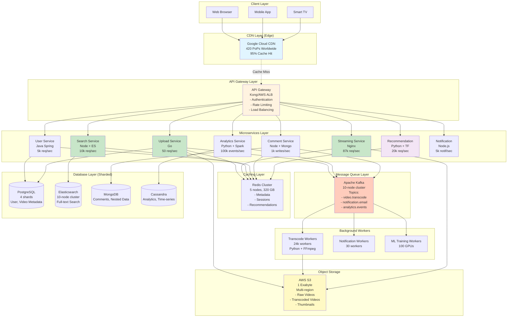

# Step 6: Microservices & Final Architecture

## The Problem We're Solving

From Step 5, we still have a **monolithic** application server:

```
Single App Server handles:
- Video uploads
- Video streaming
- Search queries
- User authentication
- Comments & likes
- Recommendations
- Analytics
- Notifications
- ...everything!

Problems:
1. Hard to scale specific features independently
2. Single point of failure (one bug crashes entire app)
3. Slow deployments (must deploy entire monolith)
4. Technology lock-in (entire app in one language)
5. Team bottlenecks (all devs work on same codebase)
```

---

## Solution: Microservices Architecture

### What is Microservices?

**Microservices** = Breaking a large application into smaller, independent services

**Analogy:**

**Monolith** = Swiss Army Knife
- One tool does everything
- If one blade breaks, entire knife is compromised

**Microservices** = Toolbox
- Separate tools for each task (hammer, screwdriver, wrench)
- If hammer breaks, screwdriver still works
- Can replace tools independently

---

## YouTube Microservices: Service Breakdown

### 1. **Upload Service**
- **Responsibility:** Handle video uploads
- **APIs:**
  - `POST /upload/initiate` - Start multipart upload
  - `POST /upload/chunk` - Upload video chunk
  - `POST /upload/complete` - Finalize upload
- **Technology:** Go (high performance I/O)
- **Scale:** 50 uploads/sec
- **Database:** PostgreSQL (metadata)
- **Message Queue:** Publish to `video.transcode` topic

---

### 2. **Transcode Service**
- **Responsibility:** Convert videos to multiple resolutions
- **Worker Type:** Background worker (consumes Kafka messages)
- **Technology:** Python + FFmpeg
- **Scale:** 24,000 workers (CPU-intensive)
- **Storage:** Read from S3 (raw), write to S3 (transcoded)

---

### 3. **Streaming Service**
- **Responsibility:** Serve video playback
- **APIs:**
  - `GET /stream/{video_id}/master.m3u8` - HLS manifest
  - `GET /stream/{video_id}/{quality}/segment_{n}.ts` - Video chunks
- **Technology:** Nginx (optimized for file streaming)
- **Scale:** 87,000 req/sec (peak)
- **CDN Integration:** Most traffic served from CDN (95%)

---

### 4. **Search Service**
- **Responsibility:** Video search and autocomplete
- **APIs:**
  - `GET /search?q={query}&filters={...}` - Search videos
  - `GET /autocomplete?q={query}` - Suggestions
- **Technology:** Node.js + Elasticsearch
- **Scale:** 10,000 queries/sec
- **Database:** Elasticsearch cluster (full-text search)

---

### 5. **User Service**
- **Responsibility:** User authentication, profiles, subscriptions
- **APIs:**
  - `POST /users/register` - Create account
  - `POST /users/login` - Login (JWT token)
  - `GET /users/{id}` - Get user profile
  - `POST /users/{id}/subscribe` - Subscribe to channel
- **Technology:** Java Spring Boot
- **Scale:** 5,000 req/sec
- **Database:** PostgreSQL (user data)

---

### 6. **Comment Service**
- **Responsibility:** Comments, replies, likes/dislikes
- **APIs:**
  - `POST /comments` - Add comment
  - `GET /comments?video_id={id}` - Get comments
  - `POST /comments/{id}/like` - Like comment
- **Technology:** Node.js
- **Scale:** 1,000 writes/sec, 10,000 reads/sec
- **Database:** MongoDB (nested comments, schema-less)

---

### 7. **Analytics Service**
- **Responsibility:** View counts, watch time, engagement metrics
- **APIs:**
  - `POST /analytics/view` - Record video view
  - `GET /analytics/video/{id}` - Get video stats
  - `GET /analytics/trending` - Trending videos
- **Technology:** Python + Apache Spark (big data processing)
- **Scale:** 100,000 events/sec
- **Database:** Cassandra (time-series data)

---

### 8. **Recommendation Service**
- **Responsibility:** Personalized video recommendations
- **APIs:**
  - `GET /recommendations/home` - Homepage recommendations
  - `GET /recommendations/related?video_id={id}` - Related videos
- **Technology:** Python + TensorFlow (ML models)
- **Scale:** 20,000 req/sec
- **Database:** Redis (cached recommendations)
- **ML Model:** Collaborative filtering + deep learning

---

### 9. **Notification Service**
- **Responsibility:** Email, push notifications, SMS
- **APIs:**
  - `POST /notifications/send` - Send notification
- **Technology:** Node.js
- **Scale:** 5,000 notifications/sec
- **Message Queue:** Consumes from Kafka topics

---

### 10. **Admin Service**
- **Responsibility:** Content moderation, copyright strikes
- **APIs:**
  - `POST /admin/videos/{id}/ban` - Remove video
  - `POST /admin/users/{id}/suspend` - Suspend user
- **Technology:** Python Django
- **Scale:** 100 req/sec (internal use only)

---

## Final Architecture Diagram



---

## What Changed from Step 5 (Monolith to Microservices)?

| Monolith (Step 5) | Microservices (Step 6) |
|-------------------|------------------------|
| Single app server | ✅ 10 independent services |
| One technology stack | ✅ Best tool for each job (Go, Java, Python, Node) |
| Scale entire app | ✅ Scale services independently |
| Single point of failure | ✅ Service isolation (Upload fails ≠ Search fails) |
| Deploy entire app | ✅ Deploy services independently |
| One team, one codebase | ✅ Multiple teams, ownership per service |

---

## Inter-Service Communication

### Option 1: REST API (Synchronous) ⭐ Most Common

**Use Case:** User service needs to verify video owner

```python
# Comment Service calls User Service
response = requests.get(
    "http://user-service:8080/users/12345",
    headers={"Authorization": f"Bearer {token}"}
)

user = response.json()
if user["id"] == video["owner_id"]:
    allow_comment()
```

**Pros:**
- ✅ Simple, standard (HTTP/JSON)
- ✅ Easy to debug (logs, traces)

**Cons:**
- ❌ Slow (network latency)
- ❌ Tight coupling (Comment service depends on User service)

---

### Option 2: gRPC (Synchronous, High Performance)

**Use Case:** Search service needs video metadata (high throughput)

```protobuf
// video.proto
service VideoService {
  rpc GetVideo(VideoRequest) returns (VideoResponse);
}

message VideoRequest {
  string video_id = 1;
}

message VideoResponse {
  string video_id = 1;
  string title = 2;
  string description = 3;
}
```

**Pros:**
- ✅ Fast (binary protocol, HTTP/2)
- ✅ Strong typing (Protocol Buffers)

**Cons:**
- ❌ More complex setup
- ❌ Not human-readable (binary)

---

### Option 3: Message Queue (Asynchronous) ⭐ Best for Decoupling

**Use Case:** User uploads video → Notify subscribers

```python
# Upload Service (Producer)
kafka.publish("video.uploaded", {
    "video_id": "abc123",
    "channel_id": "chan456",
    "title": "New Video!"
})

# Notification Service (Consumer)
def on_video_uploaded(message):
    subscribers = db.get_subscribers(message["channel_id"])
    for sub in subscribers:
        send_email(sub.email, f"New video: {message['title']}")
```

**Pros:**
- ✅ Decoupled (services don't know about each other)
- ✅ Resilient (if Notification service is down, messages queue up)
- ✅ Scalable (add more consumers)

**Cons:**
- ❌ Eventual consistency (not real-time)
- ❌ Complex debugging (distributed tracing needed)

---

## Service Discovery: How Services Find Each Other

### Problem: Dynamic IPs

```
Comment Service needs to call User Service:
  - User Service IP: 192.168.1.10 (today)
  - User Service IP: 192.168.1.25 (tomorrow, after restart)

Comment Service hardcoded: http://192.168.1.10 ❌ BROKEN!
```

---

### Solution: Service Registry (Consul, Eureka)

```
1. User Service starts → Registers with Consul:
   Name: user-service
   IP: 192.168.1.10
   Port: 8080

2. Comment Service needs User Service:
   → Query Consul: "Where is user-service?"
   → Consul responds: 192.168.1.10:8080

3. Comment Service calls: http://192.168.1.10:8080/users/123

4. User Service restarts (new IP: 192.168.1.25):
   → Registers with Consul (auto-update)

5. Comment Service queries again:
   → Consul responds: 192.168.1.25:8080 ✅
```

**Technologies:**
- **Consul** (HashiCorp)
- **Eureka** (Netflix)
- **Kubernetes DNS** (built-in for K8s)

---

## API Gateway: Single Entry Point

### Purpose

- **Routing:** Route `/upload/*` to Upload Service, `/search/*` to Search Service
- **Authentication:** Verify JWT tokens (centralized)
- **Rate Limiting:** Prevent abuse (100 req/min per user)
- **Load Balancing:** Distribute traffic across service instances

---

### Example: Kong API Gateway Config

```yaml
services:
  - name: upload-service
    url: http://upload-service:8080
    routes:
      - name: upload-route
        paths:
          - /upload

  - name: search-service
    url: http://search-service:9000
    routes:
      - name: search-route
        paths:
          - /search

plugins:
  - name: jwt
    config:
      secret: "my-secret-key"
  - name: rate-limiting
    config:
      minute: 100
      policy: local
```

---

## Database Per Service Pattern

### Principle: Each Service Owns Its Database

```
User Service → PostgreSQL (users table)
Comment Service → MongoDB (comments collection)
Analytics Service → Cassandra (events table)
Search Service → Elasticsearch (videos index)
```

**Benefits:**
- ✅ Service independence (no shared database locks)
- ✅ Choose best database for each use case
- ✅ Easier to scale services independently

**Challenges:**
- ❌ No joins across services (must query multiple services)
- ❌ Distributed transactions are complex (eventual consistency)

---

## Distributed Transactions: Saga Pattern

### Problem: Multi-Service Transaction

```
User uploads video:
1. Upload Service: Save metadata to database
2. Analytics Service: Record upload event
3. Notification Service: Notify subscribers

What if step 2 fails? How to rollback step 1?
```

---

### Solution: Saga Pattern (Choreography)

```
Upload Service:
  1. Save metadata to DB
  2. Publish: video.uploaded event

Analytics Service (consumes video.uploaded):
  1. Record event
  2. Publish: video.analytics.recorded

Notification Service (consumes video.uploaded):
  1. Send emails
  2. Publish: video.notified

If Analytics Service fails:
  1. Publish: video.analytics.failed
  2. Upload Service (consumes video.analytics.failed):
     → Rollback metadata (mark as "failed")
```

**Compensating Transaction** = Undo previous step

---

## Circuit Breaker Pattern: Preventing Cascade Failures

### Problem: Dependency Failure

```
Comment Service → User Service (to get username)

User Service crashes:
  Comment Service retries → timeout (5 sec)
  Comment Service retries → timeout (5 sec)
  Comment Service retries → timeout (5 sec)

Comment Service is overwhelmed with retries:
  → Comment Service crashes too! 🚨

Cascade failure: 1 service crashes → all dependent services crash
```

---

### Solution: Circuit Breaker

```
States:
- CLOSED (normal): Requests go through
- OPEN (failure detected): Requests fail immediately (no retries)
- HALF-OPEN (testing): Allow 1 request to test recovery

Algorithm:
1. Track success/failure rate
2. If failures > 50% in last minute:
   → Open circuit (stop sending requests)
3. After 30 seconds:
   → Half-open (try 1 request)
4. If request succeeds:
   → Close circuit (resume normal)
5. If request fails:
   → Open circuit (wait another 30 sec)
```

**Library:** Hystrix (Netflix), resilience4j (Java)

---

## Monitoring & Observability

### Three Pillars

#### 1. **Metrics** (What is happening?)

```
Upload Service metrics:
- Requests per second: 50
- Latency (p95): 200ms
- Error rate: 0.1%
- CPU usage: 45%
- Memory usage: 2.5 GB

Tools: Prometheus + Grafana
```

---

#### 2. **Logs** (What happened in detail?)

```
[2025-01-17 10:30:15] INFO Upload Service: Video upload started (video_id=abc123, user_id=456)
[2025-01-17 10:30:17] INFO Upload Service: Chunk 1/10 received (1 MB)
[2025-01-17 10:30:45] INFO Upload Service: Upload completed (video_id=abc123)
[2025-01-17 10:30:46] ERROR Transcode Worker: FFmpeg failed (video_id=abc123, error=invalid_codec)

Tools: ELK Stack (Elasticsearch, Logstash, Kibana)
```

---

#### 3. **Traces** (How did request flow through services?)

```
User uploads video:
  1. API Gateway: 10ms
  2. Upload Service: 200ms
     → S3 upload: 150ms
     → PostgreSQL insert: 50ms
  3. Kafka publish: 5ms

Total: 215ms

Tools: Jaeger, Zipkin
```

---

## Deployment: Kubernetes

### Why Kubernetes?

- Auto-scaling (scale services based on CPU/memory)
- Self-healing (restart crashed containers)
- Load balancing (distribute traffic)
- Rolling updates (zero-downtime deployments)

---

### Example: Kubernetes Deployment

```yaml
apiVersion: apps/v1
kind: Deployment
metadata:
  name: upload-service
spec:
  replicas: 10  # 10 instances
  selector:
    matchLabels:
      app: upload-service
  template:
    metadata:
      labels:
        app: upload-service
    spec:
      containers:
      - name: upload-service
        image: youtube/upload-service:v1.2.3
        ports:
        - containerPort: 8080
        resources:
          requests:
            memory: "256Mi"
            cpu: "500m"
          limits:
            memory: "512Mi"
            cpu: "1000m"
        livenessProbe:
          httpGet:
            path: /health
            port: 8080
          initialDelaySeconds: 30
          periodSeconds: 10

---
apiVersion: autoscaling/v2
kind: HorizontalPodAutoscaler
metadata:
  name: upload-service-hpa
spec:
  scaleTargetRef:
    apiVersion: apps/v1
    kind: Deployment
    name: upload-service
  minReplicas: 10
  maxReplicas: 100
  metrics:
  - type: Resource
    resource:
      name: cpu
      target:
        type: Utilization
        averageUtilization: 70
```

**Auto-scaling:** If CPU > 70%, add more pods (up to 100)

---

## Trade-offs: Monolith vs Microservices

| Factor | Monolith | Microservices |
|--------|----------|---------------|
| **Complexity** | ✅ Simple | ❌ Complex (distributed system) |
| **Development Speed** | ✅ Fast initially | ❌ Slower (coordination needed) |
| **Scalability** | ❌ Limited (scale entire app) | ✅ Granular (scale services independently) |
| **Deployment** | ❌ All or nothing | ✅ Independent deployments |
| **Failure Isolation** | ❌ One bug crashes all | ✅ Service isolation |
| **Technology Diversity** | ❌ Single stack | ✅ Best tool for each job |
| **Team Structure** | ❌ Bottleneck (one team) | ✅ Parallel teams (ownership) |
| **Debugging** | ✅ Easy (single process) | ❌ Hard (distributed tracing) |
| **Best For** | Startups, MVPs | Large-scale systems (YouTube) |

---

## When to Use Microservices?

### Start with Monolith if:
- ✅ MVP / early-stage startup
- ✅ Small team (< 10 developers)
- ✅ Low traffic (< 10k req/sec)
- ✅ Simple domain

### Migrate to Microservices when:
- ✅ Team size > 50 developers
- ✅ High traffic (> 100k req/sec)
- ✅ Different parts need different scaling (upload vs search)
- ✅ Frequent deployments needed

---

## Summary: Step 6 Achievements

### What We Added
✅ 10 microservices (Upload, Stream, Search, User, Comment, Analytics, Recommend, Notification, Admin)
✅ API Gateway (Kong) for routing, auth, rate limiting
✅ Service discovery (Consul) for dynamic IPs
✅ Circuit breaker (Hystrix) for fault tolerance
✅ Distributed tracing (Jaeger) for debugging
✅ Kubernetes for orchestration and auto-scaling

### Architecture Improvements
✅ Independent scaling (scale Upload service without affecting Search)
✅ Technology diversity (Go, Java, Python, Node.js - best tool for each job)
✅ Fault isolation (Comment service crash doesn't affect Video playback)
✅ Parallel development (10 teams work independently)
✅ Faster deployments (deploy Search without touching Upload)

### System Capacity (Total)
✅ Peak throughput: 200k req/sec (across all services)
✅ 500 million DAU supported
✅ 2.5 billion video views/day
✅ 50 video uploads/sec

---

## What's Next?

In **Phase 8-10**, we'll cover:
- **API Design:** RESTful endpoints with examples
- **Database Schema:** Detailed table design
- **Sequence Diagrams:** Critical flows (upload, streaming, search)
- **Security:** Authentication, encryption, DRM
- **Interview Q&A:** Common questions with answers

Let's continue! 🚀
