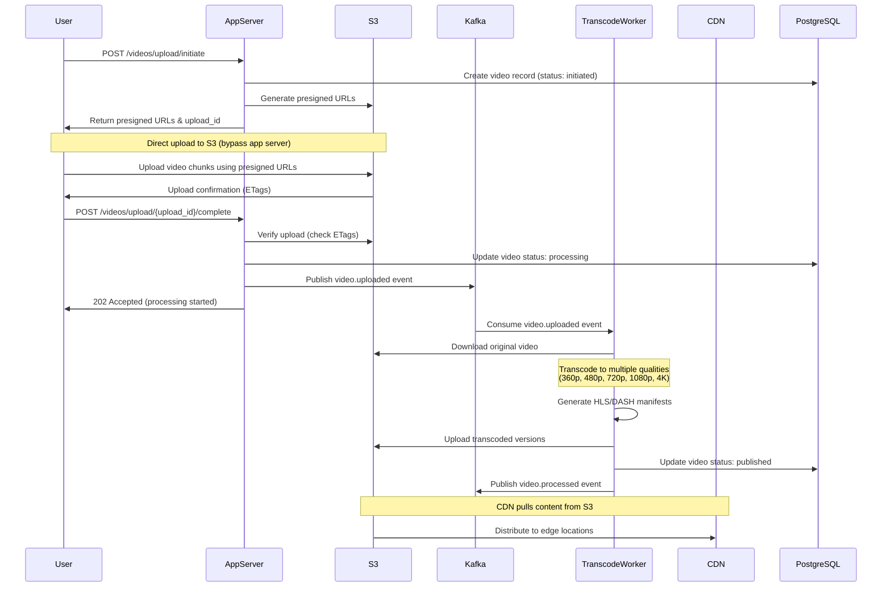
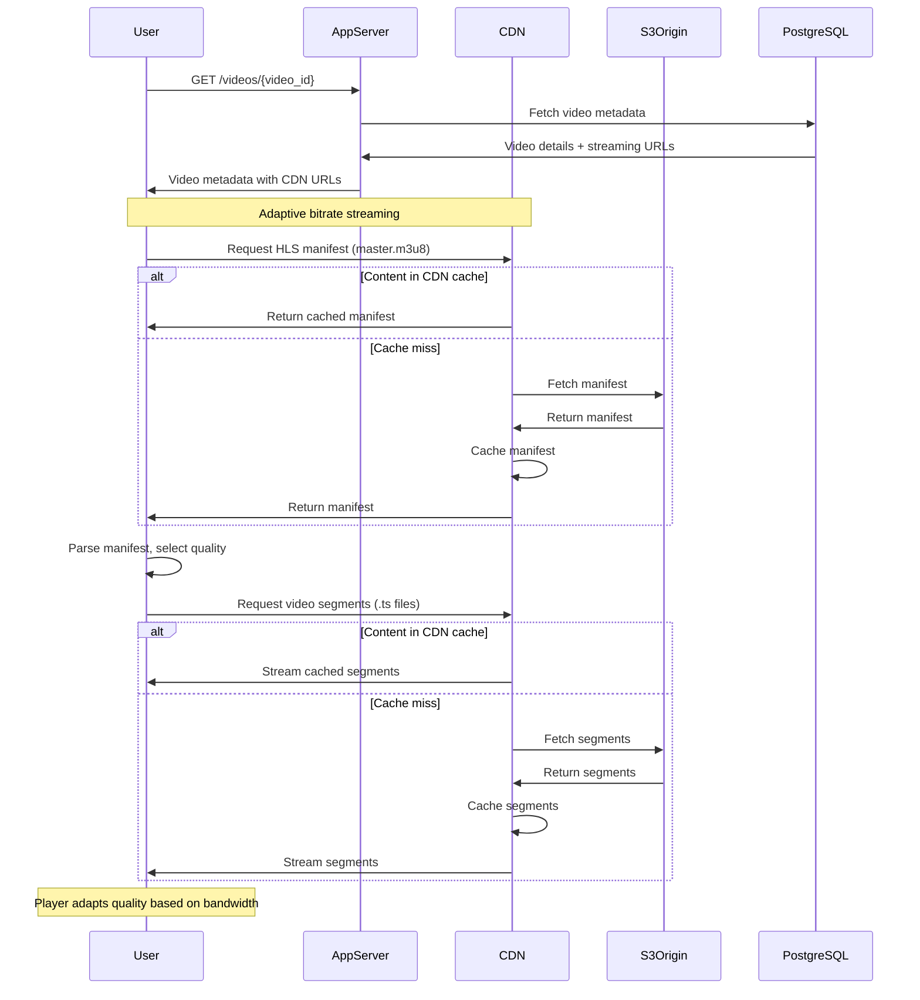
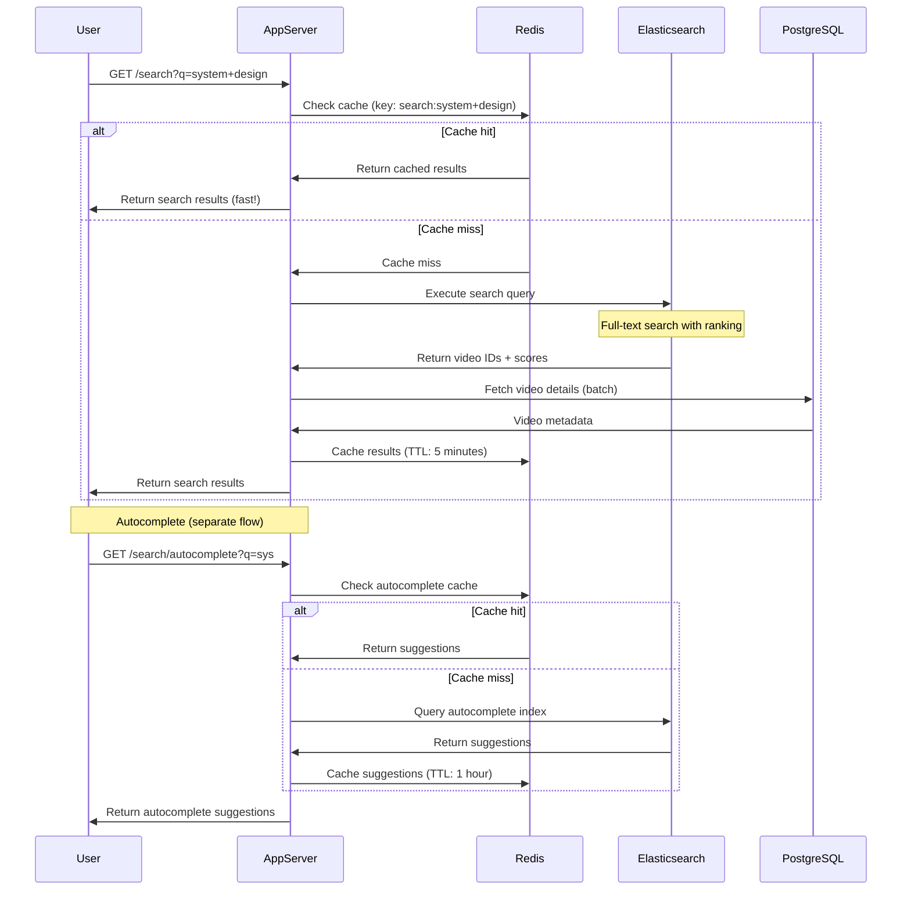
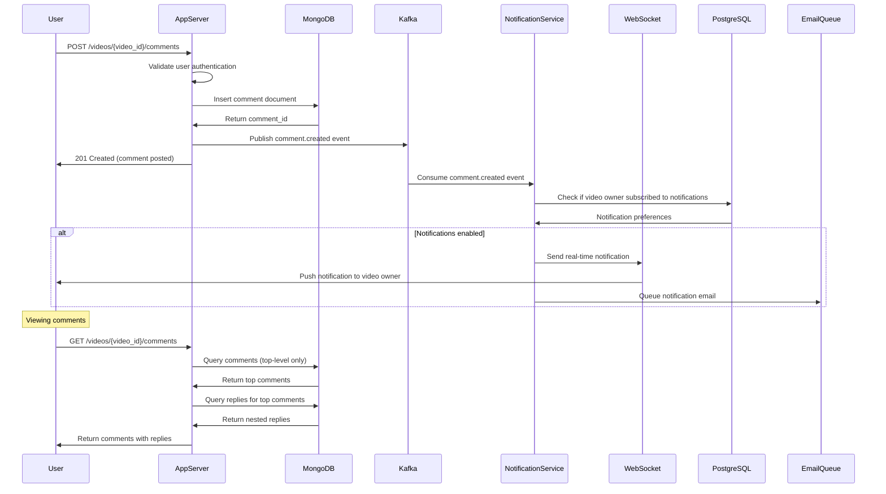

# YouTube System Design - API Design, Database Schema & Data Flow

## Table of Contents
1. [API Design](#api-design)
2. [Database Schema Design](#database-schema-design)
3. [Data Flow & Sequence Diagrams](#data-flow--sequence-diagrams)

---

## API Design

### Overview
Our YouTube system uses **RESTful APIs** with JSON payloads. All authenticated endpoints require a JWT token in the Authorization header.

**Base URL**: `https://api.youtube.com/v1`

**Authentication**:
```
Authorization: Bearer <JWT_TOKEN>
```

**Rate Limiting**:
- Unauthenticated: 100 requests/hour
- Authenticated: 10,000 requests/hour
- Upload operations: 50 uploads/day per user

**Response Headers**:
```
X-RateLimit-Limit: 10000
X-RateLimit-Remaining: 9847
X-RateLimit-Reset: 1699564800
```

---

### 1. Video Operations

#### 1.1 Upload Video (Initiate)

**Endpoint**: `POST /videos/upload/initiate`

**Why this design?**
Large video files can't be uploaded in a single HTTP request. We use a two-phase upload: initiate and then upload chunks to S3 using presigned URLs.

**Request**:
```json
{
  "title": "My Amazing Tutorial",
  "description": "Learn system design step by step",
  "category": "Education",
  "tags": ["system-design", "tutorial", "tech"],
  "visibility": "public",
  "file_size": 524288000,
  "file_name": "tutorial.mp4",
  "duration": 3600
}
```

**Response** (201 Created):
```json
{
  "upload_id": "upl_1a2b3c4d5e",
  "video_id": "vid_9z8y7x6w5v",
  "upload_urls": [
    {
      "part_number": 1,
      "presigned_url": "https://s3.amazonaws.com/uploads/part1?signature=...",
      "expires_at": "2024-01-15T12:00:00Z"
    },
    {
      "part_number": 2,
      "presigned_url": "https://s3.amazonaws.com/uploads/part2?signature=...",
      "expires_at": "2024-01-15T12:00:00Z"
    }
  ],
  "chunk_size": 10485760,
  "status": "initiated"
}
```

**Error Response** (400 Bad Request):
```json
{
  "error": {
    "code": "INVALID_FILE_SIZE",
    "message": "File size exceeds maximum allowed size of 256GB",
    "details": {
      "max_size": 274877906944,
      "provided_size": 524288000000
    }
  }
}
```

---

#### 1.2 Complete Video Upload

**Endpoint**: `POST /videos/upload/{upload_id}/complete`

**Request**:
```json
{
  "parts": [
    {
      "part_number": 1,
      "etag": "abc123def456"
    },
    {
      "part_number": 2,
      "etag": "ghi789jkl012"
    }
  ]
}
```

**Response** (200 OK):
```json
{
  "video_id": "vid_9z8y7x6w5v",
  "status": "processing",
  "message": "Video uploaded successfully and processing has started",
  "estimated_processing_time": 1800
}
```

---

#### 1.3 Get Video Details

**Endpoint**: `GET /videos/{video_id}`

**Query Parameters**:
- `include_stats` (boolean): Include view count, likes, etc.
- `include_related` (boolean): Include related videos

**Response** (200 OK):
```json
{
  "video_id": "vid_9z8y7x6w5v",
  "title": "My Amazing Tutorial",
  "description": "Learn system design step by step",
  "channel": {
    "channel_id": "ch_abc123",
    "name": "Tech Academy",
    "thumbnail": "https://cdn.youtube.com/channels/abc123/avatar.jpg",
    "is_verified": true
  },
  "duration": 3600,
  "published_at": "2024-01-15T10:30:00Z",
  "visibility": "public",
  "status": "published",
  "thumbnails": {
    "default": "https://cdn.youtube.com/thumbnails/vid_9z8y7x6w5v/default.jpg",
    "medium": "https://cdn.youtube.com/thumbnails/vid_9z8y7x6w5v/medium.jpg",
    "high": "https://cdn.youtube.com/thumbnails/vid_9z8y7x6w5v/high.jpg"
  },
  "streaming_urls": {
    "hls": "https://cdn.youtube.com/videos/vid_9z8y7x6w5v/master.m3u8",
    "dash": "https://cdn.youtube.com/videos/vid_9z8y7x6w5v/manifest.mpd"
  },
  "available_qualities": ["360p", "480p", "720p", "1080p"],
  "stats": {
    "view_count": 125430,
    "like_count": 8234,
    "dislike_count": 142,
    "comment_count": 456
  },
  "tags": ["system-design", "tutorial", "tech"],
  "category": "Education",
  "language": "en"
}
```

---

#### 1.4 Update Video

**Endpoint**: `PATCH /videos/{video_id}`

**Request**:
```json
{
  "title": "Updated Tutorial Title",
  "description": "New description here",
  "tags": ["system-design", "tutorial", "tech", "programming"],
  "visibility": "unlisted"
}
```

**Response** (200 OK):
```json
{
  "video_id": "vid_9z8y7x6w5v",
  "message": "Video updated successfully",
  "updated_fields": ["title", "description", "tags", "visibility"],
  "updated_at": "2024-01-15T14:30:00Z"
}
```

---

#### 1.5 Delete Video

**Endpoint**: `DELETE /videos/{video_id}`

**Response** (204 No Content)

---

#### 1.6 List Videos

**Endpoint**: `GET /videos`

**Why this design?**
We use cursor-based pagination instead of offset-based for better performance at scale. Cursors are encoded tokens that represent a position in the dataset.

**Query Parameters**:
- `channel_id` (string): Filter by channel
- `category` (string): Filter by category
- `limit` (integer): Results per page (default: 20, max: 50)
- `cursor` (string): Pagination cursor
- `sort` (string): Sort by (published_at, view_count, trending)
- `order` (string): asc or desc

**Example Request**:
```
GET /videos?channel_id=ch_abc123&limit=20&sort=published_at&order=desc
```

**Response** (200 OK):
```json
{
  "videos": [
    {
      "video_id": "vid_9z8y7x6w5v",
      "title": "My Amazing Tutorial",
      "thumbnail": "https://cdn.youtube.com/thumbnails/vid_9z8y7x6w5v/default.jpg",
      "duration": 3600,
      "published_at": "2024-01-15T10:30:00Z",
      "view_count": 125430,
      "channel": {
        "channel_id": "ch_abc123",
        "name": "Tech Academy"
      }
    }
  ],
  "pagination": {
    "next_cursor": "eyJpZCI6MTIzNDU2LCJkaXJlY3Rpb24iOiJuZXh0In0=",
    "has_more": true,
    "total_count": 1523
  }
}
```

---

### 2. User Operations

#### 2.1 Register User

**Endpoint**: `POST /users/register`

**Request**:
```json
{
  "email": "user@example.com",
  "username": "techguru2024",
  "password": "SecurePass123!",
  "full_name": "John Doe",
  "date_of_birth": "1995-06-15"
}
```

**Response** (201 Created):
```json
{
  "user_id": "usr_xyz789",
  "username": "techguru2024",
  "email": "user@example.com",
  "created_at": "2024-01-15T10:00:00Z",
  "tokens": {
    "access_token": "eyJhbGciOiJIUzI1NiIsInR5cCI6IkpXVCJ9...",
    "refresh_token": "eyJhbGciOiJIUzI1NiIsInR5cCI6IkpXVCJ9...",
    "expires_in": 3600,
    "token_type": "Bearer"
  }
}
```

---

#### 2.2 Login

**Endpoint**: `POST /users/login`

**Request**:
```json
{
  "email": "user@example.com",
  "password": "SecurePass123!"
}
```

**Response** (200 OK):
```json
{
  "user_id": "usr_xyz789",
  "username": "techguru2024",
  "tokens": {
    "access_token": "eyJhbGciOiJIUzI1NiIsInR5cCI6IkpXVCJ9...",
    "refresh_token": "eyJhbGciOiJIUzI1NiIsInR5cCI6IkpXVCJ9...",
    "expires_in": 3600,
    "token_type": "Bearer"
  }
}
```

**Error Response** (401 Unauthorized):
```json
{
  "error": {
    "code": "INVALID_CREDENTIALS",
    "message": "Email or password is incorrect"
  }
}
```

---

#### 2.3 Get User Profile

**Endpoint**: `GET /users/{user_id}`

**Response** (200 OK):
```json
{
  "user_id": "usr_xyz789",
  "username": "techguru2024",
  "full_name": "John Doe",
  "avatar": "https://cdn.youtube.com/avatars/usr_xyz789.jpg",
  "joined_at": "2024-01-15T10:00:00Z",
  "subscriber_count": 15420,
  "video_count": 47,
  "total_views": 2450000,
  "channel_id": "ch_abc123",
  "verified": false,
  "description": "Tech enthusiast sharing coding tutorials"
}
```

---

#### 2.4 Subscribe to Channel

**Endpoint**: `POST /users/{user_id}/subscriptions`

**Request**:
```json
{
  "channel_id": "ch_abc123",
  "enable_notifications": true
}
```

**Response** (201 Created):
```json
{
  "subscription_id": "sub_def456",
  "channel_id": "ch_abc123",
  "subscribed_at": "2024-01-15T11:00:00Z",
  "notifications_enabled": true
}
```

---

#### 2.5 Unsubscribe from Channel

**Endpoint**: `DELETE /users/{user_id}/subscriptions/{channel_id}`

**Response** (204 No Content)

---

### 3. Comment Operations

#### 3.1 Create Comment

**Endpoint**: `POST /videos/{video_id}/comments`

**Request**:
```json
{
  "text": "Great tutorial! Very helpful.",
  "parent_comment_id": null
}
```

**Response** (201 Created):
```json
{
  "comment_id": "cmt_ghi789",
  "video_id": "vid_9z8y7x6w5v",
  "user": {
    "user_id": "usr_xyz789",
    "username": "techguru2024",
    "avatar": "https://cdn.youtube.com/avatars/usr_xyz789.jpg"
  },
  "text": "Great tutorial! Very helpful.",
  "created_at": "2024-01-15T12:00:00Z",
  "like_count": 0,
  "reply_count": 0,
  "parent_comment_id": null
}
```

---

#### 3.2 Reply to Comment

**Endpoint**: `POST /videos/{video_id}/comments`

**Request**:
```json
{
  "text": "Thanks for watching!",
  "parent_comment_id": "cmt_ghi789"
}
```

**Response** (201 Created):
```json
{
  "comment_id": "cmt_jkl012",
  "video_id": "vid_9z8y7x6w5v",
  "user": {
    "user_id": "usr_abc123",
    "username": "channel_owner",
    "avatar": "https://cdn.youtube.com/avatars/usr_abc123.jpg"
  },
  "text": "Thanks for watching!",
  "created_at": "2024-01-15T12:05:00Z",
  "like_count": 0,
  "parent_comment_id": "cmt_ghi789"
}
```

---

#### 3.3 Get Comments

**Endpoint**: `GET /videos/{video_id}/comments`

**Query Parameters**:
- `limit` (integer): Results per page
- `cursor` (string): Pagination cursor
- `sort` (string): top, newest

**Response** (200 OK):
```json
{
  "comments": [
    {
      "comment_id": "cmt_ghi789",
      "user": {
        "user_id": "usr_xyz789",
        "username": "techguru2024",
        "avatar": "https://cdn.youtube.com/avatars/usr_xyz789.jpg"
      },
      "text": "Great tutorial! Very helpful.",
      "created_at": "2024-01-15T12:00:00Z",
      "like_count": 45,
      "reply_count": 3,
      "replies": [
        {
          "comment_id": "cmt_jkl012",
          "user": {
            "user_id": "usr_abc123",
            "username": "channel_owner"
          },
          "text": "Thanks for watching!",
          "created_at": "2024-01-15T12:05:00Z",
          "like_count": 12
        }
      ]
    }
  ],
  "pagination": {
    "next_cursor": "eyJpZCI6MTIzNDU2fQ==",
    "has_more": true
  }
}
```

---

#### 3.4 Like Comment

**Endpoint**: `POST /comments/{comment_id}/like`

**Response** (200 OK):
```json
{
  "comment_id": "cmt_ghi789",
  "liked": true,
  "like_count": 46
}
```

---

### 4. Search Operations

#### 4.1 Search Videos

**Endpoint**: `GET /search`

**Why this design?**
We use Elasticsearch for fast full-text search. The query parameter supports advanced search syntax, and we return facets for filtering.

**Query Parameters**:
- `q` (string): Search query
- `type` (string): video, channel, playlist
- `duration` (string): short, medium, long
- `upload_date` (string): today, week, month, year
- `sort_by` (string): relevance, upload_date, view_count, rating
- `limit` (integer): Results per page
- `cursor` (string): Pagination cursor

**Example Request**:
```
GET /search?q=system+design+tutorial&type=video&duration=long&upload_date=month&sort_by=view_count&limit=20
```

**Response** (200 OK):
```json
{
  "results": [
    {
      "type": "video",
      "video_id": "vid_9z8y7x6w5v",
      "title": "My Amazing Tutorial",
      "description": "Learn system design step by step",
      "thumbnail": "https://cdn.youtube.com/thumbnails/vid_9z8y7x6w5v/default.jpg",
      "duration": 3600,
      "published_at": "2024-01-15T10:30:00Z",
      "view_count": 125430,
      "channel": {
        "channel_id": "ch_abc123",
        "name": "Tech Academy",
        "verified": true
      },
      "relevance_score": 0.95
    }
  ],
  "facets": {
    "duration": {
      "short": 1234,
      "medium": 5678,
      "long": 2345
    },
    "upload_date": {
      "today": 45,
      "week": 234,
      "month": 1456,
      "year": 8901
    }
  },
  "pagination": {
    "next_cursor": "eyJpZCI6MTIzNDU2fQ==",
    "has_more": true,
    "total_results": 245678
  },
  "query_time_ms": 127
}
```

---

#### 4.2 Search Autocomplete

**Endpoint**: `GET /search/autocomplete`

**Query Parameters**:
- `q` (string): Partial search query

**Example Request**:
```
GET /search/autocomplete?q=system+des
```

**Response** (200 OK):
```json
{
  "suggestions": [
    {
      "text": "system design interview",
      "score": 0.98
    },
    {
      "text": "system design tutorial",
      "score": 0.95
    },
    {
      "text": "system design course",
      "score": 0.92
    }
  ],
  "query_time_ms": 15
}
```

---

### 5. Analytics Operations

#### 5.1 Record Video View

**Endpoint**: `POST /analytics/views`

**Why this design?**
Views are recorded asynchronously via Kafka to handle high write throughput. The API quickly acknowledges the request, and actual processing happens in the background.

**Request**:
```json
{
  "video_id": "vid_9z8y7x6w5v",
  "user_id": "usr_xyz789",
  "session_id": "sess_abc123",
  "watch_duration": 1800,
  "quality": "1080p",
  "device_type": "mobile",
  "location": {
    "country": "US",
    "region": "CA",
    "city": "San Francisco"
  },
  "referrer": "google.com"
}
```

**Response** (202 Accepted):
```json
{
  "message": "View recorded successfully",
  "tracking_id": "trk_mno345"
}
```

---

#### 5.2 Get Video Analytics

**Endpoint**: `GET /analytics/videos/{video_id}`

**Query Parameters**:
- `start_date` (string): ISO date
- `end_date` (string): ISO date
- `metrics` (string): Comma-separated list (views, watch_time, likes, shares)

**Example Request**:
```
GET /analytics/videos/vid_9z8y7x6w5v?start_date=2024-01-01&end_date=2024-01-15&metrics=views,watch_time
```

**Response** (200 OK):
```json
{
  "video_id": "vid_9z8y7x6w5v",
  "period": {
    "start_date": "2024-01-01",
    "end_date": "2024-01-15"
  },
  "summary": {
    "total_views": 125430,
    "total_watch_time_hours": 215432,
    "average_view_duration": 1845,
    "average_percentage_viewed": 51.25
  },
  "daily_stats": [
    {
      "date": "2024-01-15",
      "views": 8234,
      "watch_time_hours": 14567,
      "unique_viewers": 7456
    }
  ],
  "demographics": {
    "age_groups": {
      "18-24": 0.25,
      "25-34": 0.45,
      "35-44": 0.20,
      "45+": 0.10
    },
    "countries": {
      "US": 0.40,
      "IN": 0.25,
      "UK": 0.15,
      "CA": 0.10,
      "others": 0.10
    }
  },
  "traffic_sources": {
    "youtube_search": 0.35,
    "suggested_videos": 0.30,
    "external": 0.20,
    "direct": 0.15
  }
}
```

---

## Database Schema Design

### Overview

**Why multiple databases?**

YouTube uses a **polyglot persistence** approach:
- **PostgreSQL**: Relational data (users, channels, subscriptions)
- **MongoDB**: Flexible schema for comments (nested replies)
- **Elasticsearch**: Full-text search with ranking
- **Cassandra**: Time-series analytics data (high write throughput)
- **Redis**: Caching and session management

---

### 1. PostgreSQL Schema

#### 1.1 Users Table

```sql
CREATE TABLE users (
    user_id UUID PRIMARY KEY DEFAULT gen_random_uuid(),
    username VARCHAR(50) UNIQUE NOT NULL,
    email VARCHAR(255) UNIQUE NOT NULL,
    password_hash VARCHAR(255) NOT NULL,
    full_name VARCHAR(255),
    avatar_url TEXT,
    date_of_birth DATE,
    created_at TIMESTAMP WITH TIME ZONE DEFAULT CURRENT_TIMESTAMP,
    updated_at TIMESTAMP WITH TIME ZONE DEFAULT CURRENT_TIMESTAMP,
    is_verified BOOLEAN DEFAULT FALSE,
    status VARCHAR(20) DEFAULT 'active' CHECK (status IN ('active', 'suspended', 'deleted'))
);

-- Indexes
CREATE INDEX idx_users_email ON users(email);
CREATE INDEX idx_users_username ON users(username);
CREATE INDEX idx_users_created_at ON users(created_at DESC);
```

**Why this design?**
- UUID for user_id prevents enumeration attacks
- Email and username indexed for fast login lookups
- Password stored as hash (never plain text)
- Timestamp with timezone for global users

---

#### 1.2 Channels Table

```sql
CREATE TABLE channels (
    channel_id UUID PRIMARY KEY DEFAULT gen_random_uuid(),
    user_id UUID NOT NULL REFERENCES users(user_id) ON DELETE CASCADE,
    channel_name VARCHAR(100) NOT NULL,
    description TEXT,
    banner_url TEXT,
    subscriber_count BIGINT DEFAULT 0,
    total_views BIGINT DEFAULT 0,
    created_at TIMESTAMP WITH TIME ZONE DEFAULT CURRENT_TIMESTAMP,
    is_verified BOOLEAN DEFAULT FALSE,
    category VARCHAR(50)
);

-- Indexes
CREATE INDEX idx_channels_user_id ON channels(user_id);
CREATE INDEX idx_channels_subscriber_count ON channels(subscriber_count DESC);
CREATE INDEX idx_channels_category ON channels(category);
```

---

#### 1.3 Videos Table

```sql
CREATE TABLE videos (
    video_id UUID PRIMARY KEY DEFAULT gen_random_uuid(),
    channel_id UUID NOT NULL REFERENCES channels(channel_id) ON DELETE CASCADE,
    title VARCHAR(200) NOT NULL,
    description TEXT,
    duration INTEGER NOT NULL, -- in seconds
    file_size BIGINT, -- in bytes
    status VARCHAR(20) DEFAULT 'processing' CHECK (status IN ('processing', 'published', 'failed', 'deleted')),
    visibility VARCHAR(20) DEFAULT 'public' CHECK (visibility IN ('public', 'unlisted', 'private')),
    category VARCHAR(50),
    language VARCHAR(10),
    thumbnail_url TEXT,
    video_url TEXT,
    hls_url TEXT,
    dash_url TEXT,
    view_count BIGINT DEFAULT 0,
    like_count BIGINT DEFAULT 0,
    dislike_count BIGINT DEFAULT 0,
    comment_count BIGINT DEFAULT 0,
    published_at TIMESTAMP WITH TIME ZONE,
    created_at TIMESTAMP WITH TIME ZONE DEFAULT CURRENT_TIMESTAMP,
    updated_at TIMESTAMP WITH TIME ZONE DEFAULT CURRENT_TIMESTAMP
);

-- Indexes
CREATE INDEX idx_videos_channel_id ON videos(channel_id);
CREATE INDEX idx_videos_status ON videos(status);
CREATE INDEX idx_videos_visibility ON videos(visibility);
CREATE INDEX idx_videos_published_at ON videos(published_at DESC);
CREATE INDEX idx_videos_view_count ON videos(view_count DESC);
CREATE INDEX idx_videos_category ON videos(category);

-- Composite index for trending videos
CREATE INDEX idx_videos_trending ON videos(status, visibility, published_at DESC, view_count DESC);

-- Partitioning strategy for large tables
CREATE TABLE videos_2024_01 PARTITION OF videos
    FOR VALUES FROM ('2024-01-01') TO ('2024-02-01');
CREATE TABLE videos_2024_02 PARTITION OF videos
    FOR VALUES FROM ('2024-02-01') TO ('2024-03-01');
```

**Why partitioning?**
With billions of videos, partitioning by month improves query performance by scanning only relevant partitions.

---

#### 1.4 Video Tags Table

```sql
CREATE TABLE video_tags (
    video_id UUID REFERENCES videos(video_id) ON DELETE CASCADE,
    tag VARCHAR(50) NOT NULL,
    PRIMARY KEY (video_id, tag)
);

-- Index for tag-based queries
CREATE INDEX idx_video_tags_tag ON video_tags(tag);
```

---

#### 1.5 Subscriptions Table

```sql
CREATE TABLE subscriptions (
    subscription_id UUID PRIMARY KEY DEFAULT gen_random_uuid(),
    subscriber_user_id UUID NOT NULL REFERENCES users(user_id) ON DELETE CASCADE,
    channel_id UUID NOT NULL REFERENCES channels(channel_id) ON DELETE CASCADE,
    notifications_enabled BOOLEAN DEFAULT TRUE,
    subscribed_at TIMESTAMP WITH TIME ZONE DEFAULT CURRENT_TIMESTAMP,
    UNIQUE(subscriber_user_id, channel_id)
);

-- Indexes
CREATE INDEX idx_subscriptions_subscriber ON subscriptions(subscriber_user_id);
CREATE INDEX idx_subscriptions_channel ON subscriptions(channel_id);
CREATE INDEX idx_subscriptions_date ON subscriptions(subscribed_at DESC);
```

---

#### 1.6 Likes Table

```sql
CREATE TABLE likes (
    like_id UUID PRIMARY KEY DEFAULT gen_random_uuid(),
    user_id UUID NOT NULL REFERENCES users(user_id) ON DELETE CASCADE,
    video_id UUID NOT NULL REFERENCES videos(video_id) ON DELETE CASCADE,
    like_type VARCHAR(10) CHECK (like_type IN ('like', 'dislike')),
    created_at TIMESTAMP WITH TIME ZONE DEFAULT CURRENT_TIMESTAMP,
    UNIQUE(user_id, video_id)
);

-- Indexes
CREATE INDEX idx_likes_user_video ON likes(user_id, video_id);
CREATE INDEX idx_likes_video ON likes(video_id);
```

---

#### 1.7 Example Queries

**Get user's feed (subscribed channels' videos)**:
```sql
SELECT v.video_id, v.title, v.thumbnail_url, v.published_at,
       c.channel_name, v.view_count, v.duration
FROM videos v
JOIN channels c ON v.channel_id = c.channel_id
JOIN subscriptions s ON c.channel_id = s.channel_id
WHERE s.subscriber_user_id = '123e4567-e89b-12d3-a456-426614174000'
  AND v.status = 'published'
  AND v.visibility = 'public'
  AND v.published_at > NOW() - INTERVAL '7 days'
ORDER BY v.published_at DESC
LIMIT 20;
```

**Get trending videos**:
```sql
SELECT video_id, title, thumbnail_url, view_count,
       (view_count / EXTRACT(EPOCH FROM (NOW() - published_at)) * 3600) as views_per_hour
FROM videos
WHERE status = 'published'
  AND visibility = 'public'
  AND published_at > NOW() - INTERVAL '2 days'
ORDER BY views_per_hour DESC
LIMIT 50;
```

---

### 2. MongoDB Schema (Comments)

**Why MongoDB for comments?**
Comments have a hierarchical structure (replies to replies). MongoDB's document model handles nested data naturally.

```javascript
{
  "_id": ObjectId("65a1b2c3d4e5f6789abc0123"),
  "video_id": "vid_9z8y7x6w5v",
  "user_id": "usr_xyz789",
  "username": "techguru2024",
  "avatar_url": "https://cdn.youtube.com/avatars/usr_xyz789.jpg",
  "text": "Great tutorial! Very helpful.",
  "created_at": ISODate("2024-01-15T12:00:00Z"),
  "updated_at": ISODate("2024-01-15T12:00:00Z"),
  "like_count": 45,
  "is_pinned": false,
  "is_edited": false,
  "replies": [
    {
      "_id": ObjectId("65a1b2c3d4e5f6789abc0124"),
      "user_id": "usr_abc123",
      "username": "channel_owner",
      "avatar_url": "https://cdn.youtube.com/avatars/usr_abc123.jpg",
      "text": "Thanks for watching!",
      "created_at": ISODate("2024-01-15T12:05:00Z"),
      "like_count": 12,
      "is_edited": false
    },
    {
      "_id": ObjectId("65a1b2c3d4e5f6789abc0125"),
      "user_id": "usr_def456",
      "username": "another_viewer",
      "avatar_url": "https://cdn.youtube.com/avatars/usr_def456.jpg",
      "text": "Agreed! Best explanation I've seen.",
      "created_at": ISODate("2024-01-15T12:10:00Z"),
      "like_count": 8,
      "is_edited": false
    }
  ],
  "reply_count": 2
}
```

**Indexes**:
```javascript
db.comments.createIndex({ "video_id": 1, "created_at": -1 })
db.comments.createIndex({ "user_id": 1 })
db.comments.createIndex({ "like_count": -1 })
db.comments.createIndex({ "video_id": 1, "is_pinned": 1 })
```

**Example Queries**:

Get top comments for a video:
```javascript
db.comments.find(
  { video_id: "vid_9z8y7x6w5v" }
).sort({ like_count: -1 }).limit(20)
```

Get user's comments:
```javascript
db.comments.find(
  { user_id: "usr_xyz789" }
).sort({ created_at: -1 }).limit(50)
```

---

### 3. Elasticsearch Schema (Search Index)

**Why Elasticsearch?**
Elasticsearch provides fast full-text search with relevance ranking, faceting, and autocomplete.

**Index Mapping**:
```json
{
  "mappings": {
    "properties": {
      "video_id": { "type": "keyword" },
      "title": {
        "type": "text",
        "analyzer": "standard",
        "fields": {
          "keyword": { "type": "keyword" },
          "autocomplete": {
            "type": "text",
            "analyzer": "autocomplete_analyzer"
          }
        }
      },
      "description": {
        "type": "text",
        "analyzer": "standard"
      },
      "channel_name": {
        "type": "text",
        "fields": {
          "keyword": { "type": "keyword" }
        }
      },
      "tags": { "type": "keyword" },
      "category": { "type": "keyword" },
      "language": { "type": "keyword" },
      "duration": { "type": "integer" },
      "duration_category": { "type": "keyword" },
      "view_count": { "type": "long" },
      "like_count": { "type": "long" },
      "published_at": { "type": "date" },
      "is_verified_channel": { "type": "boolean" },
      "transcript": { "type": "text" }
    }
  },
  "settings": {
    "analysis": {
      "analyzer": {
        "autocomplete_analyzer": {
          "type": "custom",
          "tokenizer": "standard",
          "filter": ["lowercase", "autocomplete_filter"]
        }
      },
      "filter": {
        "autocomplete_filter": {
          "type": "edge_ngram",
          "min_gram": 2,
          "max_gram": 20
        }
      }
    }
  }
}
```

**Example Search Query**:
```json
{
  "query": {
    "bool": {
      "must": [
        {
          "multi_match": {
            "query": "system design tutorial",
            "fields": ["title^3", "description", "tags^2", "transcript"],
            "type": "best_fields"
          }
        }
      ],
      "filter": [
        { "term": { "category": "Education" } },
        { "range": { "duration": { "gte": 1800 } } },
        { "range": { "published_at": { "gte": "now-30d" } } }
      ]
    }
  },
  "sort": [
    { "_score": { "order": "desc" } },
    { "view_count": { "order": "desc" } }
  ],
  "aggs": {
    "duration_buckets": {
      "terms": { "field": "duration_category" }
    },
    "category_buckets": {
      "terms": { "field": "category" }
    }
  }
}
```

---

### 4. Cassandra Schema (Analytics)

**Why Cassandra?**
Cassandra excels at high-write throughput and time-series data. Perfect for storing billions of view events.

**Table Schema**:
```sql
CREATE KEYSPACE youtube_analytics
WITH replication = {'class': 'SimpleStrategy', 'replication_factor': 3};

-- Video views by day
CREATE TABLE video_views_daily (
    video_id UUID,
    date DATE,
    hour INT,
    view_count COUNTER,
    watch_time_seconds COUNTER,
    PRIMARY KEY ((video_id, date), hour)
) WITH CLUSTERING ORDER BY (hour ASC);

-- Video views by country
CREATE TABLE video_views_by_country (
    video_id UUID,
    country TEXT,
    date DATE,
    view_count COUNTER,
    unique_viewers COUNTER,
    PRIMARY KEY ((video_id, date), country)
);

-- User watch history
CREATE TABLE user_watch_history (
    user_id UUID,
    timestamp TIMESTAMP,
    video_id UUID,
    watch_duration INT,
    completion_percentage FLOAT,
    PRIMARY KEY (user_id, timestamp)
) WITH CLUSTERING ORDER BY (timestamp DESC);

-- Real-time trending (last 24 hours)
CREATE TABLE trending_videos (
    time_bucket INT, -- hour of day (0-23)
    category TEXT,
    video_id UUID,
    score DOUBLE,
    view_count BIGINT,
    PRIMARY KEY ((time_bucket, category), score, video_id)
) WITH CLUSTERING ORDER BY (score DESC, video_id ASC);
```

**Example Queries**:

Record a view:
```sql
UPDATE video_views_daily
SET view_count = view_count + 1,
    watch_time_seconds = watch_time_seconds + 1800
WHERE video_id = 9f8e7d6c-5b4a-3210-fedc-ba9876543210
  AND date = '2024-01-15'
  AND hour = 12;
```

Get daily stats:
```sql
SELECT hour, view_count, watch_time_seconds
FROM video_views_daily
WHERE video_id = 9f8e7d6c-5b4a-3210-fedc-ba9876543210
  AND date = '2024-01-15';
```

---

## Data Flow & Sequence Diagrams

### 1. Video Upload Flow

**Why this architecture?**
- Presigned URLs allow direct upload to S3, reducing load on application servers
- Kafka decouples upload from transcoding, allowing async processing
- Multiple workers can process the queue for parallel transcoding



**Key Points**:
1. **Presigned URLs**: Secure, time-limited URLs for direct S3 upload
2. **Async Processing**: User doesn't wait for transcoding (can take hours)
3. **Event-Driven**: Kafka enables loose coupling between services
4. **Scalability**: Multiple transcode workers can process videos in parallel

---

### 2. Video Streaming Flow

**Why CDN?**
CDN (Content Delivery Network) caches videos at edge locations worldwide, reducing latency and load on origin servers.



**Key Points**:
1. **HLS/DASH**: Adaptive streaming protocols that adjust quality based on network speed
2. **Edge Caching**: Popular videos cached at CDN edges (millisecond latency)
3. **Origin Offload**: CDN serves 90%+ of requests, S3 only handles cache misses

---

### 3. Search Flow



**Key Points**:
1. **Redis Cache**: Popular searches cached to reduce Elasticsearch load
2. **Autocomplete**: Edge n-gram tokenization for fast prefix matching
3. **Batch Fetching**: Retrieve multiple video details in one query

---

### 4. Comment Flow



**Key Points**:
1. **Document Model**: MongoDB stores comments with nested replies
2. **Event-Driven Notifications**: Kafka enables async notification processing
3. **WebSocket**: Real-time notifications pushed to connected users
4. **Pagination**: Load top-level comments first, fetch replies on demand

---

## Summary

### API Design Principles
- **RESTful**: Predictable, resource-based URLs
- **JWT Authentication**: Stateless, scalable auth
- **Rate Limiting**: Prevent abuse, protect resources
- **Cursor Pagination**: Better performance than offset at scale
- **HTTP Status Codes**: Clear, semantic responses

### Database Design Principles
- **Polyglot Persistence**: Right database for each use case
- **Partitioning**: Handle billions of records efficiently
- **Indexing**: Fast queries on commonly filtered columns
- **Denormalization**: Trade storage for query performance (view_count cached)
- **Caching**: Redis for hot data (90%+ cache hit rate)

### Data Flow Principles
- **Async Processing**: Don't block user requests
- **Event-Driven**: Kafka for service decoupling
- **CDN**: Offload 90%+ of traffic from origin
- **Batch Operations**: Reduce database round-trips
- **Graceful Degradation**: System works even if components fail

---

**Next Steps**: Explore caching strategies, microservices architecture, and monitoring/alerting in subsequent documents.
