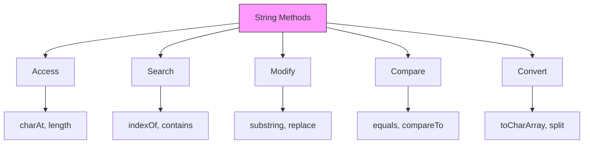
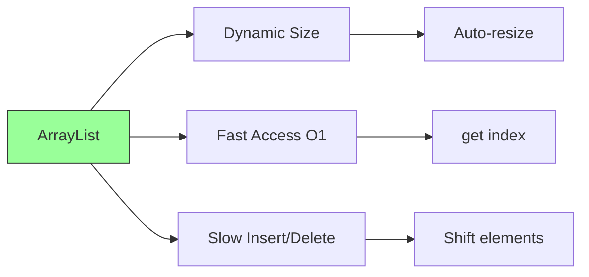
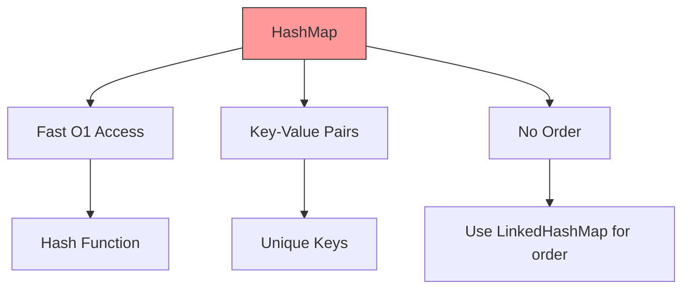

# Java DSA Methods - Complete Reference Guide

## 🎯 Essential Methods for Data Structures & Algorithms

This guide covers all important methods you need for DSA problems and technical interviews.

```
┌─────────────────────────────────────────────────────────┐
│              DSA Essential Methods                       │
├─────────────────────────────────────────────────────────┤
│ • String Methods                                        │
│ • Array Methods                                         │
│ • ArrayList Methods                                     │
│ • HashMap Methods                                       │
│ • HashSet Methods                                       │
│ • TreeMap Methods                                       │
│ • TreeSet Methods                                       │
│ • LinkedList Methods                                    │
│ • PriorityQueue Methods                                 │
│ • Stack & Queue Methods                                 │
│ • Collections Utility Methods                           │
│ • Arrays Utility Methods                                │
└─────────────────────────────────────────────────────────┘
```

---

## 📚 Table of Contents

1. [String Methods](#string)
2. [Array Methods](#array)
3. [ArrayList Methods](#arraylist)
4. [HashMap Methods](#hashmap)
5. [HashSet Methods](#hashset)
6. [TreeMap Methods](#treemap)
7. [TreeSet Methods](#treeset)
8. [LinkedList Methods](#linkedlist)
9. [PriorityQueue Methods](#priorityqueue)
10. [Stack & Deque Methods](#stack)
11. [Collections Utility](#collections-util)
12. [Arrays Utility](#arrays-util)
13. [Interview Questions](#interview)

---

<a name="string"></a>
## 1️⃣ String Methods

### 🎯 Why Strings are Important in DSA

**What:** Immutable sequence of characters.

**Why Important:**
- Common in interview problems
- Text processing, pattern matching
- Substring problems, palindromes
- Anagrams, string manipulation



---

### 📝 Essential String Methods

```java
public class StringMethodsGuide {
    public static void main(String[] args) {
        
        String str = "Hello World";
        
        // ═══════════════════════════════════════════════════════
        // 1. LENGTH & ACCESS
        // ═══════════════════════════════════════════════════════
        
        // length() - Get string length
        // Time: O(1), Space: O(1)
        // When: Always need to check bounds, iterate
        int len = str.length();
        System.out.println("Length: " + len);
        // Output: Length: 11
        
        // charAt(index) - Get character at index
        // Time: O(1), Space: O(1)
        // When: Need specific character, iterate through string
        char firstChar = str.charAt(0);
        char lastChar = str.charAt(str.length() - 1);
        System.out.println("First: " + firstChar + ", Last: " + lastChar);
        // Output: First: H, Last: d
        
        // ⚠️ Common Mistake: Index out of bounds
        try {
            char invalid = str.charAt(100);  // ❌ StringIndexOutOfBoundsException
        } catch (StringIndexOutOfBoundsException e) {
            System.out.println("Error: Index out of bounds");
        }
        
        // ═══════════════════════════════════════════════════════
        // 2. SUBSTRING OPERATIONS
        // ═══════════════════════════════════════════════════════
        
        // substring(start) - From start to end
        // Time: O(n), Space: O(n)
        // When: Extract suffix, process remaining string
        String suffix = str.substring(6);
        System.out.println("Suffix: " + suffix);
        // Output: Suffix: World
        
        // substring(start, end) - From start to end (exclusive)
        // Time: O(n), Space: O(n)
        // When: Extract middle portion, sliding window
        String middle = str.substring(0, 5);
        System.out.println("Middle: " + middle);
        // Output: Middle: Hello
        
        // DSA Use Case: Sliding Window
        String s = "abcdef";
        int windowSize = 3;
        for (int i = 0; i <= s.length() - windowSize; i++) {
            String window = s.substring(i, i + windowSize);
            System.out.println("Window: " + window);
        }
        /* Output:
         * Window: abc
         * Window: bcd
         * Window: cde
         * Window: def
         */
        
        // ═══════════════════════════════════════════════════════
        // 3. SEARCH OPERATIONS
        // ═══════════════════════════════════════════════════════
        
        // indexOf(char) - First occurrence
        // Time: O(n), Space: O(1)
        // When: Find position, check if character exists
        int index = str.indexOf('o');
        System.out.println("First 'o' at: " + index);
        // Output: First 'o' at: 4
        
        // indexOf(char, fromIndex) - Search from index
        // Time: O(n), Space: O(1)
        int secondO = str.indexOf('o', index + 1);
        System.out.println("Second 'o' at: " + secondO);
        // Output: Second 'o' at: 7
        
        // indexOf(String) - First occurrence of substring
        // Time: O(n*m), Space: O(1)
        int worldIndex = str.indexOf("World");
        System.out.println("'World' at: " + worldIndex);
        // Output: 'World' at: 6
        
        // lastIndexOf(char) - Last occurrence
        // Time: O(n), Space: O(1)
        int lastO = str.lastIndexOf('o');
        System.out.println("Last 'o' at: " + lastO);
        // Output: Last 'o' at: 7
        
        // contains(String) - Check if substring exists
        // Time: O(n*m), Space: O(1)
        // When: Quick check for substring presence
        boolean hasWorld = str.contains("World");
        System.out.println("Contains 'World': " + hasWorld);
        // Output: Contains 'World': true
        
        // startsWith(String) - Check prefix
        // Time: O(m), Space: O(1)
        // When: Validate format, check prefix
        boolean startsHello = str.startsWith("Hello");
        System.out.println("Starts with 'Hello': " + startsHello);
        // Output: Starts with 'Hello': true
        
        // endsWith(String) - Check suffix
        // Time: O(m), Space: O(1)
        boolean endsWorld = str.endsWith("World");
        System.out.println("Ends with 'World': " + endsWorld);
        // Output: Ends with 'World': true
        
        // ═══════════════════════════════════════════════════════
        // 4. COMPARISON OPERATIONS
        // ═══════════════════════════════════════════════════════
        
        // equals(String) - Content equality
        // Time: O(n), Space: O(1)
        // When: ALWAYS use for string comparison (not ==)
        String s1 = new String("Hello");
        String s2 = new String("Hello");
        System.out.println("s1 == s2: " + (s1 == s2));  // false (different objects)
        System.out.println("s1.equals(s2): " + s1.equals(s2));  // true (same content)
        // Output: s1 == s2: false
        //         s1.equals(s2): true
        
        // equalsIgnoreCase(String) - Case-insensitive comparison
        // Time: O(n), Space: O(1)
        // When: Case-insensitive matching
        System.out.println("'Hello'.equalsIgnoreCase('hello'): " + 
            "Hello".equalsIgnoreCase("hello"));
        // Output: 'Hello'.equalsIgnoreCase('hello'): true
        
        // compareTo(String) - Lexicographic comparison
        // Time: O(n), Space: O(1)
        // When: Sorting, ordering strings
        // Returns: negative if less, 0 if equal, positive if greater
        System.out.println("'apple'.compareTo('banana'): " + "apple".compareTo("banana"));
        System.out.println("'banana'.compareTo('apple'): " + "banana".compareTo("apple"));
        System.out.println("'apple'.compareTo('apple'): " + "apple".compareTo("apple"));
        // Output: 'apple'.compareTo('banana'): -1 (negative)
        //         'banana'.compareTo('apple'): 1 (positive)
        //         'apple'.compareTo('apple'): 0
        
        // ═══════════════════════════════════════════════════════
        // 5. MODIFICATION OPERATIONS (Return new String!)
        // ═══════════════════════════════════════════════════════
        
        // toLowerCase() / toUpperCase()
        // Time: O(n), Space: O(n)
        // When: Case-insensitive operations, normalization
        String lower = str.toLowerCase();
        String upper = str.toUpperCase();
        System.out.println("Lower: " + lower + ", Upper: " + upper);
        // Output: Lower: hello world, Upper: HELLO WORLD
        
        // trim() - Remove leading/trailing whitespace
        // Time: O(n), Space: O(n)
        // When: Clean user input, parse data
        String padded = "  Hello World  ";
        String trimmed = padded.trim();
        System.out.println("Trimmed: '" + trimmed + "'");
        // Output: Trimmed: 'Hello World'
        
        // replace(char, char) - Replace all occurrences
        // Time: O(n), Space: O(n)
        // When: Character substitution
        String replaced = str.replace('o', '0');
        System.out.println("Replaced: " + replaced);
        // Output: Replaced: Hell0 W0rld
        
        // replace(String, String) - Replace substring
        // Time: O(n*m), Space: O(n)
        String replaced2 = str.replace("World", "Java");
        System.out.println("Replaced: " + replaced2);
        // Output: Replaced: Hello Java
        
        // replaceAll(regex, replacement) - Regex replacement
        // Time: O(n), Space: O(n)
        // When: Pattern-based replacement
        String text = "abc123def456";
        String noDigits = text.replaceAll("\\d+", "");
        System.out.println("No digits: " + noDigits);
        // Output: No digits: abcdef
        
        // ═══════════════════════════════════════════════════════
        // 6. CONVERSION OPERATIONS
        // ═══════════════════════════════════════════════════════
        
        // toCharArray() - Convert to char array
        // Time: O(n), Space: O(n)
        // When: Need to modify characters, sorting
        char[] chars = str.toCharArray();
        System.out.print("Chars: ");
        for (char c : chars) {
            System.out.print(c + " ");
        }
        System.out.println();
        // Output: Chars: H e l l o   W o r l d
        
        // split(regex) - Split into array
        // Time: O(n), Space: O(n)
        // When: Parse CSV, tokenize, word processing
        String sentence = "apple,banana,cherry";
        String[] fruits = sentence.split(",");
        System.out.println("Fruits: " + java.util.Arrays.toString(fruits));
        // Output: Fruits: [apple, banana, cherry]
        
        // split with limit
        String data = "a:b:c:d:e";
        String[] parts = data.split(":", 3);  // Split into max 3 parts
        System.out.println("Parts: " + java.util.Arrays.toString(parts));
        // Output: Parts: [a, b, c:d:e]
        
        // ═══════════════════════════════════════════════════════
        // 7. CHECKING OPERATIONS
        // ═══════════════════════════════════════════════════════
        
        // isEmpty() - Check if length is 0
        // Time: O(1), Space: O(1)
        // When: Validate input
        String empty = "";
        System.out.println("Empty: " + empty.isEmpty());
        // Output: Empty: true
        
        // isBlank() - Check if empty or only whitespace (Java 11+)
        // Time: O(n), Space: O(1)
        String blank = "   ";
        System.out.println("Blank: " + blank.isBlank());
        // Output: Blank: true
        
        // ═══════════════════════════════════════════════════════
        // 8. JOINING OPERATIONS
        // ═══════════════════════════════════════════════════════
        
        // String.join() - Join with delimiter
        // Time: O(n), Space: O(n)
        // When: Build CSV, concatenate with separator
        String joined = String.join(", ", "apple", "banana", "cherry");
        System.out.println("Joined: " + joined);
        // Output: Joined: apple, banana, cherry
        
        // Join from collection
        java.util.List<String> words = java.util.Arrays.asList("Hello", "World", "Java");
        String joinedWords = String.join(" ", words);
        System.out.println("Joined words: " + joinedWords);
        // Output: Joined words: Hello World Java
        
        // ═══════════════════════════════════════════════════════
        // 9. FORMAT OPERATIONS
        // ═══════════════════════════════════════════════════════
        
        // String.format() - Formatted string
        // Time: O(n), Space: O(n)
        // When: Build complex strings, formatting
        String formatted = String.format("Name: %s, Age: %d, Score: %.2f", 
            "Alice", 25, 95.5);
        System.out.println(formatted);
        // Output: Name: Alice, Age: 25, Score: 95.50
        
        // ═══════════════════════════════════════════════════════
        // 10. REPEAT OPERATION (Java 11+)
        // ═══════════════════════════════════════════════════════
        
        // repeat(count) - Repeat string
        // Time: O(n*count), Space: O(n*count)
        String repeated = "ab".repeat(3);
        System.out.println("Repeated: " + repeated);
        // Output: Repeated: ababab
    }
}
```

---

### 🎯 DSA Common String Patterns

```java
import java.util.*;

public class StringDSAPatterns {
    
    // ═══════════════════════════════════════════════════════
    // Pattern 1: Two Pointers
    // ═══════════════════════════════════════════════════════
    
    // Check if palindrome
    public static boolean isPalindrome(String s) {
        int left = 0, right = s.length() - 1;
        
        while (left < right) {
            if (s.charAt(left) != s.charAt(right)) {
                return false;
            }
            left++;
            right--;
        }
        return true;
    }
    
    // ═══════════════════════════════════════════════════════
    // Pattern 2: Sliding Window
    // ═══════════════════════════════════════════════════════
    
    // Longest substring without repeating characters
    public static int lengthOfLongestSubstring(String s) {
        Set<Character> set = new HashSet<>();
        int maxLen = 0, left = 0;
        
        for (int right = 0; right < s.length(); right++) {
            while (set.contains(s.charAt(right))) {
                set.remove(s.charAt(left));
                left++;
            }
            set.add(s.charAt(right));
            maxLen = Math.max(maxLen, right - left + 1);
        }
        return maxLen;
    }
    
    // ═══════════════════════════════════════════════════════
    // Pattern 3: Character Frequency (HashMap)
    // ═══════════════════════════════════════════════════════
    
    // Check if two strings are anagrams
    public static boolean isAnagram(String s1, String s2) {
        if (s1.length() != s2.length()) return false;
        
        Map<Character, Integer> freq = new HashMap<>();
        
        // Count characters in s1
        for (char c : s1.toCharArray()) {
            freq.put(c, freq.getOrDefault(c, 0) + 1);
        }
        
        // Decrease count for s2
        for (char c : s2.toCharArray()) {
            if (!freq.containsKey(c)) return false;
            freq.put(c, freq.get(c) - 1);
            if (freq.get(c) == 0) {
                freq.remove(c);
            }
        }
        
        return freq.isEmpty();
    }
    
    // ═══════════════════════════════════════════════════════
    // Pattern 4: StringBuilder for Modifications
    // ═══════════════════════════════════════════════════════
    
    // Reverse words in a string
    public static String reverseWords(String s) {
        String[] words = s.trim().split("\\s+");
        StringBuilder sb = new StringBuilder();
        
        for (int i = words.length - 1; i >= 0; i--) {
            sb.append(words[i]);
            if (i > 0) sb.append(" ");
        }
        
        return sb.toString();
    }
    
    // ═══════════════════════════════════════════════════════
    // Pattern 5: Character Array Manipulation
    // ═══════════════════════════════════════════════════════
    
    // Reverse string in-place
    public static String reverseString(String s) {
        char[] chars = s.toCharArray();
        int left = 0, right = chars.length - 1;
        
        while (left < right) {
            char temp = chars[left];
            chars[left] = chars[right];
            chars[right] = temp;
            left++;
            right--;
        }
        
        return new String(chars);
    }
    
    public static void main(String[] args) {
        // Test palindrome
        System.out.println("Is 'racecar' palindrome? " + isPalindrome("racecar"));
        // Output: Is 'racecar' palindrome? true
        
        // Test longest substring
        System.out.println("Longest substring in 'abcabcbb': " + 
            lengthOfLongestSubstring("abcabcbb"));
        // Output: Longest substring in 'abcabcbb': 3
        
        // Test anagram
        System.out.println("Are 'listen' and 'silent' anagrams? " + 
            isAnagram("listen", "silent"));
        // Output: Are 'listen' and 'silent' anagrams? true
        
        // Test reverse words
        System.out.println("Reversed: " + reverseWords("Hello World Java"));
        // Output: Reversed: Java World Hello
        
        // Test reverse string
        System.out.println("Reversed: " + reverseString("Hello"));
        // Output: Reversed: olleH
    }
}
```

---

### 🔥 StringBuilder vs String

**Why StringBuilder?**
- String is immutable → concatenation creates new objects
- StringBuilder is mutable → efficient for multiple modifications

```java
public class StringBuilderComparison {
    public static void main(String[] args) {
        
        // ❌ BAD: String concatenation in loop
        long start = System.currentTimeMillis();
        String result = "";
        for (int i = 0; i < 10000; i++) {
            result += i;  // Creates new String object each time!
        }
        long stringTime = System.currentTimeMillis() - start;
        System.out.println("String concatenation: " + stringTime + "ms");
        // Output: String concatenation: 450ms (slow!)
        
        // ✅ GOOD: StringBuilder
        start = System.currentTimeMillis();
        StringBuilder sb = new StringBuilder();
        for (int i = 0; i < 10000; i++) {
            sb.append(i);  // Modifies same object
        }
        String result2 = sb.toString();
        long sbTime = System.currentTimeMillis() - start;
        System.out.println("StringBuilder: " + sbTime + "ms");
        // Output: StringBuilder: 5ms (fast!)
        
        // StringBuilder methods
        StringBuilder builder = new StringBuilder("Hello");
        
        // append() - Add to end
        builder.append(" World");
        System.out.println(builder);  // Output: Hello World
        
        // insert() - Insert at position
        builder.insert(5, " Beautiful");
        System.out.println(builder);  // Output: Hello Beautiful World
        
        // delete() - Delete range
        builder.delete(5, 16);
        System.out.println(builder);  // Output: Hello World
        
        // reverse() - Reverse string
        builder.reverse();
        System.out.println(builder);  // Output: dlroW olleH
        
        // setCharAt() - Modify character
        builder.setCharAt(0, 'D');
        System.out.println(builder);  // Output: DlroW olleH
        
        // toString() - Convert to String
        String finalString = builder.toString();
    }
}
```

**When to use:**
```
Use String when:
├── Immutability needed
├── Few concatenations
└── Thread safety required

Use StringBuilder when:
├── Multiple modifications
├── Loop concatenations
├── Building complex strings
└── Single-threaded (faster)

Use StringBuffer when:
└── Thread-safe StringBuilder needed
```

---


<a name="array"></a>
## 2️⃣ Array Methods

### 🎯 Why Arrays are Important in DSA

**What:** Fixed-size, contiguous memory structure.

**Why Important:**
- Foundation of many data structures
- Fast random access O(1)
- Common in interview problems
- Matrix problems, sorting, searching

```
Array Structure:
┌───┬───┬───┬───┬───┐
│ 10│ 20│ 30│ 40│ 50│
└───┴───┴───┴───┴───┘
  0   1   2   3   4   ← indices
```

---

### 📝 Essential Array Operations

```java
import java.util.Arrays;

public class ArrayMethodsGuide {
    public static void main(String[] args) {
        
        // ═══════════════════════════════════════════════════════
        // 1. ARRAY CREATION & INITIALIZATION
        // ═══════════════════════════════════════════════════════
        
        // Method 1: Declare and initialize
        int[] arr1 = {1, 2, 3, 4, 5};
        
        // Method 2: Declare with size
        int[] arr2 = new int[5];  // All elements = 0
        
        // Method 3: Initialize with values
        int[] arr3 = new int[]{10, 20, 30};
        
        // 2D Array
        int[][] matrix = {
            {1, 2, 3},
            {4, 5, 6},
            {7, 8, 9}
        };
        
        // ═══════════════════════════════════════════════════════
        // 2. BASIC OPERATIONS
        // ═══════════════════════════════════════════════════════
        
        int[] numbers = {5, 2, 8, 1, 9, 3};
        
        // length - Get array length
        // Time: O(1), Space: O(1)
        System.out.println("Length: " + numbers.length);
        // Output: Length: 6
        
        // Access element
        // Time: O(1), Space: O(1)
        int first = numbers[0];
        int last = numbers[numbers.length - 1];
        System.out.println("First: " + first + ", Last: " + last);
        // Output: First: 5, Last: 3
        
        // Modify element
        // Time: O(1), Space: O(1)
        numbers[0] = 100;
        System.out.println("Modified first: " + numbers[0]);
        // Output: Modified first: 100
        
        // ⚠️ Common Mistake: Index out of bounds
        try {
            int invalid = numbers[100];  // ❌ ArrayIndexOutOfBoundsException
        } catch (ArrayIndexOutOfBoundsException e) {
            System.out.println("Error: Index out of bounds");
        }
        
        // ═══════════════════════════════════════════════════════
        // 3. ITERATION PATTERNS
        // ═══════════════════════════════════════════════════════
        
        int[] arr = {1, 2, 3, 4, 5};
        
        // Pattern 1: For loop (when you need index)
        System.out.print("For loop: ");
        for (int i = 0; i < arr.length; i++) {
            System.out.print(arr[i] + " ");
        }
        System.out.println();
        // Output: For loop: 1 2 3 4 5
        
        // Pattern 2: Enhanced for loop (when you don't need index)
        System.out.print("Enhanced for: ");
        for (int num : arr) {
            System.out.print(num + " ");
        }
        System.out.println();
        // Output: Enhanced for: 1 2 3 4 5
        
        // Pattern 3: Reverse iteration
        System.out.print("Reverse: ");
        for (int i = arr.length - 1; i >= 0; i--) {
            System.out.print(arr[i] + " ");
        }
        System.out.println();
        // Output: Reverse: 5 4 3 2 1
        
        // Pattern 4: Two pointers
        int left = 0, right = arr.length - 1;
        while (left < right) {
            System.out.println("Left: " + arr[left] + ", Right: " + arr[right]);
            left++;
            right--;
        }
        /* Output:
         * Left: 1, Right: 5
         * Left: 2, Right: 4
         */
        
        // ═══════════════════════════════════════════════════════
        // 4. COPYING ARRAYS
        // ═══════════════════════════════════════════════════════
        
        int[] original = {1, 2, 3, 4, 5};
        
        // Method 1: Arrays.copyOf() - Copy entire array
        // Time: O(n), Space: O(n)
        int[] copy1 = Arrays.copyOf(original, original.length);
        System.out.println("Copy1: " + Arrays.toString(copy1));
        // Output: Copy1: [1, 2, 3, 4, 5]
        
        // Copy with different size
        int[] copy2 = Arrays.copyOf(original, 3);  // First 3 elements
        System.out.println("Copy2: " + Arrays.toString(copy2));
        // Output: Copy2: [1, 2, 3]
        
        int[] copy3 = Arrays.copyOf(original, 7);  // Pad with 0s
        System.out.println("Copy3: " + Arrays.toString(copy3));
        // Output: Copy3: [1, 2, 3, 4, 5, 0, 0]
        
        // Method 2: Arrays.copyOfRange() - Copy range
        // Time: O(n), Space: O(n)
        int[] range = Arrays.copyOfRange(original, 1, 4);  // [start, end)
        System.out.println("Range: " + Arrays.toString(range));
        // Output: Range: [2, 3, 4]
        
        // Method 3: System.arraycopy() - Most efficient
        // Time: O(n), Space: O(1) (destination already allocated)
        int[] dest = new int[5];
        System.arraycopy(original, 0, dest, 0, original.length);
        System.out.println("Dest: " + Arrays.toString(dest));
        // Output: Dest: [1, 2, 3, 4, 5]
        
        // Method 4: clone() - Shallow copy
        int[] cloned = original.clone();
        System.out.println("Cloned: " + Arrays.toString(cloned));
        // Output: Cloned: [1, 2, 3, 4, 5]
        
        // ⚠️ Common Mistake: Reference copy
        int[] wrong = original;  // ❌ Same reference!
        wrong[0] = 999;
        System.out.println("Original modified: " + original[0]);
        // Output: Original modified: 999
        
        // ═══════════════════════════════════════════════════════
        // 5. FILLING ARRAYS
        // ═══════════════════════════════════════════════════════
        
        // Arrays.fill() - Fill entire array
        // Time: O(n), Space: O(1)
        int[] fillArr = new int[5];
        Arrays.fill(fillArr, 7);
        System.out.println("Filled: " + Arrays.toString(fillArr));
        // Output: Filled: [7, 7, 7, 7, 7]
        
        // Fill range
        Arrays.fill(fillArr, 1, 4, 99);  // [start, end)
        System.out.println("Filled range: " + Arrays.toString(fillArr));
        // Output: Filled range: [7, 99, 99, 99, 7]
        
        // ═══════════════════════════════════════════════════════
        // 6. COMPARING ARRAYS
        // ═══════════════════════════════════════════════════════
        
        int[] a1 = {1, 2, 3};
        int[] a2 = {1, 2, 3};
        int[] a3 = {1, 2, 4};
        
        // Arrays.equals() - Content equality
        // Time: O(n), Space: O(1)
        System.out.println("a1 == a2: " + (a1 == a2));  // false (different objects)
        System.out.println("a1.equals(a2): " + Arrays.equals(a1, a2));  // true (same content)
        System.out.println("a1.equals(a3): " + Arrays.equals(a1, a3));  // false
        // Output: a1 == a2: false
        //         a1.equals(a2): true
        //         a1.equals(a3): false
        
        // Arrays.deepEquals() - For multidimensional arrays
        int[][] m1 = {{1, 2}, {3, 4}};
        int[][] m2 = {{1, 2}, {3, 4}};
        System.out.println("Deep equals: " + Arrays.deepEquals(m1, m2));
        // Output: Deep equals: true
        
        // ═══════════════════════════════════════════════════════
        // 7. CONVERTING TO STRING
        // ═══════════════════════════════════════════════════════
        
        int[] nums = {1, 2, 3, 4, 5};
        
        // Arrays.toString() - 1D array
        System.out.println("Array: " + Arrays.toString(nums));
        // Output: Array: [1, 2, 3, 4, 5]
        
        // Arrays.deepToString() - Multidimensional array
        int[][] matrix2 = {{1, 2}, {3, 4}, {5, 6}};
        System.out.println("Matrix: " + Arrays.deepToString(matrix2));
        // Output: Matrix: [[1, 2], [3, 4], [5, 6]]
        
        // ⚠️ Common Mistake: Printing array directly
        System.out.println("Wrong: " + nums);  // Prints memory address
        // Output: Wrong: [I@15db9742
    }
}
```

---

### 🔍 Array Searching & Sorting

```java
import java.util.Arrays;

public class ArraySearchSort {
    public static void main(String[] args) {
        
        // ═══════════════════════════════════════════════════════
        // 1. SORTING
        // ═══════════════════════════════════════════════════════
        
        int[] arr = {5, 2, 8, 1, 9, 3};
        
        // Arrays.sort() - Sort entire array
        // Time: O(n log n), Space: O(log n)
        // When: Need sorted array, binary search
        Arrays.sort(arr);
        System.out.println("Sorted: " + Arrays.toString(arr));
        // Output: Sorted: [1, 2, 3, 5, 8, 9]
        
        // Sort range
        int[] arr2 = {5, 2, 8, 1, 9, 3};
        Arrays.sort(arr2, 1, 4);  // Sort indices 1-3
        System.out.println("Sorted range: " + Arrays.toString(arr2));
        // Output: Sorted range: [5, 1, 2, 8, 9, 3]
        
        // Sort in descending order (requires Integer[], not int[])
        Integer[] arr3 = {5, 2, 8, 1, 9, 3};
        Arrays.sort(arr3, (a, b) -> b - a);  // Descending
        System.out.println("Descending: " + Arrays.toString(arr3));
        // Output: Descending: [9, 8, 5, 3, 2, 1]
        
        // Sort strings
        String[] words = {"banana", "apple", "cherry"};
        Arrays.sort(words);
        System.out.println("Sorted words: " + Arrays.toString(words));
        // Output: Sorted words: [apple, banana, cherry]
        
        // Custom comparator
        String[] words2 = {"aaa", "bb", "c"};
        Arrays.sort(words2, (a, b) -> a.length() - b.length());  // By length
        System.out.println("By length: " + Arrays.toString(words2));
        // Output: By length: [c, bb, aaa]
        
        // ═══════════════════════════════════════════════════════
        // 2. BINARY SEARCH (Array must be sorted!)
        // ═══════════════════════════════════════════════════════
        
        int[] sorted = {1, 2, 3, 5, 8, 9};
        
        // Arrays.binarySearch() - Find element
        // Time: O(log n), Space: O(1)
        // When: Search in sorted array
        int index = Arrays.binarySearch(sorted, 5);
        System.out.println("Index of 5: " + index);
        // Output: Index of 5: 3
        
        // Element not found - returns (-(insertion point) - 1)
        int notFound = Arrays.binarySearch(sorted, 4);
        System.out.println("Index of 4: " + notFound);
        // Output: Index of 4: -4 (would be inserted at index 3)
        
        // Search in range
        int rangeSearch = Arrays.binarySearch(sorted, 1, 4, 3);
        System.out.println("Range search: " + rangeSearch);
        // Output: Range search: 2
        
        // ⚠️ Common Mistake: Binary search on unsorted array
        int[] unsorted = {5, 2, 8, 1, 9, 3};
        int wrong = Arrays.binarySearch(unsorted, 5);
        System.out.println("Wrong result: " + wrong);  // Unpredictable!
        // Output: Wrong result: 0 (incorrect!)
    }
}
```

---

### 🎯 Common Array DSA Patterns

```java
import java.util.*;

public class ArrayDSAPatterns {
    
    // ═══════════════════════════════════════════════════════
    // Pattern 1: Two Pointers
    // ═══════════════════════════════════════════════════════
    
    // Reverse array in-place
    public static void reverseArray(int[] arr) {
        int left = 0, right = arr.length - 1;
        
        while (left < right) {
            // Swap
            int temp = arr[left];
            arr[left] = arr[right];
            arr[right] = temp;
            left++;
            right--;
        }
    }
    
    // Two sum (sorted array)
    public static int[] twoSum(int[] arr, int target) {
        int left = 0, right = arr.length - 1;
        
        while (left < right) {
            int sum = arr[left] + arr[right];
            if (sum == target) {
                return new int[]{left, right};
            } else if (sum < target) {
                left++;
            } else {
                right--;
            }
        }
        return new int[]{-1, -1};
    }
    
    // ═══════════════════════════════════════════════════════
    // Pattern 2: Sliding Window
    // ═══════════════════════════════════════════════════════
    
    // Maximum sum of subarray of size k
    public static int maxSumSubarray(int[] arr, int k) {
        int maxSum = 0, windowSum = 0;
        
        // First window
        for (int i = 0; i < k; i++) {
            windowSum += arr[i];
        }
        maxSum = windowSum;
        
        // Slide window
        for (int i = k; i < arr.length; i++) {
            windowSum = windowSum - arr[i - k] + arr[i];
            maxSum = Math.max(maxSum, windowSum);
        }
        
        return maxSum;
    }
    
    // ═══════════════════════════════════════════════════════
    // Pattern 3: Prefix Sum
    // ═══════════════════════════════════════════════════════
    
    // Range sum queries
    public static class RangeSumQuery {
        private int[] prefixSum;
        
        public RangeSumQuery(int[] arr) {
            prefixSum = new int[arr.length + 1];
            for (int i = 0; i < arr.length; i++) {
                prefixSum[i + 1] = prefixSum[i] + arr[i];
            }
        }
        
        public int sumRange(int left, int right) {
            return prefixSum[right + 1] - prefixSum[left];
        }
    }
    
    // ═══════════════════════════════════════════════════════
    // Pattern 4: Kadane's Algorithm (Max Subarray Sum)
    // ═══════════════════════════════════════════════════════
    
    public static int maxSubarraySum(int[] arr) {
        int maxSoFar = arr[0];
        int maxEndingHere = arr[0];
        
        for (int i = 1; i < arr.length; i++) {
            maxEndingHere = Math.max(arr[i], maxEndingHere + arr[i]);
            maxSoFar = Math.max(maxSoFar, maxEndingHere);
        }
        
        return maxSoFar;
    }
    
    // ═══════════════════════════════════════════════════════
    // Pattern 5: Dutch National Flag (3-way partitioning)
    // ═══════════════════════════════════════════════════════
    
    // Sort array of 0s, 1s, and 2s
    public static void sortColors(int[] arr) {
        int low = 0, mid = 0, high = arr.length - 1;
        
        while (mid <= high) {
            if (arr[mid] == 0) {
                swap(arr, low, mid);
                low++;
                mid++;
            } else if (arr[mid] == 1) {
                mid++;
            } else {
                swap(arr, mid, high);
                high--;
            }
        }
    }
    
    private static void swap(int[] arr, int i, int j) {
        int temp = arr[i];
        arr[i] = arr[j];
        arr[j] = temp;
    }
    
    // ═══════════════════════════════════════════════════════
    // Pattern 6: Binary Search Variations
    // ═══════════════════════════════════════════════════════
    
    // Find first occurrence
    public static int findFirst(int[] arr, int target) {
        int left = 0, right = arr.length - 1;
        int result = -1;
        
        while (left <= right) {
            int mid = left + (right - left) / 2;
            
            if (arr[mid] == target) {
                result = mid;
                right = mid - 1;  // Continue searching left
            } else if (arr[mid] < target) {
                left = mid + 1;
            } else {
                right = mid - 1;
            }
        }
        
        return result;
    }
    
    // Find last occurrence
    public static int findLast(int[] arr, int target) {
        int left = 0, right = arr.length - 1;
        int result = -1;
        
        while (left <= right) {
            int mid = left + (right - left) / 2;
            
            if (arr[mid] == target) {
                result = mid;
                left = mid + 1;  // Continue searching right
            } else if (arr[mid] < target) {
                left = mid + 1;
            } else {
                right = mid - 1;
            }
        }
        
        return result;
    }
    
    public static void main(String[] args) {
        // Test reverse
        int[] arr1 = {1, 2, 3, 4, 5};
        reverseArray(arr1);
        System.out.println("Reversed: " + Arrays.toString(arr1));
        // Output: Reversed: [5, 4, 3, 2, 1]
        
        // Test two sum
        int[] arr2 = {1, 2, 3, 4, 5};
        int[] result = twoSum(arr2, 7);
        System.out.println("Two sum indices: " + Arrays.toString(result));
        // Output: Two sum indices: [1, 4]
        
        // Test max sum subarray
        int[] arr3 = {1, 4, 2, 10, 23, 3, 1, 0, 20};
        System.out.println("Max sum (k=4): " + maxSumSubarray(arr3, 4));
        // Output: Max sum (k=4): 39
        
        // Test range sum query
        int[] arr4 = {1, 2, 3, 4, 5};
        RangeSumQuery rsq = new RangeSumQuery(arr4);
        System.out.println("Sum [1, 3]: " + rsq.sumRange(1, 3));
        // Output: Sum [1, 3]: 9
        
        // Test max subarray sum
        int[] arr5 = {-2, 1, -3, 4, -1, 2, 1, -5, 4};
        System.out.println("Max subarray sum: " + maxSubarraySum(arr5));
        // Output: Max subarray sum: 6
        
        // Test sort colors
        int[] arr6 = {2, 0, 2, 1, 1, 0};
        sortColors(arr6);
        System.out.println("Sorted colors: " + Arrays.toString(arr6));
        // Output: Sorted colors: [0, 0, 1, 1, 2, 2]
        
        // Test binary search variations
        int[] arr7 = {1, 2, 2, 2, 3, 4, 5};
        System.out.println("First 2: " + findFirst(arr7, 2));
        System.out.println("Last 2: " + findLast(arr7, 2));
        // Output: First 2: 1
        //         Last 2: 3
    }
}
```

---

### 📊 Array Time Complexity Summary

| Operation | Time Complexity | Space Complexity |
|-----------|----------------|------------------|
| Access by index | O(1) | O(1) |
| Search (unsorted) | O(n) | O(1) |
| Search (sorted) | O(log n) | O(1) |
| Insert at end | O(1) | O(1) |
| Insert at beginning | O(n) | O(1) |
| Delete | O(n) | O(1) |
| Sort | O(n log n) | O(log n) |
| Copy | O(n) | O(n) |

---


<a name="arraylist"></a>
## 3️⃣ ArrayList Methods

### 🎯 Why ArrayList is Important in DSA

**What:** Dynamic resizable array.

**Why Important:**
- Most commonly used collection
- Dynamic sizing
- Fast random access
- Common in interview problems



---

### 📝 Essential ArrayList Methods


```java
import java.util.*;

public class ArrayListMethodsGuide {
    public static void main(String[] args) {
        
        // ═══════════════════════════════════════════════════════
        // 1. CREATION & INITIALIZATION
        // ═══════════════════════════════════════════════════════
        
        // Method 1: Empty ArrayList
        ArrayList<Integer> list1 = new ArrayList<>();
        
        // Method 2: With initial capacity
        ArrayList<Integer> list2 = new ArrayList<>(100);  // Capacity 100
        
        // Method 3: From another collection
        ArrayList<Integer> list3 = new ArrayList<>(Arrays.asList(1, 2, 3, 4, 5));
        
        // Method 4: Using List.of() (Java 9+) - Immutable
        List<Integer> immutable = List.of(1, 2, 3, 4, 5);
        ArrayList<Integer> list4 = new ArrayList<>(immutable);
        
        // ═══════════════════════════════════════════════════════
        // 2. ADDING ELEMENTS
        // ═══════════════════════════════════════════════════════
        
        ArrayList<String> fruits = new ArrayList<>();
        
        // add(element) - Add to end
        // Time: O(1) amortized, Space: O(1)
        // When: Building list, appending elements
        fruits.add("Apple");
        fruits.add("Banana");
        fruits.add("Cherry");
        System.out.println("After add: " + fruits);
        // Output: After add: [Apple, Banana, Cherry]
        
        // add(index, element) - Insert at specific position
        // Time: O(n), Space: O(1)
        // When: Need to insert at specific position
        fruits.add(1, "Mango");  // Insert at index 1
        System.out.println("After insert: " + fruits);
        // Output: After insert: [Apple, Mango, Banana, Cherry]
        
        // addAll(collection) - Add all elements from collection
        // Time: O(m), Space: O(1) where m = size of collection
        // When: Merging lists, bulk operations
        ArrayList<String> moreFruits = new ArrayList<>(Arrays.asList("Orange", "Grape"));
        fruits.addAll(moreFruits);
        System.out.println("After addAll: " + fruits);
        // Output: After addAll: [Apple, Mango, Banana, Cherry, Orange, Grape]
        
        // addAll(index, collection) - Insert collection at position
        fruits.addAll(2, Arrays.asList("Kiwi", "Peach"));
        System.out.println("After addAll at index: " + fruits);
        // Output: After addAll at index: [Apple, Mango, Kiwi, Peach, Banana, Cherry, Orange, Grape]
        
        // ═══════════════════════════════════════════════════════
        // 3. ACCESSING ELEMENTS
        // ═══════════════════════════════════════════════════════
        
        ArrayList<Integer> numbers = new ArrayList<>(Arrays.asList(10, 20, 30, 40, 50));
        
        // get(index) - Get element at index
        // Time: O(1), Space: O(1)
        // When: Random access, retrieve specific element
        int first = numbers.get(0);
        int last = numbers.get(numbers.size() - 1);
        System.out.println("First: " + first + ", Last: " + last);
        // Output: First: 10, Last: 50
        
        // size() - Get number of elements
        // Time: O(1), Space: O(1)
        // When: Always! Check bounds, iterate
        int size = numbers.size();
        System.out.println("Size: " + size);
        // Output: Size: 5
        
        // isEmpty() - Check if empty
        // Time: O(1), Space: O(1)
        // When: Validate before operations
        boolean empty = numbers.isEmpty();
        System.out.println("Is empty? " + empty);
        // Output: Is empty? false
        
        // ⚠️ Common Mistake: Using length instead of size()
        // int wrong = numbers.length;  // ❌ Compilation error!
        // int correct = numbers.size();  // ✅ Correct
        
        // ═══════════════════════════════════════════════════════
        // 4. MODIFYING ELEMENTS
        // ═══════════════════════════════════════════════════════
        
        // set(index, element) - Replace element at index
        // Time: O(1), Space: O(1)
        // When: Update specific element
        numbers.set(2, 300);  // Replace 30 with 300
        System.out.println("After set: " + numbers);
        // Output: After set: [10, 20, 300, 40, 50]
        
        // ═══════════════════════════════════════════════════════
        // 5. REMOVING ELEMENTS
        // ═══════════════════════════════════════════════════════
        
        ArrayList<String> items = new ArrayList<>(Arrays.asList("A", "B", "C", "D", "E"));
        
        // remove(index) - Remove by index
        // Time: O(n), Space: O(1)
        // When: Remove at specific position
        String removed = items.remove(2);  // Remove "C"
        System.out.println("Removed: " + removed);
        System.out.println("After remove by index: " + items);
        // Output: Removed: C
        //         After remove by index: [A, B, D, E]
        
        // remove(Object) - Remove first occurrence
        // Time: O(n), Space: O(1)
        // When: Remove specific value
        boolean wasRemoved = items.remove("B");
        System.out.println("Was removed? " + wasRemoved);
        System.out.println("After remove by value: " + items);
        // Output: Was removed? true
        //         After remove by value: [A, D, E]
        
        // removeAll(collection) - Remove all matching elements
        // Time: O(n*m), Space: O(1)
        ArrayList<String> toRemove = new ArrayList<>(Arrays.asList("A", "E"));
        items.removeAll(toRemove);
        System.out.println("After removeAll: " + items);
        // Output: After removeAll: [D]
        
        // removeIf(predicate) - Remove matching condition (Java 8+)
        // Time: O(n), Space: O(1)
        // When: Conditional removal
        ArrayList<Integer> nums = new ArrayList<>(Arrays.asList(1, 2, 3, 4, 5, 6));
        nums.removeIf(n -> n % 2 == 0);  // Remove even numbers
        System.out.println("After removeIf: " + nums);
        // Output: After removeIf: [1, 3, 5]
        
        // clear() - Remove all elements
        // Time: O(n), Space: O(1)
        // When: Reset list
        nums.clear();
        System.out.println("After clear: " + nums);
        // Output: After clear: []
        
        // ═══════════════════════════════════════════════════════
        // 6. SEARCHING ELEMENTS
        // ═══════════════════════════════════════════════════════
        
        ArrayList<String> colors = new ArrayList<>(Arrays.asList("Red", "Green", "Blue", "Red"));
        
        // contains(Object) - Check if element exists
        // Time: O(n), Space: O(1)
        // When: Quick existence check
        boolean hasBlue = colors.contains("Blue");
        System.out.println("Has Blue? " + hasBlue);
        // Output: Has Blue? true
        
        // indexOf(Object) - First occurrence index
        // Time: O(n), Space: O(1)
        // When: Find position of element
        int blueIndex = colors.indexOf("Blue");
        System.out.println("Blue at: " + blueIndex);
        // Output: Blue at: 2
        
        // lastIndexOf(Object) - Last occurrence index
        // Time: O(n), Space: O(1)
        int lastRed = colors.lastIndexOf("Red");
        System.out.println("Last Red at: " + lastRed);
        // Output: Last Red at: 3
        
        // Element not found returns -1
        int notFound = colors.indexOf("Yellow");
        System.out.println("Yellow at: " + notFound);
        // Output: Yellow at: -1
        
        // ═══════════════════════════════════════════════════════
        // 7. ITERATION PATTERNS
        // ═══════════════════════════════════════════════════════
        
        ArrayList<Integer> values = new ArrayList<>(Arrays.asList(1, 2, 3, 4, 5));
        
        // Pattern 1: For loop with index
        System.out.print("For loop: ");
        for (int i = 0; i < values.size(); i++) {
            System.out.print(values.get(i) + " ");
        }
        System.out.println();
        // Output: For loop: 1 2 3 4 5
        
        // Pattern 2: Enhanced for loop
        System.out.print("Enhanced for: ");
        for (Integer val : values) {
            System.out.print(val + " ");
        }
        System.out.println();
        // Output: Enhanced for: 1 2 3 4 5
        
        // Pattern 3: Iterator
        System.out.print("Iterator: ");
        Iterator<Integer> iterator = values.iterator();
        while (iterator.hasNext()) {
            System.out.print(iterator.next() + " ");
        }
        System.out.println();
        // Output: Iterator: 1 2 3 4 5
        
        // Pattern 4: forEach with lambda (Java 8+)
        System.out.print("forEach: ");
        values.forEach(val -> System.out.print(val + " "));
        System.out.println();
        // Output: forEach: 1 2 3 4 5
        
        // Pattern 5: ListIterator (bidirectional)
        System.out.print("ListIterator reverse: ");
        ListIterator<Integer> listIter = values.listIterator(values.size());
        while (listIter.hasPrevious()) {
            System.out.print(listIter.previous() + " ");
        }
        System.out.println();
        // Output: ListIterator reverse: 5 4 3 2 1
        
        // ⚠️ Common Mistake: Modifying list while iterating
        ArrayList<Integer> test = new ArrayList<>(Arrays.asList(1, 2, 3, 4, 5));
        try {
            for (Integer val : test) {
                if (val == 3) {
                    test.remove(val);  // ❌ ConcurrentModificationException
                }
            }
        } catch (ConcurrentModificationException e) {
            System.out.println("Error: Cannot modify while iterating");
        }
        
        // ✅ Correct: Use Iterator.remove()
        Iterator<Integer> iter = test.iterator();
        while (iter.hasNext()) {
            Integer val = iter.next();
            if (val == 3) {
                iter.remove();  // ✅ Safe removal
            }
        }
        System.out.println("After safe removal: " + test);
        // Output: After safe removal: [1, 2, 4, 5]
        
        // ═══════════════════════════════════════════════════════
        // 8. SORTING & REVERSING
        // ═══════════════════════════════════════════════════════
        
        ArrayList<Integer> unsorted = new ArrayList<>(Arrays.asList(5, 2, 8, 1, 9));
        
        // Collections.sort() - Sort ascending
        // Time: O(n log n), Space: O(1)
        // When: Need sorted list
        Collections.sort(unsorted);
        System.out.println("Sorted: " + unsorted);
        // Output: Sorted: [1, 2, 5, 8, 9]
        
        // Sort descending
        Collections.sort(unsorted, Collections.reverseOrder());
        System.out.println("Sorted descending: " + unsorted);
        // Output: Sorted descending: [9, 8, 5, 2, 1]
        
        // Custom comparator
        ArrayList<String> words = new ArrayList<>(Arrays.asList("apple", "pie", "banana"));
        Collections.sort(words, (a, b) -> a.length() - b.length());
        System.out.println("Sorted by length: " + words);
        // Output: Sorted by length: [pie, apple, banana]
        
        // Collections.reverse() - Reverse order
        // Time: O(n), Space: O(1)
        ArrayList<Integer> toReverse = new ArrayList<>(Arrays.asList(1, 2, 3, 4, 5));
        Collections.reverse(toReverse);
        System.out.println("Reversed: " + toReverse);
        // Output: Reversed: [5, 4, 3, 2, 1]
        
        // ═══════════════════════════════════════════════════════
        // 9. SUBLIST OPERATIONS
        // ═══════════════════════════════════════════════════════
        
        ArrayList<Integer> original = new ArrayList<>(Arrays.asList(0, 1, 2, 3, 4, 5, 6, 7, 8, 9));
        
        // subList(fromIndex, toIndex) - Get view of portion
        // Time: O(1), Space: O(1) - returns view, not copy!
        // When: Work with portion of list
        List<Integer> sublist = original.subList(2, 5);  // [2, 5)
        System.out.println("Sublist: " + sublist);
        // Output: Sublist: [2, 3, 4]
        
        // ⚠️ Warning: Modifying sublist affects original!
        sublist.set(0, 999);
        System.out.println("Original after sublist modification: " + original);
        // Output: Original after sublist modification: [0, 1, 999, 3, 4, 5, 6, 7, 8, 9]
        
        // To get independent copy:
        ArrayList<Integer> copy = new ArrayList<>(original.subList(2, 5));
        copy.set(0, 777);
        System.out.println("Original unchanged: " + original);
        // Output: Original unchanged: [0, 1, 999, 3, 4, 5, 6, 7, 8, 9]
        
        // ═══════════════════════════════════════════════════════
        // 10. CONVERSION OPERATIONS
        // ═══════════════════════════════════════════════════════
        
        ArrayList<String> list = new ArrayList<>(Arrays.asList("A", "B", "C"));
        
        // toArray() - Convert to Object array
        Object[] objArray = list.toArray();
        System.out.println("Object array: " + Arrays.toString(objArray));
        // Output: Object array: [A, B, C]
        
        // toArray(T[] array) - Convert to typed array
        String[] strArray = list.toArray(new String[0]);
        System.out.println("String array: " + Arrays.toString(strArray));
        // Output: String array: [A, B, C]
        
        // Stream operations (Java 8+)
        ArrayList<Integer> streamList = new ArrayList<>(Arrays.asList(1, 2, 3, 4, 5));
        
        // Convert to stream
        int sum = streamList.stream()
            .filter(n -> n % 2 == 0)
            .mapToInt(Integer::intValue)
            .sum();
        System.out.println("Sum of even numbers: " + sum);
        // Output: Sum of even numbers: 6
        
        // ═══════════════════════════════════════════════════════
        // 11. BULK OPERATIONS
        // ═══════════════════════════════════════════════════════
        
        ArrayList<Integer> list1Bulk = new ArrayList<>(Arrays.asList(1, 2, 3, 4, 5));
        ArrayList<Integer> list2Bulk = new ArrayList<>(Arrays.asList(3, 4, 5, 6, 7));
        
        // retainAll() - Keep only common elements
        // Time: O(n*m), Space: O(1)
        ArrayList<Integer> intersection = new ArrayList<>(list1Bulk);
        intersection.retainAll(list2Bulk);
        System.out.println("Intersection: " + intersection);
        // Output: Intersection: [3, 4, 5]
        
        // containsAll() - Check if contains all elements
        // Time: O(n*m), Space: O(1)
        boolean hasAll = list1Bulk.containsAll(Arrays.asList(1, 2, 3));
        System.out.println("Contains all? " + hasAll);
        // Output: Contains all? true
        
        // ═══════════════════════════════════════════════════════
        // 12. CAPACITY OPERATIONS
        // ═══════════════════════════════════════════════════════
        
        ArrayList<Integer> capacityList = new ArrayList<>(5);
        
        // ensureCapacity() - Ensure minimum capacity
        // Time: O(n) if resize needed, Space: O(n)
        // When: Know size in advance, avoid multiple resizes
        capacityList.ensureCapacity(100);
        
        // trimToSize() - Reduce capacity to current size
        // Time: O(n), Space: O(1)
        // When: Save memory after removing many elements
        capacityList.add(1);
        capacityList.add(2);
        capacityList.trimToSize();
    }
}
```

---

### 🎯 ArrayList DSA Patterns

```java
import java.util.*;

public class ArrayListDSAPatterns {
    
    // ═══════════════════════════════════════════════════════
    // Pattern 1: Two Pointers
    // ═══════════════════════════════════════════════════════
    
    // Remove duplicates from sorted list
    public static int removeDuplicates(ArrayList<Integer> list) {
        if (list.size() <= 1) return list.size();
        
        int writeIndex = 1;
        for (int readIndex = 1; readIndex < list.size(); readIndex++) {
            if (!list.get(readIndex).equals(list.get(readIndex - 1))) {
                list.set(writeIndex, list.get(readIndex));
                writeIndex++;
            }
        }
        
        // Remove extra elements
        while (list.size() > writeIndex) {
            list.remove(list.size() - 1);
        }
        
        return writeIndex;
    }
    
    // ═══════════════════════════════════════════════════════
    // Pattern 2: Sliding Window
    // ═══════════════════════════════════════════════════════
    
    // Maximum sum of k consecutive elements
    public static int maxSumKElements(ArrayList<Integer> list, int k) {
        if (list.size() < k) return -1;
        
        int windowSum = 0;
        for (int i = 0; i < k; i++) {
            windowSum += list.get(i);
        }
        
        int maxSum = windowSum;
        for (int i = k; i < list.size(); i++) {
            windowSum = windowSum - list.get(i - k) + list.get(i);
            maxSum = Math.max(maxSum, windowSum);
        }
        
        return maxSum;
    }
    
    // ═══════════════════════════════════════════════════════
    // Pattern 3: Binary Search
    // ═══════════════════════════════════════════════════════
    
    // Binary search in sorted ArrayList
    public static int binarySearch(ArrayList<Integer> list, int target) {
        int left = 0, right = list.size() - 1;
        
        while (left <= right) {
            int mid = left + (right - left) / 2;
            int midVal = list.get(mid);
            
            if (midVal == target) {
                return mid;
            } else if (midVal < target) {
                left = mid + 1;
            } else {
                right = mid - 1;
            }
        }
        
        return -1;
    }
    
    // ═══════════════════════════════════════════════════════
    // Pattern 4: Frequency Count
    // ═══════════════════════════════════════════════════════
    
    // Find element with highest frequency
    public static Integer mostFrequent(ArrayList<Integer> list) {
        Map<Integer, Integer> freq = new HashMap<>();
        
        for (Integer num : list) {
            freq.put(num, freq.getOrDefault(num, 0) + 1);
        }
        
        int maxFreq = 0;
        Integer result = null;
        
        for (Map.Entry<Integer, Integer> entry : freq.entrySet()) {
            if (entry.getValue() > maxFreq) {
                maxFreq = entry.getValue();
                result = entry.getKey();
            }
        }
        
        return result;
    }
    
    // ═══════════════════════════════════════════════════════
    // Pattern 5: Merge Sorted Lists
    // ═══════════════════════════════════════════════════════
    
    public static ArrayList<Integer> mergeSorted(ArrayList<Integer> list1, ArrayList<Integer> list2) {
        ArrayList<Integer> result = new ArrayList<>();
        int i = 0, j = 0;
        
        while (i < list1.size() && j < list2.size()) {
            if (list1.get(i) <= list2.get(j)) {
                result.add(list1.get(i));
                i++;
            } else {
                result.add(list2.get(j));
                j++;
            }
        }
        
        while (i < list1.size()) {
            result.add(list1.get(i));
            i++;
        }
        
        while (j < list2.size()) {
            result.add(list2.get(j));
            j++;
        }
        
        return result;
    }
    
    public static void main(String[] args) {
        // Test remove duplicates
        ArrayList<Integer> list1 = new ArrayList<>(Arrays.asList(1, 1, 2, 2, 3, 4, 4, 5));
        int newSize = removeDuplicates(list1);
        System.out.println("After removing duplicates: " + list1);
        // Output: After removing duplicates: [1, 2, 3, 4, 5]
        
        // Test max sum k elements
        ArrayList<Integer> list2 = new ArrayList<>(Arrays.asList(1, 4, 2, 10, 23, 3, 1, 0, 20));
        System.out.println("Max sum (k=4): " + maxSumKElements(list2, 4));
        // Output: Max sum (k=4): 39
        
        // Test binary search
        ArrayList<Integer> list3 = new ArrayList<>(Arrays.asList(1, 3, 5, 7, 9, 11));
        System.out.println("Index of 7: " + binarySearch(list3, 7));
        // Output: Index of 7: 3
        
        // Test most frequent
        ArrayList<Integer> list4 = new ArrayList<>(Arrays.asList(1, 2, 2, 3, 3, 3, 4));
        System.out.println("Most frequent: " + mostFrequent(list4));
        // Output: Most frequent: 3
        
        // Test merge sorted
        ArrayList<Integer> list5 = new ArrayList<>(Arrays.asList(1, 3, 5));
        ArrayList<Integer> list6 = new ArrayList<>(Arrays.asList(2, 4, 6));
        System.out.println("Merged: " + mergeSorted(list5, list6));
        // Output: Merged: [1, 2, 3, 4, 5, 6]
    }
}
```

---

### 📊 ArrayList Time Complexity

| Operation | Time Complexity | Notes |
|-----------|----------------|-------|
| `add(element)` | O(1) amortized | O(n) when resize needed |
| `add(index, element)` | O(n) | Shifts elements |
| `get(index)` | O(1) | Direct access |
| `set(index, element)` | O(1) | Direct access |
| `remove(index)` | O(n) | Shifts elements |
| `remove(Object)` | O(n) | Search + shift |
| `contains(Object)` | O(n) | Linear search |
| `indexOf(Object)` | O(n) | Linear search |
| `size()` | O(1) | Stored value |
| `clear()` | O(n) | Nulls all elements |
| `toArray()` | O(n) | Copies elements |

---

### 🎯 ArrayList Best Practices

```java
// ✅ DO:

// 1. Specify initial capacity if size known
ArrayList<Integer> list = new ArrayList<>(1000);  // Avoid resizing

// 2. Use generics
ArrayList<String> strings = new ArrayList<>();  // Type-safe

// 3. Use enhanced for loop when index not needed
for (String s : strings) {
    System.out.println(s);
}

// 4. Use Iterator.remove() for safe removal
Iterator<String> iter = strings.iterator();
while (iter.hasNext()) {
    String s = iter.next();
    if (condition) {
        iter.remove();  // Safe
    }
}

// 5. Use removeIf for conditional removal
list.removeIf(n -> n < 0);

// ❌ DON'T:

// 1. Don't use raw types
ArrayList list = new ArrayList();  // ❌ No type safety

// 2. Don't modify while iterating
for (String s : strings) {
    strings.remove(s);  // ❌ ConcurrentModificationException
}

// 3. Don't use get() in loop for LinkedList
for (int i = 0; i < linkedList.size(); i++) {
    linkedList.get(i);  // ❌ O(n²) total!
}

// 4. Don't ignore capacity for large lists
ArrayList<Integer> huge = new ArrayList<>();  // ❌ Multiple resizes
for (int i = 0; i < 1000000; i++) {
    huge.add(i);
}

// ✅ Better:
ArrayList<Integer> huge = new ArrayList<>(1000000);
```

---


<a name="hashmap"></a>
## 4️⃣ HashMap Methods

### 🎯 Why HashMap is Important in DSA

**What:** Hash table implementation of Map interface.

**Why Important:**
- O(1) average time for get/put
- Most common for frequency counting
- Two-sum, anagram problems
- Caching, memoization



---

### 📝 Essential HashMap Methods

```java
import java.util.*;

public class HashMapMethodsGuide {
    public static void main(String[] args) {
        
        // ═══════════════════════════════════════════════════════
        // 1. CREATION & INITIALIZATION
        // ═══════════════════════════════════════════════════════
        
        // Method 1: Empty HashMap
        HashMap<String, Integer> map1 = new HashMap<>();
        
        // Method 2: With initial capacity
        HashMap<String, Integer> map2 = new HashMap<>(100);
        
        // Method 3: With capacity and load factor
        HashMap<String, Integer> map3 = new HashMap<>(100, 0.75f);
        
        // Method 4: From another map
        HashMap<String, Integer> map4 = new HashMap<>(map1);
        
        // Method 5: Using Map.of() (Java 9+) - Immutable
        Map<String, Integer> immutable = Map.of("A", 1, "B", 2, "C", 3);
        
        // ═══════════════════════════════════════════════════════
        // 2. ADDING & UPDATING
        // ═══════════════════════════════════════════════════════
        
        HashMap<String, Integer> scores = new HashMap<>();
        
        // put(key, value) - Add or update
        // Time: O(1) average, Space: O(1)
        // When: Add new entry or update existing
        scores.put("Alice", 95);
        scores.put("Bob", 87);
        scores.put("Charlie", 92);
        System.out.println("Scores: " + scores);
        // Output: Scores: {Alice=95, Bob=87, Charlie=92}
        
        // Update existing key
        scores.put("Alice", 98);  // Overwrites 95
        System.out.println("Updated: " + scores);
        // Output: Updated: {Alice=98, Bob=87, Charlie=92}
        
        // putIfAbsent(key, value) - Add only if key doesn't exist
        // Time: O(1) average, Space: O(1)
        // When: Don't want to overwrite existing values
        scores.putIfAbsent("Alice", 100);  // Won't update (Alice exists)
        scores.putIfAbsent("Diana", 88);   // Will add (Diana doesn't exist)
        System.out.println("After putIfAbsent: " + scores);
        // Output: After putIfAbsent: {Alice=98, Bob=87, Charlie=92, Diana=88}
        
        // putAll(map) - Add all entries from another map
        // Time: O(m), Space: O(1) where m = size of other map
        HashMap<String, Integer> moreScores = new HashMap<>();
        moreScores.put("Eve", 91);
        moreScores.put("Frank", 85);
        scores.putAll(moreScores);
        System.out.println("After putAll: " + scores);
        // Output: After putAll: {Alice=98, Bob=87, Charlie=92, Diana=88, Eve=91, Frank=85}
        
        // ═══════════════════════════════════════════════════════
        // 3. RETRIEVING VALUES
        // ═══════════════════════════════════════════════════════
        
        // get(key) - Get value for key
        // Time: O(1) average, Space: O(1)
        // When: Retrieve value by key
        Integer aliceScore = scores.get("Alice");
        System.out.println("Alice's score: " + aliceScore);
        // Output: Alice's score: 98
        
        // Returns null if key doesn't exist
        Integer missing = scores.get("Zoe");
        System.out.println("Zoe's score: " + missing);
        // Output: Zoe's score: null
        
        // getOrDefault(key, defaultValue) - Get with default
        // Time: O(1) average, Space: O(1)
        // When: Want default value instead of null
        Integer zoeScore = scores.getOrDefault("Zoe", 0);
        System.out.println("Zoe's score (default): " + zoeScore);
        // Output: Zoe's score (default): 0
        
        // ⚠️ Common Mistake: NullPointerException
        try {
            int score = scores.get("Zoe");  // ❌ NPE if unboxing null
        } catch (NullPointerException e) {
            System.out.println("Error: Cannot unbox null");
        }
        
        // ✅ Correct: Use getOrDefault or check for null
        int safeScore = scores.getOrDefault("Zoe", 0);
        
        // ═══════════════════════════════════════════════════════
        // 4. CHECKING EXISTENCE
        // ═══════════════════════════════════════════════════════
        
        // containsKey(key) - Check if key exists
        // Time: O(1) average, Space: O(1)
        // When: Validate before operations
        boolean hasAlice = scores.containsKey("Alice");
        System.out.println("Has Alice? " + hasAlice);
        // Output: Has Alice? true
        
        // containsValue(value) - Check if value exists
        // Time: O(n), Space: O(1)
        // When: Search by value (rare, slow)
        boolean has95 = scores.containsValue(95);
        System.out.println("Has score 95? " + has95);
        // Output: Has score 95? false
        
        // isEmpty() - Check if empty
        // Time: O(1), Space: O(1)
        boolean empty = scores.isEmpty();
        System.out.println("Is empty? " + empty);
        // Output: Is empty? false
        
        // size() - Get number of entries
        // Time: O(1), Space: O(1)
        int size = scores.size();
        System.out.println("Size: " + size);
        // Output: Size: 6
        
        // ═══════════════════════════════════════════════════════
        // 5. REMOVING ENTRIES
        // ═══════════════════════════════════════════════════════
        
        HashMap<String, Integer> test = new HashMap<>(scores);
        
        // remove(key) - Remove entry by key
        // Time: O(1) average, Space: O(1)
        // When: Delete specific entry
        Integer removed = test.remove("Bob");
        System.out.println("Removed Bob's score: " + removed);
        System.out.println("After remove: " + test);
        // Output: Removed Bob's score: 87
        //         After remove: {Alice=98, Charlie=92, Diana=88, Eve=91, Frank=85}
        
        // remove(key, value) - Remove only if key maps to value
        // Time: O(1) average, Space: O(1)
        // When: Conditional removal
        boolean wasRemoved = test.remove("Alice", 95);  // Won't remove (value is 98)
        System.out.println("Was Alice removed? " + wasRemoved);
        // Output: Was Alice removed? false
        
        wasRemoved = test.remove("Alice", 98);  // Will remove (value matches)
        System.out.println("Was Alice removed? " + wasRemoved);
        // Output: Was Alice removed? true
        
        // clear() - Remove all entries
        // Time: O(n), Space: O(1)
        test.clear();
        System.out.println("After clear: " + test);
        // Output: After clear: {}
        
        // ═══════════════════════════════════════════════════════
        // 6. ITERATION PATTERNS
        // ═══════════════════════════════════════════════════════
        
        HashMap<String, Integer> grades = new HashMap<>();
        grades.put("Math", 95);
        grades.put("Science", 88);
        grades.put("English", 92);
        
        // Pattern 1: Iterate through keys
        System.out.println("Keys:");
        for (String subject : grades.keySet()) {
            System.out.println("- " + subject);
        }
        /* Output:
         * Keys:
         * - Math
         * - Science
         * - English
         */
        
        // Pattern 2: Iterate through values
        System.out.println("Values:");
        for (Integer grade : grades.values()) {
            System.out.println("- " + grade);
        }
        /* Output:
         * Values:
         * - 95
         * - 88
         * - 92
         */
        
        // Pattern 3: Iterate through entries (BEST for key-value pairs)
        System.out.println("Entries:");
        for (Map.Entry<String, Integer> entry : grades.entrySet()) {
            System.out.println(entry.getKey() + ": " + entry.getValue());
        }
        /* Output:
         * Entries:
         * Math: 95
         * Science: 88
         * English: 92
         */
        
        // Pattern 4: forEach with lambda (Java 8+)
        System.out.println("forEach:");
        grades.forEach((subject, grade) -> 
            System.out.println(subject + " = " + grade));
        /* Output:
         * forEach:
         * Math = 95
         * Science = 88
         * English = 92
         */
        
        // ⚠️ Common Mistake: Inefficient iteration
        // ❌ BAD: Get value for each key
        for (String key : grades.keySet()) {
            Integer value = grades.get(key);  // Extra lookup!
        }
        
        // ✅ GOOD: Use entrySet()
        for (Map.Entry<String, Integer> entry : grades.entrySet()) {
            String key = entry.getKey();
            Integer value = entry.getValue();  // No extra lookup
        }
        
        // ═══════════════════════════════════════════════════════
        // 7. COMPUTE METHODS (Java 8+)
        // ═══════════════════════════════════════════════════════
        
        HashMap<String, Integer> inventory = new HashMap<>();
        inventory.put("Apple", 10);
        inventory.put("Banana", 5);
        
        // compute(key, remappingFunction) - Compute new value
        // Time: O(1) average, Space: O(1)
        // When: Update based on current value
        inventory.compute("Apple", (key, value) -> value == null ? 1 : value + 5);
        System.out.println("After compute: " + inventory);
        // Output: After compute: {Apple=15, Banana=5}
        
        // computeIfAbsent(key, mappingFunction) - Compute if key absent
        // Time: O(1) average, Space: O(1)
        // When: Initialize on first access
        inventory.computeIfAbsent("Cherry", key -> 20);
        System.out.println("After computeIfAbsent: " + inventory);
        // Output: After computeIfAbsent: {Apple=15, Banana=5, Cherry=20}
        
        // computeIfPresent(key, remappingFunction) - Compute if key present
        // Time: O(1) average, Space: O(1)
        inventory.computeIfPresent("Banana", (key, value) -> value * 2);
        System.out.println("After computeIfPresent: " + inventory);
        // Output: After computeIfPresent: {Apple=15, Banana=10, Cherry=20}
        
        // merge(key, value, remappingFunction) - Merge values
        // Time: O(1) average, Space: O(1)
        // When: Combine values (e.g., sum, concatenate)
        inventory.merge("Apple", 5, (oldVal, newVal) -> oldVal + newVal);
        inventory.merge("Date", 15, (oldVal, newVal) -> oldVal + newVal);  // Adds new
        System.out.println("After merge: " + inventory);
        // Output: After merge: {Apple=20, Banana=10, Cherry=20, Date=15}
        
        // ═══════════════════════════════════════════════════════
        // 8. REPLACE METHODS
        // ═══════════════════════════════════════════════════════
        
        HashMap<String, String> status = new HashMap<>();
        status.put("Server1", "Running");
        status.put("Server2", "Stopped");
        
        // replace(key, value) - Replace value for key
        // Time: O(1) average, Space: O(1)
        status.replace("Server1", "Maintenance");
        System.out.println("After replace: " + status);
        // Output: After replace: {Server1=Maintenance, Server2=Stopped}
        
        // replace(key, oldValue, newValue) - Replace if matches
        // Time: O(1) average, Space: O(1)
        boolean replaced = status.replace("Server2", "Stopped", "Running");
        System.out.println("Was replaced? " + replaced);
        // Output: Was replaced? true
        
        // replaceAll(function) - Replace all values
        // Time: O(n), Space: O(1)
        status.replaceAll((key, value) -> value.toUpperCase());
        System.out.println("After replaceAll: " + status);
        // Output: After replaceAll: {Server1=MAINTENANCE, Server2=RUNNING}
    }
}
```

---

### 🎯 HashMap DSA Patterns

```java
import java.util.*;

public class HashMapDSAPatterns {
    
    // ═══════════════════════════════════════════════════════
    // Pattern 1: Frequency Counter
    // ═══════════════════════════════════════════════════════
    
    // Count character frequency
    public static Map<Character, Integer> charFrequency(String s) {
        Map<Character, Integer> freq = new HashMap<>();
        
        for (char c : s.toCharArray()) {
            freq.put(c, freq.getOrDefault(c, 0) + 1);
        }
        
        return freq;
    }
    
    // Find first non-repeating character
    public static char firstNonRepeating(String s) {
        Map<Character, Integer> freq = charFrequency(s);
        
        for (char c : s.toCharArray()) {
            if (freq.get(c) == 1) {
                return c;
            }
        }
        
        return '\0';  // Not found
    }
    
    // ═══════════════════════════════════════════════════════
    // Pattern 2: Two Sum Problem
    // ═══════════════════════════════════════════════════════
    
    public static int[] twoSum(int[] nums, int target) {
        Map<Integer, Integer> map = new HashMap<>();
        
        for (int i = 0; i < nums.length; i++) {
            int complement = target - nums[i];
            
            if (map.containsKey(complement)) {
                return new int[]{map.get(complement), i};
            }
            
            map.put(nums[i], i);
        }
        
        return new int[]{-1, -1};
    }
    
    // ═══════════════════════════════════════════════════════
    // Pattern 3: Anagram Detection
    // ═══════════════════════════════════════════════════════
    
    public static boolean isAnagram(String s1, String s2) {
        if (s1.length() != s2.length()) return false;
        
        Map<Character, Integer> freq = new HashMap<>();
        
        // Count s1
        for (char c : s1.toCharArray()) {
            freq.put(c, freq.getOrDefault(c, 0) + 1);
        }
        
        // Decrease count for s2
        for (char c : s2.toCharArray()) {
            if (!freq.containsKey(c)) return false;
            
            freq.put(c, freq.get(c) - 1);
            if (freq.get(c) == 0) {
                freq.remove(c);
            }
        }
        
        return freq.isEmpty();
    }
    
    // Group anagrams
    public static List<List<String>> groupAnagrams(String[] words) {
        Map<String, List<String>> groups = new HashMap<>();
        
        for (String word : words) {
            char[] chars = word.toCharArray();
            Arrays.sort(chars);
            String key = new String(chars);
            
            groups.computeIfAbsent(key, k -> new ArrayList<>()).add(word);
        }
        
        return new ArrayList<>(groups.values());
    }
    
    // ═══════════════════════════════════════════════════════
    // Pattern 4: Subarray Sum
    // ═══════════════════════════════════════════════════════
    
    // Count subarrays with sum = k
    public static int subarraySum(int[] nums, int k) {
        Map<Integer, Integer> prefixSumCount = new HashMap<>();
        prefixSumCount.put(0, 1);  // Base case
        
        int count = 0, sum = 0;
        
        for (int num : nums) {
            sum += num;
            
            // If (sum - k) exists, we found subarrays
            if (prefixSumCount.containsKey(sum - k)) {
                count += prefixSumCount.get(sum - k);
            }
            
            prefixSumCount.put(sum, prefixSumCount.getOrDefault(sum, 0) + 1);
        }
        
        return count;
    }
    
    // ═══════════════════════════════════════════════════════
    // Pattern 5: LRU Cache
    // ═══════════════════════════════════════════════════════
    
    static class LRUCache {
        private final int capacity;
        private final Map<Integer, Integer> cache;
        
        public LRUCache(int capacity) {
            this.capacity = capacity;
            this.cache = new LinkedHashMap<Integer, Integer>(capacity, 0.75f, true) {
                @Override
                protected boolean removeEldestEntry(Map.Entry<Integer, Integer> eldest) {
                    return size() > capacity;
                }
            };
        }
        
        public int get(int key) {
            return cache.getOrDefault(key, -1);
        }
        
        public void put(int key, int value) {
            cache.put(key, value);
        }
    }
    
    // ═══════════════════════════════════════════════════════
    // Pattern 6: Graph Adjacency List
    // ═══════════════════════════════════════════════════════
    
    static class Graph {
        private Map<Integer, List<Integer>> adjList;
        
        public Graph() {
            adjList = new HashMap<>();
        }
        
        public void addEdge(int from, int to) {
            adjList.computeIfAbsent(from, k -> new ArrayList<>()).add(to);
        }
        
        public List<Integer> getNeighbors(int node) {
            return adjList.getOrDefault(node, new ArrayList<>());
        }
    }
    
    public static void main(String[] args) {
        // Test frequency counter
        String text = "hello";
        System.out.println("Frequency: " + charFrequency(text));
        // Output: Frequency: {e=1, h=1, l=2, o=1}
        
        System.out.println("First non-repeating in 'leetcode': " + 
            firstNonRepeating("leetcode"));
        // Output: First non-repeating in 'leetcode': l
        
        // Test two sum
        int[] nums = {2, 7, 11, 15};
        System.out.println("Two sum indices: " + Arrays.toString(twoSum(nums, 9)));
        // Output: Two sum indices: [0, 1]
        
        // Test anagram
        System.out.println("Are 'listen' and 'silent' anagrams? " + 
            isAnagram("listen", "silent"));
        // Output: Are 'listen' and 'silent' anagrams? true
        
        // Test group anagrams
        String[] words = {"eat", "tea", "tan", "ate", "nat", "bat"};
        System.out.println("Grouped anagrams: " + groupAnagrams(words));
        // Output: Grouped anagrams: [[eat, tea, ate], [tan, nat], [bat]]
        
        // Test subarray sum
        int[] arr = {1, 1, 1};
        System.out.println("Subarrays with sum 2: " + subarraySum(arr, 2));
        // Output: Subarrays with sum 2: 2
        
        // Test LRU Cache
        LRUCache cache = new LRUCache(2);
        cache.put(1, 1);
        cache.put(2, 2);
        System.out.println("Get 1: " + cache.get(1));  // Output: Get 1: 1
        cache.put(3, 3);  // Evicts key 2
        System.out.println("Get 2: " + cache.get(2));  // Output: Get 2: -1
    }
}
```

---

### 📊 HashMap Time Complexity

| Operation | Average | Worst Case | Notes |
|-----------|---------|------------|-------|
| `put(key, value)` | O(1) | O(n) | Worst case with collisions |
| `get(key)` | O(1) | O(n) | Worst case with collisions |
| `remove(key)` | O(1) | O(n) | Worst case with collisions |
| `containsKey(key)` | O(1) | O(n) | Worst case with collisions |
| `containsValue(value)` | O(n) | O(n) | Must scan all entries |
| `size()` | O(1) | O(1) | Stored value |
| `keySet()` | O(1) | O(1) | Returns view |
| `values()` | O(1) | O(1) | Returns view |
| `entrySet()` | O(1) | O(1) | Returns view |

---

### 🎯 HashMap Best Practices

```java
// ✅ DO:

// 1. Use getOrDefault to avoid null checks
int count = map.getOrDefault(key, 0);

// 2. Use computeIfAbsent for initialization
map.computeIfAbsent(key, k -> new ArrayList<>()).add(value);

// 3. Use entrySet() for iteration
for (Map.Entry<K, V> entry : map.entrySet()) {
    // Access both key and value efficiently
}

// 4. Use merge for combining values
map.merge(key, 1, Integer::sum);  // Increment counter

// 5. Specify initial capacity for large maps
Map<String, Integer> large = new HashMap<>(10000);

// ❌ DON'T:

// 1. Don't use keySet() when you need values
for (String key : map.keySet()) {
    Integer value = map.get(key);  // ❌ Extra lookup!
}

// 2. Don't forget null checks with get()
Integer value = map.get(key);
int result = value + 1;  // ❌ NPE if key doesn't exist!

// 3. Don't use containsKey() before get()
if (map.containsKey(key)) {  // ❌ Two lookups!
    Integer value = map.get(key);
}
// ✅ Better:
Integer value = map.get(key);
if (value != null) {
    // use value
}

// 4. Don't modify map while iterating (unless using Iterator)
for (String key : map.keySet()) {
    map.remove(key);  // ❌ ConcurrentModificationException
}
```

---

### 🔥 Common HashMap Interview Patterns

```
1. Frequency Counter
   └── Count occurrences of elements

2. Two Sum / Complement Search
   └── Find pairs that sum to target

3. Anagram Detection
   └── Group or compare anagrams

4. Subarray Sum
   └── Prefix sum + HashMap

5. LRU Cache
   └── LinkedHashMap with access order

6. Graph Adjacency List
   └── Map<Node, List<Neighbors>>

7. Memoization
   └── Cache computed results

8. Index Mapping
   └── Map values to indices
```

---

