# Java Multithreading: Complete Beginner to Advanced Guide 🚀

> **📚 For Absolute Beginners**: Don't worry if you've never heard of threads! We'll start from the very basics and build up to advanced concepts step by step.

---

## Table of Contents
1. [What is Multithreading?](#what-is-multithreading)
2. [Understanding Threads](#understanding-threads)
3. [Creating Threads](#creating-threads)
4. [Thread Lifecycle](#thread-lifecycle)
5. [Synchronization](#synchronization)
6. [Locks in Detail](#locks-in-detail)
7. [Thread Communication](#thread-communication)
8. [Executor Framework](#executor-framework)
9. [Callable and Future](#callable-and-future)
10. [Thread Pools](#thread-pools)
11. [Concurrent Collections](#concurrent-collections)
12. [Atomic Variables](#atomic-variables)
13. [Common Patterns](#common-patterns)
14. [Interview Questions & Answers](#interview-questions--answers)
15. [Beginner Mistakes & Solutions](#beginner-mistakes--solutions)
16. [When to Use What](#when-to-use-what)
17. [Tips & Tricks for Quick Recall](#tips--tricks-for-quick-recall)

---

## What is Multithreading?

### Real-Life Analogy 🏪

Imagine a coffee shop:
- **Single-threaded**: One barista handling all tasks (taking order → making coffee → serving) for each customer one by one
- **Multi-threaded**: Multiple baristas working simultaneously - one takes orders, another makes coffee, another serves


### Technical Definition

**Thread**: A lightweight process - the smallest unit of execution within a program.
**Multithreading**: Running multiple threads concurrently to perform multiple tasks simultaneously.

### Why Multithreading?

✅ **Better CPU Utilization**: Use idle CPU time productively
✅ **Improved Performance**: Multiple tasks execute simultaneously
✅ **Responsive Applications**: UI remains responsive while background tasks run
✅ **Resource Sharing**: Threads share memory space efficiently

---

## Understanding Threads

### Process vs Thread


**Key Differences**:
| Process | Thread |
|---------|--------|
| Heavy weight | Light weight |
| Separate memory | Shared memory |
| Independent | Dependent on process |
| Expensive creation | Cheap creation |

---

## Creating Threads

### Method 1: Extending Thread Class

```java
// Simple thread that prints numbers
class MyThread extends Thread {
    @Override
    public void run() {
        // This code runs in a separate thread
        for (int i = 1; i <= 5; i++) {
            System.out.println(Thread.currentThread().getName() + ": " + i);
            try {
                Thread.sleep(1000); // Sleep for 1 second
            } catch (InterruptedException e) {
                e.printStackTrace();
            }
        }
    }
}

public class ThreadExample1 {
    public static void main(String[] args) {
        MyThread t1 = new MyThread();
        MyThread t2 = new MyThread();

        t1.setName("Worker-1");
        t2.setName("Worker-2");

        t1.start(); // Starts thread execution
        t2.start(); // Starts another thread

        System.out.println("Main thread continues...");
    }
}
```

**Output** (may vary due to thread scheduling):
```
Main thread continues...
Worker-1: 1
Worker-2: 1
Worker-1: 2
Worker-2: 2
...
```

### Method 2: Implementing Runnable Interface (PREFERRED ✅)

```java
// Using Runnable - More flexible approach
class MyTask implements Runnable {
    private String taskName;

    public MyTask(String name) {
        this.taskName = name;
    }

    @Override
    public void run() {
        for (int i = 1; i <= 5; i++) {
            System.out.println(taskName + ": " + i);
            try {
                Thread.sleep(1000);
            } catch (InterruptedException e) {
                e.printStackTrace();
            }
        }
    }
}

public class RunnableExample {
    public static void main(String[] args) {
        MyTask task1 = new MyTask("Task-A");
        MyTask task2 = new MyTask("Task-B");

        Thread t1 = new Thread(task1);
        Thread t2 = new Thread(task2);

        t1.start();
        t2.start();
    }
}
```

### Method 3: Lambda Expression (Modern Java ⚡)

```java
public class LambdaThreadExample {
    public static void main(String[] args) {
        // Inline thread creation
        Thread t1 = new Thread(() -> {
            for (int i = 1; i <= 5; i++) {
                System.out.println("Lambda Thread: " + i);
                try {
                    Thread.sleep(1000);
                } catch (InterruptedException e) {
                    e.printStackTrace();
                }
            }
        });

        t1.start();
    }
}
```

### Quick Comparison

```mermaid
graph TD
    A[Thread Creation Methods] --> B[Extends Thread]
    A --> C[Implements Runnable]
    A --> D[Lambda/Anonymous]

    B --> E[❌ No multiple inheritance]
    C --> F[✅ Can extend other classes]
    C --> G[✅ Better design]
    D --> H[✅ Concise code]

    style C fill:#90EE90
    style D fill:#90EE90
```



---

## Thread Lifecycle

### States of a Thread


### Detailed State Explanation

```java
public class ThreadLifecycleExample {
    public static void main(String[] args) throws InterruptedException {
        Thread t = new Thread(() -> {
            try {
                System.out.println("Thread is RUNNING");
                Thread.sleep(2000); // TIMED_WAITING state
                System.out.println("Thread woke up");
            } catch (InterruptedException e) {
                e.printStackTrace();
            }
        });

        System.out.println("State: " + t.getState()); // NEW

        t.start();
        System.out.println("State: " + t.getState()); // RUNNABLE

        Thread.sleep(100);
        System.out.println("State: " + t.getState()); // TIMED_WAITING

        t.join(); // Wait for thread to complete
        System.out.println("State: " + t.getState()); // TERMINATED
    }
}
```

---

## Synchronization

### The Problem: Race Condition 🐛

```java
// PROBLEMATIC CODE - Don't use this!
class Counter {
    private int count = 0;

    public void increment() {
        count++; // NOT thread-safe!
    }

    public int getCount() {
        return count;
    }
}

public class RaceConditionDemo {
    public static void main(String[] args) throws InterruptedException {
        Counter counter = new Counter();

        // 1000 threads incrementing
        Thread[] threads = new Thread[1000];
        for (int i = 0; i < 1000; i++) {
            threads[i] = new Thread(() -> {
                for (int j = 0; j < 1000; j++) {
                    counter.increment();
                }
            });
            threads[i].start();
        }

        // Wait for all threads
        for (Thread t : threads) {
            t.join();
        }

        System.out.println("Expected: 1000000");
        System.out.println("Actual: " + counter.getCount()); // Usually less!
    }
}
```

### Why This Happens


### Solution 1: Synchronized Method

```java
class SynchronizedCounter {
    private int count = 0;

    // Only one thread can execute this at a time
    public synchronized void increment() {
        count++;
    }

    public synchronized int getCount() {
        return count;
    }
}

public class SynchronizedDemo {
    public static void main(String[] args) throws InterruptedException {
        SynchronizedCounter counter = new SynchronizedCounter();

        Thread[] threads = new Thread[1000];
        for (int i = 0; i < 1000; i++) {
            threads[i] = new Thread(() -> {
                for (int j = 0; j < 1000; j++) {
                    counter.increment();
                }
            });
            threads[i].start();
        }

        for (Thread t : threads) {
            t.join();
        }

        System.out.println("Count: " + counter.getCount()); // Always 1000000!
    }
}
```

### Solution 2: Synchronized Block

```java
class BlockSyncCounter {
    private int count = 0;
    private Object lock = new Object();

    public void increment() {
        // Only synchronize critical section
        synchronized(lock) {
            count++;
        }
    }

    public int getCount() {
        synchronized(lock) {
            return count;
        }
    }
}
```

### Synchronized Method vs Block


---

## Locks in Detail

### Why Explicit Locks?

Synchronized keyword limitations:
- ❌ Can't try to acquire lock without blocking
- ❌ Can't timeout while waiting for lock
- ❌ Can't interrupt thread waiting for lock
- ❌ Must acquire/release in same method

### ReentrantLock (Advanced Synchronized)

```java
import java.util.concurrent.locks.Lock;
import java.util.concurrent.locks.ReentrantLock;

class BankAccount {
    private double balance = 1000;
    private Lock lock = new ReentrantLock();

    public void withdraw(double amount) {
        lock.lock(); // Acquire lock
        try {
            if (balance >= amount) {
                System.out.println(Thread.currentThread().getName() +
                                   " is withdrawing " + amount);
                Thread.sleep(100); // Simulate processing
                balance -= amount;
                System.out.println(Thread.currentThread().getName() +
                                   " completed. Balance: " + balance);
            } else {
                System.out.println(Thread.currentThread().getName() +
                                   " insufficient funds");
            }
        } catch (InterruptedException e) {
            e.printStackTrace();
        } finally {
            lock.unlock(); // ALWAYS unlock in finally!
        }
    }

    public double getBalance() {
        return balance;
    }
}

public class ReentrantLockDemo {
    public static void main(String[] args) {
        BankAccount account = new BankAccount();

        Runnable task = () -> {
            for (int i = 0; i < 3; i++) {
                account.withdraw(100);
            }
        };

        Thread t1 = new Thread(task, "User-1");
        Thread t2 = new Thread(task, "User-2");

        t1.start();
        t2.start();
    }
}
```

### tryLock() - Non-Blocking Lock Attempt

```java
import java.util.concurrent.locks.Lock;
import java.util.concurrent.locks.ReentrantLock;
import java.util.concurrent.TimeUnit;

class SmartBankAccount {
    private double balance = 1000;
    private Lock lock = new ReentrantLock();

    public boolean withdraw(double amount) {
        boolean acquired = false;

        try {
            // Try to acquire lock, wait max 2 seconds
            acquired = lock.tryLock(2, TimeUnit.SECONDS);

            if (acquired) {
                if (balance >= amount) {
                    Thread.sleep(100);
                    balance -= amount;
                    System.out.println("Withdrawal successful. Balance: " + balance);
                    return true;
                } else {
                    System.out.println("Insufficient funds");
                    return false;
                }
            } else {
                System.out.println(Thread.currentThread().getName() +
                                   " couldn't acquire lock, try later!");
                return false;
            }
        } catch (InterruptedException e) {
            Thread.currentThread().interrupt();
            return false;
        } finally {
            if (acquired) {
                lock.unlock();
            }
        }
    }
}
```

### ReadWriteLock - Optimize for Read-Heavy Operations

```java
import java.util.concurrent.locks.ReadWriteLock;
import java.util.concurrent.locks.ReentrantReadWriteLock;

class SharedResource {
    private int value = 0;
    private ReadWriteLock rwLock = new ReentrantReadWriteLock();

    // Multiple threads can read simultaneously
    public int read() {
        rwLock.readLock().lock();
        try {
            System.out.println(Thread.currentThread().getName() + " reading: " + value);
            Thread.sleep(100);
            return value;
        } catch (InterruptedException e) {
            return -1;
        } finally {
            rwLock.readLock().unlock();
        }
    }

    // Only one thread can write at a time
    public void write(int newValue) {
        rwLock.writeLock().lock();
        try {
            System.out.println(Thread.currentThread().getName() + " writing: " + newValue);
            Thread.sleep(100);
            value = newValue;
        } catch (InterruptedException e) {
            e.printStackTrace();
        } finally {
            rwLock.writeLock().unlock();
        }
    }
}

public class ReadWriteLockDemo {
    public static void main(String[] args) {
        SharedResource resource = new SharedResource();

        // 5 reader threads
        for (int i = 0; i < 5; i++) {
            new Thread(() -> resource.read(), "Reader-" + i).start();
        }

        // 2 writer threads
        for (int i = 0; i < 2; i++) {
            int value = i;
            new Thread(() -> resource.write(value), "Writer-" + i).start();
        }
    }
}
```

### Lock Comparison


---

## Thread Communication

### wait(), notify(), notifyAll()

```java
class SharedQueue {
    private int data;
    private boolean available = false;

    public synchronized void produce(int value) {
        while (available) {
            try {
                wait(); // Wait for consumer
            } catch (InterruptedException e) {
                Thread.currentThread().interrupt();
            }
        }

        data = value;
        available = true;
        System.out.println("Produced: " + value);
        notify(); // Wake up consumer
    }

    public synchronized int consume() {
        while (!available) {
            try {
                wait(); // Wait for producer
            } catch (InterruptedException e) {
                Thread.currentThread().interrupt();
            }
        }

        available = false;
        System.out.println("Consumed: " + data);
        notify(); // Wake up producer
        return data;
    }
}

public class ProducerConsumerDemo {
    public static void main(String[] args) {
        SharedQueue queue = new SharedQueue();

        // Producer thread
        Thread producer = new Thread(() -> {
            for (int i = 1; i <= 5; i++) {
                queue.produce(i);
                try {
                    Thread.sleep(500);
                } catch (InterruptedException e) {
                    e.printStackTrace();
                }
            }
        });

        // Consumer thread
        Thread consumer = new Thread(() -> {
            for (int i = 1; i <= 5; i++) {
                queue.consume();
                try {
                    Thread.sleep(1000);
                } catch (InterruptedException e) {
                    e.printStackTrace();
                }
            }
        });

        producer.start();
        consumer.start();
    }
}
```

### Producer-Consumer Pattern Visualization


### Condition Objects (Advanced)

```java
import java.util.concurrent.locks.Condition;
import java.util.concurrent.locks.Lock;
import java.util.concurrent.locks.ReentrantLock;

class BoundedBuffer {
    private final int[] buffer;
    private int count = 0, putIndex = 0, getIndex = 0;

    private final Lock lock = new ReentrantLock();
    private final Condition notFull = lock.newCondition();
    private final Condition notEmpty = lock.newCondition();

    public BoundedBuffer(int size) {
        buffer = new int[size];
    }

    public void put(int value) throws InterruptedException {
        lock.lock();
        try {
            while (count == buffer.length) {
                notFull.await(); // Wait until buffer not full
            }

            buffer[putIndex] = value;
            putIndex = (putIndex + 1) % buffer.length;
            count++;
            System.out.println("Put: " + value + ", Count: " + count);

            notEmpty.signal(); // Signal that buffer is not empty
        } finally {
            lock.unlock();
        }
    }

    public int get() throws InterruptedException {
        lock.lock();
        try {
            while (count == 0) {
                notEmpty.await(); // Wait until buffer not empty
            }

            int value = buffer[getIndex];
            getIndex = (getIndex + 1) % buffer.length;
            count--;
            System.out.println("Get: " + value + ", Count: " + count);

            notFull.signal(); // Signal that buffer is not full
            return value;
        } finally {
            lock.unlock();
        }
    }
}
```

---

## Executor Framework

### Why Executors? 🎯

**Problem with manual threads**:
- Creating threads is expensive
- Managing thread lifecycle is complex
- No built-in thread pool management

**Solution**: Executor Framework


### Basic Executor Example

```java
import java.util.concurrent.ExecutorService;
import java.util.concurrent.Executors;

public class ExecutorBasicExample {
    public static void main(String[] args) {
        // Create thread pool with 3 threads
        ExecutorService executor = Executors.newFixedThreadPool(3);

        // Submit 10 tasks
        for (int i = 1; i <= 10; i++) {
            int taskId = i;
            executor.submit(() -> {
                System.out.println("Task " + taskId + " executed by " +
                                   Thread.currentThread().getName());
                try {
                    Thread.sleep(2000);
                } catch (InterruptedException e) {
                    e.printStackTrace();
                }
            });
        }

        executor.shutdown(); // Don't accept new tasks
        System.out.println("All tasks submitted");
    }
}
```

### Types of Executor Services

```java
import java.util.concurrent.*;

public class ExecutorTypes {
    public static void main(String[] args) {
        // 1. Fixed Thread Pool - Fixed number of threads
        ExecutorService fixed = Executors.newFixedThreadPool(5);

        // 2. Cached Thread Pool - Creates threads as needed, reuses them
        ExecutorService cached = Executors.newCachedThreadPool();

        // 3. Single Thread Executor - Only one thread
        ExecutorService single = Executors.newSingleThreadExecutor();

        // 4. Scheduled Executor - For delayed/periodic tasks
        ScheduledExecutorService scheduled = Executors.newScheduledThreadPool(3);

        // Example: Schedule a task to run after 5 seconds
        scheduled.schedule(() -> {
            System.out.println("Executed after 5 seconds");
        }, 5, TimeUnit.SECONDS);

        // Example: Schedule periodic task (every 3 seconds)
        scheduled.scheduleAtFixedRate(() -> {
            System.out.println("Periodic task: " + System.currentTimeMillis());
        }, 0, 3, TimeUnit.SECONDS);

        // Don't forget to shutdown!
        // scheduled.shutdown();
    }
}
```

### Executor Decision Tree


---

## Callable and Future

### Runnable vs Callable

| Feature | Runnable | Callable |
|---------|----------|----------|
| Return value | ❌ No | ✅ Yes |
| Throws exception | ❌ No | ✅ Yes |
| Method | `void run()` | `V call()` |

### Callable Example

```java
import java.util.concurrent.*;

class FactorialCalculator implements Callable<Long> {
    private int number;

    public FactorialCalculator(int number) {
        this.number = number;
    }

    @Override
    public Long call() throws Exception {
        long result = 1;
        for (int i = 1; i <= number; i++) {
            result *= i;
            Thread.sleep(100); // Simulate heavy computation
        }
        return result;
    }
}

public class CallableExample {
    public static void main(String[] args) {
        ExecutorService executor = Executors.newFixedThreadPool(3);

        // Submit callable tasks and get Future objects
        Future<Long> future1 = executor.submit(new FactorialCalculator(5));
        Future<Long> future2 = executor.submit(new FactorialCalculator(10));
        Future<Long> future3 = executor.submit(new FactorialCalculator(15));

        try {
            // Get results (blocks until computation completes)
            System.out.println("5! = " + future1.get());
            System.out.println("10! = " + future2.get());
            System.out.println("15! = " + future3.get());

            // Check if task is done
            System.out.println("Is done? " + future1.isDone());

        } catch (InterruptedException | ExecutionException e) {
            e.printStackTrace();
        } finally {
            executor.shutdown();
        }
    }
}
```

### Future Methods

```java
import java.util.concurrent.*;

public class FutureMethodsDemo {
    public static void main(String[] args) throws Exception {
        ExecutorService executor = Executors.newSingleThreadExecutor();

        Future<String> future = executor.submit(() -> {
            Thread.sleep(3000);
            return "Task completed!";
        });

        // Check if task is done
        System.out.println("Is done? " + future.isDone()); // false

        // Try to get with timeout
        try {
            String result = future.get(1, TimeUnit.SECONDS);
        } catch (TimeoutException e) {
            System.out.println("Task not completed within 1 second");
        }

        // Cancel the task
        // boolean cancelled = future.cancel(true);

        // Check if cancelled
        System.out.println("Is cancelled? " + future.isCancelled());

        // Get final result (blocks until done)
        String result = future.get();
        System.out.println(result);

        executor.shutdown();
    }
}
```

### Future Workflow


### CompletableFuture (Modern Approach ⚡)

```java
import java.util.concurrent.CompletableFuture;

public class CompletableFutureDemo {
    public static void main(String[] args) {
        // Asynchronous computation
        CompletableFuture<String> future = CompletableFuture.supplyAsync(() -> {
            try {
                Thread.sleep(2000);
            } catch (InterruptedException e) {
                e.printStackTrace();
            }
            return "Hello";
        });

        // Chain operations
        CompletableFuture<String> result = future
            .thenApply(s -> s + " World")
            .thenApply(String::toUpperCase);

        // Non-blocking callback
        result.thenAccept(s -> System.out.println("Result: " + s));

        System.out.println("Main thread continues...");

        // Wait for completion
        result.join();
    }
}
```

### Combining Multiple Futures

```java
import java.util.concurrent.CompletableFuture;

public class CombineFuturesDemo {
    public static void main(String[] args) {
        CompletableFuture<Integer> future1 = CompletableFuture.supplyAsync(() -> {
            sleep(1000);
            return 10;
        });

        CompletableFuture<Integer> future2 = CompletableFuture.supplyAsync(() -> {
            sleep(2000);
            return 20;
        });

        CompletableFuture<Integer> future3 = CompletableFuture.supplyAsync(() -> {
            sleep(1500);
            return 30;
        });

        // Combine all results
        CompletableFuture<Integer> combinedFuture = future1
            .thenCombine(future2, (a, b) -> a + b)
            .thenCombine(future3, (ab, c) -> ab + c);

        // Get final result
        Integer result = combinedFuture.join();
        System.out.println("Sum: " + result); // 60
    }

    private static void sleep(long millis) {
        try {
            Thread.sleep(millis);
        } catch (InterruptedException e) {
            e.printStackTrace();
        }
    }
}
```

---

## Thread Pools

### What is a Thread Pool?


### Custom Thread Pool Configuration

```java
import java.util.concurrent.*;

public class CustomThreadPoolDemo {
    public static void main(String[] args) {
        // Custom ThreadPoolExecutor
        ThreadPoolExecutor executor = new ThreadPoolExecutor(
            2,                      // corePoolSize
            4,                      // maximumPoolSize
            60,                     // keepAliveTime
            TimeUnit.SECONDS,       // time unit
            new LinkedBlockingQueue<>(10), // work queue
            new ThreadPoolExecutor.CallerRunsPolicy() // rejection policy
        );

        // Submit tasks
        for (int i = 1; i <= 20; i++) {
            int taskId = i;
            executor.submit(() -> {
                System.out.println("Task " + taskId + " by " +
                                   Thread.currentThread().getName());
                try {
                    Thread.sleep(2000);
                } catch (InterruptedException e) {
                    e.printStackTrace();
                }
            });
        }

        // Monitor pool
        System.out.println("Pool size: " + executor.getPoolSize());
        System.out.println("Active threads: " + executor.getActiveCount());
        System.out.println("Completed tasks: " + executor.getCompletedTaskCount());

        executor.shutdown();
    }
}
```

### Thread Pool Parameters Explained


### Rejection Policies Example

```java
import java.util.concurrent.*;

public class RejectionPolicyDemo {
    public static void main(String[] args) {
        // Pool that fills up quickly
        ThreadPoolExecutor executor = new ThreadPoolExecutor(
            1, 1, 0, TimeUnit.SECONDS,
            new ArrayBlockingQueue<>(2),
            new ThreadPoolExecutor.AbortPolicy()
        );

        try {
            for (int i = 1; i <= 10; i++) {
                int taskId = i;
                executor.submit(() -> {
                    System.out.println("Executing task " + taskId);
                    try {
                        Thread.sleep(5000);
                    } catch (InterruptedException e) {
                        e.printStackTrace();
                    }
                });
                System.out.println("Submitted task " + i);
            }
        } catch (RejectedExecutionException e) {
            System.out.println("Task rejected! Pool and queue are full.");
        } finally {
            executor.shutdown();
        }
    }
}
```

---

## Concurrent Collections

### Why Concurrent Collections?

Regular collections (ArrayList, HashMap) are **NOT thread-safe**!

```java
// DON'T DO THIS! 🐛
List<String> list = new ArrayList<>();
// Multiple threads modifying = ConcurrentModificationException
```

### ConcurrentHashMap

```java
import java.util.concurrent.ConcurrentHashMap;

public class ConcurrentHashMapDemo {
    public static void main(String[] args) throws InterruptedException {
        ConcurrentHashMap<String, Integer> map = new ConcurrentHashMap<>();

        // Multiple threads safely updating
        Thread t1 = new Thread(() -> {
            for (int i = 0; i < 1000; i++) {
                map.put("A", map.getOrDefault("A", 0) + 1);
            }
        });

        Thread t2 = new Thread(() -> {
            for (int i = 0; i < 1000; i++) {
                map.put("A", map.getOrDefault("A", 0) + 1);
            }
        });

        t1.start();
        t2.start();
        t1.join();
        t2.join();

        System.out.println("Count: " + map.get("A")); // Should be 2000
    }
}
```

### CopyOnWriteArrayList

```java
import java.util.concurrent.CopyOnWriteArrayList;
import java.util.List;

public class CopyOnWriteDemo {
    public static void main(String[] args) {
        // Thread-safe list, optimized for reads
        List<String> list = new CopyOnWriteArrayList<>();

        // Writer thread
        Thread writer = new Thread(() -> {
            for (int i = 0; i < 10; i++) {
                list.add("Item-" + i);
                System.out.println("Added: Item-" + i);
                try {
                    Thread.sleep(100);
                } catch (InterruptedException e) {
                    e.printStackTrace();
                }
            }
        });

        // Reader thread (can read while writing)
        Thread reader = new Thread(() -> {
            for (int i = 0; i < 20; i++) {
                System.out.println("List size: " + list.size());
                try {
                    Thread.sleep(50);
                } catch (InterruptedException e) {
                    e.printStackTrace();
                }
            }
        });

        writer.start();
        reader.start();
    }
}
```

### BlockingQueue - Producer-Consumer Made Easy

```java
import java.util.concurrent.BlockingQueue;
import java.util.concurrent.ArrayBlockingQueue;

public class BlockingQueueDemo {
    public static void main(String[] args) {
        BlockingQueue<Integer> queue = new ArrayBlockingQueue<>(5);

        // Producer
        Thread producer = new Thread(() -> {
            try {
                for (int i = 1; i <= 10; i++) {
                    queue.put(i); // Blocks if queue is full
                    System.out.println("Produced: " + i);
                    Thread.sleep(500);
                }
            } catch (InterruptedException e) {
                e.printStackTrace();
            }
        });

        // Consumer
        Thread consumer = new Thread(() -> {
            try {
                while (true) {
                    Integer item = queue.take(); // Blocks if queue is empty
                    System.out.println("Consumed: " + item);
                    Thread.sleep(1000);
                }
            } catch (InterruptedException e) {
                e.printStackTrace();
            }
        });

        producer.start();
        consumer.start();
    }
}
```

### Concurrent Collections Overview

```mermaid
graph TD
    A[Regular Collection] --> B{Thread-Safe Alternative}

    B --> C[ArrayList → CopyOnWriteArrayList]
    B --> D[HashMap → ConcurrentHashMap]
    B --> E[HashSet → ConcurrentHashMap.newKeySet]
    B --> F[Queue → BlockingQueue]

    C --> G[Read-heavy operations]
    D --> H[General purpose]
    F --> I[Producer-consumer]

    style D fill:#90EE90
    style F fill:#90EE90
```



---

## Atomic Variables

### The Problem with Volatile

```java
// volatile ensures visibility but NOT atomicity
class VolatileCounter {
    private volatile int count = 0;

    public void increment() {
        count++; // Still NOT atomic! (read-modify-write)
    }
}
```

### AtomicInteger - Thread-Safe Counter

```java
import java.util.concurrent.atomic.AtomicInteger;

public class AtomicIntegerDemo {
    public static void main(String[] args) throws InterruptedException {
        AtomicInteger counter = new AtomicInteger(0);

        Thread[] threads = new Thread[1000];
        for (int i = 0; i < 1000; i++) {
            threads[i] = new Thread(() -> {
                for (int j = 0; j < 1000; j++) {
                    counter.incrementAndGet(); // Atomic operation
                }
            });
            threads[i].start();
        }

        for (Thread t : threads) {
            t.join();
        }

        System.out.println("Count: " + counter.get()); // Always 1000000!
    }
}
```

### Atomic Methods

```java
import java.util.concurrent.atomic.AtomicInteger;

public class AtomicMethodsDemo {
    public static void main(String[] args) {
        AtomicInteger atomic = new AtomicInteger(10);

        // Basic operations
        System.out.println("Initial: " + atomic.get());                    // 10
        System.out.println("Increment: " + atomic.incrementAndGet());      // 11
        System.out.println("Decrement: " + atomic.decrementAndGet());      // 10
        System.out.println("Add 5: " + atomic.addAndGet(5));               // 15

        // Compare and Set (CAS)
        boolean updated = atomic.compareAndSet(15, 20);
        System.out.println("CAS success: " + updated);                     // true
        System.out.println("Value: " + atomic.get());                      // 20

        // Get and Update
        int oldValue = atomic.getAndUpdate(x -> x * 2);
        System.out.println("Old: " + oldValue + ", New: " + atomic.get()); // Old: 20, New: 40

        // Update and Get
        int newValue = atomic.updateAndGet(x -> x + 10);
        System.out.println("New: " + newValue);                            // 50
    }
}
```

### Other Atomic Classes

```java
import java.util.concurrent.atomic.*;

public class OtherAtomicDemo {
    public static void main(String[] args) {
        // AtomicLong
        AtomicLong atomicLong = new AtomicLong(100L);
        atomicLong.addAndGet(50);

        // AtomicBoolean
        AtomicBoolean atomicBool = new AtomicBoolean(false);
        boolean previous = atomicBool.getAndSet(true);

        // AtomicReference
        AtomicReference<String> atomicRef = new AtomicReference<>("Initial");
        atomicRef.compareAndSet("Initial", "Updated");
        System.out.println(atomicRef.get()); // Updated

        // AtomicIntegerArray
        AtomicIntegerArray array = new AtomicIntegerArray(5);
        array.set(0, 10);
        array.incrementAndGet(0); // array[0] = 11
        System.out.println(array.get(0)); // 11
    }
}
```

### Compare and Swap (CAS) Visualization


---

## Common Patterns

### 1. Thread-Safe Singleton (Double-Checked Locking)

```java
public class Singleton {
    private static volatile Singleton instance;

    private Singleton() {
        // Private constructor
    }

    public static Singleton getInstance() {
        if (instance == null) { // First check (no locking)
            synchronized (Singleton.class) {
                if (instance == null) { // Second check (with locking)
                    instance = new Singleton();
                }
            }
        }
        return instance;
    }
}
```

### 2. Thread-Safe Lazy Initialization

```java
public class LazyHolder {
    private LazyHolder() {}

    // Inner class loaded only when getInstance() is called
    private static class Holder {
        private static final LazyHolder INSTANCE = new LazyHolder();
    }

    public static LazyHolder getInstance() {
        return Holder.INSTANCE;
    }
}
```

### 3. CountDownLatch - Wait for Multiple Threads

```java
import java.util.concurrent.CountDownLatch;

public class CountDownLatchDemo {
    public static void main(String[] args) throws InterruptedException {
        int numberOfWorkers = 3;
        CountDownLatch latch = new CountDownLatch(numberOfWorkers);

        // Start workers
        for (int i = 1; i <= numberOfWorkers; i++) {
            int workerId = i;
            new Thread(() -> {
                System.out.println("Worker " + workerId + " starting...");
                try {
                    Thread.sleep((long) (Math.random() * 3000));
                    System.out.println("Worker " + workerId + " finished!");
                } catch (InterruptedException e) {
                    e.printStackTrace();
                } finally {
                    latch.countDown(); // Decrement count
                }
            }).start();
        }

        System.out.println("Waiting for all workers to finish...");
        latch.await(); // Wait until count reaches 0
        System.out.println("All workers finished! Proceeding...");
    }
}
```

### 4. CyclicBarrier - Synchronize at Barrier Point

```java
import java.util.concurrent.CyclicBarrier;

public class CyclicBarrierDemo {
    public static void main(String[] args) {
        int parties = 3;
        CyclicBarrier barrier = new CyclicBarrier(parties, () -> {
            System.out.println("All parties reached barrier! Proceeding...\n");
        });

        for (int i = 1; i <= parties; i++) {
            int threadId = i;
            new Thread(() -> {
                try {
                    System.out.println("Thread " + threadId + " doing work...");
                    Thread.sleep((long) (Math.random() * 2000));
                    System.out.println("Thread " + threadId + " waiting at barrier");

                    barrier.await(); // Wait for all threads

                    System.out.println("Thread " + threadId + " proceeding after barrier");
                } catch (Exception e) {
                    e.printStackTrace();
                }
            }).start();
        }
    }
}
```

### 5. Semaphore - Control Access to Resource

```java
import java.util.concurrent.Semaphore;

public class SemaphoreDemo {
    public static void main(String[] args) {
        // Only 3 threads can access simultaneously
        Semaphore semaphore = new Semaphore(3);

        // 10 threads trying to access
        for (int i = 1; i <= 10; i++) {
            int threadId = i;
            new Thread(() -> {
                try {
                    System.out.println("Thread " + threadId + " waiting for permit");
                    semaphore.acquire(); // Acquire permit

                    System.out.println("Thread " + threadId + " got permit, using resource");
                    Thread.sleep(2000); // Use resource

                    System.out.println("Thread " + threadId + " releasing permit");
                    semaphore.release(); // Release permit
                } catch (InterruptedException e) {
                    e.printStackTrace();
                }
            }).start();
        }
    }
}
```

### Synchronization Utilities Comparison


---

## Interview Questions & Answers

### Q1: What is the difference between Process and Thread?

**Answer:**
| Aspect | Process | Thread |
|--------|---------|--------|
| **Definition** | Independent program execution | Lightweight subdivision of process |
| **Memory** | Separate memory space | Shared memory with other threads |
| **Communication** | IPC (expensive) | Direct communication (cheap) |
| **Creation** | Expensive | Cheap |
| **Context Switch** | Slow | Fast |
| **Example** | Chrome browser (each tab) | Multiple operations in same tab |

**Code Example:**
```java
// Each process has its own memory
Process p1 = new ProcessBuilder("java", "App1").start();
Process p2 = new ProcessBuilder("java", "App2").start();

// Threads share memory
Thread t1 = new Thread(() -> sharedObject.modify());
Thread t2 = new Thread(() -> sharedObject.read());
```

---

### Q2: Explain thread lifecycle with code example.

**Answer:**
```java
public class ThreadLifecycleDemo {
    public static void main(String[] args) throws InterruptedException {
        Thread t = new Thread(() -> {
            synchronized (ThreadLifecycleDemo.class) {
                try {
                    Thread.sleep(1000);
                } catch (InterruptedException e) {
                    e.printStackTrace();
                }
            }
        });

        System.out.println("1. NEW: " + t.getState());           // NEW

        t.start();
        System.out.println("2. RUNNABLE: " + t.getState());      // RUNNABLE

        Thread.sleep(100);
        System.out.println("3. TIMED_WAITING: " + t.getState()); // TIMED_WAITING

        t.join();
        System.out.println("4. TERMINATED: " + t.getState());    // TERMINATED
    }
}
```

---

### Q3: What is the difference between `synchronized` and `ReentrantLock`?

**Answer:**

| Feature | synchronized | ReentrantLock |
|---------|-------------|---------------|
| **Type** | Keyword | Class |
| **tryLock** | ❌ No | ✅ Yes |
| **Timeout** | ❌ No | ✅ Yes |
| **Interruptible** | ❌ No | ✅ Yes |
| **Fair/Unfair** | Unfair only | ✅ Both |
| **Lock acquisition** | Automatic | Manual |
| **Flexibility** | Low | High |

**Code Example:**
```java
// Synchronized - simple but limited
public synchronized void method1() {
    // Critical section
}

// ReentrantLock - flexible
Lock lock = new ReentrantLock();
public void method2() {
    if (lock.tryLock()) { // Try without blocking
        try {
            // Critical section
        } finally {
            lock.unlock();
        }
    } else {
        // Do something else
    }
}
```

**When to use what?**
- Use `synchronized` for simple cases
- Use `ReentrantLock` when you need try-lock, timeout, or fair locking

---

### Q4: What is a deadlock? How to prevent it?

**Answer:**

**Deadlock:** Two or more threads waiting for each other indefinitely.

```java
// DEADLOCK EXAMPLE 🐛
public class DeadlockDemo {
    private static Object lock1 = new Object();
    private static Object lock2 = new Object();

    public static void main(String[] args) {
        Thread t1 = new Thread(() -> {
            synchronized (lock1) {
                System.out.println("Thread 1: Holding lock 1");
                sleep(100);
                System.out.println("Thread 1: Waiting for lock 2");
                synchronized (lock2) {
                    System.out.println("Thread 1: Acquired lock 2");
                }
            }
        });

        Thread t2 = new Thread(() -> {
            synchronized (lock2) {
                System.out.println("Thread 2: Holding lock 2");
                sleep(100);
                System.out.println("Thread 2: Waiting for lock 1");
                synchronized (lock1) {
                    System.out.println("Thread 2: Acquired lock 1");
                }
            }
        });

        t1.start();
        t2.start();
        // Both threads will wait forever!
    }

    static void sleep(long ms) {
        try { Thread.sleep(ms); } catch (InterruptedException e) {}
    }
}
```

**Prevention Strategies:**

1. **Lock Ordering** (Best approach ✅)
```java
// Fix: Always acquire locks in same order
Thread t1 = new Thread(() -> {
    synchronized (lock1) {
        synchronized (lock2) {
            // Work
        }
    }
});

Thread t2 = new Thread(() -> {
    synchronized (lock1) { // Same order!
        synchronized (lock2) {
            // Work
        }
    }
});
```

2. **tryLock with timeout**
```java
Lock lock1 = new ReentrantLock();
Lock lock2 = new ReentrantLock();

if (lock1.tryLock(1, TimeUnit.SECONDS)) {
    try {
        if (lock2.tryLock(1, TimeUnit.SECONDS)) {
            try {
                // Work
            } finally {
                lock2.unlock();
            }
        }
    } finally {
        lock1.unlock();
    }
}
```

---

### Q5: Difference between `wait()` and `sleep()`?

**Answer:**

| Feature | wait() | sleep() |
|---------|--------|---------|
| **Class** | Object class | Thread class |
| **Lock release** | ✅ Releases lock | ❌ Keeps lock |
| **Wake up** | notify()/notifyAll() | After time expires |
| **Synchronized** | Must be in synchronized block | Can be anywhere |
| **Purpose** | Inter-thread communication | Pause execution |

**Code Example:**
```java
public class WaitVsSleepDemo {
    public static void main(String[] args) {
        Object lock = new Object();

        // wait() - releases lock
        Thread t1 = new Thread(() -> {
            synchronized (lock) {
                try {
                    System.out.println("T1: Waiting (releases lock)");
                    lock.wait(); // Releases lock, other threads can acquire
                    System.out.println("T1: Notified!");
                } catch (InterruptedException e) {
                    e.printStackTrace();
                }
            }
        });

        // sleep() - keeps lock
        Thread t2 = new Thread(() -> {
            synchronized (lock) {
                try {
                    System.out.println("T2: Sleeping (keeps lock)");
                    Thread.sleep(2000); // Keeps lock, others must wait
                    System.out.println("T2: Woke up, notifying");
                    lock.notify();
                } catch (InterruptedException e) {
                    e.printStackTrace();
                }
            }
        });

        t1.start();
        try { Thread.sleep(100); } catch (InterruptedException e) {}
        t2.start();
    }
}
```

---

### Q6: What is `volatile` keyword? When to use it?

**Answer:**

**Volatile:** Ensures visibility of changes across threads. Changes made by one thread are immediately visible to other threads.

**What it does:**
- ✅ Prevents caching of variable in CPU cache
- ✅ Ensures visibility across threads
- ❌ Does NOT guarantee atomicity

**Code Example:**
```java
public class VolatileDemo {
    // Without volatile - may run forever!
    private boolean running = true;

    // With volatile - works correctly
    // private volatile boolean running = true;

    public void test() {
        new Thread(() -> {
            int count = 0;
            while (running) {
                count++;
            }
            System.out.println("Thread stopped. Count: " + count);
        }).start();

        try {
            Thread.sleep(100);
        } catch (InterruptedException e) {
            e.printStackTrace();
        }

        System.out.println("Stopping thread...");
        running = false; // May not be visible to other thread!
    }

    public static void main(String[] args) {
        new VolatileDemo().test();
    }
}
```

**When to use:**
- ✅ Boolean flags
- ✅ Status variables
- ❌ Counters (use AtomicInteger instead)
- ❌ Complex operations (use synchronized instead)

---

### Q7: Explain ThreadLocal with example.

**Answer:**

**ThreadLocal:** Provides thread-specific variables. Each thread has its own copy.

```java
public class ThreadLocalDemo {
    // Each thread gets its own userId
    private static ThreadLocal<String> userId = ThreadLocal.withInitial(() -> "DefaultUser");

    public static void main(String[] args) {
        // Thread 1
        new Thread(() -> {
            userId.set("User-1");
            System.out.println(Thread.currentThread().getName() + ": " + userId.get());
            performOperation();
        }, "Thread-1").start();

        // Thread 2
        new Thread(() -> {
            userId.set("User-2");
            System.out.println(Thread.currentThread().getName() + ": " + userId.get());
            performOperation();
        }, "Thread-2").start();
    }

    private static void performOperation() {
        // Can access thread-specific userId anywhere
        System.out.println("Operating for: " + userId.get());
    }
}

/* Output:
Thread-1: User-1
Thread-2: User-2
Operating for: User-1
Operating for: User-2
*/
```

**Use Cases:**
- User session information
- Database connections
- Transaction contexts
- Date formatters (SimpleDateFormat is not thread-safe)

**Important:** Always remove ThreadLocal values to prevent memory leaks!
```java
try {
    threadLocal.set(value);
    // Use it
} finally {
    threadLocal.remove(); // Clean up!
}
```

---

### Q8: What is the Fork/Join framework?

**Answer:**

**Fork/Join:** Designed for parallel processing of recursive tasks. Divides task into smaller subtasks (fork) and combines results (join).


**Code Example:**
```java
import java.util.concurrent.RecursiveTask;
import java.util.concurrent.ForkJoinPool;

class SumTask extends RecursiveTask<Long> {
    private static final int THRESHOLD = 10000;
    private long[] array;
    private int start, end;

    public SumTask(long[] array, int start, int end) {
        this.array = array;
        this.start = start;
        this.end = end;
    }

    @Override
    protected Long compute() {
        int length = end - start;

        // Base case: compute directly
        if (length <= THRESHOLD) {
            long sum = 0;
            for (int i = start; i < end; i++) {
                sum += array[i];
            }
            return sum;
        }

        // Recursive case: split task
        int mid = start + length / 2;
        SumTask leftTask = new SumTask(array, start, mid);
        SumTask rightTask = new SumTask(array, mid, end);

        leftTask.fork();  // Execute asynchronously
        long rightResult = rightTask.compute(); // Execute in current thread
        long leftResult = leftTask.join();      // Wait for result

        return leftResult + rightResult;
    }
}

public class ForkJoinDemo {
    public static void main(String[] args) {
        long[] array = new long[100000];
        for (int i = 0; i < array.length; i++) {
            array[i] = i + 1;
        }

        ForkJoinPool pool = new ForkJoinPool();
        SumTask task = new SumTask(array, 0, array.length);

        long result = pool.invoke(task);
        System.out.println("Sum: " + result);
    }
}
```

---

### Q9: How does ConcurrentHashMap work internally?

**Answer:**

**Key Features:**
- Thread-safe without locking entire map
- Uses **segmentation** (before Java 8) or **CAS operations** (Java 8+)
- Better performance than Hashtable/Collections.synchronizedMap


**Code Example:**
```java
import java.util.concurrent.ConcurrentHashMap;

public class ConcurrentHashMapDemo {
    public static void main(String[] args) {
        ConcurrentHashMap<String, Integer> map = new ConcurrentHashMap<>();

        // Thread-safe operations
        map.put("A", 1);
        map.putIfAbsent("A", 2); // Won't update, returns 1

        // Atomic compute operations
        map.compute("A", (key, value) -> value == null ? 1 : value + 1);
        System.out.println(map.get("A")); // 2

        // Atomic merge
        map.merge("B", 10, (oldVal, newVal) -> oldVal + newVal);
        map.merge("B", 20, (oldVal, newVal) -> oldVal + newVal);
        System.out.println(map.get("B")); // 30

        // Parallel operations
        map.forEach(2, (key, value) -> {
            System.out.println(key + ": " + value);
        });
    }
}
```

**vs HashMap:**
| HashMap | ConcurrentHashMap |
|---------|-------------------|
| Not thread-safe | Thread-safe |
| Null keys/values allowed | No null keys/values |
| Fail-fast iterator | Weakly consistent iterator |
| Fast for single thread | Fast for multiple threads |

---

### Q10: Explain Virtual Threads (Java 21+)

**Answer:**

**Virtual Threads:** Lightweight threads that significantly reduce memory and CPU overhead.


**Code Example:**
```java
// Java 21+
public class VirtualThreadDemo {
    public static void main(String[] args) throws InterruptedException {
        // Old way - Platform thread
        Thread platformThread = new Thread(() -> {
            System.out.println("Platform thread");
        });
        platformThread.start();

        // New way - Virtual thread
        Thread virtualThread = Thread.startVirtualThread(() -> {
            System.out.println("Virtual thread");
        });

        // Create millions of virtual threads!
        try (var executor = Executors.newVirtualThreadPerTaskExecutor()) {
            for (int i = 0; i < 1_000_000; i++) {
                int taskId = i;
                executor.submit(() -> {
                    Thread.sleep(Duration.ofSeconds(1));
                    return taskId;
                });
            }
        } // Auto-shutdown
    }
}
```

**Benefits:**
- ✅ Millions of threads possible
- ✅ Low memory footprint
- ✅ Better throughput for I/O-bound tasks
- ✅ Simpler than async/reactive programming

---

## Beginner Mistakes & Solutions

### ❌ Mistake 1: Calling `run()` instead of `start()`

```java
// WRONG ❌
Thread t = new Thread(() -> System.out.println("Hello"));
t.run(); // Executes in SAME thread, no parallelism!

// CORRECT ✅
Thread t = new Thread(() -> System.out.println("Hello"));
t.start(); // Creates NEW thread
```

**Why it's wrong:** `run()` executes method in the current thread, defeating the purpose of multithreading.

---

### ❌ Mistake 2: Not handling InterruptedException properly

```java
// WRONG ❌
try {
    Thread.sleep(1000);
} catch (InterruptedException e) {
    // Ignoring exception
}

// CORRECT ✅
try {
    Thread.sleep(1000);
} catch (InterruptedException e) {
    Thread.currentThread().interrupt(); // Restore interrupt status
    // Handle or propagate
}
```

**Why it's wrong:** Swallowing interrupts prevents proper thread shutdown.

---

### ❌ Mistake 3: Forgetting to unlock in finally block

```java
// WRONG ❌
Lock lock = new ReentrantLock();
lock.lock();
// ... code that might throw exception
lock.unlock(); // May never execute!

// CORRECT ✅
Lock lock = new ReentrantLock();
lock.lock();
try {
    // ... code
} finally {
    lock.unlock(); // ALWAYS unlocks
}
```

**Why it's wrong:** If exception occurs, lock is never released → other threads wait forever.

---

### ❌ Mistake 4: Using synchronized on String literals

```java
// WRONG ❌
public void method() {
    synchronized ("LOCK") { // String literals are pooled!
        // Critical section
    }
}

// CORRECT ✅
private final Object lock = new Object();
public void method() {
    synchronized (lock) {
        // Critical section
    }
}
```

**Why it's wrong:** String literals are interned, may cause unintended locking across different parts of code.

---

### ❌ Mistake 5: Not making shared variables volatile or synchronized

```java
// WRONG ❌
class Task {
    private boolean done = false; // May not be visible to other threads!

    public void setDone() {
        done = true;
    }

    public boolean isDone() {
        return done;
    }
}

// CORRECT ✅
class Task {
    private volatile boolean done = false; // Ensures visibility

    public void setDone() {
        done = true;
    }

    public boolean isDone() {
        return done;
    }
}
```

**Why it's wrong:** Without volatile/synchronization, changes may not be visible across threads.

---

### ❌ Mistake 6: Not shutting down ExecutorService

```java
// WRONG ❌
ExecutorService executor = Executors.newFixedThreadPool(5);
for (int i = 0; i < 10; i++) {
    executor.submit(() -> System.out.println("Task"));
}
// Program never exits!

// CORRECT ✅
ExecutorService executor = Executors.newFixedThreadPool(5);
try {
    for (int i = 0; i < 10; i++) {
        executor.submit(() -> System.out.println("Task"));
    }
} finally {
    executor.shutdown();
    executor.awaitTermination(1, TimeUnit.MINUTES);
}
```

**Why it's wrong:** ExecutorService keeps threads alive, preventing JVM shutdown.

---

### ❌ Mistake 7: Creating too many threads

```java
// WRONG ❌
for (int i = 0; i < 100000; i++) {
    new Thread(() -> {
        // Task
    }).start();
}
// Overwhelms system!

// CORRECT ✅
ExecutorService executor = Executors.newFixedThreadPool(
    Runtime.getRuntime().availableProcessors()
);
for (int i = 0; i < 100000; i++) {
    executor.submit(() -> {
        // Task
    });
}
executor.shutdown();
```

**Why it's wrong:** Each thread consumes resources. Use thread pools instead.

---

### ❌ Mistake 8: Using synchronized on mutable object

```java
// WRONG ❌
private String lock = "initial";

public void method1() {
    synchronized (lock) {
        lock = "changed"; // Lock object changed!
        // Critical section
    }
}

// CORRECT ✅
private final Object lock = new Object();

public void method1() {
    synchronized (lock) {
        // Critical section
    }
}
```

**Why it's wrong:** Changing lock object defeats synchronization.

---

### ❌ Mistake 9: Not using thread-safe collections

```java
// WRONG ❌
List<String> list = new ArrayList<>();

new Thread(() -> {
    for (int i = 0; i < 1000; i++) {
        list.add("Item-" + i);
    }
}).start();

new Thread(() -> {
    for (int i = 0; i < 1000; i++) {
        list.add("Item-" + i);
    }
}).start();
// ConcurrentModificationException or data corruption!

// CORRECT ✅
List<String> list = new CopyOnWriteArrayList<>();
// or
List<String> list = Collections.synchronizedList(new ArrayList<>());
```

---

### ❌ Mistake 10: Busy waiting instead of proper synchronization

```java
// WRONG ❌
volatile boolean dataReady = false;

// Thread 1
while (!dataReady) {
    // Busy waiting - wastes CPU!
}

// CORRECT ✅
Object lock = new Object();

// Thread 1 (waiter)
synchronized (lock) {
    while (!dataReady) {
        lock.wait(); // Releases CPU
    }
}

// Thread 2 (notifier)
synchronized (lock) {
    dataReady = true;
    lock.notify();
}
```

**Why it's wrong:** Busy waiting wastes CPU cycles. Use wait/notify instead.

---

## When to Use What

### Decision Flow Chart


### Quick Reference Table

| Scenario | Use This | Example |
|----------|----------|---------|
| Execute background task | `ExecutorService` | Web request handling |
| Need result from task | `Callable + Future` | Calculate factorial |
| Async operations | `CompletableFuture` | API calls |
| Simple counter | `AtomicInteger` | Page view counter |
| Protect method | `synchronized` | Bank withdrawal |
| Advanced locking | `ReentrantLock` | Try-lock with timeout |
| Read-heavy data | `ReadWriteLock` | Configuration cache |
| Thread-safe map | `ConcurrentHashMap` | Session storage |
| Thread-safe list | `CopyOnWriteArrayList` | Listener list |
| Producer-consumer | `BlockingQueue` | Task queue |
| Wait for completion | `CountDownLatch` | Parallel initialization |
| Synchronization point | `CyclicBarrier` | Batch processing |
| Resource pool | `Semaphore` | Database connections |
| Thread-specific data | `ThreadLocal` | User context |

---

## Tips & Tricks for Quick Recall

### 🧠 Memory Aids

**1. Thread Creation - "RUN, START!"**
- **R**unnable interface (preferred)
- **U**se lambda for concise code
- **N**ever call run() directly
- **S**tart() creates new thread
- **T**hread class (when no other inheritance)
- **A**lways handle InterruptedException
- **R**emember: run() = same thread, start() = new thread
- **T**hink before creating too many threads

**2. Synchronization - "LAVA FLOW"**
- **L**ock before modifying
- **A**tomic for simple operations
- **V**olatile for visibility
- **A**void nested locks (deadlock)
- **F**inally block for unlock
- **L**ock ordering prevents deadlock
- **O**rder matters in synchronized blocks
- **W**ait/notify for coordination

**3. Executors - "FCS Please"**
- **F**ixed thread pool - stable workload
- **C**ached thread pool - variable workload
- **S**cheduled - delayed/periodic tasks
- **S**ingle - sequential execution
- **P**lease - don't forget to shutdown!

**4. Collections - "CHAse BlockQu"**
- **C**oncurrentHashMap - general purpose
- **H**ash vs Tree vs Skip (different implementations)
- **A**rrayBlockingQueue - bounded queue
- **B**lockingQueue - producer-consumer
- **Q**ueue family for task management

### 📌 Common Patterns Recognition

```
If you see:                     Think:
-----------                     ------
Multiple read, few write    →   ReadWriteLock
Counter/Flag               →   Atomic classes
Task execution             →   ExecutorService
Need result                →   Callable/Future
Async chain                →   CompletableFuture
Wait for N operations      →   CountDownLatch
Repeating barrier          →   CyclicBarrier
Limit access               →   Semaphore
Producer-Consumer          →   BlockingQueue
Per-thread data            →   ThreadLocal
```

### 🎯 Golden Rules

1. **"Always use thread pools, never create threads manually"** (except for learning)
2. **"Prefer concurrent collections over synchronized wrappers"**
3. **"Lock ordering prevents deadlock"**
4. **"Volatile for flags, Atomic for counters, Locks for everything else"**
5. **"Always unlock in finally block"**
6. **"ExecutorService.shutdown() is mandatory"**
7. **"Don't synchronize on String literals or boxed primitives"**
8. **"Interrupt = cooperative, not forceful"**

### 🔍 Debugging Checklist

When thread issues occur, check:
- [ ] Are you calling `start()` not `run()`?
- [ ] Is `finally` block unlocking?
- [ ] Is shared variable volatile/synchronized?
- [ ] Did you shutdown ExecutorService?
- [ ] Are you using thread-safe collections?
- [ ] Is there consistent lock ordering?
- [ ] Are you handling InterruptedException?
- [ ] Is synchronization on immutable object?

### ⚡ Performance Tips

**DO ✅:**
- Use thread pools
- Use concurrent collections
- Use ReadWriteLock for read-heavy operations
- Use Atomic classes for simple operations
- Minimize synchronized blocks
- Prefer lock-free algorithms

**DON'T ❌:**
- Create threads manually
- Use synchronized unnecessarily
- Lock on String literals
- Ignore InterruptedException
- Use Thread.stop() or Thread.suspend()
- Synchronize on mutable objects

---

## Summary Cheatsheet

```
THREAD CREATION
├── Thread class (extends)
├── Runnable interface (implements) ✅ Preferred
└── Lambda (modern) ✅ Concise

SYNCHRONIZATION
├── synchronized (simple cases)
├── ReentrantLock (advanced)
├── ReadWriteLock (read-heavy)
└── volatile (visibility only)

EXECUTORS
├── FixedThreadPool (stable)
├── CachedThreadPool (variable)
├── SingleThreadExecutor (sequential)
└── ScheduledThreadPool (periodic)

FUTURES
├── Future (basic)
└── CompletableFuture (advanced) ✅

COLLECTIONS
├── ConcurrentHashMap ✅
├── CopyOnWriteArrayList
├── BlockingQueue ✅
└── ConcurrentLinkedQueue

ATOMIC
├── AtomicInteger/Long/Boolean
├── AtomicReference
└── AtomicIntegerArray

COORDINATION
├── CountDownLatch (one-time)
├── CyclicBarrier (reusable)
├── Semaphore (resource pool)
└── Phaser (advanced)

COMMUNICATION
├── wait() / notify() / notifyAll()
└── Condition (with locks)
```

---

## Final Advice for Beginners 💡

1. **Start Simple**: Master basic Thread and Runnable first
2. **Practice**: Write code, don't just read
3. **Use Thread Pools**: Don't create threads manually in production
4. **Prefer Higher-Level APIs**: Use Executors over raw threads
5. **Test Concurrency**: Concurrent bugs are hard to reproduce
6. **Learn Gradually**: Don't try to learn everything at once
7. **Use IDE Debugger**: Learn to debug multi-threaded applications
8. **Read Stack Traces**: Understand thread dumps
9. **Follow Best Practices**: Code reviews matter more in concurrent code
10. **Keep Learning**: Concurrency is a deep topic, be patient!

---

## Additional Resources 📚

- **Official Docs**: [Java Concurrency Tutorial](https://docs.oracle.com/javase/tutorial/essential/concurrency/)
- **Book**: "Java Concurrency in Practice" by Brian Goetz
- **Book**: "Effective Java" by Joshua Bloch (Item 78-84)
- **Practice**: LeetCode concurrency problems
- **Visualization**: Use VisualVM/JConsole to monitor threads

---

## Practice Exercises 💪

### Exercise 1: Thread-Safe Bank Account
Implement a bank account with deposit/withdraw methods that are thread-safe.

### Exercise 2: Producer-Consumer
Implement producer-consumer pattern using BlockingQueue.

### Exercise 3: Web Crawler
Create a multi-threaded web crawler using ExecutorService.

### Exercise 4: Parallel File Processing
Process multiple files in parallel and aggregate results.

### Exercise 5: Cache Implementation
Implement a thread-safe LRU cache using ConcurrentHashMap and ReadWriteLock.

---

**Happy Multithreading! 🚀**

> "Concurrency is not parallelism, but concurrency enables parallelism."
> - Rob Pike

Remember: **Start simple, practice consistently, and build complex systems gradually!**
