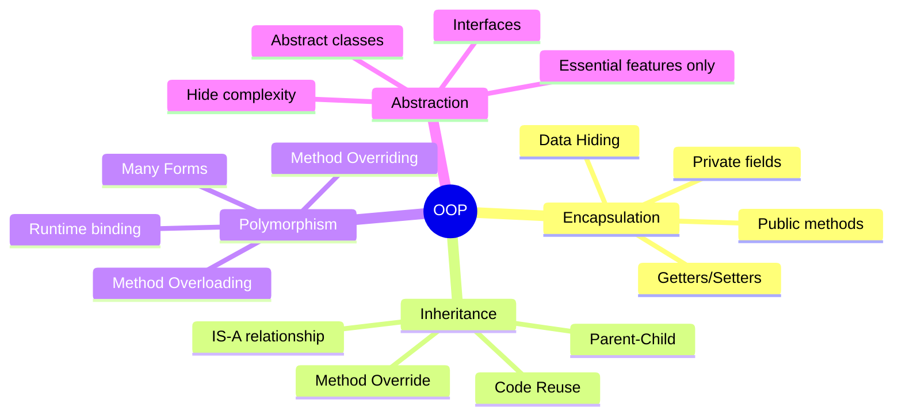
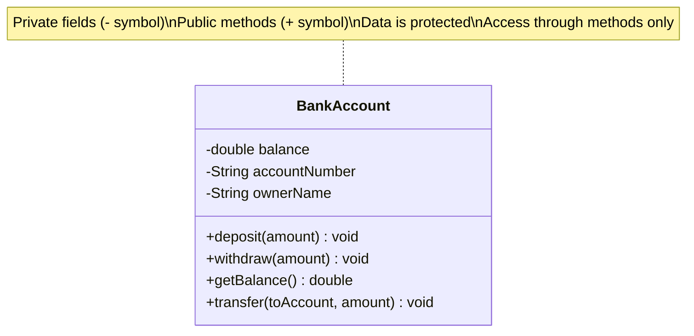
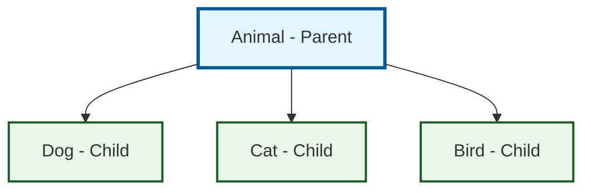
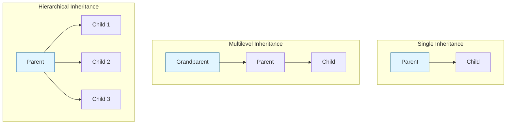
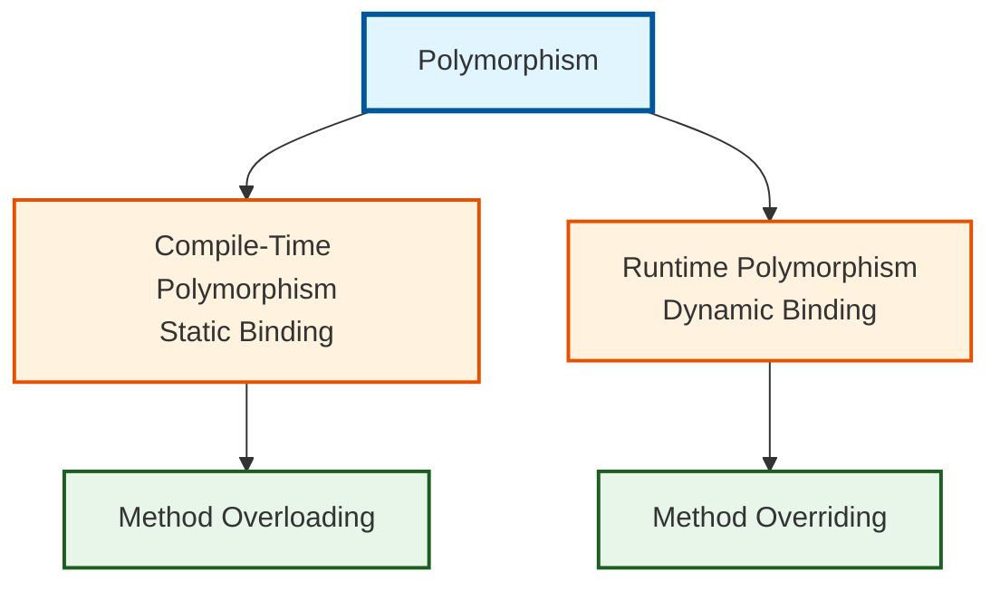
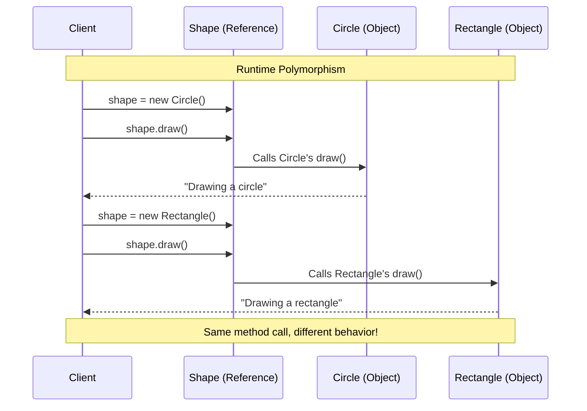
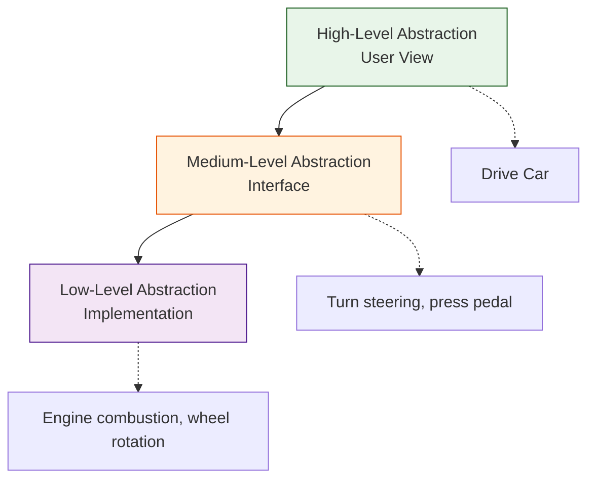
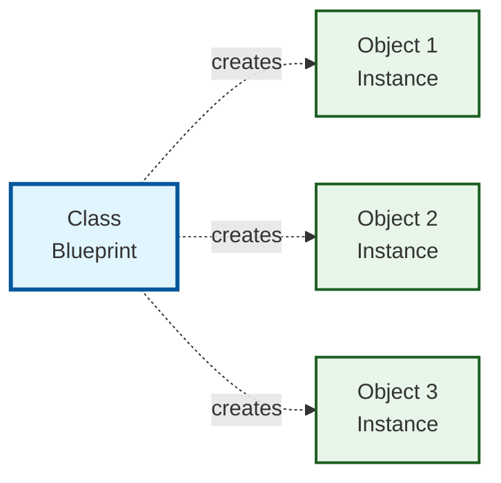
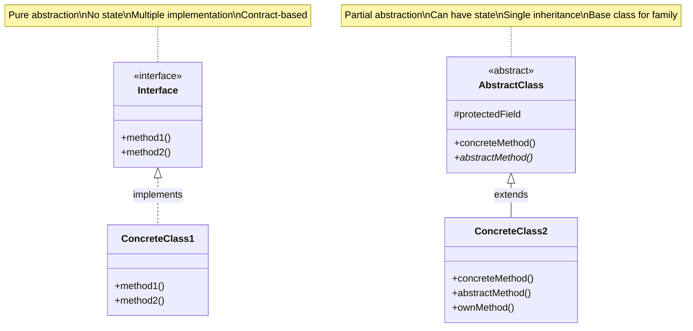

# Object-Oriented Programming (OOP) - Complete Guide

## 📋 Table of Contents
1. [Introduction](#introduction)
2. [The 4 Pillars of OOP](#the-4-pillars-of-oop)
3. [Classes vs Objects](#classes-vs-objects)
4. [Interfaces vs Abstract Classes](#interfaces-vs-abstract-classes)
5. [Common Mistakes](#common-mistakes)
6. [Interview Questions](#interview-questions)

---

## Introduction

### What is OOP?

**Object-Oriented Programming (OOP)** is a programming paradigm that organizes code around **objects** (data + behavior) rather than functions and logic.

**Real-world Analogy**:
Think of a **Car**:
- **Data** (Properties): color, model, speed
- **Behavior** (Methods): start(), stop(), accelerate()

Instead of having separate variables and functions, OOP combines them into a single unit called an **object**.

---

### Why OOP?

**Before OOP (Procedural Programming)**:
```java
// Variables scattered everywhere
String carColor = "red";
String carModel = "Toyota";
int carSpeed = 0;

// Functions operate on variables
void startCar() {
    carSpeed = 10;
}

void stopCar() {
    carSpeed = 0;
}
```

**Problems**:
- ❌ Data and functions are separate
- ❌ No data protection (anyone can change variables)
- ❌ Hard to manage in large systems
- ❌ No reusability

**With OOP**:
```java
class Car {
    // Data (encapsulated)
    private String color;
    private String model;
    private int speed;

    // Behavior (methods)
    public void start() {
        this.speed = 10;
    }

    public void stop() {
        this.speed = 0;
    }
}

// Usage
Car myCar = new Car();
myCar.start();  // Clean and organized!
```

**Benefits**:
- ✅ Data + behavior together
- ✅ Data protection (encapsulation)
- ✅ Easy to understand and maintain
- ✅ Reusable and extendable

---

## The 4 Pillars of OOP



---

### 1. Encapsulation

**Definition**: Bundling data and methods together, and hiding internal details.

**Analogy**: Think of a **TV Remote**
- You press buttons (public interface)
- You don't know the internal circuits (hidden implementation)
- You can't directly touch the circuits (data protection)

#### Without Encapsulation (❌ Bad)

```java
class BankAccount {
    public double balance;  // Anyone can access!
}

// Usage
BankAccount account = new BankAccount();
account.balance = 1000000;  // Direct access - dangerous!
account.balance = -500;     // Can set negative! No validation!
```

#### With Encapsulation (✅ Good)

```java
class BankAccount {
    // Private: Hidden from outside
    private double balance;

    // Public methods: Controlled access
    public void deposit(double amount) {
        if (amount > 0) {
            balance += amount;
        } else {
            throw new IllegalArgumentException("Amount must be positive");
        }
    }

    public void withdraw(double amount) {
        if (amount > 0 && amount <= balance) {
            balance -= amount;
        } else {
            throw new IllegalArgumentException("Invalid withdrawal");
        }
    }

    public double getBalance() {
        return balance;  // Read-only access
    }
}

// Usage
BankAccount account = new BankAccount();
account.deposit(1000);     // ✅ Validated
account.withdraw(200);     // ✅ Validated
// account.balance = -500; // ❌ Compilation error! Can't access private field
```

#### Encapsulation Diagram



#### Benefits of Encapsulation

1. **Data Protection**: Can't set invalid values
2. **Flexibility**: Can change internal implementation without breaking code
3. **Validation**: Can validate in setter methods
4. **Read-Only**: Can provide getters without setters

---

### 2. Inheritance

**Definition**: A class can inherit properties and methods from another class.

**Analogy**: Think of **Family Tree**
- Child inherits traits from parents
- Child can have own unique traits too

#### Inheritance Hierarchy



#### Code Example

```java
// Parent class (Base class / Superclass)
class Animal {
    // Common properties
    protected String name;
    protected int age;

    // Common behavior
    public void eat() {
        System.out.println(name + " is eating");
    }

    public void sleep() {
        System.out.println(name + " is sleeping");
    }
}

// Child class (Derived class / Subclass)
class Dog extends Animal {
    // Dog-specific property
    private String breed;

    // Dog-specific behavior
    public void bark() {
        System.out.println(name + " is barking: Woof!");
    }

    // Override parent method
    @Override
    public void eat() {
        System.out.println(name + " is eating dog food");
    }
}

class Cat extends Animal {
    // Cat-specific behavior
    public void meow() {
        System.out.println(name + " is meowing");
    }
}

// Usage
Dog dog = new Dog();
dog.name = "Buddy";
dog.eat();    // Inherited + overridden
dog.sleep();  // Inherited
dog.bark();   // Own method

Cat cat = new Cat();
cat.name = "Whiskers";
cat.eat();    // Inherited
cat.meow();   // Own method
```

#### Types of Inheritance



**Note**: Java doesn't support multiple inheritance (one class can't extend multiple classes) to avoid the "Diamond Problem".

#### When to Use Inheritance?

✅ **Use When**:
- IS-A relationship exists (Dog IS-A Animal)
- Need to reuse common code
- Have a clear parent-child hierarchy

❌ **Don't Use When**:
- Just want to reuse code (use composition instead)
- Relationship is HAS-A (Car HAS-A Engine, not Car IS-A Engine)
- Deep inheritance trees (max 3 levels recommended)

---

### 3. Polymorphism

**Definition**: "Many forms" - Same method name, different implementations.

**Analogy**: Think of a **Calculator**
- `add(2, 3)` → 5
- `add(2.5, 3.5)` → 6.0
- `add("Hello", "World")` → "HelloWorld"

Same method name `add()`, different behaviors!

#### Types of Polymorphism



#### Method Overloading (Compile-Time)

**Same method name, different parameters**

```java
class Calculator {
    // Different number of parameters
    public int add(int a, int b) {
        return a + b;
    }

    public int add(int a, int b, int c) {
        return a + b + c;
    }

    // Different parameter types
    public double add(double a, double b) {
        return a + b;
    }

    public String add(String a, String b) {
        return a + b;
    }
}

// Usage
Calculator calc = new Calculator();
calc.add(2, 3);           // Calls int version → 5
calc.add(2, 3, 4);        // Calls 3-parameter version → 9
calc.add(2.5, 3.5);       // Calls double version → 6.0
calc.add("Hi", "There");  // Calls String version → "HiThere"
```

**Rules for Overloading**:
1. ✅ Different number of parameters
2. ✅ Different parameter types
3. ✅ Different order of parameters
4. ❌ Can't differ only by return type

#### Method Overriding (Runtime)

**Subclass provides specific implementation of parent method**

```java
class Shape {
    public void draw() {
        System.out.println("Drawing a shape");
    }

    public double area() {
        return 0;
    }
}

class Circle extends Shape {
    private double radius;

    public Circle(double radius) {
        this.radius = radius;
    }

    @Override  // Annotation (good practice)
    public void draw() {
        System.out.println("Drawing a circle");
    }

    @Override
    public double area() {
        return Math.PI * radius * radius;
    }
}

class Rectangle extends Shape {
    private double width, height;

    public Rectangle(double width, double height) {
        this.width = width;
        this.height = height;
    }

    @Override
    public void draw() {
        System.out.println("Drawing a rectangle");
    }

    @Override
    public double area() {
        return width * height;
    }
}

// Usage - This is the power of polymorphism!
Shape shape1 = new Circle(5);
Shape shape2 = new Rectangle(4, 6);

shape1.draw();   // "Drawing a circle"
shape1.area();   // 78.53...

shape2.draw();   // "Drawing a rectangle"
shape2.area();   // 24.0

// Can treat different shapes uniformly!
Shape[] shapes = {new Circle(5), new Rectangle(4, 6), new Circle(3)};
for (Shape shape : shapes) {
    shape.draw();   // Calls appropriate method based on actual object type
}
```

#### Polymorphism in Action



---

### 4. Abstraction

**Definition**: Hiding complex implementation details, showing only essential features.

**Analogy**: Think of a **Car**
- You use: steering wheel, pedals, gear shift (essential features)
- You don't see: engine internals, transmission details (hidden complexity)

#### Abstraction Levels



#### Abstract Classes

**Abstract Class**: Class that cannot be instantiated, must be extended.

```java
// Abstract class - cannot create object directly
abstract class Animal {
    // Concrete method (has implementation)
    public void sleep() {
        System.out.println("Zzz...");
    }

    // Abstract method (no implementation)
    // Child MUST implement this
    public abstract void makeSound();

    // Abstract method
    public abstract void move();
}

// Concrete class - implements abstract methods
class Dog extends Animal {
    @Override
    public void makeSound() {
        System.out.println("Woof!");
    }

    @Override
    public void move() {
        System.out.println("Running on four legs");
    }
}

class Bird extends Animal {
    @Override
    public void makeSound() {
        System.out.println("Tweet!");
    }

    @Override
    public void move() {
        System.out.println("Flying in the sky");
    }
}

// Usage
// Animal animal = new Animal();  // ❌ Error! Can't instantiate abstract class
Animal dog = new Dog();            // ✅ OK
dog.makeSound();                   // "Woof!"
dog.sleep();                       // "Zzz..." (inherited)
```

#### Interfaces

**Interface**: Pure abstraction, only method signatures (until Java 8).

```java
// Interface - 100% abstraction
interface Flyable {
    // All methods are public abstract by default
    void fly();
    void land();
}

interface Swimmable {
    void swim();
}

// A class can implement multiple interfaces!
class Duck implements Flyable, Swimmable {
    @Override
    public void fly() {
        System.out.println("Duck flying");
    }

    @Override
    public void land() {
        System.out.println("Duck landing");
    }

    @Override
    public void swim() {
        System.out.println("Duck swimming");
    }
}

class Airplane implements Flyable {
    @Override
    public void fly() {
        System.out.println("Airplane flying at 30,000 feet");
    }

    @Override
    public void land() {
        System.out.println("Airplane landing on runway");
    }
}

// Usage
Flyable bird = new Duck();
bird.fly();    // "Duck flying"

Flyable plane = new Airplane();
plane.fly();   // "Airplane flying at 30,000 feet"
```

---

## Classes vs Objects

### Comparison



| Aspect | Class | Object |
|--------|-------|--------|
| Definition | Blueprint/Template | Instance of class |
| Memory | No memory allocated | Memory allocated |
| Keyword | `class` | `new` |
| Example | Recipe | Actual cake |
| Count | One | Many possible |

### Example

```java
// Class - Blueprint
class Car {
    // Properties (what every car has)
    String color;
    String model;
    int year;

    // Methods (what every car can do)
    void start() {
        System.out.println("Car starting");
    }

    void stop() {
        System.out.println("Car stopping");
    }
}

// Objects - Instances
Car car1 = new Car();
car1.color = "Red";
car1.model = "Toyota";
car1.year = 2020;

Car car2 = new Car();
car2.color = "Blue";
car2.model = "Honda";
car2.year = 2021;

// Two different objects from same class
// Different data, same structure and behavior
```

---

## Interfaces vs Abstract Classes

### Detailed Comparison

| Feature | Interface | Abstract Class |
|---------|-----------|----------------|
| **Multiple Inheritance** | ✅ Can implement many | ❌ Can extend only one |
| **Methods** | Abstract only (Java 7)<br/>Can have default (Java 8+) | Can have both abstract and concrete |
| **Variables** | public static final only | Any type (instance, static) |
| **Constructor** | ❌ Cannot have | ✅ Can have |
| **Access Modifiers** | public only | Any (public, protected, private) |
| **When to use** | Contract (CAN-DO) | Common base (IS-A) |
| **Example** | Flyable, Swimmable | Animal, Vehicle |

### Visual Comparison



### When to Use Which?

#### Use Interface When:
✅ Defining a contract (behavior specification)
✅ Need multiple inheritance
✅ Unrelated classes need same behavior
✅ Example: `Comparable`, `Serializable`, `Runnable`

```java
// Multiple interfaces - flexible
class Amphibian implements Swimmable, Walkable {
    // Implements both
}
```

#### Use Abstract Class When:
✅ Classes share common code
✅ Need to define common state (fields)
✅ Need non-public members
✅ Example: `Animal`, `Vehicle`, `Shape`

```java
// Common base with shared code
abstract class Vehicle {
    protected int wheels;
    protected String fuel;

    // Common implementation
    public void refuel() {
        System.out.println("Refueling with " + fuel);
    }

    // Force subclasses to implement
    public abstract void move();
}
```

---

## Common Mistakes

### Mistake 1: Not Using Encapsulation

```java
// ❌ Bad
class Person {
    public String name;
    public int age;
}

// Anyone can do:
person.age = -5;  // Invalid!

// ✅ Good
class Person {
    private String name;
    private int age;

    public void setAge(int age) {
        if (age > 0 && age < 150) {
            this.age = age;
        }
    }
}
```

### Mistake 2: Overusing Inheritance

```java
// ❌ Bad - Deep inheritance
class Animal { }
class Mammal extends Animal { }
class Carnivore extends Mammal { }
class Feline extends Carnivore { }
class Cat extends Feline { }
// Too deep! Hard to maintain

// ✅ Good - Prefer composition
class Cat {
    private Diet diet;  // Composition
    private Movement movement;
}
```

### Mistake 3: Forgetting @Override

```java
// ❌ Bad - Typo not caught
class Dog extends Animal {
    public void makesound() {  // Typo! Should be makeSound()
        System.out.println("Woof");
    }
}

// ✅ Good - Compiler catches typo
class Dog extends Animal {
    @Override
    public void makeSound() {  // Correct!
        System.out.println("Woof");
    }
}
```

---

## Interview Questions

### Q1: What are the 4 pillars of OOP?
**Answer**:
1. **Encapsulation** - Data hiding
2. **Inheritance** - Code reuse
3. **Polymorphism** - Many forms
4. **Abstraction** - Hiding complexity

### Q2: Difference between Interface and Abstract Class?
**Answer**: See comparison table above. Key points:
- Interface: pure contract, multiple inheritance
- Abstract Class: partial implementation, single inheritance

### Q3: What is method overloading vs overriding?
**Answer**:
- **Overloading**: Same name, different parameters (compile-time)
- **Overriding**: Same signature, different implementation (runtime)

### Q4: Can you override a private method?
**Answer**: No. Private methods are not inherited, so can't be overridden.

### Q5: What is the diamond problem?
**Answer**: In multiple inheritance, if two parent classes have the same method, which one does the child inherit? Java solves this by not allowing multiple class inheritance (but allows multiple interface implementation).

---

## Summary

### Key Takeaways

✅ **Encapsulation**: Bundle data + methods, hide details
✅ **Inheritance**: Reuse code through parent-child relationship
✅ **Polymorphism**: Same interface, different implementations
✅ **Abstraction**: Hide complexity, show essentials

### Best Practices

1. Always use private fields with public getters/setters
2. Favor composition over inheritance
3. Use @Override annotation
4. Keep inheritance hierarchies shallow (max 3 levels)
5. Use interfaces for contracts, abstract classes for common code

---

**Next**: [02 - Relationships in OOP](./02-relationships.md)

---

**Remember**: OOP is about organizing code to mirror real-world entities and relationships!
