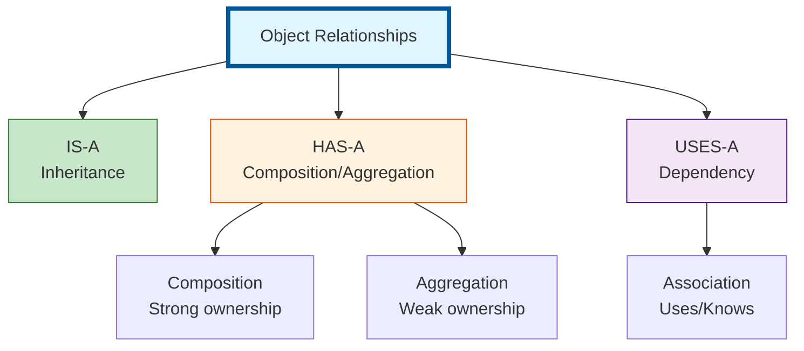
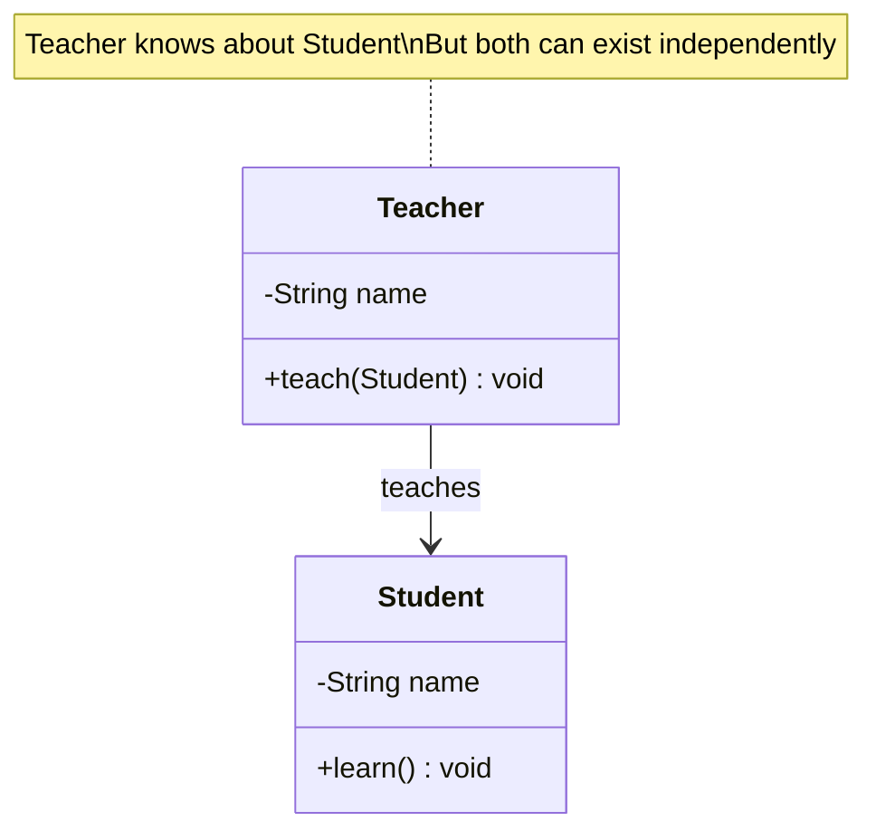
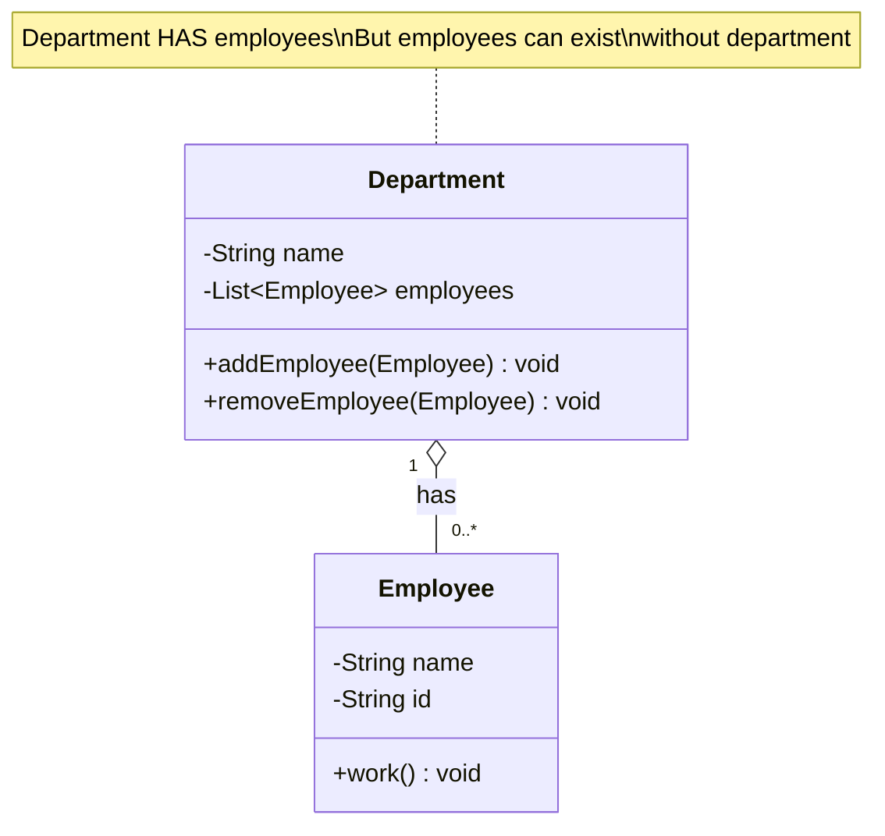
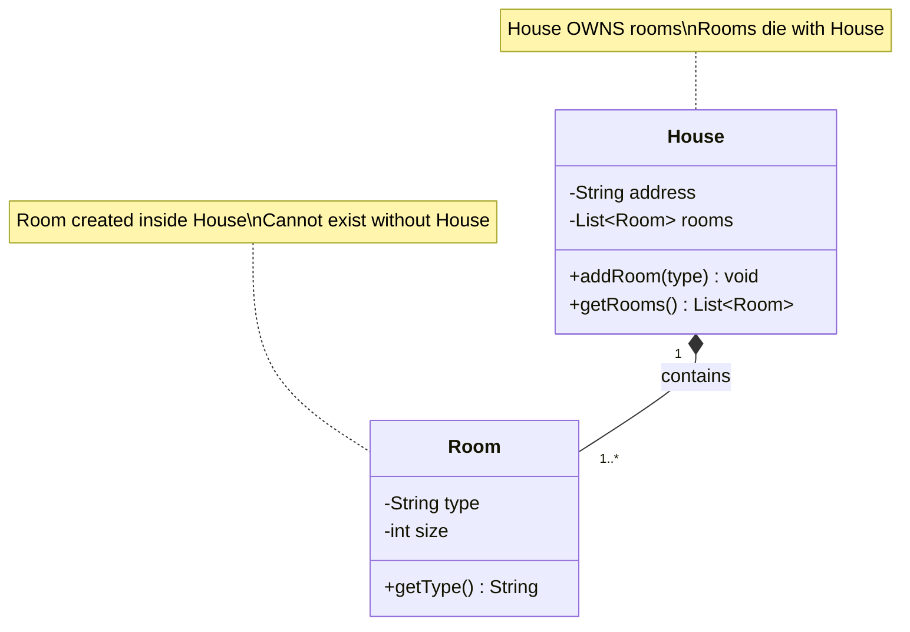
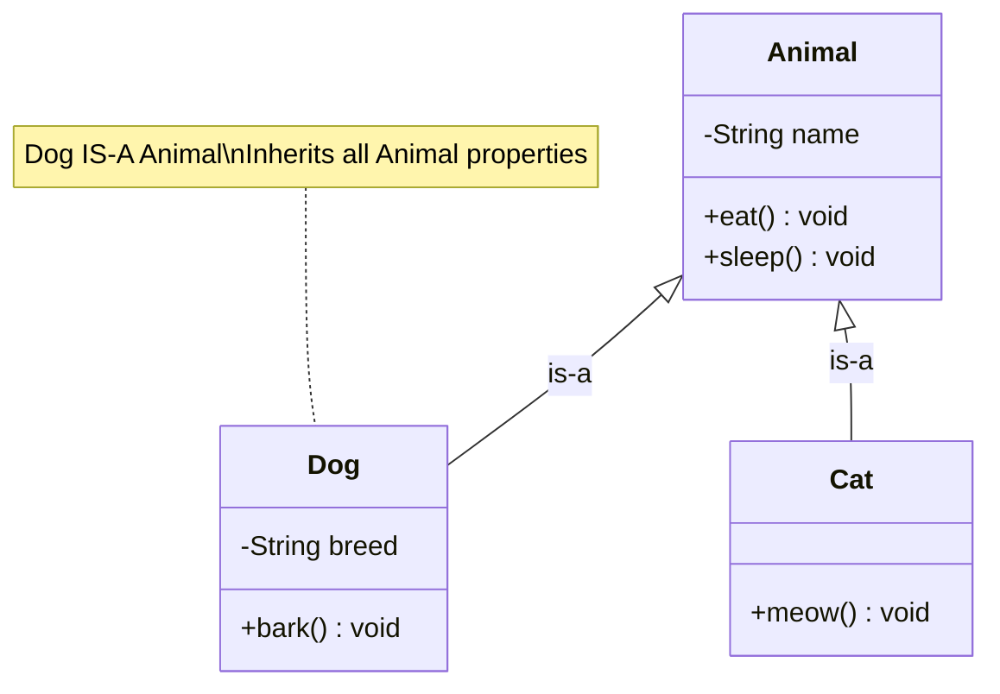
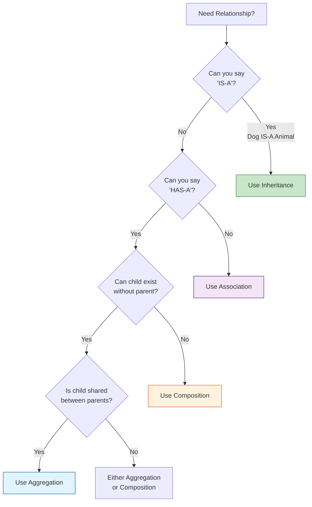
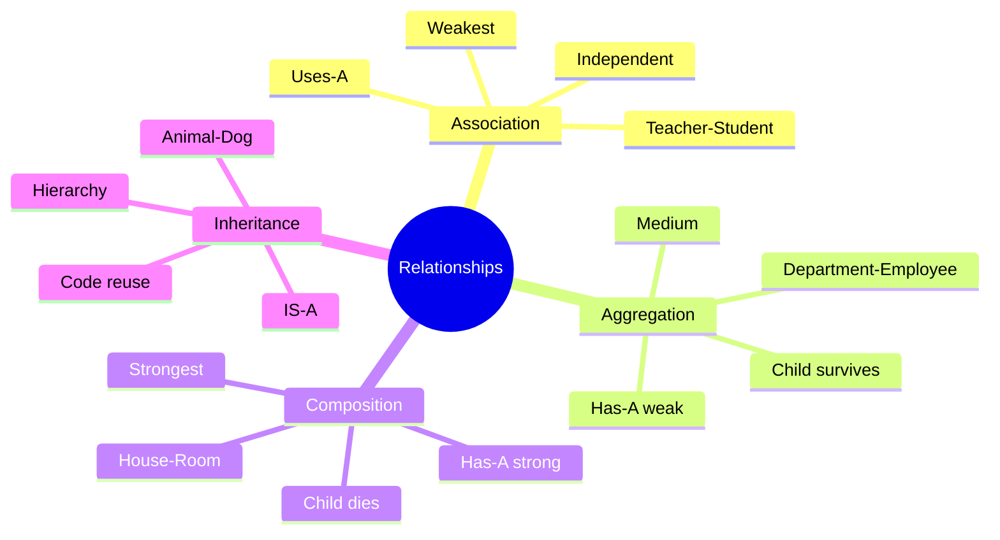

# Relationships in OOP - Complete Guide

## 📋 Types of Relationships

In Object-Oriented Programming, objects relate to each other in different ways. Understanding these relationships is crucial for good design.



---

## 1. Association (USES-A)

### Definition
**Association** represents a relationship where one class uses or knows about another class. Both objects can exist independently.

### Real-World Analogy
- Teacher **teaches** Student
- Doctor **treats** Patient
- Driver **drives** Car



### Code Example

```java
class Teacher {
    private String name;

    public void teach(Student student) {
        System.out.println(name + " is teaching " + student.getName());
    }
}

class Student {
    private String name;

    public String getName() {
        return name;
    }

    public void learn() {
        System.out.println(name + " is learning");
    }
}

// Usage
Teacher teacher = new Teacher("Mr. Smith");
Student student = new Student("John");

teacher.teach(student);  // Association
// Both can exist independently
```

### Characteristics
- **Weakest relationship**
- Both objects independent
- Can exist without each other
- Temporary relationship
- **UML**: Solid line with arrow `――――>`

---

## 2. Aggregation (HAS-A, Weak)

### Definition
**Aggregation** is a "has-a" relationship where child can exist independently of parent.

### Real-World Analogy
- Department **has** Employees (Employee can exist without Department)
- Team **has** Players (Player can exist without Team)
- Library **has** Books (Book can exist without Library)



### Code Example

```java
class Department {
    private String name;
    private List<Employee> employees;  // Aggregation

    public Department(String name) {
        this.name = name;
        this.employees = new ArrayList<>();
    }

    public void addEmployee(Employee employee) {
        employees.add(employee);
    }

    public void removeEmployee(Employee employee) {
        employees.remove(employee);
    }
}

class Employee {
    private String name;
    private String id;

    public Employee(String name, String id) {
        this.name = name;
        this.id = id;
    }

    public void work() {
        System.out.println(name + " is working");
    }
}

// Usage
Employee emp1 = new Employee("Alice", "E001");
Employee emp2 = new Employee("Bob", "E002");

Department dept = new Department("IT");
dept.addEmployee(emp1);
dept.addEmployee(emp2);

// Department destroyed, employees still exist!
dept = null;
emp1.work();  // Still works! ✅
emp2.work();  // Still works! ✅
```

### Characteristics
- **Medium relationship**
- Child can exist independently
- Parent doesn't own child
- Child can be shared
- **UML**: Hollow diamond `◇――――>`

---

## 3. Composition (HAS-A, Strong)

### Definition
**Composition** is a strong "has-a" relationship where child CANNOT exist without parent.

### Real-World Analogy
- House **has** Rooms (Room cannot exist without House)
- Car **has** Engine (Engine is part of Car)
- Human **has** Heart (Heart cannot exist alone)



### Code Example

```java
class House {
    private String address;
    private List<Room> rooms;  // Composition - created inside

    public House(String address) {
        this.address = address;
        this.rooms = new ArrayList<>();

        // Create rooms inside constructor - composition!
        rooms.add(new Room("Living Room", 200));
        rooms.add(new Room("Bedroom", 150));
        rooms.add(new Room("Kitchen", 100));
    }

    public List<Room> getRooms() {
        return Collections.unmodifiableList(rooms);
    }

    // Room created inside House
    public void addRoom(String type, int size) {
        rooms.add(new Room(type, size));
    }
}

// Room class - package-private or private inner class
class Room {
    private String type;
    private int size;

    // Only House can create Room
    Room(String type, int size) {
        this.type = type;
        this.size = size;
    }

    public String getType() {
        return type;
    }
}

// Usage
House house = new House("123 Main St");

// Cannot create Room independently!
// Room room = new Room("Garage", 250);  // Won't compile if Room is private!

// When house is destroyed, all rooms are destroyed
house = null;  // Rooms are destroyed too! ❌
```

### Characteristics
- **Strongest relationship**
- Child cannot exist independently
- Parent owns child
- Child created by parent
- Lifecycle managed together
- **UML**: Filled diamond `◆――――>`

---

## Comparison Table

| Feature | Association | Aggregation | Composition |
|---------|-------------|-------------|-------------|
| **Strength** | Weak | Medium | Strong |
| **Relationship** | Uses-A | Has-A (weak) | Has-A (strong) |
| **Child Independence** | ✅ Yes | ✅ Yes | ❌ No |
| **Ownership** | None | Weak | Strong |
| **Lifecycle** | Independent | Independent | Dependent |
| **Creation** | Outside | Outside | Inside |
| **UML Symbol** | `――――>` | `◇――――>` | `◆――――>` |
| **Example** | Teacher-Student | Department-Employee | House-Room |

---

## Visual Comparison

```mermaid
graph TB
    subgraph "Association"
        T[Teacher] -.uses.-> S[Student]
        Note1[Both independent<br/>Temporary relationship]
        T -.-> Note1
    end

    subgraph "Aggregation"
        D[Department] o--o E[Employee]
        Note2[Department HAS employees<br/>Employees survive without department]
        D -.-> Note2
    end

    subgraph "Composition"
        H[House] *--* R[Room]
        Note3[House OWNS rooms<br/>Rooms die with house]
        H -.-> Note3
    end

    style T fill:#e1f5ff,stroke:#01579b
    style D fill:#fff3e0,stroke:#e65100
    style H fill:#c8e6c9,stroke:#2e7d32
```

---

## 4. Inheritance (IS-A)

### Definition
**Inheritance** is an "is-a" relationship where subclass inherits from superclass.



### Code Example

```java
class Animal {
    protected String name;

    public void eat() {
        System.out.println(name + " is eating");
    }

    public void sleep() {
        System.out.println(name + " is sleeping");
    }
}

class Dog extends Animal {  // IS-A relationship
    private String breed;

    public void bark() {
        System.out.println(name + " is barking");
    }
}

// Dog IS-A Animal
Dog dog = new Dog();
dog.eat();    // Inherited from Animal
dog.sleep();  // Inherited from Animal
dog.bark();   // Own method
```

---

## When to Use Which?

### Decision Tree



### Quick Rules

✅ **Use Inheritance when**:
- IS-A relationship
- Dog IS-A Animal ✓
- Car IS-A Vehicle ✓

✅ **Use Composition when**:
- Strong ownership
- Part cannot exist without whole
- House-Room ✓
- Car-Engine ✓

✅ **Use Aggregation when**:
- Weak ownership
- Part can exist independently
- Department-Employee ✓
- Team-Player ✓

✅ **Use Association when**:
- No ownership
- Temporary relationship
- Teacher-Student ✓
- Driver-Car ✓

---

## Real-World Examples

### Example 1: University System

```java
// Composition: University owns Departments
class University {
    private List<Department> departments;  // Composition

    public University() {
        departments = new ArrayList<>();
        // Create departments inside
        departments.add(new Department("CS"));
        departments.add(new Department("Math"));
    }
}

// Aggregation: Department has Professors
class Department {
    private List<Professor> professors;  // Aggregation

    public void addProfessor(Professor prof) {
        professors.add(prof);
    }
}

// Association: Professor teaches Courses
class Professor {
    public void teach(Course course) {  // Association
        System.out.println("Teaching " + course.getName());
    }
}
```

### Example 2: Car System

```java
// Composition: Car owns Engine (Engine cannot exist without Car)
class Car {
    private Engine engine;  // Composition

    public Car() {
        this.engine = new Engine();  // Created inside
    }
}

// Composition: Car owns Wheels
class Car {
    private List<Wheel> wheels;  // Composition

    public Car() {
        wheels = new ArrayList<>();
        for (int i = 0; i < 4; i++) {
            wheels.add(new Wheel());  // Created inside
        }
    }
}

// Association: Driver drives Car (both independent)
class Driver {
    public void drive(Car car) {  // Association
        System.out.println("Driving the car");
    }
}
```

---

## Common Mistakes

### Mistake 1: Using Inheritance for Code Reuse

```java
// ❌ BAD: Stack is not a Vector!
class Stack extends Vector {
    // Inheriting just for code reuse
}

// ✅ GOOD: Use composition
class Stack {
    private List list = new ArrayList();  // Composition

    public void push(Object item) {
        list.add(item);
    }
}
```

### Mistake 2: Deep Inheritance Hierarchies

```java
// ❌ BAD: Too deep!
Animal → Mammal → Carnivore → Feline → Cat

// ✅ GOOD: Use composition
class Cat {
    private Diet diet = new Carnivore();  // Composition
    private Movement movement = new Walking();
}
```

### Mistake 3: Confusing Aggregation and Composition

```java
// ❌ WRONG: Employee created outside, but used as composition
class Department {
    private List<Employee> employees;

    // This is aggregation, not composition!
    public void addEmployee(Employee emp) {
        employees.add(emp);
    }
}

// ✅ RIGHT: Clearly aggregation
class Department {
    private List<Employee> employees;  // Aggregation
}
```

---

## UML Notation Summary

```mermaid
graph LR
    subgraph "UML Relationships"
        C1[Class A] -->|Association| C2[Class B]
        C3[Class C] o-->|Aggregation<br/>Hollow Diamond| C4[Class D]
        C5[Class E] *-->|Composition<br/>Filled Diamond| C6[Class F]
        C7[Parent] <|--|Inheritance<br/>Hollow Triangle| C8[Child]
    end
```

---

## Interview Questions

### Q1: What's the difference between composition and aggregation?
**Answer**:
- **Composition**: Strong ownership, child dies with parent (House-Room)
- **Aggregation**: Weak ownership, child survives independently (Department-Employee)

### Q2: When should you use inheritance?
**Answer**: Only when there's a true IS-A relationship. Prefer composition for code reuse.

### Q3: What does "favor composition over inheritance" mean?
**Answer**: Use HAS-A (composition) instead of IS-A (inheritance) when possible. More flexible and avoids deep hierarchies.

### Q4: Give an example of association
**Answer**: Teacher teaches Student. Both exist independently, temporary relationship.

### Q5: How do you represent composition in code?
**Answer**: Create the child object inside the parent's constructor. Child's lifecycle managed by parent.

---

## Summary



---

## Best Practices

1. ✅ **Favor composition over inheritance**
2. ✅ **Use aggregation for shared objects**
3. ✅ **Use composition for part-whole relationships**
4. ✅ **Keep inheritance hierarchies shallow (max 3 levels)**
5. ✅ **Ask "IS-A" or "HAS-A" to decide**

---

**Next**: [03 - SOLID Principles](./03-solid-principles.md)

---

**Remember**: Choose the right relationship based on real-world semantics, not just code reuse!
