# SOLID Principles - Complete Guide

## 📋 What is SOLID?

SOLID is an acronym for **5 design principles** that make software designs more understandable, flexible, and maintainable.

**Created by**: Robert C. Martin (Uncle Bob)


---

## S - Single Responsibility Principle (SRP)

### Definition
**A class should have only ONE reason to change.**

### The Problem

```java
// ❌ BAD: Class has multiple responsibilities
class Employee {
    private String name;
    private double salary;

    // Responsibility 1: Employee data
    public void setName(String name) {
        this.name = name;
    }

    // Responsibility 2: Calculate pay
    public double calculatePay() {
        // Complex payroll logic
        return salary * 1.1;
    }

    // Responsibility 3: Save to database
    public void saveToDatabase() {
        // Database code
        System.out.println("Saving to DB");
    }

    // Responsibility 4: Generate report
    public String generateReport() {
        // Report generation logic
        return "Employee Report: " + name;
    }
}
```

**Problems**:
- Changes to database logic affect Employee class
- Changes to report format affect Employee class
- Changes to payroll calculation affect Employee class
- Hard to test (need database, etc.)
- **3 reasons to change!**

### The Solution

```java
// ✅ GOOD: Each class has one responsibility

// Responsibility 1: Employee data
class Employee {
    private String name;
    private double salary;

    public String getName() { return name; }
    public void setName(String name) { this.name = name; }
    public double getSalary() { return salary; }
    public void setSalary(double salary) { this.salary = name; }
}

// Responsibility 2: Calculate pay
class PayrollCalculator {
    public double calculatePay(Employee employee) {
        return employee.getSalary() * 1.1;
    }
}

// Responsibility 3: Save to database
class EmployeeRepository {
    public void save(Employee employee) {
        // Database code
        System.out.println("Saving employee: " + employee.getName());
    }
}

// Responsibility 4: Generate report
class EmployeeReportGenerator {
    public String generateReport(Employee employee) {
        return "Employee Report: " + employee.getName();
    }
}
```

### SRP Diagram


### How to Identify Violations?

Ask yourself:
1. Can you describe the class in one sentence without using "and" or "or"?
2. If you need to change X, would this class need to change?
3. Does this class have multiple reasons to change?

If "yes" to 2 or 3, you're violating SRP!

---

## O - Open/Closed Principle (OCP)

### Definition
**Classes should be OPEN for extension but CLOSED for modification.**

### The Problem

```java
// ❌ BAD: Must modify class to add new shapes
class AreaCalculator {
    public double calculateArea(Object shape) {
        if (shape instanceof Circle) {
            Circle circle = (Circle) shape;
            return Math.PI * circle.radius * circle.radius;
        } else if (shape instanceof Rectangle) {
            Rectangle rect = (Rectangle) shape;
            return rect.width * rect.height;
        } else if (shape instanceof Triangle) {
            // Added new shape - modified existing code!
            Triangle tri = (Triangle) shape;
            return 0.5 * tri.base * tri.height;
        }
        return 0;
    }
}
```

**Problems**:
- Adding Square? Modify `AreaCalculator` ❌
- Adding Pentagon? Modify `AreaCalculator` ❌
- **Every new shape requires modifying existing code!**
- Risk of breaking existing functionality

### The Solution

```java
// ✅ GOOD: Use abstraction + polymorphism

// Abstract interface - defines contract
interface Shape {
    double calculateArea();
}

// Each shape implements the contract
class Circle implements Shape {
    private double radius;

    public Circle(double radius) {
        this.radius = radius;
    }

    @Override
    public double calculateArea() {
        return Math.PI * radius * radius;
    }
}

class Rectangle implements Shape {
    private double width;
    private double height;

    public Rectangle(double width, double height) {
        this.width = width;
        this.height = height;
    }

    @Override
    public double calculateArea() {
        return width * height;
    }
}

// New shape? Just add new class - NO modification to existing code!
class Triangle implements Shape {
    private double base;
    private double height;

    public Triangle(double base, double height) {
        this.base = base;
        this.height = height;
    }

    @Override
    public double calculateArea() {
        return 0.5 * base * height;
    }
}

// Calculator never changes!
class AreaCalculator {
    public double calculateArea(Shape shape) {
        return shape.calculateArea();  // Polymorphism!
    }

    public double calculateTotalArea(List<Shape> shapes) {
        return shapes.stream()
                .mapToDouble(Shape::calculateArea)
                .sum();
    }
}
```

### OCP Diagram


### Key Points

✅ **Extension**: Add new functionality by adding new code
❌ **Modification**: Don't change existing code

**How to achieve OCP**:
1. Use abstractions (interfaces/abstract classes)
2. Depend on abstractions, not concrete classes
3. Use polymorphism

---

## L - Liskov Substitution Principle (LSP)

### Definition
**Objects of a superclass should be replaceable with objects of a subclass without breaking the application.**

**Simple**: If S is a subtype of T, then objects of type T can be replaced with objects of type S.

### The Problem

```java
// ❌ BAD: Violates LSP
class Rectangle {
    protected int width;
    protected int height;

    public void setWidth(int width) {
        this.width = width;
    }

    public void setHeight(int height) {
        this.height = height;
    }

    public int getArea() {
        return width * height;
    }
}

class Square extends Rectangle {
    @Override
    public void setWidth(int width) {
        this.width = width;
        this.height = width;  // Square: width = height
    }

    @Override
    public void setHeight(int height) {
        this.width = height;  // Square: width = height
        this.height = height;
    }
}

// Usage
void testRectangle(Rectangle rect) {
    rect.setWidth(5);
    rect.setHeight(4);
    assert rect.getArea() == 20;  // Expected: 5 * 4 = 20
}

Rectangle rectangle = new Rectangle();
testRectangle(rectangle);  // ✅ Passes: 5 * 4 = 20

Rectangle square = new Square();
testRectangle(square);  // ❌ Fails: 4 * 4 = 16 (not 20!)
```

**Problem**: Square changed the behavior! Can't substitute Square for Rectangle.

### The Solution

```java
// ✅ GOOD: Separate hierarchies

interface Shape {
    int getArea();
}

class Rectangle implements Shape {
    private int width;
    private int height;

    public Rectangle(int width, int height) {
        this.width = width;
        this.height = height;
    }

    public void setWidth(int width) {
        this.width = width;
    }

    public void setHeight(int height) {
        this.height = height;
    }

    @Override
    public int getArea() {
        return width * height;
    }
}

class Square implements Shape {
    private int side;

    public Square(int side) {
        this.side = side;
    }

    public void setSide(int side) {
        this.side = side;
    }

    @Override
    public int getArea() {
        return side * side;
    }
}
```

### LSP Rules

✅ **DO**:
- Subclass can strengthen postconditions (return more)
- Subclass can weaken preconditions (accept more)
- Maintain parent's invariants

❌ **DON'T**:
- Throw new exceptions not thrown by parent
- Change expected behavior
- Remove functionality

### LSP Diagram

```mermaid
graph TB
    subgraph "❌ Violates LSP"
        R1[Rectangle]
        S1[Square extends Rectangle]
        R1 --> S1
        Note1[Square changes behavior<br/>Can't substitute!]
        S1 -.-> Note1
    end

    subgraph "✅ Follows LSP"
        I[Shape Interface]
        R2[Rectangle implements Shape]
        S2[Square implements Shape]
        I --> R2
        I --> S2
        Note2[Both implement Shape correctly<br/>Can substitute!]
        I -.-> Note2
    end

    style R1 fill:#ffcdd2,stroke:#c62828
    style S1 fill:#ffcdd2,stroke:#c62828
    style I fill:#c8e6c9,stroke:#2e7d32
    style R2 fill:#c8e6c9,stroke:#2e7d32
    style S2 fill:#c8e6c9,stroke:#2e7d32
```



---

## I - Interface Segregation Principle (ISP)

### Definition
**No client should be forced to depend on methods it doesn't use.**

### The Problem

```java
// ❌ BAD: Fat interface
interface Worker {
    void work();
    void eat();
    void sleep();
    void attendMeeting();
    void writeCode();
    void drawDesign();
}

// Robot doesn't eat or sleep!
class Robot implements Worker {
    @Override
    public void work() {
        System.out.println("Robot working");
    }

    @Override
    public void eat() {
        // Robots don't eat!
        throw new UnsupportedOperationException();
    }

    @Override
    public void sleep() {
        // Robots don't sleep!
        throw new UnsupportedOperationException();
    }

    @Override
    public void attendMeeting() {
        throw new UnsupportedOperationException();
    }

    // ... forced to implement methods it doesn't need
}
```

**Problem**: Robot forced to implement eat(), sleep(), etc.

### The Solution

```java
// ✅ GOOD: Segregated interfaces

interface Workable {
    void work();
}

interface Eatable {
    void eat();
}

interface Sleepable {
    void sleep();
}

interface Attendee {
    void attendMeeting();
}

interface Codable {
    void writeCode();
}

// Human implements what it needs
class Human implements Workable, Eatable, Sleepable, Attendee {
    @Override
    public void work() {
        System.out.println("Human working");
    }

    @Override
    public void eat() {
        System.out.println("Human eating");
    }

    @Override
    public void sleep() {
        System.out.println("Human sleeping");
    }

    @Override
    public void attendMeeting() {
        System.out.println("Human attending meeting");
    }
}

// Robot only implements what it needs
class Robot implements Workable {
    @Override
    public void work() {
        System.out.println("Robot working 24/7");
    }
}

// Developer implements relevant interfaces
class Developer implements Workable, Eatable, Sleepable, Codable {
    @Override
    public void work() {
        System.out.println("Developer working");
    }

    @Override
    public void eat() {
        System.out.println("Developer eating pizza");
    }

    @Override
    public void sleep() {
        System.out.println("Developer sleeping (rarely)");
    }

    @Override
    public void writeCode() {
        System.out.println("Developer writing awesome code");
    }
}
```

### ISP Diagram


### How to Apply ISP

1. **Identify**: Find fat interfaces with many methods
2. **Group**: Group related methods
3. **Split**: Create smaller, focused interfaces
4. **Implement**: Classes implement only what they need

---

## D - Dependency Inversion Principle (DIP)

### Definition
1. **High-level modules should not depend on low-level modules. Both should depend on abstractions.**
2. **Abstractions should not depend on details. Details should depend on abstractions.**

### The Problem

```java
// ❌ BAD: High-level depends on low-level

// Low-level module
class MySQLDatabase {
    public void saveData(String data) {
        System.out.println("Saving to MySQL: " + data);
    }
}

// High-level module depends on concrete class
class UserService {
    private MySQLDatabase database;  // Tightly coupled!

    public UserService() {
        this.database = new MySQLDatabase();  // Hard-coded dependency
    }

    public void saveUser(String user) {
        database.saveData(user);
    }
}
```

**Problems**:
- Want to switch to PostgreSQL? Must modify `UserService` ❌
- Can't test `UserService` without real database ❌
- Tight coupling ❌

### The Solution

```java
// ✅ GOOD: Both depend on abstraction

// Abstraction
interface Database {
    void saveData(String data);
}

// Low-level modules implement abstraction
class MySQLDatabase implements Database {
    @Override
    public void saveData(String data) {
        System.out.println("Saving to MySQL: " + data);
    }
}

class PostgreSQLDatabase implements Database {
    @Override
    public void saveData(String data) {
        System.out.println("Saving to PostgreSQL: " + data);
    }
}

class MongoDBDatabase implements Database {
    @Override
    public void saveData(String data) {
        System.out.println("Saving to MongoDB: " + data);
    }
}

// High-level module depends on abstraction
class UserService {
    private Database database;  // Depends on interface!

    // Dependency Injection via constructor
    public UserService(Database database) {
        this.database = database;
    }

    public void saveUser(String user) {
        database.saveData(user);
    }
}

// Usage - Easy to switch!
Database mysql = new MySQLDatabase();
UserService service1 = new UserService(mysql);

Database postgres = new PostgreSQLDatabase();
UserService service2 = new UserService(postgres);

// Testing - Use mock!
Database mockDb = new MockDatabase();
UserService serviceTest = new UserService(mockDb);
```

### DIP Diagram

```mermaid
graph TB
    subgraph "❌ Violates DIP"
        US1[UserService<br/>High-level]
        MySQL1[MySQLDatabase<br/>Low-level]
        US1 -->|depends on| MySQL1
        Note1[Direct dependency<br/>on concrete class]
        US1 -.-> Note1
    end

    subgraph "✅ Follows DIP"
        US2[UserService<br/>High-level]
        DB[Database Interface<br/>Abstraction]
        MySQL2[MySQLDatabase<br/>Low-level]
        Postgres[PostgreSQLDatabase<br/>Low-level]
        Mongo[MongoDBDatabase<br/>Low-level]

        US2 -->|depends on| DB
        DB <|.. MySQL2
        DB <|.. Postgres
        DB <|.. Mongo

        Note2[Both depend on abstraction<br/>Loose coupling!]
        DB -.-> Note2
    end

    style US1 fill:#ffcdd2,stroke:#c62828
    style MySQL1 fill:#ffcdd2,stroke:#c62828
    style US2 fill:#c8e6c9,stroke:#2e7d32
    style DB fill:#e1f5ff,stroke:#01579b,stroke-width:3px
    style MySQL2 fill:#c8e6c9,stroke:#2e7d32
    style Postgres fill:#c8e6c9,stroke:#2e7d32
    style Mongo fill:#c8e6c9,stroke:#2e7d32
```

### Benefits of DIP

✅ **Flexibility**: Easy to swap implementations
✅ **Testability**: Easy to mock dependencies
✅ **Maintainability**: Changes isolated
✅ **Loose Coupling**: Modules independent

---

## SOLID Summary


---

## Quick Reference Table

| Principle | Question to Ask | Violation Sign | Solution |
|-----------|----------------|----------------|----------|
| **SRP** | Does this class have one reason to change? | Class has "and" in description | Split into multiple classes |
| **OCP** | Can I add features without modifying existing code? | Lots of if-else for types | Use abstractions + polymorphism |
| **LSP** | Can I substitute child for parent? | Child throws unexpected exceptions | Separate hierarchies |
| **ISP** | Does the interface have unused methods? | Implementing empty methods | Split into smaller interfaces |
| **DIP** | Am I depending on abstractions? | Depending on concrete classes | Introduce interfaces |

---

## Interview Questions

### Q1: What does SOLID stand for?
**Answer**:
- **S** - Single Responsibility Principle
- **O** - Open/Closed Principle
- **L** - Liskov Substitution Principle
- **I** - Interface Segregation Principle
- **D** - Dependency Inversion Principle

### Q2: Give an example of violating SRP
**Answer**: A User class that handles user data, database operations, AND email sending violates SRP. Should split into User (data), UserRepository (database), EmailService (email).

### Q3: How does OCP relate to design patterns?
**Answer**: Strategy, Template Method, and Factory patterns all follow OCP by allowing extension through new implementations without modifying existing code.

### Q4: What's the difference between Dependency Inversion and Dependency Injection?
**Answer**:
- **Dependency Inversion (DIP)**: Design principle - depend on abstractions
- **Dependency Injection (DI)**: Implementation technique - provide dependencies from outside

### Q5: Why is LSP important?
**Answer**: LSP ensures polymorphism works correctly. If violated, you can't reliably substitute child classes for parent classes, breaking polymorphic behavior and causing runtime errors.

---

## Common Mistakes

### 1. Confusing SRP with "Do One Thing"
- ❌ "This method does one thing" (wrong level)
- ✅ "This class has one reason to change" (correct level)

### 2. Over-engineering with SOLID
- Don't create interfaces for everything
- Apply SOLID when you see the need
- Start simple, refactor when needed

### 3. Violating LSP with exceptions
```java
// ❌ Bad
class Bird {
    void fly() { }
}

class Penguin extends Bird {
    void fly() {
        throw new Exception("Can't fly!");  // LSP violation!
    }
}
```

---

## Best Practices

1. ✅ **Start with SRP**: Easiest to understand and apply
2. ✅ **Use interfaces**: Helps with OCP, ISP, and DIP
3. ✅ **Prefer composition over inheritance**: Avoids LSP issues
4. ✅ **Dependency Injection**: Use frameworks like Spring
5. ✅ **Refactor gradually**: Don't try to apply all at once

---

**Next**: [04 - Creational Design Patterns](./04-creational-patterns.md)

---

**Remember**: SOLID principles are guidelines, not strict rules. Use judgment!
