# Multithreading & Concurrency - Complete Guide

## 📋 What is Multithreading?

**Multithreading** is the ability of a program to execute multiple threads (lightweight processes) concurrently.

**Analogy**: Think of a **restaurant kitchen**:
- **Single Thread**: One chef doing everything (slow!)
- **Multiple Threads**: Multiple chefs working simultaneously (fast!)


---

## Thread vs Process

| Aspect | Process | Thread |
|--------|---------|--------|
| **Definition** | Independent program | Lightweight sub-process |
| **Memory** | Separate memory space | Shared memory space |
| **Communication** | IPC (slow) | Shared variables (fast) |
| **Creation** | Expensive | Cheap |
| **Context Switch** | Slow | Fast |
| **Example** | Chrome, Word | Tabs in Chrome |


---

## Creating Threads in Java

### Method 1: Extending Thread Class

```java
// Method 1: Extend Thread class
class MyThread extends Thread {
    @Override
    public void run() {
        // Code to execute in this thread
        for (int i = 0; i < 5; i++) {
            System.out.println(Thread.currentThread().getName() + ": " + i);
            try {
                Thread.sleep(1000);  // Sleep for 1 second
            } catch (InterruptedException e) {
                e.printStackTrace();
            }
        }
    }
}

// Usage
MyThread thread1 = new MyThread();
MyThread thread2 = new MyThread();

thread1.start();  // Start thread1
thread2.start();  // Start thread2

// Both threads run concurrently!
```

### Method 2: Implementing Runnable Interface (Preferred)

```java
// Method 2: Implement Runnable interface (BETTER!)
class MyTask implements Runnable {
    @Override
    public void run() {
        for (int i = 0; i < 5; i++) {
            System.out.println(Thread.currentThread().getName() + ": " + i);
            try {
                Thread.sleep(1000);
            } catch (InterruptedException e) {
                e.printStackTrace();
            }
        }
    }
}

// Usage
Thread thread1 = new Thread(new MyTask());
Thread thread2 = new Thread(new MyTask());

thread1.start();
thread2.start();
```

**Why Runnable is better?**
- ✅ Can extend other classes (Java single inheritance limitation)
- ✅ Separation of task and thread
- ✅ Can reuse same Runnable for multiple threads
- ✅ More flexible

### Method 3: Lambda Expression (Java 8+)

```java
// Method 3: Lambda (cleanest!)
Thread thread = new Thread(() -> {
    for (int i = 0; i < 5; i++) {
        System.out.println(Thread.currentThread().getName() + ": " + i);
        try {
            Thread.sleep(1000);
        } catch (InterruptedException e) {
            e.printStackTrace();
        }
    }
});

thread.start();
```

---

## Thread Lifecycle


---

## The Concurrency Problem

### Race Condition

**Definition**: Multiple threads accessing shared data simultaneously, causing unexpected results.

```java
// ❌ PROBLEM: Race Condition
class Counter {
    private int count = 0;

    public void increment() {
        count++;  // NOT atomic! 3 operations:
                  // 1. Read count
                  // 2. Add 1
                  // 3. Write count
    }

    public int getCount() {
        return count;
    }
}

// Two threads increment simultaneously
Counter counter = new Counter();

Thread t1 = new Thread(() -> {
    for (int i = 0; i < 1000; i++) {
        counter.increment();
    }
});

Thread t2 = new Thread(() -> {
    for (int i = 0; i < 1000; i++) {
        counter.increment();
    }
});

t1.start();
t2.start();
t1.join();  // Wait for t1 to finish
t2.join();  // Wait for t2 to finish

System.out.println("Count: " + counter.getCount());
// Expected: 2000
// Actual: 1523 (or some random number < 2000)
// WHY? Race condition!
```

### Why Race Condition Happens?


---

## Synchronization

### Solution 1: `synchronized` Keyword

```java
// ✅ SOLUTION: Synchronized method
class Counter {
    private int count = 0;

    // synchronized = Only one thread at a time
    public synchronized void increment() {
        count++;
    }

    public synchronized int getCount() {
        return count;
    }
}

// Now: Count will be exactly 2000!
```

### How `synchronized` Works

```mermaid
sequenceDiagram
    participant T1 as Thread 1
    participant Lock as Object Lock
    participant Counter
    participant T2 as Thread 2

    T1->>Lock: Acquire lock
    Lock-->>T1: Lock granted
    T1->>Counter: increment() [LOCKED]
    Note over Counter: count = 0 → 1

    T2->>Lock: Try acquire lock
    Lock-->>T2: BLOCKED (T1 has lock)

    T1->>Counter: Complete
    T1->>Lock: Release lock

    T2->>Lock: Acquire lock
    Lock-->>T2: Lock granted
    T2->>Counter: increment() [LOCKED]
    Note over Counter: count = 1 → 2
    T2->>Lock: Release lock
```



### Synchronized Block (Fine-grained)

```java
class BankAccount {
    private double balance = 0;
    private final Object lock = new Object();  // Explicit lock object

    public void deposit(double amount) {
        // Only synchronize critical section
        synchronized(lock) {
            balance += amount;
        }
        // Other non-critical code here
        sendEmail();  // Not synchronized
    }

    public void withdraw(double amount) {
        synchronized(lock) {
            if (balance >= amount) {
                balance -= amount;
            }
        }
    }

    public double getBalance() {
        synchronized(lock) {
            return balance;
        }
    }

    private void sendEmail() {
        // No need to synchronize
        System.out.println("Email sent");
    }
}
```

---

## Thread Communication

### wait(), notify(), notifyAll()

```java
class SharedResource {
    private int data;
    private boolean hasData = false;

    // Producer thread calls this
    public synchronized void produce(int value) throws InterruptedException {
        // Wait if data already present
        while (hasData) {
            wait();  // Release lock and wait
        }

        // Produce data
        this.data = value;
        this.hasData = true;
        System.out.println("Produced: " + value);

        // Notify consumer
        notify();  // Wake up waiting thread
    }

    // Consumer thread calls this
    public synchronized int consume() throws InterruptedException {
        // Wait if no data available
        while (!hasData) {
            wait();  // Release lock and wait
        }

        // Consume data
        int value = this.data;
        this.hasData = false;
        System.out.println("Consumed: " + value);

        // Notify producer
        notify();  // Wake up waiting thread

        return value;
    }
}

// Producer thread
Thread producer = new Thread(() -> {
    SharedResource resource = new SharedResource();
    for (int i = 0; i < 5; i++) {
        try {
            resource.produce(i);
            Thread.sleep(1000);
        } catch (InterruptedException e) {
            e.printStackTrace();
        }
    }
});

// Consumer thread
Thread consumer = new Thread(() -> {
    SharedResource resource = new SharedResource();
    for (int i = 0; i < 5; i++) {
        try {
            resource.consume();
            Thread.sleep(1500);
        } catch (InterruptedException e) {
            e.printStackTrace();
        }
    }
});
```

---

## Modern Concurrency: java.util.concurrent

### ExecutorService (Thread Pool)

```java
import java.util.concurrent.*;

// Create thread pool with 5 threads
ExecutorService executor = Executors.newFixedThreadPool(5);

// Submit tasks
for (int i = 0; i < 10; i++) {
    int taskId = i;
    executor.submit(() -> {
        System.out.println("Task " + taskId + " executed by " +
                         Thread.currentThread().getName());
        try {
            Thread.sleep(1000);
        } catch (InterruptedException e) {
            e.printStackTrace();
        }
    });
}

// Shutdown executor
executor.shutdown();

// Wait for all tasks to complete
executor.awaitTermination(1, TimeUnit.MINUTES);
```

### AtomicInteger (Lock-free)

```java
import java.util.concurrent.atomic.AtomicInteger;

// ✅ BETTER: Lock-free counter
class Counter {
    private AtomicInteger count = new AtomicInteger(0);

    public void increment() {
        count.incrementAndGet();  // Atomic operation!
    }

    public int getCount() {
        return count.get();
    }
}

// No synchronization needed!
// Atomic operations are thread-safe
```

### CountDownLatch

```java
import java.util.concurrent.CountDownLatch;

// Wait for multiple threads to complete
CountDownLatch latch = new CountDownLatch(3);  // Count = 3

// Start 3 threads
for (int i = 0; i < 3; i++) {
    int threadId = i;
    new Thread(() -> {
        System.out.println("Thread " + threadId + " working...");
        try {
            Thread.sleep(2000);
        } catch (InterruptedException e) {
            e.printStackTrace();
        }
        System.out.println("Thread " + threadId + " done");
        latch.countDown();  // Decrement count
    }).start();
}

// Main thread waits
System.out.println("Waiting for threads to complete...");
latch.await();  // Blocks until count = 0
System.out.println("All threads completed!");
```

---

## Deadlock

### What is Deadlock?

**Definition**: Two or more threads waiting for each other to release locks, causing all to be stuck forever.


### Deadlock Example

```java
// ❌ DEADLOCK!
class Resource {
    public synchronized void method1(Resource other) {
        System.out.println(Thread.currentThread().getName() + ": Locked this");
        try { Thread.sleep(100); } catch (InterruptedException e) {}

        System.out.println(Thread.currentThread().getName() + ": Waiting for other");
        other.method2();  // Trying to lock 'other'
    }

    public synchronized void method2() {
        System.out.println(Thread.currentThread().getName() + ": Locked this");
    }
}

// Thread 1
Resource r1 = new Resource();
Resource r2 = new Resource();

Thread t1 = new Thread(() -> r1.method1(r2), "Thread-1");
Thread t2 = new Thread(() -> r2.method1(r1), "Thread-2");

t1.start();
t2.start();

// DEADLOCK!
// Thread-1: Has lock on r1, waiting for r2
// Thread-2: Has lock on r2, waiting for r1
```

### Preventing Deadlock

**Solution 1: Lock Ordering**
```java
// ✅ Always acquire locks in same order
class Resource {
    private final int id;

    public void method1(Resource other) {
        Resource first, second;

        // Always lock in order of ID
        if (this.id < other.id) {
            first = this;
            second = other;
        } else {
            first = other;
            second = this;
        }

        synchronized(first) {
            synchronized(second) {
                // Safe! No deadlock
            }
        }
    }
}
```

**Solution 2: Timeout**
```java
// Use tryLock with timeout
import java.util.concurrent.locks.*;

Lock lock1 = new ReentrantLock();
Lock lock2 = new ReentrantLock();

try {
    boolean gotLock1 = lock1.tryLock(1, TimeUnit.SECONDS);
    if (gotLock1) {
        try {
            boolean gotLock2 = lock2.tryLock(1, TimeUnit.SECONDS);
            if (gotLock2) {
                try {
                    // Both locks acquired
                } finally {
                    lock2.unlock();
                }
            }
        } finally {
            lock1.unlock();
        }
    }
} catch (InterruptedException e) {
    e.printStackTrace();
}
```

---

## Thread Safety Levels

| Level | Description | Example |
|-------|-------------|---------|
| **Immutable** | State never changes | String, Integer |
| **Thread-Safe** | Safe for concurrent use | StringBuffer, ConcurrentHashMap |
| **Conditionally Safe** | Safe if used correctly | Collections.synchronizedList() |
| **Not Thread-Safe** | Requires external sync | ArrayList, HashMap |

---

## Best Practices

### DO ✅

1. **Use high-level concurrency utilities**
   ```java
   ExecutorService, AtomicInteger, ConcurrentHashMap
   ```

2. **Minimize synchronized blocks**
   ```java
   // Only synchronize critical section
   synchronized(lock) {
       // Minimal code here
   }
   ```

3. **Use volatile for flags**
   ```java
   private volatile boolean running = true;
   ```

4. **Always use try-finally with locks**
   ```java
   lock.lock();
   try {
       // Critical section
   } finally {
       lock.unlock();
   }
   ```

### DON'T ❌

1. **Don't call user code while holding lock**
   ```java
   synchronized(this) {
       callback.onEvent();  // Bad! What if callback is slow?
   }
   ```

2. **Don't synchronize on null**
   ```java
   synchronized(myObject) {  // What if myObject is null?
       // ...
   }
   ```

3. **Don't use Thread.stop()**
   ```java
   thread.stop();  // Deprecated! Unsafe!
   ```

4. **Don't ignore InterruptedException**
   ```java
   catch (InterruptedException e) {
       // DON'T just swallow it!
   }
   ```

---

## Common Interview Questions

### Q1: What's the difference between synchronized and volatile?
**Answer**:
- **synchronized**: Mutual exclusion + visibility. Only one thread at a time.
- **volatile**: Visibility only. All threads see latest value. No mutual exclusion.

### Q2: What's the difference between wait() and sleep()?
**Answer**:
- **wait()**: Releases lock, must be in synchronized block
- **sleep()**: Doesn't release lock, can be called anywhere

### Q3: How to create a thread pool?
**Answer**:
```java
ExecutorService pool = Executors.newFixedThreadPool(10);
pool.submit(() -> { /* task */ });
pool.shutdown();
```

### Q4: What causes deadlock?
**Answer**: Circular dependency on locks. Thread A has lock 1, needs lock 2. Thread B has lock 2, needs lock 1.

### Q5: Explain Producer-Consumer problem
**Answer**: Producer produces data, consumer consumes. Use wait/notify or BlockingQueue to coordinate.

---

## Summary


---

**Next**: [12 - Locking Mechanisms](./12-locking-mechanisms.md)

---

**Remember**: Multithreading is complex! Start simple, add complexity only when needed.
