```mermaid
sequenceDiagram
    participant U1 as User 1
    participant DB as Database<br/>(balance=$100, v=1)
    participant U2 as User 2

    Note over U1,U2: Optimistic Locking

    U1->>DB: Read (balance=$100, version=1)
    U2->>DB: Read (balance=$100, version=1)

    U1->>U1: Add $50 → $150
    U2->>U2: Add $30 → $130

    U1->>DB: Update IF version=1<br/>SET balance=$150, version=2
    DB-->>U1: ✅ SUCCESS (version matched)

    U2->>DB: Update IF version=1<br/>SET balance=$130, version=2
    DB-->>U2: ❌ CONFLICT (version is 2, not 1!)

    U2->>DB: Retry: Read latest (balance=$150, version=2)
    U2->>U2: Add $30 → $180
    U2->>DB: Update IF version=2<br/>SET balance=$180, version=3
    DB-->>U2: ✅ SUCCESS
```

# Locking Mechanisms - Complete Guide

## 📋 Why Locking?

**Problem**: Multiple users/threads trying to modify the same data simultaneously can cause:
- Lost updates
- Inconsistent data
- Race conditions

**Solution**: Locks control access to shared resources.

```mermaid
sequenceDiagram
    participant U1 as User 1
    participant DB as Database<br/>(balance = $100)
    participant U2 as User 2

    Note over U1,U2: Without Locking - PROBLEM!

    U1->>DB: Read balance ($100)
    U2->>DB: Read balance ($100)
    U1->>U1: Add $50 → $150
    U2->>U2: Add $30 → $130
    U1->>DB: Write $150
    U2->>DB: Write $130 (Overwrites!)

    Note over DB: Lost Update!<br/>Should be $180, but is $130
```



---

## Types of Locking


---

## 1. Optimistic Locking

### Definition
**Assume** no conflicts will occur. Check at commit time. If conflict detected, retry.

### When to Use?
✅ Low contention (few conflicts expected)
✅ Read-heavy workloads
✅ Long transactions
✅ Better performance (no locks held)

### How It Works



### Implementation - JPA

```java
@Entity
@Table(name = "accounts")
public class Account {

    @Id
    private String accountId;

    private double balance;

    // Version field for optimistic locking
    @Version  // JPA automatically manages this!
    private Integer version;

    // Getters and setters
}

// Service layer
@Service
public class AccountService {

    @Autowired
    private AccountRepository accountRepo;

    @Transactional
    public void deposit(String accountId, double amount) {
        // Read with version
        Account account = accountRepo.findById(accountId)
                .orElseThrow(() -> new AccountNotFoundException());

        // Modify
        account.setBalance(account.getBalance() + amount);

        // Save - JPA checks version automatically
        try {
            accountRepo.save(account);
            // If version matches: UPDATE successful, version++
            // If version mismatch: OptimisticLockException thrown
        } catch (OptimisticLockException e) {
            // Handle conflict - retry or inform user
            throw new ConcurrentModificationException("Account was modified by another user");
        }
    }
}
```

### Manual Implementation

```java
// Manual optimistic locking with version field
public class Account {
    private String accountId;
    private double balance;
    private int version;  // Version field

    // Getters/setters
}

// Repository
public interface AccountRepository {
    Account findById(String accountId);

    /**
     * Update only if version matches
     *
     * @return number of rows updated (0 if version mismatch)
     */
    int updateWithVersion(String accountId, double newBalance,
                          int expectedVersion, int newVersion);
}

// Implementation
@Repository
public class JdbcAccountRepository implements AccountRepository {

    @Autowired
    private JdbcTemplate jdbcTemplate;

    @Override
    public int updateWithVersion(String accountId, double newBalance,
                                 int expectedVersion, int newVersion) {
        String sql = "UPDATE accounts " +
                     "SET balance = ?, version = ? " +
                     "WHERE account_id = ? AND version = ?";

        return jdbcTemplate.update(sql,
            newBalance,
            newVersion,
            accountId,
            expectedVersion  // WHERE version = expected
        );
    }
}

// Service
@Service
public class AccountService {

    @Autowired
    private AccountRepository accountRepo;

    public void deposit(String accountId, double amount) {
        int maxRetries = 3;
        int attempt = 0;

        while (attempt < maxRetries) {
            // Read current state
            Account account = accountRepo.findById(accountId);
            double newBalance = account.getBalance() + amount;
            int expectedVersion = account.getVersion();
            int newVersion = expectedVersion + 1;

            // Try to update
            int rowsUpdated = accountRepo.updateWithVersion(
                accountId,
                newBalance,
                expectedVersion,
                newVersion
            );

            if (rowsUpdated == 1) {
                // Success!
                return;
            }

            // Conflict detected, retry
            attempt++;
            try {
                Thread.sleep(100 * attempt);  // Exponential backoff
            } catch (InterruptedException e) {
                Thread.currentThread().interrupt();
                throw new RuntimeException(e);
            }
        }

        throw new ConcurrentModificationException("Failed after " + maxRetries + " retries");
    }
}
```

---

## 2. Pessimistic Locking

### Definition
**Assume** conflicts will occur. Lock immediately, preventing other users from accessing.

### When to Use?
✅ High contention (conflicts expected)
✅ Write-heavy workloads
✅ Short transactions
✅ Must prevent conflicts at all costs

### How It Works


### Implementation - JPA

```java
@Entity
@Table(name = "accounts")
public class Account {
    @Id
    private String accountId;

    private double balance;

    // No version field needed for pessimistic locking
}

// Repository
public interface AccountRepository extends JpaRepository<Account, String> {

    // Pessimistic write lock - blocks other reads and writes
    @Lock(LockModeType.PESSIMISTIC_WRITE)
    @Query("SELECT a FROM Account a WHERE a.accountId = :id")
    Optional<Account> findByIdWithLock(@Param("id") String accountId);

    // Pessimistic read lock - blocks writes, allows reads
    @Lock(LockModeType.PESSIMISTIC_READ)
    @Query("SELECT a FROM Account a WHERE a.accountId = :id")
    Optional<Account> findByIdWithReadLock(@Param("id") String accountId);
}

// Service
@Service
public class AccountService {

    @Autowired
    private AccountRepository accountRepo;

    @Transactional
    public void deposit(String accountId, double amount) {
        // Acquire lock immediately
        Account account = accountRepo.findByIdWithLock(accountId)
                .orElseThrow(() -> new AccountNotFoundException());

        // Row is locked - no one else can modify!

        // Modify
        account.setBalance(account.getBalance() + amount);

        // Save
        accountRepo.save(account);

        // Lock released when transaction commits
    }
}
```

### Raw SQL Implementation

```sql
-- Pessimistic locking in SQL

BEGIN TRANSACTION;

-- Lock the row
SELECT balance FROM accounts
WHERE account_id = '123'
FOR UPDATE;  -- Locks the row!

-- Other transactions trying to lock this row will wait

-- Update
UPDATE accounts
SET balance = balance + 50
WHERE account_id = '123';

COMMIT;  -- Release lock
```

---

## Optimistic vs Pessimistic Comparison

| Aspect | Optimistic | Pessimistic |
|--------|-----------|-------------|
| **Assumption** | No conflicts | Conflicts expected |
| **Locking** | At commit time | Immediately |
| **Performance** | Better (no locks) | Slower (locks held) |
| **Conflicts** | Detect & retry | Prevent |
| **Use Case** | Low contention | High contention |
| **Deadlock Risk** | None | Possible |
| **Implementation** | Version field | SELECT FOR UPDATE |
| **Best For** | Reads, long transactions | Writes, short transactions |

---

## 3. Read-Write Lock

### Definition
Multiple readers OR single writer, but not both.

### How It Works


### Implementation - Java

```java
import java.util.concurrent.locks.*;

class SharedResource {
    private final ReadWriteLock lock = new ReentrantReadWriteLock();
    private final Lock readLock = lock.readLock();
    private final Lock writeLock = lock.writeLock();

    private String data = "";

    // Multiple readers can access simultaneously
    public String read() {
        readLock.lock();  // Acquire read lock
        try {
            System.out.println(Thread.currentThread().getName() + " reading: " + data);
            Thread.sleep(1000);  // Simulate read
            return data;
        } catch (InterruptedException e) {
            throw new RuntimeException(e);
        } finally {
            readLock.unlock();  // Release read lock
        }
    }

    // Only one writer, blocks all readers
    public void write(String newData) {
        writeLock.lock();  // Acquire write lock
        try {
            System.out.println(Thread.currentThread().getName() + " writing: " + newData);
            Thread.sleep(2000);  // Simulate write
            this.data = newData;
        } catch (InterruptedException e) {
            throw new RuntimeException(e);
        } finally {
            writeLock.unlock();  // Release write lock
        }
    }
}

// Usage
SharedResource resource = new SharedResource();

// Multiple readers
for (int i = 0; i < 5; i++) {
    new Thread(() -> resource.read(), "Reader-" + i).start();
}

// Single writer
new Thread(() -> resource.write("New Data"), "Writer").start();
```

---

## 4. Deadlock

### What is Deadlock?

Two or more transactions waiting for each other to release locks, causing all to be stuck forever.


### Deadlock Example

```java
// ❌ DEADLOCK!
@Transactional
public void transfer(String fromId, String toId, double amount) {
    // Transaction 1: locks A, then tries to lock B
    Account from = accountRepo.findByIdWithLock(fromId);  // Lock A
    Account to = accountRepo.findByIdWithLock(toId);      // Try lock B

    from.setBalance(from.getBalance() - amount);
    to.setBalance(to.getBalance() + amount);
}

// If Transaction 1: transfer(A, B, 100) and
// Transaction 2: transfer(B, A, 50) run simultaneously:
// T1: Locks A, waits for B
// T2: Locks B, waits for A
// DEADLOCK!
```

### Preventing Deadlock

**Solution 1: Lock Ordering**
```java
// ✅ Always lock in same order
@Transactional
public void transfer(String fromId, String toId, double amount) {
    // Always lock accounts in alphabetical order
    String firstId = fromId.compareTo(toId) < 0 ? fromId : toId;
    String secondId = fromId.compareTo(toId) < 0 ? toId : fromId;

    Account first = accountRepo.findByIdWithLock(firstId);
    Account second = accountRepo.findByIdWithLock(secondId);

    if (fromId.equals(first.getAccountId())) {
        first.setBalance(first.getBalance() - amount);
        second.setBalance(second.getBalance() + amount);
    } else {
        second.setBalance(second.getBalance() - amount);
        first.setBalance(first.getBalance() + amount);
    }
}
```

**Solution 2: Timeout**
```sql
-- Set lock timeout
SET LOCK_TIMEOUT 5000;  -- 5 seconds

-- If lock not acquired in 5 seconds, throw error
SELECT * FROM accounts WHERE account_id = '123' FOR UPDATE;
```

---

## Which Locking to Use?


---

## Best Practices

### DO ✅

1. **Use optimistic for low contention**
   ```java
   @Version
   private Integer version;
   ```

2. **Use pessimistic for high contention**
   ```java
   @Lock(LockModeType.PESSIMISTIC_WRITE)
   ```

3. **Keep lock duration short**
   ```java
   // Lock only when needed
   lock.lock();
   try {
       // Minimal code here
   } finally {
       lock.unlock();
   }
   ```

4. **Always release locks**
   ```java
   // Use try-finally
   lock.lock();
   try {
       // Work
   } finally {
       lock.unlock();  // Always release
   }
   ```

### DON'T ❌

1. **Don't hold locks during I/O**
   ```java
   // ❌ Bad
   lock.lock();
   try {
       callExternalAPI();  // Slow!
   } finally {
       lock.unlock();
   }
   ```

2. **Don't nest locks inconsistently**
   ```java
   // ❌ Deadlock risk
   synchronized(lockA) {
       synchronized(lockB) { }
   }

   // In another thread:
   synchronized(lockB) {
       synchronized(lockA) { }  // Different order!
   }
   ```

3. **Don't ignore lock exceptions**
   ```java
   // ❌ Bad
   catch (OptimisticLockException e) {
       // Swallow exception
   }

   // ✅ Good
   catch (OptimisticLockException e) {
       // Retry or inform user
       throw new ConcurrentModificationException();
   }
   ```

---

## Interview Questions

### Q1: Difference between optimistic and pessimistic locking?
**Answer**:
- **Optimistic**: Assume no conflicts, check at commit, retry if conflict
- **Pessimistic**: Assume conflicts, lock immediately, block others

### Q2: When to use optimistic locking?
**Answer**: Low contention, read-heavy workloads, long transactions. Better performance when conflicts are rare.

### Q3: How to prevent deadlock?
**Answer**:
1. Lock ordering (always lock in same sequence)
2. Timeouts (give up if lock not acquired)
3. Deadlock detection (database detects and kills one transaction)

### Q4: What is SELECT FOR UPDATE?
**Answer**: SQL statement that locks selected rows in pessimistic mode, preventing other transactions from modifying them.

### Q5: What's a version field in optimistic locking?
**Answer**: Counter incremented on each update. Used to detect if row was modified by another transaction. If version doesn't match, conflict detected.

---

## Summary


---

**Next**: [13 - Database Transactions](./13-transactions.md)

---

**Remember**: Choose locking strategy based on your access patterns and contention levels!
