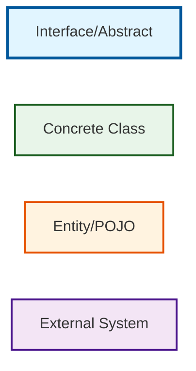

# LLD Foundation - Complete Beginner's Guide

## 🎯 Purpose

This comprehensive guide covers all fundamental concepts needed to master Low Level Design (LLD). Each topic is explained from scratch with multiple diagrams, real-world examples, and comparisons.

Perfect for:
- ✅ Complete beginners starting LLD
- ✅ Interview preparation
- ✅ Refreshing concepts
- ✅ Understanding design principles deeply

---

## 📚 Learning Path

### 🏗️ Phase 1: Core Programming Concepts

1. **[Object-Oriented Programming (OOP)](./01-oops-concepts.md)**
   - 4 Pillars: Encapsulation, Inheritance, Polymorphism, Abstraction
   - Classes vs Objects
   - Interfaces vs Abstract Classes
   - Multiple diagrams and examples

2. **[Relationships in OOP](./02-relationships.md)**
   - Association vs Aggregation vs Composition
   - Dependency
   - When to use which?
   - UML notation explained

3. **[SOLID Principles](./03-solid-principles.md)**
   - Single Responsibility Principle (SRP)
   - Open/Closed Principle (OCP)
   - Liskov Substitution Principle (LSP)
   - Interface Segregation Principle (ISP)
   - Dependency Inversion Principle (DIP)
   - Real-world examples for each

---

### 🎨 Phase 2: Design Patterns

4. **[Creational Patterns](./04-creational-patterns.md)**
   - Singleton Pattern
   - Factory Pattern
   - Abstract Factory Pattern
   - Builder Pattern
   - Prototype Pattern
   - When to use each

5. **[Structural Patterns](./05-structural-patterns.md)**
   - Adapter Pattern
   - Decorator Pattern
   - Facade Pattern
   - Proxy Pattern
   - Composite Pattern
   - Bridge Pattern

6. **[Behavioral Patterns](./06-behavioral-patterns.md)**
   - Observer Pattern
   - Strategy Pattern
   - Command Pattern
   - State Pattern
   - Template Method Pattern
   - Chain of Responsibility

---

### 🏛️ Phase 3: Architecture & Design

7. **[Layered Architecture](./07-layered-architecture.md)**
   - Presentation Layer
   - Business Logic Layer
   - Data Access Layer
   - Why layers matter

8. **[Dependency Injection](./08-dependency-injection.md)**
   - What is DI?
   - Constructor vs Setter vs Field Injection
   - Benefits and trade-offs
   - Spring Framework example

9. **[Repository Pattern](./09-repository-pattern.md)**
   - Abstraction over data access
   - Interface vs Implementation
   - Unit of Work pattern

10. **[UML Diagrams](./10-uml-diagrams.md)**
    - Class Diagrams
    - Sequence Diagrams
    - Use Case Diagrams
    - Component Diagrams
    - State Diagrams
    - How to read and draw them

---

### ⚡ Phase 4: Concurrency & Performance

11. **[Multithreading Basics](./11-multithreading.md)**
    - Threads vs Processes
    - Thread lifecycle
    - Synchronization
    - Thread safety
    - Common pitfalls

12. **[Locking Mechanisms](./12-locking-mechanisms.md)**
    - Optimistic Locking
    - Pessimistic Locking
    - Read-Write Locks
    - Deadlock prevention
    - When to use which

13. **[Database Transactions](./13-transactions.md)**
    - ACID properties
    - Isolation levels
    - Transaction management
    - Distributed transactions

---

### 🛠️ Phase 5: Best Practices

14. **[Exception Handling](./14-exception-handling.md)**
    - Checked vs Unchecked exceptions
    - Best practices
    - Custom exceptions
    - Error handling strategies

15. **[API Design](./15-api-design.md)**
    - RESTful principles
    - HTTP methods
    - Status codes
    - Versioning strategies
    - Best practices

16. **[Code Quality](./16-code-quality.md)**
    - Clean Code principles
    - Code smells
    - Refactoring techniques
    - Naming conventions

17. **[Testing Strategies](./17-testing-strategies.md)**
    - Unit Testing
    - Integration Testing
    - Mocking
    - Test-Driven Development (TDD)
    - Code coverage

---

## 🎓 How to Use This Guide

### For Complete Beginners
1. Start with **Phase 1** (OOP, Relationships, SOLID)
2. Move to **Phase 2** (Design Patterns)
3. Study **Phase 3** (Architecture)
4. Learn **Phase 4** (Concurrency)
5. Master **Phase 5** (Best Practices)

### For Interview Prep
Focus on:
- SOLID Principles (03)
- Common Design Patterns (04-06)
- Multithreading (11)
- Transactions & Locking (12-13)

### For Quick Reference
Each document has:
- 📊 Comparison tables
- 🎨 Multiple Mermaid diagrams
- 💡 Real-world examples
- ❌ Common mistakes
- ✅ Best practices

---

## 📊 Comparison Matrix

| Concept | When to Use | Complexity | Interview Importance |
|---------|-------------|------------|---------------------|
| SOLID Principles | Always | Medium | ⭐⭐⭐⭐⭐ |
| Singleton | Shared resource | Low | ⭐⭐⭐⭐ |
| Factory | Object creation | Medium | ⭐⭐⭐⭐⭐ |
| Observer | Event handling | Medium | ⭐⭐⭐⭐ |
| Strategy | Algorithm selection | Medium | ⭐⭐⭐⭐⭐ |
| Dependency Injection | Loose coupling | Medium | ⭐⭐⭐⭐ |
| Multithreading | Concurrency | High | ⭐⭐⭐⭐⭐ |
| Transactions | Data consistency | High | ⭐⭐⭐⭐ |
| Locking | Concurrent access | High | ⭐⭐⭐⭐⭐ |

---

## 🎯 Learning Objectives

After completing this guide, you will:

✅ Understand all core OOP concepts deeply
✅ Apply SOLID principles in code
✅ Choose the right design pattern
✅ Design layered architectures
✅ Handle concurrency correctly
✅ Write clean, maintainable code
✅ Excel in LLD interviews

---

## 📖 Document Structure

Each topic document contains:

1. **Introduction** - What is it?
2. **Why It Matters** - Real-world importance
3. **Detailed Explanation** - Step-by-step breakdown
4. **Diagrams** - Multiple Mermaid diagrams
5. **Code Examples** - Java implementations
6. **Comparisons** - vs similar concepts
7. **Common Mistakes** - What beginners do wrong
8. **Best Practices** - Industry standards
9. **Interview Questions** - Common questions
10. **Summary** - Key takeaways

---

## 🔗 Quick Links

### Most Important for Interviews
- [SOLID Principles](./03-solid-principles.md)
- [Factory Pattern](./04-creational-patterns.md#factory-pattern)
- [Observer Pattern](./06-behavioral-patterns.md#observer-pattern)
- [Multithreading](./11-multithreading.md)
- [Locking Mechanisms](./12-locking-mechanisms.md)

### Foundation Concepts
- [OOP Basics](./01-oops-concepts.md)
- [Relationships](./02-relationships.md)
- [UML Diagrams](./10-uml-diagrams.md)

### Advanced Topics
- [Transactions](./13-transactions.md)
- [API Design](./15-api-design.md)
- [Testing Strategies](./17-testing-strategies.md)

---

## 💡 Study Tips

### Daily Plan (2 hours/day)
- **Week 1**: Phase 1 (OOP, SOLID)
- **Week 2**: Phase 2 (Design Patterns)
- **Week 3**: Phase 3 (Architecture)
- **Week 4**: Phase 4 (Concurrency)
- **Week 5**: Phase 5 (Best Practices)
- **Week 6**: Review & Practice

### For Each Topic
1. Read the concept (30 min)
2. Study diagrams (15 min)
3. Code examples (30 min)
4. Practice problems (45 min)

---

## 🎨 Diagram Legend

Throughout this guide, we use consistent color coding:

- 🔵 Blue = Interfaces/Abstractions
- 🟢 Green = Implementations/Concrete Classes
- 🟠 Orange = Entities/Data Objects
- 🟣 Purple = External Systems/Services

---

## 📚 Additional Resources

### Books
- "Head First Design Patterns" - Best for beginners
- "Clean Code" by Robert C. Martin
- "Effective Java" by Joshua Bloch
- "Design Patterns" by Gang of Four

### Online Resources
- Refactoring Guru (Design Patterns)
- Oracle Java Tutorials
- Baeldung (Java & Spring)

---

## 🤝 How to Practice

### After Each Topic
1. ✅ Implement the concept in code
2. ✅ Solve related LeetCode problems
3. ✅ Review interview questions
4. ✅ Teach it to someone (best way to learn!)

### Projects to Build
1. Task Management System (our example!)
2. Library Management System
3. Parking Lot System
4. Elevator System
5. Hotel Booking System

---

## 🎯 Success Metrics

You'll know you've mastered LLD when you can:

✅ Explain any concept to a 5-year-old
✅ Draw diagrams from memory
✅ Choose the right pattern instantly
✅ Debug multithreading issues
✅ Design a system in 45 minutes
✅ Ace LLD interviews

---

## 🚀 Let's Begin!

Start with: [01 - Object-Oriented Programming](./01-oops-concepts.md)

---

**Remember**: Understanding > Memorization. Focus on WHY, not just WHAT.

**Good luck on your LLD journey!** 🎓
