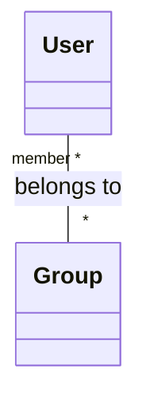
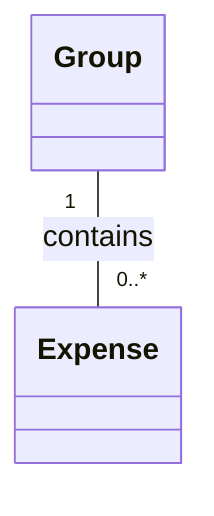
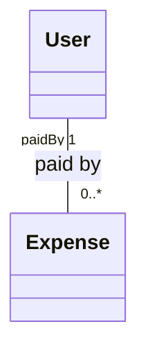
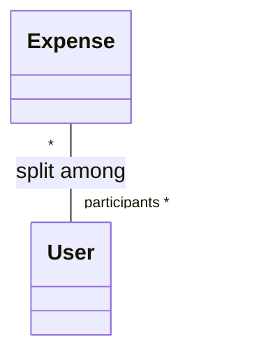
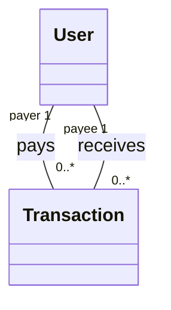

# 🔗 STEP 2: Add Basic Relationships

## 🎯 What Did We Add?

We added **7 relationships** (connections) between entities:
1. User ↔ Group (Many-to-Many)
2. Group → Expense (One-to-Many)
3. User → Expense (One-to-Many, as payer)
4. Expense ↔ User (Many-to-Many, as participants)
5. User → Transaction (One-to-Many, as payer)
6. User → Transaction (One-to-Many, as payee)

---

## 🤔 Why Add Relationships?

### In Step 1:
- We had **isolated boxes** (entities)
- Like having people but no connections

### In Step 2:
- We **connect the boxes** with relationships
- Shows how entities interact with each other

**Analogy**: Think of entities as **people** and relationships as **friendships**
- Alice (entity) is friends with Bob (relationship)
- A group (entity) contains members (relationship)

---

## 📚 Understanding Relationships

### Relationship Types (Cardinality)

#### 1. **One-to-One** (1:1)
**Meaning**: One A relates to exactly one B

**Example** (Not in our system, but for understanding):
```
Person (1) -- (1) Passport
```
- One person has exactly one passport
- One passport belongs to exactly one person

**Notation**: `1 -- 1`

---

#### 2. **One-to-Many** (1:*)
**Meaning**: One A relates to many Bs, but each B relates to only one A

**Example in our system**:
```
Group (1) -- (0..*) Expense
```
- One group has many expenses (0 to infinite)
- Each expense belongs to exactly one group

**Real-world analogy**: One parent has many children, but each child has one biological mother

**Notation**: `1 -- 0..*`
- `0..*` means "zero or more" (a group can have no expenses initially)
- `1..*` would mean "one or more" (at least one expense required)

---

#### 3. **Many-to-Many** (M:N)
**Meaning**: Many As relate to many Bs

**Example in our system**:
```
User (*) -- (*) Group
```
- One user can be in many groups
- One group can have many users

**Real-world analogy**: Students and Courses
- One student enrolls in many courses
- One course has many students

**Notation**: `* -- *`

---

## 🔍 Detailed Relationship Analysis

### Relationship 1: User ↔ Group (Many-to-Many)



**In Plain English**:
- One User can be in multiple Groups
- One Group can have multiple Users

**Why Many-to-Many?**
- Alice can be in "Goa Trip", "Office Lunch", "Roommates"
- "Goa Trip" has Alice, Bob, Charlie as members

**Database Implementation** (Future):
- Needs a **join table**: `user_groups`
- Stores pairs: (userId, groupId)

**Example Data**:
| User | Group |
|------|-------|
| Alice | Goa Trip |
| Alice | Office Lunch |
| Bob | Goa Trip |
| Charlie | Goa Trip |

---

### Relationship 2: Group → Expense (One-to-Many)



**In Plain English**:
- One Group has many Expenses (or none initially)
- Each Expense belongs to exactly one Group

**Why One-to-Many?**
- "Goa Trip" has: Hotel (₹6000), Dinner (₹3000), Taxi (₹500)
- Each expense is in only one group (can't be in two groups)

**Why `0..*` not `1..*`?**
- A newly created group has 0 expenses initially
- `0..*` allows empty groups

**Example**:
```
Group: "Goa Trip"
  ├─ Expense 1: Hotel ₹6000
  ├─ Expense 2: Dinner ₹3000
  └─ Expense 3: Taxi ₹500
```

---

### Relationship 3: User → Expense (One-to-Many, as payer)



**In Plain English**:
- Each Expense is paid by exactly one User
- One User can pay for many Expenses

**Why One-to-Many?**
- Alice paid: Hotel ₹6000, Dinner ₹3000
- Hotel ₹6000 was paid by Alice (only one payer)

**Real-world**: Alice uses her credit card to pay for dinner (she's the payer)

**Design Decision**:
- We don't support "split payment" (two people paying for same expense)
- Simplification for MVP (can add later)
- If two people pay, create two separate expenses

**Example**:
```
Alice (Payer)
  ├─ Paid Expense 1: Hotel ₹6000
  ├─ Paid Expense 2: Dinner ₹3000
  └─ Paid Expense 3: Taxi ₹500

Bob (Payer)
  └─ Paid Expense 4: Breakfast ₹600
```

---

### Relationship 4: Expense ↔ User (Many-to-Many, as participants)



**In Plain English**:
- One Expense is split among many Users (participants)
- One User participates in many Expenses

**Why Many-to-Many?**
- Dinner ₹3000 is split among Alice, Bob, Charlie (3 participants)
- Alice participates in: Hotel, Dinner, Taxi expenses

**Why Different from Relationship 3?**
- Relationship 3: Who **paid** (1 person)
- Relationship 4: Who **owes** (multiple people)

**Example**:
```
Expense: "Dinner ₹3000"
  - Paid by: Alice
  - Split among: Alice, Bob, Charlie

Result:
  - Alice paid ₹3000
  - Alice owes ₹1000 (her share)
  - Bob owes ₹1000
  - Charlie owes ₹1000
  - Net: Bob owes Alice ₹1000, Charlie owes Alice ₹1000
```

**Why Both Relationships Needed?**
- Need to know: Who paid? (Relationship 3)
- Need to know: Who should pay their share? (Relationship 4)

---

### Relationship 5 & 6: User → Transaction (Two One-to-Many)



**In Plain English**:
- Each Transaction has one Payer (who gives money)
- Each Transaction has one Payee (who receives money)
- One User can be payer in many Transactions
- One User can be payee in many Transactions

**Why Two Relationships?**
- Transaction connects two users: A → B
- Need to track both roles separately

**Example**:
```
Transaction: Bob → Alice ₹500
  - Payer: Bob (sends money)
  - Payee: Alice (receives money)

From Bob's perspective:
  - Bob is payer in: [Bob → Alice ₹500, Bob → Charlie ₹300]

From Alice's perspective:
  - Alice is payee in: [Bob → Alice ₹500, Charlie → Alice ₹700]
```

**Database Implementation**:
```sql
transactions (
  id,
  payer_id,   -- User who pays
  payee_id,   -- User who receives
  amount
)
```

---

## 🔄 What Changed from Previous Step?

### Step 1:
- ✅ Had 4 isolated entities
- ❌ No connections between them
- ❌ Couldn't answer: "Which users are in a group?"

### Step 2:
- ✅ Added 7 relationships
- ✅ Entities are now connected
- ✅ Can answer: "Which users in a group?" (follow User-Group relationship)

**Visual Difference**:
```
Step 1:        Step 2:
[User]         [User] ←→ [Group]
[Group]           ↓         ↓
[Expense]      [Expense]
[Transaction]     ↓
                [Transaction]
```

---

## 📐 Design Decisions

### Decision 1: Group-Expense is One-to-Many (Not Many-to-Many)
**Why?**
- Simplifies design (each expense in one group)
- Avoids confusion (which group does expense belong to?)
- Real Splitwise also works this way

**Alternative**: Expense could be in multiple groups (e.g., shared expense between "Family" and "Friends")
**Trade-off**: More complexity, rarely needed

---

### Decision 2: Expense Has Single Payer
**Why?**
- Simplifies calculation (one person paid, others owe them)
- Handles 95% of real-world cases

**Alternative**: Multiple payers for same expense
**Trade-off**: More complex split calculation
**Solution for multiple payers**: Create separate expenses

---

### Decision 3: Transaction is Separate Entity (Not Part of Expense)
**Why?**
- Expense = Spending money (forward flow)
- Transaction = Paying back (reverse flow)
- Different lifecycles (expense created first, transaction later)

**Alternative**: Combine Expense and Transaction
**Trade-off**: Confusing (mixing spending with settlement)

---

## 🎓 How to Read UML Relationships

### Notation Guide:

```
Entity1 "role1 cardinality1" -- "cardinality2 role2" Entity2 : relationship name
```

**Example**:
```
User "paidBy 1" -- "0..*" Expense : paid by
```

**Reading**:
1. **Left to Right**: User paid by 1 Expense (doesn't make sense, ignore this direction)
2. **Right to Left**: Expense 0..* paid by 1 User
   - Zero or more expenses are paid by exactly one user ✅

**Tips**:
- Read in direction of arrow (if present)
- Read in direction that makes semantic sense
- "1" = exactly one
- "0..*" = zero or more
- "*" = many (same as 0..*)

---

## ❌ Common Mistakes & Solutions

### Mistake 1: Wrong Cardinality

**Wrong**:
```
Group (1) -- (1) Expense
```
This means: One group has exactly one expense (impossible!)

**Right**:
```
Group (1) -- (0..*) Expense
```
One group can have zero or more expenses ✅

**How to check**: Ask yourself:
- Can a group have 0 expenses? YES (newly created)
- Can a group have 2 expenses? YES
- Therefore: 0..* ✅

---

### Mistake 2: Forgetting Participants Relationship

**Wrong**: Only "User paid Expense" relationship

**Problem**: Can't track who owes money!
- Alice paid ₹3000
- But who should pay their share? Unknown!

**Right**: Add "Expense split among Users" relationship
- Now we know: Alice, Bob, Charlie owe their shares

---

### Mistake 3: Confusing Payer with Participants

**Wrong**: Treating payer as just another participant

**Problem**:
- Alice paid ₹3000
- Split among Alice, Bob, Charlie (₹1000 each)
- If Alice is just a participant, we lose info that SHE paid

**Right**: Separate relationships:
- paidBy: Alice (who paid)
- participants: Alice, Bob, Charlie (who owes)

---

### Mistake 4: Creating Unnecessary Many-to-Many

**Wrong**: Expense ↔ Group as Many-to-Many

**Justification**: "What if expense is shared between two groups?"

**Problem**: Creates complexity without clear benefit
- Which group's members are involved?
- How to calculate balances?

**Right**: One-to-Many (expense in one group)
- Simpler
- Handles 99% of cases
- Can add expense twice to different groups if needed

---

## 🎯 Whiteboard Tips

When drawing in interview:

1. ☐ Start with entities (from Step 1)
2. ☐ Draw relationships one by one
3. ☐ Add cardinality numbers (1, *, 0..*)
4. ☐ Add labels ("paid by", "split among")
5. ☐ Verbally explain each relationship

**Order to draw**:
1. User ↔ Group (most obvious)
2. Group → Expense (contains expenses)
3. User → Expense (who paid)
4. Expense ↔ User (who owes)
5. User ↔ Transaction (settlement)

**Time**: 5-7 minutes

**What to say**:
> "Now I'll connect these entities. Users can be in multiple groups, so that's many-to-many. Each group contains many expenses, so one-to-many. For each expense, we need to track who paid and who owes money, so I'll add two relationships to User..."

---

## 🏋️ Practice Exercise

**Question**: For the following relationship, determine cardinality:

1. **Author ↔ Book**
   - One author can write many books
   - One book can have multiple authors (co-authors)
   - Answer: __________

2. **Order ↔ Customer**
   - One customer can place many orders
   - One order belongs to one customer
   - Answer: __________

3. **Student ↔ Course**
   - One student enrolls in many courses
   - One course has many students
   - Answer: __________

**Solutions**:
<details>
<summary>Click to reveal</summary>

1. **Author (*) -- (*) Book** (Many-to-Many)
2. **Customer (1) -- (0..*) Order** (One-to-Many)
3. **Student (*) -- (*) Course** (Many-to-Many)

</details>

---

## ✅ Verification Checklist

Before moving to Step 3, verify:

- ☐ Can you explain why User-Group is Many-to-Many?
- ☐ Can you explain difference between "paid by" and "split among"?
- ☐ Can you identify all 7 relationships in the diagram?
- ☐ Can you determine if a relationship should be 1:1, 1:*, or *:*?

---

## 🎯 What's Next?

**Step 3**: Add attributes (data fields) and methods to each entity
- User: name, email, password
- Group: name, description, createdDate
- Expense: amount, description, date, splitType
- Transaction: amount, date, status

This will make our entities **concrete** and ready to implement!

---

**Key Takeaways**:
1. Relationships connect entities (no entity is isolated)
2. Cardinality shows "how many" (1, *, 0..*)
3. Same entities can have multiple relationships (User-Expense: payer + participants)
4. Choose cardinality based on real-world requirements
5. Keep it simple (avoid unnecessary Many-to-Many)

Ready for Step 3? Let's add attributes! 🚀
