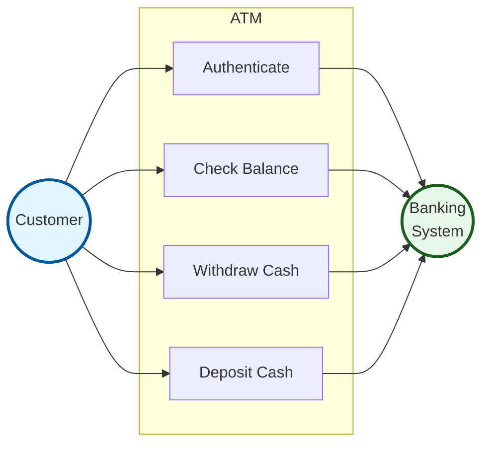

# ATM System - Use Case Diagram

> **For Beginners**: A Use Case Diagram shows:
> - **Actors**: Who uses the system (people, external systems)
> - **Use Cases**: What can they do (functionalities)
> - **Relationships**: How they interact

---

## 1. Actors in ATM System

### Primary Actors (Directly use the system)

1. **Customer/User** 👤
   - The person who uses the ATM for banking operations
   - Main actor who performs transactions

2. **Administrator** 👨‍💼
   - Bank employee or technician who maintains the ATM
   - Loads cash, configures settings, monitors status

### Secondary Actors (External systems)

3. **Banking System** 🏦
   - Backend core banking system
   - Validates accounts, processes transactions, maintains balances

4. **Card Issuer** 💳
   - System that validates card authenticity
   - Checks if card is valid, not expired, not stolen

---

## 2. Use Case Diagram (Mermaid)

```mermaid
graph TB
    subgraph "ATM System"
        %% Use Cases
        UC1[Insert Card]
        UC2[Enter PIN]
        UC3[Authenticate User]
        UC4[Check Balance]
        UC5[Withdraw Cash]
        UC6[Deposit Cash]
        UC7[Print Receipt]
        UC8[Eject Card]
        UC9[Display Menu]
        UC10[Cancel Transaction]

        %% Admin Use Cases
        UC11[Load Cash]
        UC12[View ATM Status]
        UC13[Configure Settings]
        UC14[View Transaction Log]

        %% Internal Use Cases
        UC15[Validate Card]
        UC16[Validate PIN]
        UC17[Check Account Balance]
        UC18[Deduct Amount]
        UC19[Credit Amount]
        UC20[Dispense Cash]
        UC21[Accept Cash]
        UC22[Update Cash Inventory]
        UC23[Log Transaction]
    end

    %% Actors
    Customer((Customer))
    Admin((Administrator))
    BankingSystem((Banking System))
    CardIssuer((Card Issuer))

    %% Customer Use Cases
    Customer -->|initiates| UC1
    Customer -->|provides| UC2
    Customer -->|selects| UC4
    Customer -->|requests| UC5
    Customer -->|initiates| UC6
    Customer -->|receives| UC7
    Customer -->|can trigger| UC10

    %% Admin Use Cases
    Admin -->|performs| UC11
    Admin -->|monitors| UC12
    Admin -->|modifies| UC13
    Admin -->|audits| UC14

    %% Use Case Dependencies (includes)
    UC1 -.->|includes| UC15
    UC2 -.->|includes| UC16
    UC3 -.->|includes| UC15
    UC3 -.->|includes| UC16
    UC4 -.->|includes| UC17
    UC5 -.->|includes| UC17
    UC5 -.->|includes| UC18
    UC5 -.->|includes| UC20
    UC5 -.->|includes| UC22
    UC5 -.->|includes| UC23
    UC6 -.->|includes| UC21
    UC6 -.->|includes| UC19
    UC6 -.->|includes| UC22
    UC6 -.->|includes| UC23

    %% External System Interactions
    UC15 -->|validates with| CardIssuer
    UC16 -->|verifies with| BankingSystem
    UC17 -->|fetches from| BankingSystem
    UC18 -->|updates in| BankingSystem
    UC19 -->|updates in| BankingSystem
    UC23 -->|records in| BankingSystem

    style Customer fill:#e1f5ff,stroke:#01579b,stroke-width:3px
    style Admin fill:#fff3e0,stroke:#e65100,stroke-width:3px
    style BankingSystem fill:#e8f5e9,stroke:#1b5e20,stroke-width:3px
    style CardIssuer fill:#f3e5f5,stroke:#4a148c,stroke-width:3px
```

---

## 3. Detailed Use Case Descriptions

### 3.1 Customer Use Cases

#### UC-1: Insert Card
- **Actor**: Customer
- **Precondition**: ATM is in idle state
- **Main Flow**:
  1. Customer inserts ATM card into card reader
  2. System reads card data (card number, expiry, etc.)
  3. System validates card with Card Issuer
  4. If valid, system prompts for PIN
- **Postcondition**: Card is accepted, waiting for PIN
- **Exceptions**:
  - Invalid card → Eject card, show error
  - Expired card → Eject card, show error
  - Stolen/blocked card → Retain card, notify bank

#### UC-2: Enter PIN
- **Actor**: Customer
- **Precondition**: Card is inserted and validated
- **Main Flow**:
  1. System displays keypad for PIN entry
  2. Customer enters 4-digit PIN
  3. System masks PIN on screen (****)
  4. System validates PIN with Banking System
  5. If correct, system shows main menu
- **Postcondition**: User authenticated, ready for transaction
- **Exceptions**:
  - Wrong PIN (attempt 1-2) → Allow retry
  - Wrong PIN (attempt 3) → Block card, eject, notify bank

#### UC-3: Authenticate User
- **Actor**: System (internal)
- **Includes**: Validate Card + Validate PIN
- **Description**: Combined card and PIN validation
- **Success**: User authenticated
- **Failure**: Authentication failed, session terminated

#### UC-4: Check Balance
- **Actor**: Customer
- **Precondition**: User authenticated
- **Main Flow**:
  1. Customer selects "Balance Inquiry" from menu
  2. System fetches balance from Banking System
  3. System displays available balance and total balance
  4. System asks "Print receipt?"
  5. Customer chooses Yes/No
  6. If Yes, print receipt with balance
- **Postcondition**: Balance displayed, session continues
- **Exceptions**:
  - Banking system down → Show error, retry option

#### UC-5: Withdraw Cash
- **Actor**: Customer
- **Precondition**: User authenticated
- **Main Flow**:
  1. Customer selects "Cash Withdrawal" from menu
  2. System displays amount options (₹500, ₹1000, ₹2000, Other)
  3. Customer selects amount (e.g., ₹2000)
  4. System validates:
     - Sufficient account balance
     - Within daily limit
     - Sufficient cash in ATM
  5. System deducts amount from account (Banking System)
  6. System dispenses cash from Cash Dispenser
  7. System prints receipt
  8. System ejects card
  9. System updates cash inventory
  10. System logs transaction
- **Postcondition**: Cash dispensed, balance deducted, card returned
- **Exceptions**:
  - Insufficient balance → Show error, return to menu
  - Insufficient cash in ATM → Show error, suggest lower amount
  - Cash dispense failure → Reverse transaction, notify admin

#### UC-6: Deposit Cash
- **Actor**: Customer
- **Precondition**: User authenticated
- **Main Flow**:
  1. Customer selects "Cash Deposit" from menu
  2. System opens cash deposit slot
  3. Customer inserts cash
  4. System counts and validates cash
  5. System displays counted amount, asks for confirmation
  6. Customer confirms
  7. System credits amount to account (Banking System)
  8. System prints receipt
  9. System ejects card
  10. System updates cash inventory
  11. System logs transaction
- **Postcondition**: Cash deposited, balance updated, card returned
- **Exceptions**:
  - Invalid/torn notes → Reject notes, return to customer
  - Customer cancels → Return cash, cancel operation
  - Credit failure → Hold cash in escrow, notify admin

#### UC-7: Print Receipt
- **Actor**: System
- **Precondition**: Transaction completed
- **Main Flow**:
  1. System formats receipt (transaction type, amount, balance, timestamp)
  2. System sends to receipt printer
  3. System dispenses printed receipt
- **Exceptions**:
  - Printer out of paper → Log error, continue operation

#### UC-8: Eject Card
- **Actor**: System
- **Precondition**: Transaction completed or session timeout
- **Main Flow**:
  1. System displays "Please take your card"
  2. System ejects card from card reader
  3. Wait 30 seconds for customer to take card
  4. If card not taken, system retains card for security
- **Postcondition**: Card returned to customer or retained

#### UC-9: Display Menu
- **Actor**: System
- **Precondition**: User authenticated
- **Main Flow**:
  1. System displays menu options:
     - Balance Inquiry
     - Cash Withdrawal
     - Cash Deposit
     - Exit
  2. Customer selects option using keypad
  3. System routes to selected use case
- **Postcondition**: User navigated to selected function

#### UC-10: Cancel Transaction
- **Actor**: Customer
- **Precondition**: Transaction in progress
- **Main Flow**:
  1. Customer presses "Cancel" button
  2. System aborts current operation
  3. If cash/balance already affected, system reverses
  4. System returns to main menu or ejects card
- **Postcondition**: Transaction cancelled, state reset

---

### 3.2 Administrator Use Cases

#### UC-11: Load Cash
- **Actor**: Administrator
- **Precondition**: Admin authenticated
- **Main Flow**:
  1. Admin opens ATM with physical key/access card
  2. Admin enters admin mode in software
  3. Admin loads cash cassettes with notes
  4. Admin enters denomination counts in system
  5. System updates cash inventory
  6. System logs cash loading event
- **Postcondition**: ATM cash inventory updated

#### UC-12: View ATM Status
- **Actor**: Administrator
- **Main Flow**:
  1. Admin accesses admin dashboard
  2. System displays:
     - Cash levels by denomination
     - Transaction count (today, week, month)
     - Error logs
     - Hardware status (printer, card reader, dispenser)
  3. Admin reviews status
- **Postcondition**: Admin informed of ATM health

#### UC-13: Configure Settings
- **Actor**: Administrator
- **Main Flow**:
  1. Admin accesses configuration panel
  2. Admin modifies settings:
     - Transaction limits
     - Timeout durations
     - Denomination preferences
     - Alert thresholds
  3. System validates and saves settings
  4. System logs configuration change
- **Postcondition**: ATM reconfigured

#### UC-14: View Transaction Log
- **Actor**: Administrator
- **Main Flow**:
  1. Admin accesses transaction log
  2. Admin filters by date, type, status
  3. System displays transactions with details
  4. Admin can export for audit
- **Postcondition**: Audit trail reviewed

---

## 4. Use Case Relationships

> **Beginner Explanation**:
> - **Include** (solid arrow): Use case ALWAYS uses another use case (e.g., Withdraw ALWAYS includes Check Balance)
> - **Extend** (dashed arrow): Use case OPTIONALLY adds behavior (e.g., Print Receipt extends Withdraw)
> - **Generalization**: Use case is a specialized version of another

### Include Relationships
- `Withdraw Cash` **includes** `Check Balance`
- `Withdraw Cash` **includes** `Deduct Amount`
- `Withdraw Cash` **includes** `Dispense Cash`
- `Deposit Cash` **includes** `Credit Amount`
- `Authenticate User` **includes** `Validate Card` + `Validate PIN`

### Extend Relationships
- `Print Receipt` **extends** `Withdraw Cash` (optional)
- `Print Receipt` **extends** `Deposit Cash` (optional)
- `Print Receipt` **extends** `Check Balance` (optional)

---

## 5. Simplified Use Case Diagram for Interview Whiteboard

> **Pro Tip**: When drawing on whiteboard, keep it simple!

---

## 6. Key Takeaways for Beginners

### What to Remember:
1. **Actors**: External entities that interact with system (people, systems)
2. **Use Cases**: Functional requirements written as user goals
3. **Primary Flow**: The happy path (everything works)
4. **Exceptions**: What can go wrong and how to handle

### Common Mistakes:
❌ **Mistake 1**: Including system internal logic as use cases
   - Wrong: "Validate Database Connection"
   - Right: "Authenticate User" (user-facing)

❌ **Mistake 2**: Too many include/extend relationships
   - Keep it simple, show only important dependencies

❌ **Mistake 3**: Missing actors
   - Don't forget external systems (Banking System, Card Issuer)

✅ **Best Practice**: Start with 4-5 main use cases, then add details

---

## 7. Interview Questions on Use Cases

**Q1: What's the difference between include and extend?**
- **Include**: Mandatory dependency (always happens)
- **Extend**: Optional behavior (sometimes happens)

**Q2: Why is Banking System an actor?**
- Because it's an external entity that interacts with our ATM system

**Q3: How do you handle failed transactions?**
- Include exception flows in use case (e.g., reverse transaction, log error, notify user)

---

**Next**: We'll start designing the class diagram step-by-step! 🎨

---

## Navigation
- [← Previous: Requirements](01_requirements.md)
- [→ Next: Step 1 - Core Entities](03_step1_class_diagram.md)
