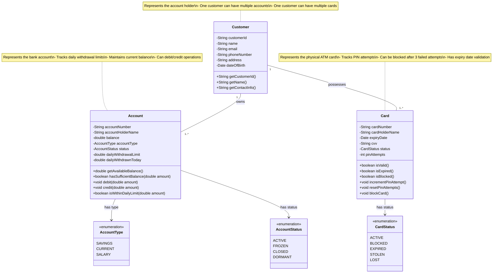

# Step 1: Core Domain Entities - Card, Account, User

> **Beginner's Approach**: Start with the NOUNS from requirements. What are the main "things" in our system?
> - Card (ATM card)
> - Account (Bank account)
> - User/Customer (Person who owns the account)

---

## WHERE TO START? 🎯

### Why Start Here?
When designing ATM system, think about the **physical items** a customer brings:
1. **ATM Card** - The physical card they insert
2. **Bank Account** - Their money storage
3. **User/Customer** - The person who owns the card

These are the **core domain entities** - they exist in the real world and are central to our business logic.

### What Should Be Added?
We'll add three basic classes:
- `Card` - Represents the ATM card
- `Account` - Represents the bank account
- `Customer` - Represents the account holder

---

## Step 1: Class Diagram (Mermaid)



---

## Design Decisions 📋

### 1. Why Separate Card and Account?
**Beginner Question**: "Why not combine Card and Account into one class?"

**Answer**: **Single Responsibility Principle (SOLID)**
- `Card` is responsible for card-related operations (validation, PIN attempts, expiry)
- `Account` is responsible for account-related operations (balance, transactions)
- One card can be linked to multiple accounts (future extensibility)
- One account can have multiple cards (primary, secondary)

**Real-world example**:
```java
// Wrong approach - violates Single Responsibility
class CardAccount {
    private String cardNumber;
    private String accountNumber;
    private double balance;
    private Date expiryDate;
    // Too many responsibilities!
}

// Right approach - separate concerns
class Card {
    private String cardNumber;
    private Date expiryDate;
}

class Account {
    private String accountNumber;
    private double balance;
}
```

### 2. Why Use Enums for Status?
**Beginner Question**: "Why not use String for status like `status = "ACTIVE"`?"

**Answer**: **Type Safety and Compile-time Checking**
```java
// Wrong - prone to typos and runtime errors
String status = "ACTIV"; // Typo! Will fail at runtime

// Right - compiler catches errors
CardStatus status = CardStatus.ACTIVE; // Type-safe
```

**Benefits**:
- ✅ No typos (compiler checks)
- ✅ IDE autocomplete
- ✅ Limited valid values (can't set invalid status)
- ✅ Easy to add new statuses

### 3. Why Track `pinAttempts` in Card?
**Answer**: Security feature
- After 3 failed PIN attempts, block the card
- Prevents brute-force attacks
- `incrementPinAttempt()` is called on failed PIN
- `resetPinAttempts()` is called on successful login

### 4. Why Track `dailyWithdrawnToday` in Account?
**Answer**: Enforce daily withdrawal limits
- RBI (Reserve Bank of India) mandates daily limits (e.g., ₹50,000)
- `dailyWithdrawnToday` resets at midnight
- Before withdrawal, check: `currentWithdrawal + dailyWithdrawnToday <= dailyLimit`

---

## What Was Added? 🆕

### Entities Added:
1. **Card** - ATM card with validation logic
2. **Account** - Bank account with balance management
3. **Customer** - Account holder information

### Enums Added:
1. **CardStatus** - States of a card (ACTIVE, BLOCKED, etc.)
2. **AccountType** - Type of bank account (SAVINGS, CURRENT, etc.)
3. **AccountStatus** - States of an account (ACTIVE, FROZEN, etc.)

### Relationships:
1. **Customer owns Account** (1 to many)
   - One customer can have multiple accounts (savings + current)
2. **Customer possesses Card** (1 to many)
   - One customer can have multiple cards (different banks, primary/secondary)

---

## Java Code Skeleton (Beginner-Friendly)

### Card.java
```java
import java.util.Date;

/**
 * Represents an ATM Card
 *
 * Responsibilities:
 * - Store card details (number, expiry, CVV)
 * - Track PIN attempts for security
 * - Validate card status (active, expired, blocked)
 *
 * SOLID Principle: Single Responsibility - Only handles card-related logic
 */
public class Card {
    // Private fields - encapsulation
    private String cardNumber;         // 16-digit card number
    private String cardHolderName;     // Name embossed on card
    private Date expiryDate;           // Card expiry date (MM/YY)
    private String cvv;                // 3-digit security code (not used in ATM, but stored)
    private CardStatus status;         // Current status of card
    private int pinAttempts;           // Track failed PIN attempts
    private static final int MAX_PIN_ATTEMPTS = 3;  // Constant for max attempts

    // Constructor
    public Card(String cardNumber, String cardHolderName, Date expiryDate, String cvv) {
        this.cardNumber = cardNumber;
        this.cardHolderName = cardHolderName;
        this.expiryDate = expiryDate;
        this.cvv = cvv;
        this.status = CardStatus.ACTIVE;  // New cards are active by default
        this.pinAttempts = 0;
    }

    /**
     * Check if card is valid (not blocked, not expired, not stolen)
     *
     * @return true if card is valid and can be used
     */
    public boolean isValid() {
        return status == CardStatus.ACTIVE && !isExpired();
    }

    /**
     * Check if card is expired
     *
     * @return true if current date > expiry date
     */
    public boolean isExpired() {
        Date today = new Date();
        return today.after(expiryDate);
    }

    /**
     * Check if card is blocked
     *
     * @return true if card status is BLOCKED
     */
    public boolean isBlocked() {
        return status == CardStatus.BLOCKED;
    }

    /**
     * Increment PIN attempt counter
     * Called when user enters wrong PIN
     * Blocks card if attempts exceed MAX_PIN_ATTEMPTS
     */
    public void incrementPinAttempt() {
        pinAttempts++;
        if (pinAttempts >= MAX_PIN_ATTEMPTS) {
            blockCard();
        }
    }

    /**
     * Reset PIN attempts to 0
     * Called when user enters correct PIN
     */
    public void resetPinAttempts() {
        this.pinAttempts = 0;
    }

    /**
     * Block the card (set status to BLOCKED)
     * Called when PIN attempts exceed limit or admin blocks card
     */
    public void blockCard() {
        this.status = CardStatus.BLOCKED;
    }

    // Getters
    public String getCardNumber() { return cardNumber; }
    public String getCardHolderName() { return cardHolderName; }
    public CardStatus getStatus() { return status; }
    public int getPinAttempts() { return pinAttempts; }
}

/**
 * Enum representing possible card statuses
 *
 * Beginner Tip: Enums are type-safe constants
 * Use enums instead of Strings to avoid typos
 */
enum CardStatus {
    ACTIVE,    // Card is active and can be used
    BLOCKED,   // Card is blocked (too many PIN attempts or fraud)
    EXPIRED,   // Card has expired
    STOLEN,    // Card reported as stolen
    LOST       // Card reported as lost
}
```

### Account.java
```java
/**
 * Represents a Bank Account
 *
 * Responsibilities:
 * - Store account details (number, balance)
 * - Handle debit/credit operations
 * - Enforce daily withdrawal limits
 * - Validate sufficient balance
 *
 * SOLID Principle: Single Responsibility - Only handles account operations
 */
public class Account {
    private String accountNumber;          // Unique account number
    private String accountHolderName;      // Name of account holder
    private double balance;                // Current balance in account
    private AccountType accountType;       // SAVINGS, CURRENT, etc.
    private AccountStatus status;          // ACTIVE, FROZEN, etc.
    private double dailyWithdrawalLimit;   // Max withdrawal per day (e.g., ₹50,000)
    private double dailyWithdrawnToday;    // Amount withdrawn today

    // Constructor
    public Account(String accountNumber, String accountHolderName,
                   double initialBalance, AccountType accountType) {
        this.accountNumber = accountNumber;
        this.accountHolderName = accountHolderName;
        this.balance = initialBalance;
        this.accountType = accountType;
        this.status = AccountStatus.ACTIVE;
        this.dailyWithdrawalLimit = 50000.0;  // Default ₹50,000
        this.dailyWithdrawnToday = 0.0;
    }

    /**
     * Get available balance (current balance)
     *
     * @return current balance
     */
    public double getAvailableBalance() {
        return balance;
    }

    /**
     * Check if account has sufficient balance for withdrawal
     *
     * @param amount - amount to check
     * @return true if balance >= amount
     */
    public boolean hasSufficientBalance(double amount) {
        return balance >= amount;
    }

    /**
     * Deduct money from account (for withdrawal)
     *
     * @param amount - amount to deduct
     * @throws InsufficientBalanceException if balance < amount
     */
    public void debit(double amount) {
        if (!hasSufficientBalance(amount)) {
            throw new InsufficientBalanceException("Insufficient balance");
        }
        balance -= amount;
        dailyWithdrawnToday += amount;  // Track daily withdrawal
    }

    /**
     * Add money to account (for deposit)
     *
     * @param amount - amount to add
     */
    public void credit(double amount) {
        balance += amount;
    }

    /**
     * Check if withdrawal is within daily limit
     *
     * @param amount - amount to check
     * @return true if (dailyWithdrawnToday + amount) <= dailyWithdrawalLimit
     */
    public boolean isWithinDailyLimit(double amount) {
        return (dailyWithdrawnToday + amount) <= dailyWithdrawalLimit;
    }

    // Getters and Setters
    public String getAccountNumber() { return accountNumber; }
    public AccountStatus getStatus() { return status; }
    public void setDailyWithdrawalLimit(double limit) {
        this.dailyWithdrawalLimit = limit;
    }
}

enum AccountType {
    SAVINGS,   // Savings account
    CURRENT,   // Current account (for businesses)
    SALARY     // Salary account
}

enum AccountStatus {
    ACTIVE,    // Account is active
    FROZEN,    // Account is frozen (no transactions allowed)
    CLOSED,    // Account is closed
    DORMANT    // Account is inactive (no transactions for long time)
}
```

### Customer.java
```java
import java.util.Date;

/**
 * Represents a Bank Customer
 *
 * Responsibilities:
 * - Store customer personal information
 * - Provide customer details for display/audit
 *
 * SOLID Principle: Single Responsibility - Only stores customer info
 */
public class Customer {
    private String customerId;       // Unique customer ID
    private String name;             // Full name
    private String email;            // Email address
    private String phoneNumber;      // Contact number
    private String address;          // Residential address
    private Date dateOfBirth;        // DOB for age verification

    // Constructor
    public Customer(String customerId, String name, String email,
                    String phoneNumber, String address, Date dateOfBirth) {
        this.customerId = customerId;
        this.name = name;
        this.email = email;
        this.phoneNumber = phoneNumber;
        this.address = address;
        this.dateOfBirth = dateOfBirth;
    }

    // Getters
    public String getCustomerId() { return customerId; }
    public String getName() { return name; }

    /**
     * Get contact information (email + phone)
     * Useful for notifications
     */
    public String getContactInfo() {
        return "Email: " + email + ", Phone: " + phoneNumber;
    }
}
```

---

## Common Beginner Mistakes ❌ → ✅

### Mistake 1: Not Using Encapsulation
```java
// ❌ Wrong - public fields, anyone can modify
class Card {
    public String cardNumber;  // Can be changed by anyone!
    public int pinAttempts;    // Can be manipulated!
}

// ✅ Right - private fields, controlled access
class Card {
    private String cardNumber;
    private int pinAttempts;

    public void incrementPinAttempt() {
        // Controlled increment with business logic
        pinAttempts++;
        if (pinAttempts >= 3) {
            blockCard();
        }
    }
}
```

### Mistake 2: Not Validating in Methods
```java
// ❌ Wrong - no validation
public void debit(double amount) {
    balance -= amount;  // What if balance < amount?
}

// ✅ Right - validate before operation
public void debit(double amount) {
    if (!hasSufficientBalance(amount)) {
        throw new InsufficientBalanceException("Insufficient balance");
    }
    balance -= amount;
}
```

### Mistake 3: Using Magic Numbers
```java
// ❌ Wrong - what does 3 mean?
if (pinAttempts >= 3) {
    blockCard();
}

// ✅ Right - use named constant
private static final int MAX_PIN_ATTEMPTS = 3;
if (pinAttempts >= MAX_PIN_ATTEMPTS) {
    blockCard();
}
```

---

## Interview Tips 💡

**Q: Why not store PIN in the Card class?**
**A**: Security! PIN should NEVER be stored in the application. It's stored encrypted in the Banking System backend. We only send the PIN for validation, never store it.

**Q: How do you reset `dailyWithdrawnToday` at midnight?**
**A**: Use a scheduled job (cron job) or check the date in the `debit()` method:
```java
public void debit(double amount) {
    resetDailyLimitIfNewDay();  // Check if new day, reset if yes
    // ... rest of logic
}
```

**Q: What if two ATMs try to debit the same account simultaneously?**
**A**: We'll handle this in the Service Layer with database transactions and locking (covered in later steps).

---

## Next Step Preview 🔮

In **Step 2**, we'll add:
- `Transaction` entity (to record all transactions)
- `TransactionType` enum (WITHDRAWAL, DEPOSIT, BALANCE_INQUIRY)
- `TransactionStatus` enum (SUCCESS, FAILED, PENDING)
- Relationship between Account and Transaction (1 to many)

---

## Navigation
- [← Previous: Use Case Diagram](02_usecase_diagram.md)
- [→ Next: Step 2 - Transaction Entity](04_step2_class_diagram.md)
