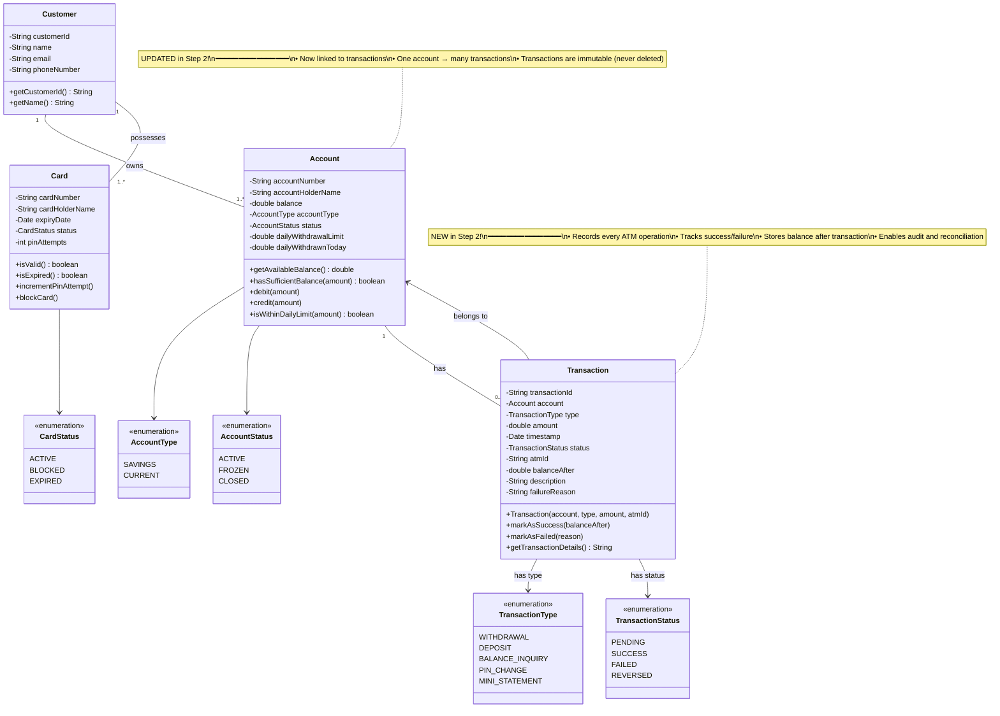

# Step 2: Adding Transaction Entity

> **What We're Adding**: Transaction recording and tracking
> **Why**: Every ATM operation (withdrawal, deposit, balance inquiry) must be logged for audit and tracking

---

## WHAT YOU ADDED IN THIS STEP? 🆕

### New Classes:
1. **Transaction** - Records every ATM operation
2. **TransactionType** (enum) - Type of transaction (WITHDRAWAL, DEPOSIT, etc.)
3. **TransactionStatus** (enum) - Success/Failure status

### New Relationships:
- **Account** → **Transaction** (1 to many)
  - One account can have many transactions

---

## WHY YOU ADDED THIS? 🤔

### Real-World Scenario:
When you withdraw ₹2000 from an ATM:
- Account balance decreases by ₹2000 ✅
- But how do you know WHEN, WHERE, and HOW MUCH was withdrawn? 🤷‍♂️
- **Solution**: Create a Transaction record!

### Benefits of Transaction Entity:
1. **Audit Trail** - Track all operations for compliance
2. **Dispute Resolution** - Customer says "I didn't withdraw", check transaction log
3. **Analytics** - How much cash is being withdrawn per day?
4. **Reconciliation** - Match ATM cash dispensed with transactions

---

## Step 2: Class Diagram (Building on Step 1)



---

## WHAT IS THE CHANGE FROM PREVIOUS STEP? 🔄

### Previous Step (Step 1):
- Had **Card**, **Account**, **Customer**
- Could store account balance
- ❌ But NO way to track transaction history

### Current Step (Step 2):
- ✅ Added **Transaction** entity
- ✅ Every operation creates a transaction record
- ✅ Can track WHAT, WHEN, HOW MUCH for audit

### Visual Comparison:

**Step 1 (Before)**:
```
Customer → Account → balance = ₹10,000
                      (decreases to ₹8,000 after withdrawal)
                      ❌ But we don't know WHEN or HOW it changed!
```

**Step 2 (After)**:
```
Customer → Account → balance = ₹10,000
             ↓
          Transaction 1: WITHDRAWAL, ₹2,000, 2025-11-17 10:30 AM, SUCCESS
             ↓
          balance = ₹8,000
          ✅ We know exactly what happened!
```

---

## Design Decisions 📋

### 1. Why Store `balanceAfter` in Transaction?

**Beginner Question**: "We already have `amount`. Why store `balanceAfter`?"

**Answer**: For **reconciliation and dispute resolution**

**Scenario**:
```
Customer: "My balance was ₹10,000. I withdrew ₹2,000. But now balance shows ₹7,000. Where did ₹1,000 go?"

Without balanceAfter:
❌ We only know: Withdrawal of ₹2,000 happened
❌ Can't verify if balance was correct at that moment

With balanceAfter:
✅ Transaction shows: amount = ₹2,000, balanceAfter = ₹8,000
✅ We can prove balance was correctly updated
✅ Missing ₹1,000 must be from another transaction
```

### 2. Why Have Both `PENDING` and `SUCCESS` Status?

**Answer**: Transactions happen in steps:

```
1. Create Transaction → status = PENDING
2. Deduct from account → still PENDING
3. Dispense cash → still PENDING
4. Cash dispensed successfully → status = SUCCESS

If cash dispense fails at step 4:
→ Reverse account deduction
→ status = FAILED or REVERSED
```

### 3. Why Store `atmId`?

**Answer**: One account can be accessed from multiple ATMs

**Use Cases**:
- Track which ATM has high usage (analytics)
- If ATM dispenses wrong cash, we know which ATM to check
- Customer says "ATM didn't give cash but amount deducted" → we know which ATM

### 4. Why Is Transaction Immutable?

**Important**: Transactions are **NEVER deleted or modified** after creation

**Why?**
- **Audit Compliance**: Banks need complete transaction history
- **Regulatory Requirement**: RBI mandates keeping records for 10 years
- **Dispute Resolution**: Need original record to investigate

**Implementation**:
```java
public class Transaction {
    private final String transactionId;  // final = can't be changed
    private final Date timestamp;        // final = can't be changed
    // ... other fields
}
```

---

## Java Code Skeleton

### Transaction.java

```java
import java.util.Date;
import java.util.UUID;

/**
 * Represents a single ATM transaction
 *
 * Responsibilities:
 * - Record transaction details (type, amount, timestamp)
 * - Track transaction status (pending, success, failed)
 * - Store balance snapshot after transaction
 * - Provide audit trail
 *
 * IMPORTANT: Transactions are IMMUTABLE once created (for audit compliance)
 *
 * SOLID Principle: Single Responsibility - Only manages transaction data
 */
public class Transaction {
    // Immutable fields (final = can't be changed after creation)
    private final String transactionId;        // Unique ID (UUID)
    private final Account account;             // Associated account
    private final TransactionType type;        // WITHDRAWAL, DEPOSIT, etc.
    private final double amount;               // Transaction amount
    private final Date timestamp;              // When transaction occurred
    private final String atmId;                // Which ATM processed this

    // Mutable fields (can change as transaction progresses)
    private TransactionStatus status;          // PENDING → SUCCESS/FAILED
    private double balanceAfter;               // Balance after transaction
    private String description;                // Human-readable description
    private String failureReason;              // Why it failed (if status = FAILED)

    /**
     * Constructor - Creates a new transaction in PENDING status
     *
     * @param account - Account involved in transaction
     * @param type - Type of transaction
     * @param amount - Amount involved
     * @param atmId - ATM ID where transaction happened
     */
    public Transaction(Account account, TransactionType type, double amount, String atmId) {
        this.transactionId = UUID.randomUUID().toString();  // Generate unique ID
        this.account = account;
        this.type = type;
        this.amount = amount;
        this.atmId = atmId;
        this.timestamp = new Date();  // Current timestamp
        this.status = TransactionStatus.PENDING;  // Start as PENDING
        this.description = generateDescription();
    }

    /**
     * Mark transaction as successful
     * Called when operation completes successfully
     *
     * @param balanceAfter - Account balance after transaction
     */
    public void markAsSuccess(double balanceAfter) {
        this.status = TransactionStatus.SUCCESS;
        this.balanceAfter = balanceAfter;
    }

    /**
     * Mark transaction as failed
     * Called when operation fails
     *
     * @param reason - Why the transaction failed
     */
    public void markAsFailed(String reason) {
        this.status = TransactionStatus.FAILED;
        this.failureReason = reason;
    }

    /**
     * Generate human-readable description
     *
     * @return description string
     */
    private String generateDescription() {
        switch (type) {
            case WITHDRAWAL:
                return "Cash withdrawal of ₹" + amount;
            case DEPOSIT:
                return "Cash deposit of ₹" + amount;
            case BALANCE_INQUIRY:
                return "Balance inquiry";
            default:
                return "ATM transaction";
        }
    }

    /**
     * Get formatted transaction details for receipt/display
     *
     * @return formatted string with transaction details
     */
    public String getTransactionDetails() {
        StringBuilder details = new StringBuilder();
        details.append("Transaction ID: ").append(transactionId).append("\n");
        details.append("Type: ").append(type).append("\n");
        details.append("Amount: ₹").append(amount).append("\n");
        details.append("Date/Time: ").append(timestamp).append("\n");
        details.append("ATM ID: ").append(atmId).append("\n");
        details.append("Status: ").append(status).append("\n");

        if (status == TransactionStatus.SUCCESS) {
            details.append("Balance After: ₹").append(balanceAfter).append("\n");
        } else if (status == TransactionStatus.FAILED) {
            details.append("Failure Reason: ").append(failureReason).append("\n");
        }

        return details.toString();
    }

    // Getters (no setters for immutable fields!)
    public String getTransactionId() { return transactionId; }
    public TransactionType getType() { return type; }
    public double getAmount() { return amount; }
    public Date getTimestamp() { return timestamp; }
    public TransactionStatus getStatus() { return status; }
    public String getAtmId() { return atmId; }
    public double getBalanceAfter() { return balanceAfter; }
}

/**
 * Enum for transaction types
 *
 * Beginner Tip: Add new transaction types here as features expand
 */
enum TransactionType {
    WITHDRAWAL,        // Cash withdrawal
    DEPOSIT,          // Cash deposit
    BALANCE_INQUIRY,  // Check balance
    PIN_CHANGE,       // Change PIN (future feature)
    MINI_STATEMENT    // Print last 5 transactions (future feature)
}

/**
 * Enum for transaction status
 *
 * Transaction Lifecycle:
 * PENDING → (operation completes) → SUCCESS
 *        ↘ (operation fails)      → FAILED
 *        ↘ (rollback needed)      → REVERSED
 */
enum TransactionStatus {
    PENDING,    // Transaction initiated but not completed
    SUCCESS,    // Transaction completed successfully
    FAILED,     // Transaction failed (insufficient balance, ATM error, etc.)
    REVERSED    // Transaction was successful but later reversed (e.g., cash dispense failed)
}
```

---

## Usage Example: How Transaction Works in Withdrawal

```java
/**
 * Example: Withdrawal flow with transaction tracking
 */
public class WithdrawalExample {
    public void performWithdrawal(Account account, double amount, String atmId) {
        // Step 1: Create transaction (status = PENDING)
        Transaction transaction = new Transaction(
            account,
            TransactionType.WITHDRAWAL,
            amount,
            atmId
        );

        try {
            // Step 2: Validate balance
            if (!account.hasSufficientBalance(amount)) {
                transaction.markAsFailed("Insufficient balance");
                return;
            }

            // Step 3: Deduct from account
            account.debit(amount);

            // Step 4: Dispense cash
            boolean cashDispensed = dispenseCash(amount);

            if (cashDispensed) {
                // Step 5: Mark transaction as success
                transaction.markAsSuccess(account.getAvailableBalance());
                System.out.println("Withdrawal successful!");
                System.out.println(transaction.getTransactionDetails());
            } else {
                // Cash dispense failed - ROLLBACK
                account.credit(amount);  // Return money to account
                transaction.markAsFailed("Cash dispense failed");
            }

        } catch (Exception e) {
            // Any error - mark as failed
            transaction.markAsFailed("Error: " + e.getMessage());
        }
    }

    private boolean dispenseCash(double amount) {
        // Simulate cash dispenser
        // In real system, this talks to hardware
        return true;  // Assume success for now
    }
}
```

**Output**:
```
Withdrawal successful!
Transaction ID: 550e8400-e29b-41d4-a716-446655440000
Type: WITHDRAWAL
Amount: ₹2000.0
Date/Time: Wed Nov 17 14:30:00 IST 2025
ATM ID: ATM_001
Status: SUCCESS
Balance After: ₹8000.0
```

---

## Common Beginner Mistakes ❌ → ✅

### Mistake 1: Modifying Transaction After Creation

```java
// ❌ Wrong - transaction should be immutable
public void updateTransactionAmount(Transaction txn, double newAmount) {
    txn.setAmount(newAmount);  // NO! Violates audit trail
}

// ✅ Right - create new transaction if needed
public void correctTransaction(Transaction oldTxn) {
    // Mark old transaction as REVERSED
    oldTxn.markAsFailed("Corrected by new transaction");

    // Create new transaction with correct amount
    Transaction newTxn = new Transaction(...);
}
```

### Mistake 2: Not Storing Failure Reason

```java
// ❌ Wrong - no information about failure
transaction.markAsFailed();  // Why did it fail?

// ✅ Right - always provide reason
transaction.markAsFailed("Insufficient balance");
transaction.markAsFailed("ATM out of cash");
transaction.markAsFailed("Network timeout");
```

### Mistake 3: Deleting Failed Transactions

```java
// ❌ Wrong - deleting transactions
if (transaction.getStatus() == TransactionStatus.FAILED) {
    database.delete(transaction);  // NO! Need for audit
}

// ✅ Right - keep all transactions, even failed ones
database.save(transaction);  // Store everything
```

---

## Interview Questions 💡

**Q1: Why not store transactions in a List inside Account class?**
```java
// Option 1: Store in Account
class Account {
    private List<Transaction> transactions;  // ❌ Tight coupling
}

// Option 2: Separate relationship (our approach)
class Transaction {
    private Account account;  // ✅ Loose coupling
}
```
**Answer**: Separation of concerns. Transaction is its own entity. We'll use a Repository to fetch transactions by account (covered in Step 6).

**Q2: How do you handle transactions spanning multiple days?**
**Answer**: Each transaction has a `timestamp`. Use database queries to filter by date range:
```java
List<Transaction> getTodayTransactions(Account account) {
    // SQL: SELECT * FROM transactions WHERE account_id = ? AND DATE(timestamp) = TODAY
}
```

**Q3: What if the system crashes during a transaction?**
**Answer**: This is where **database transactions (ACID)** come in:
```java
@Transactional  // Spring annotation for database transaction
public void withdraw(Account account, double amount) {
    account.debit(amount);
    transaction.markAsSuccess();
    // If crash happens here, entire operation is ROLLED BACK
}
```

---

## Key Takeaways 🎯

1. ✅ **Transaction entity** records every ATM operation
2. ✅ **Immutability** ensures audit trail integrity
3. ✅ **Status tracking** (PENDING → SUCCESS/FAILED) enables error handling
4. ✅ **Storing balanceAfter** enables reconciliation
5. ✅ **Never delete transactions** - compliance requirement

---

## Next Step Preview 🔮

In **Step 3**, we'll add:
- **Relationship clarity** (Composition vs Aggregation)
- **ATM** entity (the physical machine)
- **Location** entity (where is the ATM?)
- Better understand how Card, Account, Customer, and Transaction relate

---

## Navigation
- [← Previous: Step 1 - Core Entities](03_step1_class_diagram.md)
- [→ Next: Step 3 - Relationships & ATM Entity](05_step3_class_diagram.md)
