# Step 3: Understanding Relationships & Adding ATM Entity

> **What We're Adding**: The physical ATM machine itself and clarifying relationships between entities
> **Why**: We need to represent the ATM hardware and understand HOW entities relate to each other

---

## WHAT YOU ADDED IN THIS STEP? 🆕

### New Classes:
1. **ATM** - Represents the physical ATM machine
2. **Location** - Represents where the ATM is located
3. **CashBin** - Represents cash storage in ATM (by denomination)

### Relationship Clarifications:
- Composition vs Aggregation vs Association
- Understanding "has-a" vs "uses-a" relationships

---

## WHY YOU ADDED THIS? 🤔

### The Missing Piece:
In Steps 1-2, we had:
- ✅ Card, Account, Customer (who uses ATM)
- ✅ Transaction (what happens)
- ❌ But where is the ATM itself?

### Real-World Questions:
- Which ATM processed this transaction?
- How much cash is left in this ATM?
- Where is this ATM located?
- Does this ATM have enough ₹500 notes?

**Solution**: Add **ATM** entity to represent the physical machine!

---

## Step 3: Class Diagram (Building on Steps 1-2)

```mermaid
classDiagram
    %% Previous classes (simplified for clarity)
    class Customer {
        -String customerId
        -String name
        +getName() String
    }

    class Card {
        -String cardNumber
        -CardStatus status
        +isValid() boolean
    }

    class Account {
        -String accountNumber
        -double balance
        +debit(amount)
        +credit(amount)
    }

    class Transaction {
        -String transactionId
        -TransactionType type
        -double amount
        -TransactionStatus status
        +markAsSuccess()
    }

    %% NEW: ATM class (Step 3)
    class ATM {
        -String atmId
        -String atmName
        -Location location
        -ATMStatus status
        -List~CashBin~ cashBins
        -double totalCashAvailable
        +ATM(atmId, location)
        +hasSufficientCash(amount) boolean
        +dispenseCash(amount) Map~Integer, Integer~
        +acceptCash(denominations) boolean
        +updateCashInventory()
        +getTotalCashAvailable() double
        +getStatus() ATMStatus
    }

    %% NEW: Location class
    class Location {
        -String address
        -String city
        -String state
        -String pinCode
        -double latitude
        -double longitude
        +Location(address, city, state, pinCode)
        +getFullAddress() String
        +getCoordinates() String
    }

    %% NEW: CashBin class
    class CashBin {
        -int denomination
        -int noteCount
        -int capacity
        +CashBin(denomination, capacity)
        +addNotes(count)
        +removeNotes(count) boolean
        +hasNotes(count) boolean
        +getAvailableCash() double
        +isBelowThreshold() boolean
    }

    %% NEW: ATMStatus enum
    class ATMStatus {
        <<enumeration>>
        ACTIVE
        INACTIVE
        OUT_OF_SERVICE
        NO_CASH
        MAINTENANCE
    }

    %% Previous enums
    class CardStatus {
        <<enumeration>>
        ACTIVE
        BLOCKED
    }

    class TransactionType {
        <<enumeration>>
        WITHDRAWAL
        DEPOSIT
    }

    class TransactionStatus {
        <<enumeration>>
        PENDING
        SUCCESS
        FAILED
    }

    %% Relationships from previous steps
    Customer "1" -- "1..*" Account : owns
    Customer "1" -- "1..*" Card : possesses
    Account "1" -- "0..*" Transaction : has
    Transaction --> TransactionType
    Transaction --> TransactionStatus
    Card --> CardStatus

    %% NEW Relationships (Step 3)
    ATM "1" *-- "1" Location : has (composition)
    ATM "1" *-- "3..5" CashBin : contains (composition)
    ATM --> ATMStatus : has status
    Transaction --> ATM : processed at

    note for ATM "NEW in Step 3!\n━━━━━━━━━━━━━━━━\n• Represents physical machine\n• Manages cash inventory\n• Tracks location\n• Multiple cash bins (₹100, ₹500, ₹2000)"

    note for Location "NEW in Step 3!\n━━━━━━━━━━━━━━━━\n• Where is the ATM?\n• Used for 'Find nearest ATM'\n• GPS coordinates for maps"

    note for CashBin "NEW in Step 3!\n━━━━━━━━━━━━━━━━\n• Separate bin for each denomination\n• ₹100 bin, ₹500 bin, ₹2000 bin\n• Tracks capacity and current count"
```



---

## WHAT IS THE CHANGE FROM PREVIOUS STEP? 🔄

### Previous Step (Step 2):
```
Customer → Account → Transaction
                      ↓
                   atmId (String)
```
- Had `atmId` as a String in Transaction
- ❌ No representation of the ATM machine itself
- ❌ No way to track cash inventory
- ❌ No location information

### Current Step (Step 3):
```
Customer → Account → Transaction → ATM → Location
                                    ↓
                                 CashBin (×3-5 bins)
```
- ✅ ATM is now a proper entity
- ✅ ATM has Location (where is it?)
- ✅ ATM has CashBins (cash inventory)
- ✅ Transaction points to ATM object (not just ID)

---

## Understanding Relationships (For Beginners) 📚

### 1. Association (Basic "uses" relationship)
**Definition**: One class uses another class, but they can exist independently

**Example**: Transaction → ATM
- Transaction uses ATM to record where it happened
- But Transaction can exist without ATM (e.g., online transaction)
- And ATM can exist without Transaction (when idle)

**UML Notation**: Simple line


**Java Code**:
```java
class Transaction {
    private ATM atm;  // Reference to ATM (can be null)

    public Transaction(ATM atm) {
        this.atm = atm;  // Passed from outside
    }
}
```

---

### 2. Aggregation ("has-a" but independent life)
**Definition**: One class contains another, but both can exist independently

**Example**: Customer → Account
- Customer has Accounts
- But Account can exist without Customer (orphan account)
- If Customer is deleted, Accounts can still exist

**UML Notation**: Empty diamond


**Java Code**:
```java
class Customer {
    private List<Account> accounts;  // Customer has accounts

    public Customer(List<Account> accounts) {
        this.accounts = accounts;  // Accounts created outside, passed in
    }
}
```

**Beginner Tip**: Think of aggregation like **"Bag of items"**
- You have a bag of marbles
- If bag is destroyed, marbles still exist
- Marbles can be moved to another bag

---

### 3. Composition ("has-a" but dependent life) ⭐
**Definition**: One class contains another, and the contained class CANNOT exist without the container

**Example**: ATM → CashBin
- ATM has CashBins (₹100 bin, ₹500 bin, ₹2000 bin)
- CashBin CANNOT exist without ATM
- If ATM is destroyed/removed, CashBins are also destroyed

**UML Notation**: Filled diamond


**Java Code**:
```java
class ATM {
    private List<CashBin> cashBins;  // ATM owns cash bins

    public ATM() {
        // Create cash bins INSIDE ATM (not passed from outside)
        this.cashBins = new ArrayList<>();
        this.cashBins.add(new CashBin(100, 2000));  // ₹100 bin
        this.cashBins.add(new CashBin(500, 1000));  // ₹500 bin
        this.cashBins.add(new CashBin(2000, 500)); // ₹2000 bin
    }

    // If ATM is destroyed, cashBins are also destroyed (garbage collected)
}
```

**Beginner Tip**: Think of composition like **"Car and Engine"**
- Car has an Engine
- Engine CANNOT exist without Car
- If Car is destroyed, Engine is also destroyed

---

### Visual Comparison: Aggregation vs Composition

```
AGGREGATION (Customer → Account)
═══════════════════════════════════
Customer created → Accounts already exist → Customer references them
Customer deleted → Accounts still exist → Orphan accounts

COMPOSITION (ATM → CashBin)
═══════════════════════════════════
ATM created → CashBins created inside ATM → ATM owns them
ATM deleted → CashBins also deleted → No orphan bins
```

---

## Design Decisions 📋

### 1. Why is ATM → Location a Composition?

**Answer**: Location is specific to this ATM and has no meaning without the ATM

```java
// Location is created WITH the ATM, not passed separately
class ATM {
    private Location location;  // ATM owns its location

    public ATM(String atmId, String address, String city) {
        this.atmId = atmId;
        // Create location inside ATM
        this.location = new Location(address, city, "State", "123456");
    }
}
```

**Why not Aggregation?**
- A "Location" object is not reused across ATMs
- If ATM is removed, its specific location reference is meaningless
- Each ATM has its own Location instance

### 2. Why Multiple CashBins Instead of One?

**Real-World Constraint**: ATMs store different denominations separately

**Example**:
```
ATM Cash Inventory:
┌─────────────────┐
│ ₹100 Bin        │ → 1500 notes = ₹1,50,000
├─────────────────┤
│ ₹500 Bin        │ → 800 notes  = ₹4,00,000
├─────────────────┤
│ ₹2000 Bin       │ → 300 notes  = ₹6,00,000
└─────────────────┘
Total: ₹11,50,000
```

**Challenge**: Customer wants ₹3,500
```
Option 1: 1×₹2000 + 3×₹500 = ₹3,500 ✅
Option 2: 7×₹500 = ₹3,500 ✅
Option 3: 35×₹100 = ₹3,500 ✅ (but wastes small notes)

ATM algorithm chooses Option 1 (minimize note count)
```

### 3. Why Track `totalCashAvailable`?

**Answer**: Quick check without iterating all bins

```java
// Slow approach (without totalCashAvailable)
public boolean hasSufficientCash(double amount) {
    double total = 0;
    for (CashBin bin : cashBins) {
        total += bin.getAvailableCash();  // Iterate all bins
    }
    return total >= amount;
}

// Fast approach (with cached total)
public boolean hasSufficientCash(double amount) {
    return totalCashAvailable >= amount;  // O(1) check
}
```

---

## Java Code Skeleton

### ATM.java

```java
import java.util.*;

/**
 * Represents a physical ATM machine
 *
 * Responsibilities:
 * - Manage cash inventory (multiple denominations)
 * - Dispense cash (withdraw)
 * - Accept cash (deposit)
 * - Track location
 * - Report status (active, out of service, etc.)
 *
 * Composition:
 * - ATM HAS-A Location (composition - location can't exist without ATM)
 * - ATM HAS-A List of CashBins (composition - bins can't exist without ATM)
 */
public class ATM {
    private final String atmId;                    // Unique ATM identifier
    private final String atmName;                  // Display name (e.g., "SBI - Main Branch")
    private final Location location;               // Where is this ATM? (composition)
    private ATMStatus status;                      // Current status
    private List<CashBin> cashBins;               // Cash storage (composition)
    private double totalCashAvailable;             // Cached total (for performance)

    // Constants
    private static final int[] SUPPORTED_DENOMINATIONS = {100, 500, 2000};
    private static final double CASH_LOW_THRESHOLD = 100000.0;  // ₹1 lakh

    /**
     * Constructor - Creates ATM with location and initializes cash bins
     *
     * @param atmId - Unique ATM ID
     * @param atmName - Display name
     * @param location - ATM location (composition - created outside, but owned)
     */
    public ATM(String atmId, String atmName, Location location) {
        this.atmId = atmId;
        this.atmName = atmName;
        this.location = location;
        this.status = ATMStatus.INACTIVE;  // Start as inactive
        this.cashBins = new ArrayList<>();
        initializeCashBins();  // Create cash bins (composition)
        this.totalCashAvailable = 0.0;
    }

    /**
     * Initialize cash bins for each denomination
     * Composition: CashBins are created INSIDE ATM
     */
    private void initializeCashBins() {
        cashBins.add(new CashBin(100, 2000));   // ₹100 bin, capacity 2000 notes
        cashBins.add(new CashBin(500, 1000));   // ₹500 bin, capacity 1000 notes
        cashBins.add(new CashBin(2000, 500));   // ₹2000 bin, capacity 500 notes
    }

    /**
     * Check if ATM has sufficient cash to dispense
     *
     * @param amount - Amount requested
     * @return true if ATM can dispense this amount
     */
    public boolean hasSufficientCash(double amount) {
        return totalCashAvailable >= amount && canDispenseAmount(amount);
    }

    /**
     * Check if amount can be dispensed using available denominations
     * Uses greedy algorithm (largest denomination first)
     *
     * @param amount - Amount to check
     * @return true if possible to dispense with available notes
     */
    private boolean canDispenseAmount(double amount) {
        // Try to build the amount using available denominations
        Map<Integer, Integer> dispensePlan = calculateDispensePlan(amount);
        return dispensePlan != null;
    }

    /**
     * Calculate how many notes of each denomination to dispense
     * Uses greedy algorithm: Try largest denomination first
     *
     * @param amount - Amount to dispense
     * @return Map of (denomination → note count) or null if impossible
     */
    private Map<Integer, Integer> calculateDispensePlan(double amount) {
        Map<Integer, Integer> plan = new HashMap<>();
        double remaining = amount;

        // Sort denominations in descending order (₹2000, ₹500, ₹100)
        List<CashBin> sortedBins = new ArrayList<>(cashBins);
        sortedBins.sort((a, b) -> Integer.compare(b.getDenomination(), a.getDenomination()));

        for (CashBin bin : sortedBins) {
            int denomination = bin.getDenomination();
            int notesNeeded = (int) (remaining / denomination);
            int notesAvailable = bin.getNoteCount();

            if (notesNeeded > 0) {
                int notesToDispense = Math.min(notesNeeded, notesAvailable);
                plan.put(denomination, notesToDispense);
                remaining -= (notesToDispense * denomination);
            }
        }

        // If remaining is 0, we can dispense exactly
        return (remaining == 0) ? plan : null;
    }

    /**
     * Dispense cash (for withdrawal)
     *
     * @param amount - Amount to dispense
     * @return Map of (denomination → count) dispensed, or null if failed
     */
    public Map<Integer, Integer> dispenseCash(double amount) {
        if (!hasSufficientCash(amount)) {
            return null;  // Can't dispense
        }

        Map<Integer, Integer> dispensePlan = calculateDispensePlan(amount);
        if (dispensePlan == null) {
            return null;  // Can't create exact amount
        }

        // Actually remove notes from bins
        for (Map.Entry<Integer, Integer> entry : dispensePlan.entrySet()) {
            int denomination = entry.getKey();
            int count = entry.getValue();

            CashBin bin = findBinByDenomination(denomination);
            bin.removeNotes(count);
        }

        updateCashInventory();
        checkCashLevelAndUpdateStatus();
        return dispensePlan;
    }

    /**
     * Accept cash (for deposit)
     *
     * @param denominations - Map of (denomination → count) deposited
     * @return true if successfully accepted
     */
    public boolean acceptCash(Map<Integer, Integer> denominations) {
        // Validate all denominations are supported
        for (int denomination : denominations.keySet()) {
            if (!isSupportedDenomination(denomination)) {
                return false;  // Invalid denomination
            }
        }

        // Add notes to respective bins
        for (Map.Entry<Integer, Integer> entry : denominations.entrySet()) {
            int denomination = entry.getKey();
            int count = entry.getValue();

            CashBin bin = findBinByDenomination(denomination);
            if (!bin.addNotes(count)) {
                // Bin full - reject deposit
                return false;
            }
        }

        updateCashInventory();
        checkCashLevelAndUpdateStatus();
        return true;
    }

    /**
     * Recalculate total cash available (sum of all bins)
     */
    public void updateCashInventory() {
        totalCashAvailable = 0;
        for (CashBin bin : cashBins) {
            totalCashAvailable += bin.getAvailableCash();
        }
    }

    /**
     * Check cash level and update ATM status
     * If cash falls below threshold, mark as NO_CASH
     */
    private void checkCashLevelAndUpdateStatus() {
        if (totalCashAvailable < CASH_LOW_THRESHOLD) {
            this.status = ATMStatus.NO_CASH;
        } else if (status == ATMStatus.NO_CASH && totalCashAvailable >= CASH_LOW_THRESHOLD) {
            this.status = ATMStatus.ACTIVE;
        }
    }

    /**
     * Find cash bin for a specific denomination
     */
    private CashBin findBinByDenomination(int denomination) {
        for (CashBin bin : cashBins) {
            if (bin.getDenomination() == denomination) {
                return bin;
            }
        }
        return null;
    }

    /**
     * Check if denomination is supported
     */
    private boolean isSupportedDenomination(int denomination) {
        for (int supported : SUPPORTED_DENOMINATIONS) {
            if (supported == denomination) {
                return true;
            }
        }
        return false;
    }

    // Getters
    public String getAtmId() { return atmId; }
    public String getAtmName() { return atmName; }
    public Location getLocation() { return location; }
    public ATMStatus getStatus() { return status; }
    public double getTotalCashAvailable() { return totalCashAvailable; }

    // Setter for status (admin operations)
    public void setStatus(ATMStatus status) {
        this.status = status;
    }
}

/**
 * Enum for ATM status
 */
enum ATMStatus {
    ACTIVE,           // ATM is operational
    INACTIVE,         // ATM is turned off
    OUT_OF_SERVICE,   // ATM has technical issues
    NO_CASH,          // ATM has low/no cash
    MAINTENANCE       // ATM under maintenance
}
```

### Location.java

```java
/**
 * Represents the physical location of an ATM
 *
 * Used for:
 * - Displaying ATM address to customers
 * - Finding nearest ATM (using GPS coordinates)
 * - Admin tracking
 */
public class Location {
    private String address;      // Street address
    private String city;         // City name
    private String state;        // State name
    private String pinCode;      // PIN/ZIP code
    private double latitude;     // GPS latitude
    private double longitude;    // GPS longitude

    public Location(String address, String city, String state, String pinCode) {
        this.address = address;
        this.city = city;
        this.state = state;
        this.pinCode = pinCode;
        // GPS coordinates can be set separately or geocoded from address
    }

    /**
     * Get full formatted address
     *
     * @return formatted address string
     */
    public String getFullAddress() {
        return address + ", " + city + ", " + state + " - " + pinCode;
    }

    /**
     * Get GPS coordinates as string
     *
     * @return "lat,long" format
     */
    public String getCoordinates() {
        return latitude + "," + longitude;
    }

    // Getters and Setters
    public String getAddress() { return address; }
    public String getCity() { return city; }
    public double getLatitude() { return latitude; }
    public double getLongitude() { return longitude; }

    public void setLatitude(double latitude) { this.latitude = latitude; }
    public void setLongitude(double longitude) { this.longitude = longitude; }
}
```

### CashBin.java

```java
/**
 * Represents a cash storage bin for a specific denomination
 *
 * Each ATM has multiple bins (one per denomination)
 * Example: ₹100 bin, ₹500 bin, ₹2000 bin
 *
 * Responsibilities:
 * - Track note count for this denomination
 * - Add/remove notes
 * - Check if below threshold (alert admin)
 */
public class CashBin {
    private final int denomination;    // ₹100, ₹500, or ₹2000
    private int noteCount;             // Current number of notes
    private final int capacity;        // Maximum notes this bin can hold
    private static final double THRESHOLD_PERCENT = 0.2;  // Alert at 20%

    /**
     * Constructor
     *
     * @param denomination - Value of notes in this bin (100, 500, 2000)
     * @param capacity - Maximum notes this bin can hold
     */
    public CashBin(int denomination, int capacity) {
        this.denomination = denomination;
        this.capacity = capacity;
        this.noteCount = 0;  // Start empty
    }

    /**
     * Add notes to this bin (during cash loading)
     *
     * @param count - Number of notes to add
     * @return true if successful, false if exceeds capacity
     */
    public boolean addNotes(int count) {
        if (noteCount + count > capacity) {
            return false;  // Exceeds capacity
        }
        noteCount += count;
        return true;
    }

    /**
     * Remove notes from this bin (during cash dispensing)
     *
     * @param count - Number of notes to remove
     * @return true if successful, false if insufficient notes
     */
    public boolean removeNotes(int count) {
        if (count > noteCount) {
            return false;  // Not enough notes
        }
        noteCount -= count;
        return true;
    }

    /**
     * Check if bin has at least 'count' notes
     *
     * @param count - Number of notes needed
     * @return true if available
     */
    public boolean hasNotes(int count) {
        return noteCount >= count;
    }

    /**
     * Get total cash value in this bin
     *
     * @return denomination × noteCount
     */
    public double getAvailableCash() {
        return denomination * noteCount;
    }

    /**
     * Check if bin is below threshold (needs refilling)
     *
     * @return true if noteCount < 20% of capacity
     */
    public boolean isBelowThreshold() {
        return noteCount < (capacity * THRESHOLD_PERCENT);
    }

    // Getters
    public int getDenomination() { return denomination; }
    public int getNoteCount() { return noteCount; }
    public int getCapacity() { return capacity; }
    public int getAvailableSpace() { return capacity - noteCount; }
}
```

---

## Common Beginner Mistakes ❌ → ✅

### Mistake 1: Using Aggregation Instead of Composition for CashBin

```java
// ❌ Wrong - CashBin passed from outside (aggregation)
class ATM {
    public ATM(List<CashBin> cashBins) {
        this.cashBins = cashBins;  // Bins exist independently
    }
}

// ✅ Right - CashBin created inside ATM (composition)
class ATM {
    public ATM() {
        this.cashBins = new ArrayList<>();
        this.cashBins.add(new CashBin(100, 2000));  // Created inside
    }
}
```

### Mistake 2: Not Handling Denomination Constraints

```java
// ❌ Wrong - no validation of dispensable amount
public boolean dispenseCash(double amount) {
    if (totalCash >= amount) {
        totalCash -= amount;  // But can we create this amount?
        return true;
    }
    return false;
}

// ✅ Right - check if amount can be created with available notes
public Map<Integer, Integer> dispenseCash(double amount) {
    if (!canDispenseAmount(amount)) {
        return null;  // Can't create exact amount
    }
    // ... dispense logic
}
```

**Example**: ATM has only ₹500 notes. Customer requests ₹1,200.
- ❌ Wrong approach: Check only total cash
- ✅ Right approach: Cannot create ₹1,200 using only ₹500 notes → Reject

---

## Interview Questions 💡

**Q1: What's the difference between Composition and Aggregation?**

| Aspect | Composition | Aggregation |
|--------|-------------|-------------|
| **Relationship** | "part-of" (strong) | "has-a" (weak) |
| **Lifetime** | Child dies with parent | Child can exist independently |
| **Creation** | Created inside parent | Passed to parent |
| **Example** | ATM → CashBin | Customer → Account |

**Q2: Why use greedy algorithm for cash dispensing?**
**A**: Minimize note count to preserve smaller denominations.
```
Customer wants ₹3,500
Option 1: 1×₹2000 + 3×₹500 = 4 notes (greedy) ✅
Option 2: 7×₹500 = 7 notes (not optimal)
```

**Q3: What if greedy algorithm fails?**
**A**: Use dynamic programming for optimal coin change problem. But for simplicity, we'll use greedy (works for most cases).

---

## Key Takeaways 🎯

1. ✅ **ATM entity** represents the physical machine
2. ✅ **Composition** (ATM → CashBin, ATM → Location) for strong ownership
3. ✅ **Multiple CashBins** to manage denominations separately
4. ✅ **Greedy algorithm** for cash dispensing
5. ✅ **Status tracking** (ACTIVE, NO_CASH, etc.) for monitoring

---

## Next Step Preview 🔮

In **Step 4**, we'll add:
- **Service Layer** (AuthenticationService, TransactionService, ATMService)
- **Separation of concerns** (entities vs services)
- **Business logic orchestration**

---

## Navigation
- [← Previous: Step 2 - Transaction Entity](04_step2_class_diagram.md)
- [→ Next: Step 4 - Service Layer](06_step4_class_diagram.md)
