# Step 4: Service Layer - Authentication & Transaction Services

> **Big Concept Change**: Moving from "data holders" (entities) to "action performers" (services)
> **Think**: Entities = NOUNS (Card, Account), Services = VERBS (Authenticate, Withdraw, Deposit)

---

## WHAT YOU ADDED IN THIS STEP? 🆕

### New Classes (Service Layer):
1. **AuthenticationService** - Handles login, PIN validation
2. **TransactionService** - Handles withdraw, deposit, balance inquiry
3. **BankingService** - Communicates with backend banking system

### Key Concept:
**Separation of Concerns**: Entities store data, Services perform actions

---

## WHY YOU ADDED THIS? 🤔

### Problem with Current Design (Steps 1-3):
We have entities (Card, Account, ATM), but:
- ❌ Where do we put the "withdrawal logic"?
- ❌ Where do we validate PIN?
- ❌ Where do we orchestrate: check balance → deduct money → dispense cash?

### Common Beginner Mistake:
```java
// ❌ WRONG - putting business logic in entities
class Account {
    public void withdraw(double amount, ATM atm, Card card) {
        // Validate card
        // Check balance
        // Dispense cash
        // Update account
        // Print receipt
        // ... TOO MANY RESPONSIBILITIES!
    }
}
```

**Violation**: Single Responsibility Principle

### Correct Approach: Service Layer
```java
// ✅ RIGHT - entities hold data
class Account {
    private double balance;
    public void debit(double amount) {
        balance -= amount;  // Simple operation
    }
}

// ✅ RIGHT - services orchestrate logic
class TransactionService {
    public void withdraw(Card card, Account account, double amount, ATM atm) {
        // Orchestrate multiple entities
        authService.validateCard(card);
        account.debit(amount);
        atm.dispenseCash(amount);
        // ... coordinate actions
    }
}
```

---

## Step 4: Class Diagram (Adding Service Layer)

```mermaid
classDiagram
    %% ========== ENTITIES (from previous steps) ==========
    class Card {
        -String cardNumber
        -CardStatus status
        -int pinAttempts
        +isValid() boolean
        +incrementPinAttempt()
    }

    class Account {
        -String accountNumber
        -double balance
        +debit(amount)
        +credit(amount)
        +hasSufficientBalance(amount) boolean
    }

    class Transaction {
        -String transactionId
        -TransactionType type
        -double amount
        -TransactionStatus status
        +markAsSuccess()
        +markAsFailed(reason)
    }

    class ATM {
        -String atmId
        -List~CashBin~ cashBins
        +dispenseCash(amount) Map
        +acceptCash(denominations) boolean
        +hasSufficientCash(amount) boolean
    }

    class Customer {
        -String customerId
        -String name
    }

    %% ========== NEW: SERVICE LAYER ==========

    class AuthenticationService {
        -BankingService bankingService
        -int maxPinAttempts
        +AuthenticationService(bankingService)
        +authenticateUser(card, pin) boolean
        +validateCard(card) boolean
        +validatePin(card, pin) boolean
        +blockCard(card)
        +resetPinAttempts(card)
    }

    class TransactionService {
        -BankingService bankingService
        -AuthenticationService authService
        +TransactionService(bankingService, authService)
        +withdraw(card, account, amount, atm) Transaction
        +deposit(card, account, amount, atm, cash) Transaction
        +balanceInquiry(card, account, atm) Transaction
        -validateWithdrawal(account, amount, atm) boolean
        -executeWithdrawal(account, amount, atm) boolean
        -executeDeposit(account, amount, atm, cash) boolean
    }

    class BankingService {
        -String bankApiUrl
        -HttpClient httpClient
        +BankingService(apiUrl)
        +validateCardWithBank(cardNumber) boolean
        +validatePinWithBank(cardNumber, pin) boolean
        +getAccountBalance(accountNumber) double
        +debitAccount(accountNumber, amount) boolean
        +creditAccount(accountNumber, amount) boolean
        +postTransaction(transaction) boolean
        +blockCard(cardNumber)
    }

    %% ========== RELATIONSHIPS ==========

    %% Service dependencies (services use other services)
    TransactionService --> AuthenticationService : uses
    TransactionService --> BankingService : uses
    AuthenticationService --> BankingService : uses

    %% Services work with entities
    AuthenticationService ..> Card : validates
    TransactionService ..> Account : operates on
    TransactionService ..> ATM : uses
    TransactionService ..> Transaction : creates
    BankingService ..> Account : updates via API

    %% Entity relationships (from previous steps)
    Customer "1" -- "1..*" Account : owns
    Customer "1" -- "1..*" Card : possesses
    Account "1" -- "0..*" Transaction : has
    Transaction --> ATM : processed at

    %% Notes
    note for AuthenticationService "NEW Service Layer!\n━━━━━━━━━━━━━━━━\n• Orchestrates authentication\n• Validates card and PIN\n• Blocks card after 3 attempts\n• Delegates to BankingService"

    note for TransactionService "NEW Service Layer!\n━━━━━━━━━━━━━━━━\n• Orchestrates transactions\n• Coordinates Account + ATM\n• Creates Transaction records\n• Handles rollback on failure"

    note for BankingService "NEW External Integration!\n━━━━━━━━━━━━━━━━\n• Communicates with bank backend\n• Makes REST API calls\n• Validates PIN (secure)\n• Posts transactions"
```



---

## WHAT IS THE CHANGE FROM PREVIOUS STEP? 🔄

### Previous Steps (1-3): Only Entities
```
Card → Account → Transaction → ATM
(Data holders, no business logic)
```

### Current Step (4): Added Service Layer
```
         ┌─────────────── SERVICE LAYER ───────────────┐
         │                                              │
         │  AuthenticationService  TransactionService   │
         │            ↓                    ↓            │
         │        BankingService  (External API)        │
         └──────────────────────────────────────────────┘
                        ↓ uses ↓
         ┌─────────────── ENTITY LAYER ────────────────┐
         │                                              │
         │  Card → Account → Transaction → ATM          │
         │  (Data only, no business logic)              │
         └──────────────────────────────────────────────┘
```

**Key Difference**:
- **Entities**: What the system HAS (data)
- **Services**: What the system DOES (behavior)

---

## Design Decisions 📋

### 1. Why Separate AuthenticationService from TransactionService?

**Single Responsibility Principle (SOLID - S)**

```
AuthenticationService responsibilities:
✅ Validate card
✅ Validate PIN
✅ Block card after failed attempts
✅ Reset PIN attempts

TransactionService responsibilities:
✅ Withdraw cash
✅ Deposit cash
✅ Balance inquiry
✅ Create transaction records

❌ Don't mix authentication with transactions!
```

**Benefit**: Can change authentication logic without touching transaction logic

### 2. Why Have BankingService?

**Answer**: Dependency Inversion Principle (SOLID - D)

**Problem without BankingService**:
```java
// ❌ TransactionService directly calls bank API
class TransactionService {
    public void withdraw(...) {
        // Direct API call - tightly coupled
        HttpClient.post("https://bank.com/api/debit", ...);
    }
}
```

**Problems**:
- ❌ Hard to test (requires real bank API)
- ❌ Hard to switch banks (API hardcoded)
- ❌ Violates Dependency Inversion

**Solution with BankingService**:
```java
// ✅ TransactionService depends on BankingService interface
interface BankingService {
    boolean debitAccount(String accountNumber, double amount);
}

class RealBankingService implements BankingService {
    public boolean debitAccount(...) {
        // Real API call
    }
}

class MockBankingService implements BankingService {
    public boolean debitAccount(...) {
        return true;  // For testing
    }
}
```

**Benefits**:
- ✅ Easy to test (use mock)
- ✅ Easy to switch implementation
- ✅ Loose coupling

### 3. Why Pass Dependencies in Constructor?

**Answer**: Dependency Injection

```java
// ✅ RIGHT - dependencies injected
class TransactionService {
    private final BankingService bankingService;
    private final AuthenticationService authService;

    public TransactionService(BankingService bankingService,
                              AuthenticationService authService) {
        this.bankingService = bankingService;
        this.authService = authService;
    }
}

// ❌ WRONG - creating dependencies inside
class TransactionService {
    private BankingService bankingService = new RealBankingService();
    // Hard to test! Can't inject mock
}
```

**Benefits of Dependency Injection**:
1. **Testability**: Inject mocks for testing
2. **Flexibility**: Swap implementations easily
3. **Loose Coupling**: Service doesn't know concrete implementation

---

## Java Code Skeleton

### AuthenticationService.java

```java
/**
 * Handles user authentication (card + PIN validation)
 *
 * Responsibilities:
 * - Validate card (not expired, not blocked)
 * - Validate PIN with banking backend
 * - Track PIN attempts (block after 3 failures)
 * - Communicate with BankingService for validation
 *
 * SOLID:
 * - Single Responsibility: Only authentication
 * - Dependency Inversion: Depends on BankingService interface
 */
public class AuthenticationService {
    private final BankingService bankingService;  // Injected dependency
    private static final int MAX_PIN_ATTEMPTS = 3;

    /**
     * Constructor - Dependency Injection
     *
     * @param bankingService - Service to communicate with bank backend
     */
    public AuthenticationService(BankingService bankingService) {
        this.bankingService = bankingService;
    }

    /**
     * Authenticate user with card and PIN
     * Main entry point for authentication
     *
     * @param card - ATM card
     * @param pin - 4-digit PIN entered by user
     * @return true if authentication successful, false otherwise
     */
    public boolean authenticateUser(Card card, String pin) {
        // Step 1: Validate card
        if (!validateCard(card)) {
            return false;
        }

        // Step 2: Validate PIN
        if (!validatePin(card, pin)) {
            // Increment failed attempts
            card.incrementPinAttempt();

            // Block card if max attempts reached
            if (card.getPinAttempts() >= MAX_PIN_ATTEMPTS) {
                blockCard(card);
                System.out.println("Card blocked due to too many failed PIN attempts");
            }
            return false;
        }

        // Step 3: Authentication successful - reset attempts
        resetPinAttempts(card);
        return true;
    }

    /**
     * Validate card (expiry, status)
     *
     * @param card - Card to validate
     * @return true if card is valid
     */
    public boolean validateCard(Card card) {
        // Check local card status
        if (!card.isValid()) {
            System.out.println("Card is invalid (expired or blocked)");
            return false;
        }

        // Validate with banking backend (check if stolen, blocked by bank)
        boolean validWithBank = bankingService.validateCardWithBank(card.getCardNumber());
        if (!validWithBank) {
            System.out.println("Card validation failed with bank");
            card.blockCard();
            return false;
        }

        return true;
    }

    /**
     * Validate PIN with banking backend
     *
     * @param card - Card
     * @param pin - PIN entered by user
     * @return true if PIN is correct
     */
    public boolean validatePin(Card card, String pin) {
        // SECURITY: Never store PIN locally!
        // Always validate with secure banking backend
        return bankingService.validatePinWithBank(card.getCardNumber(), pin);
    }

    /**
     * Block card (locally and with bank)
     *
     * @param card - Card to block
     */
    public void blockCard(Card card) {
        // Block locally
        card.blockCard();

        // Notify bank to block card
        bankingService.blockCard(card.getCardNumber());
    }

    /**
     * Reset PIN attempts after successful login
     *
     * @param card - Card
     */
    public void resetPinAttempts(Card card) {
        card.resetPinAttempts();
    }
}
```

### TransactionService.java

```java
import java.util.Map;

/**
 * Handles ATM transactions (withdraw, deposit, balance inquiry)
 *
 * Responsibilities:
 * - Orchestrate withdrawal process
 * - Orchestrate deposit process
 * - Handle balance inquiry
 * - Create and track Transaction records
 * - Coordinate between Account, ATM, BankingService
 *
 * SOLID:
 * - Single Responsibility: Only transaction logic
 * - Dependency Inversion: Depends on interfaces
 * - Open/Closed: Easy to add new transaction types
 */
public class TransactionService {
    private final BankingService bankingService;
    private final AuthenticationService authService;

    /**
     * Constructor - Dependency Injection
     */
    public TransactionService(BankingService bankingService,
                              AuthenticationService authService) {
        this.bankingService = bankingService;
        this.authService = authService;
    }

    /**
     * Perform cash withdrawal
     *
     * @param card - User's card
     * @param account - User's account
     * @param amount - Amount to withdraw
     * @param atm - ATM machine
     * @return Transaction object (success or failed)
     */
    public Transaction withdraw(Card card, Account account, double amount, ATM atm) {
        // Create transaction in PENDING status
        Transaction transaction = new Transaction(
            account,
            TransactionType.WITHDRAWAL,
            amount,
            atm.getAtmId()
        );

        try {
            // Step 1: Validate withdrawal
            if (!validateWithdrawal(account, amount, atm)) {
                transaction.markAsFailed("Validation failed");
                return transaction;
            }

            // Step 2: Execute withdrawal (debit + dispense)
            if (!executeWithdrawal(account, amount, atm)) {
                transaction.markAsFailed("Withdrawal execution failed");
                return transaction;
            }

            // Step 3: Update banking backend
            boolean backendUpdated = bankingService.debitAccount(
                account.getAccountNumber(),
                amount
            );

            if (!backendUpdated) {
                // Backend update failed - ROLLBACK
                account.credit(amount);  // Return money
                // Return cash to ATM (in real system)
                transaction.markAsFailed("Backend update failed - rolled back");
                return transaction;
            }

            // Step 4: Success!
            transaction.markAsSuccess(account.getAvailableBalance());

            // Step 5: Post transaction to backend for audit
            bankingService.postTransaction(transaction);

            return transaction;

        } catch (Exception e) {
            transaction.markAsFailed("Error: " + e.getMessage());
            return transaction;
        }
    }

    /**
     * Validate withdrawal (balance, limits, ATM cash)
     *
     * @return true if valid
     */
    private boolean validateWithdrawal(Account account, double amount, ATM atm) {
        // Check 1: Sufficient balance in account
        if (!account.hasSufficientBalance(amount)) {
            System.out.println("Insufficient balance");
            return false;
        }

        // Check 2: Within daily withdrawal limit
        if (!account.isWithinDailyLimit(amount)) {
            System.out.println("Daily withdrawal limit exceeded");
            return false;
        }

        // Check 3: ATM has sufficient cash
        if (!atm.hasSufficientCash(amount)) {
            System.out.println("ATM has insufficient cash");
            return false;
        }

        return true;
    }

    /**
     * Execute withdrawal (debit account + dispense cash)
     *
     * @return true if successful
     */
    private boolean executeWithdrawal(Account account, double amount, ATM atm) {
        // Step 1: Debit account
        account.debit(amount);

        // Step 2: Dispense cash from ATM
        Map<Integer, Integer> dispensedCash = atm.dispenseCash(amount);

        if (dispensedCash == null) {
            // Cash dispensing failed - ROLLBACK
            account.credit(amount);  // Return money to account
            System.out.println("Cash dispensing failed");
            return false;
        }

        System.out.println("Cash dispensed: " + dispensedCash);
        return true;
    }

    /**
     * Perform cash deposit
     *
     * @param card - User's card
     * @param account - User's account
     * @param amount - Amount deposited
     * @param atm - ATM machine
     * @param cashDenominations - Map of (denomination → count)
     * @return Transaction object
     */
    public Transaction deposit(Card card, Account account, double amount,
                               ATM atm, Map<Integer, Integer> cashDenominations) {
        Transaction transaction = new Transaction(
            account,
            TransactionType.DEPOSIT,
            amount,
            atm.getAtmId()
        );

        try {
            // Step 1: Accept cash in ATM
            boolean cashAccepted = atm.acceptCash(cashDenominations);
            if (!cashAccepted) {
                transaction.markAsFailed("Cash acceptance failed");
                return transaction;
            }

            // Step 2: Credit account
            account.credit(amount);

            // Step 3: Update banking backend
            boolean backendUpdated = bankingService.creditAccount(
                account.getAccountNumber(),
                amount
            );

            if (!backendUpdated) {
                // Backend failed - ROLLBACK
                account.debit(amount);
                // Return cash to customer (in real system)
                transaction.markAsFailed("Backend update failed - rolled back");
                return transaction;
            }

            // Step 4: Success!
            transaction.markAsSuccess(account.getAvailableBalance());
            bankingService.postTransaction(transaction);

            return transaction;

        } catch (Exception e) {
            transaction.markAsFailed("Error: " + e.getMessage());
            return transaction;
        }
    }

    /**
     * Perform balance inquiry
     *
     * @param card - User's card
     * @param account - User's account
     * @param atm - ATM machine
     * @return Transaction object with balance info
     */
    public Transaction balanceInquiry(Card card, Account account, ATM atm) {
        Transaction transaction = new Transaction(
            account,
            TransactionType.BALANCE_INQUIRY,
            0.0,  // No amount for inquiry
            atm.getAtmId()
        );

        try {
            // Fetch latest balance from backend
            double balance = bankingService.getAccountBalance(account.getAccountNumber());

            // Update local account (sync with backend)
            // Note: In real system, this might not update local account
            // Just display the backend balance

            transaction.markAsSuccess(balance);
            bankingService.postTransaction(transaction);

            return transaction;

        } catch (Exception e) {
            transaction.markAsFailed("Error: " + e.getMessage());
            return transaction;
        }
    }
}
```

### BankingService.java

```java
/**
 * Interface for banking backend communication
 *
 * Why Interface?
 * - Dependency Inversion Principle (SOLID - D)
 * - Easy to swap implementations (real vs mock)
 * - Easy to test with mock implementation
 *
 * This represents communication with external core banking system
 */
public interface BankingService {
    /**
     * Validate card with bank backend
     *
     * @param cardNumber - Card number
     * @return true if card is valid with bank
     */
    boolean validateCardWithBank(String cardNumber);

    /**
     * Validate PIN with bank backend (secure)
     *
     * @param cardNumber - Card number
     * @param pin - PIN entered by user
     * @return true if PIN is correct
     */
    boolean validatePinWithBank(String cardNumber, String pin);

    /**
     * Get account balance from backend
     *
     * @param accountNumber - Account number
     * @return current balance
     */
    double getAccountBalance(String accountNumber);

    /**
     * Debit account (for withdrawal)
     *
     * @param accountNumber - Account number
     * @param amount - Amount to debit
     * @return true if successful
     */
    boolean debitAccount(String accountNumber, double amount);

    /**
     * Credit account (for deposit)
     *
     * @param accountNumber - Account number
     * @param amount - Amount to credit
     * @return true if successful
     */
    boolean creditAccount(String accountNumber, double amount);

    /**
     * Post transaction to backend for audit
     *
     * @param transaction - Transaction to post
     * @return true if successful
     */
    boolean postTransaction(Transaction transaction);

    /**
     * Block card in backend system
     *
     * @param cardNumber - Card number to block
     */
    void blockCard(String cardNumber);
}

/**
 * Real implementation - makes HTTP calls to bank API
 */
class RealBankingService implements BankingService {
    private final String bankApiUrl;
    // In real system: use HttpClient, RestTemplate, etc.

    public RealBankingService(String bankApiUrl) {
        this.bankApiUrl = bankApiUrl;
    }

    @Override
    public boolean validateCardWithBank(String cardNumber) {
        // Make HTTP POST to bank API
        // POST /api/cards/validate
        // { "cardNumber": "1234567890123456" }
        // Return true if status code 200
        return true;  // Simplified
    }

    @Override
    public boolean validatePinWithBank(String cardNumber, String pin) {
        // POST /api/auth/validate-pin
        // { "cardNumber": "...", "pin": "1234" }
        // PIN is encrypted in transit (TLS/SSL)
        return true;  // Simplified
    }

    @Override
    public double getAccountBalance(String accountNumber) {
        // GET /api/accounts/{accountNumber}/balance
        return 10000.0;  // Simplified
    }

    @Override
    public boolean debitAccount(String accountNumber, double amount) {
        // POST /api/accounts/{accountNumber}/debit
        // { "amount": 2000.0 }
        return true;  // Simplified
    }

    @Override
    public boolean creditAccount(String accountNumber, double amount) {
        // POST /api/accounts/{accountNumber}/credit
        // { "amount": 5000.0 }
        return true;  // Simplified
    }

    @Override
    public boolean postTransaction(Transaction transaction) {
        // POST /api/transactions
        // { "transactionId": "...", "type": "WITHDRAWAL", ... }
        return true;  // Simplified
    }

    @Override
    public void blockCard(String cardNumber) {
        // POST /api/cards/{cardNumber}/block
    }
}

/**
 * Mock implementation - for testing (no real API calls)
 */
class MockBankingService implements BankingService {
    @Override
    public boolean validateCardWithBank(String cardNumber) {
        return true;  // Always valid for testing
    }

    @Override
    public boolean validatePinWithBank(String cardNumber, String pin) {
        return "1234".equals(pin);  // Accept 1234 as valid PIN
    }

    @Override
    public double getAccountBalance(String accountNumber) {
        return 50000.0;  // Mock balance
    }

    @Override
    public boolean debitAccount(String accountNumber, double amount) {
        System.out.println("MOCK: Debited " + amount);
        return true;
    }

    @Override
    public boolean creditAccount(String accountNumber, double amount) {
        System.out.println("MOCK: Credited " + amount);
        return true;
    }

    @Override
    public boolean postTransaction(Transaction transaction) {
        System.out.println("MOCK: Posted transaction " + transaction.getTransactionId());
        return true;
    }

    @Override
    public void blockCard(String cardNumber) {
        System.out.println("MOCK: Blocked card " + cardNumber);
    }
}
```

---

## Common Beginner Mistakes ❌ → ✅

### Mistake 1: Putting Business Logic in Entities

```java
// ❌ WRONG - Account has withdrawal logic
class Account {
    public void withdraw(double amount, ATM atm, BankingService bank) {
        if (balance >= amount) {
            balance -= amount;
            atm.dispenseCash(amount);
            bank.debitAccount(accountNumber, amount);
        }
    }
    // Too many responsibilities!
}

// ✅ RIGHT - Account only manages its data
class Account {
    public void debit(double amount) {
        balance -= amount;  // Simple operation
    }
}

// ✅ RIGHT - Service orchestrates
class TransactionService {
    public void withdraw(...) {
        account.debit(amount);
        atm.dispenseCash(amount);
        bank.debitAccount(...);
    }
}
```

### Mistake 2: Creating Dependencies Inside Classes

```java
// ❌ WRONG - tight coupling
class TransactionService {
    private BankingService bankingService = new RealBankingService();
    // Can't test with mock!
}

// ✅ RIGHT - dependency injection
class TransactionService {
    private BankingService bankingService;

    public TransactionService(BankingService bankingService) {
        this.bankingService = bankingService;  // Injected
    }
}
```

### Mistake 3: Not Handling Rollback

```java
// ❌ WRONG - no rollback on failure
public void withdraw(...) {
    account.debit(amount);
    atm.dispenseCash(amount);
    bank.debitAccount(...);  // What if this fails? Money lost!
}

// ✅ RIGHT - rollback on failure
public void withdraw(...) {
    account.debit(amount);
    boolean dispensed = atm.dispenseCash(amount);
    if (!dispensed) {
        account.credit(amount);  // ROLLBACK
        return;
    }
    boolean updated = bank.debitAccount(...);
    if (!updated) {
        account.credit(amount);  // ROLLBACK
        // Return cash to ATM
    }
}
```

---

## Interview Questions 💡

**Q1: Why use interface for BankingService?**
**A**: Dependency Inversion Principle (SOLID). Allows easy testing with mock and easy swapping of implementations.

**Q2: What if banking backend is down?**
**A**: Implement retry logic with exponential backoff:
```java
for (int i = 0; i < 3; i++) {
    try {
        return bankingService.debitAccount(...);
    } catch (NetworkException e) {
        Thread.sleep(1000 * (i + 1));  // Wait 1s, 2s, 3s
    }
}
```

**Q3: How do you ensure atomicity (all or nothing)?**
**A**: Database transactions (covered in next steps). Use `@Transactional` annotation.

---

## Key Takeaways 🎯

1. ✅ **Service Layer** separates business logic from data
2. ✅ **Entities = Nouns**, **Services = Verbs**
3. ✅ **Dependency Injection** for loose coupling
4. ✅ **Interface-based design** for testability
5. ✅ **Rollback handling** for failure scenarios

---

## Next Step Preview 🔮

In **Step 5**, we'll add:
- **ATMService** (orchestrates entire ATM session)
- **ReceiptPrinter**, **CardReader**, **Screen** (hardware interfaces)

---

## Navigation
- [← Previous: Step 3 - Relationships](05_step3_class_diagram.md)
- [→ Next: Step 5 - ATM Orchestration](07_step5_class_diagram.md)
