# Step 5: ATM Service Orchestration & Hardware Interfaces

> **Big Picture**: Putting it all together - ATMService as the maestro conducting the entire symphony
> **Hardware Abstraction**: Abstracting physical devices (card reader, cash dispenser, printer)

---

## WHAT YOU ADDED IN THIS STEP? 🆕

### New Classes:
1. **ATMService** - Main orchestrator for entire ATM session
2. **CardReader** - Abstracts card reading hardware
3. **CashDispenser** - Abstracts cash dispensing hardware
4. **Screen** - Abstracts display screen
5. **ReceiptPrinter** - Abstracts receipt printing
6. **Keypad** - Abstracts PIN entry keypad

### Key Concept:
**Hardware Abstraction** + **Facade Pattern** (ATMService provides simple interface to complex subsystem)

---

## WHY YOU ADDED THIS? 🤔

### The Missing Orchestrator:
Previous steps had:
- ✅ Entities (Card, Account, Transaction, ATM)
- ✅ Services (AuthenticationService, TransactionService)
- ❌ But who coordinates the ENTIRE ATM session flow?

### Real-World ATM Flow:
```
1. Customer inserts card → CardReader
2. ATM prompts for PIN → Screen + Keypad
3. Validate PIN → AuthenticationService
4. Show menu → Screen
5. Customer selects "Withdraw" → Keypad
6. Enter amount → Keypad
7. Process withdrawal → TransactionService
8. Dispense cash → CashDispenser
9. Print receipt → ReceiptPrinter
10. Eject card → CardReader
```

**Who orchestrates all these steps?** → **ATMService**!

---

## Step 5: Complete Class Diagram

```mermaid
classDiagram
    %% ========== ENTITIES ==========
    class Card
    class Account
    class Transaction
    class ATM
    class Customer

    %% ========== SERVICES (from Step 4) ==========
    class AuthenticationService {
        -BankingService bankingService
        +authenticateUser(card, pin) boolean
        +validateCard(card) boolean
    }

    class TransactionService {
        -BankingService bankingService
        +withdraw(card, account, amount, atm) Transaction
        +deposit(card, account, amount, atm, cash) Transaction
        +balanceInquiry(card, account, atm) Transaction
    }

    class BankingService {
        <<interface>>
        +validateCardWithBank(cardNumber) boolean
        +validatePinWithBank(cardNumber, pin) boolean
        +debitAccount(accountNumber, amount) boolean
    }

    %% ========== NEW: ATM ORCHESTRATOR ==========
    class ATMService {
        -ATM atm
        -AuthenticationService authService
        -TransactionService transactionService
        -CardReader cardReader
        -Screen screen
        -Keypad keypad
        -CashDispenser cashDispenser
        -ReceiptPrinter receiptPrinter
        +ATMService(atm, authService, transactionService, hardware...)
        +startSession()
        +processCardInsertion() Card
        +authenticateUser(card) boolean
        +showMainMenu()
        +processWithdrawal(card, account)
        +processDeposit(card, account)
        +processBalanceInquiry(card, account)
        +endSession(card)
    }

    %% ========== NEW: HARDWARE INTERFACES ==========
    class CardReader {
        <<interface>>
        +readCard() Card
        +ejectCard()
        +retainCard()
        +isCardInserted() boolean
    }

    class Screen {
        <<interface>>
        +displayMessage(message)
        +displayMenu(options)
        +clearScreen()
        +showWelcomeScreen()
        +showErrorMessage(error)
    }

    class Keypad {
        <<interface>>
        +readPin() String
        +readAmount() double
        +readMenuChoice() int
        +isNumeric(input) boolean
    }

    class CashDispenser {
        <<interface>>
        +dispenseCash(denominations) boolean
        +isOperational() boolean
        +hasJam() boolean
    }

    class ReceiptPrinter {
        <<interface>>
        +printReceipt(transaction)
        +isOperational() boolean
        +hasPaper() boolean
    }

    %% ========== HARDWARE IMPLEMENTATIONS ==========
    class PhysicalCardReader {
        +readCard() Card
        +ejectCard()
    }

    class PhysicalCashDispenser {
        +dispenseCash(denominations) boolean
    }

    class PhysicalReceiptPrinter {
        +printReceipt(transaction)
    }

    class LCDScreen {
        +displayMessage(message)
    }

    class PhysicalKeypad {
        +readPin() String
    }

    %% ========== RELATIONSHIPS ==========

    %% ATMService is the orchestrator (uses everything)
    ATMService --> ATM : manages
    ATMService --> AuthenticationService : uses
    ATMService --> TransactionService : uses
    ATMService --> CardReader : uses
    ATMService --> Screen : uses
    ATMService --> Keypad : uses
    ATMService --> CashDispenser : uses
    ATMService --> ReceiptPrinter : uses

    %% Service relationships
    TransactionService --> AuthenticationService
    TransactionService --> BankingService
    AuthenticationService --> BankingService

    %% Hardware implementations
    CardReader <|.. PhysicalCardReader : implements
    Screen <|.. LCDScreen : implements
    Keypad <|.. PhysicalKeypad : implements
    CashDispenser <|.. PhysicalCashDispenser : implements
    ReceiptPrinter <|.. PhysicalReceiptPrinter : implements

    %% Notes
    note for ATMService "NEW Orchestrator!\n━━━━━━━━━━━━━━━━\n• Facade Pattern\n• Coordinates all components\n• Manages session lifecycle\n• Entry point for ATM operations"

    note for CardReader "Hardware Abstraction!\n━━━━━━━━━━━━━━━━\n• Interface for card reader\n• Real implementation talks to hardware\n• Mock implementation for testing"
```



---

## WHAT IS THE CHANGE FROM PREVIOUS STEP? 🔄

### Previous Step (4): Services Without Orchestration
```
AuthenticationService    TransactionService
         ↓                        ↓
    (no coordination between them)
```

### Current Step (5): ATMService Orchestrates Everything
```
                    ATMService
                   (Orchestrator)
                        ↓
        ┌───────────────┼───────────────┐
        ↓               ↓               ↓
  AuthService    TransactionService  Hardware
                                    (CardReader, etc.)
```

**Key Improvement**: Single entry point, clear responsibility

---

## Design Decisions 📋

### 1. Why ATMService (Facade Pattern)?

**Problem**: Too many components to coordinate
```
Client needs to:
1. Create AuthenticationService
2. Create TransactionService
3. Create CardReader, Screen, Keypad, etc.
4. Coordinate all of them
→ TOO COMPLEX!
```

**Solution**: Facade Pattern (ATMService)
```java
// Complex subsystem hidden behind simple interface
ATMService atmService = new ATMService(...);
atmService.startSession();  // Simple!
```

**Benefits**:
- ✅ Simple interface for complex subsystem
- ✅ Hides complexity
- ✅ Single point of coordination

### 2. Why Hardware Interfaces?

**Problem**: Physical hardware is:
- Vendor-specific (different manufacturers)
- Hard to test (can't unit test with real hardware)
- Might fail (need graceful handling)

**Solution**: Interface-based hardware abstraction

```java
// Interface
interface CardReader {
    Card readCard();
}

// Real implementation (talks to actual hardware)
class PhysicalCardReader implements CardReader {
    public Card readCard() {
        // Low-level hardware communication
        // Serial port, USB, etc.
    }
}

// Mock implementation (for testing)
class MockCardReader implements CardReader {
    public Card readCard() {
        return new Card("1234567890123456", ...);  // Fake card
    }
}
```

**Benefits**:
- ✅ Vendor independence (swap hardware easily)
- ✅ Testability (use mocks)
- ✅ Consistent interface

### 3. Why Separate CashDispenser from ATM?

**Beginner Question**: "We already have ATM class with cash bins. Why another CashDispenser?"

**Answer**: Different levels of abstraction

```
ATM (Business Logic):
- Manages cash inventory (how many notes?)
- Calculates dispensing plan (which denominations?)
- Updates cash levels

CashDispenser (Hardware Interface):
- Physical dispensing (motor control)
- Jam detection
- Note verification
- Hardware status

Analogy:
ATM = Brain (decides what to dispense)
CashDispenser = Hand (physically dispenses)
```

---

## Java Code Skeleton

### ATMService.java (The Orchestrator)

```java
/**
 * Main ATM Service - Orchestrates entire ATM session
 *
 * Responsibilities:
 * - Manage session lifecycle (start → operations → end)
 * - Coordinate hardware components
 * - Coordinate business services
 * - Handle user interactions
 *
 * Design Pattern: Facade Pattern
 * - Provides simple interface to complex subsystem
 * - Hides complexity from client
 *
 * SOLID:
 * - Single Responsibility: Session orchestration
 * - Dependency Inversion: Depends on interfaces
 */
public class ATMService {
    // Business components
    private final ATM atm;
    private final AuthenticationService authService;
    private final TransactionService transactionService;

    // Hardware components (all interfaces)
    private final CardReader cardReader;
    private final Screen screen;
    private final Keypad keypad;
    private final CashDispenser cashDispenser;
    private final ReceiptPrinter receiptPrinter;

    // Session state
    private Card currentCard;
    private Account currentAccount;
    private boolean sessionActive;

    /**
     * Constructor - Dependency Injection
     * All dependencies injected (easy to test with mocks)
     */
    public ATMService(ATM atm,
                      AuthenticationService authService,
                      TransactionService transactionService,
                      CardReader cardReader,
                      Screen screen,
                      Keypad keypad,
                      CashDispenser cashDispenser,
                      ReceiptPrinter receiptPrinter) {
        this.atm = atm;
        this.authService = authService;
        this.transactionService = transactionService;
        this.cardReader = cardReader;
        this.screen = screen;
        this.keypad = keypad;
        this.cashDispenser = cashDispenser;
        this.receiptPrinter = receiptPrinter;
        this.sessionActive = false;
    }

    /**
     * Start ATM session
     * Main entry point - orchestrates entire flow
     */
    public void startSession() {
        try {
            // Step 1: Display welcome screen
            screen.showWelcomeScreen();

            // Step 2: Wait for card insertion
            screen.displayMessage("Please insert your card");
            Card card = processCardInsertion();
            if (card == null) {
                screen.showErrorMessage("Card reading failed");
                return;
            }
            this.currentCard = card;

            // Step 3: Authenticate user
            boolean authenticated = authenticateUser(card);
            if (!authenticated) {
                screen.showErrorMessage("Authentication failed");
                endSession(card);
                return;
            }

            // Step 4: Session active - show menu loop
            this.sessionActive = true;
            while (sessionActive) {
                showMainMenu();
                int choice = keypad.readMenuChoice();

                switch (choice) {
                    case 1:
                        processBalanceInquiry(card, currentAccount);
                        break;
                    case 2:
                        processWithdrawal(card, currentAccount);
                        break;
                    case 3:
                        processDeposit(card, currentAccount);
                        break;
                    case 4:
                        // Exit
                        sessionActive = false;
                        break;
                    default:
                        screen.showErrorMessage("Invalid choice");
                }
            }

            // Step 5: End session
            endSession(card);

        } catch (Exception e) {
            screen.showErrorMessage("System error: " + e.getMessage());
            if (currentCard != null) {
                endSession(currentCard);
            }
        }
    }

    /**
     * Process card insertion
     *
     * @return Card object read from card reader, or null if failed
     */
    public Card processCardInsertion() {
        try {
            // Wait for card to be inserted
            while (!cardReader.isCardInserted()) {
                Thread.sleep(100);  // Poll every 100ms
            }

            // Read card data
            Card card = cardReader.readCard();

            if (card == null) {
                screen.showErrorMessage("Unable to read card");
                cardReader.ejectCard();
                return null;
            }

            return card;

        } catch (Exception e) {
            screen.showErrorMessage("Card reading error");
            return null;
        }
    }

    /**
     * Authenticate user (card + PIN validation)
     *
     * @param card - Card inserted
     * @return true if authenticated successfully
     */
    public boolean authenticateUser(Card card) {
        // Attempt PIN entry (max 3 attempts)
        for (int attempt = 1; attempt <= 3; attempt++) {
            screen.displayMessage("Enter PIN (Attempt " + attempt + " of 3)");

            // Read PIN from keypad (masked)
            String pin = keypad.readPin();

            // Validate with AuthenticationService
            boolean authenticated = authService.authenticateUser(card, pin);

            if (authenticated) {
                screen.displayMessage("Authentication successful");
                // Fetch account linked to this card
                // (In real system, fetch from BankingService)
                this.currentAccount = fetchAccountForCard(card);
                return true;
            } else {
                if (attempt < 3) {
                    screen.showErrorMessage("Incorrect PIN. Try again.");
                } else {
                    screen.showErrorMessage("Card blocked due to too many failed attempts");
                    cardReader.retainCard();  // Retain card for security
                }
            }
        }

        return false;
    }

    /**
     * Show main menu
     */
    public void showMainMenu() {
        String[] options = {
            "1. Balance Inquiry",
            "2. Cash Withdrawal",
            "3. Cash Deposit",
            "4. Exit"
        };
        screen.displayMenu(options);
    }

    /**
     * Process balance inquiry
     */
    public void processBalanceInquiry(Card card, Account account) {
        screen.displayMessage("Processing balance inquiry...");

        // Call TransactionService
        Transaction transaction = transactionService.balanceInquiry(
            card, account, atm
        );

        if (transaction.getStatus() == TransactionStatus.SUCCESS) {
            screen.displayMessage("Available Balance: ₹" + transaction.getBalanceAfter());

            // Ask if user wants receipt
            screen.displayMessage("Print receipt? (1=Yes, 2=No)");
            int choice = keypad.readMenuChoice();
            if (choice == 1) {
                receiptPrinter.printReceipt(transaction);
            }
        } else {
            screen.showErrorMessage("Balance inquiry failed");
        }
    }

    /**
     * Process cash withdrawal
     */
    public void processWithdrawal(Card card, Account account) {
        // Step 1: Get amount from user
        screen.displayMessage("Enter amount to withdraw:");
        double amount = keypad.readAmount();

        screen.displayMessage("Processing withdrawal...");

        // Step 2: Call TransactionService
        Transaction transaction = transactionService.withdraw(
            card, account, amount, atm
        );

        if (transaction.getStatus() == TransactionStatus.SUCCESS) {
            // Step 3: Physically dispense cash
            Map<Integer, Integer> cashToDispense = atm.dispenseCash(amount);
            boolean dispensed = cashDispenser.dispenseCash(cashToDispense);

            if (dispensed) {
                screen.displayMessage("Please collect your cash");
                screen.displayMessage("Amount: ₹" + amount);

                // Print receipt
                receiptPrinter.printReceipt(transaction);
            } else {
                // Hardware failure - rollback transaction
                screen.showErrorMessage("Cash dispensing failed. Transaction reversed.");
                // (Rollback logic already handled in TransactionService)
            }
        } else {
            screen.showErrorMessage("Withdrawal failed: " + transaction.getFailureReason());
        }
    }

    /**
     * Process cash deposit
     */
    public void processDeposit(Card card, Account account) {
        screen.displayMessage("Insert cash into deposit slot");

        // In real system: cash counting machine counts the notes
        // For now, ask user to enter amount
        screen.displayMessage("Enter deposit amount:");
        double amount = keypad.readAmount();

        screen.displayMessage("Processing deposit...");

        // Simulate cash denominations
        // In real system, cash counter provides this
        Map<Integer, Integer> cashDenominations = new HashMap<>();
        cashDenominations.put(500, (int)(amount / 500));  // Simplified

        // Call TransactionService
        Transaction transaction = transactionService.deposit(
            card, account, amount, atm, cashDenominations
        );

        if (transaction.getStatus() == TransactionStatus.SUCCESS) {
            screen.displayMessage("Deposit successful");
            screen.displayMessage("Amount: ₹" + amount);
            screen.displayMessage("New Balance: ₹" + transaction.getBalanceAfter());

            // Print receipt
            receiptPrinter.printReceipt(transaction);
        } else {
            screen.showErrorMessage("Deposit failed");
        }
    }

    /**
     * End session - cleanup
     */
    public void endSession(Card card) {
        screen.displayMessage("Thank you for using our ATM");
        screen.displayMessage("Please take your card");

        // Eject card
        cardReader.ejectCard();

        // Wait for card removal (timeout 30 seconds)
        try {
            Thread.sleep(30000);
            if (cardReader.isCardInserted()) {
                // Card not taken - retain for security
                cardReader.retainCard();
            }
        } catch (InterruptedException e) {
            // Ignore
        }

        // Clear session
        this.currentCard = null;
        this.currentAccount = null;
        this.sessionActive = false;

        // Return to welcome screen
        screen.showWelcomeScreen();
    }

    /**
     * Fetch account linked to card
     * (In real system, call BankingService)
     */
    private Account fetchAccountForCard(Card card) {
        // Simplified - in real system, fetch from backend
        return new Account("ACC123", card.getCardHolderName(), 10000.0, AccountType.SAVINGS);
    }
}
```

### Hardware Interfaces

```java
/**
 * Interface for Card Reader hardware
 */
public interface CardReader {
    /**
     * Read card data when card is inserted
     *
     * @return Card object with card details
     */
    Card readCard();

    /**
     * Eject card (return to customer)
     */
    void ejectCard();

    /**
     * Retain card (for security - too many PIN attempts)
     */
    void retainCard();

    /**
     * Check if card is currently inserted
     *
     * @return true if card is in reader
     */
    boolean isCardInserted();
}

/**
 * Physical implementation (talks to real hardware)
 */
class PhysicalCardReader implements CardReader {
    @Override
    public Card readCard() {
        // Low-level hardware communication
        // Read magnetic stripe or chip
        // Parse card data
        return new Card(...);  // Simplified
    }

    @Override
    public void ejectCard() {
        // Motor control to eject card
    }

    @Override
    public void retainCard() {
        // Keep card in secure box
    }

    @Override
    public boolean isCardInserted() {
        // Sensor check
        return false;  // Simplified
    }
}

/**
 * Mock implementation (for testing)
 */
class MockCardReader implements CardReader {
    private boolean cardInserted = false;
    private Card mockCard;

    public MockCardReader(Card mockCard) {
        this.mockCard = mockCard;
    }

    @Override
    public Card readCard() {
        cardInserted = true;
        return mockCard;  // Return pre-configured mock card
    }

    @Override
    public void ejectCard() {
        cardInserted = false;
        System.out.println("MOCK: Card ejected");
    }

    @Override
    public void retainCard() {
        cardInserted = false;
        System.out.println("MOCK: Card retained");
    }

    @Override
    public boolean isCardInserted() {
        return cardInserted;
    }
}
```

```java
/**
 * Interface for Screen/Display
 */
public interface Screen {
    void displayMessage(String message);
    void displayMenu(String[] options);
    void clearScreen();
    void showWelcomeScreen();
    void showErrorMessage(String error);
}

/**
 * LCD Screen implementation
 */
class LCDScreen implements Screen {
    @Override
    public void displayMessage(String message) {
        // Send message to LCD display
        System.out.println("[SCREEN] " + message);
    }

    @Override
    public void displayMenu(String[] options) {
        clearScreen();
        System.out.println("[SCREEN] ═══ MAIN MENU ═══");
        for (String option : options) {
            System.out.println("[SCREEN] " + option);
        }
    }

    @Override
    public void clearScreen() {
        // Clear LCD
        System.out.println("[SCREEN] <cleared>");
    }

    @Override
    public void showWelcomeScreen() {
        clearScreen();
        System.out.println("[SCREEN] ═══ WELCOME TO ATM ═══");
    }

    @Override
    public void showErrorMessage(String error) {
        System.out.println("[SCREEN] ❌ ERROR: " + error);
    }
}
```

```java
/**
 * Interface for Keypad
 */
public interface Keypad {
    String readPin();        // Read PIN (masked)
    double readAmount();     // Read amount
    int readMenuChoice();    // Read menu selection
}

class PhysicalKeypad implements Keypad {
    @Override
    public String readPin() {
        // Read from physical keypad
        // Mask input (show ****)
        return "1234";  // Simplified
    }

    @Override
    public double readAmount() {
        // Read numeric input
        return 2000.0;  // Simplified
    }

    @Override
    public int readMenuChoice() {
        // Read single digit
        return 1;  // Simplified
    }
}
```

---

## Common Beginner Mistakes ❌ → ✅

### Mistake 1: Direct Hardware Access in Business Logic

```java
// ❌ WRONG - business logic directly accesses hardware
class TransactionService {
    public void withdraw(...) {
        // Direct hardware access
        serialPort.write("DISPENSE_CASH");
    }
}

// ✅ RIGHT - use hardware abstraction
class TransactionService {
    private CashDispenser cashDispenser;  // Interface

    public void withdraw(...) {
        cashDispenser.dispenseCash(...);  // Abstracted
    }
}
```

### Mistake 2: Not Using Facade Pattern

```java
// ❌ WRONG - client manages everything
public class Main {
    public static void main(String[] args) {
        AuthService auth = new AuthService(...);
        TransactionService txn = new TransactionService(...);
        CardReader reader = new CardReader();
        Screen screen = new Screen();
        // ... too much complexity
        Card card = reader.readCard();
        boolean ok = auth.authenticate(card, pin);
        // ... client does orchestration
    }
}

// ✅ RIGHT - facade hides complexity
public class Main {
    public static void main(String[] args) {
        ATMService atmService = new ATMService(...);
        atmService.startSession();  // Simple!
    }
}
```

---

## Interview Questions 💡

**Q1: What design pattern does ATMService use?**
**A**: Facade Pattern - provides simple interface to complex subsystem

**Q2: Why use interfaces for hardware?**
**A**:
1. Testability (use mocks)
2. Vendor independence (swap hardware)
3. Graceful failure handling

**Q3: What if hardware fails during transaction?**
**A**: Rollback logic in TransactionService + error handling in ATMService

---

## Key Takeaways 🎯

1. ✅ **ATMService** is the orchestrator (Facade Pattern)
2. ✅ **Hardware abstraction** via interfaces
3. ✅ **Session lifecycle** management
4. ✅ **Separation**: Business logic vs Hardware access
5. ✅ **Dependency Injection** for all components

---

## Next Step Preview 🔮

In **Step 6 (Phase 5)**, we'll add:
- **Repository Layer** (data persistence)
- **AccountRepository**, **TransactionRepository**
- **Database integration** (JPA/Hibernate)

---

## Navigation
- [← Previous: Step 4 - Services](06_step4_class_diagram.md)
- [→ Next: Step 6 - Repository Layer](08_step6_class_diagram.md)
