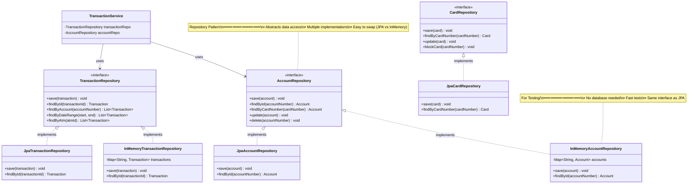

# Step 6: Repository Layer & Data Persistence

> **Purpose**: Separate data access logic from business logic
> **Pattern**: Repository Pattern - Abstract data storage/retrieval

---

## Quick Overview

Previously: Services directly manipulate entities in memory
Now: Services use Repositories to persist entities to database

---

## Class Diagram - Repository Layer



---

## Java Code - Repository Pattern

### AccountRepository.java (Interface)

```java
import java.util.List;
import java.util.Optional;

/**
 * Repository interface for Account entity
 *
 * Why Repository Pattern?
 * - Separates data access from business logic
 * - Easy to swap implementations (JPA, InMemory, MongoDB, etc.)
 * - Easy to test (use InMemory for unit tests)
 *
 * SOLID:
 * - Dependency Inversion: Services depend on interface, not implementation
 * - Single Responsibility: Only data access
 */
public interface AccountRepository {
    /**
     * Save new account
     */
    void save(Account account);

    /**
     * Find account by account number
     */
    Optional<Account> findById(String accountNumber);

    /**
     * Find account linked to a card
     */
    Optional<Account> findByCardNumber(String cardNumber);

    /**
     * Update existing account
     */
    void update(Account account);

    /**
     * Delete account
     */
    void delete(String accountNumber);

    /**
     * Find all accounts
     */
    List<Account> findAll();
}
```

### JpaAccountRepository.java (Database Implementation)

```java
import javax.persistence.*;
import java.util.*;

/**
 * JPA implementation of AccountRepository
 * Uses Hibernate/JPA to interact with MySQL database
 */
public class JpaAccountRepository implements AccountRepository {
    private EntityManager entityManager;

    public JpaAccountRepository(EntityManager entityManager) {
        this.entityManager = entityManager;
    }

    @Override
    public void save(Account account) {
        EntityTransaction tx = entityManager.getTransaction();
        try {
            tx.begin();
            entityManager.persist(account);  // INSERT
            tx.commit();
        } catch (Exception e) {
            tx.rollback();
            throw e;
        }
    }

    @Override
    public Optional<Account> findById(String accountNumber) {
        Account account = entityManager.find(Account.class, accountNumber);
        return Optional.ofNullable(account);
    }

    @Override
    public Optional<Account> findByCardNumber(String cardNumber) {
        // JPQL query
        String jpql = "SELECT a FROM Account a JOIN a.cards c WHERE c.cardNumber = :cardNumber";
        List<Account> results = entityManager.createQuery(jpql, Account.class)
                .setParameter("cardNumber", cardNumber)
                .getResultList();

        return results.isEmpty() ? Optional.empty() : Optional.of(results.get(0));
    }

    @Override
    public void update(Account account) {
        EntityTransaction tx = entityManager.getTransaction();
        try {
            tx.begin();
            entityManager.merge(account);  // UPDATE
            tx.commit();
        } catch (Exception e) {
            tx.rollback();
            throw e;
        }
    }

    @Override
    public void delete(String accountNumber) {
        EntityTransaction tx = entityManager.getTransaction();
        try {
            tx.begin();
            Account account = entityManager.find(Account.class, accountNumber);
            if (account != null) {
                entityManager.remove(account);  // DELETE
            }
            tx.commit();
        } catch (Exception e) {
            tx.rollback();
            throw e;
        }
    }

    @Override
    public List<Account> findAll() {
        return entityManager.createQuery("SELECT a FROM Account a", Account.class)
                .getResultList();
    }
}
```

### InMemoryAccountRepository.java (Testing Implementation)

```java
import java.util.*;
import java.util.concurrent.ConcurrentHashMap;

/**
 * In-memory implementation of AccountRepository
 * For testing - no database required!
 *
 * Benefits:
 * - Fast tests (no DB connection)
 * - No setup/teardown
 * - Deterministic
 */
public class InMemoryAccountRepository implements AccountRepository {
    // Thread-safe map
    private Map<String, Account> accounts = new ConcurrentHashMap<>();

    @Override
    public void save(Account account) {
        accounts.put(account.getAccountNumber(), account);
    }

    @Override
    public Optional<Account> findById(String accountNumber) {
        return Optional.ofNullable(accounts.get(accountNumber));
    }

    @Override
    public Optional<Account> findByCardNumber(String cardNumber) {
        // Linear search (not efficient, but OK for testing)
        return accounts.values().stream()
                .filter(account -> account.hasCard(cardNumber))
                .findFirst();
    }

    @Override
    public void update(Account account) {
        accounts.put(account.getAccountNumber(), account);
    }

    @Override
    public void delete(String accountNumber) {
        accounts.remove(accountNumber);
    }

    @Override
    public List<Account> findAll() {
        return new ArrayList<>(accounts.values());
    }

    // Test helper
    public void clear() {
        accounts.clear();
    }
}
```

---

## Database Schema (MySQL)

```sql
-- Accounts table
CREATE TABLE accounts (
    account_number VARCHAR(20) PRIMARY KEY,
    account_holder_name VARCHAR(100) NOT NULL,
    balance DECIMAL(15, 2) NOT NULL DEFAULT 0.00,
    account_type ENUM('SAVINGS', 'CURRENT', 'SALARY') NOT NULL,
    account_status ENUM('ACTIVE', 'FROZEN', 'CLOSED', 'DORMANT') NOT NULL,
    daily_withdrawal_limit DECIMAL(15, 2) NOT NULL DEFAULT 50000.00,
    daily_withdrawn_today DECIMAL(15, 2) NOT NULL DEFAULT 0.00,
    created_at TIMESTAMP DEFAULT CURRENT_TIMESTAMP,
    updated_at TIMESTAMP DEFAULT CURRENT_TIMESTAMP ON UPDATE CURRENT_TIMESTAMP,
    INDEX idx_account_status (account_status),
    INDEX idx_account_holder (account_holder_name)
);

-- Cards table
CREATE TABLE cards (
    card_number VARCHAR(16) PRIMARY KEY,
    card_holder_name VARCHAR(100) NOT NULL,
    expiry_date DATE NOT NULL,
    cvv VARCHAR(3) NOT NULL,
    card_status ENUM('ACTIVE', 'BLOCKED', 'EXPIRED', 'STOLEN', 'LOST') NOT NULL,
    pin_attempts INT DEFAULT 0,
    account_number VARCHAR(20),
    created_at TIMESTAMP DEFAULT CURRENT_TIMESTAMP,
    FOREIGN KEY (account_number) REFERENCES accounts(account_number),
    INDEX idx_card_status (card_status)
);

-- Transactions table
CREATE TABLE transactions (
    transaction_id VARCHAR(36) PRIMARY KEY,
    account_number VARCHAR(20) NOT NULL,
    transaction_type ENUM('WITHDRAWAL', 'DEPOSIT', 'BALANCE_INQUIRY', 'PIN_CHANGE') NOT NULL,
    amount DECIMAL(15, 2) NOT NULL,
    timestamp TIMESTAMP NOT NULL,
    status ENUM('PENDING', 'SUCCESS', 'FAILED', 'REVERSED') NOT NULL,
    atm_id VARCHAR(20) NOT NULL,
    balance_after DECIMAL(15, 2),
    description VARCHAR(255),
    failure_reason VARCHAR(255),
    created_at TIMESTAMP DEFAULT CURRENT_TIMESTAMP,
    FOREIGN KEY (account_number) REFERENCES accounts(account_number),
    INDEX idx_account_txn (account_number, timestamp),
    INDEX idx_atm_txn (atm_id, timestamp),
    INDEX idx_txn_type (transaction_type),
    INDEX idx_txn_status (status)
);

-- ATMs table
CREATE TABLE atms (
    atm_id VARCHAR(20) PRIMARY KEY,
    atm_name VARCHAR(100),
    location_address VARCHAR(255),
    location_city VARCHAR(50),
    location_state VARCHAR(50),
    location_pincode VARCHAR(10),
    atm_status ENUM('ACTIVE', 'INACTIVE', 'OUT_OF_SERVICE', 'NO_CASH', 'MAINTENANCE') NOT NULL,
    total_cash_available DECIMAL(15, 2) DEFAULT 0.00,
    created_at TIMESTAMP DEFAULT CURRENT_TIMESTAMP,
    INDEX idx_atm_status (atm_status),
    INDEX idx_location_city (location_city)
);

-- Cash bins table
CREATE TABLE cash_bins (
    bin_id INT AUTO_INCREMENT PRIMARY KEY,
    atm_id VARCHAR(20) NOT NULL,
    denomination INT NOT NULL,
    note_count INT NOT NULL DEFAULT 0,
    capacity INT NOT NULL,
    FOREIGN KEY (atm_id) REFERENCES atms(atm_id),
    UNIQUE KEY unique_atm_denomination (atm_id, denomination),
    INDEX idx_atm_bins (atm_id)
);
```

---

## Updated TransactionService with Repository

```java
/**
 * TransactionService now uses repositories for persistence
 */
public class TransactionService {
    private final BankingService bankingService;
    private final AuthenticationService authService;

    // NEW: Repositories for data access
    private final TransactionRepository transactionRepository;
    private final AccountRepository accountRepository;

    public TransactionService(BankingService bankingService,
                              AuthenticationService authService,
                              TransactionRepository transactionRepository,
                              AccountRepository accountRepository) {
        this.bankingService = bankingService;
        this.authService = authService;
        this.transactionRepository = transactionRepository;
        this.accountRepository = accountRepository;
    }

    public Transaction withdraw(Card card, Account account, double amount, ATM atm) {
        Transaction transaction = new Transaction(account, TransactionType.WITHDRAWAL, amount, atm.getAtmId());

        try {
            if (!validateWithdrawal(account, amount, atm)) {
                transaction.markAsFailed("Validation failed");
                transactionRepository.save(transaction);  // Persist failed transaction
                return transaction;
            }

            if (!executeWithdrawal(account, amount, atm)) {
                transaction.markAsFailed("Execution failed");
                transactionRepository.save(transaction);
                return transaction;
            }

            boolean backendUpdated = bankingService.debitAccount(account.getAccountNumber(), amount);
            if (!backendUpdated) {
                account.credit(amount);
                accountRepository.update(account);  // Rollback in DB
                transaction.markAsFailed("Backend failed");
                transactionRepository.save(transaction);
                return transaction;
            }

            transaction.markAsSuccess(account.getAvailableBalance());

            // Persist successful transaction and updated account
            transactionRepository.save(transaction);
            accountRepository.update(account);

            return transaction;

        } catch (Exception e) {
            transaction.markAsFailed("Error: " + e.getMessage());
            transactionRepository.save(transaction);
            return transaction;
        }
    }

    // ... other methods
}
```

---

## Key Takeaways

1. ✅ **Repository Pattern** separates data access from business logic
2. ✅ **Multiple implementations** (JPA for production, InMemory for testing)
3. ✅ **Dependency Inversion** - services depend on interfaces
4. ✅ **Testability** - easy unit testing with InMemory
5. ✅ **Database schema** mapped to entities

---

## Navigation
- [← Previous: Step 5 - ATM Service](07_step5_class_diagram.md)
- [→ Next: Steps 7-8 - Design Patterns](09_design_patterns.md)
