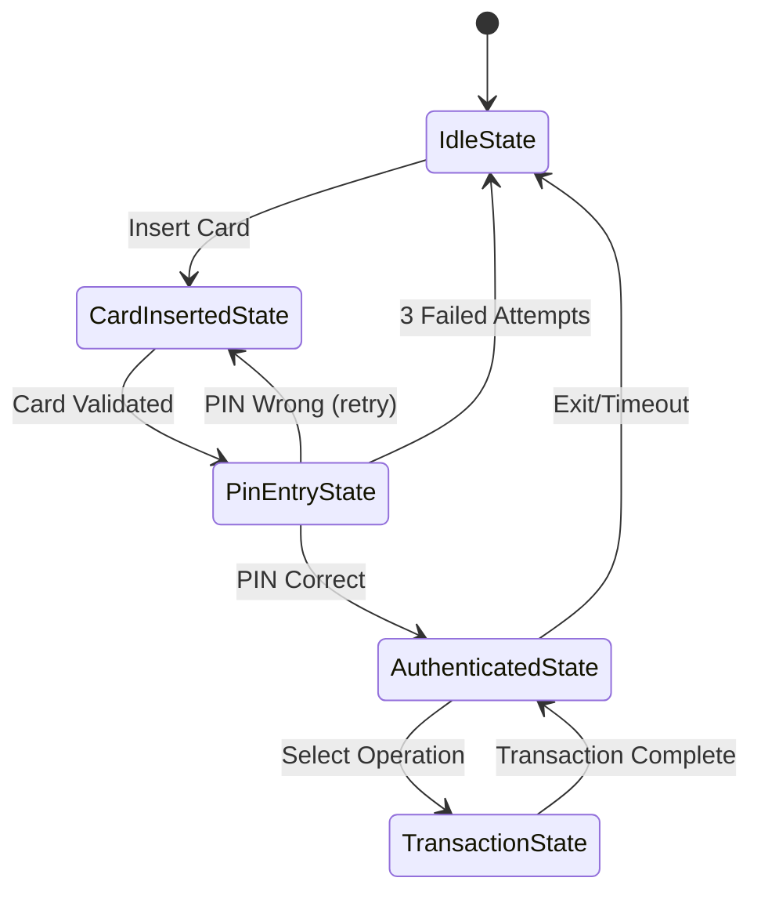

# Design Patterns in ATM System (Steps 7-8)

> **Purpose**: Recognize and apply proven design patterns used in our ATM system

---

## Design Patterns Applied

### 1. State Pattern (ATM States)

**Problem**: ATM behavior changes based on state (Idle, Card Inserted, Authenticated, etc.)



**Java Implementation**:

```java
/**
 * State Pattern for ATM states
 */
interface ATMState {
    void insertCard(ATMContext context, Card card);
    void enterPin(ATMContext context, String pin);
    void selectOperation(ATMContext context, int operation);
    void ejectCard(ATMContext context);
}

class IdleState implements ATMState {
    @Override
    public void insertCard(ATMContext context, Card card) {
        System.out.println("Card inserted");
        context.setCard(card);
        context.setState(new CardInsertedState());
    }

    @Override
    public void enterPin(ATMContext context, String pin) {
        System.out.println("Please insert card first");
    }

    // ... other methods
}

class CardInsertedState implements ATMState {
    @Override
    public void enterPin(ATMContext context, String pin) {
        if (validatePin(context.getCard(), pin)) {
            context.setState(new AuthenticatedState());
        } else {
            // Handle wrong PIN
        }
    }
    // ...
}

class ATMContext {
    private ATMState currentState;
    private Card card;

    public ATMContext() {
        currentState = new IdleState();
    }

    public void setState(ATMState state) {
        this.currentState = state;
    }

    public void insertCard(Card card) {
        currentState.insertCard(this, card);
    }

    public void enterPin(String pin) {
        currentState.enterPin(this, pin);
    }
}
```

---

### 2. Strategy Pattern (Transaction Types)

**Problem**: Different transaction types have different logic

```java
/**
 * Strategy Pattern for different transaction types
 */
interface TransactionStrategy {
    Transaction execute(Account account, double amount, ATM atm);
}

class WithdrawalStrategy implements TransactionStrategy {
    @Override
    public Transaction execute(Account account, double amount, ATM atm) {
        // Withdrawal-specific logic
        if (account.hasSufficientBalance(amount)) {
            account.debit(amount);
            atm.dispenseCash(amount);
            return new Transaction(...);
        }
        // ...
    }
}

class DepositStrategy implements TransactionStrategy {
    @Override
    public Transaction execute(Account account, double amount, ATM atm) {
        // Deposit-specific logic
        account.credit(amount);
        atm.acceptCash(...);
        return new Transaction(...);
    }
}

// Usage
class TransactionService {
    private Map<TransactionType, TransactionStrategy> strategies;

    public TransactionService() {
        strategies = new HashMap<>();
        strategies.put(TransactionType.WITHDRAWAL, new WithdrawalStrategy());
        strategies.put(TransactionType.DEPOSIT, new DepositStrategy());
    }

    public Transaction performTransaction(TransactionType type, Account account, double amount, ATM atm) {
        TransactionStrategy strategy = strategies.get(type);
        return strategy.execute(account, amount, atm);
    }
}
```

---

### 3. Singleton Pattern (ATM Instance)

**Problem**: Only one ATM machine should exist per physical device

```java
/**
 * Singleton Pattern for ATM
 * Thread-safe using Bill Pugh method
 */
public class ATM {
    private String atmId;

    // Private constructor
    private ATM(String atmId) {
        this.atmId = atmId;
    }

    // Bill Pugh Singleton (thread-safe, lazy initialization)
    private static class SingletonHelper {
        private static final ATM INSTANCE = new ATM("ATM_001");
    }

    public static ATM getInstance() {
        return SingletonHelper.INSTANCE;
    }
}
```

---

### 4. Factory Pattern (Transaction Creation)

**Problem**: Complex transaction object creation with validation

```java
/**
 * Factory Pattern for Transaction creation
 */
class TransactionFactory {
    public static Transaction createWithdrawalTransaction(
            Account account, double amount, String atmId) {

        // Validation
        if (amount <= 0) {
            throw new IllegalArgumentException("Amount must be positive");
        }
        if (amount % 100 != 0) {
            throw new IllegalArgumentException("Amount must be multiple of 100");
        }

        // Create and return
        Transaction transaction = new Transaction(
            account,
            TransactionType.WITHDRAWAL,
            amount,
            atmId
        );

        return transaction;
    }

    public static Transaction createDepositTransaction(
            Account account, double amount, String atmId) {
        // Similar validation and creation
        return new Transaction(...);
    }
}

// Usage
Transaction txn = TransactionFactory.createWithdrawalTransaction(account, 2000, "ATM_001");
```

---

### 5. Observer Pattern (Transaction Notifications)

**Problem**: Notify customers about transactions via email/SMS

```java
/**
 * Observer Pattern for notifications
 */
interface TransactionObserver {
    void update(Transaction transaction);
}

class EmailNotifier implements TransactionObserver {
    @Override
    public void update(Transaction transaction) {
        String email = transaction.getAccount().getCustomer().getEmail();
        sendEmail(email, "Transaction Alert: " + transaction.getAmount());
    }
}

class SMSNotifier implements TransactionObserver {
    @Override
    public void update(Transaction transaction) {
        String phone = transaction.getAccount().getCustomer().getPhone();
        sendSMS(phone, "Txn: " + transaction.getAmount());
    }
}

class TransactionSubject {
    private List<TransactionObserver> observers = new ArrayList<>();

    public void attach(TransactionObserver observer) {
        observers.add(observer);
    }

    public void notifyObservers(Transaction transaction) {
        for (TransactionObserver observer : observers) {
            observer.update(transaction);
        }
    }
}

// Usage
TransactionSubject subject = new TransactionSubject();
subject.attach(new EmailNotifier());
subject.attach(new SMSNotifier());

// After transaction
subject.notifyObservers(transaction);  // Notifies all observers
```

---

### 6. Facade Pattern (ATMService)

**Already implemented** - ATMService provides simple interface to complex subsystem

```java
// Complex subsystem
AuthenticationService authService = new AuthenticationService(...);
TransactionService transactionService = new TransactionService(...);
CardReader cardReader = new PhysicalCardReader();
// ... many more components

// Facade simplifies
ATMService atmService = new ATMService(atm, authService, transactionService, ...);
atmService.startSession();  // Simple!
```

---

### 7. Template Method Pattern (Transaction Processing)

```java
/**
 * Template Method Pattern for transaction processing
 */
abstract class TransactionProcessor {
    // Template method - defines skeleton
    public final Transaction processTransaction(Account account, double amount, ATM atm) {
        // Step 1: Validate (common)
        if (!validate(account, amount, atm)) {
            return createFailedTransaction("Validation failed");
        }

        // Step 2: Execute (varies by type - abstract)
        boolean executed = execute(account, amount, atm);
        if (!executed) {
            return createFailedTransaction("Execution failed");
        }

        // Step 3: Update backend (common)
        updateBackend(account, amount);

        // Step 4: Create success transaction (common)
        return createSuccessTransaction(account, amount);
    }

    // Hook methods - subclasses override
    protected abstract boolean validate(Account account, double amount, ATM atm);
    protected abstract boolean execute(Account account, double amount, ATM atm);

    // Common methods
    private void updateBackend(Account account, double amount) {
        // Common backend update logic
    }

    private Transaction createSuccessTransaction(Account account, double amount) {
        // Common transaction creation
        return new Transaction(...);
    }

    private Transaction createFailedTransaction(String reason) {
        // ...
    }
}

class WithdrawalProcessor extends TransactionProcessor {
    @Override
    protected boolean validate(Account account, double amount, ATM atm) {
        return account.hasSufficientBalance(amount) && atm.hasSufficientCash(amount);
    }

    @Override
    protected boolean execute(Account account, double amount, ATM atm) {
        account.debit(amount);
        return atm.dispenseCash(amount) != null;
    }
}

class DepositProcessor extends TransactionProcessor {
    @Override
    protected boolean validate(Account account, double amount, ATM atm) {
        return amount > 0 && amount <= 50000;  // Max deposit
    }

    @Override
    protected boolean execute(Account account, double amount, ATM atm) {
        account.credit(amount);
        return true;
    }
}
```

---

## Summary of Design Patterns

| Pattern | Where Used | Why |
|---------|------------|-----|
| **State** | ATM states | Behavior changes with state |
| **Strategy** | Transaction types | Different algorithms for each type |
| **Singleton** | ATM instance | One instance per machine |
| **Factory** | Transaction creation | Complex object creation |
| **Observer** | Notifications | Decouple transaction from notifications |
| **Facade** | ATMService | Simplify complex subsystem |
| **Template Method** | Transaction processing | Define algorithm skeleton |
| **Repository** | Data access | Abstract persistence |

---

## Interview Questions

**Q: Why use State pattern instead of if-else?**
```java
// ❌ Without State pattern
if (state == "IDLE") {
    if (action == "INSERT_CARD") { ... }
} else if (state == "CARD_INSERTED") {
    if (action == "ENTER_PIN") { ... }
}
// Many nested if-else - hard to maintain

// ✅ With State pattern
currentState.handleAction(action);  // Clean!
```

**Q: Difference between Strategy and State?**
- **Strategy**: Choose algorithm at runtime (client selects)
- **State**: Behavior changes automatically based on state

---

## Navigation
- [← Previous: Repository Layer](08_step6_repository_layer.md)
- [→ Next: Sequence Diagrams](10_sequence_diagrams.md)
