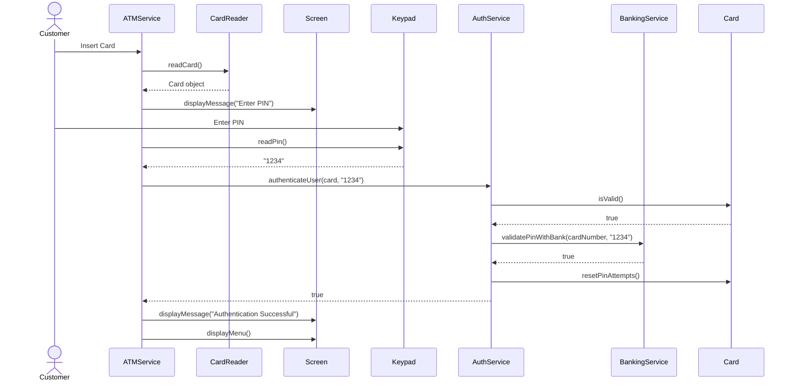
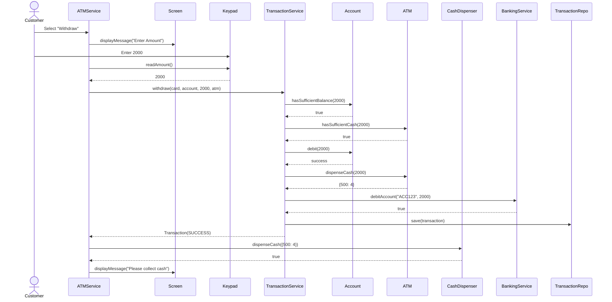
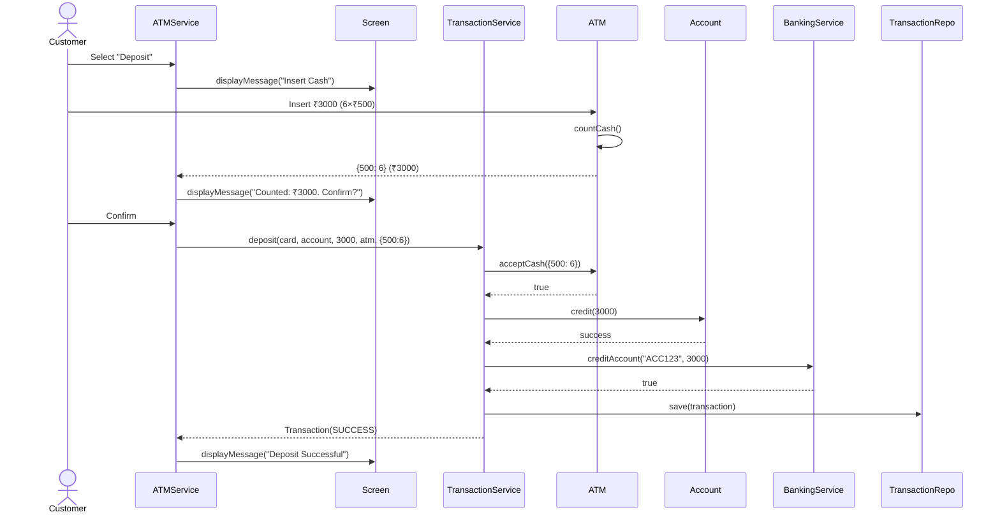
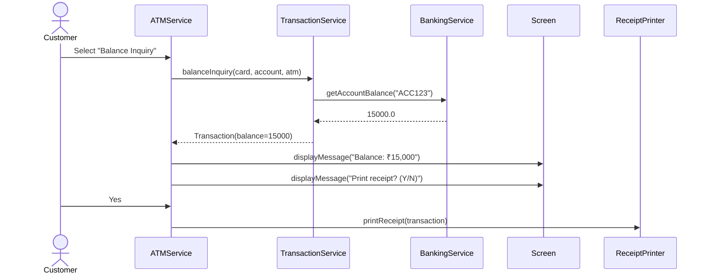
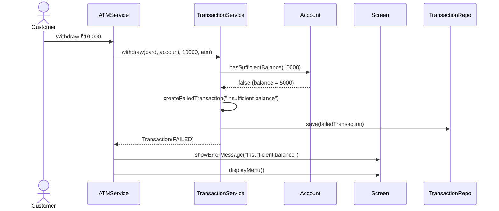
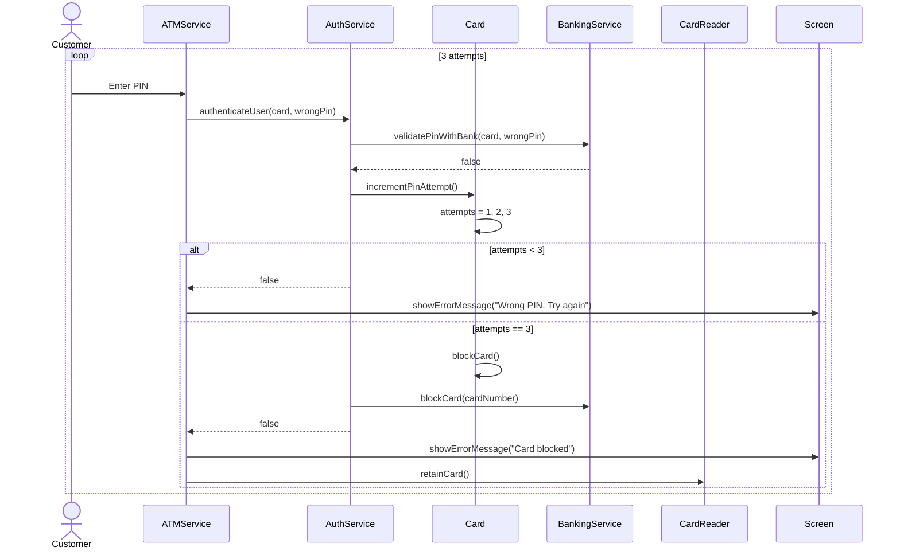
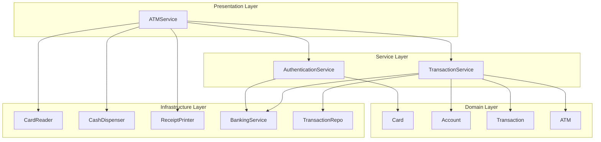

# Sequence Diagrams - ATM System Flows (Phase 8)

> **Purpose**: Show how objects interact over time for key operations

---

## 1. Authentication Flow

**Explanation**:
1. Customer inserts card → CardReader reads it
2. ATM prompts for PIN → Keypad captures it
3. AuthService validates card locally
4. AuthService validates PIN with backend
5. On success, reset PIN attempts
6. Show main menu

---

## 2. Cash Withdrawal Flow

**Key Steps**:
1. Validate: Check balance and ATM cash
2. Debit: Remove from account
3. Dispense Plan: Calculate denominations
4. Backend: Update bank backend
5. Persist: Save transaction
6. Hardware: Physically dispense cash

---

## 3. Cash Deposit Flow

---

## 4. Balance Inquiry Flow

---

## 5. Failed Transaction (Insufficient Balance)

---

## 6. PIN Validation Failure (3 Attempts)

---

## 7. Component Interaction Diagram

---

## Interview Questions

**Q: What happens if cash dispensing fails after account debit?**
**A**: Rollback - credit the amount back to account and mark transaction as REVERSED

**Q: How to ensure atomicity across services?**
**A**: Use database transactions (`@Transactional`) and compensating transactions for rollback

**Q: What if banking backend is down during withdrawal?**
**A**:
1. Retry with exponential backoff
2. If still fails, rollback local changes
3. Mark transaction as FAILED
4. Don't dispense cash

---

## Navigation
- [← Previous: Design Patterns](09_design_patterns.md)
- [→ Next: SOLID & Concurrency](11_solid_concurrency.md)
