# ATM System - Final Complete Design

> **The Big Picture**: All components working together

---

## Complete System Architecture

```mermaid
graph TB
    subgraph "🌐 PRESENTATION LAYER"
        ATMService["<b>ATMService</b><br/>────────────────<br/>+ startSession()<br/>+ processWithdrawal()<br/>+ processDeposit()<br/>+ authenticateUser()<br/>────────────────<br/>🎯 Facade Pattern<br/>Orchestrates everything"]
    end

    subgraph "💼 SERVICE LAYER"
        AuthService["<b>AuthenticationService</b><br/>────────────────<br/>+ authenticateUser(card, pin)<br/>+ validateCard(card)<br/>+ validatePin(card, pin)<br/>+ blockCard(card)<br/>────────────────<br/>🔐 Security<br/>PIN validation"]

        TxnService["<b>TransactionService</b><br/>────────────────<br/>+ withdraw(card, account, amount, atm)<br/>+ deposit(card, account, amount, atm, cash)<br/>+ balanceInquiry(card, account, atm)<br/>────────────────<br/>💰 Business Logic<br/>Transaction processing"]

        BankingService["<b>&lt;&lt;interface&gt;&gt;</b><br/><b>BankingService</b><br/>────────────────<br/>+ validatePinWithBank(cardNum, pin)<br/>+ debitAccount(accNum, amount)<br/>+ creditAccount(accNum, amount)<br/>+ getAccountBalance(accNum)<br/>────────────────<br/>🏦 External Integration<br/>Backend API"]
    end

    subgraph "📦 DOMAIN ENTITIES"
        Card["<b>Card</b><br/>────────────────<br/>- cardNumber: String<br/>- expiryDate: Date<br/>- status: CardStatus<br/>- pinAttempts: int<br/>────────────────<br/>+ isValid(): boolean<br/>+ incrementPinAttempt()<br/>+ blockCard()"]

        Account["<b>Account</b><br/>────────────────<br/>- accountNumber: String<br/>- balance: double<br/>- dailyWithdrawalLimit: double<br/>- dailyWithdrawnToday: double<br/>────────────────<br/>+ debit(amount)<br/>+ credit(amount)<br/>+ hasSufficientBalance(amount)"]

        Transaction["<b>Transaction</b><br/>────────────────<br/>- transactionId: String<br/>- type: TransactionType<br/>- amount: double<br/>- status: TransactionStatus<br/>- timestamp: Date<br/>- balanceAfter: double<br/>────────────────<br/>+ markAsSuccess(balance)<br/>+ markAsFailed(reason)"]

        ATM["<b>ATM</b><br/>────────────────<br/>- atmId: String<br/>- location: Location<br/>- cashBins: List&lt;CashBin&gt;<br/>- status: ATMStatus<br/>────────────────<br/>+ dispenseCash(amount)<br/>+ acceptCash(cash)<br/>+ hasSufficientCash(amount)"]

        Customer["<b>Customer</b><br/>────────────────<br/>- customerId: String<br/>- name: String<br/>- email: String<br/>- phoneNumber: String"]
    end

    subgraph "🔌 REPOSITORY LAYER"
        AccountRepo["<b>&lt;&lt;interface&gt;&gt;</b><br/><b>AccountRepository</b><br/>────────────────<br/>+ save(account)<br/>+ findById(accountNum)<br/>+ update(account)"]

        TxnRepo["<b>&lt;&lt;interface&gt;&gt;</b><br/><b>TransactionRepository</b><br/>────────────────<br/>+ save(transaction)<br/>+ findById(txnId)<br/>+ findByAccount(accNum)"]

        JpaAccountRepo["<b>JpaAccountRepository</b><br/>implements AccountRepository<br/>────────────────<br/>Uses Hibernate/JPA<br/>MySQL database"]

        JpaTxnRepo["<b>JpaTransactionRepository</b><br/>implements TransactionRepository<br/>────────────────<br/>Persists to DB"]
    end

    subgraph "🖥️ HARDWARE INTERFACES"
        CardReader["<b>&lt;&lt;interface&gt;&gt;</b><br/><b>CardReader</b><br/>────────────────<br/>+ readCard(): Card<br/>+ ejectCard()<br/>+ retainCard()"]

        Screen["<b>&lt;&lt;interface&gt;&gt;</b><br/><b>Screen</b><br/>────────────────<br/>+ displayMessage(msg)<br/>+ displayMenu(options)<br/>+ showErrorMessage(error)"]

        CashDispenser["<b>&lt;&lt;interface&gt;&gt;</b><br/><b>CashDispenser</b><br/>────────────────<br/>+ dispenseCash(denominations)<br/>+ isOperational()"]

        Keypad["<b>&lt;&lt;interface&gt;&gt;</b><br/><b>Keypad</b><br/>────────────────<br/>+ readPin(): String<br/>+ readAmount(): double<br/>+ readMenuChoice(): int"]

        ReceiptPrinter["<b>&lt;&lt;interface&gt;&gt;</b><br/><b>ReceiptPrinter</b><br/>────────────────<br/>+ printReceipt(txn)<br/>+ hasPaper(): boolean"]
    end

    %% Connections
    ATMService --> AuthService
    ATMService --> TxnService
    ATMService --> CardReader
    ATMService --> Screen
    ATMService --> Keypad
    ATMService --> CashDispenser
    ATMService --> ReceiptPrinter

    AuthService --> BankingService
    TxnService --> BankingService
    TxnService --> AccountRepo
    TxnService --> TxnRepo

    AccountRepo --> JpaAccountRepo
    TxnRepo --> JpaTxnRepo

    TxnService -.-> Account
    TxnService -.-> Transaction
    TxnService -.-> ATM
    AuthService -.-> Card

    Customer -- "1..*" --> Account
    Customer -- "1..*" --> Card
    Account -- "0..*" --> Transaction

    style ATMService fill:#fce4ec,stroke:#880e4f,stroke-width:3px
    style AuthService fill:#e8f5e9,stroke:#1b5e20,stroke-width:2px
    style TxnService fill:#e8f5e9,stroke:#1b5e20,stroke-width:2px
    style BankingService fill:#e1f5ff,stroke:#01579b,stroke-width:2px
    style Account fill:#fff3e0,stroke:#e65100,stroke-width:2px
    style Card fill:#fff3e0,stroke:#e65100,stroke-width:2px
    style Transaction fill:#fff3e0,stroke:#e65100,stroke-width:2px
    style ATM fill:#fff3e0,stroke:#e65100,stroke-width:2px
```



---

## Design Patterns Summary

| Pattern | Where | Why |
|---------|-------|-----|
| **Facade** | ATMService | Simplify complex subsystem |
| **State** | ATM states | Behavior changes with state |
| **Strategy** | Transaction types | Different algorithms |
| **Singleton** | ATM instance | One instance per machine |
| **Factory** | Transaction creation | Complex object creation |
| **Observer** | Notifications | Decouple events from handlers |
| **Repository** | Data access | Abstract persistence |
| **Template Method** | Transaction processing | Define algorithm skeleton |
| **Dependency Injection** | All services | Loose coupling, testability |

---

## SOLID Principles Mapping

| Principle | Example in Design |
|-----------|------------------|
| **S** - Single Responsibility | `AuthService` only authenticates, `TransactionService` only processes transactions |
| **O** - Open/Closed | Strategy pattern allows adding new transaction types without modifying existing code |
| **L** - Liskov Substitution | `JpaAccountRepository` and `InMemoryAccountRepository` are interchangeable |
| **I** - Interface Segregation | Separate interfaces for `CardReader`, `CashDispenser`, `Screen` instead of one fat interface |
| **D** - Dependency Inversion | Services depend on `BankingService` interface, not concrete implementation |

---

## Key Design Decisions

### 1. **Layered Architecture**
```
Presentation → Service → Domain → Repository → Database
```
**Why**: Clear separation of concerns, testability, maintainability

### 2. **Interface-Based Hardware Abstraction**
```java
interface CardReader { ... }
class PhysicalCardReader implements CardReader { ... }
class MockCardReader implements CardReader { ... }
```
**Why**: Vendor independence, testability

### 3. **Repository Pattern for Data Access**
```java
interface AccountRepository { ... }
class JpaAccountRepository implements AccountRepository { ... }
```
**Why**: Abstract persistence, easy to swap databases

### 4. **Immutable Transactions**
```java
class Transaction {
    private final String transactionId;  // final = immutable
    private final Date timestamp;
}
```
**Why**: Audit compliance, data integrity

### 5. **Dependency Injection**
```java
class TransactionService {
    public TransactionService(BankingService bankingService, ...) {
        this.bankingService = bankingService;  // Injected
    }
}
```
**Why**: Loose coupling, testability

### 6. **Pessimistic Locking for Concurrency**
```sql
SELECT * FROM accounts WHERE account_number = ? FOR UPDATE
```
**Why**: Prevent race conditions in withdrawals

---

## Data Flow Examples

### Withdrawal Flow
```
1. Customer inserts card → CardReader reads it
2. Customer enters PIN → Keypad captures it
3. AuthService validates with BankingService
4. Customer selects "Withdraw ₹2000"
5. TransactionService:
   a. Validates balance (Account.hasSufficientBalance)
   b. Validates ATM cash (ATM.hasSufficientCash)
   c. Debits account (Account.debit)
   d. Dispenses cash (ATM.dispenseCash)
   e. Updates backend (BankingService.debitAccount)
   f. Persists transaction (TransactionRepository.save)
6. CashDispenser physically dispenses
7. ReceiptPrinter prints receipt
8. CardReader ejects card
```

---

## Scalability Considerations

### 1. **Multiple ATMs → Same Backend**
- Each ATM is independent
- Shared backend (BankingService API)
- Database handles concurrency via locking

### 2. **Load Balancing**
```
ATM-1 ─┐
ATM-2 ─┼→ Load Balancer → Banking API Server 1
ATM-3 ─┤                → Banking API Server 2
ATM-N ─┘                → Banking API Server 3
```

### 3. **Database Sharding**
- Shard accounts by region
- Reduces contention

### 4. **Caching**
- Cache account balance (short TTL)
- Reduce backend calls for balance inquiry

---

## Security Considerations

1. **PIN Encryption**
   - Never store PIN locally
   - Encrypt during transmission (TLS/SSL)
   - Validate with secure backend

2. **Card Data Protection**
   - Don't log card numbers
   - Clear session data after transaction
   - Encrypt card data in database

3. **Transaction Integrity**
   - Use database transactions (ACID)
   - Immutable transaction records
   - Audit logging

4. **Physical Security**
   - Retain card after 3 failed PIN attempts
   - Anti-skimming hardware
   - Tamper detection

---

## Testing Strategy

### 1. Unit Tests
```java
@Test
public void testWithdrawal_SufficientBalance() {
    // Arrange
    Account account = new Account("ACC123", "John", 10000, SAVINGS);
    ATM atm = new ATM("ATM001", location);
    TransactionService service = new TransactionService(
        new MockBankingService(),
        new MockAuthService(),
        new InMemoryTransactionRepository(),
        new InMemoryAccountRepository()
    );

    // Act
    Transaction txn = service.withdraw(card, account, 2000, atm);

    // Assert
    assertEquals(TransactionStatus.SUCCESS, txn.getStatus());
    assertEquals(8000, account.getBalance(), 0.01);
}
```

### 2. Integration Tests
- Test with real database (H2 in-memory)
- Test banking API integration (mock server)

### 3. End-to-End Tests
- Simulate complete user journey
- Use mock hardware

---

## Monitoring & Observability

### 1. Logging
```java
@Slf4j
public class TransactionService {
    public Transaction withdraw(...) {
        log.info("Withdrawal initiated: account={}, amount={}", accountNum, amount);
        // ... logic
        log.info("Withdrawal successful: txnId={}", txn.getId());
    }
}
```

### 2. Metrics
- Transaction count (per ATM, per type)
- Success rate
- Average transaction time
- Cash levels

### 3. Alerts
- Cash below threshold
- High failure rate
- Hardware malfunction

---

## Future Enhancements

1. **Mini Statement** - Print last 5 transactions
2. **Fund Transfer** - Transfer between accounts
3. **Bill Payment** - Pay utilities
4. **Cardless Withdrawal** - OTP-based
5. **Multi-currency** - Support multiple currencies
6. **Contactless Cards** - NFC support
7. **Biometric Auth** - Fingerprint/Face recognition

---

## Navigation
- [← Previous: SOLID & Concurrency](11_solid_concurrency.md)
- [→ Next: Complete Java Implementation](13_complete_java_implementation.md)
