# Car Rental System - Use Case Diagram

## Use Case Diagram (Mermaid)

```mermaid
graph TB
    subgraph System["🚗 Car Rental System"]
        UC1[Search Available Cars]
        UC2[Create Reservation]
        UC3[Modify Reservation]
        UC4[Cancel Reservation]
        UC5[Make Payment]
        UC6[View Reservation History]
        UC7[Manage Car Inventory]
        UC8[Update Car Status]
        UC9[Generate Reports]
        UC10[Send Notifications]
        UC11[Process Refund]
        UC12[Validate Driver License]
    end

    Customer([👤 Customer])
    Admin([👨‍💼 Admin])
    PaymentGateway([💳 Payment Gateway])
    NotificationSystem([📧 Notification System])

    %% Customer Use Cases
    Customer --> UC1
    Customer --> UC2
    Customer --> UC3
    Customer --> UC4
    Customer --> UC5
    Customer --> UC6

    %% Admin Use Cases
    Admin --> UC7
    Admin --> UC8
    Admin --> UC9

    %% System Interactions
    UC2 -.includes.-> UC12
    UC2 -.includes.-> UC1
    UC3 -.includes.-> UC1
    UC5 -.uses.-> PaymentGateway
    UC11 -.uses.-> PaymentGateway
    UC2 -.triggers.-> UC10
    UC4 -.triggers.-> UC10
    UC4 -.includes.-> UC11
    UC10 -.uses.-> NotificationSystem

    style System fill:#e3f2fd,stroke:#1976d2,stroke-width:3px
    style Customer fill:#c8e6c9,stroke:#388e3c,stroke-width:2px
    style Admin fill:#fff9c4,stroke:#f57c00,stroke-width:2px
    style PaymentGateway fill:#f8bbd0,stroke:#c2185b,stroke-width:2px
    style NotificationSystem fill:#d1c4e9,stroke:#512da8,stroke-width:2px
```

---

## Actors

### 1. 👤 Customer (Primary Actor)
**Description**: An individual who wants to rent a car for personal or business use.

**Responsibilities**:
- Search for available cars
- Create, modify, and cancel reservations
- Make payments
- View reservation history
- Receive notifications

**Prerequisites**:
- Must be registered user
- Must have valid driver's license
- Must be 21+ years old

---

### 2. 👨‍💼 Admin (Primary Actor)
**Description**: System administrator or rental company staff who manages the car inventory and system operations.

**Responsibilities**:
- Add/update/remove cars from inventory
- Update car status (available, maintenance, retired)
- Generate business reports
- Manage customer issues
- Override system constraints (in special cases)

**Prerequisites**:
- Must have admin credentials
- Must be authorized staff member

---

### 3. 💳 Payment Gateway (External System)
**Description**: Third-party payment processing service (e.g., Stripe, PayPal).

**Responsibilities**:
- Process credit/debit card payments
- Handle refunds
- Provide transaction status
- Ensure PCI DSS compliance

**Communication**: REST API calls over HTTPS

---

### 4. 📧 Notification System (External System)
**Description**: Email and SMS service providers (e.g., SendGrid, Twilio).

**Responsibilities**:
- Send email confirmations
- Send SMS reminders
- Deliver payment receipts
- Send cancellation notifications

**Communication**: REST API or message queue

---

## Use Cases (Detailed)

### UC-1: Search Available Cars

**Primary Actor**: Customer

**Trigger**: Customer wants to find a car to rent

**Preconditions**:
- User is on the search page
- System has car inventory

**Main Flow**:
1. Customer enters search criteria:
   - Pickup date and time
   - Return date and time
   - Location
   - Car type (optional)
   - Price range (optional)
2. System validates date range (future dates, return after pickup)
3. System queries database for available cars
4. System calculates total cost for each car
5. System displays search results with:
   - Car details (make, model, year)
   - Daily rate and total cost
   - Availability status
   - Features
6. Customer can sort/filter results

**Postconditions**:
- Search results are displayed
- Customer can proceed to create reservation

**Alternative Flows**:
- **Alt-1**: No cars available
  - System shows "No cars available for selected dates"
  - Suggests nearby dates or locations
- **Alt-2**: Invalid date range
  - System shows validation error
  - Customer corrects input

**Non-Functional Requirements**:
- Response time < 2 seconds
- Results cached for 5 minutes

---

### UC-2: Create Reservation

**Primary Actor**: Customer

**Trigger**: Customer wants to book a car

**Preconditions**:
- Customer is authenticated
- Car is available for selected dates
- Customer has valid driver's license

**Main Flow**:
1. Customer selects a car from search results
2. System validates car availability (real-time check)
3. Customer reviews booking details:
   - Car details
   - Pickup/return dates and times
   - Location
   - Total cost
4. System validates driver's license expiry
5. Customer confirms reservation
6. **System locks the car** (pessimistic lock to prevent double-booking)
7. System creates reservation with status "PENDING_PAYMENT"
8. System starts 15-minute payment timer
9. Customer is redirected to payment
10. (Includes UC-5: Make Payment)
11. On payment success:
    - Reservation status → "CONFIRMED"
    - Car status → "RENTED" for selected dates
12. System triggers notification (email + SMS)
13. System displays confirmation with reservation ID

**Postconditions**:
- Reservation is created and confirmed
- Car is marked as unavailable for selected period
- Customer receives confirmation

**Alternative Flows**:
- **Alt-1**: Car becomes unavailable (race condition)
  - System shows "Car no longer available"
  - Customer redirected to search
- **Alt-2**: Driver license expired
  - System rejects reservation
  - Shows "Please renew your driver's license"
- **Alt-3**: Payment not completed within 15 minutes
  - System auto-cancels reservation
  - Releases car lock
  - Sends cancellation email

**Includes**:
- UC-12: Validate Driver License
- UC-1: Search Available Cars
- UC-5: Make Payment

**Business Rules**:
- One car cannot be booked by multiple customers for overlapping dates
- Minimum rental period: 1 day
- Maximum advance booking: 6 months

---

### UC-3: Modify Reservation

**Primary Actor**: Customer

**Trigger**: Customer wants to change reservation details

**Preconditions**:
- Reservation exists with status "CONFIRMED"
- Modification requested > 24 hours before pickup

**Main Flow**:
1. Customer selects existing reservation
2. Customer chooses modification type:
   - Change dates
   - Change car (upgrade/downgrade)
3. System checks car availability for new dates
4. System calculates price difference
5. If price increases:
   - Customer pays the difference
6. If price decreases:
   - System processes partial refund
7. System updates reservation
8. System sends updated confirmation

**Postconditions**:
- Reservation is updated
- Previous dates are released
- New dates are locked

**Alternative Flows**:
- **Alt-1**: Modification within 24 hours
  - System rejects with "Cannot modify within 24 hours of pickup"
- **Alt-2**: New dates unavailable
  - System suggests alternatives

**Includes**:
- UC-1: Search Available Cars (for new car selection)

---

### UC-4: Cancel Reservation

**Primary Actor**: Customer

**Trigger**: Customer wants to cancel a booking

**Preconditions**:
- Reservation exists and is not already cancelled

**Main Flow**:
1. Customer selects reservation to cancel
2. System calculates refund amount based on cancellation policy:
   - **48+ hours before**: 100% refund
   - **24-48 hours before**: 50% refund
   - **< 24 hours**: No refund
3. System displays refund amount
4. Customer confirms cancellation
5. Reservation status → "CANCELLED"
6. Car is released (available again)
7. System initiates refund (if applicable)
8. System sends cancellation confirmation

**Postconditions**:
- Reservation is cancelled
- Car is available for other customers
- Refund processed (if applicable)

**Includes**:
- UC-11: Process Refund

**Triggers**:
- UC-10: Send Notifications

---

### UC-5: Make Payment

**Primary Actor**: Customer

**Trigger**: Customer completes reservation and needs to pay

**Preconditions**:
- Reservation created with "PENDING_PAYMENT" status
- Payment amount is calculated

**Main Flow**:
1. System displays payment page with amount
2. Customer selects payment method:
   - Credit/Debit Card
   - PayPal
   - Cash (hold reservation, pay at pickup)
3. Customer enters payment details
4. System validates payment information
5. System calls Payment Gateway API
6. Payment Gateway processes transaction
7. Payment Gateway returns success response
8. System creates Payment record with transaction ID
9. Payment status → "COMPLETED"
10. System links payment to reservation
11. Reservation status → "CONFIRMED"

**Postconditions**:
- Payment is processed
- Reservation is confirmed
- Transaction record is saved

**Alternative Flows**:
- **Alt-1**: Payment fails
  - Gateway returns error
  - System keeps reservation as "PENDING_PAYMENT"
  - Customer can retry
  - Auto-cancel after 15 minutes
- **Alt-2**: Payment Gateway timeout
  - System retries 3 times
  - If still fails, mark as "PAYMENT_ERROR"
  - Notify customer and admin

**External System Used**:
- Payment Gateway (Stripe/PayPal)

**Security Requirements**:
- HTTPS only
- Never store CVV
- PCI DSS compliant

---

### UC-6: View Reservation History

**Primary Actor**: Customer

**Trigger**: Customer wants to see past and current reservations

**Preconditions**:
- Customer is authenticated

**Main Flow**:
1. Customer navigates to "My Reservations"
2. System retrieves all customer reservations
3. System displays:
   - **Upcoming**: status "CONFIRMED"
   - **Active**: currently rented
   - **Completed**: past rentals
   - **Cancelled**: cancelled bookings
4. For each reservation, show:
   - Reservation ID
   - Car details
   - Dates
   - Total cost
   - Status
   - Actions (modify, cancel, view receipt)

**Postconditions**:
- Customer views their history

---

### UC-7: Manage Car Inventory

**Primary Actor**: Admin

**Trigger**: Admin needs to add/update/remove cars

**Preconditions**:
- Admin is authenticated with proper permissions

**Main Flow**:

**Add Car**:
1. Admin clicks "Add New Car"
2. Admin enters car details:
   - Make, Model, Year
   - Car Type
   - Daily Rate
   - Location
   - Features
   - License Plate
3. System validates data
4. System assigns unique Car ID
5. Car status → "AVAILABLE"
6. System saves car to database

**Update Car**:
1. Admin searches for car
2. Admin edits details
3. System validates changes
4. System updates database

**Remove Car**:
1. Admin selects car
2. System checks if car has active reservations
3. If no active reservations:
   - Car status → "RETIRED"
   - Soft delete (not physically removed)
4. If active reservations:
   - System prevents deletion
   - Shows "Car has active reservations"

**Postconditions**:
- Inventory is updated
- Changes reflected in search results

---

### UC-8: Update Car Status

**Primary Actor**: Admin

**Trigger**: Car needs maintenance or status change

**Main Flow**:
1. Admin selects car
2. Admin changes status:
   - AVAILABLE
   - RENTED
   - UNDER_MAINTENANCE
   - RETIRED
3. If UNDER_MAINTENANCE:
   - System checks future reservations
   - Notifies affected customers
   - Offers alternative cars
4. System updates status
5. Status change logged for audit

**Postconditions**:
- Car status updated
- Car excluded from search if not available

---

### UC-9: Generate Reports

**Primary Actor**: Admin

**Trigger**: Admin needs business insights

**Main Flow**:
1. Admin selects report type:
   - Revenue Report (by period, location, car type)
   - Occupancy Report (utilization %)
   - Popular Cars Report
   - Customer Booking Patterns
2. Admin selects date range and filters
3. System queries database
4. System aggregates data
5. System generates report (PDF/Excel/Chart)
6. Admin downloads or views online

**Postconditions**:
- Report is generated and available

---

### UC-10: Send Notifications

**Primary Actor**: System (automated)

**Trigger**: Events like reservation creation, cancellation, payment

**Main Flow**:
1. System event occurs (e.g., reservation confirmed)
2. System creates notification message
3. System sends to message queue (RabbitMQ)
4. Notification Worker picks up message
5. Worker calls Email Service API
6. Worker calls SMS Service API
7. Notifications delivered to customer
8. Status logged

**Postconditions**:
- Customer receives email and SMS

**Asynchronous**: Yes (doesn't block main flow)

---

### UC-11: Process Refund

**Primary Actor**: System

**Trigger**: Cancellation with eligible refund

**Preconditions**:
- Payment was successful
- Cancellation policy allows refund

**Main Flow**:
1. System calculates refund amount
2. System retrieves original payment transaction ID
3. System calls Payment Gateway refund API
4. Payment Gateway processes refund
5. Gateway returns refund transaction ID
6. System creates Refund record
7. Refund status → "COMPLETED"
8. System notifies customer

**Postconditions**:
- Refund processed
- Customer receives money back (3-5 business days)

---

### UC-12: Validate Driver License

**Primary Actor**: System

**Trigger**: During reservation creation

**Preconditions**:
- Customer has provided license details during registration

**Main Flow**:
1. System retrieves customer's license expiry date
2. System compares with current date
3. System checks if rental end date < license expiry
4. If valid:
   - Validation passes
5. If expired:
   - Validation fails
   - System rejects reservation

**Postconditions**:
- License validity confirmed

---

## Use Case Relationships

### Include Relationship (Mandatory)
- **Create Reservation** includes **Validate Driver License**
- **Create Reservation** includes **Make Payment**
- **Cancel Reservation** includes **Process Refund**

### Extend Relationship (Optional)
- **Search Cars** can extend to **Filter by Features**
- **View Reservation** can extend to **Download Invoice**

### Triggers (Events)
- **Create Reservation** triggers **Send Notifications**
- **Cancel Reservation** triggers **Send Notifications**
- **Make Payment** triggers **Send Notifications**

---

## Key Design Decisions

1. **Pessimistic Locking**: Used during reservation to prevent double-booking
2. **15-Minute Payment Window**: Balances customer convenience with inventory availability
3. **Soft Delete**: Cars and reservations are never physically deleted (audit trail)
4. **Asynchronous Notifications**: Doesn't block main reservation flow
5. **Graceful Degradation**: If payment gateway fails, allow cash bookings
6. **Cancellation Policy**: Business rule to minimize revenue loss

---

## Next Steps
✅ Requirements defined
✅ Use cases documented
➡️ Create step-by-step class diagrams
➡️ Design database schema
➡️ Plan concurrency handling
