# Car Rental System - Step-by-Step Class Diagrams

## Overview
This document shows how to build the class diagram incrementally, starting from basic entities and gradually adding complexity. Each step builds upon the previous one.

---

## 🎯 Where to Start?

**Start with NOUNS** from your requirements!

When designing, ask yourself:
- What are the **things** (nouns) in my system? → **Entities/Classes**
- What are the **actions** (verbs)? → **Methods**
- How do things **relate** to each other? → **Relationships**

**Priority Order**:
1. Core domain entities (Car, Customer, Reservation)
2. Enums and value objects (Status, Type)
3. Relationships between entities
4. Service layer (business logic)
5. Repository layer (data access)
6. Design patterns (Strategy, Factory)

---

# Step 1: Core Domain Entities

## 🤔 Why Start Here?

**Beginner Tip**: Always start with the **NOUNS** (things) in your system. These are your entities.

From requirements, identify key nouns:
- **Car** - the product being rented
- **Customer** - the person renting
- **Reservation** - the booking/rental transaction

These are the **heart** of your system. Everything else supports these.

---

## What Should Be Added?

Just the bare minimum:
- Class names
- Primary key (ID)
- A few essential attributes
- **No methods yet** (keep it simple!)

---

## Step 1 Diagram

```mermaid
classDiagram
    class Car {
        -String carId
        -String make
        -String model
        -int year
        -double dailyRate
    }

    class Customer {
        -String customerId
        -String name
        -String email
        -String phone
    }

    class Reservation {
        -String reservationId
        -Date startDate
        -Date endDate
        -double totalCost
    }

    note for Car "🚗 Represents a car in inventory\nPK: carId"
    note for Customer "👤 Represents a customer\nPK: customerId"
    note for Reservation "📅 Represents a booking\nPK: reservationId"
```



---

## Design Decisions (Step 1)

### ✅ Why These Three Classes?
- **Car**: You can't have a rental system without cars!
- **Customer**: Someone needs to rent the car
- **Reservation**: Connects customer and car for a time period

### ✅ Why Use Unique IDs?
- Prevents confusion (two cars might have same model)
- Easy database indexing
- Follows entity design best practices

### ✅ Why Keep It Simple?
- Start small, add complexity gradually
- Easier to understand relationships first
- You can always add attributes later

---

## 🚨 Common Beginner Mistakes

### ❌ Mistake 1: Starting with too many classes
```java
// DON'T start with 20 classes!
// Start with 3-5 core entities
```

**Solution**: Identify the absolute minimum needed. You can always add more.

---

### ❌ Mistake 2: Adding methods too early
```java
// DON'T do this in Step 1
class Car {
    void checkAvailability() { ... }
    void calculateRentalCost() { ... }
    void sendNotification() { ... }
}
```

**Solution**: First establish **WHAT** you have (attributes), then worry about **WHAT IT DOES** (methods).

---

### ❌ Mistake 3: Mixing concerns
```java
// DON'T put database logic in entities
class Car {
    void saveToDatabase() { ... }  // WRONG!
}
```

**Solution**: Entities should only hold data. Services handle business logic, Repositories handle data access.

---

# Step 2: Add Enums, Relationships & Key Attributes

## 🔄 What Changed From Step 1?

1. **Added Enums** for status and types (prevents invalid values)
2. **Added Relationships** between entities (associations)
3. **Added important attributes** we missed (driver's license, location)
4. **Added composition** (Location is part of Car)

---

## Why Add These?

- **Enums**: Type safety! You can't have status "MAYBE" or "KINDA_AVAILABLE"
- **Relationships**: Shows how entities connect (which car? which customer?)
- **Location**: Cars exist at physical locations

---

## Step 2 Diagram

```mermaid
classDiagram
    class Car {
        -String carId
        -String make
        -String model
        -int year
        -double dailyRate
        -CarType carType
        -CarStatus status
        -Location location
    }

    class Customer {
        -String customerId
        -String name
        -String email
        -String phone
        -String driverLicense
        -Date licenseExpiry
    }

    class Reservation {
        -String reservationId
        -Date startDate
        -Date endDate
        -double totalCost
        -ReservationStatus status
        -Customer customer
        -Car car
    }

    class Location {
        -String locationId
        -String address
        -String city
        -String zipCode
    }

    class CarType {
        <<enumeration>>
        SEDAN
        SUV
        TRUCK
        LUXURY
        COMPACT
    }

    class CarStatus {
        <<enumeration>>
        AVAILABLE
        RENTED
        UNDER_MAINTENANCE
        RETIRED
    }

    class ReservationStatus {
        <<enumeration>>
        PENDING_PAYMENT
        CONFIRMED
        ACTIVE
        COMPLETED
        CANCELLED
    }

    %% Relationships
    Reservation --> Customer : belongs to
    Reservation --> Car : reserves
    Car --> Location : located at
    Car --> CarType : has type
    Car --> CarStatus : has status
    Reservation --> ReservationStatus : has status

    note for CarType "✅ Enum prevents invalid types\nExample: Can't set type to 'Bicycle'"
    note for Reservation "🔗 Now connected to Customer and Car\nThis shows WHO rented WHAT"
    note for Location "📍 Composition: Location is PART OF Car\nIf Car is deleted, Location might be deleted too"
```



---

## What Changed & Why?

### 🆕 Added: Enums

**Before (Step 1)**:
```java
class Car {
    String status;  // ❌ Can be any string: "available", "avail", "AVAILABLE", "maybe"
}
```

**After (Step 2)**:
```java
class Car {
    CarStatus status;  // ✅ Can ONLY be: AVAILABLE, RENTED, UNDER_MAINTENANCE, RETIRED
}
```

**Why**: Type safety + prevents typos + self-documenting code

---

### 🆕 Added: Relationships (Associations)

**Reservation → Customer**: "A reservation belongs to one customer"
**Reservation → Car**: "A reservation reserves one car"
**Car → Location**: "A car is located at one location"

**Think of it as**:
- "A reservation has a customer" (Reservation contains a Customer reference)
- This is **association** (the weakest relationship)

---

### 🆕 Added: Driver's License Fields

**Why**: We need to validate that customer has a valid license (FR-1.2)

---

## Design Decisions (Step 2)

### ✅ Why Enums?

**Scenario**: Without enums
```java
// ❌ Nothing prevents this disaster
car.setStatus("Kinda Available");  // Typo!
car.setStatus("Under Maintainance");  // Spelling error!
```

**With enums**:
```java
// ✅ Compiler catches errors
car.setStatus(CarStatus.AVAILABLE);  // Only valid values!
car.setStatus(CarStatus.KINDA_AVAILABLE);  // ❌ Compile error!
```

---

### ✅ Why Separate Location Class?

**Option 1 (Bad)**: Store as strings in Car
```java
class Car {
    String address;
    String city;
    String zipCode;  // ❌ Duplicated across many cars
}
```

**Option 2 (Good)**: Separate Location class
```java
class Location {
    String address;
    String city;
    String zipCode;
}
class Car {
    Location location;  // ✅ Reusable, can have multiple cars at same location
}
```

**Benefits**:
- Reusability (100 cars can share same location)
- If location address changes, update once
- Can add location-specific logic later (working hours, contact info)

---

## 🚨 Common Beginner Mistakes

### ❌ Mistake: Using Strings Instead of Enums

```java
// BAD
class Car {
    String status;  // Can be anything!
    String type;    // Can be anything!
}

// GOOD
class Car {
    CarStatus status;  // Only valid statuses
    CarType type;      // Only valid types
}
```

**Rule of Thumb**: If a field has a **fixed set of values**, use an enum!

---

### ❌ Mistake: Wrong Relationship Direction

```java
// WRONG: Car knows about ALL reservations
class Car {
    List<Reservation> reservations;  // ❌ Car shouldn't manage this
}

// RIGHT: Reservation knows about Car
class Reservation {
    Car car;  // ✅ A reservation has a car
}
```

**Why**: It's easier to find "which car is in this reservation" than "all reservations for this car" at the entity level. Queries handle the latter.

---

# Step 3: Add Service Layer (Business Logic)

## 🧠 What Changed From Step 2?

1. **Added Service Classes** (where the "verbs" go!)
2. **Separated Business Logic** from entities
3. **Introduced layered architecture**

---

## Why Add Service Layer?

**Entities**: Hold data (nouns)
**Services**: Perform actions (verbs)

Think of it like:
- **Entities** = Ingredients (flour, eggs, sugar)
- **Services** = Chef (mixes ingredients, bakes cake)

---

## Step 3 Diagram


---

## What Changed & Why?

### 🆕 Added: Service Classes

**Before (Step 2)**: Everything in entities
```java
// ❌ BAD: Business logic in entity
class Reservation {
    void createReservation() {
        // Check car availability
        // Validate customer license
        // Process payment
        // Send notification
        // Save to database
    }
}
```

**After (Step 3)**: Separated into services
```java
// ✅ GOOD: Service orchestrates
class ReservationService {
    CarService carService;
    CustomerService customerService;
    PaymentService paymentService;

    Reservation createReservation(...) {
        carService.checkAvailability();
        customerService.validateLicense();
        paymentService.processPayment();
        // ... create reservation
    }
}
```

---

### 🆕 Service Responsibilities

| Service | Responsibility | Example Methods |
|---------|---------------|-----------------|
| **CarService** | Car management | searchAvailableCars(), checkAvailability() |
| **ReservationService** | Orchestration | createReservation(), cancelReservation() |
| **CustomerService** | Customer operations | registerCustomer(), validateLicense() |
| **PaymentService** | Payment processing | processPayment(), refundPayment() |

---

### 🔗 Service Dependencies

**ReservationService** is the **orchestrator**:
- Uses CarService to check availability
- Uses CustomerService to validate license
- Uses PaymentService to process payment
- Coordinates all steps to complete a reservation

**Think of it as**: ReservationService is the conductor, other services are musicians.

---

## Design Decisions (Step 3)

### ✅ Why Separate Services?

**Single Responsibility Principle (SOLID)**:
- Each service does ONE thing
- CarService: Only manages cars
- PaymentService: Only handles payments

**Benefits**:
- Easy to test (mock dependencies)
- Easy to modify (change payment logic without touching car logic)
- Easy to understand (clear responsibilities)

---

### ✅ Why ReservationService Uses Other Services?

**Real-world analogy**:
```
Making a cake (Reservation):
1. Check if ingredients available (CarService)
2. Verify chef's license (CustomerService)
3. Process payment (PaymentService)
4. Bake the cake (create reservation)
```

**Code**:
```java
class ReservationService {
    // Dependencies injected
    CarService carService;
    CustomerService customerService;
    PaymentService paymentService;

    Reservation createReservation(...) {
        // Step 1: Check availability
        if (!carService.checkAvailability(carId, dates)) {
            throw new CarNotAvailableException();
        }

        // Step 2: Validate license
        if (!customerService.validateLicense(customerId)) {
            throw new InvalidLicenseException();
        }

        // Step 3: Process payment
        Payment payment = paymentService.processPayment(...);

        // Step 4: Create reservation
        Reservation reservation = new Reservation(...);
        return reservation;
    }
}
```

---

## 🚨 Common Beginner Mistakes

### ❌ Mistake: Putting Business Logic in Entities

```java
// ❌ WRONG: Entity doing too much
class Reservation {
    void create() {
        // Check database
        // Call payment API
        // Send email
        // Update car status
    }
}
```

**Why it's bad**:
- Violates Single Responsibility
- Hard to test (how do you mock database in entity?)
- Tight coupling (entity knows about database, APIs, email)

**Solution**:
```java
// ✅ RIGHT: Entity is just data
class Reservation {
    // Just getters/setters
}

// ✅ Service handles logic
class ReservationService {
    void create(Reservation reservation) {
        // Business logic here
    }
}
```

---

### ❌ Mistake: Creating God Services

```java
// ❌ WRONG: One service does everything
class RentalService {
    void createReservation() { }
    void searchCars() { }
    void processPayment() { }
    void registerCustomer() { }
    void sendEmail() { }
    void generateReport() { }
    // 50 more methods...
}
```

**Solution**: Split by responsibility (CarService, PaymentService, etc.)

---

# Step 4: Add Repository Layer (Data Access)

## 💾 What Changed From Step 3?

1. **Added Repository Interfaces** (abstraction for data access)
2. **Separated data access from business logic**
3. **Services now use repositories instead of direct database access**
4. **Introduced Dependency Inversion Principle**

---

## Why Add Repositories?

**Problem**: Services shouldn't know HOW data is stored
```java
// ❌ BAD: Service knows database details
class CarService {
    void saveCar(Car car) {
        // SQL query here
        String sql = "INSERT INTO cars VALUES (...)";
        // Service is tightly coupled to database!
    }
}
```

**Solution**: Repository pattern
```java
// ✅ GOOD: Service uses interface
class CarService {
    CarRepository carRepo;  // Interface, not implementation

    void saveCar(Car car) {
        carRepo.save(car);  // Service doesn't know if it's MySQL, MongoDB, or in-memory!
    }
}
```

---

## Step 4 Diagram

```mermaid
classDiagram
    %% Services
    class CarService {
        -CarRepository carRepo
        +searchAvailableCars(): List~Car~
        +checkAvailability(): boolean
    }

    class ReservationService {
        -ReservationRepository reservationRepo
        -CarService carService
        -PaymentService paymentService
        +createReservation(): Reservation
        +cancelReservation(): boolean
    }

    class CustomerService {
        -CustomerRepository customerRepo
        +registerCustomer(): String
        +validateLicense(): boolean
    }

    class PaymentService {
        -PaymentRepository paymentRepo
        +processPayment(): Payment
        +refundPayment(): boolean
    }

    %% NEW: Repository Interfaces
    class CarRepository {
        <<interface>>
        +save(car: Car): void
        +findById(id: String): Car
        +findByStatus(status: CarStatus): List~Car~
        +findAvailable(startDate: Date, endDate: Date): List~Car~
        +update(car: Car): void
        +delete(id: String): void
    }

    class ReservationRepository {
        <<interface>>
        +save(reservation: Reservation): void
        +findById(id: String): Reservation
        +findByCustomer(customerId: String): List~Reservation~
        +findOverlapping(carId: String, start: Date, end: Date): List~Reservation~
        +update(reservation: Reservation): void
    }

    class CustomerRepository {
        <<interface>>
        +save(customer: Customer): void
        +findById(id: String): Customer
        +findByEmail(email: String): Customer
        +update(customer: Customer): void
    }

    class PaymentRepository {
        <<interface>>
        +save(payment: Payment): void
        +findById(id: String): Payment
        +findByReservation(reservationId: String): Payment
    }

    %% NEW: Implementations
    class JpaCarRepository {
        <<implementation>>
        +save(car: Car): void
        +findById(id: String): Car
        +findAvailable(startDate: Date, endDate: Date): List~Car~
    }

    class InMemoryCarRepository {
        <<implementation>>
        -Map~String, Car~ cars
        +save(car: Car): void
        +findById(id: String): Car
    }

    %% Relationships
    CarService ..> CarRepository : depends on
    ReservationService ..> ReservationRepository : depends on
    CustomerService ..> CustomerRepository : depends on
    PaymentService ..> PaymentRepository : depends on

    CarRepository <|.. JpaCarRepository : implements
    CarRepository <|.. InMemoryCarRepository : implements

    note for CarRepository "📝 INTERFACE (contract)\nDefines WHAT operations\nbut not HOW they're done"
    note for JpaCarRepository "🗄️ IMPLEMENTATION\nUses MySQL database\nProduction code"
    note for InMemoryCarRepository "🧪 IMPLEMENTATION\nUses HashMap\nTesting code"
    note for ReservationRepository "🔥 CRITICAL METHOD:\nfindOverlapping()\nPrevents double-booking!"
```



---

## What Changed & Why?

### 🆕 Added: Repository Interfaces

**Before (Step 3)**:
```java
// ❌ Service talks directly to database
class CarService {
    void saveCar(Car car) {
        Connection conn = DriverManager.getConnection(...);
        PreparedStatement stmt = conn.prepareStatement("INSERT ...");
        // SQL code in service!
    }
}
```

**After (Step 4)**:
```java
// ✅ Service uses repository interface
class CarService {
    private CarRepository carRepo;  // Interface!

    void saveCar(Car car) {
        carRepo.save(car);  // Simple and clean!
    }
}

interface CarRepository {
    void save(Car car);
}
```

---

### 🆕 Multiple Implementations (Flexibility!)

**Same interface, different implementations**:

```java
// Implementation 1: For production (MySQL)
class JpaCarRepository implements CarRepository {
    @Override
    void save(Car car) {
        entityManager.persist(car);  // JPA/Hibernate
    }
}

// Implementation 2: For testing (in-memory)
class InMemoryCarRepository implements CarRepository {
    private Map<String, Car> cars = new HashMap<>();

    @Override
    void save(Car car) {
        cars.put(car.getCarId(), car);  // Just a HashMap!
    }
}
```

**Usage**:
```java
// Production
CarRepository repo = new JpaCarRepository();
CarService service = new CarService(repo);

// Testing
CarRepository repo = new InMemoryCarRepository();  // No database needed!
CarService service = new CarService(repo);
```

**Magic**: CarService doesn't know which implementation! (Dependency Inversion Principle)

---

### 🔥 Critical Method: findOverlapping()

**Purpose**: Prevent double-booking!

```java
interface ReservationRepository {
    // Find reservations that overlap with requested dates
    List<Reservation> findOverlapping(
        String carId,
        Date startDate,
        Date endDate
    );
}
```

**How it prevents double-booking**:
```java
class ReservationService {
    Reservation createReservation(String carId, Date start, Date end) {
        // Check for overlaps BEFORE creating reservation
        List<Reservation> overlapping =
            reservationRepo.findOverlapping(carId, start, end);

        if (!overlapping.isEmpty()) {
            throw new CarNotAvailableException("Car already booked!");
        }

        // Safe to create reservation
        Reservation reservation = new Reservation(...);
        reservationRepo.save(reservation);
        return reservation;
    }
}
```

**SQL Query** (inside JpaReservationRepository):
```sql
SELECT * FROM reservations
WHERE car_id = ?
  AND start_date <= ?  -- requested end date
  AND end_date >= ?    -- requested start date
  AND status != 'CANCELLED'
```

---

## Design Decisions (Step 4)

### ✅ Why Use Interfaces for Repositories?

**Dependency Inversion Principle**: Depend on abstractions, not concrete implementations.

**Benefits**:
1. **Easy Testing**: Use in-memory repository for tests (no database setup!)
2. **Flexibility**: Switch from MySQL to MongoDB without changing services
3. **Parallel Development**: One team builds services, another builds repositories
4. **Mocking**: Mock repositories in unit tests

**Real-world example**:
```java
// Production
class ProductionConfig {
    CarRepository carRepo() {
        return new JpaCarRepository(dataSource);
    }
}

// Testing
class TestConfig {
    CarRepository carRepo() {
        return new InMemoryCarRepository();  // Fast, no DB needed!
    }
}
```

---

### ✅ Why Separate Repository per Entity?

**Each entity gets its own repository**:
- CarRepository → manages Car data
- ReservationRepository → manages Reservation data
- CustomerRepository → manages Customer data

**Why not one big repository?**
```java
// ❌ BAD: God Repository
interface MasterRepository {
    void saveCar(Car car);
    void saveReservation(Reservation r);
    void saveCustomer(Customer c);
    void savePayment(Payment p);
    // 100 methods...
}
```

**Problems**:
- Violates Single Responsibility
- Hard to test
- Confusing

**Solution**: One repository per entity (Single Responsibility)

---

## 🚨 Common Beginner Mistakes

### ❌ Mistake: Using Concrete Classes Instead of Interfaces

```java
// ❌ WRONG: Depends on concrete class
class CarService {
    JpaCarRepository repo;  // Tightly coupled!
}
```

**Why it's bad**: Can't switch implementations, hard to test

**Solution**:
```java
// ✅ RIGHT: Depends on interface
class CarService {
    CarRepository repo;  // Can be ANY implementation!
}
```

---

### ❌ Mistake: Putting Business Logic in Repository

```java
// ❌ WRONG: Repository has business logic
class ReservationRepository {
    void createReservation(...) {
        // Check availability
        // Process payment
        // Send email
        // Save to DB
    }
}
```

**Repository should ONLY do data access**:
```java
// ✅ RIGHT: Repository only does CRUD
interface ReservationRepository {
    void save(Reservation r);
    Reservation findById(String id);
    void update(Reservation r);
    void delete(String id);
}
```

**Business logic goes in Service**!

---

### ❌ Mistake: Leaking Database Details to Service

```java
// ❌ WRONG: Service knows SQL
interface CarRepository {
    ResultSet executeQuery(String sql);  // Leaking database details!
}
```

**Solution**:
```java
// ✅ RIGHT: Service uses domain methods
interface CarRepository {
    List<Car> findAvailable(Date start, Date end);  // Clean, domain-focused
}
```

---

# Step 5: Add Design Patterns (Strategy, Factory, Observer)

## 🎨 What Changed From Step 4?

1. **Added Strategy Pattern** for payment methods (multiple algorithms)
2. **Added Factory Pattern** for object creation
3. **Added Observer Pattern** for notifications
4. **Made design more flexible and extensible**

---

## Why Add Design Patterns?

Design patterns solve common problems:
- **Strategy**: "I have multiple ways to do the same thing"
- **Factory**: "Creating objects is complex"
- **Observer**: "I need to notify multiple listeners when something happens"

---

## Step 5 Diagram

```mermaid
classDiagram
    %% Existing Services
    class ReservationService {
        -ReservationRepository reservationRepo
        -ReservationFactory factory
        -NotificationService notificationService
        +createReservation(): Reservation
    }

    class PaymentService {
        -PaymentRepository paymentRepo
        -PaymentStrategy strategy
        +processPayment(): Payment
        +setStrategy(strategy: PaymentStrategy): void
    }

    %% NEW: Strategy Pattern for Payments
    class PaymentStrategy {
        <<interface>>
        +processPayment(amount: double): boolean
        +refund(transactionId: String, amount: double): boolean
    }

    class CreditCardPaymentStrategy {
        -String apiKey
        +processPayment(amount: double): boolean
        +refund(transactionId: String, amount: double): boolean
    }

    class PayPalPaymentStrategy {
        -String clientId
        -String clientSecret
        +processPayment(amount: double): boolean
        +refund(transactionId: String, amount: double): boolean
    }

    class CryptoPaymentStrategy {
        -String walletAddress
        +processPayment(amount: double): boolean
        +refund(transactionId: String, amount: double): boolean
    }

    %% NEW: Factory Pattern
    class ReservationFactory {
        +createReservation(customer: Customer, car: Car, dates: DateRange): Reservation
        +createWithValidation(dto: ReservationDTO): Reservation
    }

    class PaymentFactory {
        +createPayment(reservation: Reservation, method: PaymentMethod): Payment
    }

    %% NEW: Observer Pattern for Notifications
    class NotificationService {
        -List~NotificationObserver~ observers
        +addObserver(observer: NotificationObserver): void
        +removeObserver(observer: NotificationObserver): void
        +notifyObservers(event: ReservationEvent): void
    }

    class NotificationObserver {
        <<interface>>
        +update(event: ReservationEvent): void
    }

    class EmailNotificationObserver {
        -EmailService emailService
        +update(event: ReservationEvent): void
    }

    class SMSNotificationObserver {
        -SMSService smsService
        +update(event: ReservationEvent): void
    }

    class AuditLogObserver {
        -AuditService auditService
        +update(event: ReservationEvent): void
    }

    %% Relationships - Strategy Pattern
    PaymentService --> PaymentStrategy : uses
    PaymentStrategy <|.. CreditCardPaymentStrategy : implements
    PaymentStrategy <|.. PayPalPaymentStrategy : implements
    PaymentStrategy <|.. CryptoPaymentStrategy : implements

    %% Relationships - Factory Pattern
    ReservationService ..> ReservationFactory : uses
    PaymentService ..> PaymentFactory : uses

    %% Relationships - Observer Pattern
    ReservationService --> NotificationService : notifies
    NotificationService --> NotificationObserver : manages
    NotificationObserver <|.. EmailNotificationObserver : implements
    NotificationObserver <|.. SMSNotificationObserver : implements
    NotificationObserver <|.. AuditLogObserver : implements

    note for PaymentStrategy "🎨 STRATEGY PATTERN\nMultiple payment algorithms\nEasy to add new payment methods!"
    note for ReservationFactory "🏭 FACTORY PATTERN\nCentralizes complex\nobject creation"
    note for NotificationObserver "👁️ OBSERVER PATTERN\nMultiple listeners notified\nwhen reservation created"
```



---

## What Changed & Why?

### 🎨 Added: Strategy Pattern (Payment Methods)

**Problem**: We need to support multiple payment methods (Credit Card, PayPal, Crypto)

**Before (Bad)**:
```java
// ❌ WRONG: Giant if-else
class PaymentService {
    boolean processPayment(double amount, PaymentMethod method) {
        if (method == PaymentMethod.CREDIT_CARD) {
            // Credit card logic
            callStripeAPI();
        } else if (method == PaymentMethod.PAYPAL) {
            // PayPal logic
            callPayPalAPI();
        } else if (method == PaymentMethod.CRYPTO) {
            // Crypto logic
            sendToBlockchain();
        }
        // What if we add Apple Pay? More if-else!
    }
}
```

**After (Good)**:
```java
// ✅ RIGHT: Strategy Pattern
interface PaymentStrategy {
    boolean processPayment(double amount);
}

class CreditCardPaymentStrategy implements PaymentStrategy {
    public boolean processPayment(double amount) {
        return callStripeAPI(amount);
    }
}

class PayPalPaymentStrategy implements PaymentStrategy {
    public boolean processPayment(double amount) {
        return callPayPalAPI(amount);
    }
}

class PaymentService {
    private PaymentStrategy strategy;

    void setStrategy(PaymentStrategy strategy) {
        this.strategy = strategy;
    }

    boolean processPayment(double amount) {
        return strategy.processPayment(amount);  // Delegate to strategy!
    }
}
```

**Usage**:
```java
PaymentService paymentService = new PaymentService();

// Customer chooses Credit Card
paymentService.setStrategy(new CreditCardPaymentStrategy());
paymentService.processPayment(100.0);

// Customer chooses PayPal
paymentService.setStrategy(new PayPalPaymentStrategy());
paymentService.processPayment(100.0);
```

**Benefits**:
- ✅ Open/Closed Principle: Add new payment method without modifying existing code
- ✅ No if-else chains
- ✅ Easy to test each payment method independently

---

### 🏭 Added: Factory Pattern (Object Creation)

**Problem**: Creating a Reservation is complex (validation, calculations, defaults)

**Before (Bad)**:
```java
// ❌ WRONG: Service has complex creation logic
class ReservationService {
    Reservation createReservation(...) {
        // Validation logic
        if (startDate.after(endDate)) throw new Exception();
        if (customer.getLicenseExpiry().before(endDate)) throw new Exception();

        // Calculation logic
        long days = calculateDays(startDate, endDate);
        double cost = days * car.getDailyRate();

        // Object creation
        Reservation r = new Reservation();
        r.setReservationId(UUID.randomUUID().toString());
        r.setCustomer(customer);
        r.setCar(car);
        r.setStartDate(startDate);
        r.setEndDate(endDate);
        r.setTotalCost(cost);
        r.setStatus(ReservationStatus.PENDING_PAYMENT);
        r.setCreatedAt(new Date());

        return r;
    }
}
```

**After (Good)**:
```java
// ✅ RIGHT: Factory handles creation
class ReservationFactory {
    Reservation createReservation(Customer customer, Car car, Date start, Date end) {
        // Validation
        validateDates(start, end);
        validateLicense(customer, end);

        // Calculation
        double cost = calculateTotalCost(car, start, end);

        // Creation
        Reservation r = new Reservation();
        r.setReservationId(generateId());
        r.setCustomer(customer);
        r.setCar(car);
        r.setStartDate(start);
        r.setEndDate(end);
        r.setTotalCost(cost);
        r.setStatus(ReservationStatus.PENDING_PAYMENT);
        r.setCreatedAt(new Date());

        return r;
    }
}

class ReservationService {
    private ReservationFactory factory;

    Reservation createReservation(...) {
        Reservation r = factory.createReservation(customer, car, start, end);
        reservationRepo.save(r);
        return r;
    }
}
```

**Benefits**:
- ✅ Single Responsibility: Service doesn't need to know creation details
- ✅ Reusability: Factory can be used by multiple services
- ✅ Consistency: All reservations created the same way

---

### 👁️ Added: Observer Pattern (Notifications)

**Problem**: When a reservation is created, we need to:
- Send email confirmation
- Send SMS reminder
- Log to audit system
- Update analytics

**Before (Bad)**:
```java
// ❌ WRONG: Service knows about all notifications
class ReservationService {
    Reservation createReservation(...) {
        Reservation r = factory.createReservation(...);
        reservationRepo.save(r);

        // Tightly coupled to notification details!
        emailService.sendConfirmation(r);
        smsService.sendConfirmation(r);
        auditService.log(r);
        analyticsService.track(r);

        return r;
    }
}
```

**After (Good)**:
```java
// ✅ RIGHT: Observer Pattern
interface NotificationObserver {
    void update(ReservationEvent event);
}

class EmailNotificationObserver implements NotificationObserver {
    public void update(ReservationEvent event) {
        emailService.sendConfirmation(event.getReservation());
    }
}

class SMSNotificationObserver implements NotificationObserver {
    public void update(ReservationEvent event) {
        smsService.sendSMS(event.getReservation());
    }
}

class NotificationService {
    private List<NotificationObserver> observers = new ArrayList<>();

    void addObserver(NotificationObserver observer) {
        observers.add(observer);
    }

    void notifyObservers(ReservationEvent event) {
        for (NotificationObserver observer : observers) {
            observer.update(event);  // Each observer reacts!
        }
    }
}

class ReservationService {
    private NotificationService notificationService;

    Reservation createReservation(...) {
        Reservation r = factory.createReservation(...);
        reservationRepo.save(r);

        // Notify all observers (decoupled!)
        ReservationEvent event = new ReservationEvent(r, EventType.CREATED);
        notificationService.notifyObservers(event);

        return r;
    }
}
```

**Setup** (in application startup):
```java
NotificationService notificationService = new NotificationService();
notificationService.addObserver(new EmailNotificationObserver());
notificationService.addObserver(new SMSNotificationObserver());
notificationService.addObserver(new AuditLogObserver());
```

**Benefits**:
- ✅ Open/Closed: Add new observers without modifying ReservationService
- ✅ Decoupling: Service doesn't know about email, SMS, audit details
- ✅ Flexibility: Enable/disable observers at runtime

---

## Design Decisions (Step 5)

### ✅ When to Use Strategy Pattern?

**Use when**: You have multiple algorithms for the same task

**Examples**:
- Payment methods (Credit Card, PayPal, Crypto)
- Pricing strategies (regular, discount, surge pricing)
- Sorting algorithms (quicksort, mergesort)

**Think**: "I need to choose ONE algorithm from MANY at runtime"

---

### ✅ When to Use Factory Pattern?

**Use when**: Object creation is complex

**Examples**:
- Validation required before creation
- Complex initialization
- Multiple parameters
- Default values needed

**Think**: "Creating this object has too many steps"

---

### ✅ When to Use Observer Pattern?

**Use when**: One event needs to trigger multiple actions

**Examples**:
- Reservation created → email, SMS, log, analytics
- User registered → send welcome email, create profile, log event
- Stock updated → notify subscribers, update cache, log change

**Think**: "When X happens, notify everyone interested"

---

## 🚨 Common Beginner Mistakes

### ❌ Mistake: Not Using Strategy (if-else chains)

```java
// ❌ BAD: Every new payment method requires code change
if (method == CREDIT_CARD) { ... }
else if (method == PAYPAL) { ... }
else if (method == CRYPTO) { ... }
else if (method == APPLE_PAY) { ... }  // Violates Open/Closed!
```

**Solution**: Use Strategy Pattern

---

### ❌ Mistake: Overusing Patterns

```java
// ❌ WRONG: Factory for simple object
class CarFactory {
    Car createCar(String id, String make, String model) {
        return new Car(id, make, model);  // Too simple for factory!
    }
}
```

**When NOT to use Factory**: If creation is just `new Car()` with no validation or complex logic

**Rule**: Only use patterns when they solve a real problem!

---

### ❌ Mistake: Observers Depending on Each Other

```java
// ❌ WRONG: Observer calls another observer
class EmailObserver implements NotificationObserver {
    public void update(ReservationEvent event) {
        sendEmail(event);
        smsObserver.sendSMS(event);  // ❌ Tight coupling!
    }
}
```

**Solution**: Observers should be independent! Only interact through the event.

---

## Summary of Step 5

**What we added**:
- ✅ Strategy Pattern for flexible payment methods
- ✅ Factory Pattern for complex object creation
- ✅ Observer Pattern for decoupled notifications

**Key Takeaway**: Design patterns make your code **flexible**, **maintainable**, and **extensible**!

---

## Next Steps
✅ Step 1: Core entities
✅ Step 2: Enums and relationships
✅ Step 3: Service layer
✅ Step 4: Repository layer
✅ Step 5: Design patterns
➡️ Create final complete class diagram
➡️ Add Java code skeletons
