# Car Rental System - Final Complete Class Diagram & Java Code Skeletons

## Final Complete Class Diagram

This is the comprehensive class diagram showing all components working together.

```mermaid
classDiagram
    %% ========== DOMAIN ENTITIES ==========
    class Car {
        -String carId
        -String make
        -String model
        -int year
        -double dailyRate
        -CarType carType
        -CarStatus status
        -Location location
        -String licensePlate
        -int mileage
        +Car(carId, make, model, year, dailyRate)
        +getters/setters()
        +isAvailable() boolean
        +toString() String
    }

    class Customer {
        -String customerId
        -String name
        -String email
        -String phone
        -String driverLicense
        -Date licenseExpiry
        -Date createdAt
        +Customer(customerId, name, email)
        +getters/setters()
        +isLicenseValid() boolean
        +toString() String
    }

    class Reservation {
        -String reservationId
        -Customer customer
        -Car car
        -Date startDate
        -Date endDate
        -double totalCost
        -ReservationStatus status
        -Date createdAt
        -int version
        +Reservation(reservationId, customer, car)
        +getters/setters()
        +calculateCost() double
        +cancel() void
        +toString() String
    }

    class Payment {
        -String paymentId
        -Reservation reservation
        -double amount
        -PaymentMethod method
        -PaymentStatus status
        -String transactionId
        -Date paymentDate
        +Payment(paymentId, reservation, amount)
        +getters/setters()
        +markCompleted() void
        +markFailed() void
        +toString() String
    }

    class Location {
        -String locationId
        -String address
        -String city
        -String state
        -String zipCode
        -String contactPhone
        +Location(locationId, address, city)
        +getters/setters()
        +getFullAddress() String
    }

    %% ========== ENUMS ==========
    class CarType {
        <<enumeration>>
        SEDAN
        SUV
        TRUCK
        LUXURY
        COMPACT
        CONVERTIBLE
    }

    class CarStatus {
        <<enumeration>>
        AVAILABLE
        RENTED
        UNDER_MAINTENANCE
        RETIRED
    }

    class ReservationStatus {
        <<enumeration>>
        PENDING_PAYMENT
        CONFIRMED
        ACTIVE
        COMPLETED
        CANCELLED
    }

    class PaymentMethod {
        <<enumeration>>
        CREDIT_CARD
        DEBIT_CARD
        PAYPAL
        CRYPTO
        CASH
    }

    class PaymentStatus {
        <<enumeration>>
        PENDING
        COMPLETED
        FAILED
        REFUNDED
    }

    %% ========== SERVICE LAYER ==========
    class CarService {
        -CarRepository carRepository
        -CacheService cacheService
        +CarService(carRepository, cacheService)
        +searchAvailableCars(criteria: SearchCriteria) List~Car~
        +getCarById(carId: String) Car
        +checkAvailability(carId: String, start: Date, end: Date) boolean
        +updateCarStatus(carId: String, status: CarStatus) void
        +addCar(car: Car) String
    }

    class CustomerService {
        -CustomerRepository customerRepository
        +CustomerService(customerRepository)
        +registerCustomer(customer: Customer) String
        +getCustomerById(customerId: String) Customer
        +updateCustomer(customer: Customer) void
        +validateLicense(customerId: String) boolean
    }

    class ReservationService {
        -ReservationRepository reservationRepository
        -CarService carService
        -CustomerService customerService
        -PaymentService paymentService
        -NotificationService notificationService
        -ReservationFactory factory
        +ReservationService(dependencies...)
        +createReservation(customerId, carId, start, end) Reservation
        +modifyReservation(reservationId, newDates) boolean
        +cancelReservation(reservationId) boolean
        +getReservationById(reservationId) Reservation
        +getCustomerReservations(customerId) List~Reservation~
    }

    class PaymentService {
        -PaymentRepository paymentRepository
        -PaymentStrategy strategy
        -PaymentFactory factory
        +PaymentService(paymentRepository)
        +setPaymentStrategy(strategy: PaymentStrategy) void
        +processPayment(reservationId, amount, method) Payment
        +refundPayment(paymentId) boolean
        +getPaymentStatus(paymentId) PaymentStatus
    }

    class NotificationService {
        -List~NotificationObserver~ observers
        -MessageQueue messageQueue
        +addObserver(observer: NotificationObserver) void
        +removeObserver(observer: NotificationObserver) void
        +notifyObservers(event: ReservationEvent) void
        +sendReservationConfirmation(reservation) void
        +sendCancellationNotice(reservation) void
    }

    %% ========== REPOSITORY INTERFACES ==========
    class CarRepository {
        <<interface>>
        +save(car: Car) void
        +findById(carId: String) Car
        +findAll() List~Car~
        +findByStatus(status: CarStatus) List~Car~
        +findAvailable(start: Date, end: Date, location: String) List~Car~
        +update(car: Car) void
        +delete(carId: String) void
    }

    class CustomerRepository {
        <<interface>>
        +save(customer: Customer) void
        +findById(customerId: String) Customer
        +findByEmail(email: String) Customer
        +update(customer: Customer) void
        +delete(customerId: String) void
    }

    class ReservationRepository {
        <<interface>>
        +save(reservation: Reservation) void
        +findById(reservationId: String) Reservation
        +findByCustomer(customerId: String) List~Reservation~
        +findByCar(carId: String) List~Reservation~
        +findOverlapping(carId: String, start: Date, end: Date) List~Reservation~
        +update(reservation: Reservation) void
        +delete(reservationId: String) void
    }

    class PaymentRepository {
        <<interface>>
        +save(payment: Payment) void
        +findById(paymentId: String) Payment
        +findByReservation(reservationId: String) Payment
        +update(payment: Payment) void
    }

    %% ========== REPOSITORY IMPLEMENTATIONS ==========
    class JpaCarRepository {
        -EntityManager entityManager
        +save(car: Car) void
        +findById(carId: String) Car
        +findAvailable(start: Date, end: Date, location: String) List~Car~
    }

    class JpaReservationRepository {
        -EntityManager entityManager
        +save(reservation: Reservation) void
        +findOverlapping(carId: String, start: Date, end: Date) List~Reservation~
    }

    %% ========== DESIGN PATTERNS ==========
    class PaymentStrategy {
        <<interface>>
        +processPayment(amount: double, details: PaymentDetails) boolean
        +refund(transactionId: String, amount: double) boolean
        +getProviderName() String
    }

    class CreditCardPaymentStrategy {
        -String apiKey
        -PaymentGateway gateway
        +processPayment(amount, details) boolean
        +refund(transactionId, amount) boolean
    }

    class PayPalPaymentStrategy {
        -String clientId
        -String clientSecret
        +processPayment(amount, details) boolean
        +refund(transactionId, amount) boolean
    }

    class ReservationFactory {
        +createReservation(customer, car, start, end) Reservation
        +createWithValidation(dto: ReservationDTO) Reservation
        -validateDates(start, end) void
        -calculateTotalCost(car, start, end) double
        -generateReservationId() String
    }

    class PaymentFactory {
        +createPayment(reservation, method) Payment
        -generatePaymentId() String
    }

    class NotificationObserver {
        <<interface>>
        +update(event: ReservationEvent) void
    }

    class EmailNotificationObserver {
        -EmailService emailService
        +update(event: ReservationEvent) void
    }

    class SMSNotificationObserver {
        -SMSService smsService
        +update(event: ReservationEvent) void
    }

    %% ========== EXTERNAL SERVICES ==========
    class PaymentGateway {
        <<interface>>
        +charge(amount: double, details: PaymentDetails) TransactionResult
        +refund(transactionId: String, amount: double) boolean
        +getTransactionStatus(transactionId: String) String
    }

    class EmailService {
        <<interface>>
        +sendEmail(to: String, subject: String, body: String) void
        +sendTemplateEmail(to: String, templateId: String, data: Map) void
    }

    class SMSService {
        <<interface>>
        +sendSMS(phoneNumber: String, message: String) void
    }

    %% ========== RELATIONSHIPS ==========

    %% Entity relationships
    Reservation --> Customer : belongs to
    Reservation --> Car : reserves
    Payment --> Reservation : for
    Car --> Location : located at
    Car --> CarType : has type
    Car --> CarStatus : has status
    Reservation --> ReservationStatus : has status
    Payment --> PaymentMethod : uses method
    Payment --> PaymentStatus : has status

    %% Service dependencies
    CarService --> CarRepository : uses
    CustomerService --> CustomerRepository : uses
    ReservationService --> ReservationRepository : uses
    PaymentService --> PaymentRepository : uses

    ReservationService --> CarService : uses
    ReservationService --> CustomerService : uses
    ReservationService --> PaymentService : uses
    ReservationService --> NotificationService : uses
    ReservationService --> ReservationFactory : uses

    PaymentService --> PaymentStrategy : uses
    PaymentService --> PaymentFactory : uses

    %% Repository implementations
    CarRepository <|.. JpaCarRepository : implements
    ReservationRepository <|.. JpaReservationRepository : implements

    %% Strategy pattern
    PaymentStrategy <|.. CreditCardPaymentStrategy : implements
    PaymentStrategy <|.. PayPalPaymentStrategy : implements
    CreditCardPaymentStrategy --> PaymentGateway : uses

    %% Observer pattern
    NotificationService --> NotificationObserver : manages
    NotificationObserver <|.. EmailNotificationObserver : implements
    NotificationObserver <|.. SMSNotificationObserver : implements
    EmailNotificationObserver --> EmailService : uses
    SMSNotificationObserver --> SMSService : uses

    %% Factories
    ReservationFactory ..> Reservation : creates
    PaymentFactory ..> Payment : creates
```



---

## Java Code Skeletons

### 1. Domain Entities

#### Car.java
```java
/**
 * Represents a car in the rental inventory.
 * This is a domain entity (POJO) that primarily holds data.
 */
public class Car {
    // Primary Key
    private String carId;

    // Car details
    private String make;          // e.g., "Toyota"
    private String model;         // e.g., "Camry"
    private int year;             // e.g., 2023
    private String licensePlate;  // e.g., "ABC-1234"
    private int mileage;          // Current mileage

    // Pricing
    private double dailyRate;     // Cost per day

    // Relationships
    private CarType carType;      // Enum: SEDAN, SUV, etc.
    private CarStatus status;     // Enum: AVAILABLE, RENTED, etc.
    private Location location;    // Where the car is located

    /**
     * Constructor
     *
     * @param carId Unique identifier
     * @param make Car manufacturer
     * @param model Car model
     * @param year Year of manufacture
     * @param dailyRate Daily rental rate
     */
    public Car(String carId, String make, String model, int year, double dailyRate) {
        this.carId = carId;
        this.make = make;
        this.model = model;
        this.year = year;
        this.dailyRate = dailyRate;
        this.status = CarStatus.AVAILABLE;  // Default status
    }

    /**
     * Check if car is currently available for rental
     *
     * @return true if status is AVAILABLE
     */
    public boolean isAvailable() {
        return this.status == CarStatus.AVAILABLE;
    }

    // Getters and Setters
    public String getCarId() { return carId; }
    public void setCarId(String carId) { this.carId = carId; }

    public String getMake() { return make; }
    public void setMake(String make) { this.make = make; }

    public String getModel() { return model; }
    public void setModel(String model) { this.model = model; }

    public int getYear() { return year; }
    public void setYear(int year) { this.year = year; }

    public double getDailyRate() { return dailyRate; }
    public void setDailyRate(double dailyRate) { this.dailyRate = dailyRate; }

    public CarType getCarType() { return carType; }
    public void setCarType(CarType carType) { this.carType = carType; }

    public CarStatus getStatus() { return status; }
    public void setStatus(CarStatus status) { this.status = status; }

    public Location getLocation() { return location; }
    public void setLocation(Location location) { this.location = location; }

    public String getLicensePlate() { return licensePlate; }
    public void setLicensePlate(String licensePlate) { this.licensePlate = licensePlate; }

    public int getMileage() { return mileage; }
    public void setMileage(int mileage) { this.mileage = mileage; }

    @Override
    public String toString() {
        return year + " " + make + " " + model + " (" + carId + ")";
    }
}
```

---

#### Customer.java
```java
import java.util.Date;

/**
 * Represents a customer who can rent cars.
 * Domain entity with business logic for license validation.
 */
public class Customer {
    // Primary Key
    private String customerId;

    // Personal information
    private String name;
    private String email;
    private String phone;

    // Driver's license information
    private String driverLicense;      // License number
    private Date licenseExpiry;        // Expiry date

    // Metadata
    private Date createdAt;

    /**
     * Constructor
     *
     * @param customerId Unique identifier
     * @param name Customer's full name
     * @param email Contact email
     */
    public Customer(String customerId, String name, String email) {
        this.customerId = customerId;
        this.name = name;
        this.email = email;
        this.createdAt = new Date();
    }

    /**
     * Validates if the driver's license is currently valid
     *
     * @return true if license has not expired
     */
    public boolean isLicenseValid() {
        if (licenseExpiry == null) {
            return false;
        }
        Date today = new Date();
        return today.before(licenseExpiry);
    }

    /**
     * Validates if license will be valid for the entire rental period
     *
     * @param rentalEndDate Last day of rental
     * @return true if license valid through rental period
     */
    public boolean isLicenseValidForRental(Date rentalEndDate) {
        if (licenseExpiry == null) {
            return false;
        }
        return rentalEndDate.before(licenseExpiry);
    }

    // Getters and Setters
    public String getCustomerId() { return customerId; }
    public void setCustomerId(String customerId) { this.customerId = customerId; }

    public String getName() { return name; }
    public void setName(String name) { this.name = name; }

    public String getEmail() { return email; }
    public void setEmail(String email) { this.email = email; }

    public String getPhone() { return phone; }
    public void setPhone(String phone) { this.phone = phone; }

    public String getDriverLicense() { return driverLicense; }
    public void setDriverLicense(String driverLicense) { this.driverLicense = driverLicense; }

    public Date getLicenseExpiry() { return licenseExpiry; }
    public void setLicenseExpiry(Date licenseExpiry) { this.licenseExpiry = licenseExpiry; }

    public Date getCreatedAt() { return createdAt; }

    @Override
    public String toString() {
        return name + " (" + email + ")";
    }
}
```

---

#### Reservation.java
```java
import java.util.Date;
import java.util.concurrent.TimeUnit;

/**
 * Represents a car rental reservation.
 * Core domain entity connecting Customer and Car.
 */
public class Reservation {
    // Primary Key
    private String reservationId;

    // Relationships
    private Customer customer;    // Who made the reservation
    private Car car;             // Which car is reserved

    // Rental period
    private Date startDate;      // Pickup date
    private Date endDate;        // Return date

    // Financial
    private double totalCost;    // Total cost for the rental period

    // Status
    private ReservationStatus status;

    // Metadata
    private Date createdAt;

    // Version for optimistic locking (prevents concurrent modifications)
    private int version;

    /**
     * Constructor
     *
     * @param reservationId Unique identifier
     * @param customer Customer making reservation
     * @param car Car being reserved
     */
    public Reservation(String reservationId, Customer customer, Car car) {
        this.reservationId = reservationId;
        this.customer = customer;
        this.car = car;
        this.status = ReservationStatus.PENDING_PAYMENT;  // Default status
        this.createdAt = new Date();
        this.version = 0;
    }

    /**
     * Calculates total cost based on rental period and daily rate
     *
     * @return Total cost for the reservation
     */
    public double calculateCost() {
        if (startDate == null || endDate == null || car == null) {
            return 0.0;
        }

        // Calculate number of days
        long diffInMillis = endDate.getTime() - startDate.getTime();
        long days = TimeUnit.MILLISECONDS.toDays(diffInMillis);

        // Minimum 1 day
        if (days < 1) {
            days = 1;
        }

        return days * car.getDailyRate();
    }

    /**
     * Cancels this reservation
     * Updates status and frees up the car
     */
    public void cancel() {
        this.status = ReservationStatus.CANCELLED;
    }

    /**
     * Confirms this reservation (after payment)
     */
    public void confirm() {
        this.status = ReservationStatus.CONFIRMED;
    }

    /**
     * Marks reservation as active (customer picked up car)
     */
    public void activate() {
        this.status = ReservationStatus.ACTIVE;
    }

    /**
     * Completes the reservation (car returned)
     */
    public void complete() {
        this.status = ReservationStatus.COMPLETED;
    }

    // Getters and Setters
    public String getReservationId() { return reservationId; }
    public void setReservationId(String reservationId) { this.reservationId = reservationId; }

    public Customer getCustomer() { return customer; }
    public void setCustomer(Customer customer) { this.customer = customer; }

    public Car getCar() { return car; }
    public void setCar(Car car) { this.car = car; }

    public Date getStartDate() { return startDate; }
    public void setStartDate(Date startDate) { this.startDate = startDate; }

    public Date getEndDate() { return endDate; }
    public void setEndDate(Date endDate) { this.endDate = endDate; }

    public double getTotalCost() { return totalCost; }
    public void setTotalCost(double totalCost) { this.totalCost = totalCost; }

    public ReservationStatus getStatus() { return status; }
    public void setStatus(ReservationStatus status) { this.status = status; }

    public Date getCreatedAt() { return createdAt; }

    public int getVersion() { return version; }
    public void setVersion(int version) { this.version = version; }

    @Override
    public String toString() {
        return "Reservation " + reservationId + ": " + car + " for " + customer;
    }
}
```

---

#### Payment.java
```java
import java.util.Date;

/**
 * Represents a payment transaction for a reservation.
 */
public class Payment {
    // Primary Key
    private String paymentId;

    // Relationship
    private Reservation reservation;

    // Payment details
    private double amount;
    private PaymentMethod method;     // CREDIT_CARD, PAYPAL, etc.
    private PaymentStatus status;     // PENDING, COMPLETED, FAILED, REFUNDED

    // Transaction tracking
    private String transactionId;     // ID from payment gateway
    private Date paymentDate;

    /**
     * Constructor
     *
     * @param paymentId Unique identifier
     * @param reservation Associated reservation
     * @param amount Payment amount
     */
    public Payment(String paymentId, Reservation reservation, double amount) {
        this.paymentId = paymentId;
        this.reservation = reservation;
        this.amount = amount;
        this.status = PaymentStatus.PENDING;
    }

    /**
     * Marks payment as successfully completed
     *
     * @param transactionId Transaction ID from payment gateway
     */
    public void markCompleted(String transactionId) {
        this.status = PaymentStatus.COMPLETED;
        this.transactionId = transactionId;
        this.paymentDate = new Date();
    }

    /**
     * Marks payment as failed
     */
    public void markFailed() {
        this.status = PaymentStatus.FAILED;
    }

    /**
     * Marks payment as refunded
     */
    public void markRefunded() {
        this.status = PaymentStatus.REFUNDED;
    }

    // Getters and Setters
    public String getPaymentId() { return paymentId; }
    public void setPaymentId(String paymentId) { this.paymentId = paymentId; }

    public Reservation getReservation() { return reservation; }
    public void setReservation(Reservation reservation) { this.reservation = reservation; }

    public double getAmount() { return amount; }
    public void setAmount(double amount) { this.amount = amount; }

    public PaymentMethod getMethod() { return method; }
    public void setMethod(PaymentMethod method) { this.method = method; }

    public PaymentStatus getStatus() { return status; }
    public void setStatus(PaymentStatus status) { this.status = status; }

    public String getTransactionId() { return transactionId; }
    public void setTransactionId(String transactionId) { this.transactionId = transactionId; }

    public Date getPaymentDate() { return paymentDate; }
    public void setPaymentDate(Date paymentDate) { this.paymentDate = paymentDate; }

    @Override
    public String toString() {
        return "Payment " + paymentId + ": $" + amount + " (" + status + ")";
    }
}
```

---

### 2. Enumerations

#### CarType.java
```java
/**
 * Enumeration of car types available for rental.
 * Using enum ensures type safety - can't have invalid values!
 */
public enum CarType {
    SEDAN,
    SUV,
    TRUCK,
    LUXURY,
    COMPACT,
    CONVERTIBLE;
}
```

#### CarStatus.java
```java
/**
 * Enumeration of possible car statuses.
 */
public enum CarStatus {
    AVAILABLE,          // Ready to rent
    RENTED,            // Currently rented
    UNDER_MAINTENANCE, // Being serviced
    RETIRED;           // No longer in service
}
```

#### ReservationStatus.java
```java
/**
 * Enumeration of reservation lifecycle states.
 */
public enum ReservationStatus {
    PENDING_PAYMENT,   // Created but payment not completed
    CONFIRMED,         // Payment completed, reservation confirmed
    ACTIVE,           // Customer has picked up the car
    COMPLETED,        // Car returned, rental finished
    CANCELLED;        // Reservation cancelled
}
```

#### PaymentMethod.java
```java
/**
 * Enumeration of supported payment methods.
 */
public enum PaymentMethod {
    CREDIT_CARD,
    DEBIT_CARD,
    PAYPAL,
    CRYPTO,
    CASH;
}
```

#### PaymentStatus.java
```java
/**
 * Enumeration of payment states.
 */
public enum PaymentStatus {
    PENDING,      // Payment initiated but not completed
    COMPLETED,    // Payment successful
    FAILED,       // Payment failed
    REFUNDED;     // Payment refunded (cancellation)
}
```

---

### 3. Service Layer

#### ReservationService.java
```java
import java.util.Date;
import java.util.List;

/**
 * Service responsible for reservation business logic.
 * This is the ORCHESTRATOR - coordinates multiple services.
 *
 * Follows Single Responsibility Principle: Only handles reservation logic.
 */
public class ReservationService {
    // Dependencies (injected via constructor)
    private final ReservationRepository reservationRepository;
    private final CarService carService;
    private final CustomerService customerService;
    private final PaymentService paymentService;
    private final NotificationService notificationService;
    private final ReservationFactory factory;

    /**
     * Constructor with dependency injection
     *
     * Why constructor injection?
     * - Makes dependencies explicit
     * - Easy to test (can inject mocks)
     * - Immutable (dependencies can't change)
     */
    public ReservationService(
            ReservationRepository reservationRepository,
            CarService carService,
            CustomerService customerService,
            PaymentService paymentService,
            NotificationService notificationService,
            ReservationFactory factory) {
        this.reservationRepository = reservationRepository;
        this.carService = carService;
        this.customerService = customerService;
        this.paymentService = paymentService;
        this.notificationService = notificationService;
        this.factory = factory;
    }

    /**
     * Creates a new car rental reservation.
     *
     * This method orchestrates multiple steps:
     * 1. Validate customer (license valid?)
     * 2. Check car availability (prevent double-booking!)
     * 3. Create reservation (using factory)
     * 4. Process payment
     * 5. Confirm reservation
     * 6. Send notifications
     *
     * @param customerId Customer making the reservation
     * @param carId Car to reserve
     * @param startDate Pickup date
     * @param endDate Return date
     * @return Created reservation
     * @throws Exception if validation fails or car unavailable
     */
    public Reservation createReservation(
            String customerId,
            String carId,
            Date startDate,
            Date endDate) throws Exception {

        // Step 1: Get customer and validate license
        Customer customer = customerService.getCustomerById(customerId);
        if (!customer.isLicenseValidForRental(endDate)) {
            throw new Exception("Driver license expired or invalid");
        }

        // Step 2: Get car and check availability
        Car car = carService.getCarById(carId);
        if (!carService.checkAvailability(carId, startDate, endDate)) {
            throw new Exception("Car not available for selected dates");
        }

        // Step 3: Create reservation using factory (handles complex creation logic)
        Reservation reservation = factory.createReservation(customer, car, startDate, endDate);

        // Step 4: Save reservation (status: PENDING_PAYMENT)
        reservationRepository.save(reservation);

        // Step 5: Process payment (delegated to PaymentService)
        // In real implementation, this would be asynchronous
        // For now, we assume payment processed immediately

        // Step 6: Update reservation status to CONFIRMED
        reservation.confirm();
        reservationRepository.update(reservation);

        // Step 7: Update car status to RENTED
        carService.updateCarStatus(carId, CarStatus.RENTED);

        // Step 8: Send notifications (email + SMS)
        notificationService.sendReservationConfirmation(reservation);

        return reservation;
    }

    /**
     * Modifies an existing reservation (change dates or car).
     *
     * @param reservationId Reservation to modify
     * @param newStartDate New pickup date (null to keep existing)
     * @param newEndDate New return date (null to keep existing)
     * @return true if modification successful
     */
    public boolean modifyReservation(
            String reservationId,
            Date newStartDate,
            Date newEndDate) throws Exception {

        // Get existing reservation
        Reservation reservation = reservationRepository.findById(reservationId);
        if (reservation == null) {
            throw new Exception("Reservation not found");
        }

        // Validate modification allowed (not within 24 hours)
        Date now = new Date();
        long hoursUntilPickup = (reservation.getStartDate().getTime() - now.getTime()) / (1000 * 60 * 60);
        if (hoursUntilPickup < 24) {
            throw new Exception("Cannot modify reservation within 24 hours of pickup");
        }

        // Check availability for new dates
        if (!carService.checkAvailability(reservation.getCar().getCarId(), newStartDate, newEndDate)) {
            throw new Exception("Car not available for new dates");
        }

        // Update reservation
        reservation.setStartDate(newStartDate);
        reservation.setEndDate(newEndDate);

        // Recalculate cost
        double newCost = reservation.calculateCost();
        reservation.setTotalCost(newCost);

        // Save changes
        reservationRepository.update(reservation);

        // Notify customer
        notificationService.sendReservationConfirmation(reservation);

        return true;
    }

    /**
     * Cancels a reservation and processes refund if applicable.
     *
     * Cancellation policy:
     * - 48+ hours before: 100% refund
     * - 24-48 hours before: 50% refund
     * - < 24 hours: No refund
     *
     * @param reservationId Reservation to cancel
     * @return true if cancellation successful
     */
    public boolean cancelReservation(String reservationId) throws Exception {
        // Get reservation
        Reservation reservation = reservationRepository.findById(reservationId);
        if (reservation == null) {
            throw new Exception("Reservation not found");
        }

        // Check if already cancelled
        if (reservation.getStatus() == ReservationStatus.CANCELLED) {
            throw new Exception("Reservation already cancelled");
        }

        // Calculate refund amount based on cancellation policy
        Date now = new Date();
        long hoursUntilPickup = (reservation.getStartDate().getTime() - now.getTime()) / (1000 * 60 * 60);

        double refundPercentage;
        if (hoursUntilPickup >= 48) {
            refundPercentage = 1.0;  // 100% refund
        } else if (hoursUntilPickup >= 24) {
            refundPercentage = 0.5;  // 50% refund
        } else {
            refundPercentage = 0.0;  // No refund
        }

        double refundAmount = reservation.getTotalCost() * refundPercentage;

        // Cancel reservation
        reservation.cancel();
        reservationRepository.update(reservation);

        // Free up the car
        carService.updateCarStatus(reservation.getCar().getCarId(), CarStatus.AVAILABLE);

        // Process refund if applicable
        if (refundAmount > 0) {
            // Get payment for this reservation
            // paymentService.refundPayment(paymentId);
        }

        // Send cancellation notification
        notificationService.sendCancellationNotice(reservation);

        return true;
    }

    /**
     * Retrieves a reservation by ID.
     */
    public Reservation getReservationById(String reservationId) {
        return reservationRepository.findById(reservationId);
    }

    /**
     * Retrieves all reservations for a customer.
     */
    public List<Reservation> getCustomerReservations(String customerId) {
        return reservationRepository.findByCustomer(customerId);
    }
}
```

---

### 4. Repository Interfaces

#### CarRepository.java
```java
import java.util.Date;
import java.util.List;

/**
 * Repository interface for Car data access.
 *
 * Why interface?
 * - Dependency Inversion: Services depend on abstraction, not implementation
 * - Flexibility: Can swap implementations (MySQL, MongoDB, In-Memory)
 * - Testability: Easy to mock in unit tests
 */
public interface CarRepository {
    /**
     * Saves a new car to the database.
     */
    void save(Car car);

    /**
     * Finds a car by its unique ID.
     *
     * @return Car if found, null otherwise
     */
    Car findById(String carId);

    /**
     * Retrieves all cars.
     */
    List<Car> findAll();

    /**
     * Finds cars by status.
     *
     * @param status Car status (AVAILABLE, RENTED, etc.)
     * @return List of cars with the given status
     */
    List<Car> findByStatus(CarStatus status);

    /**
     * CRITICAL METHOD: Finds available cars for a date range.
     *
     * A car is available if:
     * - Status is AVAILABLE
     * - No overlapping reservations
     * - At the specified location
     *
     * @param startDate Rental start date
     * @param endDate Rental end date
     * @param location Rental location
     * @return List of available cars
     */
    List<Car> findAvailable(Date startDate, Date endDate, String location);

    /**
     * Updates an existing car.
     */
    void update(Car car);

    /**
     * Soft deletes a car (marks as RETIRED).
     *
     * Why soft delete?
     * - Maintains historical data (audit trail)
     * - Can restore if needed
     * - Reservations still reference the car
     */
    void delete(String carId);
}
```

---

#### ReservationRepository.java
```java
import java.util.Date;
import java.util.List;

/**
 * Repository interface for Reservation data access.
 */
public interface ReservationRepository {
    /**
     * Saves a new reservation.
     */
    void save(Reservation reservation);

    /**
     * Finds a reservation by ID.
     */
    Reservation findById(String reservationId);

    /**
     * Finds all reservations for a customer.
     */
    List<Reservation> findByCustomer(String customerId);

    /**
     * Finds all reservations for a specific car.
     */
    List<Reservation> findByCar(String carId);

    /**
     * 🔥 CRITICAL METHOD: Finds overlapping reservations.
     *
     * This prevents double-booking!
     *
     * Two reservations overlap if:
     * - Same car
     * - Requested start <= existing end
     * - Requested end >= existing start
     *
     * SQL equivalent:
     * SELECT * FROM reservations
     * WHERE car_id = ?
     *   AND start_date <= ?  -- requested end
     *   AND end_date >= ?    -- requested start
     *   AND status NOT IN ('CANCELLED')
     *
     * @param carId Car to check
     * @param startDate Requested start date
     * @param endDate Requested end date
     * @return List of overlapping reservations (should be empty for booking to proceed)
     */
    List<Reservation> findOverlapping(String carId, Date startDate, Date endDate);

    /**
     * Updates an existing reservation.
     *
     * Note: Uses optimistic locking (version field) to prevent concurrent modifications
     */
    void update(Reservation reservation);

    /**
     * Soft deletes a reservation (marks as CANCELLED).
     */
    void delete(String reservationId);
}
```

---

### 5. Design Patterns

#### PaymentStrategy.java (Strategy Pattern Interface)
```java
/**
 * Strategy Pattern: Payment processing algorithm interface.
 *
 * Why Strategy Pattern?
 * - Multiple payment methods (Credit Card, PayPal, Crypto)
 * - Easy to add new methods without modifying existing code (Open/Closed Principle)
 * - Each strategy encapsulates its own algorithm
 */
public interface PaymentStrategy {
    /**
     * Processes a payment.
     *
     * @param amount Amount to charge
     * @param details Payment details (card number, etc.)
     * @return true if payment successful
     */
    boolean processPayment(double amount, PaymentDetails details);

    /**
     * Processes a refund.
     *
     * @param transactionId Original transaction ID
     * @param amount Amount to refund
     * @return true if refund successful
     */
    boolean refund(String transactionId, double amount);

    /**
     * Gets the provider name (for logging/display).
     */
    String getProviderName();
}
```

---

#### CreditCardPaymentStrategy.java
```java
/**
 * Concrete Strategy: Credit Card payment via Stripe.
 */
public class CreditCardPaymentStrategy implements PaymentStrategy {
    private String apiKey;
    private PaymentGateway gateway;  // External service

    public CreditCardPaymentStrategy(String apiKey, PaymentGateway gateway) {
        this.apiKey = apiKey;
        this.gateway = gateway;
    }

    @Override
    public boolean processPayment(double amount, PaymentDetails details) {
        System.out.println("Processing credit card payment via Stripe...");

        try {
            // Call Stripe API
            TransactionResult result = gateway.charge(amount, details);

            if (result.isSuccess()) {
                System.out.println("Payment successful! Transaction ID: " + result.getTransactionId());
                return true;
            } else {
                System.out.println("Payment failed: " + result.getErrorMessage());
                return false;
            }
        } catch (Exception e) {
            System.err.println("Payment error: " + e.getMessage());
            return false;
        }
    }

    @Override
    public boolean refund(String transactionId, double amount) {
        System.out.println("Processing refund via Stripe...");
        return gateway.refund(transactionId, amount);
    }

    @Override
    public String getProviderName() {
        return "Stripe (Credit Card)";
    }
}
```

---

#### ReservationFactory.java (Factory Pattern)
```java
import java.util.Date;
import java.util.UUID;
import java.util.concurrent.TimeUnit;

/**
 * Factory Pattern: Handles complex Reservation object creation.
 *
 * Why Factory Pattern?
 * - Creation logic is complex (validation, calculations, defaults)
 * - Centralizes creation logic (Single Responsibility)
 * - Ensures consistency (all reservations created the same way)
 */
public class ReservationFactory {
    /**
     * Creates a new reservation with validation and calculations.
     *
     * @throws IllegalArgumentException if validation fails
     */
    public Reservation createReservation(
            Customer customer,
            Car car,
            Date startDate,
            Date endDate) {

        // Validation
        validateDates(startDate, endDate);
        validateCustomerLicense(customer, endDate);
        validateCar(car);

        // Generate unique ID
        String reservationId = generateReservationId();

        // Create reservation object
        Reservation reservation = new Reservation(reservationId, customer, car);
        reservation.setStartDate(startDate);
        reservation.setEndDate(endDate);

        // Calculate total cost
        double totalCost = calculateTotalCost(car, startDate, endDate);
        reservation.setTotalCost(totalCost);

        // Set default status
        reservation.setStatus(ReservationStatus.PENDING_PAYMENT);

        return reservation;
    }

    /**
     * Validates dates are logical.
     */
    private void validateDates(Date startDate, Date endDate) {
        if (startDate == null || endDate == null) {
            throw new IllegalArgumentException("Start and end dates are required");
        }

        Date now = new Date();
        if (startDate.before(now)) {
            throw new IllegalArgumentException("Start date must be in the future");
        }

        if (endDate.before(startDate)) {
            throw new IllegalArgumentException("End date must be after start date");
        }

        // Check maximum advance booking (6 months)
        long monthsInAdvance = TimeUnit.MILLISECONDS.toDays(startDate.getTime() - now.getTime()) / 30;
        if (monthsInAdvance > 6) {
            throw new IllegalArgumentException("Cannot book more than 6 months in advance");
        }
    }

    /**
     * Validates customer's license is valid for rental period.
     */
    private void validateCustomerLicense(Customer customer, Date rentalEndDate) {
        if (!customer.isLicenseValidForRental(rentalEndDate)) {
            throw new IllegalArgumentException("Driver license expired or will expire during rental");
        }
    }

    /**
     * Validates car is rentable.
     */
    private void validateCar(Car car) {
        if (car == null) {
            throw new IllegalArgumentException("Car is required");
        }
        if (car.getStatus() != CarStatus.AVAILABLE) {
            throw new IllegalArgumentException("Car is not available");
        }
    }

    /**
     * Calculates total cost based on daily rate and rental period.
     */
    private double calculateTotalCost(Car car, Date startDate, Date endDate) {
        long diffInMillis = endDate.getTime() - startDate.getTime();
        long days = TimeUnit.MILLISECONDS.toDays(diffInMillis);

        // Minimum 1 day
        if (days < 1) {
            days = 1;
        }

        return days * car.getDailyRate();
    }

    /**
     * Generates a unique reservation ID.
     */
    private String generateReservationId() {
        return "RES-" + UUID.randomUUID().toString().substring(0, 8).toUpperCase();
    }
}
```

---

## Key Takeaways

### 🎯 Entities vs Services vs Repositories

| Layer | Purpose | Example |
|-------|---------|---------|
| **Entities** | Hold data (nouns) | Car, Customer, Reservation |
| **Services** | Business logic (verbs) | createReservation(), cancelReservation() |
| **Repositories** | Data access | save(), findById(), findOverlapping() |

### 🎨 Design Patterns Used

1. **Strategy Pattern**: PaymentStrategy (multiple payment methods)
2. **Factory Pattern**: ReservationFactory (complex object creation)
3. **Repository Pattern**: CarRepository, ReservationRepository (data access abstraction)
4. **Dependency Injection**: Services receive dependencies via constructor

### ✅ SOLID Principles Applied

- **S**ingle Responsibility: Each class has one reason to change
- **O**pen/Closed: Add new payment methods without modifying PaymentService
- **L**iskov Substitution: Any PaymentStrategy implementation can be used
- **I**nterface Segregation: Interfaces are focused (not bloated)
- **D**ependency Inversion: Services depend on interfaces, not implementations

---

## Next Steps
✅ Requirements defined
✅ Use cases documented
✅ Class diagrams (incremental + final)
✅ Java code skeletons
➡️ UML relationships guide
➡️ Sequence diagrams
➡️ Database schema
