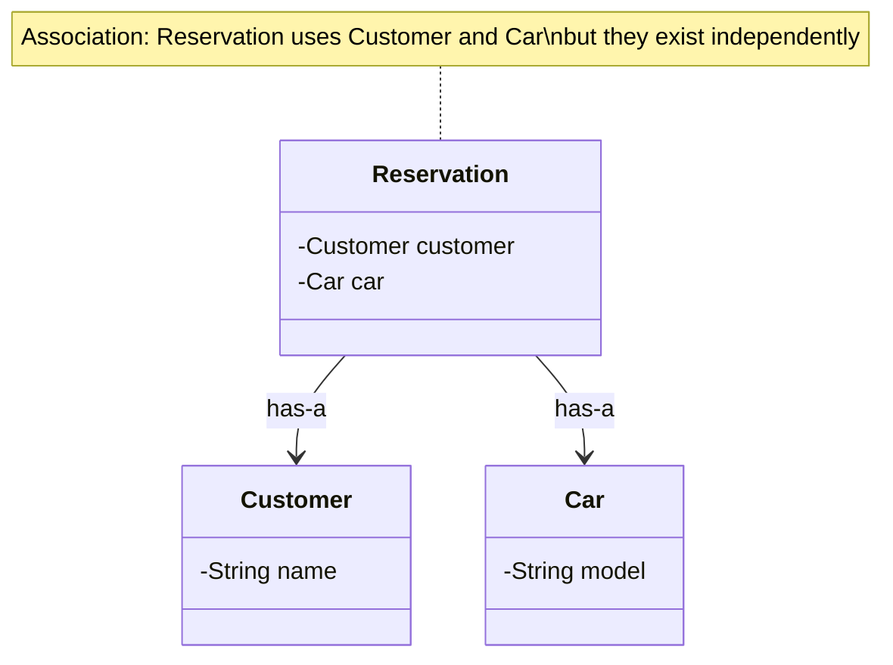
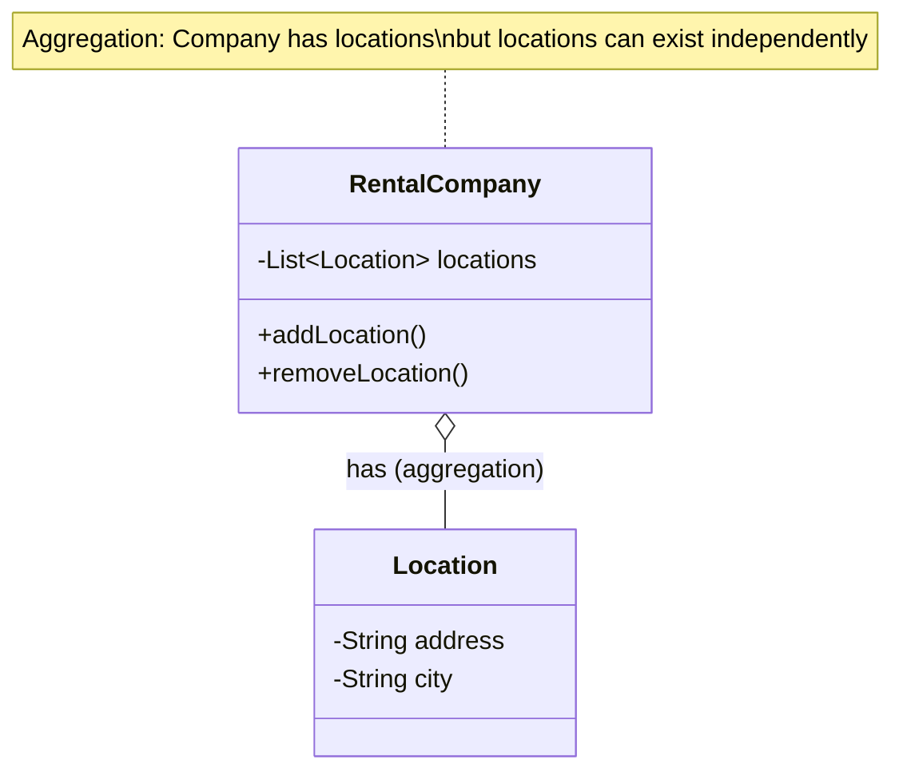
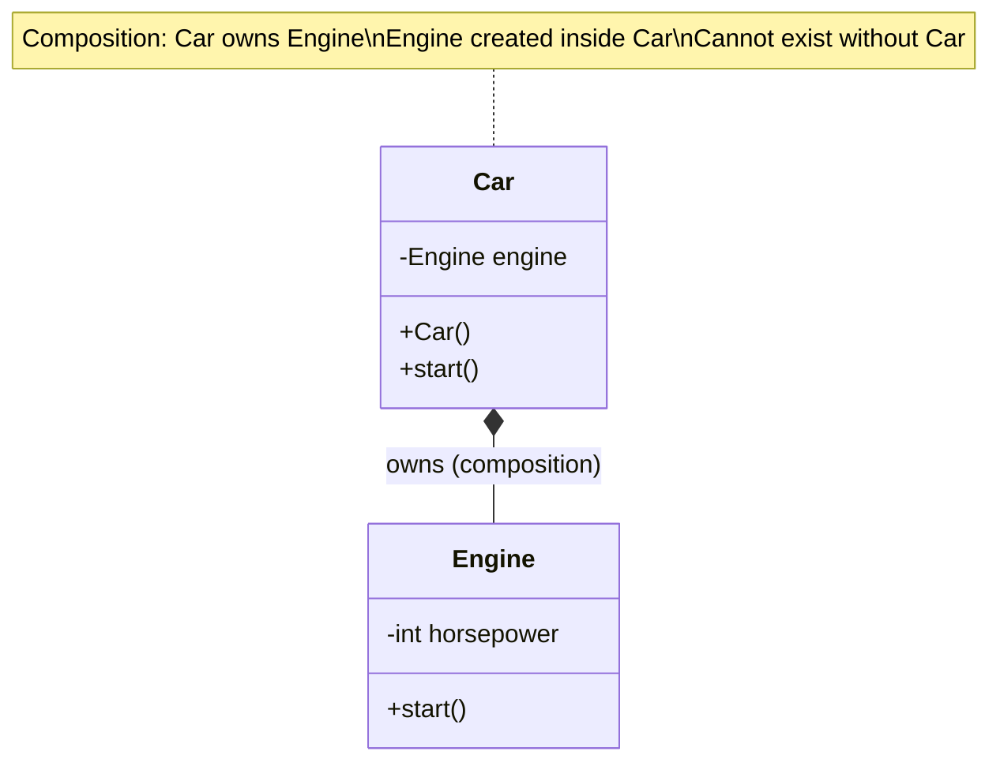
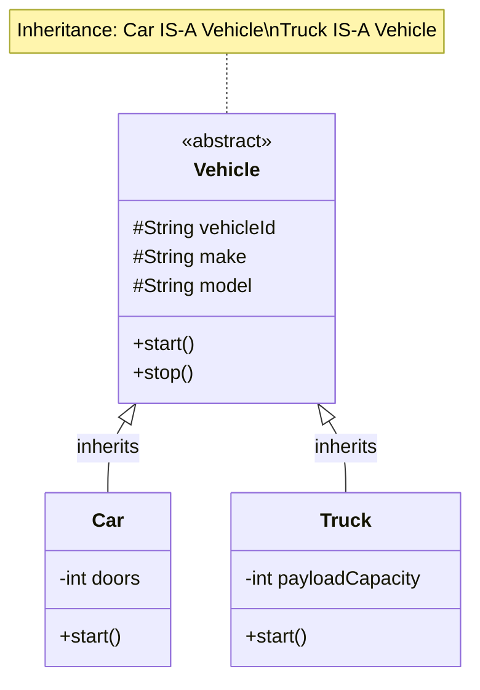
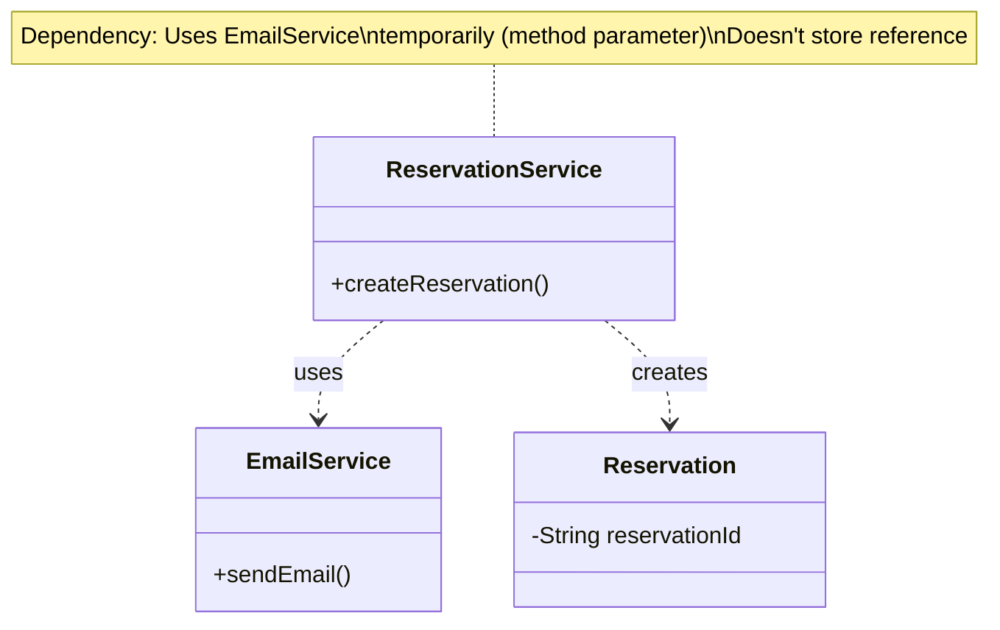

# UML Relationships & SOLID Principles

## Part 1: UML Relationships Explained

Understanding relationships is crucial for low-level design. Let's learn each type with **when to use it**, **how it looks**, and **Java code examples**.

---

## 1. Association (Weakest Relationship)

### 📖 Definition
Association represents a **"uses" or "has-a"** relationship between two classes. It's the most general relationship.

**Think of it as**: Class A knows about Class B.

---

### 🤔 When to Use?
- One class uses another class
- Objects exist independently
- Lifecycle is independent (deleting one doesn't delete the other)

---

### 📊 UML Diagram



---

### 💻 Java Code Example

```java
/**
 * ASSOCIATION EXAMPLE
 * Reservation "has-a" Customer and "has-a" Car
 * But Customer and Car exist independently
 */
public class Reservation {
    private String reservationId;
    private Customer customer;  // ✅ Association: Reservation knows about Customer
    private Car car;           // ✅ Association: Reservation knows about Car

    /**
     * IMPORTANT: Objects passed via constructor or setter
     * They are created elsewhere and passed in
     */
    public Reservation(String reservationId, Customer customer, Car car) {
        this.reservationId = reservationId;
        this.customer = customer;  // Reference to existing Customer
        this.car = car;            // Reference to existing Car
    }

    // Getters and setters
    public Customer getCustomer() { return customer; }
    public void setCustomer(Customer customer) { this.customer = customer; }

    public Car getCar() { return car; }
    public void setCar(Car car) { this.car = car; }
}

public class Customer {
    private String customerId;
    private String name;

    public Customer(String customerId, String name) {
        this.customerId = customerId;
        this.name = name;
    }
}

public class Car {
    private String carId;
    private String model;

    public Car(String carId, String model) {
        this.carId = carId;
        this.model = model;
    }
}

// Usage
Customer customer = new Customer("C1", "John");
Car car = new Car("CAR1", "Toyota Camry");

// Both customer and car exist independently
Reservation reservation = new Reservation("R1", customer, car);

// If reservation is deleted, customer and car still exist!
```

---

### 🔑 Key Characteristics of Association
- ✅ Objects passed from outside (constructor/setter)
- ✅ Independent lifecycles
- ✅ Can change the association (setCustomer(), setCar())
- ✅ Deleting one doesn't affect the other

---

## 2. Aggregation (Shared Ownership)

### 📖 Definition
Aggregation is a **special type of association** representing a **"has-a" relationship** where the **part can exist independently** of the whole.

**Think of it as**: A car rental company **has** multiple locations, but locations can exist without the company.

**Symbol**: Hollow diamond ◇

---

### 🤔 When to Use?
- "Whole-Part" relationship
- Part can exist independently
- Shared ownership (part can belong to multiple wholes)

---

### 📊 UML Diagram



---

### 💻 Java Code Example

```java
import java.util.ArrayList;
import java.util.List;

/**
 * AGGREGATION EXAMPLE
 * RentalCompany "has" Locations
 * But Locations can exist without RentalCompany
 */
public class RentalCompany {
    private String companyId;
    private String name;
    private List<Location> locations;  // ✅ Aggregation: has locations

    public RentalCompany(String companyId, String name) {
        this.companyId = companyId;
        this.name = name;
        this.locations = new ArrayList<>();
    }

    /**
     * IMPORTANT: Locations are passed from outside
     * They are NOT created inside this class
     */
    public void addLocation(Location location) {
        locations.add(location);  // Adding existing location
    }

    public void removeLocation(Location location) {
        locations.remove(location);  // Removing doesn't destroy location
    }

    public List<Location> getLocations() {
        return locations;
    }
}

public class Location {
    private String locationId;
    private String address;
    private String city;

    public Location(String locationId, String address, String city) {
        this.locationId = locationId;
        this.address = address;
        this.city = city;
    }

    // Location exists independently!
}

// Usage
Location loc1 = new Location("L1", "123 Main St", "Boston");
Location loc2 = new Location("L2", "456 Oak Ave", "New York");

RentalCompany company = new RentalCompany("RC1", "Rent-A-Car");
company.addLocation(loc1);  // Adding existing locations
company.addLocation(loc2);

// If company is deleted, locations still exist!
// Locations can be shared by multiple companies
```

---

### 🔑 Key Characteristics of Aggregation
- ✅ Hollow diamond (◇) in UML
- ✅ Part created outside the whole
- ✅ Part exists independently
- ✅ Part can be shared (belong to multiple wholes)
- ✅ Deleting whole doesn't delete parts

---

## 3. Composition (Strong Ownership)

### 📖 Definition
Composition is the **strongest ownership relationship**. The **part cannot exist** without the whole. If the whole is destroyed, parts are destroyed too.

**Think of it as**: A house **owns** rooms. If the house is destroyed, rooms are destroyed too.

**Symbol**: Filled diamond ◆

---

### 🤔 When to Use?
- Part is created by the whole
- Part cannot exist independently
- Strong ownership (exclusive, not shared)
- Lifecycle tied together

---

### 📊 UML Diagram



---

### 💻 Java Code Example

```java
/**
 * COMPOSITION EXAMPLE
 * Car "owns" Engine
 * Engine cannot exist without Car
 */
public class Car {
    private String carId;
    private String model;
    private Engine engine;  // ✅ Composition: Car owns Engine

    public Car(String carId, String model, int horsepower) {
        this.carId = carId;
        this.model = model;

        /**
         * IMPORTANT: Engine is created INSIDE Car
         * It is NOT passed from outside
         * Engine's lifecycle is tied to Car
         */
        this.engine = new Engine(horsepower);  // Created here!
    }

    public void start() {
        System.out.println("Starting car...");
        engine.start();  // Using the composed engine
    }

    // Notice: No setEngine() method!
    // Engine cannot be changed from outside
    // Engine is created and owned by Car
}

public class Engine {
    private int horsepower;

    /**
     * Package-private constructor (not public!)
     * Only Car can create Engine
     */
    Engine(int horsepower) {
        this.horsepower = horsepower;
    }

    void start() {
        System.out.println("Engine started: " + horsepower + " HP");
    }
}

// Usage
Car car = new Car("C1", "Toyota Camry", 200);
car.start();

// When car is destroyed (garbage collected), engine is also destroyed!
// You cannot create Engine independently:
// Engine engine = new Engine(200);  // ❌ Error: Engine() is not public
```

---

### 🔑 Key Characteristics of Composition
- ✅ Filled diamond (◆) in UML
- ✅ Part created INSIDE the whole (using `new`)
- ✅ Part cannot exist independently
- ✅ Strong exclusive ownership
- ✅ Deleting whole automatically deletes parts
- ✅ No setter for composed object (usually)

---

## 4. Inheritance (Is-A Relationship)

### 📖 Definition
Inheritance represents an **"is-a" relationship**. A subclass inherits properties and behaviors from a superclass.

**Think of it as**: A truck **is-a** car. An SUV **is-a** car.

**Symbol**: Hollow triangle arrow pointing to parent

---

### 🤔 When to Use?
- Subclass is a specialized version of superclass
- "Is-a" relationship makes sense
- Share common behavior
- Polymorphism needed

---

### 📊 UML Diagram



---

### 💻 Java Code Example

```java
/**
 * INHERITANCE EXAMPLE
 * Car IS-A Vehicle
 * Truck IS-A Vehicle
 */
public abstract class Vehicle {
    // Protected: accessible to subclasses
    protected String vehicleId;
    protected String make;
    protected String model;
    protected int year;

    public Vehicle(String vehicleId, String make, String model, int year) {
        this.vehicleId = vehicleId;
        this.make = make;
        this.model = model;
        this.year = year;
    }

    /**
     * Common behavior for all vehicles
     */
    public void start() {
        System.out.println(make + " " + model + " started");
    }

    public void stop() {
        System.out.println(make + " " + model + " stopped");
    }

    /**
     * Abstract method: subclasses must implement
     */
    public abstract double calculateRentalCost(int days);

    // Getters
    public String getVehicleId() { return vehicleId; }
    public String getMake() { return make; }
}

/**
 * Car IS-A Vehicle
 */
public class Car extends Vehicle {
    private int numberOfDoors;
    private double dailyRate;

    public Car(String vehicleId, String make, String model, int year, double dailyRate) {
        super(vehicleId, make, model, year);  // Call parent constructor
        this.dailyRate = dailyRate;
    }

    /**
     * Override: Car-specific implementation
     */
    @Override
    public double calculateRentalCost(int days) {
        return days * dailyRate;
    }

    /**
     * Car-specific method
     */
    public void openTrunk() {
        System.out.println("Trunk opened");
    }
}

/**
 * Truck IS-A Vehicle
 */
public class Truck extends Vehicle {
    private int payloadCapacity;  // in kg
    private double dailyRate;

    public Truck(String vehicleId, String make, String model, int year, double dailyRate) {
        super(vehicleId, make, model, year);
        this.dailyRate = dailyRate;
    }

    /**
     * Override: Truck-specific implementation (more expensive!)
     */
    @Override
    public double calculateRentalCost(int days) {
        return days * dailyRate * 1.5;  // Trucks cost 50% more
    }

    /**
     * Truck-specific method
     */
    public void loadCargo(int weight) {
        if (weight <= payloadCapacity) {
            System.out.println("Cargo loaded: " + weight + " kg");
        } else {
            System.out.println("Exceeds payload capacity!");
        }
    }
}

// Usage - Polymorphism!
Vehicle vehicle1 = new Car("C1", "Toyota", "Camry", 2023, 50.0);
Vehicle vehicle2 = new Truck("T1", "Ford", "F-150", 2023, 80.0);

// Both can be treated as Vehicle
vehicle1.start();  // Common behavior
vehicle2.start();

// Each has its own implementation
System.out.println(vehicle1.calculateRentalCost(3));  // Car calculation
System.out.println(vehicle2.calculateRentalCost(3));  // Truck calculation
```

---

### 🔑 Key Characteristics of Inheritance
- ✅ Hollow triangle arrow in UML
- ✅ Subclass inherits fields and methods from superclass
- ✅ Enables polymorphism
- ✅ "Is-a" relationship
- ✅ Use `extends` keyword in Java

---

## 5. Dependency (Uses Relationship)

### 📖 Definition
Dependency is the **weakest relationship**. One class temporarily **uses** another class (as method parameter, local variable, or return type).

**Think of it as**: ReservationService **uses** EmailService to send emails, but doesn't store a reference.

**Symbol**: Dashed arrow - - - >

---

### 🤔 When to Use?
- Class uses another temporarily (not as field)
- Method parameter
- Local variable
- Return type

---

### 📊 UML Diagram



---

### 💻 Java Code Example

```java
/**
 * DEPENDENCY EXAMPLE
 * ReservationService depends on EmailService
 * But doesn't store EmailService as a field
 */
public class ReservationService {
    private ReservationRepository reservationRepo;

    /**
     * EmailService is a method parameter (dependency)
     * Used temporarily, not stored
     */
    public Reservation createReservation(
            Customer customer,
            Car car,
            Date startDate,
            Date endDate,
            EmailService emailService) {  // ✅ Dependency: method parameter

        // Create reservation
        Reservation reservation = new Reservation("R1", customer, car);
        reservation.setStartDate(startDate);
        reservation.setEndDate(endDate);

        // Save to database
        reservationRepo.save(reservation);

        // Use EmailService temporarily
        emailService.sendEmail(
            customer.getEmail(),
            "Reservation Confirmed",
            "Your reservation is confirmed!"
        );  // ✅ Used only in this method

        return reservation;
    }
}

public class EmailService {
    public void sendEmail(String to, String subject, String body) {
        System.out.println("Sending email to: " + to);
        System.out.println("Subject: " + subject);
    }
}

// Usage
EmailService emailService = new EmailService();
ReservationService reservationService = new ReservationService();

reservationService.createReservation(
    customer,
    car,
    startDate,
    endDate,
    emailService  // Passed as parameter
);
```

---

### 🔑 Key Characteristics of Dependency
- ✅ Dashed arrow in UML
- ✅ Temporary usage (method parameter, local variable)
- ✅ Not stored as field
- ✅ Weakest coupling

---

## 🎓 UML Relationships Summary Table

| Relationship | Symbol | Strength | Lifecycle | Java Code Pattern | Example |
|--------------|--------|----------|-----------|-------------------|---------|
| **Association** | → | Weak | Independent | `private Customer customer;`<br/>passed via constructor/setter | Reservation → Customer |
| **Aggregation** | ◇→ | Medium | Independent | `private List<Location> locations;`<br/>objects passed from outside | Company ◇→ Location |
| **Composition** | ◆→ | Strong | Dependent | `private Engine engine = new Engine();`<br/>created inside | Car ◆→ Engine |
| **Inheritance** | △ | Strong | N/A | `class Car extends Vehicle` | Car △ Vehicle |
| **Dependency** | - - → | Weakest | Temporary | method parameter or local variable | Service - - → EmailService |

---

## 🎯 How to Choose? Decision Tree

```
Is class B passed as method parameter only?
├─ YES → Dependency (- - →)
└─ NO → Is class B created inside class A (using 'new')?
    ├─ YES → Can B exist without A?
    │   ├─ NO → Composition (◆)
    │   └─ YES → Check again (probably should be aggregation)
    └─ NO → Is class B passed from outside?
        ├─ YES → Can B be shared by multiple objects?
            ├─ YES → Aggregation (◇)
            └─ NO → Association (→)
        └─ Is A a specialized version of B?
            └─ YES → Inheritance (△)
```

---

# Part 2: SOLID Principles

SOLID principles make code **maintainable**, **extensible**, and **testable**.

---

## 1. Single Responsibility Principle (SRP)

### 📖 Definition
**A class should have only ONE reason to change.**

Each class should do ONE thing and do it well.

---

### ❌ Bad Example (Violates SRP)

```java
/**
 * BAD: This class does TOO MUCH
 * It handles reservations, payments, emails, and database!
 */
public class ReservationManager {
    /**
     * Reason to change #1: Reservation logic changes
     */
    public Reservation createReservation(Customer customer, Car car) {
        Reservation reservation = new Reservation(...);
        return reservation;
    }

    /**
     * Reason to change #2: Payment gateway changes (Stripe → PayPal)
     */
    public void processPayment(double amount, String cardNumber) {
        // Call Stripe API
        HttpClient client = new HttpClient();
        client.post("https://api.stripe.com/charge", ...);
    }

    /**
     * Reason to change #3: Email service changes (SendGrid → Mailgun)
     */
    public void sendConfirmationEmail(String email) {
        // Send email via SendGrid
        System.out.println("Sending email to: " + email);
    }

    /**
     * Reason to change #4: Database changes (MySQL → PostgreSQL)
     */
    public void saveToDatabase(Reservation reservation) {
        // SQL code
        Connection conn = DriverManager.getConnection(...);
        PreparedStatement stmt = conn.prepareStatement("INSERT ...");
    }
}
```

**Problems**:
- ❌ 4 reasons to change → violates SRP
- ❌ Hard to test (how to test email sending?)
- ❌ Tight coupling (reservation logic mixed with payment, email, database)

---

### ✅ Good Example (Follows SRP)

```java
/**
 * GOOD: Each class has ONE responsibility
 */

// Responsibility: Reservation business logic
public class ReservationService {
    private PaymentService paymentService;
    private EmailService emailService;
    private ReservationRepository reservationRepo;

    public Reservation createReservation(Customer customer, Car car) {
        Reservation reservation = new Reservation(...);
        reservationRepo.save(reservation);
        paymentService.processPayment(...);
        emailService.sendConfirmation(...);
        return reservation;
    }
}

// Responsibility: Payment processing
public class PaymentService {
    public void processPayment(double amount, String cardNumber) {
        // Only handles payments
    }
}

// Responsibility: Email sending
public class EmailService {
    public void sendConfirmation(String email) {
        // Only sends emails
    }
}

// Responsibility: Database access
public class ReservationRepository {
    public void save(Reservation reservation) {
        // Only handles database
    }
}
```

**Benefits**:
- ✅ Each class has ONE reason to change
- ✅ Easy to test (mock dependencies)
- ✅ Easy to modify (change payment without touching email)

---

## 2. Open/Closed Principle (OCP)

### 📖 Definition
**Classes should be OPEN for extension but CLOSED for modification.**

You should be able to add new features **without changing existing code**.

---

### ❌ Bad Example (Violates OCP)

```java
/**
 * BAD: Every new payment method requires modifying this class
 */
public class PaymentService {
    public void processPayment(double amount, String method) {
        if (method.equals("CREDIT_CARD")) {
            // Process credit card
            callStripeAPI(amount);
        } else if (method.equals("PAYPAL")) {
            // Process PayPal
            callPayPalAPI(amount);
        } else if (method.equals("CRYPTO")) {
            // Process Crypto
            sendToBlockchain(amount);
        }
        // ❌ To add Apple Pay, we must MODIFY this class!
        // ❌ Violates Open/Closed Principle
    }
}
```

---

### ✅ Good Example (Follows OCP)

```java
/**
 * GOOD: Strategy Pattern enables OCP
 * Add new payment methods WITHOUT modifying existing code
 */

// Interface (abstraction)
public interface PaymentStrategy {
    boolean processPayment(double amount);
}

// Existing implementations
public class CreditCardPaymentStrategy implements PaymentStrategy {
    public boolean processPayment(double amount) {
        return callStripeAPI(amount);
    }
}

public class PayPalPaymentStrategy implements PaymentStrategy {
    public boolean processPayment(double amount) {
        return callPayPalAPI(amount);
    }
}

// ✅ Adding new payment method: NO modification to existing code!
public class ApplePayPaymentStrategy implements PaymentStrategy {
    public boolean processPayment(double amount) {
        return callApplePayAPI(amount);
    }
}

// Service uses the strategy
public class PaymentService {
    private PaymentStrategy strategy;

    public void setStrategy(PaymentStrategy strategy) {
        this.strategy = strategy;
    }

    public boolean processPayment(double amount) {
        return strategy.processPayment(amount);  // Delegates to strategy
    }
}
```

**Benefits**:
- ✅ Add new payment methods by creating new classes (OPEN for extension)
- ✅ No need to modify PaymentService (CLOSED for modification)
- ✅ Existing code remains untouched and stable

---

## 3. Liskov Substitution Principle (LSP)

### 📖 Definition
**Subclasses should be substitutable for their base classes.**

If class B inherits from class A, you should be able to use B anywhere A is expected without breaking the program.

---

### ❌ Bad Example (Violates LSP)

```java
/**
 * BAD: Square violates LSP
 */
class Rectangle {
    protected int width;
    protected int height;

    public void setWidth(int width) { this.width = width; }
    public void setHeight(int height) { this.height = height; }

    public int getArea() { return width * height; }
}

class Square extends Rectangle {
    /**
     * ❌ Violates LSP: Square overrides behavior in unexpected way
     */
    @Override
    public void setWidth(int width) {
        this.width = width;
        this.height = width;  // Square must have equal sides
    }

    @Override
    public void setHeight(int height) {
        this.width = height;
        this.height = height;
    }
}

// Problem demonstration
void testRectangle(Rectangle rect) {
    rect.setWidth(5);
    rect.setHeight(4);
    assert rect.getArea() == 20;  // Expect 5 * 4 = 20
}

Rectangle rect = new Rectangle();
testRectangle(rect);  // ✅ Works: area = 20

Square square = new Square();
testRectangle(square);  // ❌ FAILS: area = 16 (not 20!)
// Square changed behavior unexpectedly!
```

---

### ✅ Good Example (Follows LSP)

```java
/**
 * GOOD: Use composition, not inheritance
 */
abstract class Shape {
    public abstract int getArea();
}

class Rectangle extends Shape {
    private int width;
    private int height;

    public Rectangle(int width, int height) {
        this.width = width;
        this.height = height;
    }

    public int getArea() {
        return width * height;
    }
}

class Square extends Shape {
    private int side;

    public Square(int side) {
        this.side = side;
    }

    public int getArea() {
        return side * side;
    }
}

// Both can be substituted for Shape
void calculateArea(Shape shape) {
    System.out.println("Area: " + shape.getArea());
}

calculateArea(new Rectangle(5, 4));  // ✅ Works
calculateArea(new Square(5));        // ✅ Works
```

---

## 4. Interface Segregation Principle (ISP)

### 📖 Definition
**Clients should not be forced to depend on interfaces they don't use.**

Create small, focused interfaces instead of large, bloated ones.

---

### ❌ Bad Example (Violates ISP)

```java
/**
 * BAD: Fat interface forces implementations to implement unused methods
 */
interface Worker {
    void work();
    void eat();
    void sleep();
    void getMaintenance();  // Only for robot workers!
}

class HumanWorker implements Worker {
    public void work() { System.out.println("Human working"); }
    public void eat() { System.out.println("Human eating"); }
    public void sleep() { System.out.println("Human sleeping"); }

    public void getMaintenance() {
        // ❌ Humans don't need maintenance!
        // Forced to implement unused method
        throw new UnsupportedOperationException();
    }
}

class RobotWorker implements Worker {
    public void work() { System.out.println("Robot working"); }
    public void getMaintenance() { System.out.println("Robot maintenance"); }

    public void eat() {
        // ❌ Robots don't eat!
        throw new UnsupportedOperationException();
    }

    public void sleep() {
        // ❌ Robots don't sleep!
        throw new UnsupportedOperationException();
    }
}
```

---

### ✅ Good Example (Follows ISP)

```java
/**
 * GOOD: Small, focused interfaces
 */
interface Workable {
    void work();
}

interface Eatable {
    void eat();
}

interface Sleepable {
    void sleep();
}

interface Maintainable {
    void getMaintenance();
}

// Human implements only what it needs
class HumanWorker implements Workable, Eatable, Sleepable {
    public void work() { System.out.println("Human working"); }
    public void eat() { System.out.println("Human eating"); }
    public void sleep() { System.out.println("Human sleeping"); }
}

// Robot implements only what it needs
class RobotWorker implements Workable, Maintainable {
    public void work() { System.out.println("Robot working"); }
    public void getMaintenance() { System.out.println("Robot maintenance"); }
}
```

**Benefits**:
- ✅ Classes implement only what they need
- ✅ No unused methods
- ✅ Clear, focused contracts

---

## 5. Dependency Inversion Principle (DIP)

### 📖 Definition
**Depend on abstractions, not concretions.**

High-level modules should not depend on low-level modules. Both should depend on abstractions (interfaces).

---

### ❌ Bad Example (Violates DIP)

```java
/**
 * BAD: High-level class depends on low-level concrete class
 */

// Low-level class
class MySQLDatabase {
    public void save(String data) {
        System.out.println("Saving to MySQL: " + data);
    }
}

// High-level class
class ReservationService {
    private MySQLDatabase database;  // ❌ Depends on concrete class!

    public ReservationService() {
        this.database = new MySQLDatabase();  // ❌ Tightly coupled!
    }

    public void createReservation(Reservation reservation) {
        database.save(reservation.toString());
        // ❌ If we want to switch to PostgreSQL, we must modify this class!
    }
}
```

---

### ✅ Good Example (Follows DIP)

```java
/**
 * GOOD: Depend on abstraction (interface)
 */

// Abstraction
interface Database {
    void save(String data);
}

// Low-level implementations
class MySQLDatabase implements Database {
    public void save(String data) {
        System.out.println("Saving to MySQL: " + data);
    }
}

class PostgreSQLDatabase implements Database {
    public void save(String data) {
        System.out.println("Saving to PostgreSQL: " + data);
    }
}

class MongoDBDatabase implements Database {
    public void save(String data) {
        System.out.println("Saving to MongoDB: " + data);
    }
}

// High-level class
class ReservationService {
    private Database database;  // ✅ Depends on abstraction!

    /**
     * Dependency injected via constructor
     */
    public ReservationService(Database database) {
        this.database = database;  // ✅ Can be ANY implementation!
    }

    public void createReservation(Reservation reservation) {
        database.save(reservation.toString());
        // ✅ Works with MySQL, PostgreSQL, MongoDB, or in-memory!
    }
}

// Usage
Database db = new MySQLDatabase();
ReservationService service = new ReservationService(db);

// Easy to switch!
Database db2 = new PostgreSQLDatabase();
ReservationService service2 = new ReservationService(db2);

// Easy to test!
Database mockDb = new InMemoryDatabase();
ReservationService service3 = new ReservationService(mockDb);
```

**Benefits**:
- ✅ Easy to switch implementations
- ✅ Easy to test (inject mocks)
- ✅ Loose coupling

---

## 🎓 SOLID Principles Summary

| Principle | Mnemonic | Key Idea | Example |
|-----------|----------|----------|---------|
| **S**ingle Responsibility | One job | One class, one reason to change | ReservationService, PaymentService (separate) |
| **O**pen/Closed | Add, don't modify | Extend via new classes, not modifying old ones | PaymentStrategy (add new strategies) |
| **L**iskov Substitution | Subclass swap | Subclasses work anywhere parent works | Any PaymentStrategy works |
| **I**nterface Segregation | Small interfaces | Many small interfaces > one big interface | Workable, Eatable (separate) |
| **D**ependency Inversion | Abstract dependencies | Depend on interfaces, not classes | ReservationService → Database interface |

---

## Next Steps
✅ UML relationships explained
✅ SOLID principles with examples
➡️ Design patterns documentation
➡️ Sequence diagrams
➡️ Database schema
