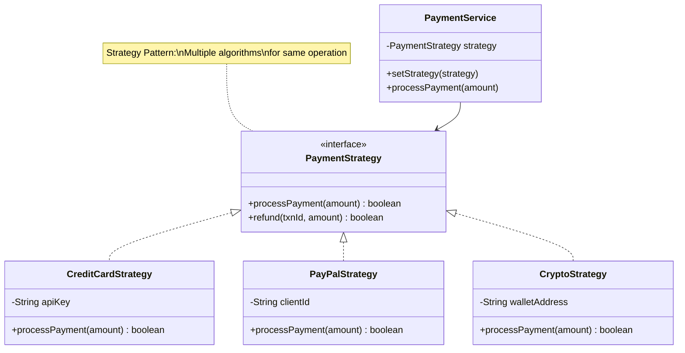
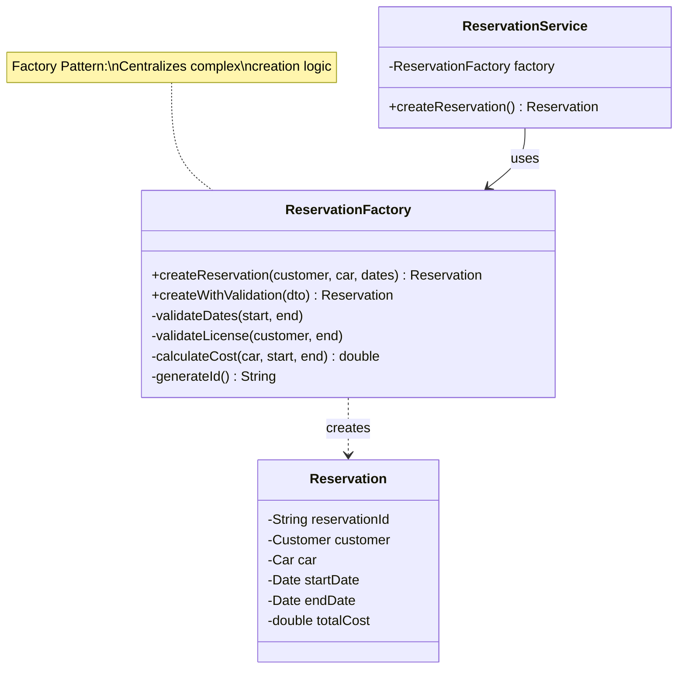
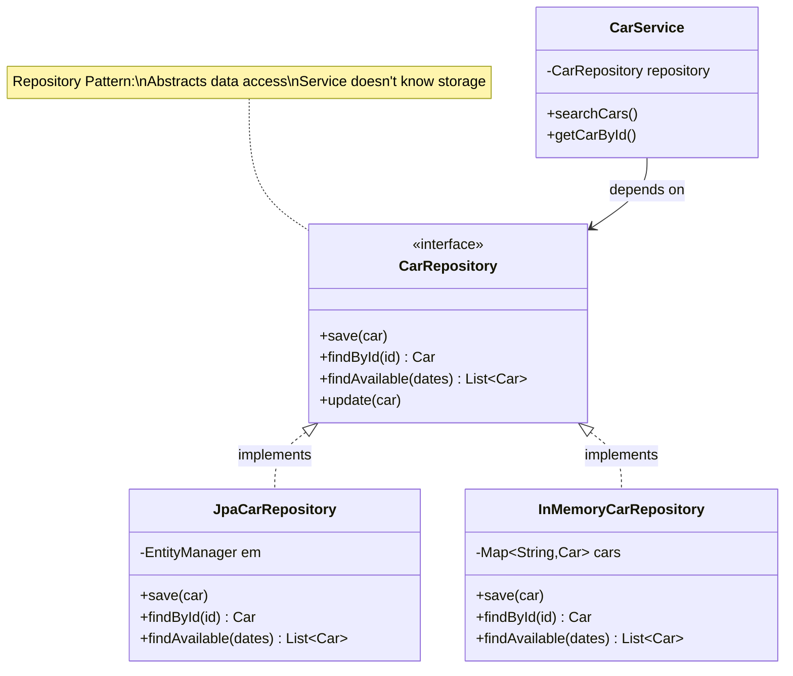
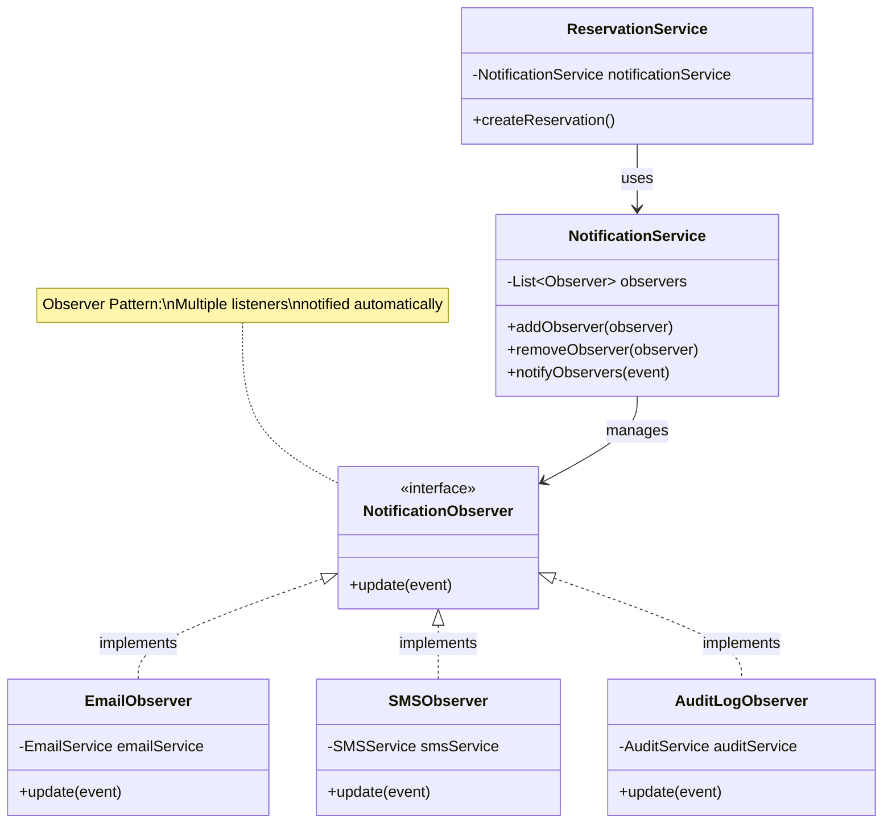

# Design Patterns in Car Rental System

## Overview
Design patterns are reusable solutions to common software design problems. This document explains the patterns used in our car rental system.

---

## Pattern 1: Strategy Pattern (Payment Processing)

### 🎯 Problem
We need to support multiple payment methods (Credit Card, PayPal, Crypto). Each has different implementation logic.

**Bad approach**: Giant if-else chains that violate Open/Closed Principle.

---

### 🔧 Solution
Strategy Pattern: Define a family of algorithms, encapsulate each one, and make them interchangeable.

---

### 📊 UML Diagram



---

### 💻 Java Implementation

```java
// Strategy Interface
public interface PaymentStrategy {
    boolean processPayment(double amount, PaymentDetails details);
    boolean refund(String transactionId, double amount);
    String getProviderName();
}

// Concrete Strategy 1: Credit Card
public class CreditCardStrategy implements PaymentStrategy {
    private String apiKey;
    private PaymentGateway gateway;

    public CreditCardStrategy(String apiKey) {
        this.apiKey = apiKey;
        this.gateway = new StripeGateway(apiKey);
    }

    @Override
    public boolean processPayment(double amount, PaymentDetails details) {
        System.out.println("Processing via Stripe...");
        try {
            TransactionResult result = gateway.charge(amount, details);
            return result.isSuccess();
        } catch (Exception e) {
            System.err.println("Payment failed: " + e.getMessage());
            return false;
        }
    }

    @Override
    public boolean refund(String transactionId, double amount) {
        return gateway.refund(transactionId, amount);
    }

    @Override
    public String getProviderName() {
        return "Stripe (Credit Card)";
    }
}

// Concrete Strategy 2: PayPal
public class PayPalStrategy implements PaymentStrategy {
    private String clientId;
    private String clientSecret;

    public PayPalStrategy(String clientId, String clientSecret) {
        this.clientId = clientId;
        this.clientSecret = clientSecret;
    }

    @Override
    public boolean processPayment(double amount, PaymentDetails details) {
        System.out.println("Processing via PayPal...");
        // OAuth authentication
        String accessToken = authenticateWithPayPal();
        // Process payment
        return callPayPalAPI(accessToken, amount, details);
    }

    @Override
    public boolean refund(String transactionId, double amount) {
        // PayPal refund logic
        return true;
    }

    @Override
    public String getProviderName() {
        return "PayPal";
    }

    private String authenticateWithPayPal() {
        // OAuth flow
        return "access_token_xyz";
    }

    private boolean callPayPalAPI(String token, double amount, PaymentDetails details) {
        // REST API call to PayPal
        return true;
    }
}

// Context: PaymentService
public class PaymentService {
    private PaymentStrategy strategy;
    private PaymentRepository paymentRepo;

    // Set strategy at runtime
    public void setStrategy(PaymentStrategy strategy) {
        this.strategy = strategy;
    }

    // Delegate to strategy
    public Payment processPayment(Reservation reservation, PaymentMethod method) {
        // Select strategy based on payment method
        selectStrategy(method);

        // Process payment using selected strategy
        double amount = reservation.getTotalCost();
        PaymentDetails details = new PaymentDetails(...);

        boolean success = strategy.processPayment(amount, details);

        // Create payment record
        Payment payment = new Payment(generateId(), reservation, amount);
        if (success) {
            payment.markCompleted("TXN-123");
        } else {
            payment.markFailed();
        }

        paymentRepo.save(payment);
        return payment;
    }

    private void selectStrategy(PaymentMethod method) {
        switch (method) {
            case CREDIT_CARD:
                this.strategy = new CreditCardStrategy("sk_test_123");
                break;
            case PAYPAL:
                this.strategy = new PayPalStrategy("client_id", "secret");
                break;
            case CRYPTO:
                this.strategy = new CryptoStrategy("wallet_address");
                break;
        }
    }
}

// Usage
PaymentService paymentService = new PaymentService();
Reservation reservation = ...;

// Process credit card payment
Payment payment = paymentService.processPayment(reservation, PaymentMethod.CREDIT_CARD);

// Process PayPal payment
Payment payment2 = paymentService.processPayment(reservation, PaymentMethod.PAYPAL);
```

---

### ✅ Benefits

1. **Open/Closed**: Add new payment method without modifying existing code
2. **Single Responsibility**: Each strategy handles one payment method
3. **Testability**: Easy to test each strategy independently
4. **Flexibility**: Switch strategies at runtime

---

### 🎓 When to Use Strategy Pattern?

- ✅ Multiple algorithms for the same task
- ✅ Need to switch algorithms at runtime
- ✅ Avoid giant if-else or switch statements
- ✅ Each algorithm has different implementation

---

## Pattern 2: Factory Pattern (Object Creation)

### 🎯 Problem
Creating a Reservation involves complex validation and calculation logic. We don't want this complexity in the service.

---

### 🔧 Solution
Factory Pattern: Centralize complex object creation logic.

---

### 📊 UML Diagram



---

### 💻 Java Implementation

```java
import java.util.Date;
import java.util.UUID;
import java.util.concurrent.TimeUnit;

/**
 * Factory for creating Reservation objects with validation.
 */
public class ReservationFactory {

    /**
     * Creates a validated reservation with calculated cost.
     */
    public Reservation createReservation(
            Customer customer,
            Car car,
            Date startDate,
            Date endDate) {

        // Step 1: Validate all inputs
        validateDates(startDate, endDate);
        validateCustomer(customer);
        validateCustomerLicense(customer, endDate);
        validateCar(car);

        // Step 2: Generate unique ID
        String reservationId = generateReservationId();

        // Step 3: Create reservation object
        Reservation reservation = new Reservation(reservationId, customer, car);
        reservation.setStartDate(startDate);
        reservation.setEndDate(endDate);

        // Step 4: Calculate total cost
        double totalCost = calculateTotalCost(car, startDate, endDate);
        reservation.setTotalCost(totalCost);

        // Step 5: Set initial status
        reservation.setStatus(ReservationStatus.PENDING_PAYMENT);

        // Step 6: Return fully constructed reservation
        return reservation;
    }

    /**
     * Creates reservation from DTO with validation.
     */
    public Reservation createWithValidation(ReservationDTO dto) {
        // Fetch objects from IDs
        Customer customer = fetchCustomer(dto.getCustomerId());
        Car car = fetchCar(dto.getCarId());

        return createReservation(customer, car, dto.getStartDate(), dto.getEndDate());
    }

    // ========== PRIVATE VALIDATION METHODS ==========

    private void validateDates(Date startDate, Date endDate) {
        if (startDate == null || endDate == null) {
            throw new IllegalArgumentException("Dates cannot be null");
        }

        Date now = new Date();
        if (startDate.before(now)) {
            throw new IllegalArgumentException("Start date must be in future");
        }

        if (endDate.before(startDate)) {
            throw new IllegalArgumentException("End date must be after start date");
        }

        // Maximum 6 months advance booking
        long daysInAdvance = TimeUnit.MILLISECONDS.toDays(
            startDate.getTime() - now.getTime()
        );
        if (daysInAdvance > 180) {
            throw new IllegalArgumentException("Cannot book more than 6 months ahead");
        }

        // Minimum 1 day rental
        long rentalDays = TimeUnit.MILLISECONDS.toDays(
            endDate.getTime() - startDate.getTime()
        );
        if (rentalDays < 1) {
            throw new IllegalArgumentException("Minimum rental period is 1 day");
        }
    }

    private void validateCustomer(Customer customer) {
        if (customer == null) {
            throw new IllegalArgumentException("Customer is required");
        }
        if (customer.getEmail() == null || customer.getEmail().isEmpty()) {
            throw new IllegalArgumentException("Customer email is required");
        }
    }

    private void validateCustomerLicense(Customer customer, Date rentalEndDate) {
        if (customer.getDriverLicense() == null) {
            throw new IllegalArgumentException("Driver license is required");
        }

        if (!customer.isLicenseValidForRental(rentalEndDate)) {
            throw new IllegalArgumentException(
                "Driver license expired or will expire during rental"
            );
        }

        // Assume minimum age 21 (could add age check here)
    }

    private void validateCar(Car car) {
        if (car == null) {
            throw new IllegalArgumentException("Car is required");
        }
        if (car.getStatus() != CarStatus.AVAILABLE) {
            throw new IllegalArgumentException("Car is not available");
        }
        if (car.getDailyRate() <= 0) {
            throw new IllegalArgumentException("Invalid daily rate");
        }
    }

    // ========== PRIVATE HELPER METHODS ==========

    private double calculateTotalCost(Car car, Date startDate, Date endDate) {
        long diffInMillis = endDate.getTime() - startDate.getTime();
        long days = TimeUnit.MILLISECONDS.toDays(diffInMillis);

        // Minimum 1 day
        if (days < 1) {
            days = 1;
        }

        // Calculate base cost
        double baseCost = days * car.getDailyRate();

        // Apply discounts for long rentals (optional)
        if (days >= 7) {
            baseCost *= 0.9;  // 10% discount for week+
        }
        if (days >= 30) {
            baseCost *= 0.85;  // 15% discount for month+
        }

        return baseCost;
    }

    private String generateReservationId() {
        return "RES-" + UUID.randomUUID().toString().substring(0, 8).toUpperCase();
    }

    private Customer fetchCustomer(String customerId) {
        // In real implementation, fetch from repository
        return null;
    }

    private Car fetchCar(String carId) {
        // In real implementation, fetch from repository
        return null;
    }
}

// Usage in Service
public class ReservationService {
    private ReservationFactory factory;
    private ReservationRepository reservationRepo;

    public Reservation createReservation(
            String customerId,
            String carId,
            Date startDate,
            Date endDate) throws Exception {

        // Get customer and car
        Customer customer = customerService.getCustomerById(customerId);
        Car car = carService.getCarById(carId);

        // Use factory to create validated reservation
        Reservation reservation = factory.createReservation(
            customer,
            car,
            startDate,
            endDate
        );

        // Save to database
        reservationRepo.save(reservation);

        return reservation;
    }
}
```

---

### ✅ Benefits

1. **Single Responsibility**: Creation logic separated from business logic
2. **Consistency**: All reservations created the same way
3. **Validation**: Centralized validation logic
4. **Reusability**: Factory can be used by multiple services
5. **Testability**: Easy to test creation logic independently

---

### 🎓 When to Use Factory Pattern?

- ✅ Object creation is complex (validation, calculations)
- ✅ Multiple steps required to create object
- ✅ Need consistency in object creation
- ✅ Creation logic scattered across codebase

---

## Pattern 3: Repository Pattern (Data Access)

### 🎯 Problem
Services shouldn't know HOW data is stored (MySQL? MongoDB? In-memory?). We need abstraction.

---

### 🔧 Solution
Repository Pattern: Interface for data access, hiding storage details.

---

### 📊 UML Diagram



---

### 💻 Java Implementation

```java
// Repository Interface
public interface CarRepository {
    void save(Car car);
    Car findById(String carId);
    List<Car> findAll();
    List<Car> findByStatus(CarStatus status);
    List<Car> findAvailable(Date startDate, Date endDate, String location);
    void update(Car car);
    void delete(String carId);
}

// Implementation 1: JPA (Production)
import javax.persistence.EntityManager;
import javax.persistence.TypedQuery;

public class JpaCarRepository implements CarRepository {
    private EntityManager entityManager;

    public JpaCarRepository(EntityManager entityManager) {
        this.entityManager = entityManager;
    }

    @Override
    public void save(Car car) {
        entityManager.persist(car);
    }

    @Override
    public Car findById(String carId) {
        return entityManager.find(Car.class, carId);
    }

    @Override
    public List<Car> findAll() {
        TypedQuery<Car> query = entityManager.createQuery(
            "SELECT c FROM Car c",
            Car.class
        );
        return query.getResultList();
    }

    @Override
    public List<Car> findByStatus(CarStatus status) {
        TypedQuery<Car> query = entityManager.createQuery(
            "SELECT c FROM Car c WHERE c.status = :status",
            Car.class
        );
        query.setParameter("status", status);
        return query.getResultList();
    }

    @Override
    public List<Car> findAvailable(Date startDate, Date endDate, String location) {
        // Complex query: Find cars with no overlapping reservations
        TypedQuery<Car> query = entityManager.createQuery(
            "SELECT c FROM Car c " +
            "WHERE c.status = 'AVAILABLE' " +
            "  AND c.location.city = :location " +
            "  AND c.carId NOT IN (" +
            "    SELECT r.car.carId FROM Reservation r " +
            "    WHERE r.startDate <= :endDate " +
            "      AND r.endDate >= :startDate " +
            "      AND r.status != 'CANCELLED'" +
            "  )",
            Car.class
        );
        query.setParameter("location", location);
        query.setParameter("startDate", startDate);
        query.setParameter("endDate", endDate);
        return query.getResultList();
    }

    @Override
    public void update(Car car) {
        entityManager.merge(car);
    }

    @Override
    public void delete(String carId) {
        Car car = findById(carId);
        if (car != null) {
            car.setStatus(CarStatus.RETIRED);  // Soft delete
            entityManager.merge(car);
        }
    }
}

// Implementation 2: In-Memory (Testing)
import java.util.*;
import java.util.stream.Collectors;

public class InMemoryCarRepository implements CarRepository {
    private Map<String, Car> cars;

    public InMemoryCarRepository() {
        this.cars = new HashMap<>();
    }

    @Override
    public void save(Car car) {
        cars.put(car.getCarId(), car);
    }

    @Override
    public Car findById(String carId) {
        return cars.get(carId);
    }

    @Override
    public List<Car> findAll() {
        return new ArrayList<>(cars.values());
    }

    @Override
    public List<Car> findByStatus(CarStatus status) {
        return cars.values().stream()
            .filter(car -> car.getStatus() == status)
            .collect(Collectors.toList());
    }

    @Override
    public List<Car> findAvailable(Date startDate, Date endDate, String location) {
        return cars.values().stream()
            .filter(car -> car.getStatus() == CarStatus.AVAILABLE)
            .filter(car -> car.getLocation().getCity().equals(location))
            .collect(Collectors.toList());
    }

    @Override
    public void update(Car car) {
        cars.put(car.getCarId(), car);
    }

    @Override
    public void delete(String carId) {
        Car car = cars.get(carId);
        if (car != null) {
            car.setStatus(CarStatus.RETIRED);
        }
    }
}

// Service uses interface (doesn't know implementation)
public class CarService {
    private CarRepository carRepository;  // Interface!

    // Dependency injection
    public CarService(CarRepository carRepository) {
        this.carRepository = carRepository;  // Can be ANY implementation
    }

    public List<Car> searchAvailableCars(Date startDate, Date endDate, String location) {
        return carRepository.findAvailable(startDate, endDate, location);
    }

    public Car getCarById(String carId) {
        return carRepository.findById(carId);
    }
}

// Production configuration
CarRepository prodRepo = new JpaCarRepository(entityManager);
CarService prodService = new CarService(prodRepo);

// Test configuration
CarRepository testRepo = new InMemoryCarRepository();
CarService testService = new CarService(testRepo);  // No database needed!
```

---

### ✅ Benefits

1. **Dependency Inversion**: Service depends on interface, not implementation
2. **Testability**: Easy to use in-memory implementation for testing
3. **Flexibility**: Switch databases without changing service code
4. **Separation of Concerns**: Data access logic separated from business logic

---

## Pattern 4: Observer Pattern (Notifications)

### 🎯 Problem
When a reservation is created, we need to notify multiple systems (email, SMS, audit log, analytics). Service shouldn't know about all these.

---

### 🔧 Solution
Observer Pattern: Observers subscribe to events and get notified automatically.

---

### 📊 UML Diagram



---

### 💻 Java Implementation

```java
import java.util.ArrayList;
import java.util.List;

// Observer interface
public interface NotificationObserver {
    void update(ReservationEvent event);
}

// Event class
public class ReservationEvent {
    private Reservation reservation;
    private EventType type;  // CREATED, MODIFIED, CANCELLED
    private Date timestamp;

    public ReservationEvent(Reservation reservation, EventType type) {
        this.reservation = reservation;
        this.type = type;
        this.timestamp = new Date();
    }

    // Getters
    public Reservation getReservation() { return reservation; }
    public EventType getType() { return type; }
    public Date getTimestamp() { return timestamp; }
}

public enum EventType {
    CREATED, MODIFIED, CANCELLED, COMPLETED
}

// Concrete Observer 1: Email
public class EmailNotificationObserver implements NotificationObserver {
    private EmailService emailService;

    public EmailNotificationObserver(EmailService emailService) {
        this.emailService = emailService;
    }

    @Override
    public void update(ReservationEvent event) {
        Reservation reservation = event.getReservation();
        Customer customer = reservation.getCustomer();

        switch (event.getType()) {
            case CREATED:
                emailService.sendEmail(
                    customer.getEmail(),
                    "Reservation Confirmed",
                    "Your reservation " + reservation.getReservationId() + " is confirmed!"
                );
                break;
            case CANCELLED:
                emailService.sendEmail(
                    customer.getEmail(),
                    "Reservation Cancelled",
                    "Your reservation has been cancelled."
                );
                break;
        }
    }
}

// Concrete Observer 2: SMS
public class SMSNotificationObserver implements NotificationObserver {
    private SMSService smsService;

    public SMSNotificationObserver(SMSService smsService) {
        this.smsService = smsService;
    }

    @Override
    public void update(ReservationEvent event) {
        Reservation reservation = event.getReservation();
        Customer customer = reservation.getCustomer();

        if (event.getType() == EventType.CREATED) {
            smsService.sendSMS(
                customer.getPhone(),
                "Reservation confirmed: " + reservation.getReservationId()
            );
        }
    }
}

// Concrete Observer 3: Audit Log
public class AuditLogObserver implements NotificationObserver {
    private AuditService auditService;

    public AuditLogObserver(AuditService auditService) {
        this.auditService = auditService;
    }

    @Override
    public void update(ReservationEvent event) {
        auditService.log(
            "Reservation " + event.getType() +
            ": " + event.getReservation().getReservationId() +
            " at " + event.getTimestamp()
        );
    }
}

// Subject: NotificationService
public class NotificationService {
    private List<NotificationObserver> observers;

    public NotificationService() {
        this.observers = new ArrayList<>();
    }

    // Register observer
    public void addObserver(NotificationObserver observer) {
        observers.add(observer);
    }

    // Unregister observer
    public void removeObserver(NotificationObserver observer) {
        observers.remove(observer);
    }

    // Notify all observers
    public void notifyObservers(ReservationEvent event) {
        for (NotificationObserver observer : observers) {
            try {
                observer.update(event);  // Each observer reacts
            } catch (Exception e) {
                // Log error but don't stop other notifications
                System.err.println("Observer notification failed: " + e.getMessage());
            }
        }
    }

    // Convenience methods
    public void sendReservationConfirmation(Reservation reservation) {
        ReservationEvent event = new ReservationEvent(reservation, EventType.CREATED);
        notifyObservers(event);
    }

    public void sendCancellationNotice(Reservation reservation) {
        ReservationEvent event = new ReservationEvent(reservation, EventType.CANCELLED);
        notifyObservers(event);
    }
}

// Service uses NotificationService
public class ReservationService {
    private NotificationService notificationService;

    public Reservation createReservation(...) {
        // Create reservation logic
        Reservation reservation = ...;

        // Notify all observers
        notificationService.sendReservationConfirmation(reservation);

        return reservation;
    }
}

// Application setup
public class Application {
    public static void main(String[] args) {
        // Create services
        EmailService emailService = new EmailService();
        SMSService smsService = new SMSService();
        AuditService auditService = new AuditService();

        // Create notification service
        NotificationService notificationService = new NotificationService();

        // Register observers
        notificationService.addObserver(new EmailNotificationObserver(emailService));
        notificationService.addObserver(new SMSNotificationObserver(smsService));
        notificationService.addObserver(new AuditLogObserver(auditService));

        // Create reservation service
        ReservationService reservationService = new ReservationService(
            ...,
            notificationService
        );

        // When reservation is created, all observers are notified automatically!
    }
}
```

---

### ✅ Benefits

1. **Decoupling**: ReservationService doesn't know about email, SMS, audit
2. **Open/Closed**: Add new observers without modifying existing code
3. **Flexibility**: Enable/disable observers at runtime
4. **Scalability**: Easy to add analytics, webhooks, etc.

---

## Pattern 5: Singleton Pattern (Database Connection)

### 🎯 Problem
Creating multiple database connections wastes resources. We need exactly ONE connection pool.

---

### 🔧 Solution
Singleton Pattern: Ensure a class has only one instance.

---

### 💻 Java Implementation

```java
import javax.sql.DataSource;
import java.sql.Connection;

/**
 * Singleton: Database connection pool
 * Thread-safe using Bill Pugh Singleton
 */
public class DatabaseConnectionPool {

    // Private constructor prevents instantiation
    private DatabaseConnectionPool() {
        // Initialize connection pool
        initializePool();
    }

    /**
     * Bill Pugh Singleton (thread-safe, lazy-loaded)
     * Inner static class holds the instance
     */
    private static class SingletonHelper {
        private static final DatabaseConnectionPool INSTANCE = new DatabaseConnectionPool();
    }

    /**
     * Get the singleton instance
     */
    public static DatabaseConnectionPool getInstance() {
        return SingletonHelper.INSTANCE;
    }

    private DataSource dataSource;

    private void initializePool() {
        // Initialize HikariCP connection pool
        // Only happens once!
        System.out.println("Initializing database connection pool...");
        // dataSource = new HikariDataSource(config);
    }

    public Connection getConnection() {
        try {
            return dataSource.getConnection();
        } catch (Exception e) {
            throw new RuntimeException("Failed to get connection", e);
        }
    }
}

// Usage
DatabaseConnectionPool pool1 = DatabaseConnectionPool.getInstance();
DatabaseConnectionPool pool2 = DatabaseConnectionPool.getInstance();

// pool1 == pool2 (same instance!)
System.out.println(pool1 == pool2);  // true
```

---

### ✅ Benefits

1. **Resource Management**: Only one connection pool
2. **Performance**: Reuse connections instead of creating new ones
3. **Thread-safe**: Bill Pugh pattern ensures thread safety

---

## Design Patterns Summary

| Pattern | Purpose | When to Use | Example |
|---------|---------|-------------|---------|
| **Strategy** | Multiple algorithms | Payment methods, pricing strategies | PaymentStrategy |
| **Factory** | Complex creation | Validation + calculation needed | ReservationFactory |
| **Repository** | Data access abstraction | Hide storage details | CarRepository |
| **Observer** | Event notification | Notify multiple listeners | NotificationService |
| **Singleton** | Single instance | Database connection pool | DatabaseConnectionPool |

---

## Next Steps
✅ Design patterns explained with examples
➡️ Sequence diagrams for main flows
➡️ Database schema (ER diagram)
➡️ Concurrency handling
