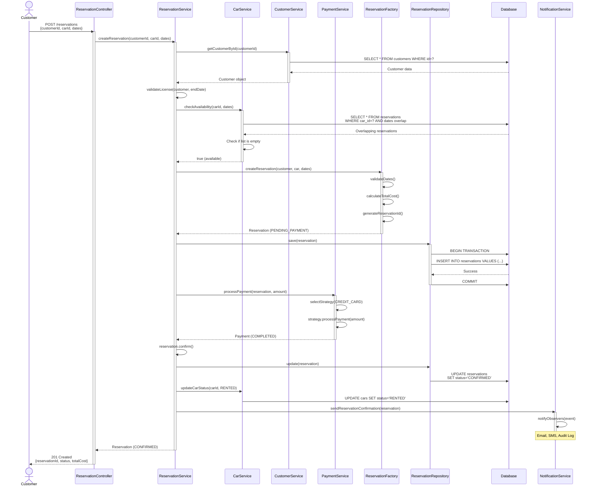
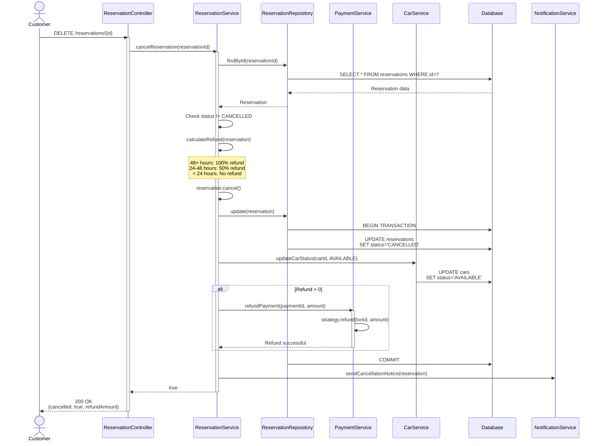
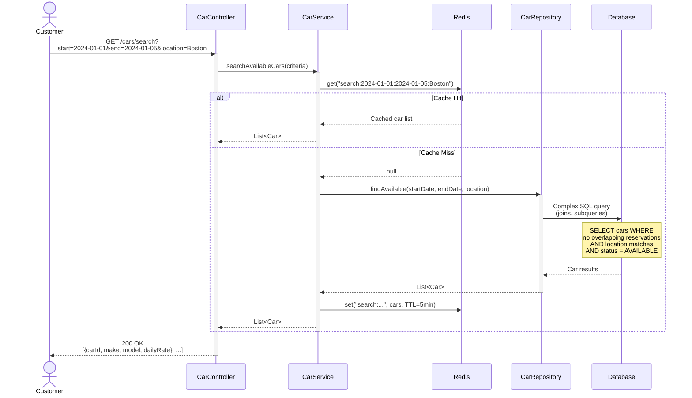
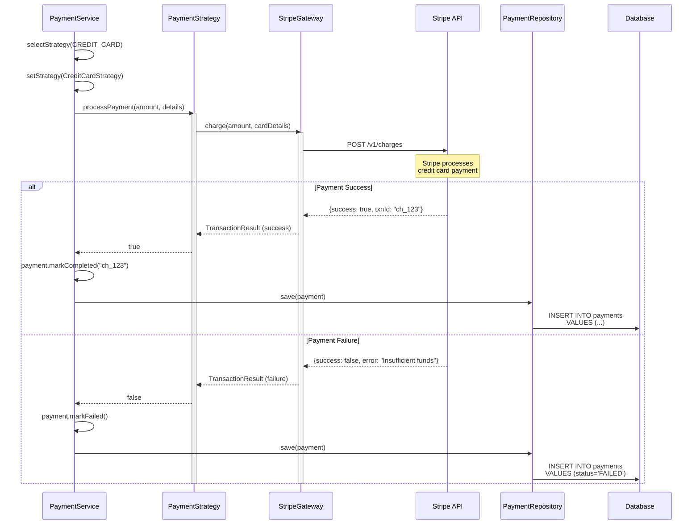
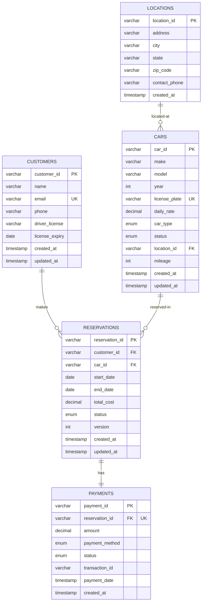

# Sequence Diagrams & Database Schema

## Part 1: Sequence Diagrams

Sequence diagrams show HOW objects interact over time to accomplish a task.

---

## Sequence Diagram 1: Create Reservation Flow

### Flow Description
Shows the complete flow from customer searching for a car to reservation confirmation.

---

### Sequence Diagram



---

### Key Points

1. **Transaction**: Reservation save wrapped in transaction
2. **Validation**: Customer license checked before proceeding
3. **Availability Check**: Query database for overlapping reservations
4. **Factory Pattern**: Complex creation logic delegated to factory
5. **Observer Pattern**: Notifications sent asynchronously
6. **Atomicity**: All steps succeed or entire operation fails

---

## Sequence Diagram 2: Cancel Reservation Flow



---

## Sequence Diagram 3: Search Available Cars Flow



---

## Sequence Diagram 4: Payment Processing Flow



---

# Part 2: Database Schema (ER Diagram)

## Entity-Relationship Diagram



---

## Database Tables (SQL)

### 1. customers Table

```sql
CREATE TABLE customers (
    customer_id VARCHAR(50) PRIMARY KEY,
    name VARCHAR(255) NOT NULL,
    email VARCHAR(255) NOT NULL UNIQUE,
    phone VARCHAR(20),
    driver_license VARCHAR(50),
    license_expiry DATE,
    created_at TIMESTAMP DEFAULT CURRENT_TIMESTAMP,
    updated_at TIMESTAMP DEFAULT CURRENT_TIMESTAMP ON UPDATE CURRENT_TIMESTAMP,

    INDEX idx_email (email),
    INDEX idx_license (driver_license)
);
```

---

### 2. locations Table

```sql
CREATE TABLE locations (
    location_id VARCHAR(50) PRIMARY KEY,
    address VARCHAR(500) NOT NULL,
    city VARCHAR(100) NOT NULL,
    state VARCHAR(50),
    zip_code VARCHAR(20),
    contact_phone VARCHAR(20),
    created_at TIMESTAMP DEFAULT CURRENT_TIMESTAMP,

    INDEX idx_city (city)
);
```

---

### 3. cars Table

```sql
CREATE TABLE cars (
    car_id VARCHAR(50) PRIMARY KEY,
    make VARCHAR(100) NOT NULL,
    model VARCHAR(100) NOT NULL,
    year INT NOT NULL,
    license_plate VARCHAR(20) NOT NULL UNIQUE,
    daily_rate DECIMAL(10, 2) NOT NULL,
    car_type ENUM('SEDAN', 'SUV', 'TRUCK', 'LUXURY', 'COMPACT', 'CONVERTIBLE') NOT NULL,
    status ENUM('AVAILABLE', 'RENTED', 'UNDER_MAINTENANCE', 'RETIRED') NOT NULL DEFAULT 'AVAILABLE',
    location_id VARCHAR(50),
    mileage INT DEFAULT 0,
    created_at TIMESTAMP DEFAULT CURRENT_TIMESTAMP,
    updated_at TIMESTAMP DEFAULT CURRENT_TIMESTAMP ON UPDATE CURRENT_TIMESTAMP,

    FOREIGN KEY (location_id) REFERENCES locations(location_id),

    INDEX idx_status (status),
    INDEX idx_location (location_id),
    INDEX idx_type (car_type),
    INDEX idx_composite (status, location_id, car_type)  -- For search queries
);
```

---

### 4. reservations Table (CRITICAL for Concurrency)

```sql
CREATE TABLE reservations (
    reservation_id VARCHAR(50) PRIMARY KEY,
    customer_id VARCHAR(50) NOT NULL,
    car_id VARCHAR(50) NOT NULL,
    start_date DATE NOT NULL,
    end_date DATE NOT NULL,
    total_cost DECIMAL(10, 2) NOT NULL,
    status ENUM('PENDING_PAYMENT', 'CONFIRMED', 'ACTIVE', 'COMPLETED', 'CANCELLED') NOT NULL,
    version INT NOT NULL DEFAULT 0,  -- For optimistic locking
    created_at TIMESTAMP DEFAULT CURRENT_TIMESTAMP,
    updated_at TIMESTAMP DEFAULT CURRENT_TIMESTAMP ON UPDATE CURRENT_TIMESTAMP,

    FOREIGN KEY (customer_id) REFERENCES customers(customer_id),
    FOREIGN KEY (car_id) REFERENCES cars(car_id),

    -- CRITICAL INDEX for double-booking prevention
    INDEX idx_car_dates (car_id, start_date, end_date),
    INDEX idx_customer (customer_id),
    INDEX idx_status (status),

    -- Constraint: end_date must be after start_date
    CONSTRAINT chk_dates CHECK (end_date > start_date)
);
```

---

### 5. payments Table

```sql
CREATE TABLE payments (
    payment_id VARCHAR(50) PRIMARY KEY,
    reservation_id VARCHAR(50) NOT NULL UNIQUE,  -- One payment per reservation
    amount DECIMAL(10, 2) NOT NULL,
    payment_method ENUM('CREDIT_CARD', 'DEBIT_CARD', 'PAYPAL', 'CRYPTO', 'CASH') NOT NULL,
    status ENUM('PENDING', 'COMPLETED', 'FAILED', 'REFUNDED') NOT NULL,
    transaction_id VARCHAR(100),  -- From payment gateway
    payment_date TIMESTAMP,
    created_at TIMESTAMP DEFAULT CURRENT_TIMESTAMP,

    FOREIGN KEY (reservation_id) REFERENCES reservations(reservation_id),

    INDEX idx_reservation (reservation_id),
    INDEX idx_status (status),
    INDEX idx_transaction (transaction_id)
);
```

---

## Critical Query: Find Available Cars (Prevent Double-Booking)

```sql
-- Find cars available for date range
SELECT c.*
FROM cars c
WHERE c.status = 'AVAILABLE'
  AND c.location_id = 'LOC-BOSTON'
  AND c.car_id NOT IN (
      -- Subquery: Find cars with overlapping reservations
      SELECT r.car_id
      FROM reservations r
      WHERE r.start_date <= '2024-01-05'  -- Requested end date
        AND r.end_date >= '2024-01-01'    -- Requested start date
        AND r.status NOT IN ('CANCELLED')
  )
ORDER BY c.daily_rate ASC;
```

**Explanation**:
- Main query: Select all available cars at location
- Subquery: Find cars that have overlapping reservations
- `NOT IN`: Exclude cars with overlapping reservations
- Result: Only cars with NO conflicts

---

## JPA Entity Mappings

### Car Entity with JPA Annotations

```java
import javax.persistence.*;
import java.util.Date;

@Entity
@Table(name = "cars", indexes = {
    @Index(name = "idx_status", columnList = "status"),
    @Index(name = "idx_location", columnList = "location_id"),
    @Index(name = "idx_composite", columnList = "status,location_id,car_type")
})
public class Car {
    @Id
    @Column(name = "car_id", length = 50)
    private String carId;

    @Column(name = "make", length = 100, nullable = false)
    private String make;

    @Column(name = "model", length = 100, nullable = false)
    private String model;

    @Column(name = "year", nullable = false)
    private int year;

    @Column(name = "license_plate", length = 20, unique = true, nullable = false)
    private String licensePlate;

    @Column(name = "daily_rate", precision = 10, scale = 2, nullable = false)
    private double dailyRate;

    @Enumerated(EnumType.STRING)
    @Column(name = "car_type", nullable = false)
    private CarType carType;

    @Enumerated(EnumType.STRING)
    @Column(name = "status", nullable = false)
    private CarStatus status = CarStatus.AVAILABLE;

    @ManyToOne(fetch = FetchType.LAZY)
    @JoinColumn(name = "location_id")
    private Location location;

    @Column(name = "mileage")
    private int mileage;

    @Column(name = "created_at", updatable = false)
    @Temporal(TemporalType.TIMESTAMP)
    private Date createdAt;

    @Column(name = "updated_at")
    @Temporal(TemporalType.TIMESTAMP)
    private Date updatedAt;

    @PrePersist
    protected void onCreate() {
        createdAt = new Date();
        updatedAt = new Date();
    }

    @PreUpdate
    protected void onUpdate() {
        updatedAt = new Date();
    }

    // Getters and setters
}
```

---

### Reservation Entity with Optimistic Locking

```java
import javax.persistence.*;
import java.util.Date;

@Entity
@Table(name = "reservations", indexes = {
    @Index(name = "idx_car_dates", columnList = "car_id,start_date,end_date"),
    @Index(name = "idx_customer", columnList = "customer_id")
})
public class Reservation {
    @Id
    @Column(name = "reservation_id", length = 50)
    private String reservationId;

    @ManyToOne(fetch = FetchType.LAZY)
    @JoinColumn(name = "customer_id", nullable = false)
    private Customer customer;

    @ManyToOne(fetch = FetchType.LAZY)
    @JoinColumn(name = "car_id", nullable = false)
    private Car car;

    @Column(name = "start_date", nullable = false)
    @Temporal(TemporalType.DATE)
    private Date startDate;

    @Column(name = "end_date", nullable = false)
    @Temporal(TemporalType.DATE)
    private Date endDate;

    @Column(name = "total_cost", precision = 10, scale = 2, nullable = false)
    private double totalCost;

    @Enumerated(EnumType.STRING)
    @Column(name = "status", nullable = false)
    private ReservationStatus status;

    // ⚡ OPTIMISTIC LOCKING
    @Version
    @Column(name = "version")
    private int version;

    @Column(name = "created_at", updatable = false)
    @Temporal(TemporalType.TIMESTAMP)
    private Date createdAt;

    @Column(name = "updated_at")
    @Temporal(TemporalType.TIMESTAMP)
    private Date updatedAt;

    @PrePersist
    protected void onCreate() {
        createdAt = new Date();
        updatedAt = new Date();
    }

    @PreUpdate
    protected void onUpdate() {
        updatedAt = new Date();
    }

    // Getters and setters
}
```

**Note**: `@Version` enables optimistic locking. If two users try to update the same reservation, the second one will fail with `OptimisticLockException`.

---

## Database Performance Optimization

### 1. Indexes

```sql
-- Composite index for search queries
CREATE INDEX idx_composite ON cars(status, location_id, car_type);

-- Covering index for reservation queries
CREATE INDEX idx_reservation_dates ON reservations(car_id, start_date, end_date, status);
```

---

### 2. Partitioning (For Large Datasets)

```sql
-- Partition reservations by year
ALTER TABLE reservations
PARTITION BY RANGE (YEAR(start_date)) (
    PARTITION p2023 VALUES LESS THAN (2024),
    PARTITION p2024 VALUES LESS THAN (2025),
    PARTITION p2025 VALUES LESS THAN (2026),
    PARTITION p_future VALUES LESS THAN MAXVALUE
);
```

---

### 3. Archiving Old Data

```sql
-- Move completed reservations older than 1 year to archive table
INSERT INTO reservations_archive
SELECT * FROM reservations
WHERE status = 'COMPLETED'
  AND end_date < DATE_SUB(CURDATE(), INTERVAL 1 YEAR);

DELETE FROM reservations
WHERE status = 'COMPLETED'
  AND end_date < DATE_SUB(CURDATE(), INTERVAL 1 YEAR);
```

---

## Next Steps
✅ Sequence diagrams for main flows
✅ Database schema (ER diagram)
✅ SQL table definitions
✅ JPA entity mappings
➡️ Deployment & concurrency handling
➡️ Interview Q&A
➡️ Complete Java code
