# Deployment Architecture & Concurrency Handling

## Part 1: Component/Deployment Diagram

### System Architecture Overview

```mermaid
graph TB
    subgraph "Client Layer"
        WebApp["🌐 Web Application<br/>(React/Angular)"]
        MobileApp["📱 Mobile App<br/>(iOS/Android)"]
        AdminPanel["👨‍💼 Admin Dashboard"]
    end

    subgraph "API Gateway / Load Balancer"
        LB["⚖️ Load Balancer<br/>(Nginx/AWS ALB)<br/>────────<br/>SSL Termination<br/>Rate Limiting<br/>Request Routing"]
    end

    subgraph "Application Tier (Auto-Scaling)"
        direction TB
        App1["🚀 App Server 1<br/>(Spring Boot)<br/>────────<br/>Port: 8080"]
        App2["🚀 App Server 2<br/>(Spring Boot)<br/>────────<br/>Port: 8080"]
        App3["🚀 App Server 3<br/>(Spring Boot)<br/>────────<br/>Port: 8080"]

        subgraph "Application Components"
            Controllers["Controllers Layer<br/>────────<br/>ReservationController<br/>CarController<br/>PaymentController"]
            Services["Services Layer<br/>────────<br/>ReservationService<br/>CarService<br/>PaymentService"]
            Repositories["Repository Layer<br/>────────<br/>JPA Repositories"]
        end
    end

    subgraph "Caching Layer"
        Redis["🔴 Redis Cluster<br/>────────<br/>• Search results cache<br/>• Session storage<br/>• Rate limit counters<br/>TTL: 5 minutes"]
    end

    subgraph "Message Queue"
        Queue["📨 RabbitMQ / Kafka<br/>────────<br/>Queues:<br/>• notification-queue<br/>• payment-retry-queue<br/>• audit-queue"]

        Worker1["👷 Notification Worker 1"]
        Worker2["👷 Notification Worker 2"]
    end

    subgraph "Database Layer (Primary + Replica)"
        PrimaryDB["🗄️ MySQL Primary<br/>────────<br/>Read + Write<br/>Master Node"]
        ReplicaDB1["🗄️ MySQL Replica 1<br/>────────<br/>Read Only"]
        ReplicaDB2["🗄️ MySQL Replica 2<br/>────────<br/>Read Only"]
    end

    subgraph "External Services"
        Stripe["💳 Stripe API<br/>(Payment Gateway)"]
        SendGrid["📧 SendGrid<br/>(Email Service)"]
        Twilio["📱 Twilio<br/>(SMS Service)"]
    end

    subgraph "Monitoring & Logging"
        Prometheus["📊 Prometheus<br/>(Metrics)"]
        Grafana["📈 Grafana<br/>(Dashboards)"]
        ELK["📝 ELK Stack<br/>(Elasticsearch + Logstash + Kibana)<br/>Log Aggregation"]
    end

    %% Connections
    WebApp --> LB
    MobileApp --> LB
    AdminPanel --> LB

    LB --> App1
    LB --> App2
    LB --> App3

    App1 --> Redis
    App2 --> Redis
    App3 --> Redis

    App1 --> PrimaryDB
    App1 --> ReplicaDB1
    App1 --> ReplicaDB2

    App2 --> PrimaryDB
    App2 --> ReplicaDB1

    App3 --> PrimaryDB
    App3 --> ReplicaDB2

    PrimaryDB -.->|Replication| ReplicaDB1
    PrimaryDB -.->|Replication| ReplicaDB2

    App1 --> Queue
    App2 --> Queue
    App3 --> Queue

    Queue --> Worker1
    Queue --> Worker2

    Worker1 --> SendGrid
    Worker1 --> Twilio
    Worker2 --> SendGrid
    Worker2 --> Twilio

    App1 --> Stripe
    App2 --> Stripe
    App3 --> Stripe

    App1 -.->|Metrics| Prometheus
    App2 -.->|Metrics| Prometheus
    App3 -.->|Metrics| Prometheus

    App1 -.->|Logs| ELK
    App2 -.->|Logs| ELK
    App3 -.->|Logs| ELK

    Prometheus --> Grafana

    style LB fill:#e1f5ff
    style Redis fill:#ffebee
    style Queue fill:#f3e5f5
    style PrimaryDB fill:#e8f5e9
    style Prometheus fill:#fff3e0
```



---

## Component Breakdown

### 1. Client Layer
- **Web App**: React/Angular SPA
- **Mobile App**: Native iOS/Android or React Native
- **Admin Panel**: Internal dashboard for staff

---

### 2. API Gateway / Load Balancer
- **Technology**: Nginx, AWS ALB, or HAProxy
- **Responsibilities**:
  - SSL/TLS termination
  - Load distribution (round-robin, least connections)
  - Rate limiting (100 req/min per user)
  - Request routing
  - Health checks on app servers

---

### 3. Application Tier (Stateless)
- **Technology**: Spring Boot (Java 17+)
- **Deployment**: Docker containers on Kubernetes/ECS
- **Scaling**: Horizontal auto-scaling (3-10 instances)
- **Layers**:
  - **Controllers**: Handle HTTP requests
  - **Services**: Business logic
  - **Repositories**: Data access

---

### 4. Caching Layer
- **Technology**: Redis Cluster (3 nodes, HA mode)
- **Use Cases**:
  - Search results caching (TTL: 5 min)
  - Session storage (JWT validation)
  - Rate limit counters
  - Distributed locks (for critical sections)

---

### 5. Message Queue
- **Technology**: RabbitMQ or Apache Kafka
- **Queues**:
  - `notification-queue`: Email/SMS notifications
  - `payment-retry-queue`: Failed payment retries
  - `audit-queue`: Audit log events
- **Workers**: Consume messages asynchronously

---

### 6. Database Layer
- **Primary Database**: MySQL (Write operations)
- **Replica Databases**: Read replicas (Read operations)
- **Replication**: Master-Slave async replication
- **Sharding** (future): Partition by region/customer ID

---

### 7. External Services
- **Stripe**: Payment processing
- **SendGrid**: Email delivery
- **Twilio**: SMS delivery

---

### 8. Monitoring & Logging
- **Prometheus**: Metrics collection (CPU, memory, request latency)
- **Grafana**: Visualization dashboards
- **ELK Stack**: Log aggregation and search

---

## Deployment Flow


---

# Part 2: Concurrency & Consistency Handling

## Problem: Double-Booking Prevention

### The Challenge
Two users trying to book the same car at the same time can cause double-booking.

---

## Solution 1: Pessimistic Locking (SELECT FOR UPDATE)

### How It Works
Lock the row during the transaction. Other transactions must wait.

---

### Implementation

```java
import javax.persistence.LockModeType;
import javax.transaction.Transactional;

public class ReservationService {
    private EntityManager entityManager;

    @Transactional
    public Reservation createReservation(
            String customerId,
            String carId,
            Date startDate,
            Date endDate) throws Exception {

        // Step 1: Lock the car row (other transactions wait here)
        Car car = entityManager.find(Car.class, carId, LockModeType.PESSIMISTIC_WRITE);

        // Step 2: Check for overlapping reservations
        List<Reservation> overlapping = findOverlappingReservations(carId, startDate, endDate);

        if (!overlapping.isEmpty()) {
            throw new Exception("Car already booked for these dates!");
        }

        // Step 3: Create reservation
        Reservation reservation = factory.createReservation(customer, car, startDate, endDate);
        entityManager.persist(reservation);

        // Step 4: Update car status
        car.setStatus(CarStatus.RENTED);
        entityManager.merge(car);

        // Transaction commits, lock released
        return reservation;
    }

    private List<Reservation> findOverlappingReservations(
            String carId, Date startDate, Date endDate) {
        return entityManager.createQuery(
            "SELECT r FROM Reservation r " +
            "WHERE r.car.carId = :carId " +
            "  AND r.startDate <= :endDate " +
            "  AND r.endDate >= :startDate " +
            "  AND r.status != 'CANCELLED'",
            Reservation.class
        )
        .setParameter("carId", carId)
        .setParameter("startDate", startDate)
        .setParameter("endDate", endDate)
        .setLockMode(LockModeType.PESSIMISTIC_READ)  // Lock these rows too
        .getResultList();
    }
}
```

### SQL Generated

```sql
BEGIN TRANSACTION;

-- Lock the car row
SELECT * FROM cars
WHERE car_id = 'CAR-123'
FOR UPDATE;  -- 🔒 Pessimistic lock!

-- Check for overlapping reservations
SELECT * FROM reservations
WHERE car_id = 'CAR-123'
  AND start_date <= '2024-01-05'
  AND end_date >= '2024-01-01'
  AND status != 'CANCELLED'
FOR UPDATE;  -- 🔒 Lock these too

-- If no overlaps, insert reservation
INSERT INTO reservations VALUES (...);

-- Update car status
UPDATE cars SET status = 'RENTED' WHERE car_id = 'CAR-123';

COMMIT;
```

---

### Pros & Cons

**Pros**:
- ✅ Prevents double-booking 100%
- ✅ Simple to implement
- ✅ Consistent data

**Cons**:
- ❌ Lower throughput (users wait for locks)
- ❌ Risk of deadlocks
- ❌ Not suitable for high-concurrency systems

**When to use**: Medium traffic, strong consistency required

---

## Solution 2: Optimistic Locking (Version Field)

### How It Works
No locks. Use a version number. If version changed, transaction fails.

---

### Implementation

```java
// Entity with @Version
@Entity
public class Reservation {
    @Id
    private String reservationId;

    // Other fields...

    @Version  // ⚡ Optimistic locking
    private int version;
}

@Transactional
public Reservation createReservation(...) {
    try {
        // Step 1: Read reservation (no lock)
        Car car = entityManager.find(Car.class, carId);

        // Step 2: Check overlaps
        List<Reservation> overlapping = findOverlappingReservations(...);
        if (!overlapping.isEmpty()) {
            throw new Exception("Car already booked!");
        }

        // Step 3: Create reservation
        Reservation reservation = new Reservation(...);
        reservation.setVersion(0);  // Initial version
        entityManager.persist(reservation);

        // Step 4: Update car (version check happens here)
        car.setStatus(CarStatus.RENTED);
        entityManager.merge(car);  // If version changed, throws OptimisticLockException

        return reservation;

    } catch (OptimisticLockException e) {
        // Version conflict! Someone else modified the data
        throw new Exception("Car was just booked by someone else. Please try again.");
    }
}
```

### SQL Generated

```sql
-- Read (no lock)
SELECT * FROM cars WHERE car_id = 'CAR-123';
-- version = 5

-- Later, when updating
UPDATE cars
SET status = 'RENTED', version = 6
WHERE car_id = 'CAR-123'
  AND version = 5;  -- ⚡ Version check!

-- If 0 rows updated → version conflict → throw exception
```

---

### Retry Logic

```java
public Reservation createReservationWithRetry(...) {
    int maxRetries = 3;
    int retryCount = 0;

    while (retryCount < maxRetries) {
        try {
            return createReservation(...);  // Try to create
        } catch (OptimisticLockException e) {
            retryCount++;
            if (retryCount >= maxRetries) {
                throw new Exception("Too many concurrent requests. Please try again later.");
            }
            // Wait before retrying (exponential backoff)
            Thread.sleep(100 * retryCount);
        }
    }
}
```

---

### Pros & Cons

**Pros**:
- ✅ Higher throughput (no waiting)
- ✅ No deadlocks
- ✅ Suitable for high-concurrency

**Cons**:
- ❌ Conflicts possible (need retry logic)
- ❌ More complex error handling
- ❌ Possible user frustration ("try again")

**When to use**: High traffic, eventual consistency acceptable

---

## Solution 3: Distributed Lock (Redis)

### How It Works
Use Redis to create a distributed lock across multiple app servers.

---

### Implementation

```java
import org.redisson.Redisson;
import org.redisson.api.RLock;
import org.redisson.api.RedissonClient;

public class ReservationService {
    private RedissonClient redisson;

    public Reservation createReservation(...) throws Exception {
        String lockKey = "lock:car:" + carId;
        RLock lock = redisson.getLock(lockKey);

        try {
            // Step 1: Acquire distributed lock (wait max 10 seconds)
            boolean isLocked = lock.tryLock(10, 30, TimeUnit.SECONDS);

            if (!isLocked) {
                throw new Exception("Could not acquire lock. Try again.");
            }

            // Step 2: Check overlapping reservations
            List<Reservation> overlapping = findOverlappingReservations(...);
            if (!overlapping.isEmpty()) {
                throw new Exception("Car already booked!");
            }

            // Step 3: Create reservation
            Reservation reservation = factory.createReservation(...);
            reservationRepo.save(reservation);

            // Step 4: Update car status
            car.setStatus(CarStatus.RENTED);
            carRepo.update(car);

            return reservation;

        } finally {
            // Step 5: Always release lock
            if (lock.isHeldByCurrentThread()) {
                lock.unlock();
            }
        }
    }
}
```

---

### Pros & Cons

**Pros**:
- ✅ Works across multiple app servers
- ✅ Prevents double-booking
- ✅ Fine-grained control (per car lock)

**Cons**:
- ❌ Requires Redis
- ❌ Network latency
- ❌ Lock timeout management

**When to use**: Multi-server deployment, fine-grained locking needed

---

## Comparison: Locking Strategies

| Strategy | Consistency | Throughput | Complexity | Use Case |
|----------|-------------|------------|------------|----------|
| **Pessimistic Locking** | Strong | Low | Low | Medium traffic, critical data |
| **Optimistic Locking** | Eventual | High | Medium | High traffic, retry acceptable |
| **Distributed Lock (Redis)** | Strong | Medium | High | Multi-server, fine-grained locks |

---

## Recommended Approach for Car Rental

### Hybrid Strategy

1. **For Reservation Creation**: Pessimistic locking
   - Critical operation
   - Must prevent double-booking
   - Medium traffic expected

2. **For Search/Browse**: No locking, use cache
   - Read-heavy operation
   - Eventual consistency acceptable
   - Cache search results for 5 minutes

3. **For Payment Processing**: Distributed lock (Redis)
   - Prevent duplicate payments
   - Works across multiple servers

---

## Transaction Isolation Levels

```java
// Spring Boot configuration
@Configuration
public class DatabaseConfig {
    @Bean
    public DataSource dataSource() {
        HikariConfig config = new HikariConfig();
        config.setJdbcUrl("jdbc:mysql://localhost:3306/car_rental");
        config.setUsername("user");
        config.setPassword("pass");

        // ⚡ Set isolation level
        config.setTransactionIsolation("TRANSACTION_REPEATABLE_READ");

        return new HikariDataSource(config);
    }
}
```

### Isolation Levels

| Level | Dirty Read | Non-Repeatable Read | Phantom Read |
|-------|------------|---------------------|--------------|
| READ UNCOMMITTED | ❌ Possible | ❌ Possible | ❌ Possible |
| READ COMMITTED | ✅ Prevented | ❌ Possible | ❌ Possible |
| **REPEATABLE READ** | ✅ Prevented | ✅ Prevented | ❌ Possible |
| SERIALIZABLE | ✅ Prevented | ✅ Prevented | ✅ Prevented |

**Recommended**: `REPEATABLE_READ` (balance between consistency and performance)

---

## Handling Race Conditions

### Scenario: Two users book the same car simultaneously

```
Time    User A                          User B
────────────────────────────────────────────────────────
T1      Check car availability ✅
T2                                      Check car availability ✅
T3      Create reservation
T4                                      Create reservation
T5      ❌ DOUBLE BOOKING!
```

### Solution: Database Unique Constraint

```sql
-- Add unique constraint to prevent overlapping reservations
CREATE UNIQUE INDEX idx_no_overlap
ON reservations (car_id, start_date, end_date)
WHERE status NOT IN ('CANCELLED');

-- ⚠️ Note: MySQL doesn't support partial indexes
-- Alternative: Use trigger or application-level check with pessimistic locking
```

---

## Concurrency Best Practices

1. ✅ **Use transactions** for multi-step operations
2. ✅ **Choose appropriate locking** based on traffic
3. ✅ **Set transaction timeout** to prevent hanging
4. ✅ **Implement retry logic** for optimistic locking
5. ✅ **Use connection pooling** (HikariCP)
6. ✅ **Monitor deadlocks** and adjust isolation levels
7. ✅ **Cache read-heavy data** to reduce DB load
8. ✅ **Use async processing** for non-critical tasks (notifications)

---

## Next Steps
✅ Deployment architecture
✅ Concurrency handling (pessimistic, optimistic, distributed locks)
✅ Transaction isolation levels
➡️ Interview Q&A
➡️ Complete Java implementation
➡️ Summary document
