# Chess Game - Use Case Diagram

## 📊 Use Case Diagram with Actors and System Boundary

```mermaid
graph TB
    subgraph "Chess Game System"
        UC1[Start New Game]
        UC2[Make Move]
        UC3[Validate Move]
        UC4[Capture Piece]
        UC5[Detect Check]
        UC6[Detect Checkmate]
        UC7[Detect Stalemate]
        UC8[Perform Castling]
        UC9[Perform En Passant]
        UC10[Promote Pawn]
        UC11[View Board State]
        UC12[View Move History]
        UC13[End Game]
        UC14[Switch Turn]
    end

    Player1[👤 White Player]
    Player2[👤 Black Player]
    System[🖥️ System]

    Player1 --> UC1
    Player2 --> UC1
    Player1 --> UC2
    Player2 --> UC2
    Player1 --> UC11
    Player2 --> UC11
    Player1 --> UC12
    Player2 --> UC12

    UC2 --> UC3
    UC3 --> UC4
    UC3 --> UC8
    UC3 --> UC9
    UC3 --> UC10

    UC2 --> UC14
    UC14 --> UC5
    UC5 --> UC6
    UC5 --> UC7

    UC6 --> UC13
    UC7 --> UC13

    System -.->|<<includes>>| UC3
    System -.->|<<includes>>| UC5
    System -.->|<<includes>>| UC14

    style UC1 fill:#e1f5ff,stroke:#01579b,stroke-width:2px
    style UC2 fill:#fff3e0,stroke:#e65100,stroke-width:3px
    style UC3 fill:#e8f5e9,stroke:#1b5e20,stroke-width:2px
    style UC5 fill:#fce4ec,stroke:#880e4f,stroke-width:2px
    style UC6 fill:#ffebee,stroke:#c62828,stroke-width:2px
    style UC13 fill:#f3e5f5,stroke:#4a148c,stroke-width:2px
```



---

## 🎭 ACTORS

### 1. **White Player** (Human)
- **Role**: Plays with white pieces, makes first move
- **Responsibilities**:
  - Make valid moves during their turn
  - Capture opponent's pieces
  - Try to checkmate opponent's king
- **Interactions**: Starts game, makes moves, views board

### 2. **Black Player** (Human)
- **Role**: Plays with black pieces, moves second
- **Responsibilities**:
  - Make valid moves during their turn
  - Capture opponent's pieces
  - Try to checkmate opponent's king
- **Interactions**: Starts game, makes moves, views board

### 3. **System** (Automated Actor)
- **Role**: Enforces chess rules, manages game state
- **Responsibilities**:
  - Validate all moves
  - Detect check, checkmate, stalemate
  - Manage turn switching
  - Update board state
- **Interactions**: Validates moves automatically, detects game-ending conditions

---

## 📋 USE CASES (Detailed)

### 🔵 **UC1: Start New Game**
**Actor**: White Player, Black Player
**Preconditions**: None
**Main Flow**:
1. System initializes 8x8 board
2. System places all 32 pieces in starting positions
3. System sets current turn to White
4. System sets game status to "IN_PROGRESS"
5. Game is ready to play

**Postconditions**: Board is initialized, White player can make first move

---

### 🟡 **UC2: Make Move** (Primary Use Case)
**Actor**: Player (White or Black)
**Preconditions**: It's the player's turn, game is active
**Main Flow**:
1. Player selects source position (e.g., "e2")
2. Player selects destination position (e.g., "e4")
3. System validates the move (includes UC3)
4. System executes the move
5. System checks if capture occurred (includes UC4)
6. System switches turn (includes UC14)
7. System detects check/checkmate/stalemate (includes UC5)

**Alternative Flow 1** (Invalid Move):
- 3a. System determines move is invalid
- 3b. System throws InvalidMoveException
- 3c. Player must select a different move

**Alternative Flow 2** (Special Move):
- 4a. System detects castling request (extends UC8)
- 4b. System detects en passant (extends UC9)
- 4c. System detects pawn promotion (extends UC10)

**Postconditions**: Move executed, turn switched, board updated

---

### 🟢 **UC3: Validate Move**
**Actor**: System (automated)
**Preconditions**: Player has requested a move
**Main Flow**:
1. System checks if source position has a piece
2. System checks if piece belongs to current player
3. System checks if destination is within board boundaries
4. System validates piece-specific movement rules
5. System checks if path is clear (no pieces blocking)
6. System checks if move leaves own king in check
7. System returns validation result (valid/invalid)

**Validation Checks**:
- ✅ Source square has a piece
- ✅ Piece belongs to current player
- ✅ Destination is valid (0-7 for row/column)
- ✅ Move follows piece movement rules
- ✅ Path is clear (except Knight)
- ✅ Not capturing own piece
- ✅ Own king not in check after move

**Postconditions**: Move is validated as legal or illegal

---

### 🔴 **UC4: Capture Piece**
**Actor**: System
**Preconditions**: Valid move lands on opponent's piece
**Main Flow**:
1. System identifies piece at destination
2. System verifies it's opponent's piece
3. System removes piece from board
4. System adds piece to current player's captured list
5. System updates board state

**Postconditions**: Opponent's piece removed, added to captures

---

### 🟣 **UC5: Detect Check**
**Actor**: System (automated)
**Preconditions**: Move has been executed
**Main Flow**:
1. System locates opponent's King position
2. System checks if any current player's piece can attack King position
3. If yes, system marks game status as "CHECK"
4. If no, game continues normally

**Includes**: UC6 (if no escape, it's checkmate)

**Postconditions**: Game status updated (CHECK or normal)

---

### 🔴 **UC6: Detect Checkmate**
**Actor**: System
**Preconditions**: Opponent's King is in check
**Main Flow**:
1. System checks all possible moves for opponent
2. For each possible move:
   - System simulates the move
   - System checks if King still in check
3. If no valid moves remove check:
   - System declares CHECKMATE
   - Current player wins
   - Game ends (includes UC13)

**Postconditions**: Game ends, winner declared

---

### 🟠 **UC7: Detect Stalemate**
**Actor**: System
**Preconditions**: It's opponent's turn
**Main Flow**:
1. System checks if opponent is in check (should be NO)
2. System checks all possible moves for opponent
3. If no valid moves available:
   - System declares STALEMATE
   - Game ends in draw (includes UC13)

**Postconditions**: Game ends in draw

---

### ⚪ **UC8: Perform Castling**
**Actor**: Player
**Preconditions**: Conditions for castling are met
**Castling Conditions**:
- King has not moved
- Chosen Rook has not moved
- No pieces between King and Rook
- King is not in check
- King doesn't pass through check
- King doesn't land in check

**Main Flow**:
1. Player moves King two squares toward Rook
2. System validates castling conditions
3. System moves King two squares
4. System moves Rook to opposite side of King
5. System marks both pieces as "has moved"

**Types**:
- **Kingside Castling**: King moves from e1→g1 (White) or e8→g8 (Black)
- **Queenside Castling**: King moves from e1→c1 (White) or e8→c8 (Black)

**Postconditions**: King and Rook repositioned, both marked as moved

---

### 🟤 **UC9: Perform En Passant**
**Actor**: Player
**Preconditions**: Opponent's pawn just moved two squares forward
**Main Flow**:
1. Opponent pawn moves from starting rank two squares forward
2. Opponent pawn lands beside current player's pawn
3. Current player moves pawn diagonally to square behind opponent's pawn
4. System removes opponent's pawn (special capture)

**Example**:
- Black pawn on e7 moves to e5 (two squares)
- White pawn on d5 can capture "en passant" by moving to e6
- Black pawn on e5 is removed

**Postconditions**: Opponent pawn captured, current pawn moved diagonally

---

### 🟡 **UC10: Promote Pawn**
**Actor**: Player
**Preconditions**: Pawn reaches opposite end of board
**Main Flow**:
1. Pawn reaches last rank (rank 8 for White, rank 1 for Black)
2. System prompts player to choose promotion piece
3. Player selects Queen, Rook, Bishop, or Knight
4. System replaces pawn with chosen piece
5. New piece has same color as pawn

**Default**: Most players choose Queen (strongest piece)

**Postconditions**: Pawn replaced with chosen piece

---

### 🔵 **UC11: View Board State**
**Actor**: Player
**Main Flow**:
1. Player requests current board state
2. System displays 8x8 grid with all piece positions
3. System shows which player's turn it is
4. System shows game status (Active, Check, Checkmate, etc.)

**Postconditions**: Player sees current game state

---

### 🟢 **UC12: View Move History**
**Actor**: Player
**Main Flow**:
1. Player requests move history
2. System displays all moves in chronological order
3. Each move shows: piece, from position, to position, timestamp

**Format Example**:
```
1. e2 → e4 (White Pawn)
2. e7 → e5 (Black Pawn)
3. Nf3 (White Knight)
...
```

**Postconditions**: Player sees complete game history

---

### 🟣 **UC13: End Game**
**Actor**: System
**Preconditions**: Checkmate, stalemate, or draw detected
**Main Flow**:
1. System sets game status to final state
2. System determines result:
   - CHECKMATE → Winner declared
   - STALEMATE → Draw
   - RESIGNATION → Opponent wins
3. System prevents further moves
4. System displays final board state and result

**Postconditions**: Game is over, no more moves allowed

---

### 🟠 **UC14: Switch Turn**
**Actor**: System (automated)
**Preconditions**: Valid move executed
**Main Flow**:
1. System completes current player's move
2. System changes current turn to opponent
3. System checks for check/checkmate/stalemate
4. System enables opponent to make moves

**Postconditions**: Turn switched to opponent

---

## 🔗 RELATIONSHIPS BETWEEN USE CASES

### <<includes>> Relationship
Used when a use case ALWAYS includes another use case.

- **Make Move** <<includes>> **Validate Move** (always validate before moving)
- **Make Move** <<includes>> **Switch Turn** (always switch after valid move)
- **Detect Check** <<includes>> **Detect Checkmate** (if in check, check for checkmate)

### <<extends>> Relationship
Used when a use case OPTIONALLY extends another use case.

- **Perform Castling** <<extends>> **Make Move** (only sometimes)
- **Perform En Passant** <<extends>> **Make Move** (only sometimes)
- **Promote Pawn** <<extends>> **Make Move** (only when pawn reaches end)
- **Capture Piece** <<extends>> **Make Move** (only when destination has opponent piece)

---

## 🎯 MAIN FLOW SEQUENCE

```
1. Start New Game (UC1)
   ↓
2. White Player Makes Move (UC2)
   ↓
3. System Validates Move (UC3)
   ↓
4. System Executes Move
   ↓
5. System Checks for Capture (UC4) [optional]
   ↓
6. System Switches Turn (UC14)
   ↓
7. System Detects Check (UC5)
   ↓
8. System Checks Checkmate/Stalemate (UC6/UC7)
   ↓
9. If game continues, Black Player Makes Move (UC2)
   ↓
10. Loop until Checkmate, Stalemate, or Resignation
   ↓
11. End Game (UC13)
```

---

## 🎓 BEGINNER TIPS

### Understanding Use Cases

**What is a Use Case?**
- A "goal" that an actor wants to achieve with the system
- Example: "I want to move my pawn from e2 to e4"

**Actors vs System:**
- **Actors**: Trigger use cases (players start moves)
- **System**: Responds automatically (validates, detects check)

**Why So Many Use Cases?**
- Each use case becomes a method or class in code
- Example: "Validate Move" → MoveValidator class

**Include vs Extend:**
- **Include**: MUST happen every time (Make Move MUST validate)
- **Extend**: MAY happen sometimes (Make Move MAY involve castling)

---

## 🔄 MAPPING USE CASES TO CODE (Preview)

| Use Case | Maps To (Code) |
|----------|----------------|
| Start New Game | `ChessGame.initializeGame()` |
| Make Move | `ChessGame.makeMove(from, to)` |
| Validate Move | `MoveValidator.isValidMove()` |
| Capture Piece | `Board.capturePiece()` |
| Detect Check | `CheckDetector.isKingInCheck()` |
| Detect Checkmate | `CheckmateDetector.isCheckmate()` |
| Perform Castling | `CastlingValidator.validateCastling()` |
| Promote Pawn | `PawnPromotionHandler.promotePawn()` |

---

**Next Step**: We'll start designing the class diagrams, beginning with core entities (Board, Pieces)! 🎨
