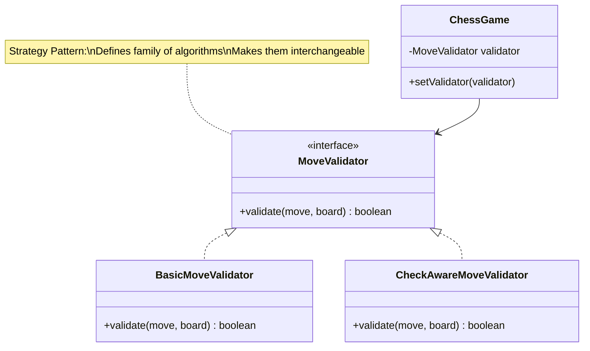
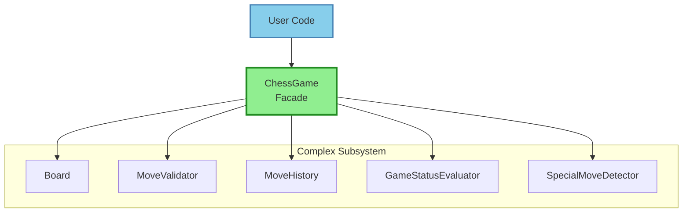
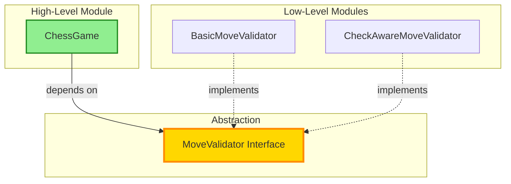

# Chess Game - Design Patterns & SOLID Principles

## 📐 Phase 8: Design Patterns & SOLID Principles Applied

This document explains which design patterns and SOLID principles we used, **why**, and **where** in the chess game design.

---

## 🎨 DESIGN PATTERNS USED

### 1. **Strategy Pattern** ⭐⭐⭐

**Where**: MoveValidator, Piece movement

**Problem**:
- Different pieces move differently
- Validation logic can vary (basic, check-aware, AI)
- Want to swap validation strategies easily

**Solution**:
```java
// Strategy interface
public interface MoveValidator {
    boolean validate(Move move, Board board);
}

// Concrete strategies
public class BasicMoveValidator implements MoveValidator { ... }
public class CheckAwareMoveValidator implements MoveValidator { ... }

// Context uses strategy
public class ChessGame {
    private MoveValidator validator;  // Can swap!

    public void setValidator(MoveValidator validator) {
        this.validator = validator;
    }
}
```

**Benefits**:
- ✅ Easy to add new validators
- ✅ Can swap validators at runtime
- ✅ Each validator is independently testable
- ✅ Open/Closed Principle

**Diagram**:


---

### 2. **Template Method Pattern**

**Where**: Piece abstract class with canMove()

**Problem**:
- All pieces share common validation steps
- But each has different movement rules
- Want to reuse common logic, customize specific parts

**Solution**:
```java
public abstract class Piece {
    // Template method (common flow)
    public final boolean canMove(Position from, Position to, Board board) {
        // Step 1: Basic validation (common)
        if (!to.isValid()) return false;

        // Step 2: Piece-specific validation (customizable)
        return isValidMove(from, to, board);
    }

    // Subclasses override this
    protected abstract boolean isValidMove(Position from, Position to, Board board);
}

public class Knight extends Piece {
    @Override
    protected boolean isValidMove(Position from, Position to, Board board) {
        // L-shape movement logic
        int rowDiff = Math.abs(to.getRow() - from.getRow());
        int colDiff = Math.abs(to.getColumn() - from.getColumn());
        return (rowDiff == 2 && colDiff == 1) || (rowDiff == 1 && colDiff == 2);
    }
}
```

**Benefits**:
- ✅ Code reuse (common steps in parent)
- ✅ Enforce algorithm structure
- ✅ Subclasses customize specific steps

---

### 3. **Command Pattern**

**Where**: Move class

**Problem**:
- Need to encapsulate move requests
- Want to store move history
- Future: Want undo/redo functionality

**Solution**:
```java
// Command
public class Move {
    private Position from;
    private Position to;
    private Piece piece;
    private Piece capturedPiece;  // For undo

    // Execute
    public void execute(Board board) {
        capturedPiece = board.getPiece(to);
        board.movePiece(from, to);
    }

    // Undo (future feature)
    public void undo(Board board) {
        board.movePiece(to, from);
        if (capturedPiece != null) {
            board.setPiece(to, capturedPiece);
        }
    }
}

// Invoker
public class MoveHistory {
    private List<Move> moves = new ArrayList<>();

    public void addMove(Move move) {
        moves.add(move);
    }

    public void undoLastMove(Board board) {
        if (!moves.isEmpty()) {
            Move lastMove = moves.remove(moves.size() - 1);
            lastMove.undo(board);
        }
    }
}
```

**Benefits**:
- ✅ Encapsulates request as object
- ✅ Supports undo/redo
- ✅ Move history for replay
- ✅ Can log/audit moves

---

### 4. **Facade Pattern**

**Where**: ChessGame class

**Problem**:
- System has many subsystems (Board, Validators, History, Status)
- Don't want users to interact with all of them
- Want simple, unified interface

**Solution**:
```java
// Facade
public class ChessGame {
    // Internal subsystems (hidden from user)
    private Board board;
    private MoveValidator validator;
    private MoveHistory history;
    private GameStatusEvaluator statusEvaluator;
    private SpecialMoveDetector specialMoveDetector;

    // Simple interface for users
    public Move makeMove(Position from, Position to) {
        // Coordinates all subsystems internally
        Piece piece = board.getPiece(from);
        Move move = new Move(from, to, piece);
        validator.validate(move, board);
        board.movePiece(from, to);
        history.addMove(move);
        statusEvaluator.evaluateGameStatus(board, currentPlayer);
        return move;
    }
}

// User code (simple!)
ChessGame game = new ChessGame();
game.initializeGame();
game.makeMove(e2, e4);  // That's it!
```

**Benefits**:
- ✅ Simplified interface
- ✅ Hides complexity
- ✅ Loose coupling
- ✅ Easy to use

**Diagram**:


---

### 5. **Factory Pattern** (Can Add)

**Where**: PieceFactory (optional enhancement)

**Problem**:
- Creating pieces requires knowing concrete classes
- Want to centralize piece creation
- Want to add creation logic (validation, initialization)

**Solution**:
```java
public class PieceFactory {
    public static Piece createPiece(PieceType type, Color color) {
        switch (type) {
            case KING:   return new King(color);
            case QUEEN:  return new Queen(color);
            case ROOK:   return new Rook(color);
            case BISHOP: return new Bishop(color);
            case KNIGHT: return new Knight(color);
            case PAWN:   return new Pawn(color);
            default:
                throw new IllegalArgumentException("Unknown piece type: " + type);
        }
    }
}

// Usage
Piece queen = PieceFactory.createPiece(PieceType.QUEEN, Color.WHITE);
```

**Benefits**:
- ✅ Centralized creation
- ✅ Easy to add creation logic
- ✅ Client code doesn't know concrete classes

---

### 6. **Singleton Pattern** (Optional)

**Where**: ChessGame (if only one game at a time)

**Problem**:
- Want only ONE chess game instance
- Global access point

**Solution**:
```java
public class ChessGame {
    private static ChessGame instance;

    private ChessGame() {
        // Private constructor
    }

    public static ChessGame getInstance() {
        if (instance == null) {
            instance = new ChessGame();
        }
        return instance;
    }
}

// Usage
ChessGame game = ChessGame.getInstance();
```

**When to Use**:
- ✅ One game per application
- ❌ NOT if you want multiple games

---

### 7. **Observer Pattern** (Future Enhancement)

**Where**: Game events (check, checkmate, etc.)

**Problem**:
- Want to notify UI/logger when game state changes
- Don't want ChessGame to depend on specific UI

**Solution**:
```java
public interface GameObserver {
    void onCheck(Color playerInCheck);
    void onCheckmate(Color winner);
    void onMove(Move move);
}

public class ChessGame {
    private List<GameObserver> observers = new ArrayList<>();

    public void addObserver(GameObserver observer) {
        observers.add(observer);
    }

    private void notifyCheck(Color color) {
        for (GameObserver observer : observers) {
            observer.onCheck(color);
        }
    }
}

// UI implements observer
public class ChessUI implements GameObserver {
    @Override
    public void onCheck(Color playerInCheck) {
        System.out.println(playerInCheck + " is in check!");
    }
}
```

---

## 🔧 SOLID PRINCIPLES APPLIED

### 1. **S** - Single Responsibility Principle ✅

**Definition**: A class should have only ONE reason to change.

**Applied In**:

```java
// ✅ GOOD: Each class has one job

class Board {
    // ONLY manages board state
    void setPiece(Position pos, Piece piece) { ... }
    Piece getPiece(Position pos) { ... }
}

class MoveValidator {
    // ONLY validates moves
    boolean validate(Move move, Board board) { ... }
}

class MoveHistory {
    // ONLY tracks move history
    void addMove(Move move) { ... }
}

// ❌ BAD: God class doing everything
class ChessBoard {
    // Too many responsibilities!
    void setPiece() { ... }
    void validateMove() { ... }
    void trackHistory() { ... }
    void detectCheck() { ... }
    void displayBoard() { ... }
}
```

**Benefits**:
- Easy to understand
- Easy to test
- Easy to modify
- Low coupling

---

### 2. **O** - Open/Closed Principle ✅

**Definition**: Open for extension, closed for modification.

**Applied In**:

```java
// ✅ GOOD: Add new pieces without modifying existing code

abstract class Piece {
    abstract boolean canMove(...);
}

// Add new piece - just extend, don't modify existing classes!
class Archbishop extends Piece {
    @Override
    boolean canMove(...) {
        // Combines bishop + knight
    }
}

// ✅ GOOD: Add new validators without modifying MoveValidator interface
class AIValidator implements MoveValidator {
    boolean validate(Move move, Board board) {
        // AI-specific validation
    }
}

// ❌ BAD: Have to modify switch statement for every new piece
class PieceManager {
    boolean validateMove(Piece piece, ...) {
        switch (piece.getType()) {
            case KING: ...
            case QUEEN: ...
            // Have to modify this for every new piece!
        }
    }
}
```

**Benefits**:
- Extend functionality without breaking existing code
- Reduces risk of bugs
- Easier maintenance

---

### 3. **L** - Liskov Substitution Principle ✅

**Definition**: Subclasses should be substitutable for their base classes.

**Applied In**:

```java
// ✅ GOOD: Any Piece can be used where Piece is expected

Piece piece1 = new King(Color.WHITE);
Piece piece2 = new Pawn(Color.BLACK);

// Both work the same way
boolean valid1 = piece1.canMove(from, to, board);
boolean valid2 = piece2.canMove(from, to, board);

// Board doesn't care what type of piece
board.setPiece(position, piece1);  // Works
board.setPiece(position, piece2);  // Also works

// ❌ BAD: Subclass changes expected behavior
class SpecialKing extends Piece {
    @Override
    boolean canMove(...) {
        return true;  // Always returns true - breaks contract!
    }
}
```

**Benefits**:
- Polymorphism works correctly
- Predictable behavior
- Easier testing (can use mocks)

---

### 4. **I** - Interface Segregation Principle ✅

**Definition**: Clients shouldn't depend on interfaces they don't use.

**Applied In**:

```java
// ✅ GOOD: Focused interfaces

interface MoveValidator {
    boolean validate(Move move, Board board);
}

interface GameStatusEvaluator {
    GameState evaluateGameStatus(Board board, Player player);
}

// Each class implements only what it needs

// ❌ BAD: Fat interface

interface ChessOperations {
    boolean validateMove(...);
    GameState evaluateStatus(...);
    void displayBoard(...);
    void saveGame(...);
    void loadGame(...);
    // Too many methods! Not all classes need all of these
}
```

**Benefits**:
- Cleaner interfaces
- Less coupling
- Easier to implement

---

### 5. **D** - Dependency Inversion Principle ✅

**Definition**: Depend on abstractions, not concretions.

**Applied In**:

```java
// ✅ GOOD: Depend on interface

class ChessGame {
    private MoveValidator validator;  // Interface, not concrete class!

    public ChessGame(MoveValidator validator) {
        this.validator = validator;
    }
}

// Can inject any implementation
ChessGame game1 = new ChessGame(new BasicMoveValidator());
ChessGame game2 = new ChessGame(new CheckAwareMoveValidator());

// ❌ BAD: Depend on concrete class

class ChessGame {
    private BasicMoveValidator validator;  // Concrete class!

    public ChessGame() {
        this.validator = new BasicMoveValidator();  // Hard-coded!
    }
}
```

**Benefits**:
- Easy to swap implementations
- Easy to test (can mock)
- Loose coupling

**Diagram**:


---

## 🎓 SUMMARY: Design Decisions

| Principle/Pattern | Where Applied | Why? |
|-------------------|---------------|------|
| **Strategy** | MoveValidator, Pieces | Swap validation algorithms |
| **Command** | Move class | Encapsulate move, support undo |
| **Facade** | ChessGame | Simplify complex subsystem |
| **Template Method** | Piece hierarchy | Reuse common logic |
| **Factory** | Piece creation | Centralize object creation |
| **SRP** | All classes | One responsibility per class |
| **OCP** | Piece hierarchy, Validators | Extend without modifying |
| **LSP** | Piece substitution | Subclasses are interchangeable |
| **ISP** | Focused interfaces | No fat interfaces |
| **DIP** | ChessGame dependencies | Depend on abstractions |

---

## 🐛 COMMON VIOLATIONS TO AVOID

### Violation 1: God Class (Violates SRP)
```java
// ❌ BAD
class ChessGame {
    void setPiece() { ... }
    void validateMove() { ... }
    void detectCheck() { ... }
    void drawUI() { ... }
    void saveToDatabase() { ... }
    // Too many responsibilities!
}
```

### Violation 2: Hardcoded Dependencies (Violates DIP)
```java
// ❌ BAD
class ChessGame {
    private BasicMoveValidator validator = new BasicMoveValidator();
    // Can't swap validator!
}
```

### Violation 3: Switch Statements for Types (Violates OCP)
```java
// ❌ BAD
switch (piece.getType()) {
    case KING: // king logic
    case QUEEN: // queen logic
    // Have to modify for new pieces!
}
```

### Violation 4: Exposing Implementation Details
```java
// ❌ BAD
class Board {
    public Piece[][] cells;  // Exposed!
}
```

---

## ✅ WHAT WE ACHIEVED

1. ✅ Applied 5+ design patterns
2. ✅ Followed all 5 SOLID principles
3. ✅ Created flexible, maintainable design
4. ✅ Easy to extend (new pieces, validators)
5. ✅ Easy to test (loose coupling, interfaces)

---
