# Chess Game - Sequence Diagrams

## 📊 Phase 9: Sequence Diagrams for Main Flows

Sequence diagrams show **how objects interact over time** to accomplish a task.

---

## 🎯 SEQUENCE DIAGRAM 1: Make a Normal Move

**Explanation:**
1. User calls `makeMove(e2, e4)`
2. ChessGame validates game is active
3. Gets piece at source position
4. Creates Move object
5. Validates using MoveValidator
6. Executes move on board
7. Records in move history
8. Switches turn to opponent
9. Evaluates game status (check/checkmate/stalemate)
10. Returns success to user

---

## 🎯 SEQUENCE DIAGRAM 2: Castling Move

**Explanation:**
1. User moves king 2 squares (indicates castling)
2. SpecialMoveDetector identifies it as castling
3. CastlingValidator checks all 6 castling rules
4. If valid, executes castling (moves king AND rook)
5. Records move in history
6. Switches turn

---

## 🎯 SEQUENCE DIAGRAM 3: Check Detection Flow

**Explanation:**
1. After move, evaluate game status
2. CheckDetector finds king position
3. Gets all opponent pieces
4. For each piece, checks if it can attack king
5. If any piece can attack, king is in check
6. Game state updated to CHECK

---

## 🎯 SEQUENCE DIAGRAM 4: Checkmate Detection Flow

**Explanation:**
1. First confirm king is in check
2. Try ALL possible moves for ALL player pieces
3. For each move:
   - Simulate move on a copy of board
   - Check if king still in check
   - If king escapes, return false (not checkmate)
4. If no escape moves found, it's checkmate
5. Game ends, winner declared

---

## 🎯 SEQUENCE DIAGRAM 5: En Passant Flow

```mermaid
sequenceDiagram
    participant User
    participant ChessGame
    participant SpecialMoveDetector
    participant EnPassantValidator
    participant MoveHistory
    participant Board

    Note over User: Black pawn just moved c7→c5 (2 squares)

    User->>ChessGame: makeMove(b5, c6) [White pawn captures]

    ChessGame->>Board: getPiece(b5)
    Board-->>ChessGame: WhitePawn

    ChessGame->>SpecialMoveDetector: detectSpecialMove(move, board)

    SpecialMoveDetector->>EnPassantValidator: validateEnPassant(move, board)

    EnPassantValidator->>Board: getPiece(c6)
    Board-->>EnPassantValidator: null (Destination is empty!)

    EnPassantValidator->>Board: getPiece(c5) [Adjacent position]
    Board-->>EnPassantValidator: BlackPawn

    EnPassantValidator->>MoveHistory: getLastMove()
    MoveHistory-->>EnPassantValidator: Move(c7→c5, BlackPawn)

    EnPassantValidator->>EnPassantValidator: Verify last move was 2-square pawn advance
    EnPassantValidator-->>SpecialMoveDetector: true (Valid en passant)

    SpecialMoveDetector-->>ChessGame: EN_PASSANT

    ChessGame->>EnPassantValidator: executeEnPassant(move, board)
    EnPassantValidator->>Board: removePiece(c5) [Remove black pawn]
    EnPassantValidator->>Board: movePiece(b5, c6) [Move white pawn]
    EnPassantValidator-->>ChessGame: BlackPawn (captured)

    ChessGame->>MoveHistory: addMove(move)
    ChessGame-->>User: En passant successful
```

**Explanation:**
1. Opponent pawn just moved 2 squares
2. Player moves pawn diagonally to empty square
3. System detects diagonal move to empty square
4. EnPassantValidator checks:
   - Destination is empty
   - Adjacent square has opponent pawn
   - Last move was that pawn moving 2 squares
5. If valid, removes opponent pawn and moves attacking pawn
6. Records special move in history

---

## 🎓 UNDERSTANDING SEQUENCE DIAGRAMS

### Key Components:

1. **Participants (Vertical Lines)**: Objects/classes involved
2. **Messages (Arrows)**: Method calls between objects
3. **Activation Boxes**: Time when object is active
4. **Return Messages (Dashed Arrows)**: Return values
5. **Alt/Loop**: Conditional logic and loops

### Reading Order:
- **Top to Bottom**: Time flows downward
- **Left to Right**: Objects arranged by interaction order

### Why Sequence Diagrams?
- **Visualize Flow**: See how objects collaborate
- **Find Issues**: Spot missing validations or circular dependencies
- **Document Behavior**: Show system behavior for complex scenarios
- **Interview Tool**: Explain your design to interviewers

---

## 🎯 KEY TAKEAWAYS

1. **Collaboration**: Multiple objects work together
2. **Validation Before Execution**: Always validate first
3. **State Updates**: Update game state after moves
4. **Simulation**: Checkmate detection simulates moves on board copies
5. **History Dependency**: En passant requires move history

**Think of sequence diagrams like a movie script**: Shows who says what, when, and in what order!

---
