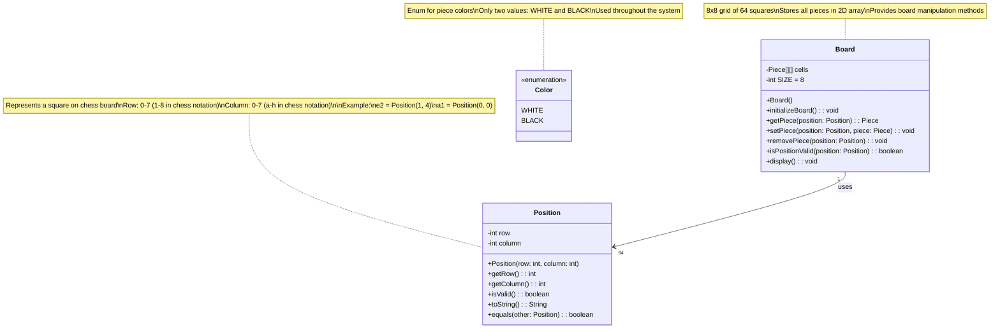

# Step 1: Basic Entities - Position and Board

## 🎯 WHERE TO START?

**Start with the simplest building blocks!** In chess, everything happens on a board with positions.

### Why Start Here?
1. **Foundation First**: Position and Board are the most basic concepts
2. **No Dependencies**: These classes don't depend on anything else
3. **Easy to Understand**: Even beginners can grasp coordinates and a grid
4. **Building Blocks**: All other classes will use these

### What We're Adding in Step 1:
- ✅ `Position` class (represents a square on the board)
- ✅ `Board` class (represents the 8x8 chess board)
- ✅ Simple enums for `Color`

---

## 📊 STEP 1: CLASS DIAGRAM



---

## 📝 WHAT YOU ADDED IN THIS STEP

### 1. **Position Class**
- Represents a single square on the chess board
- Uses row (0-7) and column (0-7) internally
- Maps to chess notation (a-h for columns, 1-8 for rows)

**Example:**
```java
Position e2 = new Position(1, 4);  // row 1 (2nd rank), column 4 (e-file)
Position a8 = new Position(7, 0);  // row 7 (8th rank), column 0 (a-file)
```

### 2. **Board Class**
- The chessboard itself - an 8x8 grid
- Uses a 2D array to store pieces
- Provides methods to get/set/remove pieces at positions

**Key Design Decision:**
- We use `Piece[][] cells` - a 2D array where cells[row][column] holds a Piece
- `null` means empty square

### 3. **Color Enum**
- Simple enumeration for piece colors
- Only two values: WHITE and BLACK
- Used to identify which player a piece belongs to

---

## 🤔 WHY YOU ADDED THESE

### Why Position Class?
- **Type Safety**: Better than using `int x, int y` everywhere
- **Validation**: Can check if position is valid (0-7 range)
- **Readability**: `position.getRow()` is clearer than `coordinates[0]`
- **Extensibility**: Later we can add chess notation conversion (e.g., "e2")

### Why Board Class?
- **Encapsulation**: Hides internal 2D array, provides clean API
- **Single Source of Truth**: Only one place stores piece positions
- **Validation**: Can validate positions before accessing array
- **Display**: Can provide methods to visualize the board

### Why Color Enum?
- **Type Safety**: Can't accidentally pass wrong value
- **Readability**: `Color.WHITE` is clearer than `0` or `"white"`
- **Compile-Time Checking**: Compiler catches typos

---

## 🔄 DESIGN DECISIONS

### Decision 1: Use 0-based indexing internally
**Why?**
- Java arrays are 0-indexed
- Simpler array access
- We'll convert to/from chess notation (a1-h8) in Position class

**Alternative Considered:**
- 1-based indexing (more intuitive for chess players)
- **Rejected**: Would require constant `-1` adjustments

### Decision 2: Board owns the Piece array
**Why?**
- Board is responsible for piece positions
- Prevents external code from breaking board state
- Easier to add features like "get all pieces" later

**Alternative Considered:**
- Pieces know their own positions
- **Rejected**: Leads to inconsistencies (piece says it's at e2, but board says it's at e4)

### Decision 3: Position is immutable
**Why?**
- Positions shouldn't change once created
- Makes Position objects safe to share
- Prevents bugs from accidental modification

---

## 🎓 BEGINNER EXPLANATION

### What is a Class Diagram?
Think of it like a blueprint for building houses:
- **Class Name** (Position): The type of building
- **Attributes** (row, column): The features (bedrooms, bathrooms)
- **Methods** (getRow(), isValid()): What you can do (open door, turn on lights)

### Reading the Diagram:
```
Position
├── Attributes (data it holds)
│   ├── row: int (a number for row)
│   └── column: int (a number for column)
└── Methods (actions it can do)
    ├── getRow(): int (tell me the row)
    └── isValid(): boolean (tell me if valid)
```

### Relationships:
- **Board → Position**: Board USES Position (arrow shows dependency)
- **"1" → "64"**: One board has 64 positions

---

## 💻 JAVA CODE SKELETON (Preview)

### Position.java
```java
public class Position {
    private final int row;     // 0-7 (immutable)
    private final int column;  // 0-7 (immutable)

    // Constructor: create a position
    public Position(int row, int column) {
        this.row = row;
        this.column = column;
    }

    // Getters
    public int getRow() {
        return row;
    }

    public int getColumn() {
        return column;
    }

    // Validation: is this position on the board?
    public boolean isValid() {
        return row >= 0 && row < 8 && column >= 0 && column < 8;
    }

    // Convert to chess notation (e.g., "e2")
    public String toString() {
        char file = (char) ('a' + column);  // 0→'a', 1→'b', ...
        int rank = row + 1;                 // 0→1, 1→2, ...
        return "" + file + rank;
    }

    // Check equality
    @Override
    public boolean equals(Object obj) {
        if (this == obj) return true;
        if (!(obj instanceof Position)) return false;
        Position other = (Position) obj;
        return this.row == other.row && this.column == other.column;
    }
}
```

### Board.java
```java
public class Board {
    private Piece[][] cells;           // 8x8 grid
    private static final int SIZE = 8; // Board size

    // Constructor: create empty board
    public Board() {
        cells = new Piece[SIZE][SIZE];  // All null initially
    }

    // Initialize board with starting pieces (we'll add pieces later)
    public void initializeBoard() {
        // TODO: Place all 32 pieces in starting positions
        // We'll implement this when we have Piece classes
    }

    // Get piece at a position
    public Piece getPiece(Position position) {
        if (!isPositionValid(position)) {
            throw new IllegalArgumentException("Invalid position: " + position);
        }
        return cells[position.getRow()][position.getColumn()];
    }

    // Place piece at a position
    public void setPiece(Position position, Piece piece) {
        if (!isPositionValid(position)) {
            throw new IllegalArgumentException("Invalid position: " + position);
        }
        cells[position.getRow()][position.getColumn()] = piece;
    }

    // Remove piece from a position
    public void removePiece(Position position) {
        setPiece(position, null);
    }

    // Check if position is valid
    public boolean isPositionValid(Position position) {
        return position != null && position.isValid();
    }

    // Display board (simple text representation)
    public void display() {
        for (int row = 7; row >= 0; row--) {  // Start from row 7 (top of board)
            System.out.print((row + 1) + " ");  // Rank number
            for (int col = 0; col < SIZE; col++) {
                Piece piece = cells[row][col];
                System.out.print(piece == null ? "." : piece.getSymbol());
                System.out.print(" ");
            }
            System.out.println();
        }
        System.out.println("  a b c d e f g h");  // File letters
    }
}
```

### Color.java
```java
public enum Color {
    WHITE,
    BLACK;

    // Helper method: get opposite color
    public Color opposite() {
        return this == WHITE ? BLACK : WHITE;
    }
}
```

---

## ✅ WHAT WE ACHIEVED

1. ✅ Created foundational classes that everything else will use
2. ✅ Established coordinate system (row/column internally, a-h/1-8 externally)
3. ✅ Set up board structure (8x8 grid)
4. ✅ Made Position immutable and safe
5. ✅ Added validation to prevent out-of-bounds errors

---

## 🚀 NEXT STEP

**Step 2**: We'll add the **Piece hierarchy** (abstract Piece class and concrete piece types like King, Queen, Pawn, etc.)

**Why wait?**
- We want to build incrementally
- Position and Board are complete and testable now
- Adding pieces is the logical next step

---

## 🎯 KEY TAKEAWAYS FOR BEGINNERS

1. **Start Simple**: We didn't add everything at once
2. **Foundation First**: Position and Board are prerequisites for pieces
3. **Encapsulation**: Board hides its internal array
4. **Immutability**: Position can't change (safer)
5. **Validation**: Always validate inputs (isValid() method)

**Think of it like building with LEGO**: We created the base plate (Board) and position markers (Position). Next, we'll add the actual pieces!

---
