# Step 2: Piece Hierarchy - Abstract Piece and Concrete Pieces

## 🎯 WHAT YOU ADDED IN THIS STEP?

We're adding the **chess pieces**! This includes:
- ✅ Abstract `Piece` class (base class for all pieces)
- ✅ Concrete piece classes: `King`, `Queen`, `Rook`, `Bishop`, `Knight`, `Pawn`
- ✅ `PieceType` enum to identify piece types

---

## 📊 STEP 2: CLASS DIAGRAM

```mermaid
classDiagram
    class Position {
        -int row
        -int column
        +Position(row: int, column: int)
        +getRow(): int
        +getColumn(): int
        +isValid(): boolean
        +toString(): String
    }

    class Board {
        -Piece[][] cells
        -int SIZE = 8
        +Board()
        +initializeBoard(): void
        +getPiece(position: Position): Piece
        +setPiece(position: Position, piece: Piece): void
        +removePiece(position: Position): void
        +isPositionValid(position: Position): boolean
    }

    class Color {
        <<enumeration>>
        WHITE
        BLACK
    }

    class PieceType {
        <<enumeration>>
        KING
        QUEEN
        ROOK
        BISHOP
        KNIGHT
        PAWN
    }

    class Piece {
        <<abstract>>
        -Color color
        -PieceType type
        -boolean hasMoved
        +Piece(color: Color, type: PieceType)
        +getColor(): Color
        +getType(): PieceType
        +hasMoved(): boolean
        +setMoved(moved: boolean): void
        +getSymbol(): String
        +canMove(from: Position, to: Position, board: Board): boolean*
        +getPossibleMoves(from: Position, board: Board): List~Position~*
    }

    class King {
        +King(color: Color)
        +canMove(from: Position, to: Position, board: Board): boolean
        +getPossibleMoves(from: Position, board: Board): List~Position~
        +getSymbol(): String
    }

    class Queen {
        +Queen(color: Color)
        +canMove(from: Position, to: Position, board: Board): boolean
        +getPossibleMoves(from: Position, board: Board): List~Position~
        +getSymbol(): String
    }

    class Rook {
        +Rook(color: Color)
        +canMove(from: Position, to: Position, board: Board): boolean
        +getPossibleMoves(from: Position, board: Board): List~Position~
        +getSymbol(): String
    }

    class Bishop {
        +Bishop(color: Color)
        +canMove(from: Position, to: Position, board: Board): boolean
        +getPossibleMoves(from: Position, board: Board): List~Position~
        +getSymbol(): String
    }

    class Knight {
        +Knight(color: Color)
        +canMove(from: Position, to: Position, board: Board): boolean
        +getPossibleMoves(from: Position, board: Board): List~Position~
        +getSymbol(): String
    }

    class Pawn {
        +Pawn(color: Color)
        +canMove(from: Position, to: Position, board: Board): boolean
        +getPossibleMoves(from: Position, board: Board): List~Position~
        +getSymbol(): String
    }

    Piece <|-- King : inherits
    Piece <|-- Queen : inherits
    Piece <|-- Rook : inherits
    Piece <|-- Bishop : inherits
    Piece <|-- Knight : inherits
    Piece <|-- Pawn : inherits

    Piece --> Color : has
    Piece --> PieceType : has
    Board "1" --> "*" Piece : contains

    note for Piece "Abstract base class\nDefines common behavior\nForces subclasses to implement\ncanMove() and getPossibleMoves()\n\n* = abstract method"

    note for King "Moves 1 square in any direction\n(horizontal, vertical, diagonal)\n\nSymbol: ♔ (White), ♚ (Black)"

    note for Queen "Moves any distance in any direction\n(combines Rook + Bishop)\n\nSymbol: ♕ (White), ♛ (Black)"

    note for Rook "Moves any distance\nhorizontally or vertically\n\nSymbol: ♖ (White), ♜ (Black)"

    note for Bishop "Moves any distance\ndiagonally\n\nSymbol: ♗ (White), ♝ (Black)"

    note for Knight "Moves in L-shape:\n2 squares one direction,\n1 square perpendicular\n\nCan jump over pieces!\n\nSymbol: ♘ (White), ♞ (Black)"

    note for Pawn "Moves 1 forward\n(2 on first move)\nCaptures diagonally\n\nSymbol: ♙ (White), ♟ (Black)"
```



---

## 📝 WHY YOU ADDED THESE CLASSES

### Abstract Piece Class
**Purpose**: Define common behavior for ALL pieces

**What's Common?**
- All pieces have a **color** (White or Black)
- All pieces have a **type** (King, Queen, etc.)
- All pieces track if they've **moved** (important for castling)
- All pieces can **move** (but differently)
- All pieces have a **symbol** for display

**Why Abstract?**
- You can't have a generic "Piece" on the board - it must be a specific type
- Forces all subclasses to implement movement logic
- Allows polymorphism (treat all pieces uniformly)

### Concrete Piece Classes
Each piece has **different movement rules**, so we need separate classes:

1. **King**: Moves 1 square in any direction
2. **Queen**: Moves any distance in any direction (most powerful)
3. **Rook**: Moves any distance horizontally or vertically
4. **Bishop**: Moves any distance diagonally
5. **Knight**: Moves in L-shape, can jump over pieces
6. **Pawn**: Moves forward, captures diagonally (most complex rules)

### PieceType Enum
**Purpose**: Identify what type of piece it is

**Why Not Just Use Class Names?**
- Easier to compare: `piece.getType() == PieceType.KING`
- Useful for serialization (saving game state)
- Helpful for debugging and logging

---

## 🔄 WHAT CHANGED FROM STEP 1?

### NEW Additions:
1. ✅ **Piece class hierarchy** (1 abstract + 6 concrete classes)
2. ✅ **PieceType enum** for piece identification
3. ✅ **Board now contains Pieces** (Board → Piece relationship)
4. ✅ **Abstract methods** that force subclasses to define movement

### Relationships Added:
- **Inheritance**: King, Queen, etc. inherit from Piece
- **Composition**: Board HAS Pieces (1 board, many pieces)
- **Association**: Piece HAS Color and PieceType

---

## 🎯 DESIGN DECISIONS

### Decision 1: Use Abstract Class (not Interface) for Piece
**Why?**
- Pieces have **common data** (color, type, hasMoved)
- Abstract class can hold this data
- Subclasses inherit these attributes automatically

**Alternative Considered:**
- Using an interface `IPiece`
- **Rejected**: Interfaces can't have instance variables (before Java 8)

### Decision 2: Each Piece Type Gets Its Own Class
**Why?**
- Each piece has **different movement logic**
- Follows **Single Responsibility Principle**
- Easy to test each piece independently
- Easy to modify one piece without affecting others

**Alternative Considered:**
- One Piece class with a switch statement for movement
- **Rejected**: Violates Open/Closed Principle, hard to maintain

### Decision 3: Pieces Don't Store Their Position
**Why?**
- **Single Source of Truth**: Board stores positions
- Prevents inconsistencies (piece thinks it's at e2, board says e4)
- Easier to move pieces (just update board array)

**Alternative Considered:**
- Each piece knows its position
- **Rejected**: Requires synchronization between piece and board

### Decision 4: Track `hasMoved` in Piece
**Why?**
- **Castling requirement**: King and Rook must not have moved
- **Pawn two-square move**: Only allowed on first move
- **En passant**: Only allowed immediately after opponent's pawn moves two squares

---

## 💻 JAVA CODE SKELETON

### Piece.java (Abstract Class)
```java
public abstract class Piece {
    private final Color color;        // WHITE or BLACK (immutable)
    private final PieceType type;     // KING, QUEEN, etc. (immutable)
    private boolean hasMoved;         // Track if piece has moved

    // Constructor: called by subclasses
    protected Piece(Color color, PieceType type) {
        this.color = color;
        this.type = type;
        this.hasMoved = false;  // Initially, piece hasn't moved
    }

    // Getters
    public Color getColor() {
        return color;
    }

    public PieceType getType() {
        return type;
    }

    public boolean hasMoved() {
        return hasMoved;
    }

    public void setMoved(boolean moved) {
        this.hasMoved = moved;
    }

    // Abstract methods: MUST be implemented by subclasses
    public abstract boolean canMove(Position from, Position to, Board board);
    public abstract List<Position> getPossibleMoves(Position from, Board board);
    public abstract String getSymbol();  // For display (♔, ♕, etc.)

    @Override
    public String toString() {
        return color + " " + type;
    }
}
```

### King.java
```java
public class King extends Piece {

    public King(Color color) {
        super(color, PieceType.KING);  // Call parent constructor
    }

    @Override
    public boolean canMove(Position from, Position to, Board board) {
        // King moves 1 square in any direction
        int rowDiff = Math.abs(to.getRow() - from.getRow());
        int colDiff = Math.abs(to.getColumn() - from.getColumn());

        // Must move exactly 1 square
        return (rowDiff <= 1 && colDiff <= 1) && (rowDiff + colDiff > 0);
    }

    @Override
    public List<Position> getPossibleMoves(Position from, Board board) {
        List<Position> moves = new ArrayList<>();

        // Check all 8 directions around the king
        int[] dRow = {-1, -1, -1, 0, 0, 1, 1, 1};
        int[] dCol = {-1, 0, 1, -1, 1, -1, 0, 1};

        for (int i = 0; i < 8; i++) {
            Position newPos = new Position(
                from.getRow() + dRow[i],
                from.getColumn() + dCol[i]
            );

            if (newPos.isValid() && canMove(from, newPos, board)) {
                moves.add(newPos);
            }
        }

        return moves;
    }

    @Override
    public String getSymbol() {
        return getColor() == Color.WHITE ? "♔" : "♚";
    }
}
```

### Queen.java
```java
public class Queen extends Piece {

    public Queen(Color color) {
        super(color, PieceType.QUEEN);
    }

    @Override
    public boolean canMove(Position from, Position to, Board board) {
        // Queen combines Rook + Bishop movement
        // Can move horizontally, vertically, or diagonally

        int rowDiff = Math.abs(to.getRow() - from.getRow());
        int colDiff = Math.abs(to.getColumn() - from.getColumn());

        // Horizontal or Vertical (like Rook)
        boolean straightMove = (rowDiff == 0 || colDiff == 0);

        // Diagonal (like Bishop)
        boolean diagonalMove = (rowDiff == colDiff);

        return straightMove || diagonalMove;
    }

    @Override
    public List<Position> getPossibleMoves(Position from, Board board) {
        // We'll implement this when we add PathValidator
        // For now, return empty list
        return new ArrayList<>();
    }

    @Override
    public String getSymbol() {
        return getColor() == Color.WHITE ? "♕" : "♛";
    }
}
```

### Rook.java
```java
public class Rook extends Piece {

    public Rook(Color color) {
        super(color, PieceType.ROOK);
    }

    @Override
    public boolean canMove(Position from, Position to, Board board) {
        // Rook moves horizontally or vertically
        int rowDiff = Math.abs(to.getRow() - from.getRow());
        int colDiff = Math.abs(to.getColumn() - from.getColumn());

        // Either row changes OR column changes (not both)
        return (rowDiff == 0 && colDiff > 0) || (colDiff == 0 && rowDiff > 0);
    }

    @Override
    public List<Position> getPossibleMoves(Position from, Board board) {
        return new ArrayList<>();  // TODO: Implement with PathValidator
    }

    @Override
    public String getSymbol() {
        return getColor() == Color.WHITE ? "♖" : "♜";
    }
}
```

### Bishop.java
```java
public class Bishop extends Piece {

    public Bishop(Color color) {
        super(color, PieceType.BISHOP);
    }

    @Override
    public boolean canMove(Position from, Position to, Board board) {
        // Bishop moves diagonally
        int rowDiff = Math.abs(to.getRow() - from.getRow());
        int colDiff = Math.abs(to.getColumn() - from.getColumn());

        // Row change must equal column change (diagonal)
        return rowDiff == colDiff && rowDiff > 0;
    }

    @Override
    public List<Position> getPossibleMoves(Position from, Board board) {
        return new ArrayList<>();  // TODO: Implement
    }

    @Override
    public String getSymbol() {
        return getColor() == Color.WHITE ? "♗" : "♝";
    }
}
```

### Knight.java
```java
public class Knight extends Piece {

    public Knight(Color color) {
        super(color, PieceType.KNIGHT);
    }

    @Override
    public boolean canMove(Position from, Position to, Board board) {
        // Knight moves in L-shape: 2 squares one direction, 1 perpendicular
        int rowDiff = Math.abs(to.getRow() - from.getRow());
        int colDiff = Math.abs(to.getColumn() - from.getColumn());

        // Either (2,1) or (1,2)
        return (rowDiff == 2 && colDiff == 1) || (rowDiff == 1 && colDiff == 2);
    }

    @Override
    public List<Position> getPossibleMoves(Position from, Board board) {
        List<Position> moves = new ArrayList<>();

        // All 8 possible L-shaped moves
        int[] dRow = {-2, -2, -1, -1, 1, 1, 2, 2};
        int[] dCol = {-1, 1, -2, 2, -2, 2, -1, 1};

        for (int i = 0; i < 8; i++) {
            Position newPos = new Position(
                from.getRow() + dRow[i],
                from.getColumn() + dCol[i]
            );

            if (newPos.isValid()) {
                moves.add(newPos);
            }
        }

        return moves;
    }

    @Override
    public String getSymbol() {
        return getColor() == Color.WHITE ? "♘" : "♞";
    }
}
```

### Pawn.java
```java
public class Pawn extends Piece {

    public Pawn(Color color) {
        super(color, PieceType.PAWN);
    }

    @Override
    public boolean canMove(Position from, Position to, Board board) {
        int direction = getColor() == Color.WHITE ? 1 : -1;  // White moves up, Black down
        int rowDiff = to.getRow() - from.getRow();
        int colDiff = Math.abs(to.getColumn() - from.getColumn());

        // Move forward 1 square
        if (rowDiff == direction && colDiff == 0) {
            return board.getPiece(to) == null;  // Must be empty
        }

        // Move forward 2 squares (first move only)
        if (rowDiff == 2 * direction && colDiff == 0 && !hasMoved()) {
            Position intermediate = new Position(from.getRow() + direction, from.getColumn());
            return board.getPiece(to) == null && board.getPiece(intermediate) == null;
        }

        // Capture diagonally
        if (rowDiff == direction && colDiff == 1) {
            Piece target = board.getPiece(to);
            return target != null && target.getColor() != getColor();
        }

        return false;
    }

    @Override
    public List<Position> getPossibleMoves(Position from, Board board) {
        return new ArrayList<>();  // TODO: Implement
    }

    @Override
    public String getSymbol() {
        return getColor() == Color.WHITE ? "♙" : "♟";
    }
}
```

### PieceType.java (Enum)
```java
public enum PieceType {
    KING,
    QUEEN,
    ROOK,
    BISHOP,
    KNIGHT,
    PAWN
}
```

---

## 🎓 UNDERSTANDING INHERITANCE

### What is Inheritance?
**Simple Explanation**: It's like family relationships!

- **Parent (Piece)**: Defines common features
- **Children (King, Queen, etc.)**: Inherit features, add their own

**Example:**
```
All humans have:
- Name (common)
- Age (common)

But:
- Doctor has: medical license (specific)
- Engineer has: engineering degree (specific)
```

### In Chess:
```
All pieces have:
- Color (common)
- Type (common)
- Movement ability (common)

But:
- King moves differently (specific)
- Queen moves differently (specific)
```

### Inheritance Benefits:
1. **Code Reuse**: Don't repeat color, type in every class
2. **Consistency**: All pieces behave similarly
3. **Polymorphism**: Treat all pieces uniformly

```java
Piece piece = board.getPiece(position);  // Don't know if King or Queen
boolean valid = piece.canMove(from, to, board);  // Works for both!
```

---

## ✅ WHAT WE ACHIEVED IN STEP 2

1. ✅ Created piece hierarchy with inheritance
2. ✅ Defined movement logic for each piece
3. ✅ Used polymorphism (treat all pieces uniformly)
4. ✅ Followed Single Responsibility Principle (each piece has one job)
5. ✅ Made pieces testable independently

---

## 🚀 NEXT STEP

**Step 3**: Add **Move Validation & Rules Engine**
- We'll create validators to check if moves are legal
- We'll add path checking (pieces can't jump over others, except Knight)
- We'll use the **Strategy Pattern** for flexible validation

---

## 🎯 KEY TAKEAWAYS

1. **Abstract Class**: Defines common behavior, forces implementation
2. **Inheritance**: Reuse code, avoid duplication
3. **Polymorphism**: Treat different pieces uniformly
4. **Single Responsibility**: Each piece class handles only its movement
5. **Encapsulation**: Movement logic hidden inside each piece

**Think of it like a zoo**: All animals (Piece) can move, but a bird flies, a fish swims, and a lion runs!

---
