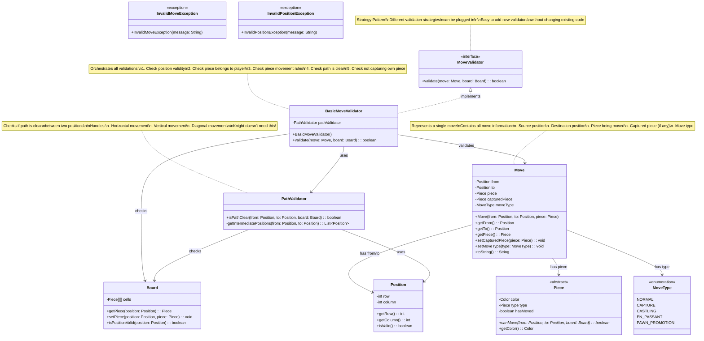

# Step 3: Move Validation & Rules Engine

## 🎯 WHAT YOU ADDED IN THIS STEP?

Now we add **smart validation** to ensure moves follow chess rules! This includes:
- ✅ `Move` class to represent a chess move
- ✅ `MoveValidator` interface (Strategy Pattern)
- ✅ `PathValidator` to check if path is clear
- ✅ `BasicMoveValidator` to orchestrate all validations
- ✅ Custom exceptions for better error handling

---

## 📊 STEP 3: CLASS DIAGRAM



---

## 📝 WHY YOU ADDED THESE CLASSES

### Move Class
**Purpose**: Encapsulate all information about a move

**Why?**
- **Single Object**: Pass one Move object instead of multiple parameters
- **History Tracking**: Store moves for move history
- **Undo/Redo**: Know what was captured to reverse the move
- **Better APIs**: `makeMove(Move move)` vs `makeMove(Position from, Position to, Piece piece, ...)`

### MoveValidator Interface (Strategy Pattern)
**Purpose**: Define a contract for move validation

**Why?**
- **Flexibility**: Swap validation strategies easily
- **Testing**: Mock validators for unit tests
- **Extensibility**: Add new validators without changing existing code
- **Open/Closed Principle**: Open for extension, closed for modification

**Example Use Cases:**
- BasicMoveValidator (current)
- CheckAwareMoveValidator (prevents moving into check) - we'll add later
- AIValidator (for computer opponent) - future

### PathValidator
**Purpose**: Check if the path between two positions is clear

**Why?**
- **Single Responsibility**: Separates path checking from move validation
- **Reusability**: Used by multiple piece types (Queen, Rook, Bishop)
- **Clear Logic**: Easier to understand and test

**Which Pieces Need This?**
- ✅ Queen (horizontal, vertical, diagonal)
- ✅ Rook (horizontal, vertical)
- ✅ Bishop (diagonal)
- ❌ Knight (jumps over pieces!)
- ❌ King (only 1 square)
- ❌ Pawn (simple forward movement)

### Custom Exceptions
**Purpose**: Provide clear, specific error messages

**Why?**
- **Clarity**: `InvalidMoveException` is clearer than generic `Exception`
- **Handling**: Can catch specific exceptions differently
- **Debugging**: Easier to find where errors occur

---

## 🔄 WHAT CHANGED FROM STEP 2?

### NEW Additions:
1. ✅ **Move class**: Represents a chess move with all metadata
2. ✅ **MoveValidator interface**: Strategy pattern for validation
3. ✅ **BasicMoveValidator**: First concrete validator implementation
4. ✅ **PathValidator**: Checks if path is clear
5. ✅ **MoveType enum**: Categorize different move types
6. ✅ **Custom exceptions**: Better error handling

### Design Pattern Introduced:
- **Strategy Pattern**: MoveValidator interface with pluggable implementations

---

## 🎯 DESIGN DECISIONS

### Decision 1: Create Move Class (Not Just Use Positions)
**Why?**
- **Rich Information**: Move contains more than just from/to
- **Move History**: Can store and replay moves
- **Undo/Redo**: Need to know what was captured
- **Chess Notation**: Can generate "e2-e4" notation

**Alternative Considered:**
- Just pass Position from, Position to
- **Rejected**: Lost information about captured pieces, move type

### Decision 2: Use Strategy Pattern for Validators
**Why?**
- **Flexibility**: Easily swap validators (basic → advanced)
- **Testing**: Can mock validators in tests
- **Separation**: Move validation logic separated from Move class
- **Open/Closed**: Add new validators without modifying Move

**Alternative Considered:**
- Put validation in Move class or Piece class
- **Rejected**: Violates Single Responsibility Principle

### Decision 3: Separate PathValidator Class
**Why?**
- **Single Responsibility**: Only checks paths
- **Reusability**: Multiple pieces use it
- **Testability**: Easy to unit test path logic
- **Clarity**: Complex path logic in dedicated class

### Decision 4: Use Exceptions for Invalid Moves
**Why?**
- **Clear Signals**: Exception clearly indicates error
- **Stack Trace**: See exactly where validation failed
- **Force Handling**: Developers must handle exceptions

**Alternative Considered:**
- Return boolean or error codes
- **Rejected**: Easy to ignore return values

---

## 💻 JAVA CODE SKELETON

### Move.java
```java
public class Move {
    private final Position from;       // Source position
    private final Position to;         // Destination position
    private final Piece piece;         // Piece being moved
    private Piece capturedPiece;       // Piece captured (if any)
    private MoveType moveType;         // Type of move

    // Constructor
    public Move(Position from, Position to, Piece piece) {
        this.from = from;
        this.to = to;
        this.piece = piece;
        this.moveType = MoveType.NORMAL;  // Default
    }

    // Getters
    public Position getFrom() {
        return from;
    }

    public Position getTo() {
        return to;
    }

    public Piece getPiece() {
        return piece;
    }

    public Piece getCapturedPiece() {
        return capturedPiece;
    }

    public MoveType getMoveType() {
        return moveType;
    }

    // Setters
    public void setCapturedPiece(Piece piece) {
        this.capturedPiece = piece;
        if (piece != null) {
            this.moveType = MoveType.CAPTURE;
        }
    }

    public void setMoveType(MoveType type) {
        this.moveType = type;
    }

    // Display in chess notation (e.g., "e2 → e4")
    @Override
    public String toString() {
        String notation = from.toString() + " → " + to.toString();
        if (capturedPiece != null) {
            notation += " (captures " + capturedPiece.getType() + ")";
        }
        return notation;
    }
}
```

### MoveType.java (Enum)
```java
public enum MoveType {
    NORMAL,          // Regular move
    CAPTURE,         // Capturing opponent's piece
    CASTLING,        // King-Rook castling
    EN_PASSANT,      // Special pawn capture
    PAWN_PROMOTION   // Pawn reaches end
}
```

### MoveValidator.java (Interface)
```java
public interface MoveValidator {
    /**
     * Validates if a move is legal according to chess rules
     * @param move The move to validate
     * @param board The current board state
     * @return true if move is valid, false otherwise
     * @throws InvalidMoveException if move is illegal
     */
    boolean validate(Move move, Board board) throws InvalidMoveException;
}
```

### BasicMoveValidator.java
```java
public class BasicMoveValidator implements MoveValidator {

    private final PathValidator pathValidator;

    public BasicMoveValidator() {
        this.pathValidator = new PathValidator();
    }

    @Override
    public boolean validate(Move move, Board board) throws InvalidMoveException {
        Position from = move.getFrom();
        Position to = move.getTo();
        Piece piece = move.getPiece();

        // Validation 1: Check positions are valid
        if (!board.isPositionValid(from) || !board.isPositionValid(to)) {
            throw new InvalidPositionException("Position out of bounds: " + from + " to " + to);
        }

        // Validation 2: Check source has a piece
        Piece sourcePiece = board.getPiece(from);
        if (sourcePiece == null) {
            throw new InvalidMoveException("No piece at position: " + from);
        }

        // Validation 3: Check piece matches the move
        if (!sourcePiece.equals(piece)) {
            throw new InvalidMoveException("Piece mismatch at position: " + from);
        }

        // Validation 4: Check destination is different
        if (from.equals(to)) {
            throw new InvalidMoveException("Source and destination are the same");
        }

        // Validation 5: Check not capturing own piece
        Piece destinationPiece = board.getPiece(to);
        if (destinationPiece != null && destinationPiece.getColor() == piece.getColor()) {
            throw new InvalidMoveException("Cannot capture your own piece");
        }

        // Validation 6: Check piece-specific movement rules
        if (!piece.canMove(from, to, board)) {
            throw new InvalidMoveException(piece.getType() + " cannot move from " + from + " to " + to);
        }

        // Validation 7: Check path is clear (except for Knight)
        if (piece.getType() != PieceType.KNIGHT) {
            if (!pathValidator.isPathClear(from, to, board)) {
                throw new InvalidMoveException("Path is blocked from " + from + " to " + to);
            }
        }

        // If we reach here, move is valid!
        return true;
    }
}
```

### PathValidator.java
```java
public class PathValidator {

    /**
     * Checks if the path between two positions is clear (no pieces blocking)
     * @param from Starting position
     * @param to Ending position
     * @param board The chess board
     * @return true if path is clear, false otherwise
     */
    public boolean isPathClear(Position from, Position to, Board board) {
        List<Position> path = getIntermediatePositions(from, to);

        // Check each position in the path
        for (Position pos : path) {
            if (board.getPiece(pos) != null) {
                return false;  // Path is blocked
            }
        }

        return true;  // Path is clear
    }

    /**
     * Gets all positions between from and to (excluding endpoints)
     * @param from Starting position
     * @param to Ending position
     * @return List of intermediate positions
     */
    private List<Position> getIntermediatePositions(Position from, Position to) {
        List<Position> positions = new ArrayList<>();

        int rowDiff = to.getRow() - from.getRow();
        int colDiff = to.getColumn() - from.getColumn();

        // Determine direction of movement
        int rowStep = Integer.compare(rowDiff, 0);  // -1, 0, or 1
        int colStep = Integer.compare(colDiff, 0);  // -1, 0, or 1

        int currentRow = from.getRow() + rowStep;
        int currentCol = from.getColumn() + colStep;

        // Collect all intermediate positions
        while (currentRow != to.getRow() || currentCol != to.getColumn()) {
            positions.add(new Position(currentRow, currentCol));
            currentRow += rowStep;
            currentCol += colStep;
        }

        return positions;
    }
}
```

### InvalidMoveException.java
```java
public class InvalidMoveException extends Exception {
    public InvalidMoveException(String message) {
        super(message);
    }
}
```

### InvalidPositionException.java
```java
public class InvalidPositionException extends InvalidMoveException {
    public InvalidPositionException(String message) {
        super(message);
    }
}
```

---

## 🎓 UNDERSTANDING STRATEGY PATTERN

### What is Strategy Pattern?

**Simple Explanation**: Different ways to do the same task!

**Real-World Example:**
```
Task: Get to work

Strategy 1: Drive a car (fast, expensive)
Strategy 2: Take the bus (slow, cheap)
Strategy 3: Ride a bike (medium, healthy)

All strategies accomplish the same goal (get to work),
but in different ways!
```

### In Chess:
```
Task: Validate a move

Strategy 1: BasicMoveValidator (just check piece rules)
Strategy 2: CheckAwareMoveValidator (also check for check)
Strategy 3: AIValidator (evaluate move quality for computer)

All strategies validate moves,
but with different levels of sophistication!
```

### Benefits:
1. **Flexibility**: Swap strategies at runtime
2. **Extensibility**: Add new strategies without changing existing code
3. **Testing**: Mock strategies for unit tests

### Code Example:
```java
// Strategy pattern in action!
MoveValidator validator;

// Easy mode: just basic validation
validator = new BasicMoveValidator();

// Hard mode: check-aware validation
validator = new CheckAwareMoveValidator();

// Both use the same interface!
boolean valid = validator.validate(move, board);
```

---

## 🎓 HOW PATH VALIDATION WORKS

### Example: Rook at a1 moves to a8

```
Board:
8 . . . . . . . .
7 . . . . . . . .
6 . . . . . . . .
5 . . P . . . . .   ← Pawn blocks here!
4 . . . . . . . .
3 . . . . . . . .
2 . . . . . . . .
1 R . . . . . . .   ← Rook starts here
  a b c d e f g h

From: a1 (row=0, col=0)
To: a8 (row=7, col=0)

Intermediate positions:
- a2 (row=1, col=0) ✅ empty
- a3 (row=2, col=0) ✅ empty
- a4 (row=3, col=0) ✅ empty
- a5 (row=4, col=0) ❌ has Pawn!

Result: Path is NOT clear, move is invalid
```

### How getIntermediatePositions() Works:

1. **Calculate direction**:
   - rowStep = sign(7 - 0) = 1 (moving up)
   - colStep = sign(0 - 0) = 0 (not moving horizontally)

2. **Step through path**:
   - Start: (0, 0) + (1, 0) = (1, 0) → a2
   - Next: (1, 0) + (1, 0) = (2, 0) → a3
   - Next: (2, 0) + (1, 0) = (3, 0) → a4
   - Next: (3, 0) + (1, 0) = (4, 0) → a5
   - ... until we reach (7, 0)

---

## ✅ WHAT WE ACHIEVED IN STEP 3

1. ✅ Created Move class to encapsulate move information
2. ✅ Implemented Strategy Pattern with MoveValidator interface
3. ✅ Built comprehensive validation logic (7 checks!)
4. ✅ Added path checking for sliding pieces
5. ✅ Created custom exceptions for clear error messages
6. ✅ Followed Single Responsibility Principle (each class has one job)

---

## 🚀 NEXT STEP

**Step 4**: Add **Game State Management**
- We'll track game status (IN_PROGRESS, CHECK, CHECKMATE, STALEMATE)
- We'll add move history tracking
- We'll create the main ChessGame class to orchestrate everything

---

## 🎯 KEY TAKEAWAYS

1. **Strategy Pattern**: Pluggable validation strategies
2. **Encapsulation**: Move class bundles related data
3. **Separation of Concerns**: PathValidator separate from MoveValidator
4. **Custom Exceptions**: Clear, specific error messages
5. **Single Responsibility**: Each validator has one job

**Think of it like airport security**: Multiple checkpoints (position valid? piece belongs to you? path clear?), and you must pass ALL to board the plane (make the move)!

---

## 🐛 COMMON BEGINNER MISTAKES

### Mistake 1: Putting validation in Piece.canMove()
```java
// ❌ BAD: Piece does too much
public boolean canMove(Position from, Position to, Board board) {
    // Check if piece can move
    // Check if path is clear
    // Check if it leaves king in check
    // ... too many responsibilities!
}
```

**Solution**: Use Strategy Pattern - separate validators!

### Mistake 2: Not checking path for sliding pieces
```java
// ❌ BAD: Queen can "jump" over pieces
public boolean canMove(Position from, Position to, Board board) {
    return isDiagonalOrStraight(from, to);  // Doesn't check path!
}
```

**Solution**: Use PathValidator for Queen, Rook, Bishop!

### Mistake 3: Using boolean instead of exceptions
```java
// ❌ BAD: No information about WHY it failed
public boolean validate(Move move, Board board) {
    return false;  // Why did it fail?
}
```

**Solution**: Throw exceptions with descriptive messages!

---
