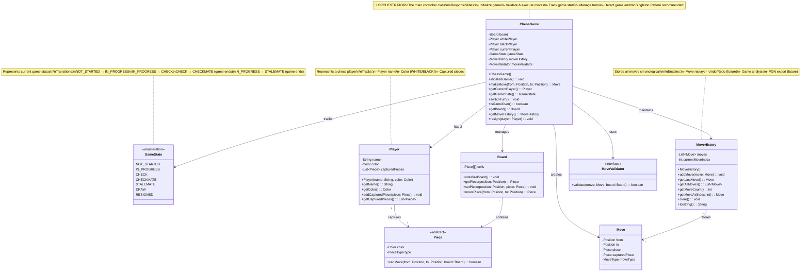

# Step 4: Game State Management & ChessGame Orchestrator

## 🎯 WHAT YOU ADDED IN THIS STEP?

Now we add the **brain of the system** - the ChessGame class that orchestrates everything! This includes:
- ✅ `ChessGame` class (main orchestrator)
- ✅ `GameState` enum to track game status
- ✅ `MoveHistory` class to track all moves
- ✅ Integration of all previous components

---

## 📊 STEP 4: CLASS DIAGRAM



---

## 📝 WHY YOU ADDED THESE CLASSES

### ChessGame Class (Orchestrator)
**Purpose**: The main controller that brings everything together

**Why?**
- **Central Control**: One place to manage the entire game
- **Simplifies API**: Users interact with ChessGame, not individual classes
- **Encapsulation**: Hides complexity of board, validators, etc.
- **Game Flow**: Manages turn-taking, state transitions

**Without ChessGame:**
```java
// ❌ User has to manage everything manually
Board board = new Board();
board.initializeBoard();
MoveValidator validator = new BasicMoveValidator();
Move move = new Move(from, to, piece);
validator.validate(move, board);
board.movePiece(from, to);
// ... lots of code!
```

**With ChessGame:**
```java
// ✅ Simple and clean!
ChessGame game = new ChessGame();
game.initializeGame();
game.makeMove(from, to);
```

### GameState Enum
**Purpose**: Track what's happening in the game

**Why?**
- **Clarity**: Know if game is active, in check, or over
- **Flow Control**: Prevent moves when game is over
- **UI Updates**: Show appropriate message to players
- **State Machine**: Clear transitions between states

### MoveHistory Class
**Purpose**: Store and manage all moves

**Why?**
- **Replay**: Show how the game progressed
- **Undo/Redo**: Reverse moves (future feature)
- **Analysis**: Review and learn from games
- **Debugging**: See what happened

### Player Class
**Purpose**: Represent a chess player

**Why?**
- **Identity**: Distinguish between White and Black
- **Captured Pieces**: Track what each player captured
- **Statistics**: Can add wins/losses later
- **Extensibility**: Can add rating, time remaining, etc.

---

## 🔄 WHAT CHANGED FROM STEP 3?

### NEW Additions:
1. ✅ **ChessGame class**: Main orchestrator
2. ✅ **GameState enum**: Track game status
3. ✅ **MoveHistory class**: Store all moves
4. ✅ **Player class**: Represent players
5. ✅ **Integration**: All components work together

### Key Relationships:
- ChessGame **manages** Board
- ChessGame **has** 2 Players
- ChessGame **tracks** GameState
- ChessGame **maintains** MoveHistory
- ChessGame **uses** MoveValidator

---

## 🎯 DESIGN DECISIONS

### Decision 1: ChessGame is the Orchestrator
**Why?**
- **Facade Pattern**: Provides simple interface to complex subsystem
- **Single Entry Point**: Users interact only with ChessGame
- **Testability**: Easy to mock dependencies
- **Clear Responsibility**: ChessGame orchestrates, other classes do specific tasks

### Decision 2: Separate MoveHistory Class
**Why?**
- **Single Responsibility**: Only manages move history
- **Reusability**: Can export to different formats (PGN, JSON)
- **Extensibility**: Easy to add undo/redo later

**Alternative Considered:**
- Store moves in a simple List in ChessGame
- **Rejected**: ChessGame would have too many responsibilities

### Decision 3: Player is a Separate Class
**Why?**
- **Extensibility**: Can add player stats, ratings, etc.
- **Clarity**: Clear distinction between players
- **Captured Pieces**: Players own their captures

**Alternative Considered:**
- Just use Color enum
- **Rejected**: Lost ability to track player-specific data

### Decision 4: GameState Enum (Not Boolean)
**Why?**
- **Multiple States**: More than just "active" or "over"
- **Clarity**: `gameState == GameState.CHECK` is clearer than flags
- **Extensibility**: Easy to add new states (DRAW, RESIGNED)

**Alternative Considered:**
- Boolean flags (isCheck, isCheckmate, isGameOver)
- **Rejected**: Hard to maintain consistency between flags

---

## 💻 JAVA CODE SKELETON

### ChessGame.java (Main Orchestrator)
```java
public class ChessGame {
    private Board board;
    private Player whitePlayer;
    private Player blackPlayer;
    private Player currentPlayer;
    private GameState gameState;
    private MoveHistory moveHistory;
    private MoveValidator moveValidator;

    // Constructor: Initialize game components
    public ChessGame() {
        this.board = new Board();
        this.whitePlayer = new Player("White", Color.WHITE);
        this.blackPlayer = new Player("Black", Color.BLACK);
        this.currentPlayer = whitePlayer;  // White starts
        this.gameState = GameState.NOT_STARTED;
        this.moveHistory = new MoveHistory();
        this.moveValidator = new BasicMoveValidator();
    }

    /**
     * Initialize the game: set up board and start
     */
    public void initializeGame() {
        board.initializeBoard();  // Place all pieces
        gameState = GameState.IN_PROGRESS;
        System.out.println("Game started! White's turn.");
    }

    /**
     * Make a move from one position to another
     * @param from Source position
     * @param to Destination position
     * @return The move that was made
     * @throws InvalidMoveException if move is illegal
     */
    public Move makeMove(Position from, Position to) throws InvalidMoveException {
        // Check if game is active
        if (isGameOver()) {
            throw new InvalidMoveException("Game is over! State: " + gameState);
        }

        // Get the piece at source position
        Piece piece = board.getPiece(from);

        // Check piece belongs to current player
        if (piece == null || piece.getColor() != currentPlayer.getColor()) {
            throw new InvalidMoveException("No piece or wrong color at " + from);
        }

        // Create move object
        Move move = new Move(from, to, piece);

        // Validate the move
        moveValidator.validate(move, board);

        // Execute the move
        executeMove(move);

        // Add to history
        moveHistory.addMove(move);

        // Switch turn
        switchTurn();

        // Check for check/checkmate/stalemate (we'll implement this later)
        updateGameState();

        return move;
    }

    /**
     * Execute a validated move (update board state)
     */
    private void executeMove(Move move) {
        Position from = move.getFrom();
        Position to = move.getTo();

        // Check if capturing opponent's piece
        Piece capturedPiece = board.getPiece(to);
        if (capturedPiece != null) {
            move.setCapturedPiece(capturedPiece);
            currentPlayer.addCapturedPiece(capturedPiece);
        }

        // Move the piece on the board
        board.movePiece(from, to);

        // Mark piece as moved (important for castling)
        move.getPiece().setMoved(true);
    }

    /**
     * Switch to the other player
     */
    public void switchTurn() {
        currentPlayer = (currentPlayer == whitePlayer) ? blackPlayer : whitePlayer;
        System.out.println(currentPlayer.getName() + "'s turn.");
    }

    /**
     * Update game state (check for check, checkmate, stalemate)
     * We'll implement this in Step 7
     */
    private void updateGameState() {
        // TODO: Detect check
        // TODO: Detect checkmate
        // TODO: Detect stalemate
        gameState = GameState.IN_PROGRESS;  // For now
    }

    /**
     * Player resigns
     */
    public void resign(Player player) {
        gameState = GameState.RESIGNED;
        Player winner = (player == whitePlayer) ? blackPlayer : whitePlayer;
        System.out.println(player.getName() + " resigned. " + winner.getName() + " wins!");
    }

    /**
     * Check if game is over
     */
    public boolean isGameOver() {
        return gameState == GameState.CHECKMATE ||
               gameState == GameState.STALEMATE ||
               gameState == GameState.DRAW ||
               gameState == GameState.RESIGNED;
    }

    // Getters
    public Player getCurrentPlayer() {
        return currentPlayer;
    }

    public GameState getGameState() {
        return gameState;
    }

    public Board getBoard() {
        return board;
    }

    public MoveHistory getMoveHistory() {
        return moveHistory;
    }
}
```

### GameState.java (Enum)
```java
public enum GameState {
    NOT_STARTED,    // Game created but not initialized
    IN_PROGRESS,    // Game is active, normal play
    CHECK,          // Current player's king is under attack
    CHECKMATE,      // Current player has no moves to escape check (game over)
    STALEMATE,      // Current player has no legal moves but not in check (draw)
    DRAW,           // Game ended in draw (by agreement, repetition, etc.)
    RESIGNED        // A player resigned (game over)
}
```

### MoveHistory.java
```java
import java.util.ArrayList;
import java.util.List;

public class MoveHistory {
    private List<Move> moves;           // All moves in order
    private int currentMoveIndex;       // Current position (for undo/redo)

    public MoveHistory() {
        this.moves = new ArrayList<>();
        this.currentMoveIndex = -1;
    }

    /**
     * Add a move to history
     */
    public void addMove(Move move) {
        moves.add(move);
        currentMoveIndex = moves.size() - 1;
    }

    /**
     * Get the last move made
     */
    public Move getLastMove() {
        if (moves.isEmpty()) {
            return null;
        }
        return moves.get(moves.size() - 1);
    }

    /**
     * Get all moves
     */
    public List<Move> getAllMoves() {
        return new ArrayList<>(moves);  // Return copy to prevent modification
    }

    /**
     * Get total number of moves
     */
    public int getMoveCount() {
        return moves.size();
    }

    /**
     * Get move at specific index
     */
    public Move getMoveAt(int index) {
        if (index < 0 || index >= moves.size()) {
            throw new IndexOutOfBoundsException("Invalid move index: " + index);
        }
        return moves.get(index);
    }

    /**
     * Clear all moves
     */
    public void clear() {
        moves.clear();
        currentMoveIndex = -1;
    }

    /**
     * Display move history in chess notation
     */
    @Override
    public String toString() {
        StringBuilder sb = new StringBuilder("Move History:\n");
        for (int i = 0; i < moves.size(); i++) {
            sb.append((i + 1)).append(". ").append(moves.get(i)).append("\n");
        }
        return sb.toString();
    }
}
```

### Player.java
```java
import java.util.ArrayList;
import java.util.List;

public class Player {
    private final String name;              // Player name
    private final Color color;              // WHITE or BLACK
    private List<Piece> capturedPieces;     // Pieces this player captured

    public Player(String name, Color color) {
        this.name = name;
        this.color = color;
        this.capturedPieces = new ArrayList<>();
    }

    // Getters
    public String getName() {
        return name;
    }

    public Color getColor() {
        return color;
    }

    public List<Piece> getCapturedPieces() {
        return new ArrayList<>(capturedPieces);  // Return copy
    }

    /**
     * Add a captured piece to this player's collection
     */
    public void addCapturedPiece(Piece piece) {
        capturedPieces.add(piece);
    }

    /**
     * Calculate total value of captured pieces
     * (Pawn=1, Knight=3, Bishop=3, Rook=5, Queen=9)
     */
    public int getCaptureScore() {
        int score = 0;
        for (Piece piece : capturedPieces) {
            switch (piece.getType()) {
                case PAWN:   score += 1; break;
                case KNIGHT: score += 3; break;
                case BISHOP: score += 3; break;
                case ROOK:   score += 5; break;
                case QUEEN:  score += 9; break;
                default: break;
            }
        }
        return score;
    }

    @Override
    public String toString() {
        return name + " (" + color + ")";
    }
}
```

### Updated Board.java (add movePiece method)
```java
public class Board {
    // ... existing code ...

    /**
     * Move a piece from one position to another
     * Returns captured piece (if any)
     */
    public Piece movePiece(Position from, Position to) {
        Piece piece = getPiece(from);
        Piece capturedPiece = getPiece(to);

        // Move piece to new position
        setPiece(to, piece);

        // Clear old position
        removePiece(from);

        return capturedPiece;
    }
}
```

---

## 🎓 UNDERSTANDING THE ORCHESTRATOR PATTERN

### What is an Orchestrator?

**Simple Analogy**: Think of a symphony orchestra!

- **Musicians** (Board, Validator, History): Each plays their instrument
- **Conductor** (ChessGame): Coordinates everyone to create music

**Without Conductor:**
- Musicians play whenever they want → chaos!
- No coordination → sounds terrible

**With Conductor:**
- Conductor signals when to play → harmony!
- Everything flows smoothly → beautiful music

### In Chess:
```
Without ChessGame:
- User creates Board, Validator, History separately
- User manually coordinates them
- Complex and error-prone

With ChessGame:
- ChessGame creates and coordinates everything
- User just calls game.makeMove()
- Simple and clean!
```

---

## 🎓 GAME STATE TRANSITIONS

```
State Diagram:

NOT_STARTED
     ↓
     | initializeGame()
     ↓
IN_PROGRESS ←→ CHECK
     ↓           ↓
     |           | (no escape)
     |           ↓
     |      CHECKMATE (game over)
     ↓
     | (no legal moves, not in check)
     ↓
STALEMATE (game over)

Also:
IN_PROGRESS → RESIGNED (player resigns)
IN_PROGRESS → DRAW (by agreement)
```

**Valid Transitions:**
- NOT_STARTED → IN_PROGRESS (start game)
- IN_PROGRESS → CHECK (king under attack)
- CHECK → IN_PROGRESS (escape check)
- CHECK → CHECKMATE (no escape, game over)
- IN_PROGRESS → STALEMATE (no moves, game over)
- IN_PROGRESS → RESIGNED (player quits)

---

## 🎓 HOW makeMove() WORKS (Step-by-Step)

```java
game.makeMove(e2, e4);
```

**Flow:**
1. **Check game is active**: If game is over, throw exception
2. **Get piece**: board.getPiece(e2) → Pawn
3. **Check ownership**: Is it current player's piece?
4. **Create Move object**: new Move(e2, e4, Pawn)
5. **Validate move**: moveValidator.validate(move, board)
   - Position valid?
   - Piece movement rules?
   - Path clear?
   - Not capturing own piece?
6. **Execute move**:
   - Check if capturing
   - Move piece on board
   - Mark piece as moved
7. **Add to history**: moveHistory.addMove(move)
8. **Switch turn**: currentPlayer = blackPlayer
9. **Update state**: Check for check/checkmate/stalemate
10. **Return move**: Return the Move object

---

## ✅ WHAT WE ACHIEVED IN STEP 4

1. ✅ Created ChessGame orchestrator class
2. ✅ Integrated all components (Board, Validator, History, Players)
3. ✅ Implemented complete move flow
4. ✅ Added game state tracking
5. ✅ Simplified API for users
6. ✅ Prepared for check/checkmate detection

---

## 🚀 NEXT STEP

**Step 5**: We won't need a separate step for Player management since we've covered it here!

**Step 6**: Add **Special Moves** (Castling, En Passant, Pawn Promotion)
- These are complex moves with special rules
- We'll create specialized validators for each

---

## 🎯 KEY TAKEAWAYS

1. **Orchestrator Pattern**: ChessGame coordinates all components
2. **Facade Pattern**: Simple interface to complex subsystem
3. **State Management**: Clear game state transitions
4. **History Tracking**: Store moves for replay/analysis
5. **Clean API**: Users interact with ChessGame, not individual classes

**Think of ChessGame like a restaurant manager**: Coordinates kitchen (Board), waiters (Validators), and receipts (MoveHistory) to serve customers (Players)!

---

## 🐛 COMMON BEGINNER MISTAKES

### Mistake 1: Making Board or Validator static
```java
// ❌ BAD: Static makes it hard to test and reuse
public class ChessGame {
    private static Board board;
    private static MoveValidator validator;
}
```

**Solution**: Use instance variables!

### Mistake 2: Not checking game state before moves
```java
// ❌ BAD: Allow moves even when game is over
public Move makeMove(Position from, Position to) {
    // No check if game is over!
    return executeMove(from, to);
}
```

**Solution**: Always check if game is active!

### Mistake 3: Exposing too much to users
```java
// ❌ BAD: Users can break the game
public Board board;  // Public!
public MoveValidator validator;  // Public!
```

**Solution**: Keep fields private, provide getters!

### Mistake 4: Not tracking move history
```java
// ❌ BAD: Can't review or undo moves
public void makeMove(Position from, Position to) {
    board.movePiece(from, to);
    // Forgot to save move!
}
```

**Solution**: Always add to MoveHistory!

---
