# Step 5: Special Moves - Castling, En Passant, Pawn Promotion

## 🎯 WHAT YOU ADDED IN THIS STEP?

Chess has **special moves** beyond basic piece movement! This step adds:
- ✅ `CastlingValidator` for king-rook castling
- ✅ `EnPassantValidator` for special pawn capture
- ✅ `PawnPromotionHandler` for pawn promotion
- ✅ `SpecialMoveDetector` to identify special moves
- ✅ Enhanced `MoveValidator` to handle special cases

---

## 📊 STEP 5: CLASS DIAGRAM

```mermaid
classDiagram
    class ChessGame {
        -Board board
        -MoveValidator moveValidator
        -SpecialMoveDetector specialMoveDetector
        +makeMove(from: Position, to: Position): Move
        +promotePawn(position: Position, newType: PieceType): void
    }

    class MoveValidator {
        <<interface>>
        +validate(move: Move, board: Board): boolean
    }

    class BasicMoveValidator {
        -PathValidator pathValidator
        +validate(move: Move, board: Board): boolean
    }

    class SpecialMoveDetector {
        -CastlingValidator castlingValidator
        -EnPassantValidator enPassantValidator
        +detectSpecialMove(move: Move, board: Board): MoveType
        +isCastling(move: Move, board: Board): boolean
        +isEnPassant(move: Move, board: Board): boolean
        +isPawnPromotion(move: Move, board: Board): boolean
    }

    class CastlingValidator {
        +validateCastling(move: Move, board: Board): boolean
        +isKingsideCastling(move: Move): boolean
        +isQueensideCastling(move: Move): boolean
        -canCastle(king: Piece, rook: Piece, board: Board): boolean
        -isPathClearForCastling(king: Position, rook: Position, board: Board): boolean
        -isKingUnderAttack(kingPos: Position, board: Board): boolean
        +executeKingsideCastling(board: Board, color: Color): void
        +executeQueensideCastling(board: Board, color: Color): void
    }

    class EnPassantValidator {
        -MoveHistory moveHistory
        +EnPassantValidator(moveHistory: MoveHistory)
        +validateEnPassant(move: Move, board: Board): boolean
        +isEnPassantPossible(pawnPos: Position, targetPos: Position, board: Board): boolean
        -getAdjacentPawnPosition(pawnPos: Position, targetPos: Position): Position
        +executeEnPassant(move: Move, board: Board): Piece
    }

    class PawnPromotionHandler {
        +isPawnAtPromotionRank(pawn: Piece, position: Position): boolean
        +promotePawn(board: Board, position: Position, newType: PieceType): Piece
        +getPromotionOptions(): List~PieceType~
    }

    class MoveHistory {
        -List~Move~ moves
        +getLastMove(): Move
        +addMove(move: Move): void
    }

    class Move {
        -Position from
        -Position to
        -Piece piece
        -MoveType moveType
        +setMoveType(type: MoveType): void
    }

    class MoveType {
        <<enumeration>>
        NORMAL
        CAPTURE
        CASTLING_KINGSIDE
        CASTLING_QUEENSIDE
        EN_PASSANT
        PAWN_PROMOTION
    }

    MoveValidator <|.. BasicMoveValidator
    ChessGame --> SpecialMoveDetector : uses
    ChessGame --> MoveValidator : uses
    ChessGame --> PawnPromotionHandler : uses

    SpecialMoveDetector --> CastlingValidator : uses
    SpecialMoveDetector --> EnPassantValidator : uses
    SpecialMoveDetector --> PawnPromotionHandler : uses

    EnPassantValidator --> MoveHistory : checks
    CastlingValidator --> Board : validates
    PawnPromotionHandler --> Board : modifies

    Move --> MoveType : has

    note for CastlingValidator "Validates Castling Rules:\n1. King hasn't moved\n2. Rook hasn't moved\n3. No pieces between them\n4. King not in check\n5. King doesn't pass through check\n6. King doesn't land in check\n\nTwo types:\n- Kingside (0-0): K moves e1→g1\n- Queenside (0-0-0): K moves e1→c1"

    note for EnPassantValidator "Validates En Passant:\n1. Attacker is a pawn\n2. Opponent pawn just moved 2 squares\n3. Opponent pawn is adjacent\n4. Must capture immediately\n\nRequires move history to check\nlast move!"

    note for PawnPromotionHandler "Handles Pawn Promotion:\n1. Detect when pawn reaches last rank\n2. Replace pawn with chosen piece\n3. Usually Queen (strongest)\n\nOptions: Queen, Rook, Bishop, Knight"

    note for SpecialMoveDetector "Central hub for special moves\nDetects which special move is happening\nDelegates to specific validators"
```



---

## 📝 WHY YOU ADDED THESE CLASSES

### CastlingValidator
**Purpose**: Handle the complex castling move

**Castling Rules (Complex!):**
1. King and Rook haven't moved
2. No pieces between King and Rook
3. King is NOT in check currently
4. King doesn't pass through a square under attack
5. King doesn't land on a square under attack

**Why Separate Class?**
- **Complexity**: Castling has 6 rules to check
- **Special Execution**: Moves TWO pieces (King + Rook)
- **Reusability**: Both players can castle
- **Testability**: Easy to unit test

### EnPassantValidator
**Purpose**: Validate the special pawn capture

**En Passant Rules:**
1. Your pawn is on 5th rank (White) or 4th rank (Black)
2. Opponent's pawn just moved 2 squares forward
3. Opponent's pawn is now adjacent to your pawn
4. You capture diagonally behind opponent's pawn
5. Must happen **immediately** (can't wait)

**Why Needs MoveHistory?**
- Must check if opponent's **last move** was a 2-square pawn advance
- Without history, can't validate this rule

### PawnPromotionHandler
**Purpose**: Handle pawn reaching the last rank

**Pawn Promotion Rules:**
1. Pawn reaches 8th rank (White) or 1st rank (Black)
2. Pawn MUST be promoted (can't stay a pawn)
3. Can promote to: Queen, Rook, Bishop, or Knight
4. Cannot promote to King or Pawn

**Why Separate Handler?**
- **User Input**: Needs to ask player which piece to promote to
- **Special Logic**: Removes pawn, creates new piece
- **Different from Normal Moves**: Not just position change

### SpecialMoveDetector
**Purpose**: Identify and coordinate special moves

**Why?**
- **Central Hub**: One place to check for all special moves
- **Delegation**: Delegates to specific validators
- **Clean API**: ChessGame asks detector, detector handles details

---

## 🔄 WHAT CHANGED FROM STEP 4?

### NEW Additions:
1. ✅ **CastlingValidator**: Validates and executes castling
2. ✅ **EnPassantValidator**: Validates en passant
3. ✅ **PawnPromotionHandler**: Handles pawn promotion
4. ✅ **SpecialMoveDetector**: Coordinates special move detection
5. ✅ **Enhanced MoveType**: Added specific special move types

### Integration Points:
- ChessGame uses SpecialMoveDetector
- SpecialMoveDetector delegates to specific validators
- EnPassantValidator needs MoveHistory
- All special moves update MoveType

---

## 🎯 DESIGN DECISIONS

### Decision 1: Separate Validator for Each Special Move
**Why?**
- **Single Responsibility**: Each validator handles one special move
- **Testability**: Test each special move independently
- **Complexity**: Each has complex rules
- **Maintainability**: Easy to modify one without affecting others

### Decision 2: EnPassantValidator Needs MoveHistory
**Why?**
- En passant requires checking the **last move**
- Can't validate without knowing move history
- Dependency injection makes it testable

**Alternative Considered:**
- Store "en passant eligible" flag on pawns
- **Rejected**: Adds state to Piece class, harder to maintain

### Decision 3: PawnPromotionHandler is Separate from Validator
**Why?**
- **Different Concern**: Validation vs Execution
- **User Interaction**: Needs to ask user for choice
- **Asynchronous**: May wait for user input

### Decision 4: Use SpecialMoveDetector as Facade
**Why?**
- **Simplification**: ChessGame doesn't need to know about all validators
- **Coordination**: One place to check all special moves
- **Maintainability**: Easy to add new special moves

---

## 💻 JAVA CODE SKELETON

### CastlingValidator.java
```java
public class CastlingValidator {

    /**
     * Validate if castling is legal
     */
    public boolean validateCastling(Move move, Board board) throws InvalidMoveException {
        Piece king = move.getPiece();

        // Must be a king
        if (king.getType() != PieceType.KING) {
            throw new InvalidMoveException("Castling requires king");
        }

        // King must not have moved
        if (king.hasMoved()) {
            throw new InvalidMoveException("King has already moved, cannot castle");
        }

        Position from = move.getFrom();
        Position to = move.getTo();

        // Determine kingside or queenside
        boolean isKingside = to.getColumn() > from.getColumn();

        // Get rook position
        Position rookPos = getRookPosition(king.getColor(), isKingside);
        Piece rook = board.getPiece(rookPos);

        // Validate rook exists and hasn't moved
        if (rook == null || rook.getType() != PieceType.ROOK || rook.hasMoved()) {
            throw new InvalidMoveException("Rook has moved or doesn't exist");
        }

        // Check path is clear
        if (!isPathClearForCastling(from, rookPos, board)) {
            throw new InvalidMoveException("Path is not clear for castling");
        }

        // Check king is not in check
        if (isKingUnderAttack(from, board, king.getColor())) {
            throw new InvalidMoveException("Cannot castle while in check");
        }

        // Check king doesn't pass through check
        Position intermediate = getIntermediateSquare(from, to);
        if (isKingUnderAttack(intermediate, board, king.getColor())) {
            throw new InvalidMoveException("King cannot pass through check");
        }

        // Check king doesn't land in check
        if (isKingUnderAttack(to, board, king.getColor())) {
            throw new InvalidMoveException("King cannot castle into check");
        }

        return true;
    }

    /**
     * Execute kingside castling (0-0)
     * King: e1 → g1, Rook: h1 → f1
     */
    public void executeKingsideCastling(Board board, Color color) {
        int rank = (color == Color.WHITE) ? 0 : 7;

        // Move king: e → g
        Position kingFrom = new Position(rank, 4);  // e-file
        Position kingTo = new Position(rank, 6);    // g-file
        board.movePiece(kingFrom, kingTo);

        // Move rook: h → f
        Position rookFrom = new Position(rank, 7);  // h-file
        Position rookTo = new Position(rank, 5);    // f-file
        board.movePiece(rookFrom, rookTo);
    }

    /**
     * Execute queenside castling (0-0-0)
     * King: e1 → c1, Rook: a1 → d1
     */
    public void executeQueensideCastling(Board board, Color color) {
        int rank = (color == Color.WHITE) ? 0 : 7;

        // Move king: e → c
        Position kingFrom = new Position(rank, 4);  // e-file
        Position kingTo = new Position(rank, 2);    // c-file
        board.movePiece(kingFrom, kingTo);

        // Move rook: a → d
        Position rookFrom = new Position(rank, 0);  // a-file
        Position rookTo = new Position(rank, 3);    // d-file
        board.movePiece(rookFrom, rookTo);
    }

    /**
     * Get rook position for castling
     */
    private Position getRookPosition(Color color, boolean isKingside) {
        int rank = (color == Color.WHITE) ? 0 : 7;
        int file = isKingside ? 7 : 0;  // h-file or a-file
        return new Position(rank, file);
    }

    /**
     * Check if path between king and rook is clear
     */
    private boolean isPathClearForCastling(Position kingPos, Position rookPos, Board board) {
        int row = kingPos.getRow();
        int startCol = Math.min(kingPos.getColumn(), rookPos.getColumn());
        int endCol = Math.max(kingPos.getColumn(), rookPos.getColumn());

        // Check all squares between king and rook
        for (int col = startCol + 1; col < endCol; col++) {
            if (board.getPiece(new Position(row, col)) != null) {
                return false;  // Piece blocking
            }
        }
        return true;
    }

    /**
     * Check if a position is under attack by opponent
     * (We'll implement this in Step 7 with CheckDetector)
     */
    private boolean isKingUnderAttack(Position pos, Board board, Color kingColor) {
        // TODO: Implement in Step 7
        return false;  // Placeholder
    }

    /**
     * Get intermediate square king passes through
     */
    private Position getIntermediateSquare(Position from, Position to) {
        int row = from.getRow();
        int col = (from.getColumn() + to.getColumn()) / 2;
        return new Position(row, col);
    }

    public boolean isKingsideCastling(Move move) {
        return move.getTo().getColumn() == 6;  // g-file
    }

    public boolean isQueensideCastling(Move move) {
        return move.getTo().getColumn() == 2;  // c-file
    }
}
```

### EnPassantValidator.java
```java
public class EnPassantValidator {

    private final MoveHistory moveHistory;

    public EnPassantValidator(MoveHistory moveHistory) {
        this.moveHistory = moveHistory;
    }

    /**
     * Validate en passant capture
     */
    public boolean validateEnPassant(Move move, Board board) throws InvalidMoveException {
        Piece pawn = move.getPiece();

        // Must be a pawn
        if (pawn.getType() != PieceType.PAWN) {
            return false;
        }

        Position from = move.getFrom();
        Position to = move.getTo();

        // Must be diagonal move
        int rowDiff = to.getRow() - from.getRow();
        int colDiff = Math.abs(to.getColumn() - from.getColumn());

        if (colDiff != 1) {
            return false;  // Not diagonal
        }

        // Destination must be empty (that's the special part!)
        if (board.getPiece(to) != null) {
            return false;  // Normal capture, not en passant
        }

        // Get position of opponent's pawn (adjacent)
        Position opponentPawnPos = new Position(from.getRow(), to.getColumn());
        Piece opponentPawn = board.getPiece(opponentPawnPos);

        // Check opponent pawn exists
        if (opponentPawn == null || opponentPawn.getType() != PieceType.PAWN) {
            throw new InvalidMoveException("No opponent pawn for en passant");
        }

        // Check opponent's last move was a 2-square pawn advance
        Move lastMove = moveHistory.getLastMove();
        if (lastMove == null) {
            return false;
        }

        // Last move must be the opponent pawn
        if (!lastMove.getPiece().equals(opponentPawn)) {
            throw new InvalidMoveException("Opponent pawn didn't just move");
        }

        // Last move must be 2 squares forward
        int lastMoveDistance = Math.abs(lastMove.getTo().getRow() - lastMove.getFrom().getRow());
        if (lastMoveDistance != 2) {
            throw new InvalidMoveException("Opponent pawn didn't move 2 squares");
        }

        return true;  // Valid en passant!
    }

    /**
     * Execute en passant: remove opponent's pawn
     */
    public Piece executeEnPassant(Move move, Board board) {
        Position from = move.getFrom();
        Position to = move.getTo();

        // Get position of captured pawn (adjacent to destination)
        Position capturedPawnPos = new Position(from.getRow(), to.getColumn());
        Piece capturedPawn = board.getPiece(capturedPawnPos);

        // Remove opponent's pawn
        board.removePiece(capturedPawnPos);

        // Move our pawn to destination
        board.movePiece(from, to);

        return capturedPawn;
    }
}
```

### PawnPromotionHandler.java
```java
public class PawnPromotionHandler {

    /**
     * Check if pawn is at promotion rank
     */
    public boolean isPawnAtPromotionRank(Piece pawn, Position position) {
        if (pawn.getType() != PieceType.PAWN) {
            return false;
        }

        // White pawns promote on rank 8 (row 7)
        // Black pawns promote on rank 1 (row 0)
        if (pawn.getColor() == Color.WHITE) {
            return position.getRow() == 7;
        } else {
            return position.getRow() == 0;
        }
    }

    /**
     * Promote pawn to chosen piece type
     */
    public Piece promotePawn(Board board, Position position, PieceType newType) {
        Piece pawn = board.getPiece(position);

        // Validate it's a pawn
        if (pawn.getType() != PieceType.PAWN) {
            throw new IllegalArgumentException("Only pawns can be promoted");
        }

        // Validate at promotion rank
        if (!isPawnAtPromotionRank(pawn, position)) {
            throw new IllegalArgumentException("Pawn not at promotion rank");
        }

        // Validate promotion choice
        if (!getPromotionOptions().contains(newType)) {
            throw new IllegalArgumentException("Invalid promotion choice: " + newType);
        }

        // Create new piece
        Piece newPiece = createPiece(pawn.getColor(), newType);

        // Replace pawn with new piece
        board.setPiece(position, newPiece);

        return newPiece;
    }

    /**
     * Get valid promotion options
     */
    public List<PieceType> getPromotionOptions() {
        return Arrays.asList(
            PieceType.QUEEN,
            PieceType.ROOK,
            PieceType.BISHOP,
            PieceType.KNIGHT
        );
    }

    /**
     * Factory method to create promoted piece
     */
    private Piece createPiece(Color color, PieceType type) {
        switch (type) {
            case QUEEN:  return new Queen(color);
            case ROOK:   return new Rook(color);
            case BISHOP: return new Bishop(color);
            case KNIGHT: return new Knight(color);
            default:
                throw new IllegalArgumentException("Invalid piece type: " + type);
        }
    }
}
```

### SpecialMoveDetector.java
```java
public class SpecialMoveDetector {

    private final CastlingValidator castlingValidator;
    private final EnPassantValidator enPassantValidator;
    private final PawnPromotionHandler promotionHandler;

    public SpecialMoveDetector(MoveHistory moveHistory) {
        this.castlingValidator = new CastlingValidator();
        this.enPassantValidator = new EnPassantValidator(moveHistory);
        this.promotionHandler = new PawnPromotionHandler();
    }

    /**
     * Detect what type of special move this is (if any)
     */
    public MoveType detectSpecialMove(Move move, Board board) {
        Piece piece = move.getPiece();

        // Check castling (king moving 2 squares horizontally)
        if (isCastling(move, board)) {
            return castlingValidator.isKingsideCastling(move) ?
                   MoveType.CASTLING_KINGSIDE : MoveType.CASTLING_QUEENSIDE;
        }

        // Check en passant (pawn diagonal to empty square)
        if (isEnPassant(move, board)) {
            return MoveType.EN_PASSANT;
        }

        // Check pawn promotion (pawn reaching last rank)
        if (isPawnPromotion(move, board)) {
            return MoveType.PAWN_PROMOTION;
        }

        // Check regular capture
        if (board.getPiece(move.getTo()) != null) {
            return MoveType.CAPTURE;
        }

        return MoveType.NORMAL;
    }

    public boolean isCastling(Move move, Board board) {
        Piece piece = move.getPiece();
        if (piece.getType() != PieceType.KING) {
            return false;
        }

        // King moving 2 squares horizontally
        int colDiff = Math.abs(move.getTo().getColumn() - move.getFrom().getColumn());
        return colDiff == 2;
    }

    public boolean isEnPassant(Move move, Board board) {
        try {
            return enPassantValidator.validateEnPassant(move, board);
        } catch (InvalidMoveException e) {
            return false;
        }
    }

    public boolean isPawnPromotion(Move move, Board board) {
        return promotionHandler.isPawnAtPromotionRank(move.getPiece(), move.getTo());
    }

    // Getters for validators
    public CastlingValidator getCastlingValidator() {
        return castlingValidator;
    }

    public EnPassantValidator getEnPassantValidator() {
        return enPassantValidator;
    }

    public PawnPromotionHandler getPromotionHandler() {
        return promotionHandler;
    }
}
```

### Updated MoveType.java (Enum)
```java
public enum MoveType {
    NORMAL,                // Regular move
    CAPTURE,              // Capturing opponent's piece
    CASTLING_KINGSIDE,    // King-side castling (0-0)
    CASTLING_QUEENSIDE,   // Queen-side castling (0-0-0)
    EN_PASSANT,           // En passant capture
    PAWN_PROMOTION        // Pawn promotion
}
```

---

## 🎓 UNDERSTANDING SPECIAL MOVES

### 1. Castling (Most Complex!)

**What is it?**
- King and Rook move **simultaneously**
- Only move where TWO pieces move at once
- King moves 2 squares toward Rook
- Rook jumps over King

**Visual Example - Kingside Castling:**
```
Before:
8 . . . . . . . .
1 R . . . K . . R
  a b c d e f g h

After:
8 . . . . . . . .
1 R . . . . R K .
  a b c d e f g h

King: e1 → g1 (2 squares right)
Rook: h1 → f1 (jumps over king)
```

**Why So Many Rules?**
- **Safety**: Can't castle if king is in danger
- **Fairness**: Can't use castling to escape check
- **Historical**: These rules evolved over centuries

### 2. En Passant (Trickiest!)

**What is it?**
- Special pawn capture
- Capture opponent's pawn "in passing"
- Only valid **immediately** after opponent's move

**Visual Example:**
```
Step 1: Black pawn moves 2 squares
Before:          After:
5 . P . .        5 . P p .
4 . . . .        4 . . . .
2 . . p .        2 . . . .
  a b c d          a b c d

Black pawn: c7 → c5 (moved 2 squares)

Step 2: White captures en passant
Before:          After:
5 . P p .        6 . . P .
4 . . . .        5 . . . .
                 4 . . . .
  a b c d          a b c d

White pawn: b5 → c6 (captures diagonally)
Black pawn at c5: REMOVED!
```

**Why So Tricky?**
- Destination square is **empty**
- Captured pawn is **not** at destination
- Must happen **immediately** (can't wait)

### 3. Pawn Promotion (Most Rewarding!)

**What is it?**
- Pawn reaches opposite end of board
- Gets replaced with Queen, Rook, Bishop, or Knight
- Usually choose Queen (strongest piece)

**Visual Example:**
```
Before:               After:
8 . . . . . . . .     8 . . Q . . . . .
7 . . P . . . . .     7 . . . . . . . .
  a b c d e f g h       a b c d e f g h

White pawn: c7 → c8
Pawn promoted to Queen!
```

**Why Usually Queen?**
- Queen is the most powerful piece
- Can move like Rook + Bishop combined
- Sometimes choose Knight for special tactics (underpromotion)

---

## ✅ WHAT WE ACHIEVED IN STEP 5

1. ✅ Implemented castling validation and execution
2. ✅ Implemented en passant with move history
3. ✅ Implemented pawn promotion handler
4. ✅ Created special move detector coordinator
5. ✅ Enhanced move types for special cases
6. ✅ Maintained separation of concerns

---

## 🚀 NEXT STEP

**Step 6 (Final Class Diagram)**: Add **Check, Checkmate & Stalemate Detection**
- CheckDetector to find if king is under attack
- CheckmateDetector to find if player has no escape
- StalemateDetector to find if it's a draw
- This completes our class diagram!

---

## 🎯 KEY TAKEAWAYS

1. **Complex Rules**: Special moves have intricate rules requiring dedicated validators
2. **History Dependency**: En passant requires move history
3. **Multi-Piece Moves**: Castling moves two pieces simultaneously
4. **User Interaction**: Pawn promotion needs user input
5. **Coordination**: SpecialMoveDetector coordinates all special moves

**Think of special moves like bonus levels in a game**: Normal moves are standard gameplay, special moves are advanced techniques!

---

## 🐛 COMMON BEGINNER MISTAKES

### Mistake 1: Forgetting castling restrictions
```java
// ❌ BAD: Only checking if path is clear
public boolean canCastle() {
    return isPathClear();  // Forgot to check if king is in check!
}
```

**Solution**: Check ALL 6 castling rules!

### Mistake 2: Not requiring move history for en passant
```java
// ❌ BAD: Can't validate without knowing last move
public boolean isEnPassant(Position from, Position to) {
    // How do we know opponent just moved 2 squares?
}
```

**Solution**: Pass MoveHistory to EnPassantValidator!

### Mistake 3: Allowing promotion to King or Pawn
```java
// ❌ BAD: Invalid promotion choices
public Piece promote(PieceType type) {
    return new Piece(type);  // Could create King or Pawn!
}
```

**Solution**: Restrict to Queen, Rook, Bishop, Knight!

### Mistake 4: Not removing captured pawn in en passant
```java
// ❌ BAD: Pawn captures diagonally but captured pawn stays!
public void executeEnPassant(Move move) {
    board.movePiece(from, to);
    // Forgot to remove opponent's pawn!
}
```

**Solution**: Remove pawn at adjacent position, not destination!

---
