# Step 6: Final Complete Class Diagram - Check, Checkmate & Stalemate Detection

## 🎯 WHAT YOU ADDED IN THIS STEP?

The final piece: **game-ending conditions**! This completes our design:
- ✅ `CheckDetector` - Detects if king is under attack
- ✅ `CheckmateDetector` - Detects if player has no escape from check
- ✅ `StalemateDetector` - Detects if player has no moves (but not in check)
- ✅ `GameStatusEvaluator` - Orchestrates all game-end detection
- ✅ Complete integration with ChessGame

---

## 📊 FINAL COMPLETE CLASS DIAGRAM

```mermaid
classDiagram
    %% Core Game Controller
    class ChessGame {
        -Board board
        -Player whitePlayer
        -Player blackPlayer
        -Player currentPlayer
        -GameState gameState
        -MoveHistory moveHistory
        -MoveValidator moveValidator
        -GameStatusEvaluator statusEvaluator
        -SpecialMoveDetector specialMoveDetector
        +ChessGame()
        +initializeGame(): void
        +makeMove(from: Position, to: Position): Move
        +getCurrentPlayer(): Player
        +getGameState(): GameState
        +isGameOver(): boolean
        +resign(player: Player): void
    }

    %% Board and Position
    class Board {
        -Piece[][] cells
        -int SIZE = 8
        +initializeBoard(): void
        +getPiece(position: Position): Piece
        +setPiece(position: Position, piece: Piece): void
        +movePiece(from: Position, to: Position): Piece
        +getAllPieces(color: Color): List~Piece~
        +findKing(color: Color): Position
    }

    class Position {
        -int row
        -int column
        +Position(row: int, column: int)
        +getRow(): int
        +getColumn(): int
        +isValid(): boolean
        +equals(other: Position): boolean
        +toString(): String
    }

    %% Piece Hierarchy
    class Piece {
        <<abstract>>
        -Color color
        -PieceType type
        -boolean hasMoved
        +Piece(color: Color, type: PieceType)
        +getColor(): Color
        +getType(): PieceType
        +hasMoved(): boolean
        +setMoved(moved: boolean): void
        +canMove(from: Position, to: Position, board: Board): boolean*
        +getPossibleMoves(from: Position, board: Board): List~Position~*
        +getSymbol(): String*
    }

    class King
    class Queen
    class Rook
    class Bishop
    class Knight
    class Pawn

    %% Validators
    class MoveValidator {
        <<interface>>
        +validate(move: Move, board: Board): boolean
    }

    class BasicMoveValidator {
        -PathValidator pathValidator
        +validate(move: Move, board: Board): boolean
    }

    class PathValidator {
        +isPathClear(from: Position, to: Position, board: Board): boolean
    }

    %% Check/Checkmate/Stalemate Detection
    class GameStatusEvaluator {
        -CheckDetector checkDetector
        -CheckmateDetector checkmateDetector
        -StalemateDetector stalemateDetector
        +GameStatusEvaluator()
        +evaluateGameStatus(board: Board, currentPlayer: Player): GameState
        +isKingInCheck(board: Board, color: Color): boolean
        +isCheckmate(board: Board, currentPlayer: Player): boolean
        +isStalemate(board: Board, currentPlayer: Player): boolean
    }

    class CheckDetector {
        +isKingInCheck(board: Board, kingColor: Color): boolean
        +isPositionUnderAttack(position: Position, board: Board, attackerColor: Color): boolean
        +getAttackingPieces(kingPosition: Position, board: Board): List~Piece~
    }

    class CheckmateDetector {
        -CheckDetector checkDetector
        +CheckmateDetector(checkDetector: CheckDetector)
        +isCheckmate(board: Board, player: Player): boolean
        -hasValidEscapeMove(board: Board, player: Player): boolean
        -canBlockOrCapture(board: Board, player: Player): boolean
    }

    class StalemateDetector {
        -CheckDetector checkDetector
        +StalemateDetector(checkDetector: CheckDetector)
        +isStalemate(board: Board, player: Player): boolean
        -hasAnyLegalMove(board: Board, player: Player): boolean
    }

    %% Special Moves
    class SpecialMoveDetector {
        -CastlingValidator castlingValidator
        -EnPassantValidator enPassantValidator
        -PawnPromotionHandler promotionHandler
        +detectSpecialMove(move: Move, board: Board): MoveType
        +isCastling(move: Move, board: Board): boolean
        +isEnPassant(move: Move, board: Board): boolean
    }

    class CastlingValidator {
        +validateCastling(move: Move, board: Board): boolean
        +executeKingsideCastling(board: Board, color: Color): void
        +executeQueensideCastling(board: Board, color: Color): void
    }

    class EnPassantValidator {
        -MoveHistory moveHistory
        +validateEnPassant(move: Move, board: Board): boolean
        +executeEnPassant(move: Move, board: Board): Piece
    }

    class PawnPromotionHandler {
        +isPawnAtPromotionRank(pawn: Piece, position: Position): boolean
        +promotePawn(board: Board, position: Position, newType: PieceType): Piece
    }

    %% Move and History
    class Move {
        -Position from
        -Position to
        -Piece piece
        -Piece capturedPiece
        -MoveType moveType
        +Move(from: Position, to: Position, piece: Piece)
        +getFrom(): Position
        +getTo(): Position
        +setPiece(): Piece
        +setMoveType(type: MoveType): void
    }

    class MoveHistory {
        -List~Move~ moves
        +addMove(move: Move): void
        +getLastMove(): Move
        +getAllMoves(): List~Move~
        +getMoveCount(): int
    }

    %% Player
    class Player {
        -String name
        -Color color
        -List~Piece~ capturedPieces
        +Player(name: String, color: Color)
        +getName(): String
        +getColor(): Color
        +addCapturedPiece(piece: Piece): void
    }

    %% Enums
    class Color {
        <<enumeration>>
        WHITE
        BLACK
    }

    class PieceType {
        <<enumeration>>
        KING
        QUEEN
        ROOK
        BISHOP
        KNIGHT
        PAWN
    }

    class GameState {
        <<enumeration>>
        NOT_STARTED
        IN_PROGRESS
        CHECK
        CHECKMATE
        STALEMATE
        DRAW
        RESIGNED
    }

    class MoveType {
        <<enumeration>>
        NORMAL
        CAPTURE
        CASTLING_KINGSIDE
        CASTLING_QUEENSIDE
        EN_PASSANT
        PAWN_PROMOTION
    }

    %% Relationships
    ChessGame --> Board
    ChessGame --> Player
    ChessGame --> GameState
    ChessGame --> MoveHistory
    ChessGame --> MoveValidator
    ChessGame --> GameStatusEvaluator
    ChessGame --> SpecialMoveDetector

    Board "1" --> "*" Piece
    Board --> Position

    Piece <|-- King
    Piece <|-- Queen
    Piece <|-- Rook
    Piece <|-- Bishop
    Piece <|-- Knight
    Piece <|-- Pawn

    Piece --> Color
    Piece --> PieceType

    MoveValidator <|.. BasicMoveValidator
    BasicMoveValidator --> PathValidator

    GameStatusEvaluator --> CheckDetector
    GameStatusEvaluator --> CheckmateDetector
    GameStatusEvaluator --> StalemateDetector

    CheckmateDetector --> CheckDetector
    StalemateDetector --> CheckDetector

    SpecialMoveDetector --> CastlingValidator
    SpecialMoveDetector --> EnPassantValidator
    SpecialMoveDetector --> PawnPromotionHandler

    EnPassantValidator --> MoveHistory

    MoveHistory "1" --> "*" Move
    Move --> Position
    Move --> Piece
    Move --> MoveType

    Player --> Color
    Player "1" --> "*" Piece

    note for ChessGame "🧠 MAIN ORCHESTRATOR\nCoordinates all components\nFollows Facade Pattern"

    note for GameStatusEvaluator "Evaluates game-ending conditions\nCoordinates check/checkmate/stalemate\ndetection"

    note for CheckDetector "Determines if king is under attack\nChecks all opponent pieces\nfor attacking the king"

    note for CheckmateDetector "King in check + no escape = Checkmate\nChecks:\n1. King in check\n2. No move removes check\n3. Can't block attack\n4. Can't capture attacker"

    note for StalemateDetector "No legal moves + not in check = Stalemate\nResults in draw"
```



---

## 💻 JAVA CODE SKELETONS

### CheckDetector.java
```java
public class CheckDetector {

    /**
     * Check if king of given color is under attack
     */
    public boolean isKingInCheck(Board board, Color kingColor) {
        // Find king position
        Position kingPosition = board.findKing(kingColor);

        if (kingPosition == null) {
            throw new IllegalStateException("King not found for color: " + kingColor);
        }

        // Check if any opponent piece can attack the king
        Color opponentColor = kingColor.opposite();
        return isPositionUnderAttack(kingPosition, board, opponentColor);
    }

    /**
     * Check if a position is under attack by pieces of attackerColor
     */
    public boolean isPositionUnderAttack(Position position, Board board, Color attackerColor) {
        // Get all opponent pieces
        List<Piece> opponentPieces = board.getAllPieces(attackerColor);

        // Check if any opponent piece can attack this position
        for (Piece piece : opponentPieces) {
            Position piecePos = board.findPiecePosition(piece);

            if (piece.canMove(piecePos, position, board)) {
                return true;  // Position is under attack!
            }
        }

        return false;  // Position is safe
    }

    /**
     * Get list of pieces attacking a position
     */
    public List<Piece> getAttackingPieces(Position position, Board board, Color attackerColor) {
        List<Piece> attackers = new ArrayList<>();
        List<Piece> opponentPieces = board.getAllPieces(attackerColor);

        for (Piece piece : opponentPieces) {
            Position piecePos = board.findPiecePosition(piece);

            if (piece.canMove(piecePos, position, board)) {
                attackers.add(piece);
            }
        }

        return attackers;
    }
}
```

### CheckmateDetector.java
```java
public class CheckmateDetector {

    private final CheckDetector checkDetector;

    public CheckmateDetector(CheckDetector checkDetector) {
        this.checkDetector = checkDetector;
    }

    /**
     * Check if player is in checkmate
     * Checkmate = King in check + no valid moves to escape
     */
    public boolean isCheckmate(Board board, Player player) {
        Color playerColor = player.getColor();

        // First, check if king is in check
        if (!checkDetector.isKingInCheck(board, playerColor)) {
            return false;  // Not in check, so not checkmate
        }

        // King is in check. Can player escape?
        return !hasValidEscapeMove(board, player);
    }

    /**
     * Check if player has any valid move to escape check
     */
    private boolean hasValidEscapeMove(Board board, Player player) {
        Color playerColor = player.getColor();
        List<Piece> playerPieces = board.getAllPieces(playerColor);

        // Try all possible moves for all player's pieces
        for (Piece piece : playerPieces) {
            Position from = board.findPiecePosition(piece);
            List<Position> possibleMoves = piece.getPossibleMoves(from, board);

            for (Position to : possibleMoves) {
                // Simulate the move
                Board tempBoard = board.clone();  // Create copy
                tempBoard.movePiece(from, to);

                // Check if king is still in check after this move
                if (!checkDetector.isKingInCheck(tempBoard, playerColor)) {
                    return true;  // Found escape move!
                }
            }
        }

        return false;  // No escape moves available
    }
}
```

### StalemateDetector.java
```java
public class StalemateDetector {

    private final CheckDetector checkDetector;

    public StalemateDetector(CheckDetector checkDetector) {
        this.checkDetector = checkDetector;
    }

    /**
     * Check if player is in stalemate
     * Stalemate = NOT in check + no legal moves
     */
    public boolean isStalemate(Board board, Player player) {
        Color playerColor = player.getColor();

        // First, check if king is in check
        if (checkDetector.isKingInCheck(board, playerColor)) {
            return false;  // In check, so not stalemate (might be checkmate)
        }

        // Not in check. Does player have any legal moves?
        return !hasAnyLegalMove(board, player);
    }

    /**
     * Check if player has any legal move
     */
    private boolean hasAnyLegalMove(Board board, Player player) {
        Color playerColor = player.getColor();
        List<Piece> playerPieces = board.getAllPieces(playerColor);

        // Try all possible moves for all pieces
        for (Piece piece : playerPieces) {
            Position from = board.findPiecePosition(piece);
            List<Position> possibleMoves = piece.getPossibleMoves(from, board);

            for (Position to : possibleMoves) {
                // Simulate the move
                Board tempBoard = board.clone();
                tempBoard.movePiece(from, to);

                // Check if this move would leave king in check
                if (!checkDetector.isKingInCheck(tempBoard, playerColor)) {
                    return true;  // Found a legal move!
                }
            }
        }

        return false;  // No legal moves
    }
}
```

### GameStatusEvaluator.java
```java
public class GameStatusEvaluator {

    private final CheckDetector checkDetector;
    private final CheckmateDetector checkmateDetector;
    private final StalemateDetector stalemateDetector;

    public GameStatusEvaluator() {
        this.checkDetector = new CheckDetector();
        this.checkmateDetector = new CheckmateDetector(checkDetector);
        this.stalemateDetector = new StalemateDetector(checkDetector);
    }

    /**
     * Evaluate current game status after a move
     */
    public GameState evaluateGameStatus(Board board, Player currentPlayer) {
        Color playerColor = currentPlayer.getColor();

        // Check for checkmate (highest priority)
        if (checkmateDetector.isCheckmate(board, currentPlayer)) {
            return GameState.CHECKMATE;
        }

        // Check for stalemate
        if (stalemateDetector.isStalemate(board, currentPlayer)) {
            return GameState.STALEMATE;
        }

        // Check if in check
        if (checkDetector.isKingInCheck(board, playerColor)) {
            return GameState.CHECK;
        }

        // Game continues normally
        return GameState.IN_PROGRESS;
    }

    // Delegate methods
    public boolean isKingInCheck(Board board, Color color) {
        return checkDetector.isKingInCheck(board, color);
    }

    public boolean isCheckmate(Board board, Player player) {
        return checkmateDetector.isCheckmate(board, player);
    }

    public boolean isStalemate(Board board, Player player) {
        return stalemateDetector.isStalemate(board, player);
    }
}
```

### Updated Board.java (add helper methods)
```java
public class Board {
    // ... existing code ...

    /**
     * Find king position for a given color
     */
    public Position findKing(Color color) {
        for (int row = 0; row < SIZE; row++) {
            for (int col = 0; col < SIZE; col++) {
                Piece piece = cells[row][col];
                if (piece != null && piece.getType() == PieceType.KING && piece.getColor() == color) {
                    return new Position(row, col);
                }
            }
        }
        return null;  // King not found (shouldn't happen in valid game)
    }

    /**
     * Get all pieces of a given color
     */
    public List<Piece> getAllPieces(Color color) {
        List<Piece> pieces = new ArrayList<>();
        for (int row = 0; row < SIZE; row++) {
            for (int col = 0; col < SIZE; col++) {
                Piece piece = cells[row][col];
                if (piece != null && piece.getColor() == color) {
                    pieces.add(piece);
                }
            }
        }
        return pieces;
    }

    /**
     * Find position of a specific piece
     */
    public Position findPiecePosition(Piece targetPiece) {
        for (int row = 0; row < SIZE; row++) {
            for (int col = 0; col < SIZE; col++) {
                if (cells[row][col] == targetPiece) {
                    return new Position(row, col);
                }
            }
        }
        return null;
    }

    /**
     * Clone the board (for simulating moves)
     */
    @Override
    public Board clone() {
        Board newBoard = new Board();
        for (int row = 0; row < SIZE; row++) {
            for (int col = 0; col < SIZE; col++) {
                newBoard.cells[row][col] = this.cells[row][col];
            }
        }
        return newBoard;
    }
}
```

---

## 🎓 UNDERSTANDING CHECK, CHECKMATE, STALEMATE

### Check ✓
**Definition**: King is under attack (can be captured next move)

**Example:**
```
8 . . . . k . . .
7 . . . . . . . .
6 . . . . . . . .
5 . . . R . . . .   ← Rook attacks king!
4 . . . . . . . .
  a b c d e f g h

Black king at e8 is in CHECK by White rook at d5
```

**Player Must**:
1. Move king out of attack, OR
2. Block the attack, OR
3. Capture the attacking piece

### Checkmate ✗ (Game Over!)
**Definition**: King in check + NO way to escape

**Example:**
```
8 . . . . k . . .
7 . . . . . . . .
6 . . . . K . . .   ← White king blocks escape
5 . . . R . . . .   ← Rook attacks
4 . . . . . . . .
  a b c d e f g h

Black king CANNOT:
- Move (f8/d8/f7/d7 controlled by White king)
- Block (no pieces to block)
- Capture rook (too far away)

Result: CHECKMATE! White wins!
```

### Stalemate = Draw
**Definition**: NOT in check + NO legal moves

**Example:**
```
8 k . . . . . . .
7 . . . . . . . .
6 K . . . . . . .
5 . . . . . . . .
  a b c d e f g h

Black king at a8:
- NOT in check
- Can't move to a7 or b8 (White king controls)
- Can't move to b7 (White king controls)
- No other pieces to move

Result: STALEMATE! Draw!
```

---

## ✅ WHAT WE ACHIEVED IN STEP 6

1. ✅ Completed the entire class hierarchy
2. ✅ Implemented check detection
3. ✅ Implemented checkmate detection
4. ✅ Implemented stalemate detection
5. ✅ Created game status evaluator
6. ✅ **FULL CHESS GAME DESIGN COMPLETE!**

---

## 🎯 DESIGN SUMMARY

### Total Classes Created:
- **Core**: 4 (ChessGame, Board, Position, Player)
- **Pieces**: 7 (Piece + 6 concrete types)
- **Validators**: 3 (MoveValidator interface + 2 implementations + PathValidator)
- **Special Moves**: 4 (Detector + 3 handlers)
- **Game Status**: 4 (Evaluator + 3 detectors)
- **Supporting**: 3 (Move, MoveHistory, Exceptions)
- **Enums**: 4 (Color, PieceType, GameState, MoveType)

**Total: 29 classes/interfaces**

### Design Patterns Used:
1. ✅ **Strategy Pattern**: MoveValidator
2. ✅ **Factory Pattern**: Piece creation (in PieceFactory - can add)
3. ✅ **Facade Pattern**: ChessGame hides complexity
4. ✅ **Command Pattern**: Move object encapsulates action
5. ✅ **Singleton Pattern**: ChessGame (optional)

### SOLID Principles Applied:
1. ✅ **Single Responsibility**: Each class has one job
2. ✅ **Open/Closed**: Easy to add new pieces/validators
3. ✅ **Liskov Substitution**: All pieces interchangeable
4. ✅ **Interface Segregation**: Focused interfaces
5. ✅ **Dependency Inversion**: Depend on abstractions

---

## 🚀 NEXT STEPS

Now that the class diagram is complete, we'll create:
1. **Sequence Diagrams** (Phase 9)
2. **Design Patterns Documentation** (Phase 8)
3. **Complete Java Implementation** (Phase 10)
4. **Interview Q&A** (Phase 10)

---
