# Phase 2: Use Case Diagram

## What is a Use Case Diagram?

A **Use Case Diagram** shows:
- **Actors**: Who interacts with the system (people, systems)
- **Use Cases**: What the system can do (actions/functions)
- **Relationships**: How actors interact with use cases

Think of it as: **"Who does What with the system?"**

---

## Actors in Elevator System

### 1. Passenger (Primary Actor)
- **External Passenger**: Person waiting outside the elevator (on a floor)
- **Internal Passenger**: Person inside the elevator
- **Actions**: Press buttons, wait for elevator, enter/exit

### 2. Elevator System (System Actor)
- The automated system that controls elevators
- Makes decisions about which elevator to send
- Manages elevator movement and state

### 3. Elevator Controller (Internal Actor)
- Controls a single elevator's behavior
- Processes requests assigned to it
- Manages doors and movement

### 4. Maintenance Operator (Secondary Actor)
- Can take elevators out of service
- Views system status
- Not core to basic functionality (optional)

---

## Use Case Diagram

```mermaid
graph TB
    subgraph "Elevator System"
        UC1[Request Elevator<br/>External]
        UC2[Select Destination Floor<br/>Internal]
        UC3[Assign Optimal Elevator]
        UC4[Move Elevator]
        UC5[Open/Close Doors]
        UC6[Display Status]
        UC7[Process Request Queue]
        UC8[Update Direction]
        UC9[Handle Emergency Stop]
    end

    Passenger1[👤 Passenger<br/>Outside Elevator]
    Passenger2[👤 Passenger<br/>Inside Elevator]
    System[🏢 Elevator System<br/>Central Controller]
    Controller[⚙️ Elevator Controller<br/>Per Elevator]
    Maintenance[🔧 Maintenance<br/>Operator]

    Passenger1 -->|Presses UP/DOWN button| UC1
    Passenger2 -->|Presses floor button| UC2

    UC1 --> System
    System --> UC3
    UC3 --> Controller

    UC2 --> Controller
    Controller --> UC7
    UC7 --> UC4
    UC4 --> UC8
    UC4 --> UC5

    Controller --> UC6
    UC6 --> Passenger1
    UC6 --> Passenger2

    Maintenance --> UC9
    UC9 --> Controller

    style UC1 fill:#e1f5fe
    style UC2 fill:#e1f5fe
    style UC3 fill:#fff9c4
    style UC4 fill:#c8e6c9
    style UC5 fill:#c8e6c9
    style UC6 fill:#f0f4c3
    style UC7 fill:#fff9c4
    style UC8 fill:#c8e6c9
    style UC9 fill:#ffccbc

    style Passenger1 fill:#fce4ec
    style Passenger2 fill:#fce4ec
    style System fill:#e8eaf6
    style Controller fill:#e8eaf6
    style Maintenance fill:#f3e5f5
```

---

## Detailed Use Case Diagram (Mermaid Format)

```mermaid
%%{init: {'theme':'base'}}%%
graph LR
    subgraph Actors
        P1[👤 External Passenger]
        P2[👤 Internal Passenger]
        SYS[🏢 Elevator System]
        MAINT[🔧 Maintenance]
    end

    subgraph UseCases["Use Cases"]
        direction TB

        subgraph External["External Requests"]
            UC1[Press UP Button]
            UC2[Press DOWN Button]
            UC3[Wait for Elevator]
        end

        subgraph Internal["Internal Requests"]
            UC4[Press Floor Button]
            UC5[View Current Floor]
            UC6[Exit at Destination]
        end

        subgraph System["System Operations"]
            UC7[Assign Best Elevator]
            UC8[Calculate Distance]
            UC9[Optimize Route]
        end

        subgraph Elevator["Elevator Operations"]
            UC10[Move Up/Down]
            UC11[Stop at Floor]
            UC12[Open Doors]
            UC13[Close Doors]
            UC14[Update Display]
        end

        subgraph Management["Management"]
            UC15[Process Request Queue]
            UC16[Update Direction]
            UC17[Handle Emergency]
        end
    end

    P1 --> UC1
    P1 --> UC2
    P1 --> UC3

    P2 --> UC4
    P2 --> UC5
    P2 --> UC6

    UC1 --> UC7
    UC2 --> UC7
    UC7 --> UC8
    UC8 --> UC9

    UC4 --> UC15
    UC9 --> UC15

    UC15 --> UC10
    UC10 --> UC11
    UC11 --> UC12
    UC12 --> UC13
    UC13 --> UC16

    UC11 --> UC14
    UC14 --> P1
    UC14 --> P2

    MAINT --> UC17
    UC17 --> UC10

    style P1 fill:#ffebee,stroke:#c62828
    style P2 fill:#e3f2fd,stroke:#1565c0
    style SYS fill:#f3e5f5,stroke:#6a1b9a
    style MAINT fill:#fff3e0,stroke:#e65100
```

---

## Use Case Descriptions

### UC1: Request Elevator (External Request)
**Actor**: External Passenger
**Preconditions**: Passenger is on a floor, elevator system is operational
**Main Flow**:
1. Passenger approaches elevator panel on a floor
2. Passenger presses UP or DOWN button
3. System records: floor number and direction
4. System dispatches optimal elevator
5. System lights up the button (feedback)
6. Passenger waits for elevator arrival

**Postconditions**: Request is queued in the system
**Alternative Flow**: If all elevators are busy, request waits in global queue

---

### UC2: Select Destination Floor (Internal Request)
**Actor**: Internal Passenger
**Preconditions**: Passenger is inside an elevator
**Main Flow**:
1. Passenger enters elevator
2. Passenger presses destination floor button
3. Elevator controller adds request to internal queue
4. Button lights up (feedback)
5. Elevator processes request in optimal order

**Postconditions**: Request is added to elevator's internal queue
**Alternative Flow**: If floor button already pressed, no duplicate request added

---

### UC3: Assign Optimal Elevator
**Actor**: Elevator System (Central Controller)
**Preconditions**: External request received
**Main Flow**:
1. System receives external request (floor + direction)
2. System queries all elevators for their state:
   - Current floor
   - Current direction
   - Number of pending requests
3. System calculates cost/distance for each elevator
4. System selects elevator with minimum cost
5. System assigns request to selected elevator

**Postconditions**: Request is assigned to one specific elevator
**Algorithm Used**: SCAN or LOOK (explained in design patterns phase)

---

### UC4: Move Elevator
**Actor**: Elevator Controller
**Preconditions**: Elevator has pending requests
**Main Flow**:
1. Controller checks request queue
2. Controller determines next destination floor
3. Controller updates direction (UP or DOWN)
4. Controller moves elevator floor by floor
5. Controller checks for intermediate stops
6. Controller stops at requested floors

**Postconditions**: Elevator reaches next destination floor
**Alternative Flow**: If no more requests, elevator becomes IDLE

---

### UC5: Open/Close Doors
**Actor**: Elevator Controller
**Preconditions**: Elevator has stopped at a floor
**Main Flow**:
1. Controller stops elevator movement
2. Controller opens doors
3. Controller waits for passengers (e.g., 5 seconds)
4. Controller closes doors
5. Controller resumes movement

**Postconditions**: Doors are closed, elevator ready to move
**Safety Check**: Doors must be fully closed before moving

---

### UC6: Display Status
**Actor**: Elevator Controller
**Preconditions**: Always active
**Main Flow**:
1. Controller updates internal display (inside elevator)
   - Current floor number
   - Direction indicator (UP/DOWN/-)
2. Controller updates external display (on each floor)
   - Which elevator is coming
   - Current floor of approaching elevator

**Postconditions**: Passengers see current status
**Real-time**: Display updates every second or on floor change

---

### UC7: Process Request Queue
**Actor**: Elevator Controller
**Preconditions**: Elevator has requests in queue
**Main Flow**:
1. Controller sorts requests based on direction:
   - If moving UP: process all UP requests first (ascending order)
   - If moving DOWN: process all DOWN requests first (descending order)
2. Controller picks next request from sorted queue
3. Controller moves to that floor
4. Controller removes request from queue after servicing
5. Repeat until queue is empty

**Postconditions**: All requests processed
**Algorithm**: SCAN (also called Elevator Algorithm)

---

### UC8: Update Direction
**Actor**: Elevator Controller
**Preconditions**: Elevator movement state changes
**Main Flow**:
1. Controller checks pending requests
2. If requests in current direction: maintain direction
3. If no requests in current direction:
   - Check for requests in opposite direction
   - If found: reverse direction
   - If not found: set direction to IDLE
4. Update direction indicator

**Postconditions**: Direction reflects next planned movement

---

### UC9: Handle Emergency Stop
**Actor**: Maintenance Operator
**Preconditions**: Emergency situation
**Main Flow**:
1. Operator presses emergency stop
2. System halts all elevator movement
3. System opens doors at nearest floor
4. System broadcasts emergency status

**Postconditions**: All elevators stopped safely
**Note**: This is a simplified emergency handling (out of basic scope)

---

## Use Case Priority (What to Implement First)

1. **High Priority** (Core Functionality):
   - ✅ UC1: Request Elevator (External)
   - ✅ UC2: Select Destination Floor (Internal)
   - ✅ UC4: Move Elevator
   - ✅ UC5: Open/Close Doors
   - ✅ UC7: Process Request Queue

2. **Medium Priority** (Optimization):
   - ✅ UC3: Assign Optimal Elevator
   - ✅ UC8: Update Direction
   - ✅ UC6: Display Status

3. **Low Priority** (Nice to Have):
   - ⭕ UC9: Handle Emergency Stop
   - ⭕ Maintenance features

---

## Actor-Use Case Matrix

| Use Case | External Passenger | Internal Passenger | System | Controller | Maintenance |
|----------|-------------------|-------------------|---------|-----------|-------------|
| Request Elevator (External) | ✅ Primary | ❌ | ✅ Secondary | ❌ | ❌ |
| Select Destination (Internal) | ❌ | ✅ Primary | ❌ | ✅ Secondary | ❌ |
| Assign Optimal Elevator | ❌ | ❌ | ✅ Primary | ❌ | ❌ |
| Move Elevator | ❌ | ❌ | ❌ | ✅ Primary | ❌ |
| Open/Close Doors | ❌ | ❌ | ❌ | ✅ Primary | ❌ |
| Display Status | ✅ View | ✅ View | ❌ | ✅ Update | ❌ |
| Process Request Queue | ❌ | ❌ | ❌ | ✅ Primary | ❌ |
| Update Direction | ❌ | ❌ | ❌ | ✅ Primary | ❌ |
| Handle Emergency | ❌ | ❌ | ❌ | ✅ Secondary | ✅ Primary |

---

## Real-World Example Flow

### Scenario: Alice wants to go from Floor 3 to Floor 7

1. **Alice at Floor 3** (External Passenger):
   - Alice presses the UP button
   - System receives external request: `{floor: 3, direction: UP}`
   - System assigns Elevator B (currently at Floor 2, moving UP)

2. **Elevator B arrives at Floor 3**:
   - Elevator B stops at Floor 3
   - Doors open
   - Alice enters

3. **Alice inside Elevator B** (Internal Passenger):
   - Alice presses button "7"
   - Elevator B adds request: `{floor: 7}` to internal queue
   - Button 7 lights up

4. **Elevator B processes requests**:
   - Current queue: [Floor 5 (from Bob), Floor 7 (from Alice)]
   - Elevator moves UP
   - Stops at Floor 5 (Bob exits)
   - Continues to Floor 7 (Alice exits)

5. **Complete**:
   - Alice reaches Floor 7
   - Elevator B checks for more requests
   - If no requests, Elevator B becomes IDLE

---

## Summary

This phase covered:
- ✅ Identification of all actors (Passenger, System, Controller, Maintenance)
- ✅ Definition of all use cases (9 main use cases)
- ✅ Visual representation using Mermaid diagrams
- ✅ Detailed flow for each use case
- ✅ Priority matrix for implementation
- ✅ Real-world example scenario

**Key Takeaway**: Use case diagrams help us understand **WHO** interacts with **WHAT** functionality. This forms the foundation for our class design.

**Next Step**: Phase 3 - Incremental Class Diagrams (Step 1: Core Entities)
