# Phase 3: Step 1 - Core Entities

## Where to Start? Why Start Here?

When designing any system, always start with **NOUNS** from the problem statement. These become your **entities/classes**.

From the problem statement, identify:
- "Elevator System manages multiple **elevators**"
- "**Elevator** moves between **floors**"
- "System handles **requests**"

So we start with the most basic entities:
1. **Elevator** - The main actor
2. **Floor** - Where the elevator moves

---

## Step 1: Basic Entities (Elevator and Floor)

### Class Diagram - Step 1


---

## What Did We Add?

### 1. Elevator Class
**Purpose**: Represents a single elevator car

**Attributes**:
- `elevatorId` (int): Unique identifier for each elevator (e.g., Elevator 1, Elevator 2)
  - Why int? Simple, efficient, unique
- `currentFloor` (int): Which floor the elevator is currently at
  - Why int? Floors are numbered (0, 1, 2, ...)

**Methods**:
- `Elevator(int id)`: Constructor to create a new elevator with an ID
- `getCurrentFloor()`: Get the current position
- `setCurrentFloor(int floor)`: Update position when elevator moves

**Design Decision**: Keep it simple. Just ID and position for now.

---

### 2. Floor Class
**Purpose**: Represents a floor in the building

**Attributes**:
- `floorNumber` (int): Floor identifier (0 = ground, 1, 2, 3...)
- `hasUpButton` (boolean): Does this floor have an UP button?
  - Top floor doesn't need UP button
- `hasDownButton` (boolean): Does this floor have a DOWN button?
  - Ground floor doesn't need DOWN button

**Methods**:
- `Floor(int number)`: Constructor
- `getFloorNumber()`: Get the floor number

**Design Decision**: Floor is mostly a data holder. Real logic will be in controllers.

---

## Why These Classes First?

1. **They are Nouns**: Elevator and Floor are concrete physical entities
2. **Simple to Understand**: Beginner can immediately visualize them
3. **Foundation**: All other classes will interact with these
4. **No Dependencies**: They don't depend on other classes (yet)

---

## Java Code Skeleton - Step 1

```java
/**
 * Represents a single elevator in the building.
 * This is the core entity that moves between floors.
 */
public class Elevator {
    // Unique identifier for this elevator
    private int elevatorId;

    // Current floor position (starts at 0 - ground floor)
    private int currentFloor;

    /**
     * Constructor: Create a new elevator with given ID
     * @param id Unique elevator identifier
     */
    public Elevator(int id) {
        this.elevatorId = id;
        this.currentFloor = 0; // Start at ground floor
    }

    /**
     * Get the current floor where this elevator is located
     * @return Current floor number
     */
    public int getCurrentFloor() {
        return currentFloor;
    }

    /**
     * Update the elevator's current floor position
     * @param floor New floor number
     */
    public void setCurrentFloor(int floor) {
        this.currentFloor = floor;
    }

    /**
     * Get this elevator's unique ID
     * @return Elevator ID
     */
    public int getElevatorId() {
        return elevatorId;
    }
}
```

```java
/**
 * Represents a floor in the building.
 * Each floor can have UP and/or DOWN buttons.
 */
public class Floor {
    // Floor number (0 = ground floor)
    private int floorNumber;

    // Does this floor have an UP button?
    // Ground floor and middle floors have UP
    private boolean hasUpButton;

    // Does this floor have a DOWN button?
    // Top floor doesn't have DOWN
    private boolean hasDownButton;

    /**
     * Constructor: Create a new floor
     * @param number Floor number (0-based)
     */
    public Floor(int number) {
        this.floorNumber = number;
        // We'll set button availability based on floor number
        // Ground floor (0): only UP
        // Top floor: only DOWN
        // Middle floors: both UP and DOWN
    }

    /**
     * Get the floor number
     * @return Floor number
     */
    public int getFloorNumber() {
        return floorNumber;
    }

    /**
     * Check if this floor has an UP button
     * @return true if UP button exists
     */
    public boolean hasUpButton() {
        return hasUpButton;
    }

    /**
     * Check if this floor has a DOWN button
     * @return true if DOWN button exists
     */
    public boolean hasDownButton() {
        return hasDownButton;
    }

    /**
     * Set whether this floor has an UP button
     * @param hasUpButton true to enable UP button
     */
    public void setHasUpButton(boolean hasUpButton) {
        this.hasUpButton = hasUpButton;
    }

    /**
     * Set whether this floor has a DOWN button
     * @param hasDownButton true to enable DOWN button
     */
    public void setHasDownButton(boolean hasDownButton) {
        this.hasDownButton = hasDownButton;
    }
}
```

---

## Design Principles Applied

### 1. Single Responsibility Principle (SRP)
- **Elevator**: Only responsible for storing elevator data (ID, position)
- **Floor**: Only responsible for storing floor data (number, buttons)
- Neither class has business logic (that comes later in controllers)

### 2. Encapsulation
- All fields are `private`
- Access through public getter/setter methods
- Why? Protects data from direct modification

---

## What's Missing? (And Why)

At this stage, we don't have:
- ❌ Direction (UP/DOWN) - We'll add this in Step 2 with enums
- ❌ Requests - We'll add this in Step 3 with Request class
- ❌ Movement logic - We'll add this in Step 4 with Controller
- ❌ Multiple elevators management - We'll add this in Step 5 with Dispatcher

**Why not add everything at once?**
- Incremental design is easier to understand
- Each step builds on previous step
- In an interview, you show your thought process

---

## Visual Summary - What We Built

```mermaid
graph TB
    subgraph "Step 1: Foundation"
        E[Elevator<br/>- elevatorId<br/>- currentFloor]
        F[Floor<br/>- floorNumber<br/>- hasUpButton<br/>- hasDownButton]
    end

    Note["📝 These are NOUNS<br/>Pure data holders<br/>No business logic yet"]

    style E fill:#e3f2fd
    style F fill:#fff3e0
    style Note fill:#ffffcc
```



---

## Beginner Tips

### Tip 1: Start with Data, Not Logic
Many beginners try to add `moveUp()`, `moveDown()` methods immediately. **Don't!**
- First define WHAT the entity is (data)
- Then define WHAT it does (behavior)

### Tip 2: Keep Classes Small Initially
You can always add more later. It's harder to remove once added.

### Tip 3: Use Meaningful Names
- ✅ `elevatorId` is clear
- ❌ `id` is ambiguous
- ✅ `currentFloor` is clear
- ❌ `floor` could mean current or destination

---

## Changes from Previous Step

**This IS the first step!** There's no previous step to compare.

We started with the most basic entities based on problem statement nouns.

---

## Design Decision Summary

| Decision | Reason |
|----------|--------|
| Use `int` for IDs and floors | Simple, efficient, sufficient for building floors |
| Make fields `private` | Encapsulation, data protection |
| Provide getters/setters | Controlled access to data |
| Keep classes simple | Foundation should be solid and clear |
| No business logic yet | Separation of concerns (data vs logic) |

---

## Next Step Preview

In **Step 2**, we'll add:
- `Direction` enum (UP, DOWN, IDLE)
- `ElevatorState` enum (MOVING, STOPPED, IDLE)
- Update `Elevator` class to track direction and state

**Why?** An elevator isn't just a position; it has a direction and operational state.

---

## Interview Talking Points

When drawing this in an interview, say:

> "I'll start with the core entities: Elevator and Floor. These are the nouns from the problem statement. An Elevator has an ID and tracks its current floor. A Floor has a number and buttons. I'm keeping them simple for now - just data holders. We'll add behavior and state management in the next steps."

This shows:
- ✅ Structured thinking
- ✅ Understanding of incremental design
- ✅ Separation of data and logic
- ✅ Clear communication

---

**Next**: Step 2 - Adding State Management (Direction and ElevatorState enums)
