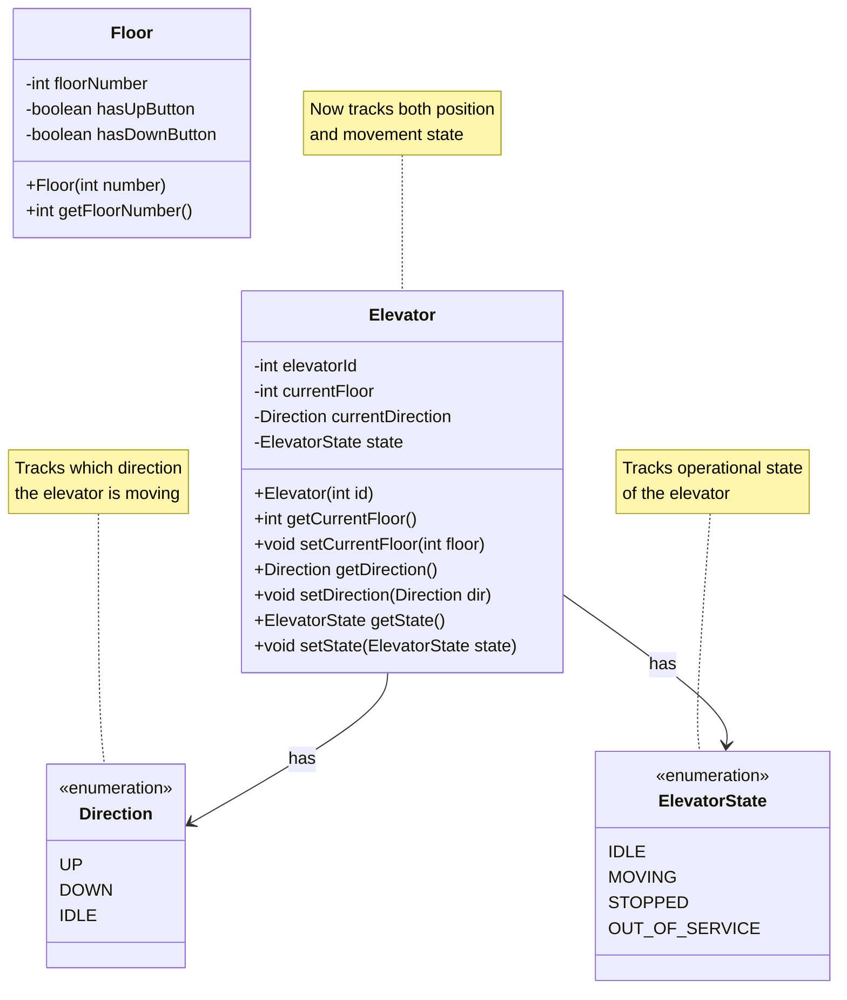
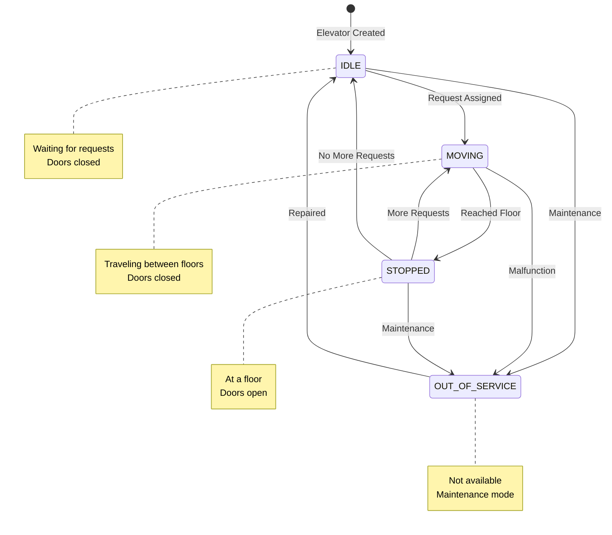
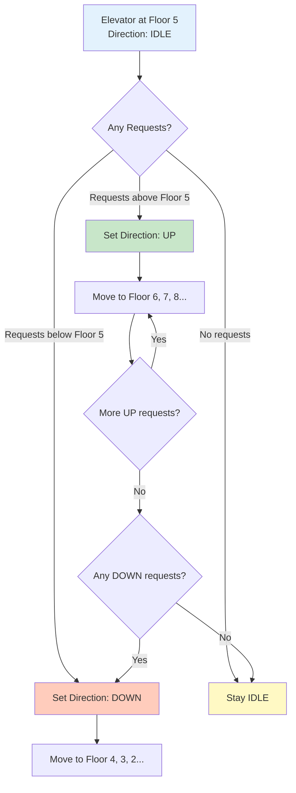

# Phase 3: Step 2 - State Management

## What Are We Adding?

In Step 1, we had basic entities: Elevator and Floor.

But an elevator isn't just a position - it has:
- **Direction**: Is it moving UP, DOWN, or IDLE?
- **State**: Is it MOVING, STOPPED, or OUT_OF_SERVICE?

We'll add these using **Enums** (enumerated types).

---

## Why Enums?

**Bad Approach** (using strings):
```java
String direction = "UP"; // What if someone types "up" or "Up"?
String state = "moving"; // Typos cause bugs!
```

**Good Approach** (using enums):
```java
Direction direction = Direction.UP; // Type-safe, no typos!
ElevatorState state = ElevatorState.MOVING; // Compiler checks!
```

**Benefits of Enums**:
1. ✅ Type safety (compiler catches errors)
2. ✅ No typos (only valid values allowed)
3. ✅ IDE autocomplete works
4. ✅ Clear, readable code

---

## Step 2: Adding State Management

### Class Diagram - Step 2



---

## What Did We Add in This Step?

### 1. Direction Enum
**Purpose**: Track which direction the elevator is moving

```java
public enum Direction {
    UP,    // Moving upward (floor numbers increasing)
    DOWN,  // Moving downward (floor numbers decreasing)
    IDLE   // Not moving, waiting for requests
}
```

**Why Three States?**
- **UP**: Processing requests for higher floors
- **DOWN**: Processing requests for lower floors
- **IDLE**: No pending requests, stationary

**Real-World Example**:
- Elevator at Floor 5, going to Floor 8 → Direction = UP
- Elevator at Floor 8, going to Floor 3 → Direction = DOWN
- Elevator at Floor 5, no requests → Direction = IDLE

---

### 2. ElevatorState Enum
**Purpose**: Track the operational state of the elevator

```java
public enum ElevatorState {
    IDLE,              // Waiting for requests, doors closed
    MOVING,            // Currently traveling between floors
    STOPPED,           // Stopped at a floor, doors open
    OUT_OF_SERVICE     // Maintenance mode, not available
}
```

**State Transitions**:
```
IDLE → MOVING (when request assigned)
MOVING → STOPPED (when reaching destination floor)
STOPPED → MOVING (after doors close, more requests)
STOPPED → IDLE (no more requests after doors close)
Any State → OUT_OF_SERVICE (for maintenance)
```

**Why Four States?**
- **IDLE**: Elevator is available but not moving
- **MOVING**: Elevator is in motion
- **STOPPED**: Elevator is at a floor with doors open
- **OUT_OF_SERVICE**: Elevator unavailable (maintenance, malfunction)

---

### 3. Updated Elevator Class

**New Attributes**:
- `currentDirection` (Direction): Which way the elevator is heading
- `state` (ElevatorState): Current operational state

**New Methods**:
- `getDirection()`: Check current direction
- `setDirection(Direction dir)`: Update direction
- `getState()`: Check current state
- `setState(ElevatorState state)`: Update state

---

## Java Code Skeleton - Step 2

### Direction Enum
```java
/**
 * Represents the direction of elevator movement.
 * Used to track which way the elevator is heading.
 */
public enum Direction {
    /**
     * Elevator is moving upward (increasing floor numbers)
     */
    UP,

    /**
     * Elevator is moving downward (decreasing floor numbers)
     */
    DOWN,

    /**
     * Elevator is not moving (no active direction)
     */
    IDLE;

    /**
     * Get the opposite direction.
     * Useful for switching direction after completing all requests.
     */
    public Direction getOpposite() {
        switch (this) {
            case UP:
                return DOWN;
            case DOWN:
                return UP;
            default:
                return IDLE;
        }
    }
}
```

### ElevatorState Enum
```java
/**
 * Represents the operational state of an elevator.
 * Defines what the elevator is currently doing.
 */
public enum ElevatorState {
    /**
     * Elevator is idle - not moving, no pending requests
     */
    IDLE,

    /**
     * Elevator is moving between floors
     */
    MOVING,

    /**
     * Elevator has stopped at a floor (doors open/opening)
     */
    STOPPED,

    /**
     * Elevator is out of service (maintenance or malfunction)
     */
    OUT_OF_SERVICE;

    /**
     * Check if elevator is available for new requests.
     * @return true if elevator can accept requests
     */
    public boolean isAvailable() {
        return this != OUT_OF_SERVICE;
    }
}
```

### Updated Elevator Class
```java
/**
 * Represents a single elevator in the building.
 * Tracks position, direction, and operational state.
 */
public class Elevator {
    // Unique identifier for this elevator
    private int elevatorId;

    // Current floor position (starts at 0 - ground floor)
    private int currentFloor;

    // Current direction of movement (UP, DOWN, or IDLE)
    private Direction currentDirection;

    // Current operational state (IDLE, MOVING, STOPPED, OUT_OF_SERVICE)
    private ElevatorState state;

    /**
     * Constructor: Create a new elevator with given ID
     * @param id Unique elevator identifier
     */
    public Elevator(int id) {
        this.elevatorId = id;
        this.currentFloor = 0;                    // Start at ground floor
        this.currentDirection = Direction.IDLE;    // Not moving initially
        this.state = ElevatorState.IDLE;          // Waiting for requests
    }

    // ========== Position Methods ==========

    public int getCurrentFloor() {
        return currentFloor;
    }

    public void setCurrentFloor(int floor) {
        this.currentFloor = floor;
    }

    public int getElevatorId() {
        return elevatorId;
    }

    // ========== Direction Methods ==========

    /**
     * Get the current direction of this elevator
     * @return Current direction (UP, DOWN, or IDLE)
     */
    public Direction getDirection() {
        return currentDirection;
    }

    /**
     * Update the elevator's direction
     * @param direction New direction
     */
    public void setDirection(Direction direction) {
        this.currentDirection = direction;
    }

    // ========== State Methods ==========

    /**
     * Get the current operational state
     * @return Current state (IDLE, MOVING, STOPPED, OUT_OF_SERVICE)
     */
    public ElevatorState getState() {
        return state;
    }

    /**
     * Update the elevator's operational state
     * @param state New state
     */
    public void setState(ElevatorState state) {
        this.state = state;
    }

    /**
     * Check if this elevator is available for new requests
     * @return true if available, false if out of service
     */
    public boolean isAvailable() {
        return state.isAvailable();
    }
}
```

---

## What Changed from Step 1?

### Changes to Elevator Class

| Before (Step 1) | After (Step 2) | Why? |
|----------------|----------------|------|
| Only `elevatorId` and `currentFloor` | Added `currentDirection` and `state` | Need to track movement and operational state |
| Just getters/setters for position | Added direction and state methods | Support state management |
| No initialization of direction/state | Initialize to IDLE in constructor | Safe default state |

### New Classes Added

1. **Direction Enum**: Type-safe direction tracking
2. **ElevatorState Enum**: Type-safe state tracking

---

## Why These Changes?

### Real-World Scenario
Imagine an elevator at Floor 5:
- Without state tracking: We don't know if it's moving, stopped, or idle
- With state tracking: We know exactly what it's doing

**Example**:
- Elevator A: Floor 5, Direction UP, State MOVING
  - Meaning: Currently moving upward, will continue up
- Elevator B: Floor 5, Direction IDLE, State IDLE
  - Meaning: Stationary, available for any request

This information helps the dispatcher choose the best elevator!

---

## Design Principles Applied

### 1. Single Responsibility Principle (SRP)
- **Direction Enum**: Only represents direction
- **ElevatorState Enum**: Only represents operational state
- **Elevator**: Combines position + direction + state (related data)

### 2. Type Safety
Using enums instead of strings/integers prevents invalid states:
```java
// WRONG - String allows any value
elevator.setDirection("upward"); // Typo! Should be "UP"

// RIGHT - Enum only allows valid values
elevator.setDirection(Direction.UP); // Compiler enforces!
```

### 3. Encapsulation
All fields remain `private`, accessed through public methods.

---

## State Transition Diagram



---

## Direction Logic Example



---

## Common Beginner Mistakes

### Mistake 1: Using Strings Instead of Enums
```java
// ❌ BAD: Prone to typos
String direction = "up"; // Should be "UP"? "Up"? "UP"?

// ✅ GOOD: Type-safe
Direction direction = Direction.UP;
```

### Mistake 2: Not Initializing State
```java
// ❌ BAD: Direction is null!
public Elevator(int id) {
    this.elevatorId = id;
    // currentDirection is null - NullPointerException!
}

// ✅ GOOD: Always initialize
public Elevator(int id) {
    this.elevatorId = id;
    this.currentDirection = Direction.IDLE; // Safe default
}
```

### Mistake 3: Mixing Direction with State
```java
// ❌ WRONG: Confusing state with direction
if (elevator.getState() == ElevatorState.UP) { ... }
// ElevatorState doesn't have UP!

// ✅ RIGHT: Separate concerns
if (elevator.getDirection() == Direction.UP) { ... }
```

---

## Design Decision Summary

| Decision | Reason |
|----------|--------|
| Use `Direction` enum | Type safety, no string typos |
| Use `ElevatorState` enum | Clear operational states |
| Initialize to IDLE | Safe default state |
| Add `getOpposite()` to Direction | Useful for reversing direction |
| Add `isAvailable()` to ElevatorState | Quick availability check |

---

## What's Still Missing?

At this stage, we still don't have:
- ❌ Requests (external/internal) - Coming in Step 3
- ❌ Movement logic (how elevator decides where to go) - Step 4
- ❌ Multiple elevator coordination - Step 5

---

## Interview Talking Points

> "Now I'll add state management. An elevator isn't just a position - it has a direction (UP, DOWN, IDLE) and an operational state (MOVING, STOPPED, IDLE, OUT_OF_SERVICE). I'm using enums for type safety instead of strings. This prevents typos and makes the code more maintainable. I'm also adding helper methods like `getOpposite()` for direction reversal."

---

**Next**: Step 3 - Request Handling (Request and RequestQueue classes)
